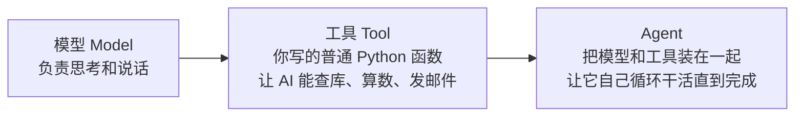
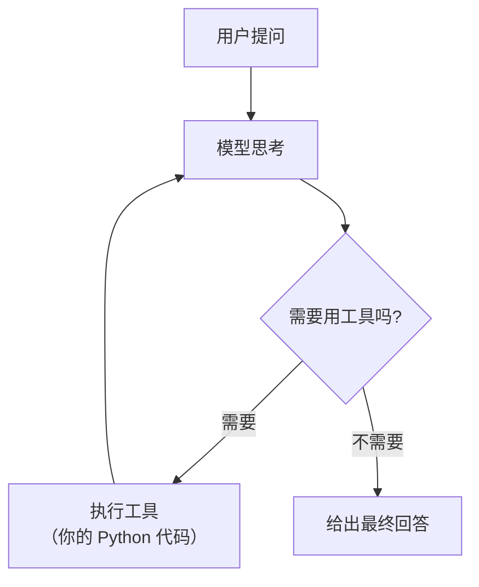
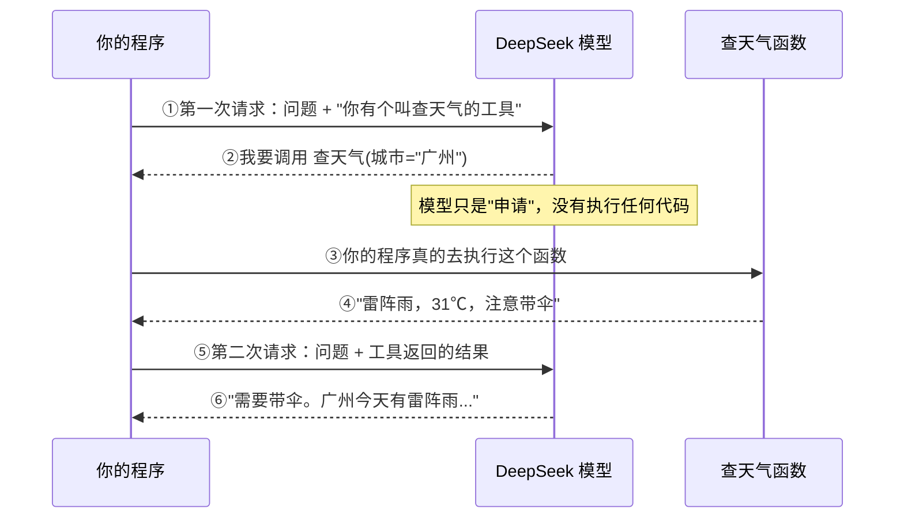

# 第 1 章　认识 LangChain，并跑出第一个程序

> 本章目标：**40 分钟内**，让你的电脑上跑出一个能自己决定"要不要查资料"的 AI 程序。
> 环境：Python 3.10+ ｜ `langchain 1.3.14` ｜ 模型用 DeepSeek

---

## 1.1 LangChain 是什么，不是什么

### 一句话

**LangChain 不是模型，它是模型的"外壳"。**

模型（DeepSeek、GPT）负责"想"，外壳负责"想之外的所有事"：怎么把提示送进去、模型说要查数据库时谁去执行、多轮对话的历史存哪、返回的文字怎么变成能入库的对象。

用你熟悉的方式类比：

| 角色 | 数据库世界 | AI 世界 |
|---|---|---|
| 底层引擎 | SQL Server | DeepSeek / GPT 模型 |
| 你直接怼引擎 | 手写 TCP 包连 1433 端口 | 手写 HTTP 请求调模型 API |
| 中间那层库 | ADO.NET / Entity Framework | **LangChain** |

你当年不会去手写 TCP 包连数据库，同理，做 AI 应用也很少有人直接手撸 HTTP。

### 不用 LangChain，你得自己做这些事

假设你要做一个"能查公司订单的问答助手"。只用 `requests` 直接调 DeepSeek 的 HTTP 接口，你需要自己写：

| # | 你要自己实现的 | LangChain 里对应什么 |
|---|---|---|
| 1 | 把对话历史组装成正确的 JSON 数组 | 消息对象（第 2 章） |
| 2 | 告诉模型"你有哪些函数可以调"，格式还得符合厂商规范 | `@tool` 装饰器（第 4 章） |
| 3 | 解析模型返回的"我要调用 `查订单(订单号='A123')`" | 自动完成 |
| 4 | 真的去执行这个函数，再把结果拼回去，再问一遍模型 | Agent 循环（第 5 章） |
| 5 | 判断它到底问完了没有，防止无限循环 | `recursion_limit`（第 5 章） |
| 6 | 把返回的文字抠成结构化数据 | `response_format`（第 6 章） |
| 7 | 多轮对话历史的存取、按用户隔离 | `checkpointer`（第 8 章） |
| 8 | 历史太长时裁剪或摘要 | 中间件（第 9 章） |
| 9 | 换个模型厂商时不用重写代码 | `init_chat_model`（第 2 章） |

第 3、4 两条是最要命的。**光是"模型要调工具 → 执行 → 把结果送回 → 再问一次"这个循环，自己写要上百行，而且每家厂商的返回格式还不一样。**

### 三个词先记住



- **模型（Model）**：会说话，但对你公司的事一无所知，也不能执行任何操作。
- **工具（Tool）**：**就是你写的普通 Python 函数**。写好后模型就能"申请"调用它。注意——模型只是申请，真正执行的永远是你的代码。
- **Agent**：把模型和工具装成一个整体，让它自己反复"想 → 用工具 → 再想"，直到把事办完。

一张图看清 Agent 干活的样子：



这个循环就是 Agent 的全部秘密。第 5 章我们会亲手把它拆开看。

### 什么情况**不要**用它

诚实劝退，省得你走弯路：

| 场景 | 建议 |
|---|---|
| 只是想让 AI 写一段文案，一次性的 | 直接用网页版聊天，别写代码 |
| 一个 `WHERE` 条件就能精确解决的查询 | 用 SQL，别用 AI。又慢又贵还可能出错 |
| 财务对账、税额计算等要求 100% 准确 | 让 AI **生成 SQL 去算**可以，让 AI 自己算不行 |
| 要求强一致性的事务判断 | 交给数据库约束 |

**LangChain 真正的用武之地是：输入是自然语言或非结构化文本（邮件、日志、文档、口述需求），且规则明确但纯手工做很枯燥、量还很大的活。**

---

## 1.2 装环境

### 第一步：确认 Python 版本

⚠️ **LangChain 1.x 要求 Python 3.10 或更高，3.9 不行**（3.9 已经到生命周期终点了）。

```bash
python --version
```

你应该看到 `Python 3.10.x` 或更高。如果低于 3.10，去 [python.org](https://www.python.org/downloads/) 装个新的（Windows 用户注意勾选 "Add Python to PATH"）。

### 第二步：用 uv 建项目

`uv` 是现在最快的 Python 包管理工具，比 pip 快很多，还顺手管虚拟环境。

**Windows（PowerShell）：**
```powershell
powershell -c "irm https://astral.sh/uv/install.ps1 | iex"
```

**macOS / Linux：**
```bash
curl -LsSf https://astral.sh/uv/install.sh | sh
```

装好后建项目：

```bash
mkdir langchain-learn
cd langchain-learn
uv venv --python 3.12          # 建虚拟环境
```

激活虚拟环境：

```bash
# Windows
.venv\Scripts\activate

# macOS / Linux
source .venv/bin/activate
```

> 💡 **虚拟环境是什么**：可以理解成"给这个项目单独开一个干净的包目录"，装什么都不会污染系统 Python，也不会和别的项目打架。命令行前面出现 `(.venv)` 就说明激活成功了。

### 第三步：装包

```bash
uv pip install langchain langchain-deepseek python-dotenv
```

三个包分别是：

| 包 | 作用 |
|---|---|
| `langchain` | 主包。会自动带上 `langchain-core`、`langgraph` 等一堆依赖 |
| `langchain-deepseek` | DeepSeek 的接入包。换别的厂商就装对应的包 |
| `python-dotenv` | 从 `.env` 文件读密钥，避免把 Key 写进代码 |

### 第四步：确认装对了

新建 `00_版本检查.py`：

```python
from importlib.metadata import version

for 包名 in ["langchain", "langchain-core", "langgraph", "langchain-deepseek"]:
    print(f"{包名:22} {version(包名)}")
```

运行：

```bash
python 00_版本检查.py
```

**实际输出**（这是我在真实环境里跑出来的，你的补丁号可能略高）：

```
langchain              1.3.14
langchain-core         1.5.1
langgraph              1.2.9
langchain-deepseek     1.1.0
```

> ⚠️ **注意 `langchain-core` 是 1.5.x，不是 1.3.x**。这两个包的版本号是各自独立演进的，很多人第一次看到会以为装错了。没错，就是这样。

### 第五步：项目目录长这样

```
langchain-learn/
├── .venv/              ← 虚拟环境（不要提交到 Git）
├── .env                ← 放 API Key（绝对不要提交到 Git！）
├── .gitignore
├── 00_版本检查.py
└── 01_连通性测试.py
```

`.gitignore` 内容：

```
.venv/
.env
__pycache__/
```

⚠️ **`.env` 一定要进 `.gitignore`**。把 API Key 提交到 GitHub 是新手最常见的事故，Key 会在几分钟内被爬走并被人拿去刷用量。

---

## 1.3 拿到 DeepSeek 的 API Key

### 为什么本教程用 DeepSeek

| 理由 | 说明 |
|---|---|
| 国内直连 | 不用配代理 |
| 便宜 | 学完这本教程的全部练习，花费大概几块钱 |
| 支持工具调用 | 这是能做 Agent 的硬前提，不是所有便宜模型都支持 |
| 上下文很大 | 实测 `max_input_tokens: 1000000`，塞长文档不心慌 |

⚠️ **一个要提前知道的限制**：`deepseek-chat` **不接受图片输入**（实测 `image_inputs: False`）。所以"扫描件识别""发票拍照录入"这类需求，要么先用 OCR 转成文字再交给它，要么那一步换成支持视觉的模型。其他文本类工作它都够用。

另外，需要模型输出推理过程时，用 `deepseek-reasoner` 而不是 `deepseek-chat`。

### 拿 Key 的步骤

1. 打开 [platform.deepseek.com](https://platform.deepseek.com/)，注册登录
2. 左侧「API keys」→ 创建新的 key
3. **立刻复制保存**——页面关掉就再也看不到了，只能重新建
4. 到「充值」里充最小金额（学习够用很久）

### 把 Key 写进 `.env`

在项目根目录建 `.env` 文件：

```
DEEPSEEK_API_KEY=sk-你的真实key粘贴在这里
```

注意：
- 等号两边**不要加空格**
- 值**不要加引号**
- 这个文件**不要提交 Git**

### 换成别的模型怎么办

三种选择，改动都很小：

| 想用 | 装什么包 | 代码里怎么写 | `.env` 里的键 |
|---|---|---|---|
| **DeepSeek**（本教程） | `langchain-deepseek` | `init_chat_model("deepseek:deepseek-chat")` | `DEEPSEEK_API_KEY` |
| OpenAI | `langchain-openai` | `init_chat_model("openai:gpt-4o-mini")` | `OPENAI_API_KEY` |
| Ollama（本地离线，不花钱） | `langchain-ollama` | `init_chat_model("ollama:qwen2.5")` | 不需要 Key |

**全书代码只有模型那一行不同，其他一模一样**——这正是 LangChain 的价值之一。其他厂商（通义、Kimi、智谱）的写法见附录 B。

---

## 1.4 第一个程序：连通性测试

先别急着做 Agent。第一步只确认一件事：**你的电脑能不能成功跟模型说上话。**

新建 `01_连通性测试.py`：

```python
from dotenv import load_dotenv
from langchain.chat_models import init_chat_model

# 1. 把 .env 里的 DEEPSEEK_API_KEY 读进环境变量
load_dotenv()

# 2. 连上模型。格式是 "厂商:模型名"
模型 = init_chat_model("deepseek:deepseek-chat")

# 3. 问一句话
回复 = 模型.invoke("用一句话介绍你自己")

# 4. 取出文字。注意 .text 后面没有括号！
print(回复.text)
```

运行：

```bash
python 01_连通性测试.py
```

**你应该看到类似这样的输出**（模型每次措辞不同，内容不会完全一致）：

```
我是 DeepSeek Chat，一个由深度求索公司开发的智能助手，可以帮你解答问题、处理文字工作。
```

看到中文输出，说明**环境、Key、网络全都通了**。这一步过了，后面就顺了。跑不通请直接跳到 1.6 节对号入座。

### 逐行拆解

```python
load_dotenv()
```
读取 `.env` 文件，把里面的键值塞进环境变量。之后 `langchain-deepseek` 会自动去环境变量里找 `DEEPSEEK_API_KEY`——**所以你的代码里从头到尾不会出现密钥字符串**。

```python
模型 = init_chat_model("deepseek:deepseek-chat")
```
`"厂商:模型名"` 这个格式是 LangChain 的统一入口。想换 OpenAI 就改成 `"openai:gpt-4o-mini"`，下面的代码一行都不用动。

```python
回复 = 模型.invoke("用一句话介绍你自己")
```
`invoke` 就是"调用一次"。传字符串是最简写法，LangChain 内部会自动包装成一条用户消息。

```python
print(回复.text)
```
`回复` 不是字符串，是一个 `AIMessage` 对象，里面除了文字还装着 token 用量等信息（第 2 章细讲）。

⚠️ **这里有个 1.x 的坑**：`.text` 现在是**属性**，不是方法。老教程里写的 `.text()` 虽然还能用，但会打出警告——我实测到的原文是：

```
LangChainDeprecationWarning: Calling .text() as a method is deprecated.
Use .text as a property instead (e.g., message.text).
```

**记住：`.text` 不加括号。**

---

## 1.5 第一个 Agent：会自己查东西的程序

上面那个程序只会聊天。现在给它装上"手脚"。

新建 `02_第一个Agent.py`：

```python
from dotenv import load_dotenv
from langchain.agents import create_agent
from langchain.tools import tool

load_dotenv()


# ── 第一步：写一个工具。它就是个普通函数 ──────────────────
@tool
def 查天气(城市: str) -> str:
    """查询指定城市今天的天气情况。城市名用中文，例如：上海。"""
    # 演示用的假数据。真实项目里这里就是调你公司的 API 或查数据库
    天气表 = {
        "上海": "晴，28℃，东南风 3 级",
        "北京": "多云，24℃，空气质量良",
        "广州": "雷阵雨，31℃，注意带伞",
    }
    return 天气表.get(城市, f"抱歉，没有 {城市} 的天气数据")


# ── 第二步：把模型和工具装成一个 Agent ────────────────────
助手 = create_agent(
    model="deepseek:deepseek-chat",       # 用哪个模型
    tools=[查天气],                        # 它能用哪些工具
    system_prompt="你是一个简洁的天气助手，回答不超过两句话。",
)

# ── 第三步：提问 ─────────────────────────────────────────
结果 = 助手.invoke({
    "messages": [{"role": "user", "content": "广州今天要带伞吗？"}]
})

# ── 第四步：取最后一条消息，就是最终答案 ──────────────────
print(结果["messages"][-1].text)
```

运行后你会看到类似：

```
需要带伞。广州今天有雷阵雨，气温 31℃。
```

**请留意这里发生了什么**：你问的是"要带伞吗"，天气数据里写的是"雷阵雨，注意带伞"。模型自己决定了要去调 `查天气("广州")`，拿到结果后再判断出"需要带伞"。**这个决策过程你一行代码都没写。**

### 这一次调用，背后实际发生了什么



**关键认知**：这一次 `invoke` 实际发了 **两次** 网络请求（所以也花了两次的钱）。工具越多、来回越多，费用就越高——第 12 章会讲怎么控制。

再强调一遍最容易误解的点：**模型没有执行任何代码，它只是返回了一段"我想调用这个函数、参数是这些"的结构化数据。真正执行的是你自己的 Python 进程。** 这意味着安全边界完全在你手里——你不给它工具，它什么也做不了。

### 把中间过程全打印出来

把最后一行换成：

```python
for i, 消息 in enumerate(结果["messages"], 1):
    print(f"{i}. [{type(消息).__name__}] {消息.text}")
    if getattr(消息, "tool_calls", None):
        print(f"    ↳ 申请调用: {消息.tool_calls}")
```

输出会是这样的四条：

```
1. [HumanMessage] 广州今天要带伞吗？
2. [AIMessage]
    ↳ 申请调用: [{'name': '查天气', 'args': {'城市': '广州'}, 'id': 'call_0_xxx', 'type': 'tool_call'}]
3. [ToolMessage] 雷阵雨，31℃，注意带伞
4. [AIMessage] 需要带伞。广州今天有雷阵雨，气温 31℃。
```

四种消息类型对应四个角色：

| 消息类型 | 谁说的 | 内容 |
|---|---|---|
| `HumanMessage` | 你 | 原始问题 |
| `AIMessage` | 模型 | **注意第 2 条的文字是空的**——这一轮它只申请调工具，没说话 |
| `ToolMessage` | 你的程序 | 工具的执行结果 |
| `AIMessage` | 模型 | 看完工具结果后的最终回答 |

> 💡 **一个我实测确认的细节**：`system_prompt` **不会**出现在 `messages` 列表里。它每次请求时被送给模型，但不占用对话历史的位置。所以你在 `messages` 里只看到 4 条，不是 5 条。

### 逐行拆解

```python
@tool
def 查天气(城市: str) -> str:
    """查询指定城市今天的天气情况。城市名用中文，例如：上海。"""
```

这三行信息量最大：

| 元素 | 模型看到的是什么 | 重要性 |
|---|---|---|
| 函数名 `查天气` | 工具的名字 | 模型靠它判断该不该用 |
| 类型标注 `城市: str` | 参数名和类型 | **必须写**，不写模型不知道要传什么 |
| docstring | 工具的用途说明 | **必须写**，这是给模型看的说明书 |

我实测打印了一下 LangChain 从这个函数里提取出来的东西：

```
工具名: 查天气
描述: 查询指定城市今天的天气情况。城市名用中文，例如：上海。
入参 schema: {'城市': {'title': '城市', 'type': 'string'}}
```

**结论：docstring 不是写给同事看的注释，是写给模型看的 API 文档。** 写得含糊，模型就选错工具或传错参数。这是第 4 章的核心内容。

```python
助手 = create_agent(model=..., tools=[...], system_prompt=...)
```

`create_agent` 是 LangChain 1.x 里创建 Agent 的**唯一推荐方式**。

⚠️ 如果你在网上看到 `initialize_agent`、`AgentExecutor`、`create_react_agent`，那都是 0.x 时代的写法，**在 1.3 里跑不通**。判断一份教程是否过时，看这一行就够了。

```python
结果 = 助手.invoke({"messages": [{"role": "user", "content": "..."}]})
```

Agent 的入参不是字符串，而是一个带 `messages` 列表的字典（因为 Agent 要处理多轮对话）。`role` 可以是 `user` / `assistant` / `system`。

```python
print(结果["messages"][-1].text)
```

`结果` 是个字典，我实测确认它只有一个键：`messages`。`[-1]` 取最后一条，就是最终答案。

---

## 1.6 四个必踩的报错

按报错原文对号入座。

### ① `ModuleNotFoundError: No module named 'langchain'`

```
Traceback (most recent call last):
  File "01_连通性测试.py", line 2, in <module>
    from langchain.chat_models import init_chat_model
ModuleNotFoundError: No module named 'langchain'
```

**病因**：虚拟环境没激活，或者装包时装到别的 Python 里去了。

**解法**：
1. 看命令行提示符前面有没有 `(.venv)`，没有就先激活
2. 确认装包和跑脚本用的是同一个 Python：
   ```bash
   python -c "import sys; print(sys.executable)"
   ```
   打印出的路径应该包含你项目里的 `.venv`

另一种变体是 `No module named 'langchain_deepseek'`——单独装一下：`uv pip install langchain-deepseek`。

### ② Key 没生效

```
openai.AuthenticationError: Error code: 401 - {'error': {'message': 'Authentication Fails, Your api key is invalid'}}
```

或者：

```
ValueError: Did not find deepseek_api_key, please add an environment variable
`DEEPSEEK_API_KEY` which contains it, or pass `api_key` as a named parameter.
```

**病因与自查顺序**：

| 检查项 | 常见错误 |
|---|---|
| 有没有调 `load_dotenv()` | 忘了写，或者写在 `init_chat_model` 后面 |
| `.env` 的位置 | 必须在**你运行命令的那个目录**，不是脚本所在目录 |
| 键名拼写 | 必须是 `DEEPSEEK_API_KEY`，大小写和下划线都不能错 |
| 格式 | `KEY=值`，等号两边**没有空格**，值**没有引号** |
| Key 本身 | 有没有复制全？开头是 `sk-`。账户有没有余额？ |

快速验证 Key 到底读进来没有：

```python
import os
from dotenv import load_dotenv
load_dotenv()
k = os.getenv("DEEPSEEK_API_KEY")
print("读到了：", (k[:6] + "..." + k[-4:]) if k else "❌ 没读到")
```

> ⚠️ 别整个打印出来，也别在有别人的场合打印——这是密钥。

### ③ 模型名无效

```
openai.NotFoundError: Error code: 404 - {'error': {'message': 'Model Not Exist'}}
```

**病因**：模型名写错了。DeepSeek 目前常用的两个是：

| 模型名 | 用途 |
|---|---|
| `deepseek-chat` | 通用对话，**本教程默认用这个** |
| `deepseek-reasoner` | 需要输出推理过程时用 |

⚠️ 还有一种情况是**前缀写错**：`init_chat_model("deepseek-chat")` 少了厂商前缀，LangChain 猜不出来该用哪个包。正确写法是 `"deepseek:deepseek-chat"`。

### ④ 网络超时 / 代理问题

```
httpx.ConnectTimeout: timed out
```
或
```
httpx.ProxyError: Cannot connect to proxy
```

**病因与解法**：

- 用了 VPN 或系统代理，但代理不通 DeepSeek → 把代理关掉试试（DeepSeek 国内直连，不需要代理）
- 公司网络限制外网 → 找网管开白名单，或先用 Ollama 在本机跑模型学习
- 网络就是慢 → 把超时设长一点：
  ```python
  模型 = init_chat_model("deepseek:deepseek-chat", timeout=60)
  ```

> 💡 如果你所在的网络环境实在受限，可以先装 [Ollama](https://ollama.com/)，`ollama pull qwen2.5`，然后把模型那行换成 `init_chat_model("ollama:qwen2.5")`。完全离线、不花钱，本教程前 9 章的代码都能跑（第 10 章的 RAG 会慢一些）。

---

## 1.7 动手练习

**练习 1（必做）**：把 `查天气` 换成 `查汇率`，让它能回答"100 美元换多少人民币"。

<details>
<summary>参考答案</summary>

```python
@tool
def 查汇率(货币代码: str) -> str:
    """查询指定外币兑人民币的今日汇率。货币代码用大写字母，例如：USD、EUR、JPY。"""
    汇率表 = {"USD": 7.18, "EUR": 7.82, "JPY": 0.047}
    汇率 = 汇率表.get(货币代码.upper())
    if 汇率 is None:
        return f"没有 {货币代码} 的汇率数据"
    return f"1 {货币代码.upper()} = {汇率} 人民币"


助手 = create_agent(
    model="deepseek:deepseek-chat",
    tools=[查汇率],
    system_prompt="你是汇率助手。需要换算时先查汇率再计算，把计算过程写出来。",
)

结果 = 助手.invoke({"messages": [{"role": "user", "content": "100 美元换多少人民币？"}]})
print(结果["messages"][-1].text)
```

⚠️ 注意最后的乘法是模型自己算的，**小数多的时候它可能算错**。生产环境的正确做法是：再给它一个"计算"工具，或者干脆让工具直接返回换算结果。这个坑第 4 章会专门讲。

</details>

**练习 2（推荐）**：同时挂上 `查天气` 和 `查汇率` 两个工具，然后问一个**跟两者都无关**的问题（比如"你好"），看它会不会乱调工具。再问"上海天气怎么样，另外 50 欧元是多少钱"，看它会不会**连着调两个工具**。

**练习 3（思考）**：如果 `查天气` 的 docstring 改成 `"""查询。"""`，你觉得会发生什么？改一下试试。

---

## 1.8 本章速查卡

```python
# 最小可用模板 —— 抄这个开头就行
from dotenv import load_dotenv
from langchain.agents import create_agent
from langchain.tools import tool

load_dotenv()

@tool
def 工具名(参数: str) -> str:
    """一句话说清这个工具干什么、参数是什么格式。"""   # ← 给模型看的
    return "结果"

助手 = create_agent(
    model="deepseek:deepseek-chat",
    tools=[工具名],
    system_prompt="你的角色和行为约束。",
)

结果 = 助手.invoke({"messages": [{"role": "user", "content": "问题"}]})
print(结果["messages"][-1].text)
```

| 要点 | 记住 |
|---|---|
| Python 版本 | **3.10+**，3.9 不行 |
| 模型写法 | `"厂商:模型名"`，如 `"deepseek:deepseek-chat"` |
| 取文字 | `.text` **不加括号** |
| Agent 入参 | `{"messages": [{"role": "user", "content": "..."}]}` |
| 取最终答案 | `结果["messages"][-1].text` |
| 工具三要素 | 函数名 + 类型标注 + docstring，缺一不可 |
| 谁执行工具 | **你的代码**，不是模型 |
| 密钥 | 放 `.env`，`.env` 进 `.gitignore` |
| 过时标志 | 看到 `initialize_agent` / `AgentExecutor`，说明那份教程是 0.x 的 |

---

## 📌 本章一句话总结

**Agent = 模型 + 你的工具 + 一个自动循环；模型只负责决定"用哪个工具、传什么参数"，执行永远是你的代码。**

---

下一章：[第 2 章　模型与消息](第02章-模型与消息.md) —— 搞清楚 `invoke` 返回的那个对象里到底装了什么，以及怎么看这次调用花了多少钱。
