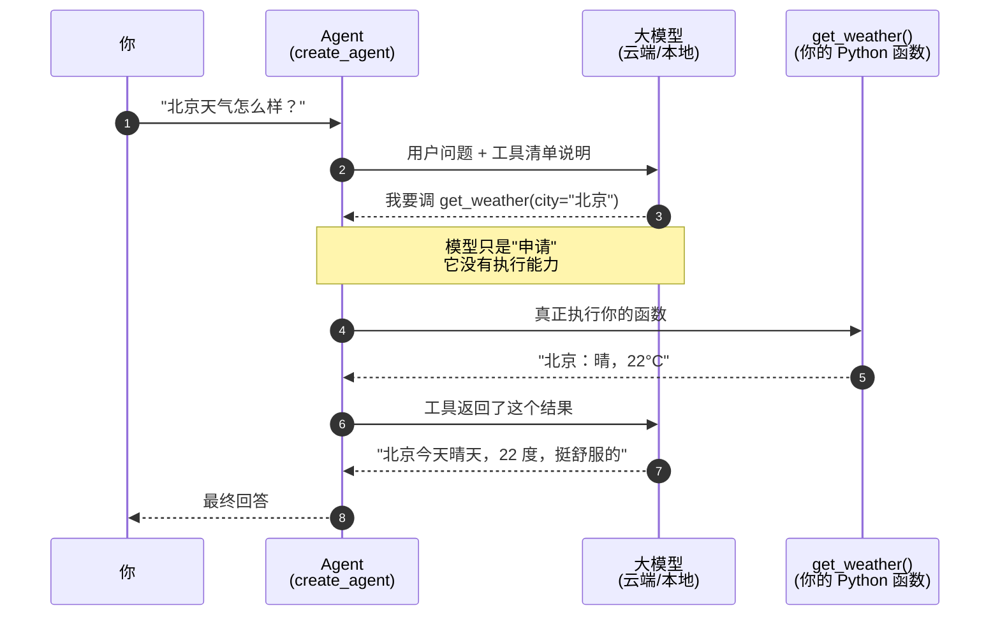

# 第 1 章 认识 LangChain，并跑出第一个程序

> 本章目标：40 分钟内，让一个 AI 自己决定「我要查天气」，然后调用你写的 Python 函数，再把结果说成人话。
>
> 前置要求：会装 Python 包、会写函数。不需要任何 AI 背景。

---

## 1.1 LangChain 是什么、不是什么（一页说完）

### 是什么

大模型本身只会一件事：**给它一段文字，它续写一段文字**。仅此而已。它不能查数据库、不能调 API、不记得你上一句说了什么。

LangChain 干的事，是在这个「只会说话的大脑」外面套一层壳，让它能：

| 能力 | 没有 LangChain 时你要自己写 | LangChain 给你的 |
| --- | --- | --- |
| 换模型 | 每家 SDK 参数都不同，改一次动一片 | `init_chat_model("模型名")` 一行切换 |
| 调工具 | 手写 function-calling 的 JSON 协议、解析、分发 | `@tool` 装饰器 + 自动分发 |
| 循环决策 | 手写 while 循环判断「模型是不是还想调工具」 | `create_agent()` 帮你循环 |
| 记住对话 | 自己存数组、自己截断、自己拼回去 | `checkpointer` + `thread_id` |
| 读你的文档 | 自己切分、算向量、存库、检索 | 一整套 RAG 组件 |

一句话：**LangChain 是「大模型应用的脚手架」，不是模型本身。**

### 不是什么

新手最容易误解的四点，现在说清楚，能省你好几个小时：

1. **它不是模型。** 你还是要有 OpenAI / DeepSeek 的 API Key，或者本地跑 Ollama。LangChain 一行模型代码都不含。
2. **它不会让笨模型变聪明。** 如果模型能力不够，工具照样选错。换模型比调提示词有效得多。
3. **它不是「必须用」的。** 简单的单轮问答，直接调官方 SDK 更省事。LangChain 的价值在**多工具 + 多轮 + 要换模型**的场景。
4. **1.x 和 0.x 是两套东西。** 你在网上搜到的 `AgentExecutor`、`LLMChain`、`ConversationBufferMemory` 在 1.3 里全都不能用了。看到这些关键词，直接跳过那篇文章。

### 🧱 C#/SQL 类比

- LangChain ≈ **ORM（如 Entity Framework）**。数据库（模型）不是它提供的，它提供的是统一访问方式 + 一堆常用套路。你也可以裸写 SQL（裸调 SDK），只是麻烦。
- `create_agent` ≈ **一个带重试的工作流引擎**。给它一堆可执行动作（工具），它自己决定调哪个、调几次。
- `@tool` ≈ **暴露给外部的存储过程**。函数签名和注释就是「接口文档」，只不过读文档的是模型而不是人。

---

## 1.2 装环境

### 第一步：确认 Python 版本

```bash
python --version
```

需要 **3.10 或更高**。低于 3.10 的直接去 [python.org](https://www.python.org/downloads/) 装新的，别折腾兼容。

### 第二步：装 uv（推荐）

`uv` 是目前最快的 Python 包管理器，比 pip 快一个数量级，而且自带虚拟环境管理。

```bash
# Windows (PowerShell)
powershell -ExecutionPolicy ByPass -c "irm https://astral.sh/uv/install.ps1 | iex"

# macOS / Linux
curl -LsSf https://astral.sh/uv/install.sh | sh
```

装完重开一个终端，验证：

```bash
uv --version
```

> **不想装 uv？** 完全可以。后面所有 `uv add X` 都换成 `pip install X`，`uv run script.py` 换成 `python script.py`。只是慢一些。

### 第三步：建项目

```bash
mkdir langchain-learn
cd langchain-learn
uv init --python 3.12
```

### 第四步：装包

**三条路线选一条**，别全装：

```bash
# 路线 A：OpenAI（最稳，需要国外支付方式）
uv add langchain langchain-openai python-dotenv

# 路线 B：DeepSeek（国内首选，便宜，支持支付宝）
uv add langchain langchain-deepseek python-dotenv

# 路线 C：Ollama（完全离线，不花钱，但要 8G+ 内存）
uv add langchain langchain-ollama python-dotenv
```

装完确认版本对得上：

```bash
uv run python -c "import langchain; print(langchain.__version__)"
```

应该输出 `1.3.x`。如果是 `0.3.x`，说明装到旧版了，执行 `uv add "langchain>=1.3,<2"` 强制升级。

### 第五步：`.env` 存 Key

在项目根目录建 `.env` 文件：

```env
# 路线 A 用这个
OPENAI_API_KEY=sk-xxxxxxxxxxxxxxxx

# 路线 B 用这个
DEEPSEEK_API_KEY=sk-xxxxxxxxxxxxxxxx

# 路线 C 不需要 Key
```

⚠️ **同时建一个 `.gitignore`**，第一行就写 `.env`。API Key 泄露到 GitHub 上会被人在几分钟内扫到并刷爆你的额度，这不是危言耸听。

```gitignore
.env
__pycache__/
.venv/
*.db
```

---

## 1.3 模型三选一

三条路线的代码差异**只有两行**，其余完全一致。先看对比表，选好你的那一行：

| | 装的包 | 环境变量 | `init_chat_model` 写法 | 成本 | 网络 |
| --- | --- | --- | --- | --- | --- |
| **OpenAI** | `langchain-openai` | `OPENAI_API_KEY` | `"openai:gpt-4o-mini"` | 很低（约 ¥1/百万输入 token） | 国内需代理 |
| **DeepSeek** | `langchain-deepseek` | `DEEPSEEK_API_KEY` | `"deepseek:deepseek-chat"` | 极低 | 国内直连 |
| **Ollama** | `langchain-ollama` | 无 | `"ollama:qwen3:8b"` | 免费 | 完全本地 |

### Ollama 额外准备

如果你选了路线 C，需要先把 Ollama 服务和模型准备好：

```bash
# 1. 去 https://ollama.com/download 下载安装
# 2. 拉一个支持工具调用的模型（重要！）
ollama pull qwen3:8b
# 3. 确认服务在跑
ollama list
```

⚠️ **不是所有本地模型都支持工具调用。** 本章后面的天气 Agent 需要模型会 function calling。已知可用的小模型：`qwen3:8b`、`qwen2.5:7b`、`llama3.1:8b`。像 `gemma:2b` 这类不支持，会直接失败。

---

## 1.4 二十行代码：一个会查天气的 Agent

### 🖼 图解：这段代码到底在干什么



**最关键的一点**（第 4 章会详细展开）：模型**永远不会**执行你的代码。它只输出一个「我想调用这个函数、参数是这些」的结构化请求，真正的 `get_weather()` 调用是 LangChain 在你自己的进程里做的。

这个设计的安全含义很重要：模型能做什么，完全取决于你给了它哪些工具。

### 💻 完整代码

新建 `hello_agent.py`：

```python
"""第一个 LangChain Agent：会自己决定查天气。

运行：uv run hello_agent.py
"""

from dotenv import load_dotenv
from langchain.agents import create_agent
from langchain_core.tools import tool

# 从 .env 读取 API Key，塞进环境变量。
# 必须在创建模型之前调用，否则模型初始化时读不到 Key。
load_dotenv()


# ---------- 第一步：定义工具 ----------
# @tool 装饰器把普通函数变成"模型可以申请调用的工具"。
# ⚠️ 下面三样东西都是给模型看的，不是给人看的注释：
#    1. 函数名 get_weather —— 模型靠它判断"这是干什么的"
#    2. 类型标注 city: str —— 模型靠它知道要传什么参数
#    3. docstring —— 模型靠它判断"什么时候该用这个工具"
@tool
def get_weather(city: str) -> str:
    """查询指定城市当前的天气情况。

    Args:
        city: 城市名称，例如"北京""上海"。
    """
    # 真实项目里这里会调气象 API。
    # 教学阶段先用假数据，把流程跑通比接真接口重要。
    fake_data = {
        "北京": "晴，22°C，微风",
        "上海": "多云，26°C，湿度较高",
        "广州": "雷阵雨，30°C，注意带伞",
    }
    return fake_data.get(city, f"抱歉，暂时查不到{city}的天气数据")


# ---------- 第二步：创建 Agent ----------
agent = create_agent(
    # 三选一，把你那行的注释去掉即可
    model="deepseek:deepseek-chat",   # 路线 B：DeepSeek
    # model="openai:gpt-4o-mini",     # 路线 A：OpenAI
    # model="ollama:qwen3:8b",        # 路线 C：本地 Ollama
    tools=[get_weather],
    system_prompt="你是一个简洁的天气助手。回答控制在两句话以内，用中文。",
)


# ---------- 第三步：调用 ----------
if __name__ == "__main__":
    result = agent.invoke(
        {"messages": [{"role": "user", "content": "北京天气怎么样？适合出门吗？"}]}
    )

    # result 是一个 dict，最终答案在 messages 列表的最后一条
    # ⚠️ .text 是属性，不是方法，不要写成 .text()
    print(result["messages"][-1].text)
```

运行：

```bash
uv run hello_agent.py
```

预期输出（每次措辞会略有不同，这是正常的）：

```
北京今天晴天，22°C 微风，非常适合出门。建议穿件薄外套。
```

**跑通了吗？** 如果报错，直接跳到本章 ⚠️ 小节，四个常见错误都在那里。

---

## 1.5 🔍 拆解运行结果：`result` 里到底有什么

上面只打印了最后一句话，但 `result` 里藏着完整的执行过程。这是你以后调试的主要依据，现在就要看懂。

把 `print` 换成这样：

```python
result = agent.invoke(
    {"messages": [{"role": "user", "content": "北京天气怎么样？适合出门吗？"}]}
)

print(f"总共产生了 {len(result['messages'])} 条消息\n")
for i, msg in enumerate(result["messages"], 1):
    print(f"--- 第 {i} 条：{type(msg).__name__} ---")
    print(msg.text or "(无文本内容)")
    # 只有 AIMessage 才可能有 tool_calls
    if calls := getattr(msg, "tool_calls", None):
        print(f"申请调用：{calls}")
    print()
```

输出（我加了中文批注）：

```
总共产生了 4 条消息

--- 第 1 条：HumanMessage ---          ← 你的问题
北京天气怎么样？适合出门吗？

--- 第 2 条：AIMessage ---             ← 模型第一次回复：不说话，只申请调工具
(无文本内容)
申请调用：[{'name': 'get_weather', 'args': {'city': '北京'},
           'id': 'call_0_a1b2c3d4', 'type': 'tool_call'}]

--- 第 3 条：ToolMessage ---           ← 你的函数真实返回值
晴，22°C，微风

--- 第 4 条：AIMessage ---             ← 模型看到工具结果后，组织成人话
北京今天晴天，22°C 微风，非常适合出门。建议穿件薄外套。
```

### 四种消息，四个角色

| 类型 | 谁产生的 | 作用 | 记住这个 |
| --- | --- | --- | --- |
| `HumanMessage` | 你 | 用户输入 | 对话的起点 |
| `AIMessage` | 模型 | 回答**或**工具调用申请 | `tool_calls` 非空说明它要调工具 |
| `ToolMessage` | LangChain | 工具的真实执行结果 | 一定和某个 `tool_call.id` 配对 |
| `SystemMessage` | 你 | 全局指令（本例由 `system_prompt` 生成，不出现在返回列表里） | 优先级最高 |

### 几个关键字段

```python
last = result["messages"][-1]

last.text            # 纯文本内容，字符串。⚠️ 属性，不加括号
last.tool_calls      # 工具调用列表，最终回答时为空 []
last.usage_metadata  # token 用量，形如 {'input_tokens': 156, 'output_tokens': 34, 'total_tokens': 190}
last.id              # 这条消息的唯一 ID
last.response_metadata  # 原始返回里的其他信息（模型名、finish_reason 等）
```

`usage_metadata` 就是你算钱的依据，第 12 章会用它做成本核算。

> **为什么是 4 条而不是 2 条？** 因为 Agent 内部跑了两轮模型调用：第一轮决定「要查天气」，第二轮把查到的数据组织成回答。也就是说这次请求你付了两次 token 费。这是 Agent 的固有成本，第 12 章讲怎么压。

---

## 1.6 🧱 C#/SQL 类比：把新概念挂到你已知的东西上

| LangChain 概念 | C# / SQL 里的对应物 | 相同点 | 不同点 |
| --- | --- | --- | --- |
| `@tool` 函数 | **存储过程** | 都是「暴露一个带签名的可调用单元」 | 调用方是模型，所以 docstring 比参数名更重要 |
| `create_agent` | **带重试的工作流引擎**（如 Hangfire + 状态机） | 都是「循环执行直到完成」 | 下一步做什么由模型决定，不是你写死的 |
| `system_prompt` | **全局配置 / 基类约束** | 都是「对所有请求生效的规则」 | 它是建议不是强制，模型可能违反 |
| 中间件（第 9 章） | **ASP.NET 的 HttpModule / 中间件管道** | 都是「在主流程前后插钩子」 | 几乎一模一样，第 9 章你会觉得很亲切 |
| `checkpointer`（第 8 章） | **Session 状态存储** | 都是「按 ID 存取会话数据」 | 存的是完整消息列表，不是键值对 |
| 向量检索（第 10 章） | **`WHERE content LIKE '%关键词%'` 的语义版** | 都是「找相关内容」 | 按意思匹配，不是按字面。搜「怎么请假」能命中「休假申请流程」 |

最后一条特别值得记：**向量检索 ≈ 语义 LIKE**。你不用懂什么是余弦相似度，就当成一个「懂人话的模糊查询」，第 10 章绝大部分内容就通了。

---

## ⚠️ 新手四个必踩报错

我把真实报错原文贴出来，方便你直接搜。

### 报错 1：模块找不到

```
ModuleNotFoundError: No module named 'langchain_deepseek'
```

或者更隐蔽的这个：

```
ImportError: cannot import name 'create_agent' from 'langchain.agents'
```

**原因**：
- 第一种：模型提供商包没装。`langchain` 主包不包含任何提供商实现。
- 第二种：装的是 0.x 版本。`create_agent` 是 1.x 才有的。

**解法**：

```bash
# 确认版本
uv run python -c "import langchain; print(langchain.__version__)"

# 如果不是 1.3.x，强制升级
uv add "langchain>=1.3,<2"

# 补装提供商包
uv add langchain-deepseek   # 换成你实际用的
```

> **额外的坑**：如果你在 VS Code 里跑，可能装包装到了系统 Python，运行却用的虚拟环境（或者反过来）。用 `uv run` 而不是直接 `python` 能避开这个问题。

### 报错 2：Key 没生效

```
openai.OpenAIError: The api_key client option must be set either by passing
api_key to the client or by setting the OPENAI_API_KEY environment variable
```

**四个可能原因，按概率排序**：

1. **忘了调 `load_dotenv()`**，或者调用位置在 `create_agent()` 之后。必须在最前面。
2. **`.env` 不在当前工作目录**。`load_dotenv()` 默认从当前目录往上找。用 `load_dotenv(verbose=True)` 会打印它找到了哪个文件。
3. **变量名写错了**。DeepSeek 要的是 `DEEPSEEK_API_KEY`，不是 `DEEPSEEK_KEY` 也不是 `OPENAI_API_KEY`。
4. **`.env` 里加了引号或空格**。正确写法是 `OPENAI_API_KEY=sk-xxx`，不要写成 `OPENAI_API_KEY = "sk-xxx"`。

**快速定位**：

```python
import os
from dotenv import load_dotenv

load_dotenv(verbose=True)  # 会打印读取到的 .env 路径

key = os.getenv("DEEPSEEK_API_KEY")
if not key:
    print("❌ Key 没读到")
else:
    print(f"✅ Key 已读到，开头 {key[:8]}...，长度 {len(key)}")
```

⚠️ 打印 Key 时**只打印前几位**。完整 Key 打到日志里，和写在代码里一样危险。

### 报错 3：模型名无效

```
openai.NotFoundError: Error code: 404 - {'error': {'message':
'The model `gpt-5-turbo` does not exist or you do not have access to it'}}
```

或者 Ollama 的版本：

```
ollama._types.ResponseError: model "qwen3" not found, try pulling it first
```

**原因**：模型名拼错，或者你的账号没有该模型权限，或者本地没拉过这个模型。

**解法**：
- 云端模型：去提供商控制台看**可用模型列表**，照抄。别凭印象写。
- Ollama：先 `ollama list` 看本地有什么，注意**标签也是名字的一部分**——`qwen3:8b` 和 `qwen3` 是两个不同的名字。

**`init_chat_model` 的字符串格式**是 `"提供商:模型名"`：

```python
"openai:gpt-4o-mini"       # ✅
"deepseek:deepseek-chat"   # ✅
"ollama:qwen3:8b"          # ✅ 第二个冒号属于模型名，这样写是对的
"gpt-4o-mini"              # ⚠️ 能猜出提供商，但显式写更保险
```

### 报错 4：代理超时

```
httpx.ConnectTimeout: timed out
```

或者：

```
openai.APIConnectionError: Connection error.
```

**原因**：国内直连 OpenAI 基本不通。

**三个解法，从省事到麻烦**：

**方案一：换 DeepSeek**（推荐新手）。国内直连，API 格式和 OpenAI 兼容，改一行模型名的事。

**方案二：设代理**。在 `.env` 里加：

```env
HTTP_PROXY=http://127.0.0.1:7890
HTTPS_PROXY=http://127.0.0.1:7890
```

端口换成你自己代理软件的。`load_dotenv()` 会把它们变成环境变量，`httpx` 自动识别。

**方案三：用中转服务**。设置自定义 base_url：

```python
from langchain.chat_models import init_chat_model

model = init_chat_model(
    "openai:gpt-4o-mini",
    base_url="https://你的中转地址/v1",
    api_key="你的中转 Key",
)
agent = create_agent(model=model, tools=[get_weather])
```

⚠️ 中转服务能看到你发的全部内容。别把公司数据、客户信息发给来源不明的中转站。

---

## 🎯 动手练习

### 练习 1（必做）：加一个工具

给 Agent 再加一个「查空气质量」的工具，然后问它「北京今天适合跑步吗？」，看它是否会**连续调用两个工具**。

提示：新函数照抄 `get_weather` 的结构，然后 `tools=[get_weather, get_air_quality]`。

### 练习 2：观察它不调工具的情况

问它「你好」。看 `result["messages"]` 有几条。

思考：为什么这次没调工具？

### 练习 3（进阶）：故意让它选错

把 `get_weather` 的 docstring 改成 `"""一个函数。"""`，其他不动，再问天气。

观察发生了什么。这个练习能让你真正理解「docstring 是给模型看的说明书」这句话的分量。

---

<details>
<summary>📖 点击查看参考答案</summary>

### 练习 1 参考答案

```python
@tool
def get_air_quality(city: str) -> str:
    """查询指定城市的空气质量指数（AQI）。

    Args:
        city: 城市名称，例如"北京""上海"。
    """
    fake_data = {
        "北京": "AQI 45，优，适合户外运动",
        "上海": "AQI 88，良",
        "广州": "AQI 120，轻度污染，敏感人群减少户外活动",
    }
    return fake_data.get(city, f"暂无{city}的空气质量数据")


agent = create_agent(
    model="deepseek:deepseek-chat",
    tools=[get_weather, get_air_quality],   # 两个工具都注册
    system_prompt="你是一个简洁的生活助手。回答控制在三句话以内，用中文。",
)

result = agent.invoke(
    {"messages": [{"role": "user", "content": "北京今天适合跑步吗？"}]}
)
for msg in result["messages"]:
    print(f"[{type(msg).__name__}] {msg.text}")
```

**你会看到 6 条消息**：Human → AI(申请调工具) → Tool → Tool → AI(最终回答)，其中两个 `ToolMessage`。

注意：能干的模型会在**一次** `AIMessage` 里同时申请两个工具调用（并行），弱一些的模型会分两轮串行调用。两种都对，但并行更省钱。你可以看 `tool_calls` 列表的长度来判断。

### 练习 2 参考答案

只有 **2 条**：`HumanMessage` → `AIMessage`。

**为什么？** 因为 Agent 的循环逻辑是：调模型 → 检查返回里有没有 `tool_calls` → 有就执行工具再回到模型，没有就结束。「你好」这种问题模型不需要外部数据，直接回答，`tool_calls` 为空，循环一轮就退出。

**这说明工具不是每次都调的**，它是模型的一个选项，不是必经流程。新手常以为「注册了工具就每次都会用」，不是的。

### 练习 3 参考答案

大概率出现这两种情况之一：

1. **模型不调工具了**，直接编一个天气（幻觉）。因为它看不出这个函数能查天气。
2. **模型乱传参数**，比如 `get_weather(city="天气")`。因为它不知道 `city` 该填什么。

**结论**：`@tool` 的函数名、类型标注、docstring 构成了模型能看到的**唯一**接口文档。它没有你的源码，只有这三样。写得含糊，模型就选错、传错。

这也是第 4 章会反复强调的：**给工具写 docstring 不是「良好习惯」，而是功能的一部分。** 漏写等于交付一个没有接口文档的 API。

</details>

---

## 📌 一句话总结

**LangChain 不提供智能，它提供的是让模型能调用你代码的那套管道；`create_agent` 就是这套管道的默认实现。**

---

## 下一章预告

第 1 章里 `create_agent(model="...")` 那个字符串藏了不少门道：怎么调温度？怎么设超时？怎么看这次花了多少钱？多轮对话怎么手动传历史？

第 2 章会把「模型」这一层拆开讲清楚，包括 1.x 里最容易踩的 `.text` 属性变更。

---

**导航**：[返回目录](../README.md) · [下一章](ch02-models-and-messages.md)
