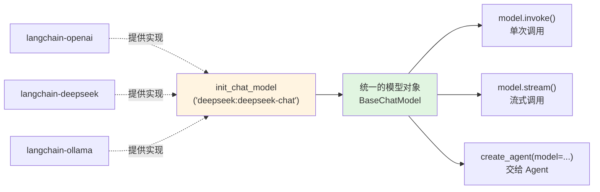
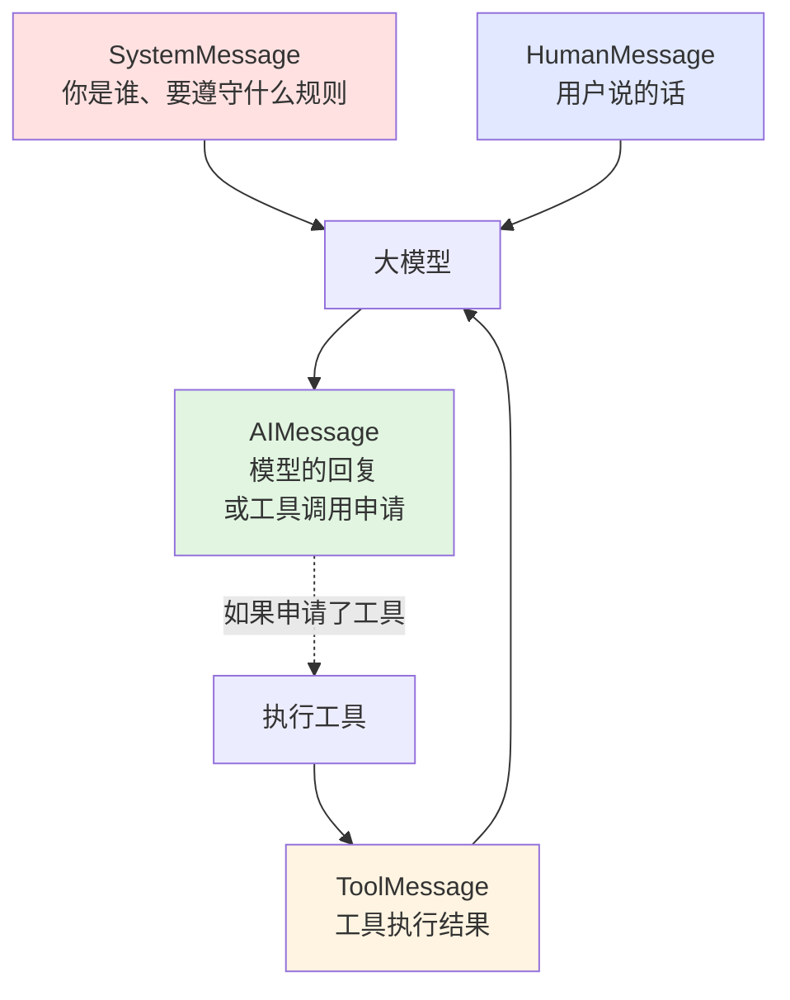
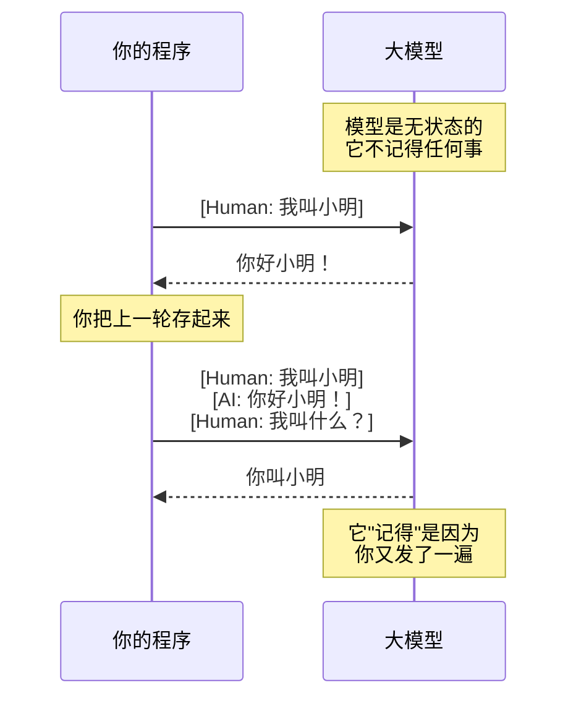

# 第 2 章 模型与消息

> 本章目标：搞清楚「模型」这一层的所有日常操作——换模型、调参数、看花了多少钱、手动维护多轮对话。
>
> 这章是全书最基础的一章，第 4 章之后的所有内容都建立在这上面。

---

## 2.1 `init_chat_model()` 一句话换模型

第 1 章我们把模型名直接写在 `create_agent(model="...")` 里。但很多时候你需要单独拿到模型对象——比如要设温度、要单独调用一次、要在两个模型之间切换。

### 🖼 图解：`init_chat_model` 在整个体系里的位置



关键点：**`init_chat_model` 是个工厂函数**。不管底层是哪家，它都返回同一种对象，有同一套方法。这就是「换模型只改一行」的原理。

### 💻 完整代码

新建 `model_basics.py`：

```python
"""模型对象的基本用法。

运行：uv run model_basics.py
"""

from dotenv import load_dotenv
from langchain.chat_models import init_chat_model

load_dotenv()

# 方式一：字符串形式（推荐，最常用）
# 格式："提供商:模型名"
model = init_chat_model("deepseek:deepseek-chat")

# 方式二：分开写（提供商名字很长或者要动态拼接时用）
# model = init_chat_model(model="deepseek-chat", model_provider="deepseek")

# 最简单的调用：直接传字符串
response = model.invoke("用一句话解释什么是 API")

print("=== 回答 ===")
print(response.text)
print()
print("=== 这次花了多少 token ===")
print(response.usage_metadata)
```

输出：

```
=== 回答 ===
API 是一套预先定义好的接口规则，让不同的软件程序能够互相调用彼此的功能和数据。

=== 这次花了多少 token ===
{'input_tokens': 14, 'output_tokens': 32, 'total_tokens': 46,
 'input_token_details': {'cache_read': 0}}
```

### 换模型：真的只改一行

```python
# 国内直连
model = init_chat_model("deepseek:deepseek-chat")

# OpenAI
model = init_chat_model("openai:gpt-4o-mini")

# 本地离线
model = init_chat_model("ollama:qwen3:8b")

# 通义千问
model = init_chat_model("openai:qwen-plus",
                        base_url="https://dashscope.aliyuncs.com/compatible-mode/v1")
```

下面所有代码完全不用改。完整的提供商写法见附录 B（待完成）。

### 🧱 C#/SQL 类比

`init_chat_model` ≈ **`DbProviderFactory.CreateConnection()`**。

你写 `IDbConnection`，底下可能是 SQL Server、可能是 PostgreSQL，业务代码不关心。换数据库只改连接字符串。这里换模型只改那个 `"provider:model"` 字符串，一模一样的思路。

---

## 2.2 三个真正常用的参数

模型有几十个参数，但日常你只需要这三个。

```python
model = init_chat_model(
    "deepseek:deepseek-chat",
    temperature=0,      # 随机性
    max_tokens=500,     # 最多输出多少
    timeout=30,         # 超时秒数
)
```

### `temperature`：随机性

| 值 | 效果 | 用在哪 |
| --- | --- | --- |
| `0` | 几乎确定性，同样输入基本同样输出 | **工具调用、结构化输出、数据抽取** |
| `0.3 ~ 0.7` | 有点变化但不跑偏 | 客服对话、总结 |
| `1.0+` | 明显发散 | 起名、文案创意 |

⚠️ **做 Agent 请用 `temperature=0`。** 你要的是「稳定地选对工具、稳定地传对参数」，不是创意。温度高会导致同样的问题这次调对工具、下次调错。

> 注意：`temperature=0` **不等于**完全确定。模型服务端的并行计算、模型版本更新都会带来微小差异。别指望 100% 复现。

### `max_tokens`：最多输出多少

限制**输出**长度，不限制输入。

```python
model = init_chat_model("deepseek:deepseek-chat", max_tokens=100)
r = model.invoke("详细介绍一下 Python 的历史")
print(r.text)
print(r.response_metadata.get("finish_reason"))  # 'length' 说明被截断了
```

⚠️ **被截断的输出是硬截断**，可能停在半句话中间，甚至半个 JSON 中间。如果你在做结构化输出（第 6 章），`max_tokens` 设太小会直接导致 JSON 解析失败。

判断是否被截断：看 `response_metadata["finish_reason"]`：
- `"stop"` — 正常说完了
- `"length"` — 撞到 `max_tokens` 被砍了
- `"tool_calls"` — 停下来是为了调工具（正常）

### `timeout`：超时

```python
model = init_chat_model("deepseek:deepseek-chat", timeout=30)
```

单位是秒。**一定要设**，否则网络卡住时你的程序会无限等待。

推荐值：
- 普通问答：`30`
- 长文本生成：`60`
- 本地 Ollama：`120`（本地推理慢，尤其第一次加载模型）

配合重试更稳（第 9 章的 `ModelRetryMiddleware` 会自动做这件事）：

```python
model = init_chat_model(
    "deepseek:deepseek-chat",
    timeout=30,
    max_retries=2,   # 失败自动重试 2 次
)
```

---

## 2.3 四种消息：System / Human / AI / Tool

第 1 章看到了这四种消息，现在正式学怎么手写它们。

### 🖼 图解：四种消息的角色分工



### 💻 完整代码

```python
"""四种消息的用法。

运行：uv run messages_demo.py
"""

from dotenv import load_dotenv
from langchain.chat_models import init_chat_model
from langchain_core.messages import AIMessage, HumanMessage, SystemMessage

load_dotenv()
model = init_chat_model("deepseek:deepseek-chat", temperature=0)

# 写法一：用消息对象（清晰，推荐）
messages = [
    SystemMessage("你是一个只会用文言文回答的助手。"),
    HumanMessage("今天天气不错"),
]
r1 = model.invoke(messages)
print("【对象写法】", r1.text)

# 写法二：用字典（省事，等价）
messages2 = [
    {"role": "system", "content": "你是一个只会用文言文回答的助手。"},
    {"role": "user", "content": "今天天气不错"},
]
r2 = model.invoke(messages2)
print("【字典写法】", r2.text)

# 写法三：只传一个字符串（等价于单条 HumanMessage）
r3 = model.invoke("今天天气不错")
print("【字符串写法】", r3.text)
```

输出：

```
【对象写法】 今日天朗气清，惠风和畅，诚可乐也。
【字典写法】 今日天气晴好，风和日丽，甚是宜人。
【字符串写法】 是啊，天气好的时候心情也会跟着变好。今天有什么出行计划吗？
```

注意第三种没有 SystemMessage，所以没有文言文。

### 三种写法怎么选

| 写法 | 什么时候用 |
| --- | --- |
| 消息对象 | 写库、写框架、需要类型提示时 |
| 字典 | 从 JSON / 数据库读出来的历史，直接用 |
| 纯字符串 | 快速测试、单轮问答 |

三者可以混用：

```python
messages = [
    SystemMessage("你是助手"),
    {"role": "user", "content": "你好"},        # 混着写也没问题
]
```

### ⚠️ SystemMessage 的三个注意点

1. **只放一条，放在最前面。** 放多条、放中间，不同模型行为不一致。
2. **它是建议，不是强制。** 写了「只用中文」，模型仍可能夹英文。真要强制，得靠结构化输出（第 6 章）或后处理校验。
3. **它每次请求都会重发。** SystemMessage 越长，每轮对话的固定成本越高。别把整本手册塞进去——那是 RAG（第 10 章）该干的事。

### ToolMessage：不用手写

`ToolMessage` 一般由 LangChain 自动生成，你几乎不会手写。但了解它的结构对调试有帮助：

```python
from langchain_core.messages import ToolMessage

ToolMessage(
    content="晴，22°C",              # 工具返回值（会被转成字符串）
    tool_call_id="call_0_a1b2c3",   # ⚠️ 必须和 AIMessage 里的 tool_call.id 对应
)
```

⚠️ `tool_call_id` 配不上会直接报 API 错误。这是手动拼历史消息时最容易踩的坑（见 2.6 小节）。

---

## 2.4 取文字用 `.text`（1.x 最重要的一个改动）

### 这是 0.x → 1.x 的破坏性变更

```python
r = model.invoke("你好")

r.text            # ✅ 1.x 正确写法：属性，不加括号
r.text()          # ❌ TypeError: 'str' object is not callable
r.content         # ⚠️ 还能用，但不一定是字符串
```

### 为什么要改

因为现代模型的一次回复可能包含**多种内容块**：文字、图片、推理过程、工具调用、引用……`content` 字段在这种情况下是个**列表**，不是字符串。

```python
# 简单文本回复时
r.content   # "你好！有什么可以帮你的？"        ← 字符串

# 带推理过程的模型（如 o1、deepseek-reasoner）
r.content   # [{'type': 'reasoning', ...},
            #  {'type': 'text', 'text': '答案是...'}]   ← 列表！
```

如果你写 `r.content.upper()`，遇到列表就崩了。

`.text` 的作用是：**不管底下是什么结构，都给你拼好的纯文本**。

### 💻 对比演示

```python
"""content 和 text 的区别。"""

from dotenv import load_dotenv
from langchain.chat_models import init_chat_model

load_dotenv()
model = init_chat_model("deepseek:deepseek-chat")

r = model.invoke("1+1 等于几？")

print("text 类型：", type(r.text))
print("text 内容：", r.text)
print()
print("content 类型：", type(r.content))
print("content 内容：", r.content)
```

### 记住这条规则

> **要显示给用户看的文本，永远用 `.text`。要分析结构（比如提取推理过程、图片），才去看 `.content` 或 `.content_blocks`。**

⚠️ 你在网上搜到的 2023–2024 年的教程，几乎全都是 `.content`。看到就在心里换成 `.text`。

---

## 2.5 用 `usage_metadata` 看这次花了多少 token

### 💻 完整代码

```python
"""统计 token 用量和估算成本。

运行：uv run token_count.py
"""

from dotenv import load_dotenv
from langchain.chat_models import init_chat_model

load_dotenv()
model = init_chat_model("deepseek:deepseek-chat")

r = model.invoke("用三句话介绍 LangChain")

usage = r.usage_metadata
print("原始数据：", usage)
print()
print(f"输入 token：{usage['input_tokens']}")
print(f"输出 token：{usage['output_tokens']}")
print(f"合计：      {usage['total_tokens']}")

# 估算费用（价格请以官方为准，这里只是演示算法）
PRICE_IN = 2.0 / 1_000_000    # 元 / 输入 token
PRICE_OUT = 8.0 / 1_000_000   # 元 / 输出 token

cost = usage["input_tokens"] * PRICE_IN + usage["output_tokens"] * PRICE_OUT
print(f"\n本次约 ¥{cost:.6f}")
```

### 🔍 拆解字段

```python
{
    'input_tokens': 15,        # 你发过去的（含 SystemMessage 和全部历史）
    'output_tokens': 87,       # 模型生成的
    'total_tokens': 102,       # 两者之和
    'input_token_details': {   # 细分（不是所有模型都有）
        'cache_read': 0,       # 命中缓存的部分，通常便宜 90%
        'cache_creation': 0,
    },
    'output_token_details': {
        'reasoning': 0,        # 推理型模型的思考 token，也要付钱
    },
}
```

### 三个新手容易忽略的成本真相

**1. 输出通常比输入贵 3–5 倍。** 所以「让模型少废话」比「让提示词短一点」更省钱。在 SystemMessage 里写「简洁回答」是有实际财务收益的。

**2. 多轮对话的成本是平方级增长的。** 第 10 轮时你要把前 9 轮全部重发一次：

| 轮次 | 本轮输入 token（约） | 累计花费（相对值） |
| --- | --- | --- |
| 1 | 100 | 100 |
| 5 | 900 | 2500 |
| 10 | 2000 | 10000 |

这就是第 8 章要讲摘要中间件的原因——不压缩历史，长对话的成本会失控。

**3. Agent 的一次「回答」可能是好几次模型调用。** 第 1 章那个天气 Agent，用户问一句，你付了两次钱。工具越多、循环越多，倍数越高。

第 12 章会系统讲省钱手段。现在只要养成习惯：**开发时把 `usage_metadata` 打出来看**。

---

## 2.6 多轮对话：先手动传历史

第 8 章会用 `checkpointer` 自动管理记忆。但你必须先理解手动版本，否则第 8 章会像魔法。

### 🖼 图解：模型没有记忆，是你在骗它



**模型 100% 无状态。** 所谓「记忆」，全部是靠每次把完整历史重发一遍实现的。理解这一点，第 8 章和第 12 章的成本问题就都通了。

### 💻 完整代码：手动多轮对话

```python
"""手动维护多轮对话历史。

运行：uv run manual_memory.py
"""

from dotenv import load_dotenv
from langchain.chat_models import init_chat_model
from langchain_core.messages import HumanMessage, SystemMessage

load_dotenv()
model = init_chat_model("deepseek:deepseek-chat", temperature=0)

# 这个列表就是"记忆"，它活在你的程序里，不在模型里
history = [SystemMessage("你是一个友好的助手，回答简洁。")]


def chat(user_input: str) -> str:
    """发一轮对话，自动维护历史。"""
    # 1. 把用户输入追加到历史
    history.append(HumanMessage(user_input))

    # 2. 把【完整历史】发给模型
    response = model.invoke(history)

    # 3. ⚠️ 关键：把模型回复也追加进历史
    #    忘了这一步，模型就永远不知道自己说过什么
    history.append(response)

    return response.text


if __name__ == "__main__":
    print("你:", "我叫小明，今年 28 岁")
    print("AI:", chat("我叫小明，今年 28 岁"))
    print()

    print("你:", "我叫什么名字？")
    print("AI:", chat("我叫什么名字？"))
    print()

    print("你:", "我明年多大？")
    print("AI:", chat("我明年多大？"))
    print()

    print(f"--- 历史里现在有 {len(history)} 条消息 ---")
    for m in history:
        print(f"[{type(m).__name__}] {m.text[:40]}")
```

输出：

```
你: 我叫小明，今年 28 岁
AI: 你好小明！很高兴认识你。

你: 我叫什么名字？
AI: 你叫小明。

你: 我明年多大？
AI: 你明年 29 岁。

--- 历史里现在有 7 条消息 ---
[SystemMessage] 你是一个友好的助手，回答简洁。
[HumanMessage] 我叫小明，今年 28 岁
[AIMessage] 你好小明！很高兴认识你。
[HumanMessage] 我叫什么名字？
[AIMessage] 你叫小明。
[HumanMessage] 我明年多大？
[AIMessage] 你明年 29 岁。
```

### 做成可交互的命令行

```python
if __name__ == "__main__":
    print("开始对话（输入 quit 退出）\n")
    while True:
        user_input = input("你: ").strip()
        if user_input.lower() in ("quit", "exit", "q"):
            break
        if not user_input:
            continue
        print("AI:", chat(user_input))
        # 顺手看看成本涨得多快
        print(f"   (历史 {len(history)} 条)")
```

跑几轮，观察历史条数增长。第 10 轮时你会发现每次请求的 `input_tokens` 已经很可观了。

### ⚠️ 手动管理历史的三个坑

**坑 1：忘了追加 AIMessage**

```python
# ❌ 错误
def chat(user_input):
    history.append(HumanMessage(user_input))
    return model.invoke(history).text   # 回复没存进 history！

# 结果：模型看到的历史里全是用户在说话，没有它自己的回复
# 表现：答非所问、重复自我介绍
```

**坑 2：ToolMessage 配对断裂**

如果历史里有工具调用，`AIMessage(tool_calls=[...])` 和对应的 `ToolMessage` **必须成对出现且顺序正确**。手动截断历史时很容易切断这个配对：

```python
# ❌ 危险：可能把 AIMessage 留下、ToolMessage 切掉
history = history[-6:]

# 报错：An assistant message with 'tool_calls' must be followed by
#       tool messages responding to each 'tool_call_id'
```

这也是为什么第 8 章要用官方的摘要中间件，而不是自己写 `history[-N:]`——官方实现会保证配对完整。

**坑 3：历史无限增长**

不做任何处理的话，聊到第 50 轮会撞上模型的上下文长度上限：

```
openai.BadRequestError: This model's maximum context length is 65536 tokens,
however you requested 71203 tokens.
```

三个解法（第 8、9 章详讲）：
1. 只保留最近 N 轮（简单但会丢信息，且要小心坑 2）
2. 老对话做摘要（`SummarizationMiddleware`）
3. 重要信息存长期记忆（`store`）

---

## 🧱 本章 C#/SQL 类比汇总

| 概念 | 类比 | 说明 |
| --- | --- | --- |
| `init_chat_model` | `DbProviderFactory` | 工厂模式，返回统一接口，换实现只改配置 |
| `temperature=0` | 事务隔离级别设成最严 | 要的是可预测，不是性能/创意 |
| `timeout` | `CommandTimeout` | 不设就是等死 |
| 手动传 `history` | **无状态 HTTP + 每次带全量 Session** | 服务端不存状态，客户端每次把上下文全发一遍 |
| `usage_metadata` | SQL 执行计划里的 IO 统计 | 优化前先看清消耗在哪 |
| `.text` vs `.content` | `ToString()` vs 访问原始字段 | 前者保证给你可读文本，后者是原始结构 |

---

## ⚠️ 本章踩坑汇总

### 1. `.text()` 加了括号

```
TypeError: 'str' object is not callable
```

去掉括号。这是从旧教程抄代码最常见的错。

### 2. `load_dotenv()` 位置错了

```python
# ❌ 错误顺序
model = init_chat_model("deepseek:deepseek-chat")
load_dotenv()   # 太晚了，模型初始化时 Key 还不在环境里
```

`load_dotenv()` 必须在所有 `init_chat_model` / `create_agent` 之前。放在 import 后面第一行最稳。

### 3. `max_tokens` 太小截断了 JSON

```
json.decoder.JSONDecodeError: Expecting ',' delimiter: line 1 column 87
```

检查 `finish_reason` 是不是 `"length"`。是的话把 `max_tokens` 调大，或者干脆不设。

### 4. 上下文超长

```
BadRequestError: This model's maximum context length is 65536 tokens
```

历史太长了。见 2.6 坑 3 的三个解法。

### 5. 工具消息配对断裂

```
An assistant message with 'tool_calls' must be followed by tool messages
responding to each 'tool_call_id'
```

手动裁剪历史时切断了 AIMessage 和 ToolMessage 的配对。别自己切，用第 9 章的中间件。

### 6. 温度设高了导致工具调用不稳定

**症状**：同一个问题，有时调对工具，有时调错，有时干脆不调。

**原因**：`temperature` 没设或设太高。做 Agent 一律 `temperature=0`。

---

## 🎯 动手练习

### 练习 1（必做）：给手动对话加成本统计

改造 2.6 的 `chat()` 函数，让它累计统计总 token 和总花费，每轮打印出来。

观察：第 1 轮和第 10 轮的单轮 `input_tokens` 差多少倍？

### 练习 2：验证「模型无状态」

写两段代码对比：
- A：正确追加 AIMessage
- B：故意不追加 AIMessage

都问三轮「我叫小明」→「我叫什么」→「我叫什么」，看 B 的表现有什么异常。

### 练习 3：温度对比实验

同一个问题（比如「给一家咖啡店起 3 个名字」）分别用 `temperature=0` 和 `temperature=1.2` 各跑 3 次，把 6 个结果贴出来对比。

### 练习 4（进阶）：写一个模型切换器

写一个函数 `ask_all(question)`，用 2 个不同模型（比如 DeepSeek + Ollama）回答同一个问题，并排打印答案和各自的 token 用量。

---

<details>
<summary>📖 点击查看参考答案</summary>

### 练习 1 参考答案

```python
from dotenv import load_dotenv
from langchain.chat_models import init_chat_model
from langchain_core.messages import HumanMessage, SystemMessage

load_dotenv()
model = init_chat_model("deepseek:deepseek-chat", temperature=0)

history = [SystemMessage("你是一个友好的助手，回答简洁。")]

PRICE_IN = 2.0 / 1_000_000
PRICE_OUT = 8.0 / 1_000_000

total_cost = 0.0
total_tokens = 0
turn = 0


def chat(user_input: str) -> str:
    global total_cost, total_tokens, turn
    turn += 1

    history.append(HumanMessage(user_input))
    response = model.invoke(history)
    history.append(response)

    u = response.usage_metadata
    cost = u["input_tokens"] * PRICE_IN + u["output_tokens"] * PRICE_OUT
    total_cost += cost
    total_tokens += u["total_tokens"]

    print(f"  [第{turn}轮] 输入 {u['input_tokens']} / 输出 {u['output_tokens']} "
          f"/ 本轮 ¥{cost:.6f} / 累计 ¥{total_cost:.6f}")
    return response.text


if __name__ == "__main__":
    questions = [
        "我叫小明", "我今年 28", "我住北京", "我是程序员",
        "我喜欢咖啡", "我养了只猫", "猫叫豆豆", "我周末爱爬山",
        "总结一下你知道的关于我的信息", "我叫什么？",
    ]
    for q in questions:
        print(f"你: {q}")
        print(f"AI: {chat(q)}")
        print()

    print(f"=== 10 轮共 {total_tokens} token，¥{total_cost:.6f} ===")
```

**典型观察结果**：

| 轮次 | input_tokens |
| --- | --- |
| 1 | 22 |
| 5 | 210 |
| 10 | 620 |

第 10 轮的输入是第 1 轮的 **28 倍**。而这只是 10 轮短对话。真实客服场景聊到 50 轮，成本会变得非常难看。

这就是为什么第 8 章的摘要中间件不是「可选优化」，而是长对话的必备组件。

### 练习 2 参考答案

**B 版本（不追加 AIMessage）的历史是这样的：**

```
[SystemMessage] 你是助手
[HumanMessage] 我叫小明
[HumanMessage] 我叫什么
[HumanMessage] 我叫什么
```

**典型异常表现**：
1. 模型可能仍然答对（因为「我叫小明」还在历史里），但语气很怪，像在重复回答第一次的问题
2. 更常见的是它开始重复自我介绍，或者说「你刚才已经问过了」这类基于错误上下文的话
3. 某些模型会对连续多条 user 消息报错或行为异常

**结论**：模型看到的不是「对话」，而是「一段文本」。你必须把它自己说过的话也放回去，它才知道对话进行到哪一步了。`AIMessage` 不是给你看的日志，是模型的必要输入。

### 练习 3 参考答案

`temperature=0` 三次运行（几乎相同）：

```
1. 醒时光、豆语、一杯山海
2. 醒时光、豆语、一杯山海
3. 醒时光、豆语咖啡、山海一杯
```

`temperature=1.2` 三次运行（差异明显）：

```
1. 拾光豆、慢半拍、云上烘焙
2. 晨间序曲、第七个杯子、苦甜巷
3. 浮豆记、日落研磨所、微醺午后
```

**结论与选型**：

| 场景 | 推荐温度 | 理由 |
| --- | --- | --- |
| 工具调用 / Agent | 0 | 要稳定选对工具 |
| 数据抽取 / 结构化输出 | 0 | 要可复现 |
| 客服问答 | 0.3 | 稍有变化但不跑偏 |
| 起名 / 文案 | 0.9–1.3 | 就要多样性 |

⚠️ 顺带注意：温度高时**幻觉也更多**。做事实性问答别把温度调高。

### 练习 4 参考答案

```python
from dotenv import load_dotenv
from langchain.chat_models import init_chat_model

load_dotenv()

MODELS = {
    "DeepSeek": "deepseek:deepseek-chat",
    "本地 Qwen": "ollama:qwen3:8b",
}


def ask_all(question: str) -> None:
    print(f"❓ {question}\n")
    for name, spec in MODELS.items():
        try:
            m = init_chat_model(spec, temperature=0, timeout=120)
            r = m.invoke(question)
            u = r.usage_metadata or {}
            print(f"--- {name} ---")
            print(r.text)
            print(f"(token: 入 {u.get('input_tokens', '?')} "
                  f"/ 出 {u.get('output_tokens', '?')})\n")
        except Exception as e:
            # 某个模型挂了不影响其他模型
            print(f"--- {name} ---")
            print(f"⚠️ 调用失败：{type(e).__name__}: {e}\n")


if __name__ == "__main__":
    ask_all("用一句话解释什么是递归")
```

**两个值得注意的点**：

1. **`init_chat_model` 放在循环里每次新建**，是因为不同模型的 `timeout` 需求差很多（本地要 120 秒，云端 30 秒够）。生产环境应该预先建好并复用。
2. **`try/except` 是必须的**。多模型对比时，任何一个提供商挂了都不该拖垮整个流程。这个模式在第 12 章「便宜模型打头阵、失败再上贵的」里会正式用到。

**你会观察到**：本地小模型的回答质量通常明显低于云端，但完全免费且不联网。选型时权衡这三者：质量、成本、数据是否出境。

</details>

---

## 📌 一句话总结

**模型是无状态的纯函数：给它一个消息列表，它返回一条 AIMessage；所谓「记忆」全靠你每次把历史重发一遍，所以历史越长越贵。**

---

## 下一章预告

现在你会调模型了，但输出质量很大程度取决于你怎么说话。第 3 章讲提示词的四段结构、模板变量替换，以及三个最常犯的错误。

---

**导航**：[上一章](ch01-hello-langchain.md) · [返回目录](../README.md) · [下一章](ch03-prompts.md)
