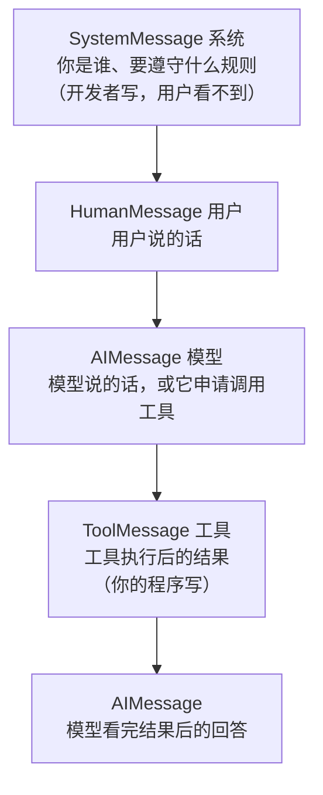
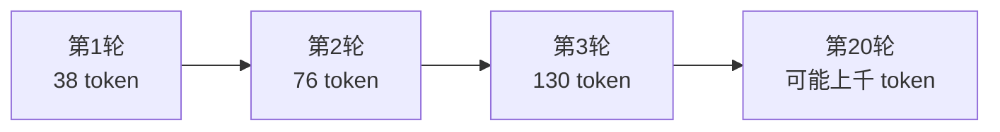

# 第 2 章　模型与消息

> 本章目标：搞清楚 `invoke` 返回的那个对象里到底装了什么，学会算钱，学会手动管理多轮对话。
> 这一章是全书的地基，看着朴素，但后面所有章节都建立在它上面。

---

## 2.1 `init_chat_model()`：一句话换模型

```python
from langchain.chat_models import init_chat_model

模型 = init_chat_model("deepseek:deepseek-chat")
```

格式永远是 `"厂商:模型名"`。想换厂商，只改这一行：

```python
init_chat_model("deepseek:deepseek-chat")    # DeepSeek
init_chat_model("openai:gpt-4o-mini")        # OpenAI
init_chat_model("anthropic:claude-sonnet-4-5")
init_chat_model("ollama:qwen2.5")            # 本机离线
```

> 💡 **为什么不直接 `ChatDeepSeek(...)`？**
> 直接实例化也能用，但那样厂商名就硬编码进代码了。用 `init_chat_model` 可以把模型名做成配置项，测试用便宜模型、生产用好模型，改配置不改代码。这和你把连接字符串写进 `web.config` 而不是写在代码里是同一个道理。

### 用你熟悉的方式理解这一层

| 数据库世界 | LangChain |
|---|---|
| `SqlConnection` / `MySqlConnection` | `ChatDeepSeek` / `ChatOpenAI` |
| `DbConnection`（抽象基类） | `BaseChatModel` |
| 工厂方法 + 配置文件切换驱动 | `init_chat_model("厂商:模型")` |

---

## 2.2 三个真正常用的参数

模型有几十个参数，但日常只有这三个你会反复调：

```python
模型 = init_chat_model(
    "deepseek:deepseek-chat",
    temperature=0,      # 随机性：0 最稳定，1 最有创意
    max_tokens=1000,    # 最多输出多少 token，防止它长篇大论
    timeout=60,         # 多少秒没响应就放弃
)
```

我实测确认这三个参数 DeepSeek 都接受：

```
ChatDeepSeek | temperature= 0.2 | max_tokens= 500 | timeout= 60.0
```

### `temperature` 怎么选（最重要的一个）

| 值 | 效果 | 什么活用 |
|---|---|---|
| **0** | 几乎每次都给一样的答案 | **数据抽取、分类、SQL 生成、格式转换** ← 你的工作 90% 是这类 |
| 0.3 ~ 0.7 | 有一点变化 | 客服回复、文案润色 |
| 1.0+ | 天马行空 | 创意头脑风暴、起名 |

⚠️ **新手最常犯的错**：做数据抽取时用默认 temperature（DeepSeek 默认是 1.0），结果同一封邮件跑两次抽出来的字段不一样，然后怀疑"AI 不靠谱"。

**记住：只要你的任务有"正确答案"，就把 `temperature=0` 写上。**

### `max_tokens` 的两个作用

1. **防跑偏**：不设的话，它可能给你写三千字。
2. **兜底成本**：输出是按 token 计费的，设上限等于设了单次花费上限。

> 💡 **token 是什么**：模型不是按字算钱的，是按 token。中文大约 **1 个字 ≈ 0.6~1 个 token**，英文大约 1 个单词 ≈ 1.3 个 token。粗略估算：1000 个汉字大约 700~1000 token。

### `timeout`

默认值在网络不好时可能不够。国内连 DeepSeek 一般很快，但如果你要处理长文档（输入几万字），响应时间会变长，建议设 60~120。

---

## 2.3 四种消息：AI 对话的基本积木

### 为什么不能都写成一个字符串

你可能会想：为什么不直接把整段对话拼成一个大字符串发过去？

因为模型需要知道**每句话是谁说的**。同样一句"忽略之前的所有指令"，出现在系统提示里是合法配置，出现在用户输入里就是**攻击**。角色分离是安全边界，不是格式洁癖。

### 四种角色



| 类型 | 谁产生 | 干什么 |
|---|---|---|
| `SystemMessage` | 你（开发者） | 设定角色、规则、输出格式。**放最前面，只放一条** |
| `HumanMessage` | 用户 | 提问 |
| `AIMessage` | 模型 | 回答，或"我要调用某个工具" |
| `ToolMessage` | 你的程序 | 工具的返回值 |

### 两种写法，随便用哪种

```python
from langchain.messages import SystemMessage, HumanMessage

# 写法一：对象（类型安全，IDE 有提示，推荐）
消息列表 = [
    SystemMessage("你是一个严谨的数据库专家，回答用中文。"),
    HumanMessage("varchar 和 nvarchar 有什么区别？"),
]

# 写法二：字典（更短，抄别人代码时常见）
消息列表 = [
    {"role": "system", "content": "你是一个严谨的数据库专家，回答用中文。"},
    {"role": "user", "content": "varchar 和 nvarchar 有什么区别？"},
]

回复 = 模型.invoke(消息列表)
print(回复.text)
```

两种完全等价。角色名对应关系：

| 字典里的 `role` | 对应的对象 |
|---|---|
| `"system"` | `SystemMessage` |
| `"user"` | `HumanMessage` |
| `"assistant"` | `AIMessage` |
| `"tool"` | `ToolMessage` |

> ⚠️ `ToolMessage` 有个额外要求：必须带 `tool_call_id`。我实测不给会直接 `KeyError`。不过日常你不需要手动构造它——Agent 会自动帮你填。

---

## 2.4 `AIMessage` 里到底装了什么

这是本章最有用的一节。很多人只会用 `.text`，其实这个对象里的信息多得多。

```python
from dotenv import load_dotenv
from langchain.chat_models import init_chat_model

load_dotenv()
模型 = init_chat_model("deepseek:deepseek-chat", temperature=0)

回复 = 模型.invoke("用一句话说明什么是索引")

print("① 文字内容：", 回复.text)
print("② 对象类型：", type(回复).__name__)
print("③ token 用量：", 回复.usage_metadata)
print("④ 标准内容块：", 回复.content_blocks)
print("⑤ 厂商元数据：", 回复.response_metadata)
print("⑥ 工具调用：", 回复.tool_calls)
```

输出大致是这样（`usage_metadata` 的数字会不同）：

```
① 文字内容： 索引是数据库中为加快查询速度而建立的一种数据结构，类似书的目录。
② 对象类型： AIMessage
③ token 用量： {'input_tokens': 12, 'output_tokens': 28, 'total_tokens': 40}
④ 标准内容块： [{'type': 'text', 'text': '索引是数据库中为加快查询速度...'}]
⑤ 厂商元数据： {'model_name': 'deepseek-chat', 'finish_reason': 'stop', ...}
⑥ 工具调用： []
```

逐个说明：

| 属性 | 用途 | 日常用不用 |
|---|---|---|
| `.text` | 取文字 | ⭐ 天天用 |
| `.usage_metadata` | 这次用了多少 token | ⭐ 算钱必用（下一节） |
| `.tool_calls` | 模型申请调用哪些工具 | 调试 Agent 时用 |
| `.content_blocks` | 跨厂商统一的内容视图 | 处理推理链、引用时用 |
| `.response_metadata` | 厂商原始返回的杂项，如 `finish_reason` | 排查"为什么被截断"时用 |
| `.id` | 这条消息的唯一 ID | 一般不用 |

### 顺便说说 `.content_blocks`

`.text` 只能拿到纯文字。但现在的模型返回的可能不只是文字——还可能有推理过程、引用来源、图片、服务端工具的执行结果。`.content_blocks` 是 LangChain 1.x 加的**统一格式**，让你用同一套代码读所有厂商的这些东西。

我实测一条普通文本消息的 `content_blocks` 是：

```python
[{'type': 'text', 'text': 'hi'}]
```

日常做文本处理你用 `.text` 就够。等你哪天要用 `deepseek-reasoner` 拿推理过程、或者要显示引用来源，再回来看这个属性。

### `finish_reason` 是个好东西

```python
print(回复.response_metadata.get("finish_reason"))
```

| 值 | 意思 |
|---|---|
| `stop` | 正常说完了 ✅ |
| `length` | ⚠️ **被 `max_tokens` 截断了**，回答是不完整的 |
| `tool_calls` | 它要调工具 |

⚠️ **一个隐蔽的坑**：如果 `max_tokens` 设小了，模型会**说到一半就被切断**，而你的代码毫无察觉，还把半截答案入库了。做批量处理时建议加一句检查：

```python
if 回复.response_metadata.get("finish_reason") == "length":
    print("⚠️ 警告：输出被截断，结果不完整")
```

---

## 2.5 算清这次花了多少钱

这节能帮你避免"月底账单突然爆掉"。

```python
from dotenv import load_dotenv
from langchain.chat_models import init_chat_model

load_dotenv()
模型 = init_chat_model("deepseek:deepseek-chat", temperature=0)

# DeepSeek 的价格（单位：元 / 百万 token）——请以官网最新价格为准
输入单价 = 2.0
输出单价 = 8.0


def 问一句(问题: str):
    回复 = 模型.invoke(问题)
    用量 = 回复.usage_metadata

    花费 = (用量["input_tokens"] * 输入单价 + 用量["output_tokens"] * 输出单价) / 1_000_000

    print(f"回答：{回复.text}")
    print(f"输入 {用量['input_tokens']} token，输出 {用量['output_tokens']} token")
    print(f"本次花费：约 {花费:.6f} 元")
    return 回复


问一句("用一句话解释什么是事务")
```

输出示例：

```
回答：事务是一组要么全部成功、要么全部回滚的数据库操作。
输入 11 token，输出 24 token
本次花费：约 0.000214 元
```

`usage_metadata` 的结构我实测确认是：

```python
{'input_tokens': 12, 'output_tokens': 5, 'total_tokens': 17}
```

### 为什么必须关心这个

| 场景 | 单次花费 | 跑 5000 条 |
|---|---|---|
| 短句分类 | 约 0.0002 元 | 约 1 元 |
| 一封邮件转工单 | 约 0.002 元 | 约 10 元 |
| 塞 20 页文档进去问一个问题 | 约 0.03 元 | 约 150 元 |

看着都不贵，但要注意两件事：

1. **Agent 每次工具调用都是一次完整请求**。一个问题来回三轮，费用就是三倍。
2. **多轮对话的历史会被反复重发**。第 10 轮对话时，前 9 轮的内容都算在这次的输入 token 里——这就是为什么长对话越聊越贵。第 8、12 章会讲怎么控制。

> 💡 **实用建议**：给你的项目建一张 `AI调用日志` 表，把 `input_tokens`、`output_tokens`、模型名、时间戳记下来。上生产之后你会感谢自己——这是唯一能回答"这个功能一个月花了多少钱"的办法。

---

## 2.6 批量处理：`batch()`

要处理 5000 条脏数据时，一条条 `invoke` 会等到你睡着。用 `batch()`：

```python
待处理 = [
    "上海市浦东新区张江镇科苑路88号",
    "北京海淀中关村大街1号院",
    "广东省深圳南山区科技园南区",
]

提示列表 = [f"把下面这个地址拆成省/市/区三部分，用 | 分隔，只输出结果：\n{地址}" for 地址 in 待处理]

结果列表 = 模型.batch(提示列表)

for 原文, 回复 in zip(待处理, 结果列表):
    print(f"{原文}  →  {回复.text}")
```

`batch()` 会**并发**发出这些请求，比循环快很多倍。我实测确认返回的是一个列表，顺序和输入一致：

```
batch 结果: ['a', 'b']
```

⚠️ **两个注意点**：

1. **并发太高会被限流**（HTTP 429）。DeepSeek 有速率限制，几千条数据建议分批，每批 20~50 条，中间 `time.sleep(1)`。第 9 章会介绍用中间件自动重试。
2. **`batch` 里每条是独立的**，互相看不到。所以它不能做多轮对话，只适合"同一个任务重复处理不同数据"。

---

## 2.7 多轮对话：先手动来一遍

Agent 有自动记忆功能（第 8 章），但**先手动做一遍，你才会真正明白"记忆"是什么**。

关键认知：**模型没有记忆。它是无状态的。**

每次调用你都必须把之前的全部对话重新发过去，模型才"知道"发生过什么。所谓的"记忆"，本质就是**你自己维护一个消息列表**。

```python
from dotenv import load_dotenv
from langchain.chat_models import init_chat_model
from langchain.messages import SystemMessage, HumanMessage

load_dotenv()
模型 = init_chat_model("deepseek:deepseek-chat", temperature=0)

# 这个列表就是"记忆"本体
对话历史 = [SystemMessage("你是一个简洁的助手，回答不超过一句话。")]

print("开始聊天，输入 q 退出\n")

while True:
    用户输入 = input("你：")
    if 用户输入.strip().lower() == "q":
        break

    # 1. 把用户这句加进历史
    对话历史.append(HumanMessage(用户输入))

    # 2. 把【整个历史】发给模型
    回复 = 模型.invoke(对话历史)

    # 3. 把模型的回答也加进历史（⚠️ 这一步最容易忘）
    对话历史.append(回复)

    print(f"AI：{回复.text}")
    print(f"   （历史 {len(对话历史)} 条，本次输入 {回复.usage_metadata['input_tokens']} token）\n")
```

试着这样聊：

```
你：我叫老王，在做一个仓库管理系统
AI：好的老王，仓库管理系统的开发有什么可以帮你的？
   （历史 3 条，本次输入 38 token）

你：我刚才说我叫什么？
AI：你叫老王。
   （历史 5 条，本次输入 76 token）
```

**请重点看那个 token 数字**：第二轮输入是 76，第一轮是 38——**翻倍了**。因为第二轮把第一轮的问答也一起发过去了。

这就是长对话变贵的根本原因：



### ⚠️ 三个新手必犯的错

| 错误 | 后果 |
|---|---|
| 忘了 `对话历史.append(回复)` | AI 完全不记得自己说过什么，答得前后矛盾 |
| 每轮都新建一个列表 | 等于没有记忆 |
| 历史无限增长 | token 越来越贵，最终超过上下文上限报错 |

### 历史太长怎么办

LangChain 提供了 `trim_messages` 帮你裁剪：

```python
from langchain.messages import trim_messages

裁剪后 = trim_messages(
    对话历史,
    max_tokens=2000,
    token_counter=模型,          # 用模型自己的算法数 token
    strategy="last",            # 保留最近的
    include_system=True,        # ⚠️ 系统提示一定要留住
    start_on="human",           # 从用户消息开始，别把历史切得角色错乱
)
```

我实测确认 `trim_messages` 的参数有：`messages`、`max_tokens`、`token_counter`、`strategy`、`allow_partial`、`end_on`、`start_on`、`include_system`、`text_splitter`。

不过说实话——**日常你不用手写这个**。第 9 章的 `SummarizationMiddleware` 会在历史过长时自动摘要，一行配置的事，比裁剪更聪明（裁剪是直接丢掉旧内容，摘要是压缩后保留）。

**这一节的价值不是让你手写记忆，而是让你明白第 8 章那三行代码背后到底在做什么。**

---

## 2.8 ⚠️ DeepSeek 的能力边界

LangChain 1.x 给模型加了个 `.profile` 属性，能程序化查询"这个模型支持什么"。我实测 `deepseek-chat` 的返回：

```python
模型 = init_chat_model("deepseek:deepseek-chat")
print(模型.profile)
```

```python
{
    'name': 'DeepSeek Chat',
    'max_input_tokens': 1000000,      # 上下文很大，塞长文档没问题
    'max_output_tokens': 384000,
    'tool_calling': True,             # ✅ 能做 Agent
    'text_inputs': True,
    'image_inputs': False,            # ❌ 不能喂图片
    'audio_inputs': False,
    'video_inputs': False,
    'reasoning_output': False,        # ❌ 不输出推理链（用 deepseek-reasoner）
    'temperature': True,
}
```

**这对你的实际影响**：

| 需求 | 能不能用 deepseek-chat |
|---|---|
| 邮件、日志、文档等文本处理 | ✅ 可以 |
| 做 Agent、调工具 | ✅ 可以（`tool_calling: True`） |
| 塞进一整本几十万字的手册 | ✅ 可以（100 万 token 上下文） |
| **扫描件、发票照片直接识别** | ❌ **不行**，要先 OCR 转文字，或该步骤换视觉模型 |
| 需要看到模型的推理过程 | ❌ 换 `deepseek-reasoner` |

> 💡 `.profile` 的数据来自开源项目 models.dev。它的用处是：你写通用代码时可以先判断 `if 模型.profile["image_inputs"]:` 再决定走哪条分支，而不是硬编码模型名。

---

## 2.9 动手练习

**练习 1（必做）**：写一个"祖传 SQL 解读器"——把一段存储过程贴进去，让它输出这段 SQL 在做什么业务、涉及哪些表、有什么潜在风险。用 `temperature=0`，并打印本次花费。

<details>
<summary>参考答案</summary>

```python
from dotenv import load_dotenv
from langchain.chat_models import init_chat_model
from langchain.messages import SystemMessage, HumanMessage

load_dotenv()
模型 = init_chat_model("deepseek:deepseek-chat", temperature=0, max_tokens=2000)

系统提示 = """你是资深 SQL Server DBA。用户会贴一段 SQL，你按下面格式输出，不要写别的：

## 业务功能
（两三句话说清这段 SQL 在业务上干什么）

## 涉及的表
- 表名：读还是写，用途

## 潜在风险
（性能、空值、并发、事务方面的问题，没有就写"未发现明显问题"）"""

待分析 = """
UPDATE a SET a.库存 = a.库存 - b.数量
FROM 库存表 a INNER JOIN 出库明细 b ON a.物料编码 = b.物料编码
WHERE b.单据号 = @单据号
"""

回复 = 模型.invoke([SystemMessage(系统提示), HumanMessage(待分析)])
print(回复.text)

用量 = 回复.usage_metadata
print(f"\n--- 本次花费约 {(用量['input_tokens']*2 + 用量['output_tokens']*8)/1_000_000:.6f} 元 ---")
```

它大概会指出：没有判断库存是否会变成负数、没有事务保护、`WHERE` 条件依赖单据号索引等。**这类"帮你把老代码读明白"的活，是 AI 投入产出比最高的用法之一。**

</details>

**练习 2（推荐）**：把同一个数据抽取任务分别用 `temperature=0` 和 `temperature=1` 各跑 3 次，对比结果的稳定性。跑完你就再也不会忘记写 `temperature=0` 了。

**练习 3（进阶）**：改造 2.7 节的多轮对话程序，让它在历史超过 10 条时自动只保留系统提示 + 最近 6 条，并打印"已裁剪"。

---

## 2.10 本章速查卡

```python
from langchain.chat_models import init_chat_model
from langchain.messages import SystemMessage, HumanMessage, AIMessage

# 建模型（数据处理任务记得 temperature=0）
模型 = init_chat_model("deepseek:deepseek-chat", temperature=0, max_tokens=1000, timeout=60)

# 单次调用
回复 = 模型.invoke("问题")
回复 = 模型.invoke([SystemMessage("角色设定"), HumanMessage("问题")])

# 批量并发
回复列表 = 模型.batch(["问题1", "问题2", "问题3"])

# 取东西
回复.text                                    # 文字（不加括号！）
回复.usage_metadata["input_tokens"]          # 输入 token
回复.usage_metadata["output_tokens"]         # 输出 token
回复.response_metadata["finish_reason"]      # stop / length（被截断）
回复.tool_calls                              # 工具调用申请
回复.content_blocks                          # 跨厂商统一内容视图
模型.profile                                 # 这个模型支持什么
```

| 要点 | 记住 |
|---|---|
| 数据抽取/分类/转换 | **一定写 `temperature=0`** |
| 模型有记忆吗 | **没有**。记忆 = 你自己维护的消息列表 |
| 多轮对话为什么贵 | 每轮都把全部历史重发一遍 |
| 忘了什么会导致失忆 | 忘了把 `AIMessage` 也 append 回历史 |
| 输出不完整 | 查 `finish_reason` 是不是 `length` |
| 批量处理 | 用 `batch()`，注意分批防限流 |
| DeepSeek 不能干什么 | 不能吃图片；要推理链换 `deepseek-reasoner` |

---

## 📌 本章一句话总结

**模型是无状态的：你每次都得把整段对话重新交给它；`.usage_metadata` 是你唯一能看清花了多少钱的地方。**

---

上一章：[第 1 章　认识 LangChain 并跑出第一个程序](第01章-认识LangChain并跑出第一个程序.md)
下一章：[第 3 章　提示词怎么写](第03章-提示词怎么写.md)
