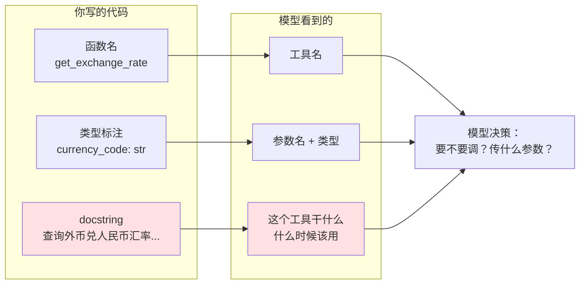
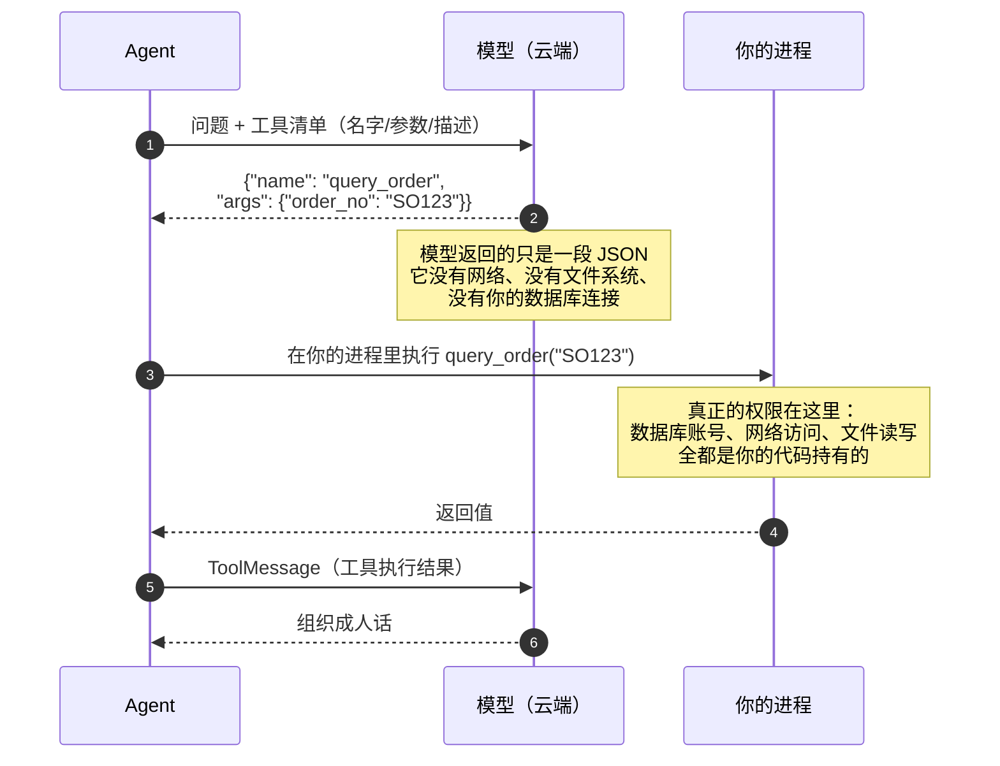

# 第 4 章 工具：给 AI 装上手脚

> 本章目标：让模型能调用你的代码——查数据库、算汇率、发请求。同时把**错误处理**和**权限隔离**这两件事一次做对。
>
> 这是全书最重要的一章。Agent 的全部能力上限，取决于你给了它什么工具、以及工具写得好不好。

---

## 4.1 `@tool` 装饰器

一个工具就是一个**普通 Python 函数** + 一个装饰器。

```python
from langchain.tools import tool


@tool
def get_exchange_rate(currency_code: str) -> str:
    """查询指定外币兑人民币的今日汇率。

    Args:
        currency_code: 三位货币代码，大写，例如 USD、EUR、JPY。
    """
    rates = {"USD": 7.18, "EUR": 7.82, "JPY": 0.047}
    rate = rates.get(currency_code.upper())
    if rate is None:
        return f"暂不支持 {currency_code} 的汇率查询"
    return f"1 {currency_code.upper()} = {rate} CNY"
```

就这样，`get_exchange_rate` 现在是个工具了。

### 两个导入路径，是同一个东西

你会在不同教程里看到两种写法：

```python
from langchain.tools import tool          # 1.x 推荐
from langchain_core.tools import tool     # 也对
```

我实测确认过：

```python
>>> from langchain.tools import tool as t1
>>> from langchain_core.tools import tool as t2
>>> t1 is t2
True
```

**完全是同一个对象**，`langchain.tools` 只是从 `langchain-core` 重新导出了一遍。用哪个都行，本教程统一用 `langchain.tools`（少写一个下划线）。

### 装饰后多了什么

`@tool` 把你的函数包成了一个 `BaseTool` 对象，多出这几个属性：

```python
print(get_exchange_rate.name)         # get_exchange_rate
print(get_exchange_rate.description)  # 查询指定外币兑人民币的今日汇率。...
print(get_exchange_rate.args)         # {'currency_code': {'title': 'Currency Code', 'type': 'string'}}
```

**这三样就是模型看到的全部信息。** 记住这句话，下一节整节都在讲它。

### 想直接调用测试怎么办

```python
# ❌ 不能这样调了，它已经不是普通函数
get_exchange_rate("USD")

# ✅ 用 invoke，参数用字典
print(get_exchange_rate.invoke({"currency_code": "USD"}))
# 1 USD = 7.18 CNY
```

⚠️ 这是新手第一个小坑：**加了 `@tool` 之后，原来的直接调用方式失效了**。写单元测试时记得用 `.invoke({...})`。

---

## 4.2 ⚠️ 函数名 + 类型标注 + docstring 就是给模型看的说明书

这一节是本章的核心认知。

模型**看不到你的源码**。它能看到的只有三样东西：



### 三样东西各自的作用

| 元素 | 决定了什么 | 写坏的后果 |
| --- | --- | --- |
| **函数名** | 模型对这个工具的第一印象 | `func1`、`do_query` 这种名字，模型不知道什么时候用 |
| **类型标注** | 模型知道该传什么 | 不写标注，模型瞎传，参数校验直接失败 |
| **docstring** | 模型判断「该不该用它」的主要依据 | 不写或写含糊 → 该用时不用、不该用时乱用 |

### 🔍 实验：把 docstring 改烂会发生什么

```python
# ✅ 好的
@tool
def query_order(order_no: str) -> str:
    """根据订单号查询订单的状态、金额和收货地址。

    Args:
        order_no: 订单号，格式为 SO 开头加 8 位数字，例如 SO20260315。
    """
    ...

# ❌ 烂的
@tool
def query_order(order_no: str) -> str:
    """查询订单。"""
    ...

# ❌❌ 灾难的
@tool
def q(o: str) -> str:
    """一个函数。"""
    ...
```

第三种情况下，用户问「帮我查下 SO20260315 这个单子」，模型的典型表现是：

1. **不调用工具**，直接回答"我无法查询订单信息"
2. 或者**乱传参数**，比如 `q(o="订单")`

**结论：给工具写 docstring 不是「良好编码习惯」，而是功能实现的一部分。** 漏写等于交付一个没有接口文档的 API 然后指望别人猜。

### docstring 的写法模板

```python
@tool
def 工具名(参数: 类型) -> 返回类型:
    """【一句话说清这个工具干什么】。

    【可选：什么时候该用、什么时候不该用】

    Args:
        参数: 【格式要求 + 一个具体例子】
    """
```

三条实用规则：

1. **第一句最重要**，模型主要看它。写「查询订单状态」而不是「这个函数用于处理订单相关的查询逻辑」。
2. **参数说明里给例子**。写「订单号，例如 SO20260315」比写「订单号字符串」有效得多。
3. **边界写清楚**。如果这个工具只能查最近 3 个月的数据，就写进 docstring，否则模型会拿它去查去年的。

### ⚠️ 但也不要写太长

docstring 每次请求都会随工具定义一起发给模型，**占输入 token**。

官方有个公开的优化案例：仅仅精简工具描述（去掉重复 schema 的废话），工具描述部分的 token 就降了约 43%；配合其他精简手段，单轮请求的输入 token 降了约 65%。

**原则：准而短。** 别在 docstring 里复述参数类型（类型标注已经告诉模型了），只写模型猜不到的业务信息。

---

## 4.3 🖼 图解：模型只是「申请」调用，真正执行的是你的代码

第 1 章提过一次，这里正式讲清楚，因为它决定了整个安全模型。



### 三条由此推导出的安全结论

**① 模型能做什么，完全取决于你给了它哪些工具。**

不给删除工具，它就删不了数据——不是因为它「不想」，而是它**没有这个能力**。这比在提示词里写「不许删数据」可靠一万倍。

**② 工具内部就是你的普通代码，安全责任在你。**

```python
# ❌ 灾难写法：把模型给的字符串直接拼进 SQL
@tool
def query_data(sql_where: str) -> str:
    """按条件查询数据。"""
    cursor.execute(f"SELECT * FROM orders WHERE {sql_where}")   # SQL 注入
```

模型（或者通过提示注入操纵模型的用户）可以让 `sql_where` 变成 `1=1; DROP TABLE orders`。

**工具的入参必须当成外部不可信输入来对待**，和处理 HTTP 请求参数一样。4.6 节会给出正确写法。

**③ 模型不会「偷偷」执行任何东西。**

所有工具调用都在 `result["messages"]` 里留有完整痕迹（`AIMessage.tool_calls` + `ToolMessage`）。这是可审计的，第 11 章排错主要就靠看这个。

### 🧱 C#/SQL 类比

`@tool` ≈ **暴露给外部调用方的存储过程**。

| 存储过程 | LangChain 工具 |
| --- | --- |
| 过程名 | 函数名 |
| 参数列表 + 类型 | 类型标注 |
| 接口文档（给调用方看的） | **docstring** |
| 调用方是应用程序 | 调用方是**模型** |
| 你在过程里做参数校验和权限检查 | 同样要做，而且更重要 |

差别只有一个，但很关键：**存储过程的调用方是你写的程序，行为可预测；工具的调用方是模型，它可能传你没想到的参数。** 所以校验要更严。

---

## 4.4 工具里报错了怎么办

⚠️ **本节是 0.x → 1.x 变化最大的地方，也是我实测发现最容易踩的坑。**

### 实测结论：默认情况下，工具抛异常会让整个 Agent 崩掉

我用真实环境跑了一遍：

```python
@tool
def broken_tool(x: str) -> str:
    """一个一定会抛异常的工具。"""
    raise ValueError("数据库连接失败：timeout expired")


agent = create_agent(model=..., tools=[broken_tool])
agent.invoke({"messages": [{"role": "user", "content": "跑一下"}]})
```

实测结果：

```
ValueError: 数据库连接失败：timeout expired
```

**整个 `invoke` 直接抛异常退出**，不是返回一个"出错了"的回答。

我还试了 `ToolException`（0.x 里专门用来表示"工具错误"的异常类）：

```python
raise ToolException("参数 x 不合法，请传订单号")
```

实测结果：**一样会崩**。

```
ToolException: 参数 x 不合法，请传订单号
```

> ⚠️ 如果你从 0.x 过来：那时候 `ToolNode` 的 `handle_tool_errors` 默认是开的，工具抛异常会被自动转成一条错误 `ToolMessage` 递给模型。**1.x 把这个行为改成了显式选择**——错误处理归口到中间件，不再默默兜底。
>
> 这个改动是有道理的（默默把内部异常信息序列化给模型/用户其实是信息泄露风险），但从旧版迁移的人一定会撞上。

### 例外：参数校验失败**不会**崩

有一种错误是被上游自动处理的——**模型传了类型不对的参数**：

```python
@tool
def add(a: int, b: int) -> int:
    """两个整数相加。"""
    return a + b

# 模型传了 {"a": "不是数字", "b": 2}
```

实测输出（没装任何错误中间件）：

```
HumanMessage | '算'
AIMessage    | ''
ToolMessage  | "Error invoking tool 'add' with kwargs {'a': '不是数字', 'b': 2} with error:
                a: Input should be a valid integer, ..."   | status=error
AIMessage    | '参数错了'
```

**没崩**，而且模型收到了错误信息，有机会自己纠正重试。

原因：参数绑定和校验发生在**工具执行之前**，由 `ToolNode` 处理并转成 error `ToolMessage`。只有工具**执行过程中**抛出的异常才会往上冒。

一张表总结：

| 错误类型 | 发生时机 | 默认行为 |
| --- | --- | --- |
| 参数类型/缺失错误 | 工具执行**前** | ✅ 自动转成 error `ToolMessage`，模型可自我纠正 |
| 工具内部抛异常 | 工具执行**中** | ❌ **整个 Agent 崩掉** |

### 三种处理方案

#### 方案一：工具内部自己 try/except，返回错误文本（最简单，推荐新手）

```python
@tool
def query_order(order_no: str) -> str:
    """根据订单号查询订单状态。

    Args:
        order_no: 订单号，例如 SO20260315。
    """
    try:
        row = db.query_one("SELECT status, amount FROM orders WHERE order_no = ?", order_no)
    except Exception:
        # ⚠️ 不要把原始异常信息返回给模型 —— 可能含连接串、表结构等内部细节
        return "订单查询服务暂时不可用，请稍后重试。"

    if row is None:
        return f"未找到订单 {order_no}，请确认订单号是否正确。"

    return f"订单 {order_no}：状态 {row['status']}，金额 {row['amount']} 元。"
```

**这个方案的好处**：
- 简单，不需要额外概念
- 你能完全控制"告诉模型什么"
- **"查不到"和"系统故障"可以给出不同话术**，模型会据此给用户不同的回答

⚠️ **返回错误文本时，要写成对模型有指导性的话**。对比：

| 差 | 好 |
| --- | --- |
| `"error"` | `"未找到该订单，请让用户确认订单号"` |
| `"Exception occurred"` | `"查询超时，建议稍后重试，不要反复调用"` |

因为模型会读这句话来决定下一步。写清楚了，它会去问用户；写成 `error`，它可能傻乎乎地重试五次。

#### 方案二：用 `ToolErrorMiddleware`（多个工具统一处理时用）

工具多了，每个都写 try/except 很啰嗦。这时用中间件统一兜。

⚠️ 实测注意：**`ToolErrorMiddleware()` 不能不带参数**，会直接报错：

```
ValueError: ToolErrorMiddleware requires `on_error` and/or `aon_error`.
```

正确用法是传一个回调函数：

```python
from langchain.agents import create_agent
from langchain.agents.middleware import ToolErrorMiddleware


def on_error(exc: Exception, request) -> str | None:
    """工具执行抛异常时调用。

    返回字符串 → 转成 ToolMessage(status="error") 递给模型，Agent 继续跑
    返回 None   → 这个异常继续往上抛（Agent 崩），用于"不该被吞掉"的错误
    """
    tool_name = request.tool_call["name"]

    if isinstance(exc, TimeoutError):
        return f"`{tool_name}` 查询超时，请告知用户稍后再试，不要立即重试。"
    if isinstance(exc, ValueError):
        return f"`{tool_name}` 执行失败（{type(exc).__name__}），请换个方式或询问用户。"

    return None   # 其他异常（比如代码 bug）照旧抛出，别掩盖问题


agent = create_agent(
    model="deepseek:deepseek-chat",
    tools=[broken_tool],
    middleware=[ToolErrorMiddleware(on_error)],
)
```

实测效果（同样那个会抛 `ValueError` 的工具）：

```
HumanMessage | '跑'
AIMessage    | ''
ToolMessage  | '工具 `broken_tool` 执行失败（ValueError），请改用其他方式或告知用户。' | status=error
AIMessage    | '查询失败了，已记录。'
```

**Agent 不再崩，模型收到错误信息后正常给出了回答。**

三个要点：

1. **返回 `None` = 继续抛**。这个设计很好：你只处理**你预料到的**错误，代码 bug 该崩就崩，不会被悄悄吞掉。
2. **别把原始异常信息直接返回**。官方文档明确建议返回异常**类型名**而不是 `str(exc)`——原始消息可能带连接串、SQL、内部路径。
3. **可以只对部分工具生效**：`ToolErrorMiddleware(on_error, tools=["query_order"])`。

#### 方案三：加自动重试 `ToolRetryMiddleware`

网络类工具（调外部 API）值得自动重试：

```python
from langchain.agents.middleware import ToolRetryMiddleware

agent = create_agent(
    model="deepseek:deepseek-chat",
    tools=[call_external_api],
    middleware=[
        ToolErrorMiddleware(on_error),                    # 外层：兜最终失败
        ToolRetryMiddleware(                              # 内层：先重试
            max_retries=3,
            initial_delay=1.0,
            backoff_factor=2.0,      # 1s → 2s → 4s 指数退避
            jitter=True,             # 加随机抖动，避免多实例同时重试
            on_failure="error",      # ⚠️ 必须是 error，异常才会传给外层中间件
        ),
    ],
)
```

`ToolRetryMiddleware` 的完整参数（实测）：`max_retries`、`tools`、`retry_on`、`on_failure`、`backoff_factor`、`initial_delay`、`max_delay`、`jitter`。

⚠️ **顺序很重要**：`ToolRetryMiddleware` 要放在**更内层**（列表里靠后），并且 `on_failure="error"`，这样重试用尽后的异常才会冒到 `ToolErrorMiddleware` 手里。这是官方文档明确说的一条组合规则。

### 该选哪个方案

| 情况 | 用哪个 |
| --- | --- |
| 刚开始学、工具就两三个 | **方案一**（工具内 try/except） |
| 工具很多，想统一话术 | 方案二 |
| 有调外部 API 的工具 | 方案二 + 方案三 |
| 工具里有必须让程序崩的严重错误 | 方案二，对该异常返回 `None` |

**新手建议：先全用方案一。** 它最直观，而且"查不到"和"系统故障"分开处理这件事，无论如何都得在工具内部做。

---

## 4.5 让工具读到 `user_id`，但不让模型看见

这是做企业内部应用时**必须解决**的问题。

### 问题场景

「查我的工单」这个需求，工具需要知道当前登录用户是谁。三种做法：

```python
# ❌ 做法一：让模型传 user_id
@tool
def get_my_tickets(user_id: str, status: str) -> str:
    """查询指定用户的工单。"""
```

**为什么不行**：模型不知道当前用户是谁，只能瞎猜或者去问用户。更糟的是——**用户可以让它传别人的 ID**（「帮我查一下 U1002 的工单」），你的越权漏洞就这么来的。

```python
# ❌ 做法二：写进系统提示
system_prompt = f"当前用户 ID 是 {user_id}，查询时请传这个 ID"
```

**为什么不行**：能防住笨用户，防不住提示注入。而且用户能通过对话套出这个 ID。

```python
# ✅ 做法三：用 ToolRuntime 注入，模型完全看不到
@tool
def get_my_tickets(status: str, runtime: ToolRuntime[Ctx]) -> str:
    """查询【当前登录用户】的工单。"""
    user_id = runtime.context.user_id   # 从运行时拿，不经过模型
```

### 💻 完整代码

```python
"""ToolRuntime：让工具拿到运行时信息，但不暴露给模型。

运行：uv run tool_runtime.py
"""

from dataclasses import dataclass

from dotenv import load_dotenv
from langchain.agents import create_agent
from langchain.tools import ToolRuntime, tool

load_dotenv()


# ---------- 第一步：定义运行时上下文的形状 ----------
# 这些是"整个会话期间不变"的信息：谁在用、什么权限、哪个租户
@dataclass
class Ctx:
    user_id: str
    dept: str


# ---------- 第二步：工具声明一个 runtime 参数 ----------
# ⚠️ runtime 这个参数【不会】出现在模型看到的 schema 里
@tool
def get_my_tickets(status: str, runtime: ToolRuntime[Ctx]) -> str:
    """查询【当前登录用户】名下的工单数量。

    Args:
        status: 工单状态，只能填「待处理」或「已完成」。
    """
    ctx = runtime.context          # 拿到上面那个 Ctx 实例
    # 真实项目里这里是参数化 SQL，user_id 来自 ctx 而不是模型
    return f"[{ctx.dept}] 用户 {ctx.user_id} 的{status}工单：3 条"


# ---------- 第三步：创建 Agent 时声明 context_schema ----------
agent = create_agent(
    model="deepseek:deepseek-chat",
    tools=[get_my_tickets],
    context_schema=Ctx,           # ← 告诉 Agent 上下文长什么样
    system_prompt="你是工单助手。用户问自己的工单时直接查，不要询问用户 ID。",
)


if __name__ == "__main__":
    # 先看模型能看到的参数有哪些
    print("模型看到的参数：", get_my_tickets.args)
    print()

    # ---------- 第四步：invoke 时用 context= 传入 ----------
    # 这个值来自你的登录会话，不来自用户输入
    result = agent.invoke(
        {"messages": [{"role": "user", "content": "我有几条待处理工单？"}]},
        context=Ctx(user_id="U1001", dept="IT"),
    )

    for m in result["messages"]:
        print(f"[{type(m).__name__}] {m.text}")
```

### 🔍 实测运行结果

```
模型看到的参数： {'状态': {'title': '状态', 'type': 'string'}}

[HumanMessage] 我有几条待处理工单？
[AIMessage]
[ToolMessage] [IT] 用户 U1001 的 待处理 工单：3 条
[AIMessage] 你有 3 条待处理工单。
```

**注意第一行**：模型看到的参数**只有 `status`**，`runtime` 被完全隐藏了。我专门验证过这一点：

```python
>>> "runtime" not in get_my_tickets.args
True
```

这意味着模型**没有任何办法**影响 `user_id`。越权路径从根上被堵死了。

### `ToolRuntime` 里还有什么

实测它能拿到这些字段：

| 字段 | 内容 | 什么时候用 |
| --- | --- | --- |
| `context` | 你用 `context=` 传进来的对象 | ⭐ 最常用：用户身份、权限、租户 |
| `state` | Agent 的当前状态（含 `messages`） | 工具需要看对话历史时 |
| `store` | 长期记忆存储 | 第 8 章 |
| `tool_call_id` | 本次调用的 ID | 需要返回 `Command` 时 |
| `config` | 运行配置 | 高级用法 |
| `stream_writer` | 往流里写自定义事件 | 第 7 章 |
| `tools` / `execution_info` / `server_info` | 其他运行时信息 | 少用 |

### ⚠️ `context` 和 `state` 的区别

这是新手最容易混的一对概念：

| | `context` | `state` |
| --- | --- | --- |
| 内容 | 整个会话**不变**的：用户 ID、权限、租户 | 会话中**不断变化**的：消息历史 |
| 谁设置 | 你在 `invoke(context=...)` 时传 | Agent 自己维护 |
| 类比 | HTTP 请求里的**认证信息 / 当前登录用户** | **Session 里的对话内容** |

一句话：**身份类信息放 `context`，过程类信息在 `state`。**

> ⚠️ 从 0.x 迁移的注意：以前传静态上下文是塞 `config["configurable"]`，1.x 改成独立的 `context=` 参数了。老代码要改。

---

## 4.6 实战：天气、汇率、查数据库

前两个是热身，第三个是你真正会用到的。

### 💻 完整代码

```python
"""三个工具的实战：天气、汇率、只读数据库查询。

运行：uv run real_tools.py

⚠️ 数据库那个工具演示了三道保险，这是把 AI 接到生产库上的最低安全要求。
"""

import sqlite3
from dataclasses import dataclass

from dotenv import load_dotenv
from langchain.agents import create_agent
from langchain.agents.middleware import ToolErrorMiddleware
from langchain.tools import ToolRuntime, tool

load_dotenv()


# ══════════════════════════════════════════════════
# 准备一个演示用的数据库（真实项目里连你自己的库）
# ══════════════════════════════════════════════════
def init_demo_db() -> sqlite3.Connection:
    conn = sqlite3.connect(":memory:")
    conn.row_factory = sqlite3.Row
    conn.executescript("""
        CREATE TABLE orders (
            order_no TEXT PRIMARY KEY,
            customer TEXT,
            dept     TEXT,
            amount   REAL,
            status   TEXT,
            order_date TEXT
        );
        INSERT INTO orders VALUES
            ('SO20260301', '华东贸易', 'SALES', 12800.00, '已发货', '2026-03-01'),
            ('SO20260302', '南方物流', 'SALES',  3200.50, '待发货', '2026-03-02'),
            ('SO20260303', '华东贸易', 'SALES', 45600.00, '已完成', '2026-03-03'),
            ('SO20260304', '北方建材', 'PURCHASE', 8900.00, '待发货', '2026-03-04');
    """)
    return conn


DB = init_demo_db()


@dataclass
class Ctx:
    """运行时上下文：来自登录会话，模型看不到。"""
    user_id: str
    dept: str


# ══════════════════════════════════════════════════
# 工具 1：天气（热身，假数据）
# ══════════════════════════════════════════════════
@tool
def get_weather(city: str) -> str:
    """查询指定城市今天的天气。

    Args:
        city: 城市中文名，例如"上海"。
    """
    data = {
        "上海": "晴，28°C，东南风 3 级",
        "北京": "多云，24°C，空气质量良",
        "广州": "雷阵雨，31°C，注意带伞",
    }
    return data.get(city, f"暂无{city}的天气数据")


# ══════════════════════════════════════════════════
# 工具 2：汇率（演示"查不到"和"系统故障"要区别对待）
# ══════════════════════════════════════════════════
@tool
def get_exchange_rate(currency_code: str) -> str:
    """查询指定外币兑人民币的今日汇率。

    Args:
        currency_code: 三位货币代码，大写，例如 USD、EUR、JPY。
    """
    rates = {"USD": 7.18, "EUR": 7.82, "JPY": 0.047, "HKD": 0.92}
    code = currency_code.strip().upper()

    if code not in rates:
        # 明确告诉模型"这不是故障，是不支持"，它才知道该回复用户什么
        return f"不支持 {code} 的汇率查询。当前支持：{', '.join(rates)}"

    return f"1 {code} = {rates[code]} CNY（仅供参考，非实时报价）"


# ══════════════════════════════════════════════════
# 工具 3：查数据库 —— 三道保险
# ══════════════════════════════════════════════════
# 保险一：不让模型写 SQL，只让它填【受控参数】
# 保险二：SQL 用参数化，绝不字符串拼接
# 保险三：强制 LIMIT，且部门条件来自 runtime 而非模型
MAX_ROWS = 20
ALLOWED_STATUS = {"待发货", "已发货", "已完成"}


@tool
def query_orders(
    customer: str | None = None,
    status: str | None = None,
    min_amount: float | None = None,
    runtime: ToolRuntime[Ctx] = None,   # type: ignore[assignment]
) -> str:
    """查询【当前用户所属部门】的订单列表。

    只能查本部门数据，最多返回 20 条。

    Args:
        customer: 客户名称，支持部分匹配，例如"华东"。不填则不限。
        status: 订单状态，只能是「待发货」「已发货」「已完成」之一。不填则不限。
        min_amount: 最小金额（元），不填则不限。
    """
    # ---- 保险三：部门来自运行时上下文，模型无法指定 ----
    dept = runtime.context.dept

    # ---- 入参校验：把模型给的值当外部不可信输入 ----
    if status is not None and status not in ALLOWED_STATUS:
        return f"状态 `{status}` 无效，只能是：{', '.join(ALLOWED_STATUS)}"

    # ---- 保险二：参数化，不拼接 ----
    sql = "SELECT order_no, customer, amount, status, order_date FROM orders WHERE dept = ?"
    params: list = [dept]

    if customer:
        sql += " AND customer LIKE ?"
        params.append(f"%{customer}%")
    if status:
        sql += " AND status = ?"
        params.append(status)
    if min_amount is not None:
        sql += " AND amount >= ?"
        params.append(min_amount)

    # ---- 保险三（续）：硬上限，多查一条用来判断是否被截断 ----
    sql += " ORDER BY order_date DESC LIMIT ?"
    params.append(MAX_ROWS + 1)

    try:
        rows = DB.execute(sql, params).fetchall()
    except Exception:
        # ⚠️ 不把原始异常返回给模型（可能含表名、连接信息）
        return "订单查询服务暂时不可用，请稍后重试。"

    if not rows:
        return "没有符合条件的订单。"

    truncated = len(rows) > MAX_ROWS
    rows = rows[:MAX_ROWS]

    lines = [
        f"{r['order_no']} | {r['customer']} | {r['amount']:.2f}元 | {r['status']} | {r['order_date']}"
        for r in rows
    ]
    result = f"共 {len(lines)} 条：\n" + "\n".join(lines)
    if truncated:
        result += f"\n（结果已截断到 {MAX_ROWS} 条，请让用户加上更具体的筛选条件）"
    return result


# ══════════════════════════════════════════════════
# 组装 Agent
# ══════════════════════════════════════════════════
def on_error(exc: Exception, request) -> str | None:
    """统一兜底：只处理预料到的错误，代码 bug 照旧抛出。"""
    if isinstance(exc, (TimeoutError, ConnectionError)):
        return f"`{request.tool_call['name']}` 连接超时，请告知用户稍后重试。"
    return None


agent = create_agent(
    model="deepseek:deepseek-chat",
    tools=[get_weather, get_exchange_rate, query_orders],
    context_schema=Ctx,
    middleware=[ToolErrorMiddleware(on_error)],
    system_prompt=(
        "你是企业内部助手。\n"
        "- 查订单时直接调用工具，不要询问用户的部门（系统已知）\n"
        "- 金额换算要先查汇率再算，把计算过程写出来\n"
        "- 工具返回「不支持」或「查不到」时，如实告知用户，不要编造数据\n"
        "- 回答简洁，用中文"
    ),
)


if __name__ == "__main__":
    questions = [
        "华东贸易一共有几个订单？",
        "金额超过 1 万的订单有哪些？",
        "上海天气怎么样，适合出差吗？",
        "SO20260303 那个订单的金额，折算成美元大概多少？",
    ]

    ctx = Ctx(user_id="U1001", dept="SALES")   # 来自登录会话

    for q in questions:
        print(f"❓ {q}")
        result = agent.invoke({"messages": [{"role": "user", "content": q}]}, context=ctx)

        # 打印它调了哪些工具（调试用）
        for m in result["messages"]:
            if calls := getattr(m, "tool_calls", None):
                for c in calls:
                    print(f"   🔧 {c['name']}({c['args']})")

        print(f"💬 {result['messages'][-1].text}\n{'-' * 55}")
```

### 🔍 关键设计说明

**为什么不直接让模型写 SQL？**

你可能想过更"聪明"的做法：

```python
# ❌ 不要这样
@tool
def run_sql(sql: str) -> str:
    """执行任意 SQL 查询。"""
    return str(DB.execute(sql).fetchall())
```

这个工具看起来很强大，实际上是把整个数据库的钥匙交给了一个**可以被用户话术操纵的**组件。风险：

- 用户通过提示注入让它 `DROP TABLE`
- 它自己写出全表扫描把库拖死
- 它查到了别的部门/别的租户的数据
- 你没有任何办法审计它到底查了什么

**受控参数的写法虽然"笨"，但它把可能性限制在你允许的范围内。** 需要更灵活的查询时，就多加几个受控参数，而不是开放 SQL。

> 💡 如果确实需要"自然语言转 SQL"这种能力，正确做法是：**只读账号 + 只暴露视图 + SQL 白名单校验（只允许 SELECT）+ 强制 LIMIT + 执行超时 + 全量审计日志**，而且生成的 SQL 要给用户看一眼再执行。这属于第 13 章安全部分的内容。

**三道保险再强调一遍**：

| 保险 | 防什么 |
| --- | --- |
| ① 不让模型写 SQL，只填受控参数 | 注入、越权、全表扫描 |
| ② 参数化查询（`?` 占位） | SQL 注入 |
| ③ 强制 `LIMIT` + 部门条件来自 `runtime` | 结果爆炸、跨部门越权 |

另外加一条工程上的：**数据库账号用只读的**。哪怕上面三道全被绕过，它也删不了东西。

---

## ⚠️ 工具太多时模型会选错，怎么办

### 症状

工具从 3 个加到 15 个之后，你会发现：

- 该调 A 的时候调了 B（描述相似的工具互相干扰）
- 简单问题也去调工具
- 每次请求的输入 token 明显变多（所有工具描述都要发过去）

### 原因

模型每次都要在**全部工具描述**里做选择。工具越多，噪音越大，而且描述相似的工具最容易混。

### 四个解法，从便宜到复杂

#### ① 先修描述（80% 的情况这就够了）

```python
# ❌ 三个工具描述高度重叠，模型必然混
@tool
def query_order(...): """查询订单信息。"""
@tool
def query_order_detail(...): """查询订单详细信息。"""
@tool
def query_order_status(...): """查询订单的状态信息。"""

# ✅ 明确各自的边界和适用场景
@tool
def query_order_list(...):
    """按客户/状态/金额筛选订单【列表】，返回多条摘要。
    用户想看"有哪些订单"时用这个。"""

@tool
def get_order_detail(...):
    """按订单号查询【单个】订单的完整信息，含明细行和物流。
    用户明确给出订单号、想看细节时用这个。"""
```

**关键动作**：在 docstring 里写清「**什么时候用这个而不是那个**」。

#### ② 按场景拆成多个 Agent

一个 Agent 挂 15 个工具，不如拆成"订单助手（5 个工具）"和"人事助手（5 个工具）"，前面加一个简单的路由。

**判断标准**：如果这些工具在业务上属于不同场景、很少一起用，就该拆。

#### ③ 按权限动态开放工具

普通用户只给查询工具，管理员才给修改工具。这用中间件实现，第 9 章讲。

顺带说，这不只是解决"选错"问题，更是**安全措施**——用户没有的权限，对应工具根本不出现在他那次请求里。

#### ④ 用 `LLMToolSelectorMiddleware` 自动筛

工具确实很多（20+）时，先让一个便宜模型筛出候选：

```python
from langchain.agents.middleware import LLMToolSelectorMiddleware

agent = create_agent(
    model="deepseek:deepseek-chat",
    tools=[...二十多个工具...],
    middleware=[
        LLMToolSelectorMiddleware(
            model="deepseek:deepseek-chat",   # 可以用更便宜的模型来筛
            max_tools=5,                      # 每次最多留 5 个给主模型
            always_include=["get_weather"],   # 这几个永远保留
        )
    ],
)
```

实测参数：`model`、`system_prompt`、`max_tools`、`always_include`。

⚠️ 代价是**多一次模型调用**。工具少于 10 个时基本不值得——先做①②③。

### 一个务实的经验值

| 工具数量 | 建议 |
| --- | --- |
| 1–5 | 随便写，不会有问题 |
| 6–10 | 开始注意描述边界，做①和② |
| 11–20 | 必须拆分或按权限过滤（②③） |
| 20+ | 考虑④，或者说明架构该重新设计了 |

---

## 🧱 本章 C#/SQL 类比汇总

| 概念 | 类比 | 说明 |
| --- | --- | --- |
| `@tool` | 暴露给外部的存储过程 | docstring = 接口文档，只不过读者是模型 |
| 类型标注 | 存储过程的参数类型声明 | 校验发生在执行之前 |
| 工具入参 | **HTTP 请求参数** | 一律当不可信输入，必须校验 |
| 参数化查询 | `SqlParameter` | 一模一样，别拼字符串 |
| `runtime.context` | 当前登录用户 / 认证票据 | 由服务端持有，客户端（模型）改不了 |
| `runtime.state` | Session 内容 | 会话过程中的数据 |
| `ToolErrorMiddleware` | 全局异常筛选器（`IExceptionFilter`） | 决定哪些异常吞、哪些放过 |
| 只读数据库账号 | 最小权限原则 | 最后一道防线 |

---

## ⚠️ 本章踩坑汇总

### 1. 加了 `@tool` 之后不能直接调用

```
TypeError: 'StructuredTool' object is not callable
```

改用 `工具.invoke({"参数名": 值})`。

### 2. 工具抛异常，整个 Agent 崩掉

```
ValueError: 数据库连接失败
```

1.x 默认不兜底。解法见 4.4：工具内 try/except，或用 `ToolErrorMiddleware`。

### 3. `ToolErrorMiddleware()` 不带参数报错

```
ValueError: ToolErrorMiddleware requires `on_error` and/or `aon_error`.
```

必须传一个 `on_error` 回调函数。

### 4. 忘了写类型标注

```python
@tool
def get_weather(city):      # ❌ 没有类型标注
    """查询天气。"""
```

模型不知道该传什么类型，参数校验容易失败。**所有参数都要有类型标注。**

### 5. docstring 写了但用了错误格式

```python
@tool
def get_weather(city: str) -> str:
    # 查询天气            ← ❌ 这是注释，不是 docstring
    return ...
```

必须是**函数体第一行的字符串**（三引号），注释（`#`）模型看不到。

### 6. 工具返回值不是字符串

```python
@tool
def query_orders(...) -> list:
    return [{"order_no": "SO001"}, ...]    # ⚠️ 会被转成字符串给模型
```

能跑，但模型看到的是 Python 的 `repr` 形式，可读性差。**建议自己格式化成简洁的文本**，模型理解得更好，也更省 token。

### 7. 把敏感信息返回给模型

```python
except Exception as e:
    return f"查询失败：{e}"    # ⚠️ 可能包含连接串、表结构、内网 IP
```

模型的输出可能直接展示给用户，也可能被记录到第三方追踪平台。**返回你自己写的话术，不要返回原始异常。**

### 8. 用 `config["configurable"]` 传用户身份

那是 0.x 的写法。1.x 用 `context_schema=` + `invoke(context=...)`。

---

## 🎯 动手练习

### 练习 1（必做）：给工具加上「查不到」和「故障」的区分

改造 `get_exchange_rate`，让它区分三种情况并返回不同话术：货币代码不支持 / 汇率服务超时 / 正常返回。然后分别触发这三种情况，观察模型对用户的回答有什么不同。

### 练习 2（必做）：验证 `runtime` 对模型不可见

写一个带 `ToolRuntime` 参数的工具，打印 `工具.args`，确认 `runtime` 不在里面。然后在对话里直接问模型「你能看到我的 user_id 吗」，看它怎么回答。

### 练习 3：故意让它选错工具

写两个描述几乎一样的工具（`查询用户` 和 `查询用户信息`），问一个模糊的问题，观察它调了哪个、调了几次。然后按 4.7 节的建议改写 docstring，对比改善。

### 练习 4（进阶）：把你工作中的一个真实查询包成工具

选一个你平时手工执行的 SQL 查询，按 4.6 的三道保险写成工具。要求：只读账号、参数化、有行数上限、部门/权限条件来自 `runtime` 而非模型参数。

---

<details>
<summary>📖 点击查看参考答案</summary>

### 练习 1 参考答案

```python
import random

from langchain.tools import tool

RATES = {"USD": 7.18, "EUR": 7.82, "JPY": 0.047}


@tool
def get_exchange_rate(currency_code: str) -> str:
    """查询指定外币兑人民币的今日汇率。

    Args:
        currency_code: 三位货币代码，大写，例如 USD、EUR、JPY。
    """
    code = currency_code.strip().upper()

    # 情况一：不支持 —— 这不是故障，明确告知边界
    if code not in RATES:
        return (
            f"不支持 {code} 的汇率查询。"
            f"当前仅支持：{', '.join(RATES)}。请告知用户无法查询该币种。"
        )

    # 情况二：服务故障 —— 给模型行动建议
    if random.random() < 0.3:          # 模拟 30% 概率超时
        return "汇率服务当前超时。请告知用户稍后重试，不要立即重复查询。"

    # 情况三：正常
    return f"1 {code} = {RATES[code]} CNY（仅供参考，非实时报价）"
```

**三种情况下模型的典型回答**：

| 工具返回 | 模型对用户说 |
| --- | --- |
| 不支持 KRW | 「抱歉，目前只能查询美元、欧元、日元的汇率，韩元暂不支持。」 |
| 服务超时 | 「汇率服务暂时不可用，请稍后再试。」（而且**不会**马上重试） |
| 正常 | 「今日美元汇率约 7.18，100 美元约合 718 元。」 |

**这个练习的要点**：工具返回的文字是**给模型的指令**，不只是数据。写「请告知用户稍后重试，不要立即重复查询」这种话，能直接影响它的下一步行为——省下无意义的重试成本。

⚠️ 顺带注意最后那个换算：`100 × 7.18 = 718` 是**模型自己算的**。位数一多它会算错。真要精确，就让工具直接返回换算结果，或者再给它一个计算工具。

### 练习 2 参考答案

```python
from dataclasses import dataclass

from langchain.tools import ToolRuntime, tool


@dataclass
class Ctx:
    user_id: str
    role: str


@tool
def whoami(runtime: ToolRuntime[Ctx]) -> str:
    """返回当前登录用户的身份信息。"""
    return f"user_id={runtime.context.user_id}, role={runtime.context.role}"


print("模型看到的参数：", whoami.args)
# 模型看到的参数： {}
print("runtime 是否可见：", "runtime" in whoami.args)
# runtime 是否可见： False
```

`args` 是**空字典**——模型认为这个工具不需要任何参数。

**在对话里问模型「你能看到我的 user_id 吗」**，典型回答是：

> 我看不到你的用户 ID。不过我可以调用系统工具来获取当前登录身份。

然后它会调 `whoami()`，工具返回了 `user_id`。

**这里有个重要认知**：`runtime` 对模型**不可写**（它无法指定 user_id），但工具的**返回值**模型是能看到的。所以：

⚠️ **不要在工具返回值里放模型不该知道的东西。** 隔离的是"输入路径"，不是"输出路径"。如果 `user_id` 本身也是敏感的，那就别让工具把它返回出来——只在工具内部用它查数据。

### 练习 3 参考答案

**改前**：

```python
@tool
def query_user(keyword: str) -> str:
    """查询用户。"""
    return f"[列表] 匹配'{keyword}'的用户：张三、李四"


@tool
def query_user_info(user_id: str) -> str:
    """查询用户信息。"""
    return f"[详情] 用户{user_id}：张三，销售部，入职2020年"
```

问「帮我看看张三的情况」，典型现象：

- 有时调 `query_user(keyword="张三")`
- 有时调 `query_user_info(user_id="张三")` ← **参数语义都错了**，`user_id` 被塞了个姓名
- 有时两个都调一遍

**改后**：

```python
@tool
def search_users(keyword: str) -> str:
    """按姓名/工号关键词【搜索】用户，返回匹配到的多条摘要。

    当你只知道姓名、需要先找到这个人时用这个。
    """
    return f"匹配'{keyword}'的用户：张三(U1001)、张三丰(U1088)"


@tool
def get_user_detail(user_id: str) -> str:
    """按【用户工号】查询单个用户的完整档案（部门、职位、入职日期）。

    只有已经拿到工号时才用这个。不知道工号请先用 search_users。

    Args:
        user_id: 用户工号，格式为 U 开头加 4 位数字，例如 U1001。
    """
    return f"用户{user_id}：张三，销售部销售经理，2020-03 入职"
```

改后的稳定表现：先 `search_users("张三")` → 拿到 `U1001` → 再 `get_user_detail("U1001")`。

**三个关键改动**：
1. **函数名体现动作差异**：`search`（搜多个）vs `get`（取一个）
2. **docstring 明确写出选择条件**：「只有已经拿到工号时才用这个」
3. **参数说明给格式和例子**：`U1001`，模型就不会把姓名塞进 `user_id` 了

第 3 条尤其重要——**告诉模型"不知道就先用另一个工具"，能让它自己串起两步调用**。

### 练习 4 参考答案

以「查某客户最近的出库记录」为例：

```python
"""把一个真实查询包成安全的工具。"""

from dataclasses import dataclass

from langchain.tools import ToolRuntime, tool

MAX_ROWS = 30
MAX_DAYS = 90          # 只允许查最近 90 天，防全表扫描
ALLOWED_STATUS = {"待出库", "已出库", "已签收"}


@dataclass
class Ctx:
    user_id: str
    dept_code: str      # ← 权限边界，来自登录会话
    can_see_amount: bool = False


@tool
def query_outbound_records(
    customer: str,
    days: int = 30,
    status: str | None = None,
    runtime: ToolRuntime[Ctx] = None,   # type: ignore[assignment]
) -> str:
    """查询【本部门】某客户最近的出库记录。

    只能查最近 90 天、最多返回 30 条。

    Args:
        customer: 客户名称，支持部分匹配，例如"华东"。
        days: 往前查多少天，默认 30，最大 90。
        status: 出库状态，只能是「待出库」「已出库」「已签收」之一。不填则不限。
    """
    ctx = runtime.context

    # ---- 入参校验（把模型给的值当不可信输入）----
    if not customer or not customer.strip():
        return "请提供客户名称。"
    if not 1 <= days <= MAX_DAYS:
        return f"查询天数必须在 1~{MAX_DAYS} 之间，请让用户缩小范围。"
    if status is not None and status not in ALLOWED_STATUS:
        return f"状态 `{status}` 无效，只能是：{', '.join(ALLOWED_STATUS)}"

    # ---- 参数化 SQL，部门条件来自 ctx 而非模型 ----
    sql = """
        SELECT TOP (?) out_no, customer, qty, status, out_date
        FROM v_outbound_readonly          -- 只暴露视图，不暴露基表
        WHERE dept_code = ?               -- ← 权限边界
          AND customer LIKE ?
          AND out_date >= DATEADD(day, -?, GETDATE())
    """
    params = [MAX_ROWS + 1, ctx.dept_code, f"%{customer.strip()}%", days]

    if status:
        sql += " AND status = ?"
        params.append(status)
    sql += " ORDER BY out_date DESC"

    try:
        rows = readonly_conn.execute(sql, params).fetchall()   # ← 只读账号
    except Exception:
        return "出库记录查询服务暂时不可用，请稍后重试。"

    if not rows:
        return f"最近 {days} 天没有客户「{customer}」的出库记录。"

    truncated = len(rows) > MAX_ROWS
    rows = rows[:MAX_ROWS]

    # ---- 按权限决定给不给敏感字段 ----
    lines = []
    for r in rows:
        line = f"{r['out_no']} | {r['customer']} | {r['qty']}件 | {r['status']} | {r['out_date']:%Y-%m-%d}"
        lines.append(line)

    out = f"共 {len(lines)} 条：\n" + "\n".join(lines)
    if truncated:
        out += f"\n（已截断到 {MAX_ROWS} 条，请让用户缩小时间范围或指定状态）"
    return out
```

**这个例子里的六层防护**：

| # | 措施 | 防什么 |
| --- | --- | --- |
| 1 | 只读数据库账号 | 任何写操作 |
| 2 | 只暴露视图 `v_outbound_readonly` | 表结构泄露、查到不该查的列 |
| 3 | `dept_code` 来自 `runtime.context` | 跨部门越权 |
| 4 | 全部参数化（`?`） | SQL 注入 |
| 5 | `TOP (?)` + `days <= 90` | 结果爆炸、全表扫描 |
| 6 | 异常不透传原文 | 内部信息泄露 |

**再加两条工程实践**（不在代码里但同样重要）：

- **审计日志**：把每次工具调用的 `user_id` + 参数 + 返回行数写进日志表。出了问题能追。
- **超时**：给数据库连接设 `CommandTimeout`，别让一个慢查询把服务拖死。

⚠️ 最后提醒：`ctx.can_see_amount` 这个字段我留在了 `Ctx` 里但没用上——**按权限裁剪返回字段**是很常见的需求（比如只有主管能看金额）。留给你自己补：在拼 `line` 的时候判断 `if ctx.can_see_amount:` 再加金额列。这种"同一个工具、不同用户看到不同字段"的能力，是企业应用和玩具 demo 的分水岭。

</details>

---

## 📌 一句话总结

**工具就是你的普通函数，模型只能「申请」调用而不能执行；函数名、类型标注、docstring 是模型能看到的全部说明书；1.x 里工具抛异常默认会让 Agent 崩掉，错误处理必须显式做；身份权限走 `runtime.context`，永远不要让模型来传。**

---

## 下一章预告

现在你有工具了，但 `create_agent` 那个"自动循环"到底是怎么转的？为什么有时候它转个没完？怎么看它中间做了什么决策？

第 5 章会先带你**手写一遍 30 行的极简 Agent 循环**，然后你再看 `create_agent` 就没有任何黑箱了。

---

**导航**：[上一章](ch03-prompts.md) · [返回目录](../README.md) · [下一章](ch05-agents.md)
