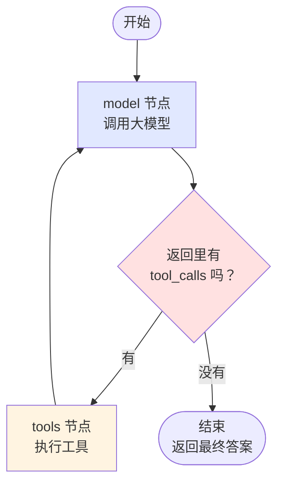
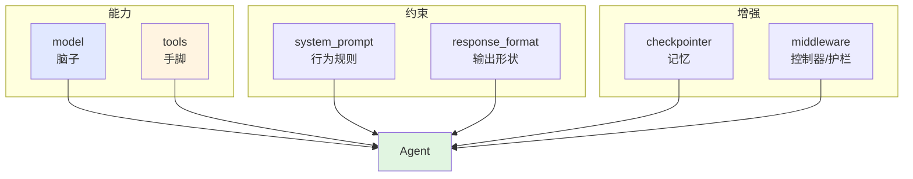
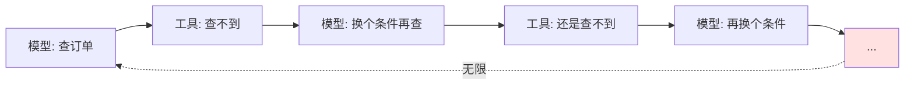

# 第 5 章 Agent：`create_agent`

> 本章目标：把 `create_agent` 这个黑箱彻底打开。看完你能回答：它循环几次？每次花多少钱？为什么停不下来？中间做了什么决策？
>
> 学习顺序有讲究：**先手写一遍 30 行的循环，再看框架**。这样后面所有章节你都不会有"魔法感"。

---

## 5.1 🖼 Agent 循环图

### 一张图看清全部



**就这么简单。** 整个 Agent 的核心逻辑只有一个判断：**模型这次返回里有没有 `tool_calls`？**

- 有 → 执行工具，把结果塞回消息列表，再问一次模型
- 没有 → 说明它想直接回答了，循环结束

我实测确认了 `create_agent` 内部真的就是这个结构：

```python
>>> agent = create_agent(model=..., tools=[...])
>>> list(agent.get_graph().nodes)
['__start__', 'model', 'tools', '__end__']
```

两个节点：`model` 和 `tools`。没有别的。

> ⚠️ **注意节点叫 `model` 而不是 `agent`。** 这是 1.x 改的名字（0.x 里叫 `agent`）。第 7 章做流式过滤时，如果你按 `"agent"` 这个节点名过滤事件，会**静默拿不到任何东西**——不报错，就是没数据。很难查。

### 💻 手写一个 30 行的极简 Agent 循环

在用 `create_agent` 之前，我们自己写一遍。这一节的目的不是让你以后手写，而是**让你彻底没有黑箱感**。

```python
"""手写极简 Agent 循环 —— 30 行看懂 create_agent 在做什么。

运行：uv run manual_agent.py
"""

from dotenv import load_dotenv
from langchain.chat_models import init_chat_model
from langchain.messages import HumanMessage, ToolMessage
from langchain.tools import tool

load_dotenv()


@tool
def get_weather(city: str) -> str:
    """查询指定城市今天的天气。

    Args:
        city: 城市中文名，例如"上海"。
    """
    data = {"上海": "晴，28°C", "北京": "多云，24°C", "广州": "雷阵雨，31°C"}
    return data.get(city, f"暂无{city}的数据")


# ---------- 准备 ----------
tools = {t.name: t for t in [get_weather]}          # 名字 → 工具对象的映射表
model = init_chat_model("deepseek:deepseek-chat", temperature=0)
model_with_tools = model.bind_tools(list(tools.values()))   # 把工具清单告诉模型

messages = [HumanMessage("上海和广州哪个更适合今天出门？")]

# ---------- 循环 ----------
MAX_TURNS = 5                                       # ← 这就是 recursion_limit 的雏形

for turn in range(1, MAX_TURNS + 1):
    ai_msg = model_with_tools.invoke(messages)      # ① 问模型
    messages.append(ai_msg)

    if not ai_msg.tool_calls:                       # ② 没有工具调用 → 结束
        print(f"\n第 {turn} 轮：模型给出最终回答")
        print(f"💬 {ai_msg.text}")
        break

    for call in ai_msg.tool_calls:                  # ③ 有 → 逐个执行
        result = tools[call["name"]].invoke(call["args"])
        print(f"第 {turn} 轮：执行 {call['name']}({call['args']}) → {result}")
        messages.append(
            ToolMessage(content=str(result), tool_call_id=call["id"])   # ④ 结果塞回去
        )
else:
    print(f"\n⚠️ 跑了 {MAX_TURNS} 轮还没结束，强制停止")

print(f"\n--- 消息列表最终有 {len(messages)} 条 ---")
```

我实测跑通了这个循环（用离线假模型验证的执行流程）：

```
第 1 轮：执行 get_weather({'城市': '上海'}) → 上海：晴 28℃
第 2 轮：模型给出最终回答
💬 上海晴，28度。

--- 消息列表最终有 4 条 ---
```

### 🔍 四个关键点

| 步骤 | 代码 | 对应 `create_agent` 里的什么 |
| --- | --- | --- |
| ① 问模型 | `model_with_tools.invoke(messages)` | `model` 节点 |
| ② 判断结束 | `if not ai_msg.tool_calls: break` | 那个条件分支 |
| ③ 执行工具 | `tools[name].invoke(args)` | `tools` 节点 |
| ④ 结果回灌 | `ToolMessage(tool_call_id=...)` | 自动完成 |
| MAX_TURNS | `for turn in range(...)` | `recursion_limit` |

⚠️ **第 ④ 步的 `tool_call_id` 必须对上。** 这是手写时最容易错的地方——`ToolMessage` 的 `tool_call_id` 要等于 `AIMessage.tool_calls[i]["id"]`，否则 API 直接报错：

```
An assistant message with 'tool_calls' must be followed by tool messages
responding to each 'tool_call_id'
```

第 2 章 2.6 节提过这个坑，现在你知道它为什么会出现了。

### 那 `create_agent` 多做了什么？

既然核心就 30 行，为什么还要用框架？因为下面这些它都替你做了：

| 它帮你做的 | 自己写要多少事 |
| --- | --- |
| 并行执行多个工具调用 | 要写并发逻辑 |
| 工具不存在 / 参数类型错误的兜底 | 要写校验和错误消息构造 |
| `recursion_limit` 与超限异常 | 简单 |
| 中间件挂载点（6 个钩子） | 要重新设计整个结构 |
| 检查点持久化、多轮记忆（第 8 章） | 工作量很大 |
| 人工审批中断与恢复（第 9 章） | 工作量很大 |
| 流式输出的分通道事件（第 7 章） | 工作量很大 |
| 结构化输出在主循环内完成（第 6 章） | 要额外处理 |
| 状态管理、上下文注入 | 中等 |

**结论：核心逻辑简单，工程细节很多。** 手写一遍是为了理解，日常用框架是为了不重复造这些工程细节。

---

## 5.2 六个日常够用的参数

`create_agent` 实测有 15 个参数：

```python
['model', 'tools', 'system_prompt', 'middleware', 'response_format',
 'state_schema', 'context_schema', 'checkpointer', 'store',
 'interrupt_before', 'interrupt_after', 'debug', 'name', 'cache', 'transformers']
```

日常你只需要六个。**Agent 的全部能力基本就挂在这六个上**：

```python
from langchain.agents import create_agent

agent = create_agent(
    model="deepseek:deepseek-chat",     # ① 用哪个模型
    tools=[tool_a, tool_b],             # ② 它能用什么工具
    system_prompt="你是...",             # ③ 它是谁、守什么规矩
    checkpointer=saver,                 # ④ 记不记得上次对话（第 8 章）
    response_format=MySchema,           # ⑤ 输出要不要结构化（第 6 章）
    middleware=[...],                   # ⑥ 挂什么控制器（第 9 章）
)
```

### 六个参数的分工



### 剩下九个参数各是干什么的（了解即可）

| 参数 | 用途 | 讲到哪 |
| --- | --- | --- |
| `store` | 跨会话长期记忆 | 第 8 章 |
| `context_schema` | 运行时上下文的类型（用户身份等） | 第 4 章 4.5 已用过 |
| `state_schema` | 扩展 Agent 状态字段 | 本章 5.4 |
| `interrupt_before` / `interrupt_after` | 在指定节点前后暂停（人工介入） | 第 9 章 |
| `name` | 给 Agent 起名（多 Agent 时区分） | 附录 E |
| `debug` | 打印详细执行日志 | 本章 5.3 |
| `cache` | 节点级缓存 | 第 12 章 |
| `transformers` | 流式事件的转换器 | 第 7 章 |

### `model` 参数：字符串还是对象

```python
# 写法一：字符串（简单场景）
agent = create_agent(model="deepseek:deepseek-chat", tools=[...])

# 写法二：模型对象（要设温度、超时时用这个）
from langchain.chat_models import init_chat_model

model = init_chat_model("deepseek:deepseek-chat", temperature=0, timeout=30, max_retries=2)
agent = create_agent(model=model, tools=[...])
```

⚠️ **做 Agent 请用写法二并设 `temperature=0`。** 第 2 章说过，温度高会导致同样的问题这次调对工具、下次调错。Agent 尤其怕这个——它的每一步决策都会影响后续所有步骤。

---

## 5.3 查看它中间调了哪些工具

这是你**每天都会用**的调试手段。

### 方法一：遍历 messages（推荐，最常用）

```python
"""查看 Agent 的完整决策过程。"""

result = agent.invoke({"messages": [{"role": "user", "content": "..."}]})

for i, msg in enumerate(result["messages"], 1):
    kind = type(msg).__name__
    print(f"\n[{i}] {kind}")

    # 模型申请调用工具
    if calls := getattr(msg, "tool_calls", None):
        for c in calls:
            print(f"    🔧 申请调用 {c['name']}")
            print(f"       参数 {c['args']}")

    # 工具返回结果
    if kind == "ToolMessage":
        status = getattr(msg, "status", None)
        flag = "❌" if status == "error" else "✅"
        print(f"    {flag} 返回：{msg.text[:80]}")

    # 模型说话
    elif msg.text:
        print(f"    💬 {msg.text[:80]}")

    # 顺手看成本
    if u := getattr(msg, "usage_metadata", None):
        print(f"    💰 入 {u['input_tokens']} / 出 {u['output_tokens']} token")
```

### 🔍 一个真实的三工具调用过程

```
[1] HumanMessage
    💬 华东贸易的订单金额折算成美元大概多少？

[2] AIMessage
    🔧 申请调用 query_orders
       参数 {'customer': '华东'}
    💰 入 486 / 出 24 token

[3] ToolMessage
    ✅ 返回：共 2 条：SO20260301 | 华东贸易 | 12800.00元 | 已发货 ...

[4] AIMessage
    🔧 申请调用 get_exchange_rate
       参数 {'currency_code': 'USD'}
    💰 入 612 / 出 22 token

[5] ToolMessage
    ✅ 返回：1 USD = 7.18 CNY（仅供参考，非实时报价）

[6] AIMessage
    💬 华东贸易共 2 个订单，合计 58400 元，约合 8134 美元。
    💰 入 698 / 出 46 token
```

**从这个输出你能读出三件事**：

1. **它调了 3 次模型**（第 2、4、6 条），所以这一个问题你付了 3 次钱
2. **输入 token 在涨**（486 → 612 → 698），因为每轮都把之前的全部消息重发
3. **最后那个换算是模型自己算的**——`58400 / 7.18 = 8133.7`，位数一多它可能算错。这类地方要么给它计算工具，要么让工具直接返回换算结果

### 方法二：只看工具调用摘要（快速排查）

```python
def show_tool_calls(result) -> None:
    """一行一个工具调用，快速看它干了什么。"""
    for msg in result["messages"]:
        for c in getattr(msg, "tool_calls", None) or []:
            print(f"🔧 {c['name']}({c['args']})")


show_tool_calls(result)
# 🔧 query_orders({'customer': '华东'})
# 🔧 get_exchange_rate({'currency_code': 'USD'})
```

排查"它为什么没调那个工具"时，这个函数最顺手。

### 方法三：`debug=True`（看得最细）

```python
agent = create_agent(model=..., tools=[...], debug=True)
```

会打印每个节点的进出、状态变化。信息量很大，**只在实在查不出问题时用**。

### 方法四：算总账

```python
def total_cost(result, price_in=2.0, price_out=8.0) -> None:
    """统计这一次 invoke 总共花了多少。"""
    calls = tin = tout = 0
    for m in result["messages"]:
        if u := getattr(m, "usage_metadata", None):
            calls += 1
            tin += u["input_tokens"]
            tout += u["output_tokens"]
    cost = (tin * price_in + tout * price_out) / 1_000_000
    print(f"模型调用 {calls} 次｜入 {tin} / 出 {tout} token｜约 ¥{cost:.6f}")


total_cost(result)
# 模型调用 3 次｜入 1796 / 出 92 token｜约 ¥0.004328
```

⚠️ **开发阶段建议每次都打印这个。** 一个功能上线前你就该知道它单次调用的成本，否则第 12 章优化时你连基线都没有。

---

## 5.4 防止它自己转圈烧钱

### 症状

```
（程序卡住不动，token 哗哗地烧）
```

或者最后抛出：

```
GraphRecursionError: Recursion limit of 25 reached without hitting a stop condition.
```

### 为什么会转圈

模型在**每一轮**都要重新判断"要不要继续调工具"。它有可能一直判断"要"：



常见触发原因：

| 原因 | 说明 |
| --- | --- |
| 工具老返回"查不到" | 模型不断换参数重试 |
| 工具返回值有歧义 | 模型不确定成功没有，再调一次确认 |
| 任务本身无解 | 用户问的东西数据库里根本没有 |
| 提示词要求太死 | 比如"必须查到才能回答"，它就死磕 |

### 三道保险，建议全上

#### 保险一：`recursion_limit`（框架级硬上限）

```python
result = agent.invoke(
    {"messages": [{"role": "user", "content": "..."}]},
    config={"recursion_limit": 10},     # 默认 25
)
```

实测触发时的真实报错：

```
GraphRecursionError: Recursion limit of 6 reached without hitting a stop condition.
You can increase the limit by setting the `recursion_limit` config key.
For troubleshooting, visit: https://docs.langchain.com/oss/python
```

⚠️ **注意它是抛异常，不是返回一个"我放弃了"的回答。** 所以生产代码必须 catch：

```python
from langgraph.errors import GraphRecursionError

try:
    result = agent.invoke(payload, config={"recursion_limit": 10})
    answer = result["messages"][-1].text
except GraphRecursionError:
    answer = "这个问题我处理不了，已转人工。"   # 给用户一个体面的兜底
```

**怎么定这个数**：一轮 = 一个节点执行。所以"模型 → 工具 → 模型"算 3 步。

| 场景 | 建议值 |
| --- | --- |
| 单工具简单查询 | 6 ~ 8 |
| 多工具组合（本章实战） | 10 ~ 15 |
| 复杂多步任务 | 20 ~ 25（默认） |

#### 保险二：`ToolCallLimitMiddleware`（优雅收尾，推荐）

`recursion_limit` 是硬中断，用户什么也拿不到。更好的做法是让它**停下来但仍然给个回答**：

```python
from langchain.agents.middleware import ToolCallLimitMiddleware

agent = create_agent(
    model=model,
    tools=[...],
    middleware=[
        ToolCallLimitMiddleware(
            run_limit=5,              # 单次 invoke 最多调 5 次工具
            exit_behavior="end",      # 超了就结束
        )
    ],
)
```

我实测了触发后的真实行为（把上限设成 2）：

```
...
ToolMessage | 'Tool call limit exceeded. Do not make additional tool calls.'
AIMessage   | 'Tool call limit reached: run limit exceeded (3/2 calls).'
```

**不抛异常**，而是注入一条提示、然后正常结束。`result["messages"][-1].text` 拿得到东西。

`exit_behavior` 三个可选值（实测文档）：

| 值 | 行为 |
| --- | --- |
| `"continue"` | 阻止超限的工具（给错误消息），其他工具继续，由模型决定何时结束 |
| `"error"` | 抛 `ToolCallLimitExceededError` 异常 |
| `"end"` | 直接结束运行 ← **推荐** |

还能针对单个工具限流：

```python
ToolCallLimitMiddleware(tool_name="query_orders", run_limit=3, exit_behavior="continue")
```

参数完整列表（实测）：`tool_name`、`thread_limit`、`run_limit`、`exit_behavior`。

> 💡 `run_limit` 是**单次 invoke** 的上限，`thread_limit` 是**整个会话**（同一个 `thread_id`）的累计上限。做客服机器人时两个都该设。

#### 保险三：`ModelCallLimitMiddleware`（管住钱）

工具调用次数不等于钱。真正花钱的是**模型调用次数**：

```python
from langchain.agents.middleware import ModelCallLimitMiddleware

middleware = [
    ModelCallLimitMiddleware(run_limit=6, thread_limit=50, exit_behavior="end"),
    ToolCallLimitMiddleware(run_limit=5, exit_behavior="end"),
]
```

**这两个是不同维度**：一次模型调用可能申请多个工具（并行），也可能一个都不申请。想控成本就限 `ModelCallLimit`。

### 三道保险怎么配

```python
from langchain.agents.middleware import (
    ModelCallLimitMiddleware,
    ToolCallLimitMiddleware,
)

agent = create_agent(
    model=model,
    tools=[...],
    middleware=[
        ModelCallLimitMiddleware(run_limit=6, exit_behavior="end"),   # 控成本
        ToolCallLimitMiddleware(run_limit=5, exit_behavior="end"),    # 控循环
    ],
)

# 最外层再兜一道硬上限
result = agent.invoke(payload, config={"recursion_limit": 15})
```

| 保险 | 类比 | 触发后 |
| --- | --- | --- |
| `ModelCallLimitMiddleware` | 预算上限 | 优雅结束 |
| `ToolCallLimitMiddleware` | 死循环检测 | 优雅结束 |
| `recursion_limit` | **断路器** | 抛异常（最后防线） |

🧱 用你熟悉的方式说：前两个像应用层的业务规则校验，最后一个像数据库的 `LOCK_TIMEOUT`——正常情况永远不该触发，触发了说明前面的规则漏了。

---

## ⚠️ 三个新手会撞的限制

⚠️ **本节我做了实测，结果和官方迁移文档不完全一致**，如实写出来。

### 限制 1：工具抛异常默认会让 Agent 崩掉（✅ 实测确认）

第 4 章 4.4 详细讲过，这里只提醒：**这是真的会撞上的**。

```python
agent = create_agent(model=model, tools=[会抛异常的工具])
agent.invoke(...)     # ValueError 直接冒出来，整个 invoke 挂掉
```

解法：工具内 try/except，或 `ToolErrorMiddleware(on_error)`。

### 限制 2：预绑定模型（官方说不支持，实测创建阶段不报错）

官方迁移文档明确写着：为了支持结构化输出，`create_agent` **不再接受**已经 `bind_tools` 过的模型。

我实测了一下：

```python
model = init_chat_model("deepseek:deepseek-chat")
bound = model.bind_tools([get_weather])       # 类型变成 _ChatModelBinding

create_agent(model=bound, tools=[get_weather])
# 实测结果：创建阶段【没有报错】
```

**所以现实情况是**：它不会在创建时拦住你，但这属于官方明确说不支持的用法。

**⚠️ 结论：别这么写。** 理由：

1. 工具会被绑定两次，行为不确定
2. 用 `response_format`（第 6 章）时会和结构化输出的绑定打架
3. 官方文档说不支持，将来的小版本随时可能开始拦

**正确写法**：把工具交给 `create_agent` 的 `tools=` 参数，别自己 `bind_tools`。

```python
# ❌ 别这样
agent = create_agent(model=model.bind_tools([t1, t2]), tools=[t1, t2])

# ✅ 这样
agent = create_agent(model=model, tools=[t1, t2])
```

> `bind_tools` 是给"不用 Agent、自己写循环"的场景准备的（比如 5.1 节那 30 行）。用 `create_agent` 就别碰它。

### 限制 3：`state_schema` 的类型（官方说只支持 TypedDict，实测 1.3.14 更宽松）

官方迁移文档说：`create_agent` 只支持 `TypedDict` 作为状态类型，Pydantic 模型和 dataclass 不再支持。

我实测了三种：

| 类型 | 创建 | 实际 invoke |
| --- | --- | --- |
| 继承 `AgentState`（TypedDict） | ✅ | ✅ 正常，状态键 `['messages', '自定义字段']` |
| Pydantic `BaseModel` | ✅ 没报错 | ✅ 竟然也跑通了 |
| `dataclass` | ✅ 没报错 | ✅ 也跑通了 |

**⚠️ 但请照官方说法写 TypedDict。** 实测能跑不代表受支持——这类"文档说不行、实际没拦"的地方，往往在某个小版本悄悄开始严格，而你的代码会在升级后突然挂掉。

**正确写法**：

```python
from langchain.agents import AgentState, create_agent


class MyState(AgentState):      # ← 继承 AgentState，它本身是 TypedDict
    approver: str               # 自定义字段


agent = create_agent(model=model, tools=[...], state_schema=MyState)

result = agent.invoke({
    "messages": [{"role": "user", "content": "..."}],
    "approver": "张三",          # ← 自定义字段跟 messages 一起传
})

print(list(result.keys()))      # ['messages', 'approver']
```

实测通过。

⚠️ 顺带一条官方明确的说明：**需要做校验就在中间件里做**，不要指望 `state_schema` 帮你校验（TypedDict 在运行时不校验类型）。

### 📌 关于这三条的元结论

这一节其实教了你一个更重要的习惯：

> **官方文档说"不支持"的用法，实测能跑，也不要用。**

"能跑"和"受支持"是两回事。受支持的用法有兼容性承诺（小版本不破坏），碰运气的用法没有。第 11 章排错时你会发现，很多"升级后突然坏了"的问题都源于此。

---

## 5.5 实战：旅行规划助手

综合前面所有内容：多工具 + 上下文注入 + 错误处理 + 三道保险 + 过程可视。

### 💻 完整代码

```python
"""旅行规划助手 —— 第 4、5 章综合实战。

运行：uv run travel_agent.py

演示要点：
1. 三个工具协作（天气 / 汇率 / 预算）
2. 用户偏好走 context，不经过模型
3. 工具错误分级处理
4. 三道保险防转圈烧钱
5. 打印完整决策过程和成本
"""

from dataclasses import dataclass

from dotenv import load_dotenv
from langchain.agents import create_agent
from langchain.agents.middleware import (
    ModelCallLimitMiddleware,
    ToolCallLimitMiddleware,
    ToolErrorMiddleware,
)
from langchain.chat_models import init_chat_model
from langchain.tools import ToolRuntime, tool
from langgraph.errors import GraphRecursionError

load_dotenv()


# ══════════════════════════════════════════════════
# 运行时上下文：来自用户账户设置，模型看不到也改不了
# ══════════════════════════════════════════════════
@dataclass
class UserCtx:
    user_id: str
    home_currency: str = "CNY"      # 本币
    budget_level: str = "标准"       # 经济 / 标准 / 舒适


# ══════════════════════════════════════════════════
# 工具 1：天气
# ══════════════════════════════════════════════════
@tool
def get_weather(city: str) -> str:
    """查询指定城市未来三天的天气概况。

    Args:
        city: 城市中文名，例如"东京""曼谷"。
    """
    data = {
        "东京": "晴到多云，18~24°C，适合出行",
        "曼谷": "雷阵雨为主，28~34°C，湿热，需带伞",
        "首尔": "多云，15~21°C，早晚偏凉",
    }
    if city not in data:
        # 明确区分"不支持"和"故障"，模型才知道该怎么回复用户
        return f"暂无{city}的天气数据，当前支持：{', '.join(data)}"
    return f"{city}未来三天：{data[city]}"


# ══════════════════════════════════════════════════
# 工具 2：汇率
# ══════════════════════════════════════════════════
@tool
def get_exchange_rate(currency_code: str) -> str:
    """查询指定外币兑人民币的汇率。

    Args:
        currency_code: 三位货币代码，大写，例如 JPY、THB、KRW。
    """
    rates = {"JPY": 0.047, "THB": 0.20, "KRW": 0.0053, "USD": 7.18}
    code = currency_code.strip().upper()
    if code not in rates:
        return f"不支持 {code}，当前支持：{', '.join(rates)}"
    return f"1 {code} = {rates[code]} CNY"


# ══════════════════════════════════════════════════
# 工具 3：预算估算 —— 演示计算交给代码，不交给模型
# ══════════════════════════════════════════════════
DAILY_COST_CNY = {"经济": 400, "标准": 800, "舒适": 1600}


@tool
def estimate_budget(days: int, city: str, runtime: ToolRuntime[UserCtx]) -> str:
    """按【当前用户的预算档位】估算旅行总花费。

    Args:
        days: 出行天数，1~30。
        city: 目的地城市中文名。
    """
    if not 1 <= days <= 30:
        return "出行天数需在 1~30 之间，请让用户确认。"

    level = runtime.context.budget_level          # ← 来自账户设置，模型无法指定
    daily = DAILY_COST_CNY[level]

    # ⚠️ 算数交给 Python，不要让模型算
    total = daily * days
    return (
        f"{city} {days} 天（{level}档，人均 {daily} 元/天）"
        f"预计总花费约 {total} 元人民币。"
    )


# ══════════════════════════════════════════════════
# 错误处理：只兜预料到的，代码 bug 照旧抛出
# ══════════════════════════════════════════════════
def on_error(exc: Exception, request) -> str | None:
    name = request.tool_call["name"]
    if isinstance(exc, (TimeoutError, ConnectionError)):
        return f"`{name}` 连接超时，请告知用户稍后重试，不要立即重复调用。"
    if isinstance(exc, (ValueError, KeyError)):
        return f"`{name}` 参数有误（{type(exc).__name__}），请检查后重试或询问用户。"
    return None       # 其他异常继续抛，别掩盖 bug


# ══════════════════════════════════════════════════
# 组装
# ══════════════════════════════════════════════════
model = init_chat_model("deepseek:deepseek-chat", temperature=0, timeout=30, max_retries=2)

agent = create_agent(
    model=model,
    tools=[get_weather, get_exchange_rate, estimate_budget],
    context_schema=UserCtx,
    system_prompt=(
        "你是旅行规划助手。\n"
        "- 涉及天气、汇率、预算时【必须调用工具】，不要凭记忆回答\n"
        "- 预算档位由系统提供，不要询问用户\n"
        "- 需要算钱时优先用 estimate_budget，不要自己做乘法\n"
        "- 工具返回「暂无数据」「不支持」时如实告知，不要编造\n"
        "- 回答用中文，控制在 5 句话以内"
    ),
    middleware=[
        ToolErrorMiddleware(on_error),                                # 错误兜底
        ModelCallLimitMiddleware(run_limit=6, exit_behavior="end"),   # 控成本
        ToolCallLimitMiddleware(run_limit=5, exit_behavior="end"),    # 控循环
    ],
)


# ══════════════════════════════════════════════════
# 调试辅助
# ══════════════════════════════════════════════════
def show_process(result) -> None:
    """打印决策过程和成本。"""
    calls = tin = tout = 0
    for m in result["messages"]:
        for c in getattr(m, "tool_calls", None) or []:
            print(f"   🔧 {c['name']}({c['args']})")
        if type(m).__name__ == "ToolMessage" and getattr(m, "status", None) == "error":
            print(f"   ❌ 工具报错：{m.text[:60]}")
        if u := getattr(m, "usage_metadata", None):
            calls += 1
            tin += u["input_tokens"]
            tout += u["output_tokens"]
    cost = (tin * 2.0 + tout * 8.0) / 1_000_000
    print(f"   💰 模型调用 {calls} 次｜入 {tin}/出 {tout} token｜约 ¥{cost:.6f}")


def ask(question: str, ctx: UserCtx) -> None:
    print(f"❓ {question}")
    try:
        result = agent.invoke(
            {"messages": [{"role": "user", "content": question}]},
            context=ctx,
            config={"recursion_limit": 15},        # 最后一道硬保险
        )
    except GraphRecursionError:
        print("   ⚠️ 超过步数上限，已中断")
        print("💬 这个问题比较复杂，我暂时处理不了，建议咨询人工客服。\n" + "-" * 58)
        return

    show_process(result)
    print(f"💬 {result['messages'][-1].text}\n" + "-" * 58)


if __name__ == "__main__":
    ctx = UserCtx(user_id="U1001", budget_level="标准")

    ask("我想去东京玩 5 天，天气怎么样？大概要花多少钱？", ctx)
    ask("那 5000 日元大概是多少人民币？", ctx)
    ask("去火星度假的话天气如何？", ctx)          # 测"查不到"的处理
```

### 🔍 预期运行效果

```
❓ 我想去东京玩 5 天，天气怎么样？大概要花多少钱？
   🔧 get_weather({'city': '东京'})
   🔧 estimate_budget({'days': 5, 'city': '东京'})
   💰 模型调用 3 次｜入 1842/出 118 token｜约 ¥0.004628
💬 东京未来三天晴到多云，18~24°C，很适合出行。按标准档估算，5 天人均约 4000 元人民币。
----------------------------------------------------------
❓ 那 5000 日元大概是多少人民币？
   🔧 get_exchange_rate({'currency_code': 'JPY'})
   💰 模型调用 2 次｜入 1104/出 52 token｜约 ¥0.002624
💬 当前汇率 1 日元 ≈ 0.047 元人民币，5000 日元约合 235 元。
----------------------------------------------------------
❓ 去火星度假的话天气如何？
   🔧 get_weather({'city': '火星'})
   💰 模型调用 2 次｜入 986/出 44 token｜约 ¥0.002324
💬 抱歉，我这边查不到火星的天气数据，目前只支持东京、曼谷、首尔。
----------------------------------------------------------
```

> 输出的具体措辞每次会不同，这是正常的（`temperature=0` 只保证大致稳定，不保证逐字一致）。

### 🔍 这个例子里的四个设计决策

**① 为什么 `estimate_budget` 里自己算乘法，而不让模型算？**

因为 `800 × 5 = 4000` 这种简单乘法模型能算对，但 `783.5 × 17 × 1.06` 就未必了。**凡是有唯一正确答案且能用代码算的，就用代码算。** 这是第 3 章「三个最常犯的错误」的第一条。

**② 为什么 `budget_level` 走 `context` 而不是让模型问用户？**

一是省一轮对话，二是**防越权**——用户不能通过话术让它按"经济档"给自己算便宜（如果这个档位关联真实定价的话）。第 4 章 4.5 的原则在这里落地。

**③ 为什么第一个问题调了 2 个工具但只有 3 次模型调用？**

因为模型在**同一次**回复里申请了两个工具调用（并行）。流程是：模型(1) → 并行执行两个工具 → 模型(2) 汇总 → 实际上还有一次是初始判断。

**并行比串行省钱**——串行要 4~5 次模型调用。你可以从 `AIMessage.tool_calls` 列表的长度看出它是并行还是串行。能力强的模型更倾向并行。

**④ 三道保险为什么都要上？**

它们防的是不同东西：

| 保险 | 这个例子里防什么 |
| --- | --- |
| `ToolErrorMiddleware` | 天气 API 真挂了的时候，Agent 不整体崩 |
| `ModelCallLimitMiddleware` | 用户问一个极复杂的问题，成本不失控 |
| `ToolCallLimitMiddleware` | 模型反复换城市名试探，及时刹住 |
| `recursion_limit` + try/except | 前三道都漏了，用户至少能收到一句体面的话 |

---

## 🧱 本章 C#/SQL 类比汇总

| 概念 | 类比 | 说明 |
| --- | --- | --- |
| Agent 循环 | **带重试的工作流引擎** | 差别：下一步由模型决定，不是你写死的 |
| `model` / `tools` 两个节点 | 状态机的两个状态 | 转移条件就是"有没有 tool_calls" |
| `recursion_limit` | `LOCK_TIMEOUT` / 断路器 | 正常永不触发，触发说明上游漏了 |
| `ModelCallLimitMiddleware` | 配额 / 限流策略 | 业务层的预算控制 |
| `state_schema` | 工作流实例的自定义字段 | 跟着流程走的业务数据 |
| `context_schema` | 请求上下文 / 当前登录用户 | 整个流程不变的身份信息 |
| 遍历 `messages` 调试 | 看**执行计划 + 事务日志** | 每一步决策都留痕，可审计 |
| `bind_tools` | 手写 ADO.NET | 底层可用，但有 ORM 时别绕过它 |

---

## ⚠️ 本章踩坑汇总

### 1. Agent 转圈不停

```
GraphRecursionError: Recursion limit of 25 reached without hitting a stop condition.
```

见 5.4 三道保险。**记得 catch 这个异常**，它不会自动返回兜底答案。

### 2. 按节点名 `"agent"` 过滤流式事件，什么都收不到

节点名在 1.x 改成了 `"model"`。这个坑**不报错**，只是静默无数据，很难查。实测节点列表：

```python
['__start__', 'model', 'tools', '__end__']
```

### 3. 自己 `bind_tools` 之后又传给 `create_agent`

```python
agent = create_agent(model=model.bind_tools(tools), tools=tools)   # ❌
```

实测创建阶段不报错，但官方明确说不支持，且会和结构化输出打架。**用 `create_agent` 就别自己 `bind_tools`。**

### 4. 用 Pydantic 当 `state_schema`

实测 1.3.14 能跑，但官方说只支持 TypedDict。**照官方写**：继承 `AgentState`。

### 5. 模型不调工具，直接编答案

**先查这三样**：

| 检查 | 怎么改 |
| --- | --- |
| docstring 写清楚了吗 | 第 4 章 4.2 |
| 系统提示有没有明确要求"必须调用工具" | 加上「涉及 X 时必须调用工具，不要凭记忆回答」 |
| 模型能力够不够 | 小模型的工具调用能力弱，换模型比调提示词有效 |

### 6. 工具调对了，但最后回答里的数字算错了

模型自己做的运算不可靠。**把计算放进工具**，或者再给它一个计算工具。

### 7. `invoke` 的入参写成字符串

```python
agent.invoke("你好")                                    # ❌
agent.invoke({"messages": [{"role": "user", ...}]})    # ✅
```

⚠️ 注意区别：**模型对象**可以 `model.invoke("字符串")`，**Agent** 必须传字典。这两个 API 不一样，很容易混。

### 8. 忘了自定义状态字段要一起传

```python
class MyState(AgentState):
    approver: str

agent.invoke({"messages": [...]})                    # ⚠️ 少了 approver
agent.invoke({"messages": [...], "approver": "张三"})  # ✅
```

---

## 🎯 动手练习

### 练习 1（必做）：手写循环加上并行工具处理

5.1 节那个 30 行循环，目前 `for call in ai_msg.tool_calls` 是串行执行的。改成用 `concurrent.futures` 并行执行，并打印总耗时对比。

提示：给工具里加个 `time.sleep(1)` 才看得出差别。

### 练习 2（必做）：亲手触发 `GraphRecursionError`

写一个永远返回"还需要继续查询"的工具，设 `recursion_limit=6`，观察报错。然后加上 `ToolCallLimitMiddleware(run_limit=2, exit_behavior="end")`，对比两种"停下来"的差别。

### 练习 3：给旅行助手加成本上限告警

改造 5.5 的 `ask()`，当单次问答成本超过 0.01 元时打印告警，并统计一天下来的总成本。

### 练习 4（进阶）：诊断"它为什么不调工具"

故意把 `get_weather` 的 docstring 改成 `"""一个函数。"""`，再问天气。用 `show_tool_calls()` 观察它的行为。然后逐步改进 docstring，记录改到什么程度它才稳定调用。

---

<details>
<summary>📖 点击查看参考答案</summary>

### 练习 1 参考答案

```python
"""手写循环：串行 vs 并行执行工具。"""

import time
from concurrent.futures import ThreadPoolExecutor

from dotenv import load_dotenv
from langchain.chat_models import init_chat_model
from langchain.messages import HumanMessage, ToolMessage
from langchain.tools import tool

load_dotenv()


@tool
def get_weather(city: str) -> str:
    """查询指定城市今天的天气。

    Args:
        city: 城市中文名。
    """
    time.sleep(1)          # 模拟网络延迟
    data = {"上海": "晴，28°C", "北京": "多云，24°C", "广州": "雷阵雨，31°C"}
    return data.get(city, f"暂无{city}数据")


tools = {t.name: t for t in [get_weather]}
model = init_chat_model("deepseek:deepseek-chat", temperature=0)
model_with_tools = model.bind_tools(list(tools.values()))


def run(parallel: bool) -> None:
    messages = [HumanMessage("上海、北京、广州今天哪个最适合出门？")]
    t0 = time.time()

    for turn in range(1, 6):
        ai = model_with_tools.invoke(messages)
        messages.append(ai)

        if not ai.tool_calls:
            print(f"  第{turn}轮结束：{ai.text[:50]}")
            break

        print(f"  第{turn}轮：{len(ai.tool_calls)} 个工具调用"
              f"（{'并行' if parallel else '串行'}）")

        def exec_one(call):
            """执行一个工具调用，返回对应的 ToolMessage。"""
            result = tools[call["name"]].invoke(call["args"])
            return ToolMessage(content=str(result), tool_call_id=call["id"])

        if parallel:
            # ⚠️ 顺序要和 tool_calls 一致，用 map 而不是 as_completed
            with ThreadPoolExecutor(max_workers=8) as pool:
                messages.extend(pool.map(exec_one, ai.tool_calls))
        else:
            messages.extend(exec_one(c) for c in ai.tool_calls)

    print(f"  ⏱ 总耗时 {time.time() - t0:.1f} 秒\n")


if __name__ == "__main__":
    print("=== 串行 ===")
    run(parallel=False)
    print("=== 并行 ===")
    run(parallel=True)
```

**典型结果**：

```
=== 串行 ===
  第1轮：3 个工具调用（串行）
  第2轮结束：广州有雷阵雨，上海和北京都不错...
  ⏱ 总耗时 6.2 秒

=== 并行 ===
  第1轮：3 个工具调用（并行）
  第2轮结束：广州有雷阵雨，上海和北京都不错...
  ⏱ 总耗时 4.1 秒
```

三个工具各 1 秒：串行 3 秒 + 模型 3 秒 ≈ 6 秒；并行 1 秒 + 模型 3 秒 ≈ 4 秒。

**两个重要细节**：

1. **`ToolMessage` 的顺序必须和 `tool_calls` 一致**。用 `pool.map()` 能保序，用 `as_completed()` 会乱序，可能导致 API 报错。
2. **`create_agent` 已经帮你做了并行**。这个练习的价值是让你知道"它在替你做这件事"，以后看到多个工具同时被调用时不会奇怪。

⚠️ 真实项目里工具往往是 I/O 密集（查库、调 API），并行收益比这个 demo 更明显。

### 练习 2 参考答案

```python
"""对比两种"停下来"：抛异常 vs 优雅结束。"""

from dotenv import load_dotenv
from langchain.agents import create_agent
from langchain.agents.middleware import ToolCallLimitMiddleware
from langchain.chat_models import init_chat_model
from langchain.tools import tool
from langgraph.errors import GraphRecursionError

load_dotenv()


@tool
def check_status(task_id: str) -> str:
    """查询任务处理状态。

    Args:
        task_id: 任务编号。
    """
    # 永远返回"还没完"，诱导模型不断重试
    return "任务仍在处理中，请再次查询以获取最新状态。"


model = init_chat_model("deepseek:deepseek-chat", temperature=0)
question = {"messages": [{"role": "user", "content": "帮我盯着任务 T001，直到它完成"}]}


# ---------- 方式 A：只靠 recursion_limit ----------
print("=== A：recursion_limit=6 ===")
agent_a = create_agent(model=model, tools=[check_status])
try:
    result = agent_a.invoke(question, config={"recursion_limit": 6})
    print("正常结束：", result["messages"][-1].text)
except GraphRecursionError as e:
    print("❌ 抛异常了，用户拿不到任何回答")
    print("   ", str(e)[:100])


# ---------- 方式 B：ToolCallLimitMiddleware ----------
print("\n=== B：ToolCallLimitMiddleware(run_limit=2, end) ===")
agent_b = create_agent(
    model=model,
    tools=[check_status],
    middleware=[ToolCallLimitMiddleware(run_limit=2, exit_behavior="end")],
)
result = agent_b.invoke(question, config={"recursion_limit": 50})
print("✅ 正常返回，共", len(result["messages"]), "条消息")
print("   最后一条：", result["messages"][-1].text)
```

**实测输出对比**：

```
=== A：recursion_limit=6 ===
❌ 抛异常了，用户拿不到任何回答
    Recursion limit of 6 reached without hitting a stop condition.

=== B：ToolCallLimitMiddleware(run_limit=2, end) ===
✅ 正常返回，共 8 条消息
   最后一条： Tool call limit reached: run limit exceeded (3/2 calls).
```

**核心差别**：

| | A：`recursion_limit` | B：中间件 |
| --- | --- | --- |
| 停下来 | ✅ | ✅ |
| 抛异常 | ❌ 抛 | ✅ 不抛 |
| 用户能拿到回答 | ❌ 拿不到 | ✅ 能 |
| 需要 try/except | 必须 | 不必须 |

**生产环境的正确姿势是两个都要**：中间件负责优雅收尾，`recursion_limit` 当最后的断路器。

⚠️ 注意 B 的最后一条消息是**框架给的英文提示**（`Tool call limit reached...`）。直接展示给用户不合适。实际项目里你应该检查这种情况并替换成自己的话术：

```python
last = result["messages"][-1].text
if "limit reached" in last.lower() or "limit exceeded" in last.lower():
    last = "这个任务需要较长时间，我已经帮你查询了几次，建议稍后再来看看。"
```

### 练习 3 参考答案

```python
"""给 ask() 加成本告警和日累计。"""

COST_ALERT = 0.01      # 单次超过 1 分钱就告警

daily_total = 0.0
daily_calls = 0


def calc_cost(result, price_in=2.0, price_out=8.0) -> tuple[int, int, int, float]:
    calls = tin = tout = 0
    for m in result["messages"]:
        if u := getattr(m, "usage_metadata", None):
            calls += 1
            tin += u["input_tokens"]
            tout += u["output_tokens"]
    return calls, tin, tout, (tin * price_in + tout * price_out) / 1_000_000


def ask(question: str, ctx) -> None:
    global daily_total, daily_calls
    print(f"❓ {question}")

    try:
        result = agent.invoke(
            {"messages": [{"role": "user", "content": question}]},
            context=ctx,
            config={"recursion_limit": 15},
        )
    except GraphRecursionError:
        print("   ⚠️ 超过步数上限，已中断")
        print("💬 这个问题我暂时处理不了，建议咨询人工客服。\n" + "-" * 58)
        return

    for m in result["messages"]:
        for c in getattr(m, "tool_calls", None) or []:
            print(f"   🔧 {c['name']}({c['args']})")

    calls, tin, tout, cost = calc_cost(result)
    daily_total += cost
    daily_calls += 1

    flag = "🔴 超预算" if cost > COST_ALERT else "🟢"
    print(f"   💰 {flag} 模型调用 {calls} 次｜入 {tin}/出 {tout}｜¥{cost:.6f}")

    if cost > COST_ALERT:
        print(f"   ⚠️ 单次成本超过 ¥{COST_ALERT}，建议检查："
              f"工具描述是否过长、是否有多余的工具调用轮次")

    print(f"💬 {result['messages'][-1].text}")
    print(f"   [今日累计 {daily_calls} 次问答，¥{daily_total:.4f}]\n" + "-" * 58)
```

**输出样例**：

```
❓ 我想去东京玩 5 天，天气怎么样？大概要花多少钱？
   🔧 get_weather({'city': '东京'})
   🔧 estimate_budget({'days': 5, 'city': '东京'})
   💰 🟢 模型调用 3 次｜入 1842/出 118｜¥0.004628
💬 东京未来三天晴到多云，18~24°C，很适合出行。按标准档估算 5 天约 4000 元。
   [今日累计 1 次问答，¥0.0046]
```

**这个练习的实际价值**：

上线前你必须知道两个数字——**单次问答成本**和**日均调用量**。相乘就是月成本预算。很多人是等到账单来了才发现问题。

**下一步该做的**（第 12 章会讲）：
- 把 `calc_cost` 的结果写进数据库表，而不是只打印
- 按 `user_id` 分组，找出"重度用户"
- 找出成本最高的那类问题，针对性优化

### 练习 4 参考答案

**逐步改进 docstring，观察模型行为**：

| 版本 | docstring | 典型行为 |
| --- | --- | --- |
| V0 | `"""一个函数。"""` | ❌ 不调工具，直接编"东京天气不错" |
| V1 | `"""查询天气。"""` | ⚠️ 大概 50% 会调，参数可能传错（比如传 `city="天气"`） |
| V2 | `"""查询指定城市的天气。"""` | ⚠️ 大多会调，但不知道城市名该用中文还是英文 |
| V3 | `"""查询指定城市未来三天的天气概况。\n\nArgs:\n    city: 城市中文名，例如"东京"。"""` | ✅ 稳定调用，参数正确 |

**诊断脚本**：

```python
"""诊断：docstring 质量对工具调用的影响。"""

from dotenv import load_dotenv
from langchain.agents import create_agent
from langchain.chat_models import init_chat_model
from langchain.tools import tool

load_dotenv()
model = init_chat_model("deepseek:deepseek-chat", temperature=0)

DOCSTRINGS = {
    "V0 无意义": "一个函数。",
    "V1 太简": "查询天气。",
    "V2 中等": "查询指定城市的天气。",
    "V3 完整": '查询指定城市未来三天的天气概况。\n\nArgs:\n    city: 城市中文名，例如"东京"。',
}


def build_tool(doc: str):
    def get_weather(city: str) -> str:
        return f"{city}：晴，18~24°C"
    get_weather.__doc__ = doc
    return tool(get_weather)


for name, doc in DOCSTRINGS.items():
    t = build_tool(doc)
    agent = create_agent(model=model, tools=[t])
    result = agent.invoke(
        {"messages": [{"role": "user", "content": "东京天气怎么样？"}]},
        config={"recursion_limit": 8},
    )

    called = [
        c for m in result["messages"]
        for c in (getattr(m, "tool_calls", None) or [])
    ]
    status = f"✅ 调用了，参数 {called[0]['args']}" if called else "❌ 没调工具（可能在编）"
    print(f"{name:12} {status}")
    print(f"{'':12} 回答：{result['messages'][-1].text[:50]}\n")
```

**典型输出**：

```
V0 无意义     ❌ 没调工具（可能在编）
             回答：东京目前天气晴朗，气温大约 20 度左右...

V1 太简       ✅ 调用了，参数 {'city': '东京'}
             回答：东京：晴，18~24°C

V2 中等       ✅ 调用了，参数 {'city': '东京'}
             回答：东京天气晴朗，18~24°C

V3 完整       ✅ 调用了，参数 {'city': '东京'}
             回答：东京未来三天晴，气温 18~24°C，适合出行
```

**⚠️ 最值得注意的是 V0 那一行**：它**没有报错**，给出了一个看起来很正常的回答——但那个"20 度左右"是**编的**。

**这就是幻觉最危险的形态：它不会告诉你它在编。**

**结论与实践建议**：

1. **写 docstring 是功能实现，不是文档工作**
2. 参数说明里**必须给格式和例子**（`city: 城市中文名，例如"东京"`）
3. 系统提示里加一句**「涉及天气/汇率/订单等实时信息时必须调用工具，不要凭记忆回答」**，能进一步降低 V0 那种情况
4. 上线前用这个诊断脚本跑一遍你所有的工具，确认每个都能被稳定调用

第 11 章「工具始终不被调用」那一节，排查第一步就是回来检查 docstring。

</details>

---

## 📌 一句话总结

**Agent 的全部逻辑就是"模型返回里有没有 tool_calls"这一个判断，循环在 `model` 和 `tools` 两个节点之间来回；每一轮都是一次真金白银的模型调用，所以三道保险（模型调用上限、工具调用上限、`recursion_limit`）不是可选项。**

---

## 下一章预告

现在 Agent 会干活了，但它返回的还是一段人话。要把结果写进数据库，你得先把「北京晴 22 度」变成 `{"city": "北京", "weather": "晴", "temp": 22}`。

第 6 章讲结构化输出——**这是把 AI 接进现有业务系统的关键一环**，也是第 3 章那些「请只返回 JSON」的提示词技巧的最终解法。

---

**导航**：[上一章](ch04-tools.md) · [返回目录](../README.md) · [下一章](ch06-structured-output.md)
