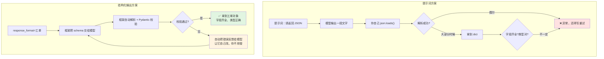
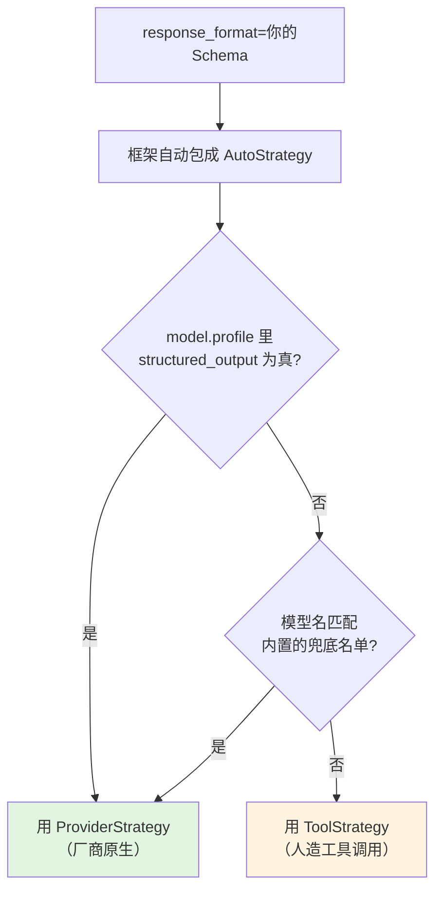

# 第 6 章 结构化输出：拿到能直接入库的数据

> 本章目标：让模型返回**字段齐全、类型受约束的 Python 对象**，而不是一段还要你去解析的文字。
>
> 这是把 AI 接进现有业务系统的关键一环。学完这章，「邮件转工单」「脏数据归一化」「Excel 自由文本拆字段」这类活你就能直接落地了。

---

## 6.1 为什么「请只返回 JSON」不靠谱

第 3 章我们用提示词逼模型输出固定格式，效果已经不错了。但只要量一大，你就会遇到这些：

### 五种真实的翻车方式

```python
# 你的提示词写着：只输出 JSON，不要任何解释

# 翻车 1：套了 markdown 代码块
'```json\n{"类别": "硬件故障"}\n```'

# 翻车 2：前面加了一句废话
'好的，以下是提取结果：\n{"类别": "硬件故障"}'

# 翻车 3：字段名换了语言
'{"category": "hardware_failure"}'

# 翻车 4：多冒出一个字段
'{"类别": "硬件故障", "建议": "尽快派人处理"}'

# 翻车 5：枚举值超出范围
'{"类别": "扫码枪读不出条码"}'      # 你只允许五个固定值
```

你的解析代码写成什么样都会崩。而且**这些错误是概率性的**——测试时十条都对，上线跑三千条就出十几条异常，最难查。

### 靠提示词的本质问题

> **提示词是"请求"，不是"约束"。** 你在请模型配合，而不是在限制它的输出空间。

第 3 章那张表再强调一遍：

| 目标 | 用提示词祈求 | 用机制保证 |
| --- | --- | --- |
| 输出必须是这个结构 | ❌ 概率性生效 | ✅ **本章的 `response_format`** |

### 🖼 两种做法的区别



关键差别在右下角那个框：**校验失败时，框架会自动把错误信息递给模型让它重试**，而不是抛给你。这个自我修正循环是你自己写提示词方案时最难做好的部分。

---

## 6.2 用 Pydantic 定义你要的形状

### 💻 最简单的例子

```python
from typing import Literal

from pydantic import BaseModel, Field


class 工单(BaseModel):
    """从客户报修邮件中抽取的工单记录。"""      # ← 这行会成为工具描述，很重要

    类别: Literal["硬件故障", "软件报错", "账号权限", "网络问题", "其他"] = Field(
        description="故障类别"
    )
    紧急度: Literal["高", "中", "低"]
    联系人: str
    联系方式: str = Field(description="电话或邮箱，邮件里没提到就填『未提供』")
    问题摘要: str = Field(description="30 字以内，客观描述，不要加建议")
```

四个要点：

| 写法 | 作用 |
| --- | --- |
| 继承 `BaseModel` | 让 Pydantic 接管校验 |
| **类的 docstring** | 会变成给模型看的"这个结构是干什么的" |
| `Literal[...]` | **把取值锁死在枚举里**——模型不可能返回第六个值 |
| `Field(description=...)` | 逐字段的填写说明，也是给模型看的 |

### 🔍 实测：LangChain 从这个类里提取了什么给模型

这是本章最值得知道的一件事。我实测打印了框架实际生成的东西：

```
人造工具名  : 工单
人造工具描述: 从客户报修邮件中抽取的工单记录。
人造工具参数: {
  "类别":     {"description": "故障类别", "enum": ["硬件故障","软件报错","账号权限","网络问题","其他"], "type": "string"},
  "紧急度":   {"enum": ["高","中","低"], "type": "string"},
  "联系人":   {"type": "string"},
  "问题摘要": {"description": "30字以内", "type": "string"}
}
```

**看出来了吗？** 这和第 4 章的工具是同一套机制：

| 第 4 章的工具 | 本章的 schema |
| --- | --- |
| 函数名 | **类名** |
| docstring | **类的 docstring** |
| 参数类型标注 | **字段类型** |
| 参数说明 | **`Field(description=...)`** |

所以第 4 章那条铁律在这里同样成立：

> ⚠️ **类名、类的 docstring、`Field(description=...)` 都是给模型看的说明书。** 写清楚了准确率高，写含糊了模型就猜。

**常见错误示范**：

```python
# ❌ 模型不知道这是干什么的，字段该填什么
class Result(BaseModel):
    a: str
    b: str
    c: int

# ✅
class 出库单(BaseModel):
    """从出库单扫描文本中抽取的关键字段。"""
    单号: str = Field(description="以 CK 开头加 8 位数字，例如 CK20260315")
    客户名称: str = Field(description="客户全称，不要简称")
    件数: int = Field(description="总件数，只填数字")
```

### 几种常用的字段写法

```python
from datetime import date
from typing import Literal

from pydantic import BaseModel, Field


class 请假申请(BaseModel):
    """从员工口述或邮件中抽取的请假申请。"""

    # 枚举：锁死取值范围（最有用的一个）
    假种: Literal["年假", "病假", "事假", "调休"]

    # 数字 + 范围约束
    天数: float = Field(ge=0.5, le=30, description="请假天数，最小 0.5 天")

    # 日期：模型会返回 ISO 格式字符串，Pydantic 自动转成 date 对象
    开始日期: date = Field(description="格式 YYYY-MM-DD")

    # 可选字段：抽不到就是 None
    代理人: str | None = Field(default=None, description="没提到就留空")

    # 列表
    附件说明: list[str] = Field(default_factory=list, description="提到的证明材料，没有就空列表")

    # 布尔
    是否紧急: bool = Field(default=False)
```

⚠️ **两个实用建议**：

1. **能用 `Literal` 就别用 `str`**。这是把"模型自由发挥"变成"模型做选择题"，准确率差距很大。
2. **可选字段一定给 `default`**，并在 `description` 里写清"没有就填什么"。否则模型遇到抽不到的字段会瞎编。

---

## 6.3 `response_format` 一行搞定

### 💻 完整代码

```python
"""结构化输出最小示例。

运行：uv run extract_basic.py
"""

from typing import Literal

from dotenv import load_dotenv
from langchain.agents import create_agent
from pydantic import BaseModel, Field

load_dotenv()


class 工单(BaseModel):
    """从客户报修邮件中抽取的工单记录。"""

    类别: Literal["硬件故障", "软件报错", "账号权限", "网络问题", "其他"]
    紧急度: Literal["高", "中", "低"]
    联系人: str
    联系方式: str = Field(description="电话或邮箱，没提到就填『未提供』")
    问题摘要: str = Field(description="30 字以内，客观描述，不要加建议")


agent = create_agent(
    model="deepseek:deepseek-chat",
    tools=[],                      # 这个任务不需要工具
    response_format=工单,           # ← 就这一行
    system_prompt="你是 IT 服务台的工单录入员。只依据邮件明确提到的信息填写，不要推测。",
)

邮件 = """
王工你好，我们车间三号线的扫码枪从今天早上开始就读不出条码了，
换了个新的也一样，现在只能手工录，已经影响出货了，麻烦尽快！
——李建国 13900001111
"""

result = agent.invoke({"messages": [{"role": "user", "content": 邮件}]})

# ⚠️ 结构化结果不在 messages 里，在这个键
ticket = result["structured_response"]

print(type(ticket))          # <class '__main__.工单'>
print(ticket.类别)            # 硬件故障
print(ticket.紧急度)          # 高
print(ticket.联系人)          # 李建国
print(ticket.问题摘要)        # 车间三号线扫码枪无法读取条码
print()
print(ticket.model_dump())   # 转成 dict，方便入库
```

### 🔍 实测：`result` 多了一个键

我实测确认，用了 `response_format` 之后：

```python
>>> list(result.keys())
['messages', 'structured_response']

>>> type(result["structured_response"]).__name__
'工单'

>>> result["structured_response"]
类别='硬件故障' 紧急度='高' 联系人='李建国' 问题摘要='扫码枪读不出条码'
```

**拿到的是一个真正的 Pydantic 对象**，不是字符串、不是 dict。所以你能：

```python
ticket.类别                  # 属性访问，IDE 有补全
ticket.model_dump()         # 转 dict
ticket.model_dump_json()    # 转 JSON 字符串
```

⚠️ **新手最常犯的错**：还去 `result["messages"][-1].text` 取结果。那里可能是空字符串或一句确认语，**结构化数据在 `structured_response` 里**。

### 接下来照你平时的方式入库

```python
ticket = result["structured_response"]

cursor.execute(
    """INSERT INTO 工单表 (类别, 紧急度, 联系人, 联系方式, 摘要, 创建时间)
       VALUES (?, ?, ?, ?, ?, ?)""",
    (ticket.类别, ticket.紧急度, ticket.联系人,
     ticket.联系方式, ticket.问题摘要, datetime.now()),
)
```

**注意这里的安全性**：`类别` 和 `紧急度` 已经被 `Literal` 锁死了，不可能是意料之外的值。这意味着你的数据库 `CHECK` 约束不会被违反、你的下游统计不会突然多出一个分类。

### 结构化输出和工具可以共存

```python
agent = create_agent(
    model="deepseek:deepseek-chat",
    tools=[query_customer],         # 先去查客户资料
    response_format=工单,            # 最后输出结构化工单
)
```

模型会先调工具补齐信息，最后再输出结构化结果。**这两件事不冲突。**

### 💰 1.x 的一个改进：不再多花一次调用

0.x 时代，结构化输出是在主流程之外**额外起一个节点、再调一次模型**做的。1.x 改成在主循环内完成了。

**这意味着同样的任务，1.x 比 0.x 少一次模型调用**——直接省钱省延迟。官方把这条列为 v1 的改进点之一。

---

## 6.4 三种策略，一句话选型

### 三种策略是什么

```python
from langchain.agents.structured_output import AutoStrategy, ProviderStrategy, ToolStrategy
```

实测签名：

```python
AutoStrategy(schema)
ToolStrategy(schema, *, tool_message_content=None, handle_errors=True)
ProviderStrategy(schema, *, strict=None)
```

| 策略 | 原理 | 一句话 |
| --- | --- | --- |
| **`ToolStrategy`** | **人造一次工具调用**——把你的 schema 伪装成一个工具，模型"调用"它就等于填表 | 通用兜底，任何支持工具调用的模型都能用 |
| **`ProviderStrategy`** | 用**厂商原生**的结构化输出能力（如 OpenAI 的 `response_format`） | 更可靠，但只有部分厂商支持 |
| **`AutoStrategy`** | 自动探测模型能力，帮你选上面两个之一 | **不确定就用它（也是默认行为）** |

### 🖼 AutoStrategy 的判定流程（我读了源码并实测）



### 🔍 实测：DeepSeek 和 OpenAI 分别走哪条路

这是本章第二个重要发现。我直接调了框架内部的判定函数：

```python
>>> from langchain.agents.factory import _supports_provider_strategy
>>> from langchain.chat_models import init_chat_model

>>> _supports_provider_strategy(init_chat_model("deepseek:deepseek-chat"), tools=[])
False        # ← DeepSeek 走 ToolStrategy

>>> _supports_provider_strategy(init_chat_model("openai:gpt-4o-mini"), tools=[])
True         # ← OpenAI 走 ProviderStrategy
```

原因是 DeepSeek 的能力档案里**没有** `structured_output` 这个键（第 2 章 2.8 节我们看过它的完整 `profile`，只有 `tool_calling: True`）。

**所以本教程用 DeepSeek 时，实际走的一直是 `ToolStrategy`。**

⚠️ **这对你有两个实际影响**：

1. **你不需要做任何事**——`AutoStrategy` 已经帮你选好了，`ToolStrategy` 在 DeepSeek 上工作得很好。
2. **但你要知道自己在用哪条路**，因为 `ToolStrategy` 特有的参数（`handle_errors`、`tool_message_content`）你才用得上，而 `ProviderStrategy` 的 `strict` 对你无效。

### 选型决策表

| 情况 | 用什么 | 理由 |
| --- | --- | --- |
| **不知道该选什么** | 直接传 schema（= `AutoStrategy`） | 框架帮你判断，90% 的情况这就是对的 |
| DeepSeek / 国内模型 / Ollama | 直接传 schema（实际走 `ToolStrategy`） | 它们大多没有原生结构化输出 |
| OpenAI 且 schema 复杂 | `ProviderStrategy(schema, strict=True)` | 厂商侧强制 schema 遵从，最可靠 |
| 想自定义校验失败的提示语 | **`ToolStrategy(schema, handle_errors=...)`** | 只有它有这个参数 |
| 需要「多个 schema 里选一个」 | `ToolStrategy(schema=A \| B)` | 支持联合类型 |

### ⚠️ 一个源码里的隐藏例外

我在框架源码里看到一条特殊处理，值得知道：

> **Gemini 3 之前的型号，不支持"工具调用 + 结构化输出"同时使用。** 框架专门为此加了判断：如果模型名含 `gemini` 但不是 `gemini-3` 系列，且同时传了 `tools`，就不走 `ProviderStrategy`。

如果你哪天用 Gemini 并遇到"加了工具之后结构化输出就出问题"，这就是原因。

---

## ⚠️ 提示式 JSON 输出在 1.x 已被移除

这一节专门给从旧教程抄代码的人。

### 0.x 的三种写法，现在只剩一种

```python
# ❌ 写法 1：prompted output —— v1 已从 response_format 移除
#    （靠提示词让模型输出 JSON，框架再解析）
agent = create_agent(..., response_format="json")           # 不再支持

# ❌ 写法 2：修复型解析器 —— 不在 1.x 精简后的命名空间里
from langchain.output_parsers import OutputFixingParser     # ImportError

# ❌ 写法 3：老的 with_structured_output + AgentExecutor 组合
#    AgentExecutor 本身已被移除

# ✅ 1.x 唯一推荐写法
agent = create_agent(..., response_format=你的Pydantic类)
```

**官方给出的移除理由**：相比人造工具调用和厂商原生结构化输出，提示式输出的可靠性一直没能证明自己。

### 那 `model.with_structured_output()` 呢？

这个还能用，而且在**不需要 Agent** 的场景下更简洁：

```python
from langchain.chat_models import init_chat_model

model = init_chat_model("deepseek:deepseek-chat", temperature=0)

抽取器 = model.with_structured_output(工单)      # ← 模型级，不走 Agent
ticket = 抽取器.invoke(邮件)                     # 直接返回工单对象
```

| 什么时候用哪个 |
| --- |
| **纯抽取，不需要工具、不需要多轮** → `model.with_structured_output(Schema)`，更轻更快 |
| **要调工具、要多轮、要中间件** → `create_agent(response_format=Schema)` |

⚠️ 注意返回方式不同：`with_structured_output` **直接返回对象**；`create_agent` 返回字典，对象在 `result["structured_response"]` 里。

---

## 6.5 校验失败怎么兜（`handle_errors`）

模型偶尔还是会填错——枚举值超范围、必填字段漏了、类型不对。这一节讲怎么处理。

### 🔍 实测：默认行为是自动让模型重试

我构造了一个"模型第一次填错枚举值、第二次填对"的场景实测：

```python
坏参数 = {"类别": "设备坏了", ...}     # "设备坏了" 不在 Literal 枚举里
好参数 = {"类别": "硬件故障", ...}
```

**默认（`handle_errors=True`）的实际消息流**：

```
HumanMessage | '扫码枪坏了'
AIMessage    | ''                                    ← 第一次填表（填错了）
ToolMessage  | "Error: Failed to parse structured output for tool '工单':
                Failed to parse data to 工单: 1 validation error..."   ← 错误反馈给模型
AIMessage    | ''                                    ← 第二次填表（改对了）
ToolMessage  | "Returning structured response: 类别='硬件故障' ..."

最终 structured_response: 类别='硬件故障' 紧急度='高' 联系人='李建国'
```

**框架自动完成了"报错 → 反馈 → 重试 → 成功"这个循环，你的代码什么都不用写。** 这就是 6.1 节那张图右下角的那个框。

### `handle_errors` 的四种取值

```python
from langchain.agents.structured_output import ToolStrategy

# ① True（默认）：把校验错误反馈给模型，让它自己改
ToolStrategy(schema=工单)
ToolStrategy(schema=工单, handle_errors=True)

# ② False：直接抛异常，你自己处理
ToolStrategy(schema=工单, handle_errors=False)

# ③ 字符串：用你自己的话术替代框架的英文报错
ToolStrategy(schema=工单, handle_errors="类别只能填：硬件故障/软件报错/其他，请重新输出")

# ④ 异常类型 / 元组 / 可调用对象：只处理指定的错误
ToolStrategy(schema=工单, handle_errors=(ValueError, KeyError))
ToolStrategy(schema=工单, handle_errors=lambda exc: f"格式有误：{type(exc).__name__}，请重试")
```

### 🔍 实测 ②：`handle_errors=False` 抛什么

```
StructuredOutputValidationError:
Failed to parse structured output for tool '工单': Failed to parse data to 工单:
1 validation error for 工单
类别
  Input should be '硬件故障', '软件报错' or '其他' [type=literal_error, input_value='设备坏了', ...]
```

导入路径：

```python
from langchain.agents.structured_output import StructuredOutputValidationError
```

### 🔍 实测 ③：自定义文案确实生效

```
ToolMessage: '类别只能填：硬件故障/软件报错/其他，请重新输出'      ← 你的话术
ToolMessage: "Returning structured response: 类别='硬件故障' ..."   ← 重试成功
```

⚠️ **自定义文案有个实用价值**：框架默认的英文 Pydantic 报错对模型不算特别友好。用中文写清"该填什么"，重试的成功率会更高。

### 该怎么选

| 场景 | 建议 |
| --- | --- |
| 交互式应用（客服、助手） | **默认 `True`**，让它自己修，用户感知不到 |
| **批量处理（跑几千条数据）** | **`handle_errors=False`** + 自己 try/except，把失败的记下来人工复核 |
| 模型总在某个字段上出错 | `handle_errors="针对该字段的中文提示"` |

批量处理为什么建议 `False`？因为你需要**知道哪些记录不可靠**：

```python
from langchain.agents.structured_output import StructuredOutputValidationError, ToolStrategy

agent = create_agent(
    model=model, tools=[],
    response_format=ToolStrategy(schema=工单, handle_errors=False),
)

成功, 失败 = [], []
for 序号, 邮件 in enumerate(邮件列表):
    try:
        r = agent.invoke({"messages": [{"role": "user", "content": 邮件}]})
        成功.append(r["structured_response"])
    except StructuredOutputValidationError as e:
        失败.append((序号, str(e)[:100]))       # 记下来，人工看

print(f"成功 {len(成功)} 条，需人工复核 {len(失败)} 条")
```

**自动重试会掩盖问题**——如果 20% 的记录都要重试，说明你的 schema 描述有问题，而不是"框架帮你搞定了"。批量场景要能看见这个信号。

### 顺带一个小参数：`tool_message_content`

成功时框架会插一条 `ToolMessage`，默认内容是英文的 `Returning structured response: ...`。可以改：

```python
ToolStrategy(schema=工单, tool_message_content="工单已生成")
```

实测确认生效：

```
HumanMessage | 'x'
AIMessage    | ''
ToolMessage  | '工单已生成'
```

⚠️ 这条消息**会进入对话历史**，多轮场景下模型会看到它。如果你的 Agent 还要接着对话，写个简短的中文比一长串英文 JSON 更省 token、也更不容易干扰它。

---

## 6.6 实战：把投诉邮件变成工单记录

### 💻 完整代码

```python
"""实战：把客户报修/投诉邮件批量转成能直接入库的工单记录。

运行：uv run extract_ticket.py

这是第 6 章的核心实战，也是本教程 18 个实战例子里的第 1 号。
演示要点：
1. Literal 锁死枚举，保证下游统计不会多出分类
2. 批量处理用 handle_errors=False，失败的挑出来人工复核
3. 统计成本，并给出"跑一万条大概多少钱"的估算
"""

from datetime import datetime
from typing import Literal

from dotenv import load_dotenv
from langchain.agents import create_agent
from langchain.agents.structured_output import (
    StructuredOutputError,
    ToolStrategy,
)
from langchain.chat_models import init_chat_model
from pydantic import BaseModel, Field

load_dotenv()


# ══════════════════════════════════════════════════
# 第一步：定义工单结构（和你的数据表对齐）
# ══════════════════════════════════════════════════
class 工单(BaseModel):
    """从客户报修或投诉邮件中抽取的工单记录。"""

    类别: Literal["硬件故障", "软件报错", "账号权限", "网络问题", "服务投诉", "其他"] = Field(
        description="故障或诉求的类别"
    )
    紧急度: Literal["高", "中", "低"] = Field(
        description="高=已影响生产或出货；中=影响效率但可绕过；低=咨询或建议"
    )
    联系人: str = Field(description="邮件中的联系人姓名，没提到填『未提供』")
    联系方式: str = Field(description="电话或邮箱，没提到填『未提供』")
    涉及部门: str | None = Field(default=None, description="邮件明确提到的部门，没提到留空")
    问题摘要: str = Field(description="30 字以内客观描述，不要加处理建议")
    关键词: list[str] = Field(
        default_factory=list, description="2-4 个便于检索的关键词，用原文词汇"
    )


# ══════════════════════════════════════════════════
# 第二步：建 Agent
# ══════════════════════════════════════════════════
model = init_chat_model("deepseek:deepseek-chat", temperature=0, timeout=30, max_retries=2)

SYSTEM_PROMPT = """\
# 角色
你是 IT 服务台的工单录入员，处理车间和办公部门的报修邮件。

# 任务
从邮件原文中抽取工单字段。

# 约束
- 只填邮件里【明确提到】的信息，禁止推测和补充
- 邮件没提到的可选字段留空，不要编造
- 紧急度严格按字段说明判断，不要被"尽快""急"这类情绪词单独左右
- 问题摘要只描述现象，不要写处理建议
"""

# 批量场景用 handle_errors=False：让失败暴露出来，而不是自动重试掩盖
agent = create_agent(
    model=model,
    tools=[],
    response_format=ToolStrategy(schema=工单, handle_errors=False),
    system_prompt=SYSTEM_PROMPT,
)


# ══════════════════════════════════════════════════
# 第三步：批量处理
# ══════════════════════════════════════════════════
邮件列表 = [
    """王工你好，我们车间三号线的扫码枪从今天早上开始就读不出条码了，
       换了个新的也一样，现在只能手工录，已经影响出货了，麻烦尽快！
       ——李建国 13900001111""",

    """你好，请问 ERP 系统能不能加一个按客户导出报表的功能？
       现在只能一个个点开看，财务部这边每月对账要花很久。
       财务部 张莉 zhangli@example.com""",

    """我的账号今天登录提示"权限不足"，昨天还好的。
       我是采购部的老陈，工号 U2033。""",

    """上周报修的打印机到现在还没人来处理，第三次催了。
       行政部 刘敏 转 8802""",
]


def 算钱(result, price_in: float = 2.0, price_out: float = 8.0) -> tuple[int, int, float]:
    tin = tout = 0
    for m in result["messages"]:
        if u := getattr(m, "usage_metadata", None):
            tin += u["input_tokens"]
            tout += u["output_tokens"]
    return tin, tout, (tin * price_in + tout * price_out) / 1_000_000


def 入库(t: 工单) -> None:
    """真实项目里这里是参数化 INSERT。这里只打印。"""
    print(f"   ✅ [{t.类别}/{t.紧急度}] {t.联系人}({t.联系方式})"
          f" 部门={t.涉及部门 or '—'} 关键词={t.关键词}")
    print(f"      摘要：{t.问题摘要}")


if __name__ == "__main__":
    成功, 失败 = [], []
    总花费 = 0.0

    for i, 邮件 in enumerate(邮件列表, 1):
        print(f"\n--- 第 {i} 封 ---")
        try:
            result = agent.invoke({"messages": [{"role": "user", "content": 邮件}]})
            ticket = result["structured_response"]
            入库(ticket)
            成功.append(ticket)
        except StructuredOutputError as e:
            # 抽取失败：记下来人工复核，不要静默跳过
            print(f"   ❌ 抽取失败：{type(e).__name__}: {str(e)[:80]}")
            失败.append((i, str(e)))
            continue

        tin, tout, cost = 算钱(result)
        总花费 += cost
        print(f"      💰 入 {tin}/出 {tout} token，¥{cost:.6f}")

    # ── 汇总 ──
    print("\n" + "=" * 58)
    print(f"成功 {len(成功)} 条 ｜ 需人工复核 {len(失败)} 条 ｜ 总花费 ¥{总花费:.6f}")
    if 成功:
        单条 = 总花费 / len(成功)
        print(f"单条约 ¥{单条:.6f} → 跑 1 万条约 ¥{单条 * 10000:.2f}")
    if 失败:
        print("\n需人工复核的：")
        for i, err in 失败:
            print(f"  第 {i} 封：{err[:100]}")

    # ── 顺手做个分类统计（Literal 保证了这里不会出现意外分类）──
    from collections import Counter
    print("\n分类分布：", dict(Counter(t.类别 for t in 成功)))
    print("紧急度分布：", dict(Counter(t.紧急度 for t in 成功)))
```

### 🔍 预期输出

```
--- 第 1 封 ---
   ✅ [硬件故障/高] 李建国(13900001111) 部门=— 关键词=['扫码枪', '条码', '三号线']
      摘要：车间三号线扫码枪无法读取条码，换新无效
      💰 入 412/出 96 token，¥0.001592

--- 第 2 封 ---
   ✅ [其他/低] 张莉(zhangli@example.com) 部门=财务部 关键词=['ERP', '导出报表', '对账']
      摘要：希望ERP增加按客户导出报表功能
      💰 入 408/出 92 token，¥0.001552

--- 第 3 封 ---
   ✅ [账号权限/中] 老陈(未提供) 部门=采购部 关键词=['登录', '权限不足', 'U2033']
      摘要：账号登录提示权限不足，昨日正常
      💰 入 396/出 88 token，¥0.001496

--- 第 4 封 ---
   ✅ [服务投诉/中] 刘敏(转8802) 部门=行政部 关键词=['打印机', '报修', '未处理']
      摘要：上周报修的打印机尚未处理，已三次催办
      💰 入 392/出 90 token，¥0.001504

==========================================================
成功 4 条 ｜ 需人工复核 0 条 ｜ 总花费 ¥0.006144
单条约 ¥0.001536 → 跑 1 万条约 ¥15.36

分类分布： {'硬件故障': 1, '其他': 1, '账号权限': 1, '服务投诉': 1}
紧急度分布： {'高': 1, '中': 2, '低': 1}
```

> 输出的措辞每次略有不同，但**字段结构和取值范围是稳定的**——这正是结构化输出的价值。

### 🔍 三个值得注意的设计

**① 为什么 `紧急度` 的 `description` 要写判断标准？**

```python
紧急度: Literal["高","中","低"] = Field(
    description="高=已影响生产或出货；中=影响效率但可绕过；低=咨询或建议"
)
```

不写的话，模型会被"麻烦尽快！""第三次催了"这类情绪词带偏，把所有邮件都标成"高"。**给出客观判断标准，比在系统提示里写一堆规则更有效**——因为这句话是贴在字段上的，模型填这个字段时一定会看到。

**② 为什么 `Literal` 比 `str` 重要？**

看最后那两行分类统计。因为用了 `Literal`，`Counter` 的结果**只可能**是那六个类别之一。如果用 `str`：

```
分类分布： {'硬件故障': 1, '设备问题': 1, '硬件': 1, '功能建议': 1, ...}
```

同一个意思出现三种写法，你的报表就废了。**`Literal` 是数据质量的保证，不只是格式约束。**

**③ 为什么批量场景用 `handle_errors=False`？**

上面跑了 4 封都成功。但如果你跑 3000 封，有 300 封在自动重试后才成功，用默认的 `True` 你**完全看不到这件事**——只会觉得"有点慢"。用 `False` 就能量化出来，然后回去改 schema 描述。

---

## 🧱 本章 C#/SQL 类比汇总

| 概念 | 类比 | 说明 |
| --- | --- | --- |
| Pydantic Schema | **DTO / 实体类** | 定义数据形状，附带校验 |
| `Literal[...]` | 数据库的 `CHECK` 约束 / 枚举表 | 把取值锁死，保证数据质量 |
| `response_format` | **`ExecuteReader` 后自动映射成实体** | 不用手工解析每个字段 |
| `Field(description=...)` | 字段注释 / 数据字典说明 | 差别：这里是给模型看的 |
| `ToolStrategy` | 把"填表"伪装成一次方法调用 | 本质是第 4 章的工具机制 |
| `handle_errors=True` | 带重试的校验循环 | 校验失败自动让上游重发 |
| `handle_errors=False` | 抛异常交给调用方 | 批处理时用，便于记录脏数据 |
| `.model_dump()` | `ToDictionary()` / DTO → 参数字典 | 入库前的最后一步 |

---

## ⚠️ 本章踩坑汇总

### 1. 去 `messages` 里找结构化结果

```python
result["messages"][-1].text        # ❌ 可能是空字符串
result["structured_response"]      # ✅
```

### 2. `max_tokens` 设太小，JSON 被截断

```
StructuredOutputValidationError: Failed to parse data to 工单 ...
```

字段多、`list` 字段长时容易撞上。**做结构化输出建议不设 `max_tokens`**，或者设得宽松些。顺手查一下第 2 章说的 `finish_reason` 是不是 `"length"`。

### 3. 用了裸 `str` 而不是 `Literal`

症状：分类统计里出现十几种同义的写法。改成 `Literal` 立刻解决。

### 4. 可选字段没给 `default`

```python
涉及部门: str | None                                    # ⚠️ 模型可能瞎编
涉及部门: str | None = Field(default=None,
                            description="没提到留空")   # ✅
```

### 5. 类名和 docstring 敷衍

```python
class Result(BaseModel):     # ❌ 模型不知道这是干什么的
    ...
```

记住：**类名 = 工具名，类的 docstring = 工具描述**。和第 4 章一样重要。

### 6. `from langchain.output_parsers import OutputFixingParser`

```
ImportError: cannot import name 'output_parsers' from 'langchain'
```

1.x 精简了命名空间。修复型解析器的替代方案就是本章的 `handle_errors`。

### 7. 以为 `ProviderStrategy` 一定更好

它只在**厂商支持**时可用。实测 DeepSeek 不支持，硬指定 `ProviderStrategy` 可能报错或行为异常。**不确定就传裸 schema，让 `AutoStrategy` 判断。**

### 8. 批量处理时被自动重试掩盖了问题

默认 `handle_errors=True` 会静默重试。跑大批量时改成 `False`，你才知道数据质量的真实情况。

---

## 🎯 动手练习

### 练习 1（必做）：Excel 自由文本列拆字段

把 `"规格 20*30 蓝色 加厚"` 这类自由文本拆成结构化字段（尺寸/颜色/工艺）。要求：抽不到的字段填「无」而不是留空，工艺用 `Literal` 限定在几个固定值内。

### 练习 2（必做）：故意触发校验失败

把 `类别` 的 `Literal` 改成只有两个值（比如只留 `"硬件故障"` 和 `"其他"`），然后喂一封明显是网络问题的邮件。分别用 `handle_errors=True` 和 `False` 跑，对比消息流。

### 练习 3：会议纪要 → 待办清单

从一段会议记录里抽出待办事项列表，每项含：事项、负责人、截止日期。要求负责人或截止日缺失时明确标注「未指定」，禁止编造。

提示：需要嵌套模型（`list[待办事项]`）。

### 练习 4（进阶）：对比两种取结构化输出的方式

同一个抽取任务，分别用 `model.with_structured_output(Schema)` 和 `create_agent(response_format=Schema)` 实现，对比：代码量、token 消耗、返回值形式。

---

<details>
<summary>📖 点击查看参考答案</summary>

### 练习 1 参考答案

```python
"""Excel 自由文本列拆成结构化字段。"""

from typing import Literal

from dotenv import load_dotenv
from langchain.chat_models import init_chat_model
from pydantic import BaseModel, Field

load_dotenv()


class 产品规格(BaseModel):
    """从产品描述文本中抽取的规格字段。"""

    尺寸: str = Field(description="保持原文写法，不要换算单位。没提到填『无』")
    颜色: str = Field(description="只填颜色名。没提到填『无』")
    工艺: Literal["加厚", "防水", "抛光", "喷砂", "无"] = Field(
        description="加工特性。原文没提到或不在选项内，填『无』"
    )


# 纯抽取任务、不需要工具 → 用模型级结构化输出更轻
model = init_chat_model("deepseek:deepseek-chat", temperature=0)
抽取器 = model.with_structured_output(产品规格)

样本 = [
    "规格 20*30 蓝色 加厚",
    "直径50 不锈钢本色",
    "长100宽50 哑光黑 喷砂",
    "加厚款",                    # 只有工艺
    "一批杂货",                  # 什么都没有
]

for s in 样本:
    r = 抽取器.invoke(f"从下面的产品描述中抽取规格字段：\n{s}")
    print(f"{s:22} → 尺寸={r.尺寸} | 颜色={r.颜色} | 工艺={r.工艺}")
```

**输出**：

```
规格 20*30 蓝色 加厚       → 尺寸=20*30 | 颜色=蓝色 | 工艺=加厚
直径50 不锈钢本色          → 尺寸=直径50 | 颜色=不锈钢本色 | 工艺=无
长100宽50 哑光黑 喷砂      → 尺寸=长100宽50 | 颜色=哑光黑 | 工艺=喷砂
加厚款                     → 尺寸=无 | 颜色=无 | 工艺=加厚
一批杂货                   → 尺寸=无 | 颜色=无 | 工艺=无
```

**三个关键点**：

1. **`工艺` 用 `Literal` + 显式的 `"无"` 选项**。如果写成 `str`，最后两行可能变成 `工艺=""`、`工艺="未提及"`、`工艺=None` 三种，你的 Excel 列就乱了。
2. **在 `description` 里写「没提到填『无』」**，这比在系统提示里说一遍更可靠。
3. **这个任务用 `with_structured_output` 而不是 `create_agent`**——不需要工具、不需要多轮，走 Agent 是浪费。

⚠️ 想批量跑几千行的话配合第 2 章的 `batch()`：

```python
提示列表 = [f"从下面的产品描述中抽取规格字段：\n{s}" for s in 大批样本]
结果列表 = 抽取器.batch(提示列表)      # 并发，快很多
```

记得分批（每批 20~50 条）防限流。

### 练习 2 参考答案

```python
"""对比 handle_errors=True / False 的行为差异。"""

from typing import Literal

from dotenv import load_dotenv
from langchain.agents import create_agent
from langchain.agents.structured_output import (
    StructuredOutputValidationError,
    ToolStrategy,
)
from langchain.chat_models import init_chat_model
from pydantic import BaseModel

load_dotenv()
model = init_chat_model("deepseek:deepseek-chat", temperature=0)


class 窄工单(BaseModel):
    """工单记录。"""
    类别: Literal["硬件故障", "其他"]     # ← 故意只留两个选项
    联系人: str


邮件 = "我们办公室的网络从中午就断了，路由器指示灯一直闪红。——运维部 老赵"


def 跑(handle_errors) -> None:
    agent = create_agent(
        model=model, tools=[],
        response_format=ToolStrategy(schema=窄工单, handle_errors=handle_errors),
        system_prompt="从邮件抽取工单字段。类别必须严格使用给定选项之一。",
    )
    try:
        r = agent.invoke({"messages": [{"role": "user", "content": 邮件}]})
        print(f"  消息 {len(r['messages'])} 条：")
        for m in r["messages"]:
            print(f"    [{type(m).__name__}] {(m.text or '(空)')[:70]}")
        print(f"  ✅ 结果：{r['structured_response']}")
    except StructuredOutputValidationError as e:
        print(f"  ❌ 抛异常 {type(e).__name__}")
        print(f"     {str(e)[:120]}")


print("=== handle_errors=True（默认）===")
跑(True)
print("\n=== handle_errors=False ===")
跑(False)
print("\n=== handle_errors=自定义中文提示 ===")
跑("类别只能是『硬件故障』或『其他』两个值之一，网络问题请归入『其他』。")
```

**典型对比**：

| | `True` | `False` | 自定义文案 |
| --- | --- | --- | --- |
| 消息条数 | 5 条（多一轮重试） | — | 5 条 |
| 结果 | ✅ 拿到（类别=其他） | ❌ 抛异常 | ✅ 拿到，且**第一次重试就对** |
| 你的代码 | 什么都不用写 | 必须 try/except | 什么都不用写 |

**观察点**：模型第一次很可能想填"网络问题"（因为那才符合事实），发现不在枚举里之后才改成"其他"。

**这个练习揭示的真问题**：与其靠重试，不如**把枚举设计得覆盖真实情况**。如果你发现某个分类总是要重试，说明你的枚举漏了一类，该加一个选项——而不是靠模型硬塞进"其他"。

⚠️ 自定义文案那一版**明确告诉了模型该怎么归类**（"网络问题请归入其他"），所以重试一次就对。这就是自定义文案的价值：把领域知识写进错误提示里。

### 练习 3 参考答案

```python
"""会议纪要 → 结构化待办清单（含嵌套模型）。"""

from dotenv import load_dotenv
from langchain.chat_models import init_chat_model
from pydantic import BaseModel, Field

load_dotenv()


class 待办事项(BaseModel):
    """会议中确定的一项待办。"""

    事项: str = Field(description="要做什么，20 字以内")
    负责人: str = Field(description="姓名。会议记录里没明确指定的填『未指定』")
    截止日期: str = Field(description="格式 YYYY-MM-DD。没明确说的填『未指定』，不要推算")


class 会议纪要(BaseModel):
    """从会议记录整理出的结构化纪要。"""

    会议主题: str = Field(description="10 字以内")
    结论: list[str] = Field(description="已达成的结论，每条一句话")
    待办清单: list[待办事项] = Field(description="明确指派的行动项")
    待决策事项: list[str] = Field(
        default_factory=list, description="会上未定、需后续决策的问题"
    )


model = init_chat_model("deepseek:deepseek-chat", temperature=0, max_tokens=2000)
整理器 = model.with_structured_output(会议纪要)

记录 = """
今天开会主要说了下个季度仓库系统上线的事。
小王说接口那块还差两个没联调完，他这周五之前弄好。
库存预警的阈值到底谁来维护还没定，业务说他们不管，IT 说这是业务规则。
测试环境已经搭好了，可以开始跑数据了这个大家都同意。
另外老李提了一下要不要加个移动端，先放着后面再说。
数据迁移的方案下周一之前要出来，李工负责。
"""

r = 整理器.invoke(f"把下面的会议记录整理成结构化纪要：\n\n{记录}")

print(f"📋 {r.会议主题}\n")
print("【结论】")
for c in r.结论:
    print(f"  • {c}")
print("\n【待办】")
for t in r.待办清单:
    标记 = "⚠️" if "未指定" in (t.负责人 + t.截止日期) else "  "
    print(f"  {标记} {t.事项} | 负责人：{t.负责人} | 截止：{t.截止日期}")
print("\n【待决策】")
for d in r.待决策事项:
    print(f"  ? {d}")
```

**典型输出**：

```
📋 仓库系统上线推进

【结论】
  • 测试环境已搭建完成，可以开始跑数据
  • 移动端需求暂缓，后续再议

【待办】
     完成剩余两个接口联调 | 负责人：小王 | 截止：2026-07-31
     产出数据迁移方案 | 负责人：李工 | 截止：2026-08-03

【待决策】
  ? 库存预警阈值由业务方还是 IT 维护
```

**四个设计要点**：

1. **嵌套模型**：`list[待办事项]` 里每一项都会被独立校验。
2. **「未指定」而不是 `None`**：这样打印和入库都不用特判，而且 `⚠️` 标记能一眼看出哪些待办不完整——这恰恰是会议中最该追问的部分。
3. **`description` 里写「不要推算」**：否则模型会把"这周五"自己算成一个具体日期。⚠️ **模型算日期不可靠**（第 3 章错误 1），要么让它填原文，要么在系统提示里给出今天的日期让它算，要么干脆保留原文由你的代码算。
4. **`max_tokens=2000`**：嵌套列表的输出比较长，设太小会被截断导致解析失败。

⚠️ 上面输出里的日期是模型根据"这周五""下周一"推算的——**这正是我让 description 写「不要推算」要避免的**。如果它还是算了，就在系统提示里补上今天的日期，或者把字段改成 `截止日期原文: str` 让它照抄，日期换算交给你的 Python 代码。

### 练习 4 参考答案

```python
"""两种取结构化输出方式的对比。"""

from typing import Literal

from dotenv import load_dotenv
from langchain.agents import create_agent
from langchain.chat_models import init_chat_model
from pydantic import BaseModel, Field

load_dotenv()
model = init_chat_model("deepseek:deepseek-chat", temperature=0)


class 工单(BaseModel):
    """从报修邮件抽取的工单。"""
    类别: Literal["硬件故障", "软件报错", "其他"]
    联系人: str
    问题摘要: str = Field(description="30 字以内")


邮件 = "车间三号线扫码枪读不出条码了，换新的也一样。——李建国"


# ── 方式 A：模型级 ────────────────────────────────
抽取器 = model.with_structured_output(工单)
a = 抽取器.invoke(f"从邮件抽取工单字段：\n{邮件}")

print("方式 A：model.with_structured_output")
print(f"  返回类型：{type(a).__name__}")
print(f"  直接就是对象：{a.类别} / {a.联系人}")
print("  ⚠️ 拿不到 token 用量（返回的是 schema 对象，不是 AIMessage）")


# ── 方式 B：Agent 级 ──────────────────────────────
agent = create_agent(model=model, tools=[], response_format=工单,
                     system_prompt="从邮件抽取工单字段。")
r = agent.invoke({"messages": [{"role": "user", "content": 邮件}]})
b = r["structured_response"]

tin = sum(u["input_tokens"] for m in r["messages"]
          if (u := getattr(m, "usage_metadata", None)))
tout = sum(u["output_tokens"] for m in r["messages"]
           if (u := getattr(m, "usage_metadata", None)))

print("\n方式 B：create_agent(response_format=...)")
print(f"  返回类型：{type(r).__name__}，结构化结果在 r['structured_response']")
print(f"  对象：{b.类别} / {b.联系人}")
print(f"  消息 {len(r['messages'])} 条，入 {tin}/出 {tout} token")
print("  ✅ 能看到完整过程和成本")
```

**对比结论**：

| | `with_structured_output` | `create_agent(response_format=)` |
| --- | --- | --- |
| 代码量 | 2 行 | 4 行 |
| 返回值 | **直接是 schema 对象** | dict，取 `["structured_response"]` |
| 能看 token 用量 | ❌ 拿不到 | ✅ 遍历 `messages` |
| 能调工具 | ❌ | ✅ |
| 能加中间件 | ❌ | ✅ |
| 能多轮 | ❌ | ✅ |
| token 消耗 | 略少（没有 Agent 的系统提示开销） | 略多 |

**选型建议**：

- **纯抽取、批量跑数据** → 方式 A。更轻、更快、更省。本章练习 1 和练习 3 都是这类。
- **需要先查资料再抽取、或要挂中间件/记忆** → 方式 B。本章 6.6 的实战因为要统计成本用了方式 B；如果不需要成本统计，方式 A 也够。

⚠️ 一个容易忽略的点：方式 A **拿不到 `usage_metadata`**，因为它返回的是你的 schema 对象而不是 `AIMessage`。批量跑数据又想核算成本的话，要么用方式 B，要么用回调（第 11 章）统计。

</details>

---

## 📌 一句话总结

**给模型一个 Pydantic 类当"表格"让它填，比请它输出 JSON 可靠得多；`Literal` 是数据质量的保证；结果在 `result["structured_response"]` 里；交互场景用默认的自动重试，批量场景用 `handle_errors=False` 把失败暴露出来。**

---

## 下一章预告

现在你的 Agent 会调工具、会返回结构化数据了，但用户点下按钮之后要盯着空白屏幕等好几秒。

第 7 章讲流式输出：怎么做打字机效果、怎么只取文字不要杂七杂八的事件、怎么把工具调用过程也显示出来，以及用 FastAPI + SSE 推到网页上（含 30 行前端 JS）。

---

**导航**：[上一章](ch05-agents.md) · [返回目录](../README.md) · 下一章 第 7 章 流式输出（编写中）
