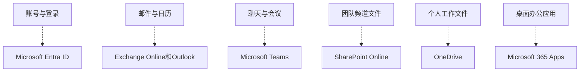

# 第1篇 规划与设计 · 第1节 核心概念与服务关系

> **所属：** 第1篇 规划与设计。  
> **本节小节：** 1.1 ～ 1.5。  
> **本节性质：** 概念说明。不修改正式环境，不切换 DNS，不迁移生产数据。  
> **导航：** [返回第1篇目录](README.md)｜下一节：[租户类型与实施范围](02-租户类型与实施范围.md)

---
## 1.1 本篇目标

本篇解决的不是“去哪个管理页面点哪个按钮”，而是以下五个问题：

1. 企业为什么要导入 Microsoft 365，要解决哪些业务问题。
2. 企业目前有哪些账号、邮箱、设备、文件和网络环境。
3. 最终采用全球版还是世纪互联运营版，采用纯云身份还是混合身份。
4. Office、Teams、Exchange Online 分别给哪些人使用，需要购买什么能力。
5. 如何试点、分批上线、验收和回退，避免正式切换时影响业务。

完成本篇后，应当得到以下成果：

- 一份经过核实的企业现状调查结果。
- 一份 Microsoft 365 目标环境说明。
- 一份初步许可证需求表。
- 一份试点和正式上线计划。
- 一份项目角色与职责表。
- 一份可量化的验收标准。
- 一份项目风险登记表。

> **必做：** 本篇必须在创建大量正式账号、修改 MX 记录或迁移邮件之前完成。没有调查就直接实施，通常会在域名、重复账号、邮箱容量、宏兼容、网络质量或许可证方面返工。

### 1.1.1 本篇推荐使用方式

第一次阅读时先通读 1.1～1.8，建立整体认识；然后由 IT 人员按 1.9～1.19 收集数据；最后由项目负责人按 1.20～1.34 作出决策。无法立即确认的项目统一标记为“待确认”，不要凭印象填写。

每一项调查结果至少应记录：

- 信息来源是谁。
- 数据提取日期。
- 是否经过第二人复核。
- 对项目有什么影响。
- 后续由谁处理。

### 1.1.2 本篇常用术语速查

| 术语 | 新手可以先这样理解 |
|---|---|
| Tenant（租户） | 企业在 Microsoft 云中的独立组织空间 |
| Entra ID | 负责用户、组、登录和身份验证的云目录 |
| UPN | 用户登录名，通常采用类似邮箱地址的格式 |
| AD DS / 本地 AD | 企业内部的 Windows 域和目录服务 |
| OU | 本地 AD 中组织和管理对象的容器 |
| DNS | 把域名与邮件、网站等服务地址关联起来的系统 |
| MX | 指定某个域的邮件应投递到哪里的 DNS 记录 |
| SPF/DKIM/DMARC | 用于验证邮件发送来源和降低域名冒用风险的机制 |
| SKU | 采购时的一种产品或许可证型号 |
| MFA | 除密码外再验证设备、安全密钥等因素 |
| EOP | Exchange Online 的基础邮件保护能力 |
| BYOD | 员工使用个人电脑或手机处理公司业务 |
| RDS/VDI | 远程桌面或虚拟桌面使用场景 |
| DLP | 用规则识别并限制敏感数据外泄的能力 |

本表只用于快速阅读。正式定义、适用条件和操作步骤以相应章节及微软官方说明为准。

---

## 1.2 Microsoft 365 企业导入是什么

Microsoft 365 企业导入不是单纯“给每台电脑安装 Office”，而是把企业的办公身份、邮件、会议、文件协作和安全管理逐步纳入一个云端办公平台。

典型的导入内容包括：

| 业务需要 | 对应服务或能力 | 主要实施内容 |
|---|---|---|
| 企业账号和登录 | Microsoft Entra ID | 用户、组、管理员、MFA、登录安全 |
| 企业邮箱和日历 | Exchange Online、Outlook | 邮箱创建、邮件迁移、域名切换、邮件安全 |
| Word、Excel、PowerPoint | Microsoft 365 Apps | 安装、激活、更新、宏和插件兼容 |
| 聊天、频道和在线会议 | Microsoft Teams | 团队规划、会议策略、外部协作 |
| 个人工作文件 | OneDrive | 同步、个人文件保护、离职数据交接 |
| 团队公共文件 | SharePoint Online | 站点、权限、共享、版本和保留 |
| 安全与审计 | Entra、Defender、Purview 等 | MFA、威胁防护、日志、保留、合规 |
| 设备管理（按需） | Microsoft Intune | 公司电脑、手机、合规和应用保护 |

微软提供的企业设置入口也把“购买订阅、创建账号、分配许可证和启用服务”作为相互关联的工作，而不是互不相关的产品安装。可参考 [Microsoft 365 企业设置说明](https://learn.microsoft.com/en-us/microsoft-365/admin/setup/setup?view=o365-worldwide)。

### 1.2.1 一个容易理解的例子

员工使用同一个工作账号，可以完成以下动作：

1. 登录电脑上的 Word、Excel 和 Outlook。
2. 在 Outlook 中收发企业域名邮件并查看日历。
3. 从日历或 Teams 发起会议。
4. 在 Teams 频道中共同编辑文件。
5. 文件实际保存在 SharePoint 或 OneDrive 中。
6. 管理员通过 Entra ID 控制该账号是否可以登录，以及是否必须完成 MFA。
7. 员工离职时，管理员统一停止访问并交接邮箱和文件。

这就是为什么导入工作必须整体设计，不能让不同人员分别配置 Office、Teams 和邮箱却没有统一账号、安全与数据规则。

---

## 1.3 什么是 Microsoft 365 租户

“租户”（Tenant）可以理解为企业在 Microsoft 云中的独立组织空间。企业的用户、组、域名、邮箱、Teams、SharePoint 站点、安全策略和许可证关系，都归属于这个租户。

租户不是一台服务器，也不是某个管理员的个人账号。它是整个企业云端环境的管理边界。

### 1.3.1 租户中通常包含什么

- 一个初始域名，例如 `example.onmicrosoft.com`；世纪互联环境使用相应的中国区初始域名形式。
- 一个 Microsoft Entra ID 目录。
- 用户、组、来宾和管理员角色。
- 已验证的企业自有域名，例如 `example.com`。
- Exchange Online 邮箱和邮件配置。
- Teams、SharePoint、OneDrive 等服务数据。
- 许可证、订阅和账单关系。
- 安全、审计、保留及共享策略。

### 1.3.2 新手最容易误解的地方

1. **租户名称与企业显示名称不是同一概念。** 企业显示名称以后通常可以调整，但初始域名、SharePoint 地址等命名需要谨慎规划。
2. **一个租户可以验证多个企业域名。** 例如集团可以同时使用多个品牌域名，但必须先确认组织、合规和邮件路由要求。
3. **两个租户之间的数据不会自动互通。** 如果买错租户或把不同部门建在错误租户中，后续可能需要跨租户迁移。
4. **租户中的全局管理员权限非常高。** 不能把管理员账号当作普通办公账号长期使用。
5. **供应商代建租户不等于供应商拥有租户。** 企业必须掌握正式管理员账号、域名、合同和账单资料。

> **高风险：** 不要让单个经销商员工成为企业唯一可以登录的全局管理员，也不要把初始管理员绑定到即将离职人员的个人手机和个人邮箱。

### 1.3.3 租户创建国家或地区为什么必须提前确认

创建 Microsoft Entra ID 租户时，需要选择国家或地区。这个选择会确定租户的 **Default Geography（默认地理区域）**，并参与决定 Exchange Online、SharePoint、OneDrive、Teams 等服务最初把数据部署到哪个地理区域。租户创建后，Default Geography 不能直接更改。

这里要区分四个概念：

| 概念 | 含义 |
|---|---|
| 企业注册地址 | 企业工商或合同使用的地址 |
| 账单与采购地区 | 订阅、币种、税务和采购关系使用的地区 |
| 租户创建国家或地区 | 创建租户时选择，并决定 Default Geography |
| 实际服务数据位置 | 各服务根据 Default Geography、服务部署范围和数据驻留产品确定的位置 |

Default Geography 不代表企业可以随意指定某一座数据中心。需要多个数据地理区域或更强数据驻留承诺时，应单独评估 Multi-Geo、Advanced Data Residency 及其许可证。管理员可在 Microsoft 365 管理中心的组织配置中查看各服务的数据位置。详细定义见 [Microsoft 365 数据驻留概览](https://learn.microsoft.com/en-us/microsoft-365/enterprise/m365-dr-overview?view=o365-worldwide)。

> **必做：** 创建正式租户前，由 IT、采购和法务/合规共同书面确认租户创建国家或地区。全球版租户不能通过修改地区变成世纪互联运营版；选错后通常需要建立正确的租户并迁移账号与数据。

---

## 1.4 Office、Teams、Exchange Online 之间的关系

这三个名称分别代表不同层次的能力：

- **Office / Microsoft 365 Apps：** Word、Excel、PowerPoint、Outlook 等桌面或移动应用。
- **Exchange Online：** 云端邮箱、日历、通讯录、共享邮箱、会议室等服务。
- **Teams：** 聊天、团队、频道、在线会议和协作入口。

它们不是彼此完全独立的。

### 1.4.1 典型依赖关系

- Outlook 是客户端，Exchange Online 是邮箱服务。安装 Outlook 不等于已经拥有企业邮箱。
- Teams 日历和会议能力与 Exchange 邮箱及日历集成。
- Teams 频道文件存放在 SharePoint Online，而不是只存放在 Teams 客户端中。标准频道共用团队的父 SharePoint 站点；每个私有频道和共享频道会建立独立的 SharePoint 频道站点，并具有不同的成员与权限边界。
- Teams 私聊中共享的文件通常涉及发送者的 OneDrive。
- Office 桌面应用通过工作账号激活，并可直接打开 SharePoint 或 OneDrive 中的文件。
- 用户能否访问这些服务，由 Entra ID 中的账号状态、许可证和访问策略共同决定。

因此，项目调查不能只问“需要多少个 Office”，还应询问“有多少邮箱、多少 Teams 用户、是否需要团队文件、是否允许外部来宾，以及离职数据如何处理”。

---

## 1.5 Entra ID、SharePoint 和 OneDrive 为什么不能忽略

### 1.5.1 Microsoft Entra ID

Microsoft Entra ID 是 Microsoft 365 使用的云端身份和身份验证服务。用户能否登录、管理员拥有什么权限、MFA 如何执行，以及组成员关系如何管理，都与它有关。微软的身份规划文档把“确定云身份模式”列为部署初期的重要决策，可参考 [Microsoft 365 身份模式说明](https://learn.microsoft.com/en-us/microsoft-365/enterprise/about-microsoft-365-identity?view=o365-worldwide)。

如果忽略 Entra ID，常见后果包括：

- 同一个员工出现两个账号。
- 用户登录名与邮箱地址不一致。
- 本地 AD 与云端账号无法正确匹配。
- 管理员权限过大且没有审计。
- 离职人员仍可登录云服务。
- 开启 MFA 后打印机、旧客户端或业务程序突然不能发信。

### 1.5.2 SharePoint Online

SharePoint Online 是企业团队内容、站点和协作文件的重要存储与管理平台。Teams 中许多频道文件实际存储在 SharePoint 站点中。

如果忽略 SharePoint，常见后果包括：

- 以为删除 Teams 客户端中的入口不会影响文件。
- 不知道谁实际拥有团队文件权限。
- 外部来宾在项目结束后仍能访问资料。
- 站点数量不断增加但无人负责。

### 1.5.3 OneDrive

OneDrive 面向个人工作文件，并承担同步、个人文件共享和部分 Teams 文件场景。它不应该被当成没有治理规则的企业公共文件服务器。

如果忽略 OneDrive，常见后果包括：

- 部门公共文件被放在某个员工个人空间。
- 员工离职后，其他人找不到资料。
- 个人电脑同步大量公司数据却没有设备控制。
- 用户误删同步文件后不知道如何恢复。

微软明确说明 SharePoint 和 OneDrive 用于组织内容共享和管理，并建议在上线前规划迁移和治理；同时，Teams 文件与 SharePoint 深度集成。可参考 [SharePoint 与 OneDrive 管理概览](https://learn.microsoft.com/en-us/sharepoint/introduction)。

