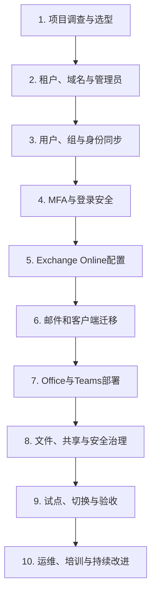

# 第1篇 规划与设计 · 第2节 租户类型与实施范围

> **所属：** 第1篇 规划与设计。  
> **本节小节：** 1.6 ～ 1.8。  
> **本节性质：** 选型与范围决策。本节结论决定后续所有实施步骤。  
> **导航：** [返回第1篇目录](README.md)｜上一节：[核心概念与服务关系](01-核心概念与服务关系.md)｜下一节：[组织、域名与 DNS 调查](03-组织域名与DNS调查.md)

---
## 1.6 全球版与世纪互联运营版的区别和选择

这是项目最早、也最重要的决策之一。

### 1.6.1 基本区别

- **Microsoft 365 全球版：** 使用微软全球云服务体系，由 Microsoft 提供相应服务和支持体系。
- **Microsoft 365 世纪互联运营版：** 面向中国市场，由世纪互联在中国境内运营、提供订阅计费和支持，使用微软授权技术。

微软官方说明指出，中国区服务在运营主体、数据中心、功能可用性和部分管理能力方面与全球版存在差异，而且功能差异会随时间变化。正式选型必须以采购时的 [Microsoft 365 世纪互联运营版服务说明](https://learn.microsoft.com/en-us/microsoft-365/admin/services-in-china/services-in-china?view=o365-worldwide) 和合同为准。

### 1.6.2 选型比较表

| 比较维度 | 全球版需要重点确认 | 世纪互联版需要重点确认 |
|---|---|---|
| 主要用户位置 | 中国境内访问体验、企业网络和跨境连接 | 是否主要服务中国境内用户 |
| 数据位置与监管 | 企业跨境数据和行业合规要求 | 中国境内运营及适用的本地要求 |
| 外部协作 | 海外客户、供应商和全球租户协作 | 与全球版租户互操作的实际限制 |
| 功能范围 | 所购 SKU 在所在地区的可用性 | 所需 Teams、Purview、Defender、Intune 等功能是否可用 |
| 账号和管理地址 | 全球版管理端点 | 中国区专用域名和管理端点 |
| 采购与支持 | Microsoft 或相应合作伙伴 | 世纪互联及其合作伙伴体系 |
| 手机应用与商店 | 各地区应用商店可用性 | 中国境内移动应用获取与功能差异 |
| 后续扩展 | 海外分支和全球系统集成 | 中国区服务路线和功能差异 |

### 1.6.3 建议的决策步骤

1. 列出主要用户所在国家或地区。
2. 列出必须使用的功能，不要只写“Office、Teams”，要具体到 Teams 外部协作、会议录制、Intune、条件访问、邮件防护、审计和保留。
3. 列出主要合作伙伴使用的租户类型。
4. 由法务或合规负责人确认数据位置和跨境要求。
5. 让供应商以书面形式确认 SKU、功能、服务边界、支持渠道和数据位置。
6. 使用试用或小规模测试账号验证关键功能。
7. 形成正式选型记录，由业务、IT、安全和采购共同确认。

### 1.6.4 决策记录模板

| 项目 | 结论 | 证据或来源 | 确认人 |
|---|---|---|---|
| 主要用户位置 | 待填写 | 办公地点清单 | 待填写 |
| 主要外部协作对象 | 待填写 | 客户/供应商清单 | 待填写 |
| 数据位置要求 | 待填写 | 合规意见 | 待填写 |
| 必需功能 | 待填写 | 业务需求表 | 待填写 |
| 选择的租户类型 | 待填写 | 选型评审记录 | 待填写 |

> **高风险：** 不要先购买大量许可证、创建正式账号后再讨论租户类型。全球版和世纪互联版不是一个可以通过简单开关切换的环境，错误选择可能引发账号和数据迁移。

---

## 1.7 纯云环境、混合环境和本地环境的区别

这里的“环境”主要从身份、邮件和管理来源来看。

| 模式 | 账号主要存放位置 | 典型适用场景 | 优点 | 主要复杂度 |
|---|---|---|---|---|
| 纯云 | Microsoft Entra ID | 没有本地 AD，或准备完全云化的小中型企业 | 简单、服务器少、维护成本较低 | 需要重新设计电脑登录和本地系统账号 |
| 混合 | 本地 AD 与 Entra ID 同步 | 已有 Windows 域、本地文件服务器或内部应用 | 用户可继续使用统一身份 | 同步、属性来源、故障排查更复杂 |
| 本地为主 | 本地 AD、本地 Exchange 或文件服务器 | 暂不迁移核心服务，只使用部分云能力 | 对现有系统改动较小 | 云端价值有限，长期可能维护两套体系 |

### 1.7.1 不要混淆三个问题

企业可以在三个方面采用不同组合：

- **身份：** 纯云账号或本地 AD 同步账号。
- **邮箱：** 全部 Exchange Online、全部本地 Exchange，或混合共存。
- **设备：** 本地域加入、Entra 加入、混合加入或仅注册。

例如，企业可以保留本地 AD 并同步账号，但把邮箱全部迁移到 Exchange Online。这仍然属于混合身份，并不代表必须永久保留本地 Exchange 邮箱。

> **高风险：** 邮箱全部迁到云端，不等于可以立即卸载本地 Exchange、删除目录同步工具或停用相关服务器。混合环境退出前，必须先确认收件人属性由什么受支持的方式管理、哪些对象仍在同步，以及出现问题时如何恢复。详细退役方案应根据当时的 Exchange 与 Entra 官方支持要求单独设计。

### 1.7.2 初步选择原则

- 没有本地 AD、用户数量不大、没有依赖域账号的业务系统：优先评估纯云。
- 已有稳定本地 AD、电脑和内部系统都依赖域账号：优先评估混合身份。
- 仅仅因为“以前一直这样”而保留复杂的联合身份，不是充分理由。
- 对新手团队来说，能够满足业务要求的最简单方案通常更容易长期维护。

---

## 1.8 企业导入 Microsoft 365 的典型工作范围

本项目建议分为十个工作流：

### 1.8.1 本次实施范围表

对每一项必须选择“本期实施、后续实施、不实施或待确认”。

| 工作项 | 状态 | 负责人 | 备注 |
|---|---|---|---|
| 创建或接管租户 | 待确认 |  |  |
| 企业域名验证 | 待确认 |  |  |
| 用户与组 | 待确认 |  |  |
| 本地 AD 同步 | 待确认 |  |  |
| MFA | 本期必做 |  |  |
| Exchange Online | 待确认 |  |  |
| 历史邮件迁移 | 待确认 |  |  |
| Office 部署 | 待确认 |  |  |
| Teams 会议和协作 | 待确认 |  |  |
| SharePoint/OneDrive | 待确认 |  |  |
| Intune | 待确认 |  |  |
| 数据保留与备份 | 待确认 |  |  |
| 管理员与员工培训 | 本期必做 |  |  |
| 上线后支持 | 本期必做 |  |  |

