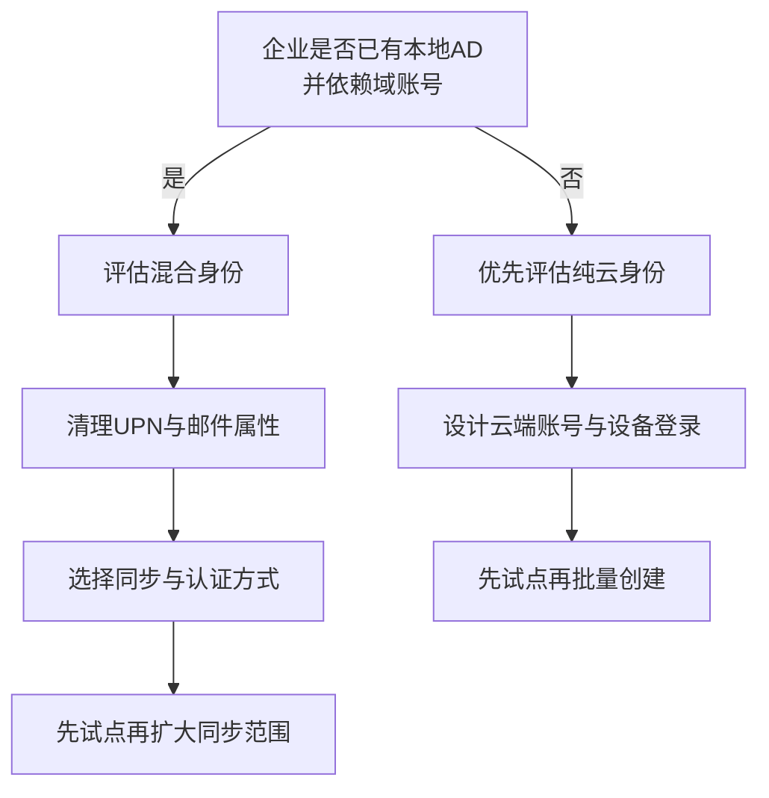

# 第1篇 规划与设计 · 第6节 目标架构与安全基线

> **所属：** 第1篇 规划与设计。  
> **本节小节：** 1.20 ～ 1.24。  
> **本节性质：** 目标设计。确定身份模式、迁移模式、部署范围、设备管理和最低安全基线。  
> **导航：** [返回第1篇目录](README.md)｜上一节：[终端、网络与协作需求调查](05-终端网络与协作需求调查.md)｜下一节：[许可证规划](07-许可证规划.md)

---
## 1.20 确定身份管理模式

### 1.20.1 决策流程

### 1.20.2 纯云身份适合的情况

- 没有本地 AD。
- 本地应用不依赖 Windows 域账号。
- 希望减少本地身份服务器维护。
- 企业有能力重新设计电脑和应用登录方式。

### 1.20.3 混合身份适合的情况

- 电脑已加入本地域。
- 文件、VPN、打印或业务系统依赖 AD。
- 企业希望继续以本地 AD 作为账号属性主要来源。
- 有能力维护同步服务并处理同步故障。

微软将 Microsoft 365 身份模式概括为云端身份和混合身份：云端身份只存在于 Entra 租户；混合身份来源于本地 AD，并把对象同步到 Entra。详细概念见 [Microsoft 365 身份模式说明](https://learn.microsoft.com/en-us/microsoft-365/enterprise/about-microsoft-365-identity?view=o365-worldwide)。

### 1.20.4 初步推荐

- 无本地 AD 的企业：不要为了“看起来像企业环境”而新建本地 AD 再同步，先评估纯云。
- 已有本地 AD 的企业：不要一边手工批量建云账号，一边准备同步同一批用户；先制定账号匹配方案。
- 混合身份如无特殊限制，优先评估维护成本较低的托管认证方式；联合认证只用于有明确且无法由 Entra 满足的需求。
- 新建或改造同步环境时，应比较 Entra Cloud Sync 与 Entra Connect Sync，而不是默认沿用旧工具。微软将 Cloud Sync 作为混合身份同步的战略方向之一，但两者支持的场景并不完全相同。
- 世纪互联环境也可使用 Cloud Sync，但部分能力可能与全球版不同，例如当前本地身份的自助密码重置回写支持需要单独核对。详细比较见 [Microsoft Entra Cloud Sync概览](https://learn.microsoft.com/en-us/entra/identity/hybrid/cloud-sync/what-is-cloud-sync)。

### 1.20.5 身份模式决策记录

| 项目 | 结论 |
|---|---|
| 是否存在本地 AD | 待填写 |
| 依赖 AD 的系统 | 待填写 |
| 目标身份模式 | 待填写 |
| 权威账号来源 | 待填写 |
| 计划同步范围 | 待填写 |
| 认证方式 | 待填写 |
| 技术负责人 | 待填写 |
| 试点用户 | 待填写 |

---

## 1.21 确定邮件迁移模式

### 1.21.1 先按源系统分类

| 源系统 | 常见候选方式 | 需要重点确认 |
|---|---|---|
| 本地 Exchange | 剪切、混合或其他受支持路径 | Exchange版本、人数、共存时间、目录同步 |
| 支持 IMAP 的邮箱 | IMAP 或第三方工具 | 只迁邮件、日历联系人另行处理 |
| Google Workspace | Microsoft支持的迁移方式或第三方工具 | 邮件、日历、联系人、Drive范围 |
| PST 文件 | 用户导入或组织级导入 | 文件来源、重复数据、容量和保管 |
| 其他云邮箱 | 厂商接口、IMAP或第三方工具 | 限流、MFA、权限和特殊数据 |

### 1.21.2 选择迁移方式的判断条件

- 邮箱数量。
- 总数据量和单邮箱最大容量。
- 源系统版本及支持状态。
- 是否需要迁移日历、联系人和任务。
- 是否需要迁移共享邮箱和代理权限。
- 是否需要新旧系统长期共存。
- 可接受的停机时间。
- 迁移网络吞吐量。
- 内部人员经验。
- 预算和第三方工具支持。

### 1.21.3 本篇只做初选

正式迁移方案应在第3篇（邮件）通过试迁移确定。本篇输出以下结论即可：

| 项目 | 初步结论 |
|---|---|
| 源邮件系统 | 待填写 |
| 邮箱数量/总数据量 | 待填写 |
| 必须迁移的数据类型 | 待填写 |
| 初选迁移方式 | 待填写 |
| 是否需要共存 | 待填写 |
| 预计批次数 | 待填写 |
| 试迁移对象 | 待填写 |
| 最大可接受停机时间 | 待填写 |
| 回退原则 | 待填写 |

> **必做：** 正式迁移前至少完成一轮代表性试迁移。试点应包含大邮箱、共享邮箱、移动用户、管理层和有代理权限的用户，而不能只选一个空测试邮箱。

---

## 1.22 确定 Office 和 Teams 部署范围

### 1.22.1 Office 部署范围

将用户分组，而不是采用“一套配置适合所有人”：

| 用户组 | Office需求示例 | 重点问题 |
|---|---|---|
| 标准办公用户 | Word、Excel、PowerPoint、Outlook | 标准安装和更新 |
| 财务/业务用户 | Excel宏、插件、模板 | 兼容性测试 |
| 共享电脑用户 | 多人共用终端 | 共享激活和账号隔离 |
| 远程桌面用户 | RDS/VDI | 许可证和部署方式 |
| 轻量用户 | Web或移动应用 | 是否需要桌面应用 |
| Mac用户 | Office for Mac | 插件和功能差异 |

需要确定：

- 哪些用户安装桌面应用。
- 哪些用户只使用 Web 或移动应用。
- 32 位还是 64 位。
- 更新通道。
- 是否卸载旧版 Office。
- 谁负责安装和故障处理。
- 是否允许用户自行安装。

### 1.22.2 Teams 部署范围

需要确定：

- 哪些用户只参加会议。
- 哪些用户可以创建会议。
- 哪些用户可以创建团队。
- 哪些用户需要录制、转录或大型会议能力。
- 哪些部门允许外部来宾。
- 哪些用户需要电话相关能力。
- 是否统一部署桌面和手机客户端。

### 1.22.3 分阶段启用建议

1. 先让试点用户完成登录、聊天和会议。
2. 再启用正式团队和频道。
3. 文件权限规则确认后再扩大外部协作。
4. 录制、第三方应用、匿名访问等高影响能力按策略启用。

### 1.22.4 部署范围必须覆盖关联服务

确定 Teams 范围时，同时确认每类用户是否具备所需的 Exchange、SharePoint Online、OneDrive 和 Microsoft 365 组相关能力。团队文件并不存放在 Teams 客户端本身：标准频道共用团队的父 SharePoint 站点，私有频道和共享频道分别使用独立的 SharePoint 频道站点；聊天中分享的文件通常存放在发送者的 OneDrive。具体关系见 [Teams 与 SharePoint 的集成说明](https://learn.microsoft.com/en-us/microsoftteams/sharepoint-onedrive-interact)。

> **验证点：** 试点许可证与策略必须按实际场景验证，不要只确认 Teams 服务计划已开启。即使邮箱暂时保留在满足要求的本地 Exchange，仍应验证会议日历集成；使用频道和文件协作时，应验证 SharePoint/OneDrive 许可、站点创建、权限和共享策略。

---

## 1.23 确定设备管理和外部协作范围

### 1.23.1 设备分类

| 设备类型 | 管理问题 |
|---|---|
| 公司 Windows 电脑 | 是否加入 Entra、是否由 Intune 管理、磁盘加密和补丁 |
| 公司 Mac | 管理工具、Office配置和磁盘保护 |
| 公司手机 | 应用、合规、远程擦除 |
| 个人电脑 | 是否允许下载公司文件、浏览器访问规则 |
| 个人手机 | 是管理整台设备还是只保护公司应用数据 |
| 共享电脑 | 用户隔离、缓存、共享激活 |
| 会议室设备 | 设备账号、更新和物理安全 |

### 1.23.2 三种常见管理层级

1. **仅账号保护：** MFA、会话和登录策略，不管理设备。
2. **应用数据保护：** 对 Outlook、Teams、OneDrive 等公司应用数据施加复制、保存和擦除规则。
3. **完整设备管理：** 注册设备、配置合规、加密、补丁和安全设置。

选择时考虑：

- 公司是否拥有设备。
- 是否允许 BYOD（员工自带设备）。
- 企业是否有 Intune 或其他管理平台。
- IT 是否有能力处理注册和合规故障。
- 隐私、劳动和合规要求。

### 1.23.3 外部协作范围

外部协作应按业务场景批准，而不是简单选择“全部开放”或“全部关闭”。至少定义：

- 允许协作的外部域名。
- 谁能邀请来宾。
- 来宾需要什么审批。
- 是否要求 MFA。
- 可以访问哪些团队和文件。
- 是否允许匿名共享链接。
- 合作结束日期。
- 谁定期复核并删除来宾。

---

## 1.24 制定最低安全基线

本节只确定最低要求，详细操作在第2篇（身份与 MFA）、第3篇（邮件）和第5篇（安全合规与设备管理）展开。

### 1.24.1 上线前最低安全要求

| 控制项 | 最低要求 | 原因 |
|---|---|---|
| 管理员账号 | 管理账号与日常办公账号分开 | 降低高权限账号暴露 |
| 管理员权限 | 按职责分配最小角色 | 避免人人都是全局管理员 |
| 紧急访问账号 | 至少两个云端紧急账号，安全保管并测试 | 防止所有管理员被锁定 |
| MFA | 管理员优先，随后覆盖所有用户 | 降低密码泄露风险 |
| Exchange Online旧式基本身份验证 | 核实平台已禁用的协议，并单独清点 SMTP AUTH、打印机和业务应用 | 避免继续依赖用户名和密码发信 |
| 条件访问/安全默认值 | 至少采用一种经过验证的基线 | 统一落实登录保护 |
| 邮件外部转发 | 默认限制，例外需审批 | 防止数据被隐蔽外传 |
| 邮件身份验证 | 规划 SPF、DKIM、DMARC | 降低域名冒用和投递问题 |
| 外部共享 | 默认最小范围并保留所有者 | 降低文件泄露风险 |
| 审计与告警 | 明确查看人、频率和升级流程 | 发现异常后有人处理 |
| 离职处理 | 禁止登录、撤销会话、交接数据 | 防止离职后继续访问 |
| 备份与恢复 | 明确恢复范围并演练 | 避免“有保留但不会恢复” |

#### 1.24.1.1 旧式基本身份验证的现状

除 SMTP AUTH 外，Exchange Online 已经在所有租户中禁用列明协议的基本身份验证，受影响的协议包括 Exchange ActiveSync、POP、IMAP、EWS、远程 PowerShell、Autodiscover 和旧版 Outlook 连接等，而且不能由管理员重新启用。客户端和程序应改用支持 OAuth 2.0 的现代身份验证或迁移到受支持的新接口。

**SMTP AUTH 是需要单独处理的例外。** 根据微软在2026年更新的安排，截至2026年12月前现有行为不变；2026年12月底后，现有租户中的 SMTP AUTH 基本身份验证将默认关闭，但在最终移除前管理员仍可能按需重新启用；新租户将默认要求 OAuth。最终全面移除时间应以微软后续公告为准。时间线应持续核对 [Exchange 团队发布的 SMTP AUTH 基本身份验证弃用更新](https://techcommunity.microsoft.com/blog/exchange/updated-exchange-online-smtp-auth-basic-authentication-deprecation-timeline/4489835)。

项目调查阶段应逐项登记打印机、扫描仪和业务系统的发信方式，并检查租户级及邮箱级 SMTP AUTH 设置。优先评估 OAuth、Microsoft Graph、SMTP relay 或其他受支持方案，不能默认继续使用“邮箱账号＋密码”。详情见 [Exchange Online基本身份验证弃用说明](https://learn.microsoft.com/en-us/exchange/clients-and-mobile-in-exchange-online/deprecation-of-basic-authentication-exchange-online)。

### 1.24.2 安全默认值与条件访问的初步选择

微软提供“安全默认值”作为简化的基础保护，包含要求注册 MFA、保护管理员、阻止部分旧式身份验证和保护高权限操作等措施；需要更精细例外和条件控制时，应评估条件访问。微软当前说明中，安全默认值不要求额外 Entra P1，而条件访问至少需要 Entra ID P1 能力——**本方案的 E3 已包含 P1，因此直接采用条件访问**（第7节 1.26.2、第2篇 2.88）。正式差异与迁移方法见 [Entra安全默认值](https://learn.microsoft.com/en-us/entra/fundamentals/security-defaults)。

截至本篇复核日期，新租户默认启用安全默认值，并在租户创建后提供短暂的24小时配置宽限期；这不是长期的用户MFA注册宽限。自2026-07-01起，新Entra租户的安全默认值还会阻止 device code flow（设备代码流）。如果企业有电视终端、命令行工具、无键盘设备或其他依赖设备代码登录的应用，必须纳入试点调查。

安全默认值只能整体启用或停用，不能按单个用户设置例外。因此需要复杂例外、设备条件、地点条件或分组部署的企业，应在许可证满足的情况下使用条件访问。

选择原则：

- 小型、需求简单、没有复杂例外：可先评估安全默认值。
- 需要按用户、组、地点、设备或风险定制：评估条件访问及相应许可证。
- 不要先关闭安全默认值，再慢慢设计条件访问；切换时必须保证替代策略立即生效。

### 1.24.3 紧急访问账号

微软建议维护两个或更多紧急访问管理员账号，用于普通管理员都无法登录时恢复管理能力。这些账号应当：

- 是仅存在于云端的账号，不从本地 AD 同步，也不依赖联合身份提供商。
- 使用租户初始域名，并永久分配必要的全局管理员权限。
- 采用防钓鱼认证；微软当前优先建议 Passkey/FIDO2，企业已有 PKI 时也可评估证书认证。
- 不绑定某一名员工的个人手机或个人资料。
- 排除那些可能在紧急情况下阻断登录的条件访问策略；仅报告策略不需要排除。
- 每次登录都产生告警并接受审计。
- 把凭据或安全密钥分别存放在受控的安全位置。
- 确保认证凭据和设备不会过期，也不会因长期未使用而被自动清理。
- 仅从指定的安全管理工作站或特权访问工作站使用紧急账号。
- 至少每 90 天进行一次登录和管理操作演练。

详细要求见 [管理紧急访问管理员账号](https://learn.microsoft.com/en-us/entra/identity/role-based-access-control/security-emergency-access)。

> **高风险：** 紧急账号不是免审计的万能账号，也不能交给单个人日常使用。具体认证方式、条件访问排除和告警必须在第2篇（身份与 MFA）按当前官方建议实施。

### 1.24.4 邮件基础保护

所有 Exchange Online 云邮箱具备基础邮件保护能力（EOP）；**安全链接、安全附件和冒充防护在本方案的 E3 中已包含**（Defender for Office 365 P1，见第7节 1.26.4、第3篇 3.27）。邮件身份验证与威胁防护策略应当并行规划，并在上线前共同验证：一方面正确配置 SPF、DKIM、DMARC；另一方面启用并测试适用的 EOP 或 Defender 防护策略。不要等所有邮件身份验证工作结束后才开始部署基础反垃圾和反钓鱼保护。微软提供了 Standard/Strict 预设策略思路，参见 [Microsoft 365 邮件与协作安全设置建议](https://learn.microsoft.com/en-us/defender-office-365/recommended-settings-for-eop-and-office365)。

邮件身份验证的验收不能只截图证明 DNS 记录存在。每一种合法发信来源——包括 Microsoft 365、业务系统、打印机、中继、营销平台和第三方网关——都应向外部测试邮箱实际发信并检查邮件头。验收目标是 SPF/DKIM 的认证结果和 DMARC 域对齐正确，最终得到预期的 `dmarc=pass`，而不是机械要求每封邮件同时依靠 SPF 和 DKIM 两条路径通过。

DMARC 应从监控策略逐步收紧：`p=none` → `p=quarantine` → `p=reject`。每次提高策略前先分析 `rua` 聚合报告，确认合法发信源已登记、转发和第三方平台场景已处理，并留下批准与回退条件。项目应指定邮件安全责任人持续监看报告；一次发布记录而无人处理报告，不算建立了 DMARC 运营能力。

> **高风险：** DKIM CNAME 目标值可能因域加入时间和租户路由而不同。必须从 Defender 门户或 `Get-DkimSigningConfig` 的 `Selector1CNAME`、`Selector2CNAME` 获取实际值，不得照抄文档示例或自行拼接。

