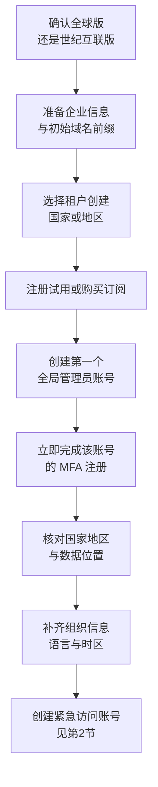

# 第2篇 基础建设 · 第1节 租户创建与管理中心

> **所属：** 第2篇 基础建设：租户、身份与 MFA。  
> **本节小节：** 2.1 ～ 2.10。  
> **本节性质：** **开始修改正式环境。** 本节创建或接管正式租户，部分设置创建后不可更改。  
> **前置条件：** 第1篇的租户类型、租户创建国家或地区、企业信息调查必须已有书面结论。  
> **导航：** [返回第2篇目录](README.md)｜下一节：[管理员账号与角色](02-管理员账号与角色.md)

---

## 2.1 本节目标

第1篇做的是纸面决策，本节开始真正建立企业在 Microsoft 云中的“地基”。完成本节后应当达到：

1. 已创建（或已确认接管）唯一的正式生产租户。
2. 租户的国家或地区、组织信息、语言和时区已按企业实际情况确认。
3. 知道 Microsoft 365 管理中心和各个专用管理中心分别管什么、入口在哪里。
4. 明确哪些设置一旦确定就无法或很难更改。

> **高风险：** 租户是整个企业云环境的边界。租户创建时选择的国家或地区决定服务数据的默认存放地理位置，**创建后不能自行更改**。地区选错通常只能重建租户并重新迁移全部数据。

---

## 2.2 创建租户前必须准备的信息

不要打开注册页面才开始想这些内容。以下信息应在第1篇调查表中已经确定：

| 信息 | 说明 | 一旦确定后的更改难度 |
|---|---|---|
| 使用全球版还是世纪互联运营版 | 两者是**不同的服务**，注册入口、合同和功能范围都不同 | 无法互换，只能重建 |
| 租户创建国家或地区 | 决定 Default Geography（默认服务数据地理位置） | **创建后不能自行更改** |
| 企业正式名称 | 显示在管理中心、许可证和账单上 | 可修改 |
| 初始域名前缀 | 形成 `前缀.onmicrosoft.com` | **创建后不能更改** |
| 第一个全局管理员账号名 | 例如 `admin@前缀.onmicrosoft.com` | 可再建新账号，但首个账号建议保留 |
| 联系人、地址、电话 | 用于账单和 Microsoft 联络 | 可修改 |
| 语言与时区 | 影响管理界面和日志时间显示 | 可修改 |
| 采购方式 | 直接向 Microsoft、通过代理商还是云服务商 | 涉及合同，变更需谈判 |

> **必做：** 初始域名前缀请使用规范、可长期使用的企业英文简称，例如 `contoso`，不要用 `test`、`demo`、`abc123`。这个前缀会永久保留在租户中，并出现在 DKIM 记录、紧急访问账号等位置。

---

## 2.3 初始域名与企业自有域名的区别

租户创建后会自动获得一个 Microsoft 提供的域名，通常称为**初始域名**或 MOERA 域名：

```text
contoso.onmicrosoft.com
```

企业自有域名是你在域名注册商购买的域名：

```text
contoso.com
```

两者的定位完全不同：

| 项目 | 初始域名（`*.onmicrosoft.com`） | 企业自有域名（`contoso.com`） |
|---|---|---|
| 来源 | 租户创建时自动生成 | 企业自行购买并验证 |
| 能否删除 | 不能删除 | 可以添加和删除 |
| 能否更名 | 不能 | 不适用 |
| 员工日常邮箱地址 | 不适合 | **应使用这个** |
| 紧急访问管理员账号 | **建议使用这个** | 不建议 |
| DKIM 记录 | 作为 DKIM CNAME 目标的一部分 | 需要单独配置 DKIM |

### 2.3.1 为什么紧急访问账号要用初始域名

企业自有域名依赖 DNS 解析和域名续费，还可能在联合身份、DNS 事故或域名到期时出问题。初始域名由 Microsoft 托管，不受企业 DNS 影响，因此更适合作为“最后一条进入通道”。这与第1篇 1.24.3 的要求一致，详细操作见[下一节](02-管理员账号与角色.md)。

---

## 2.4 创建租户的整体流程



### 2.4.1 全球版的创建方式

1. 通过 Microsoft 官方网站选择合适的订阅（可先用试用版验证，再转为正式订阅）。
2. 填写企业信息，其中**国家或地区必须按企业实际情况和合规要求选择**。
3. 设置初始域名前缀。
4. 创建第一个管理员账号和强密码。
5. 完成身份验证（通常需要手机或邮箱验证）。
6. 进入 Microsoft 365 管理中心。

### 2.4.2 世纪互联运营版的差异

Microsoft 365 由世纪互联运营的版本是**独立服务**，注册入口、合同主体、管理中心地址、部分功能和服务说明与全球版不同。不能通过修改地区把全球版变成世纪互联版，也不能假设两者功能完全一致。选择该版本时，必须以世纪互联版本的官方文档和合同为依据。

> **必做：** 如果企业尚未做出结论，不要“先随便建一个试试”。试用租户如果使用了企业正式域名和真实用户数据，后期切换版本会造成域名占用和数据迁移问题。学习和验证请使用独立的测试租户和测试域名。

### 2.4.3 已经存在租户时的接管流程

很多企业在正式项目之前，已经因为某个员工注册试用、或某个部门单独采购而存在租户。此时不要急于新建：

1. 在管理中心确认当前租户的**租户 ID、初始域名、已验证域名和订阅**。
2. 确认现有全局管理员是谁、账号是否仍可登录、是否为在职员工。
3. 确认企业自有域名是否已经被这个租户占用（一个域名同一时间只能属于一个租户）。
4. 确认账单主体和合同是否属于企业，而不是个人。
5. 评估该租户中已有的用户、邮箱和数据是否需要保留。

> **高风险：** 企业自有域名如果已被某个失控的旧租户占用，在旧租户中删除该域名前，新租户无法验证同一域名。必须先取得旧租户管理权限或联系 Microsoft 支持处理，**不要在没有解决域名归属前安排上线日期**。

---

## 2.5 租户创建国家或地区与数据位置

这是本节最容易被忽视、后果最严重的设置。

### 2.5.1 四个不同的概念

新手常把下面四件事混为一谈：

| 概念 | 含义 |
|---|---|
| 企业注册地址 | 工商登记或办公地址，可以修改 |
| 账单国家或地区 | 影响可购买的产品、货币和税务 |
| **租户创建时的国家或地区** | 决定 **Default Geography**，即服务数据默认存放的地理位置 |
| 实际服务数据位置 | 各服务（Exchange、SharePoint、Teams 等）真实存放数据的地理位置 |

微软的说明是：创建 Microsoft Entra 租户时由客户提供的国家或地区决定所有 Microsoft 365 服务的 Default Geography；部分场景下不是所有服务都能在同一个 Default Geography 预配。详见 [Microsoft 365 数据驻留概览](https://learn.microsoft.com/en-us/microsoft-365/enterprise/m365-dr-overview?view=o365-worldwide)。

### 2.5.2 上线前必须核对

- [ ] 在管理中心的“数据位置”卡片中，逐个服务确认当前数据存放地理位置。
- [ ] 与企业的合规、法务或客户合同要求比对。
- [ ] 如果企业有明确的数据驻留承诺要求，评估是否需要相应的附加服务或多地理位置能力。
- [ ] 把核对结果截图并留档，作为项目交付物之一。

> **验证点：** 不要只看注册时填了什么，要在租户建好后打开数据位置卡片确认**实际结果**。发现与要求不符时，越早处理成本越低。

---

## 2.6 补齐组织信息、语言和时区

租户创建完成后，立即完成以下设置，避免后续日志和用户体验混乱：

| 设置项 | 建议 |
|---|---|
| 组织名称 | 使用企业正式名称，会显示在登录页和管理界面 |
| 地址、电话、技术联系人 | 填写真实且长期有效的信息，Microsoft 重要通知会发到此处 |
| 首选语言 | 按管理员和员工习惯设置 |
| 时区 | **务必设置为企业实际时区**，否则审计日志、报表和会议时间容易误判 |
| 密码策略 | 与第5篇安全基线一并确认 |
| 隐私与联系人偏好 | 按企业要求设置 |

> **推荐：** 技术联系人不要填某个员工的个人邮箱。建议使用一个由 IT 团队共同管理的邮箱或组，避免员工离职后收不到服务通知。

---

## 2.7 Microsoft 365 管理中心的作用

Microsoft 365 管理中心（`https://admin.microsoft.com`）是日常管理的主入口，主要用于：

- 创建和管理用户、组。
- 分配和回收许可证。
- 查看订阅、账单和账单地址。
- 管理设备和基础安全设置的入口跳转。
- 查看**服务健康状态**和 Microsoft 发布的重要变更公告（消息中心）。
- 进入各个专用管理中心。

> **必做：** 消息中心是 Microsoft 通知功能变更、弃用和强制策略的正式渠道。项目应指定专人**每周查看**，否则会像很多企业一样，在服务突然变化时才被动应对。

---

## 2.8 各专用管理中心分别管什么

新手最容易迷路的地方，就是“这个设置到底在哪个中心”。下面是分工对照：

| 管理中心 | 典型地址 | 主要负责 |
|---|---|---|
| Microsoft 365 管理中心 | `admin.microsoft.com` | 用户、许可证、订阅、服务健康、消息中心 |
| Microsoft Entra 管理中心 | `entra.microsoft.com` | 身份、组、管理员角色、MFA、条件访问、身份同步、登录日志 |
| Exchange 管理中心 | `admin.exchange.microsoft.com` | 邮箱、共享邮箱、通讯组、会议室、邮件流规则、邮件追踪 |
| Teams 管理中心 | `admin.teams.microsoft.com` | Teams 策略、会议设置、外部访问、团队与用户配置 |
| SharePoint 管理中心 | `<租户>-admin.sharepoint.com` | SharePoint 站点、OneDrive 设置、外部共享策略 |
| Microsoft Purview 门户 | Purview 合规门户 | 审计、保留、敏感度标签、DLP、电子数据展示 |
| Microsoft Defender 门户 | `security.microsoft.com` | 邮件与协作安全策略、隔离区、告警、安全事件 |
| Intune 管理中心 | `intune.microsoft.com` | 设备注册、合规策略、应用保护策略 |

### 2.8.1 记住这条判断规则

- 与**“人能不能登录、用什么验证”**有关 → Entra 管理中心。
- 与**“邮箱和邮件怎么流转”**有关 → Exchange 管理中心。
- 与**“邮件里的威胁和隔离”**有关 → Defender 门户。
- 与**“文件存在哪里、能共享给谁”**有关 → SharePoint 管理中心。
- 与**“买了什么、给了谁”**有关 → Microsoft 365 管理中心。
- 与**“保留多久、能不能取证”**有关 → Purview 门户。

> **推荐：** 管理页面的位置和名称会随 Microsoft 更新变化。文档里应优先记录“要达到什么目的、如何验证结果”，导航路径作为辅助信息，并在界面变化时更新。

---

## 2.9 本节的高风险与回退说明

| 操作 | 风险 | 可否回退 |
|---|---|---|
| 选择错误的服务版本（全球版/世纪互联版） | 功能与合规不符，需重新采购和迁移 | 不可回退，只能重建 |
| 选择错误的租户国家或地区 | 数据位置不符合要求 | **不可自行更改** |
| 设置随意的初始域名前缀 | 长期出现在租户标识和 DNS 记录中 | 不可更改 |
| 在错误的旧租户上继续建设 | 域名占用、账号混乱、账单归属不清 | 需清理或迁移，代价高 |
| 只有一个全局管理员账号 | 该账号不可用时无法管理租户 | 需 Microsoft 支持介入 |

> **回退点：** 本节唯一可靠的“回退”方式是**在做决定前充分核对**。因此建议：租户创建当天不要立即添加企业自有域名，先完成地区、数据位置和管理员账号核对，确认无误后再进入下一节。

---

## 2.10 本节完成检查表

- [ ] 已确认使用全球版还是世纪互联运营版，并有书面依据。
- [ ] 已创建或已确认接管**唯一**的正式生产租户，并记录租户 ID。
- [ ] 初始域名前缀规范，可长期使用。
- [ ] 租户创建国家或地区符合企业合规要求。
- [ ] 已在数据位置卡片中逐服务核对实际数据存放地理位置并截图留档。
- [ ] 组织名称、地址、技术联系人、语言和时区已正确设置。
- [ ] 技术联系人使用 IT 团队共同管理的邮箱，而不是个人邮箱。
- [ ] 第一个全局管理员账号已完成 MFA 注册。
- [ ] 已确认企业自有域名当前是否被其他租户占用，并有处理结论。
- [ ] 已确认订阅和账单主体属于企业。
- [ ] 已指定专人每周查看服务健康状态和消息中心。
- [ ] 已了解各专用管理中心的分工和入口。

> **进入下一节的条件：** 租户唯一、地区正确、账单归属清楚，并且**至少一名管理员可以稳定登录**。下一节将建立正式的管理员体系和紧急访问账号，这是后续所有操作的安全前提。
