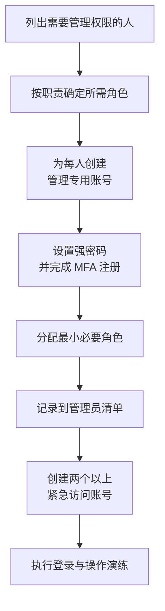

# 第2篇 基础建设 · 第2节 管理员账号与角色

> **所属：** 第2篇 基础建设：租户、身份与 MFA。  
> **本节小节：** 2.11 ～ 2.19。  
> **本节性质：** 高风险配置。管理员体系决定整个租户的安全底线和故障恢复能力。  
> **前置条件：** 已完成[第1节](01-租户创建与管理中心.md)，租户唯一且至少一名管理员可登录。  
> **导航：** [返回第2篇目录](README.md)｜上一节：[租户创建与管理中心](01-租户创建与管理中心.md)｜下一节：[域名验证与 DNS 记录](03-域名验证与DNS记录.md)

---

## 2.11 本节目标

很多企业的 Microsoft 365 安全事故，不是因为黑客技术高明，而是因为：

- 全公司只有一个全局管理员，账号还兼作日常办公邮箱。
- 管理员密码与其他网站重复，且没有 MFA。
- 唯一的管理员离职或手机丢失，没人能进管理中心。
- 十几个人都是全局管理员，出问题查不出是谁改的。

完成本节后应当达到：

1. 管理账号与日常办公账号分离。
2. 至少两个可用的**紧急访问账号**，并已完成登录演练。
3. 全局管理员数量降到最低，其他人按职责使用专用角色。
4. 所有管理员已完成 MFA 注册，并理解 Microsoft 的强制 MFA 要求。
5. 有角色分配、复核和回收的书面流程。

---

## 2.12 为什么管理账号必须与日常办公账号分开

日常办公账号会做这些事：收外部邮件、点链接、打开附件、装插件、连公共 Wi-Fi、在手机上登录。这些都是被攻击的入口。

如果这个账号同时拥有全局管理员权限，那么一次钓鱼成功就等于：攻击者可以创建账号、改密码、关掉安全策略、给自己加权限、导出邮件、访问所有文件。

| 账号类型 | 用途 | 建议 |
|---|---|---|
| 日常办公账号 | 收发邮件、开会、编辑文件 | **不分配管理员角色** |
| 管理专用账号 | 只用于进入管理中心执行管理操作 | 分配所需角色，不收外部邮件 |
| 紧急访问账号 | 只在所有管理员都无法登录时使用 | 平时不用，严格保管并审计 |
| 服务账号 | 供程序、脚本或设备使用 | 单独评估，优先改用工作负载标识 |

### 2.12.1 管理专用账号的建议做法

- 使用可识别的命名规则，例如 `adm-zhangsan@contoso.com`。
- **不分配邮箱许可证**，或不将其用作收信地址（减少钓鱼面）。
- 不用于安装办公软件、浏览网页和处理业务文件。
- 强制 MFA，优先使用防钓鱼的登录方式（见 2.15 和[第7节](07-MFA原理与验证方式.md)）。
- 登录后立即执行操作、完成后退出，不长期保持登录状态。

> **必做：** 管理员本人也需要一个普通办公账号。“把管理员账号当日常账号用”是新手企业最常见、也最危险的做法。

---

## 2.13 Microsoft 的强制 MFA 要求（管理员必须知道）

这不是“建议”，而是 Microsoft 已经在执行的**平台级要求**，不受企业是否启用安全默认值影响：

| 范围 | 要求开始时间 | 说明 |
|---|---|---|
| Azure 门户、Microsoft Entra 管理中心、Intune 管理中心 | 2024 年 10 月起逐步推行 | 执行创建、读取、更新、删除等操作的登录需要 MFA |
| Microsoft 365 管理中心 | 2025 年 2 月起逐步推行 | 访问该管理中心的用户账号需要 MFA |
| Azure CLI、Azure PowerShell、Azure 移动应用、IaC 工具、REST API（控制平面） | 2025 年 10 月 1 日起逐步推行 | 创建、更新、删除操作需要 MFA；只读操作不要求 |

要点：

- 已经在使用 MFA 或无密码方式（如 passkey）的用户，体验不变。
- **紧急访问账号同样需要满足 MFA 要求。** Microsoft 建议紧急访问账号使用 passkey（FIDO2）或配置基于证书的身份验证。
- 被当作服务账号使用的普通用户账号会受影响，应迁移为基于工作负载标识的云服务账号。

官方说明见 [规划强制 Microsoft Entra 多重身份验证](https://learn.microsoft.com/en-us/entra/identity/authentication/concept-mandatory-multifactor-authentication)。

> **高风险：** 如果企业还在用“管理员账号 + 仅密码”登录管理中心，或者用普通用户账号跑自动化脚本执行管理操作，必须在本节一并处理，否则会出现“某天突然登不进管理中心”的情况。

---

## 2.14 创建正式管理员账号

建议顺序：

创建时至少记录以下信息，形成**管理员账号清单**（模板 T4）：

| 字段 | 示例（虚构） |
|---|---|
| 管理账号 | `adm-zhangsan@contoso.com` |
| 对应真实人员 | 张三（IT 部） |
| 分配角色 | Exchange 管理员 |
| 分配原因 | 负责邮箱与邮件流 |
| 批准人 | IT 负责人 |
| 生效日期 | 2026-09-01 |
| 复核日期 | 每季度 |
| MFA 方式 | Authenticator 中的 passkey |
| 备注 | 不分配邮箱许可 |

---

## 2.15 紧急访问账号（break glass 账号）

这是本节最重要的内容。紧急访问账号用于**所有正常管理员都无法登录**的情况，例如：

- 联合身份或本地身份提供商故障，用户被重定向后无法登录。
- 管理员注册的 MFA 设备全部丢失，或验证服务不可用。
- 掌握管理权限的员工突然离职，账号在本地被禁用或删除。
- 条件访问策略配置错误，把所有管理员挡在门外。
- 所有全局管理员角色都是“符合条件”状态且没有可用审批人。

### 2.15.1 微软建议的做法

| 要求 | 说明 |
|---|---|
| 数量 | **两个或更多** |
| 类型 | 仅云账号，不从本地 AD 同步，不依赖联合身份 |
| 域名 | 使用租户初始域名（`*.onmicrosoft.com`） |
| 角色 | 永久分配必要的全局管理员权限 |
| 认证方式 | 优先 passkey（FIDO2）；企业已有 PKI 时可评估基于证书的身份验证 |
| 归属 | 不绑定某名员工的个人手机或个人资料 |
| 条件访问 | 从可能阻断登录的策略中**排除**；仅报告模式的策略不需要排除 |
| 监控 | 每次登录都触发告警并接受审计 |
| 凭据保管 | 凭据或安全密钥分开存放在受控的安全位置 |
| 有效性 | 确保凭据和设备不会过期，也不会因长期未使用被自动清理 |
| 使用环境 | 仅从指定的安全管理工作站或特权访问工作站使用 |
| 演练 | 至少每 90 天进行一次登录和管理操作演练 |

官方要求见 [管理紧急访问管理员账号](https://learn.microsoft.com/en-us/entra/identity/role-based-access-control/security-emergency-access)。

### 2.15.2 凭据保管的实际做法

- 密码分段保管：例如由两名负责人各持一半，单独任何一人都无法登录。
- 安全密钥（FIDO2）放在防火保险柜或受控保管箱中，并登记领用记录。
- 保管位置、领用流程和知情人名单写入正式文档。
- **不要**把紧急账号凭据存在个人笔记、聊天记录、共享 Excel 或未加密的网盘中。

### 2.15.3 演练要做什么

演练不是“看看能不能登录”，至少完成：

1. 从指定管理工作站登录成功。
2. 执行一项真实但低影响的管理操作（例如查看角色列表）。
3. 确认登录告警已经发出，并且有人收到。
4. 确认审计日志中留下记录。
5. 记录演练时间、执行人和结果。
6. 演练后确认凭据重新入库。

> **高风险：** 紧急访问账号不是“免审计的万能账号”，也不能交给单个人日常使用。一旦发现被用于日常操作，应立即调查并重置凭据。

---

## 2.16 全局管理员的风险与数量控制

全局管理员几乎可以做任何事，包括修改其他管理员的权限。

| 常见错误 | 后果 |
|---|---|
| 十几个人都是全局管理员 | 无法追责，任何一个账号被攻破就等于全租户失守 |
| 供应商长期持有全局管理员 | 项目结束后权限未回收 |
| “临时给一下，回头再收” | 通常不会真的回收 |
| 服务账号使用全局管理员 | 凭据一旦泄露影响最大 |

建议原则：

- 全局管理员数量控制在**尽可能少**，通常包括：紧急访问账号（2 个以上）、一到两名核心管理员。
- 其他人按职责使用专用角色（见 2.17）。
- 供应商使用单独账号、限定角色和有效期，项目结束立即回收。
- 全局管理员必须使用防钓鱼的强身份验证方式。

---

## 2.17 常用管理员角色与最小权限

不要因为“不知道该给什么角色”就直接给全局管理员。下面是常用角色的职责对照（角色名称与能力可能随 Microsoft 更新调整，分配前应在管理中心查看角色说明）：

| 角色 | 典型职责 | 适合谁 |
|---|---|---|
| 全局管理员 | 全部管理能力 | 极少数核心人员与紧急访问账号 |
| 全局阅读者 | 只读查看几乎所有配置 | 审计、评估、排查、供应商顾问 |
| 用户管理员 | 用户、组、密码重置（受限） | 服务台与账号管理员 |
| 许可证管理员 | 分配和回收许可证 | 采购或账号管理员 |
| Exchange 管理员 | 邮箱、邮件流、邮件资源 | 邮件管理员 |
| Teams 管理员 | Teams 策略与团队管理 | 协作管理员 |
| SharePoint 管理员 | 站点与 OneDrive 设置 | 文件与协作管理员 |
| 身份验证管理员 | 重置用户的验证方式（受限范围） | 服务台 |
| 特权身份验证管理员 | 可重置包括管理员在内的验证方式 | 极少数高级管理员 |
| 条件访问管理员 | 管理条件访问策略 | 安全管理员 |
| 安全管理员 / 安全阅读者 | 安全策略与告警 | 安全负责人 |
| 服务支持管理员 | 提交与查看支持工单 | 服务台 |
| 账单管理员 | 订阅与账单 | 采购或财务 |

### 2.17.1 分配角色的三个判断问题

1. **这个人日常真正要做什么操作？** 按操作找角色，不按职位给权限。
2. **只读能不能满足？** 排查和评估场景优先给全局阅读者。
3. **需要多久？** 临时任务应设定明确的到期日期并按期回收。

> **推荐：** 如果企业许可证包含特权身份管理能力，可评估“按需激活、限时生效、需审批”的方式管理高权限角色。是否采用取决于许可证，应在第1篇 1.28 的许可核对中确认。

---

## 2.18 分配、复核与回收流程

### 2.18.1 分配

1. 申请人提出需求，写明要执行的操作。
2. IT 负责人或安全负责人批准。
3. 创建管理专用账号（如尚无）。
4. 分配最小必要角色，设定复核或到期日期。
5. 登记到管理员账号清单。

### 2.18.2 定期复核

建议**每季度**复核一次，检查项：

- [ ] 每个管理员账号是否仍对应在职人员和现有职责。
- [ ] 是否存在未经批准的全局管理员。
- [ ] 是否存在离职人员仍持有角色。
- [ ] 是否存在供应商账号超期未回收。
- [ ] 紧急访问账号是否仍可用、是否在 90 天内完成过演练。
- [ ] 是否有账号长期未登录（可能是遗留账号）。

### 2.18.3 回收

- 人员转岗：先按新职责重新评估，再删除旧角色。
- 人员离职：立即禁止登录并撤销现有会话，然后按流程回收角色和许可证（详见第6篇入转离流程）。
- 供应商结束：当天回收，并在清单中标注回收日期和执行人。

> **必做：** 回收角色之后要**验证**：用该账号确认已无法访问对应管理中心。只在清单上打勾不算完成。

---

## 2.19 本节完成检查表

- [ ] 所有管理员都有与日常办公账号分离的管理专用账号。
- [ ] 已建立管理员账号清单，包含账号、责任人、角色、批准人和复核日期。
- [ ] 全局管理员数量已降到最低，其余按职责使用专用角色。
- [ ] 已创建**两个以上**仅云紧急访问账号，使用初始域名。
- [ ] 紧急访问账号采用 passkey（FIDO2）或基于证书的身份验证。
- [ ] 紧急访问账号已从可能阻断登录的条件访问策略中排除。
- [ ] 紧急访问账号的登录告警已配置并验证有人接收。
- [ ] 紧急访问账号凭据分开保管，保管位置与领用流程已写入文档。
- [ ] 已完成一次紧急访问账号登录与操作演练，并记录结果。
- [ ] 已确认演练排期（至少每 90 天一次）和负责人。
- [ ] 所有管理员已完成 MFA 注册，并了解 Microsoft 强制 MFA 的适用范围。
- [ ] 被当作服务账号使用的普通用户账号已登记，并有迁移计划。
- [ ] 供应商账号有明确的角色范围和到期日期。
- [ ] 已确定季度复核的执行人和检查清单。

> **进入下一节的条件：** 管理员体系可用、紧急访问账号演练通过。下一节开始处理企业自有域名和 DNS，这是**第一个会直接影响生产邮件的环节**，必须在管理与回退能力具备后进行。
