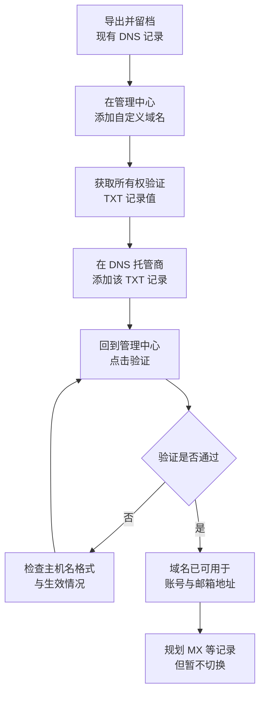
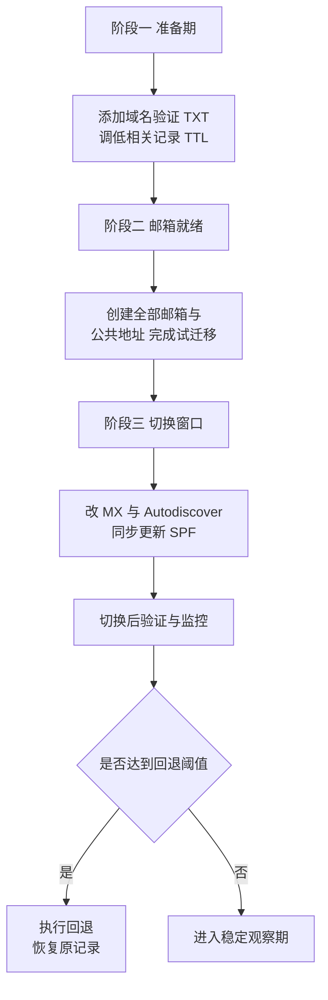

# 第2篇 基础建设 · 第3节 域名验证与 DNS 记录

> **所属：** 第2篇 基础建设：租户、身份与 MFA。  
> **本节小节：** 2.20 ～ 2.32。  
> **本节性质：** **最高风险环节之一。** 修改 MX 会直接改变企业邮件的投递位置，操作错误会导致全公司收不到邮件。  
> **前置条件：** 已完成[第2节](02-管理员账号与角色.md)；已取得 DNS 修改权限；第1篇 1.11 的 DNS 现状已导出留档。  
> **导航：** [返回第2篇目录](README.md)｜上一节：[管理员账号与角色](02-管理员账号与角色.md)｜下一节：[邮件身份验证 SPF/DKIM/DMARC](04-邮件身份验证SPF-DKIM-DMARC.md)

---

## 2.20 本节目标

完成本节后应当达到：

1. 企业自有域名已在租户中添加并通过所有权验证。
2. 理解 MX、Autodiscover、CNAME、TXT 等记录各自的作用。
3. 有一份完整的 DNS 变更计划，包含实施顺序、验证方法和回退步骤。
4. **明确“验证域名”与“切换邮件”是两件可以分开做的事。**

> **必做：** 本节的域名验证可以提前做，但**MX 切换必须等到目标邮箱已创建、邮件迁移方案确定之后**（详见第3篇）。本节负责准备和规划，不代表现在就要切邮件。

---

## 2.21 域名、DNS 和解析记录的通俗解释

用一个比喻理解：

- **域名**（`contoso.com`）像公司的名字。
- **DNS** 像电话簿系统，负责把名字翻译成实际地址。
- **DNS 记录**是电话簿里的每一条登记项，写明“找这类服务，应该去哪里”。

企业最常用的几类记录：

| 记录类型 | 作用 | 举例说明 |
|---|---|---|
| A / AAAA | 把域名指向一个 IP 地址 | 网站服务器 |
| CNAME | 把一个名字指向另一个名字 | Autodiscover、DKIM |
| **MX** | 指定这个域的**邮件应该投递到哪里** | 邮件系统 |
| TXT | 存放文本信息 | 域名所有权验证、SPF、DMARC |
| SRV | 指定某类服务的主机和端口 | 部分通信服务 |
| NS | 指定这个域由哪台 DNS 服务器负责 | 域名托管 |

### 2.21.1 两个必须区分的角色

| 角色 | 职责 | 常见误解 |
|---|---|---|
| 域名注册商 | 你购买和续费域名的地方 | 以为一定在这里改解析 |
| DNS 托管商 | 实际存放和响应解析记录的地方 | 可能是注册商，也可能是其他服务商 |

> **高风险：** 修改记录必须在**真正生效的 DNS 托管商**处进行。在注册商界面改了、但域名的 NS 指向别处，改动不会生效——这是新手最常见的“改了没反应”原因。

### 2.21.2 TTL 是什么

TTL（Time To Live）是一条记录允许被缓存的时间。TTL 设为 3600 秒，意味着全球各地的 DNS 服务器可能会把旧值缓存 1 小时。

这直接影响两件事：

- **切换生效速度**：TTL 越长，切换后旧值残留越久。
- **回退速度**：出问题要改回去时，同样受 TTL 限制。

---

## 2.22 添加域名前必须确认的事项

- [ ] 域名在**企业名下**，不是员工个人或供应商名下。
- [ ] 域名到期日期距今足够远（建议至少 3 个月以上），避免切换期间过期。
- [ ] 已能登录 DNS 托管商后台，并**成功做过一次无害的测试修改**（例如添加一条临时 TXT 再删除）。
- [ ] 已完整导出当前所有 DNS 记录并留档（截图 + 文本）。
- [ ] 已确认该域名当前是否被其他 Microsoft 365 租户占用。
- [ ] 已确认现有邮件系统、网站、CRM、工资单、营销平台等哪些依赖此域名。

> **必做：** “我们有域名”和“我们能改域名解析”是两回事。项目多次卡在“负责域名的人已离职、账号密码没人知道”。这一项必须在排上线日期之前解决。

---

## 2.23 在 Microsoft 365 中添加企业域名

整体流程：



要点：

- 添加域名并完成所有权验证，**不会**改变企业现有邮件投递方式。
- 验证通过后，就可以用该域名作为用户登录名和邮箱地址（但邮件仍投递到旧系统，直到 MX 切换）。
- 所有权验证使用的 TXT 记录在验证通过后通常可以保留，也可按 Microsoft 提示处理。

---

## 2.24 使用 TXT 记录验证域名所有权

验证的逻辑很简单：**只有能修改该域名 DNS 的人，才能添加指定的 TXT 记录**，所以能添加就证明拥有控制权。

操作步骤：

1. 在管理中心添加域名后，界面会给出一条 TXT 记录，通常形如：
   - 主机名/名称：`@`（表示域名本身）
   - 类型：TXT
   - 值：`MS=msXXXXXXXX`（每个租户不同，必须使用界面给出的实际值）
2. 在 DNS 托管商添加这条记录。
3. 等待生效（通常几分钟到几十分钟，取决于 TTL 和服务商）。
4. 回到管理中心点击验证。

### 2.24.1 验证失败的常见原因

| 现象 | 原因 | 处理 |
|---|---|---|
| 一直提示未找到记录 | 主机名填错，例如填了 `contoso.com` 造成 `contoso.com.contoso.com` | 按服务商要求填 `@` 或留空 |
| 记录已加但仍失败 | 修改的不是真正生效的 DNS 托管商 | 查 NS 记录确认托管商 |
| 刚加就验证 | 尚未生效 | 等待后重试 |
| 值被自动加引号或截断 | 服务商界面处理差异 | 按服务商说明填写，核对实际发布值 |
| 域名被其他租户占用 | 同一域名不能同时属于两个租户 | 先在原租户删除该域名 |

> **验证点：** 判断是否生效，不要只看服务商后台界面，应使用 DNS 查询工具确认公网上能查到该记录（方法见 2.29）。

---

## 2.25 MX 记录的作用与切换含义

MX 记录回答一个问题：**发给 `@contoso.com` 的邮件，应该送到哪台邮件服务器？**

| 状态 | MX 指向 | 邮件实际进入 |
|---|---|---|
| 切换前 | 现有邮件系统 | 旧邮箱 |
| 切换后 | Microsoft 365 | Exchange Online 邮箱 |

### 2.25.1 切换 MX 前必须满足的条件

- [ ] 所有需要接收邮件的用户和邮箱**已在 Microsoft 365 中创建**。
- [ ] 共享邮箱、通讯组、会议室等公共地址已创建。
- [ ] 邮件迁移方案和批次已确定（第3篇）。
- [ ] 已确定最终停写窗口和最后一次增量同步安排。
- [ ] SPF 记录已按新的发信来源规划好（见[下一节](04-邮件身份验证SPF-DKIM-DMARC.md)）。
- [ ] TTL 已提前调低。
- [ ] 回退方案已写明并经批准。

微软明确提醒：在把 MX 指向 Microsoft 365 之前，应先创建所有接收邮件的用户和邮箱，否则可能造成邮件中断。参见 [向 Microsoft 365 添加自定义域](https://learn.microsoft.com/en-us/microsoft-365/admin/setup/add-domain?view=o365-worldwide)。

> **高风险：** MX 切换后，发往未创建邮箱的地址会被退回。**先建邮箱、再切 MX**，顺序不能颠倒。

---

## 2.26 Autodiscover 记录的作用

Autodiscover 让 Outlook 和手机邮件客户端**自动找到邮箱所在位置**，用户只需输入邮箱地址和密码（加 MFA），不必手工填服务器地址。

- Microsoft 365 通常要求一条指向 Microsoft 的 CNAME 记录（具体目标值以管理中心给出的为准）。
- 如果 Autodiscover 仍指向旧系统，切换后 Outlook 可能反复提示输入密码、或连到错误的邮箱。
- 混合部署场景下 Autodiscover 的处理更复杂，需按第3篇的迁移方式规划。

> **验证点：** 迁移后测试“新建 Outlook 配置文件、只输入邮箱地址”能否自动完成配置。这是判断 Autodiscover 是否正确的最直接方法。

---

## 2.27 其他常见记录

| 记录 | 用途 | 注意 |
|---|---|---|
| SPF（TXT） | 声明哪些来源可以用你的域名发信 | 每个发信域**只能有一条**，详见下一节 |
| DKIM（CNAME × 2） | 让收件方验证邮件签名 | 目标值必须从门户或 PowerShell 获取 |
| DMARC（TXT） | 告诉收件方如何处理验证失败的邮件 | 建议分阶段收紧 |
| 网站 A / CNAME | 企业官网 | **切换邮件时不要误删** |
| 其他服务验证 TXT | 第三方平台的域名验证 | 不要清理成“干净的空区域” |

> **高风险：** 不要用“清空后重建”的方式整理 DNS。企业 DNS 区域里往往有网站、第三方系统验证、CRM 发信等记录，误删会造成官网无法访问或第三方服务失效。

---

## 2.28 DNS 变更计划与实施顺序

建议把 DNS 变更拆成**三个阶段**，而不是一次全改：



### 2.28.1 变更申请表必须包含的字段

| 字段 | 说明 |
|---|---|
| 变更编号 | 唯一编号，便于追溯 |
| 变更对象 | 具体哪条记录（类型、主机名） |
| 变更前的值 | **原样记录，用于回退** |
| 变更后的值 | 从管理中心复制的实际值 |
| TTL 设置 | 变更前后的 TTL |
| 实施时间窗口 | 建议业务低峰期 |
| 实施人 / 复核人 | 两人确认，避免手误 |
| 验证方法 | 具体查询命令和预期结果 |
| 回退触发阈值 | 影响多少人、持续多久就回退 |
| 最晚决策时间 | 超过该时间必须做出继续或回退决定 |
| 回退步骤 | 按顺序写清恢复动作 |
| 通知对象 | 谁在什么时间通知用户 |

> **必做：** 变更前必须**逐字记录原值**。很多回退失败不是技术问题，而是没人记得原来的 MX 到底写的是什么。

### 2.28.2 TTL 调整时机

1. 切换前 **24～48 小时**（视原 TTL 而定），把 MX、Autodiscover 等待改记录的 TTL 调低（例如 300 秒）。
2. 等待原 TTL 时间过去，确保各地缓存已按新 TTL 刷新。
3. 执行切换。
4. 稳定观察 1～2 周后，把 TTL 调回常规值（例如 3600 秒）。

---

## 2.29 DNS 生效验证方法

不要凭感觉判断，要实际查询。以下命令在 Windows 上可用：

```text
查询 MX 记录
nslookup -type=MX contoso.com

查询 TXT 记录（含 SPF、域名验证）
nslookup -type=TXT contoso.com

查询 DMARC 记录
nslookup -type=TXT _dmarc.contoso.com

查询 Autodiscover
nslookup -type=CNAME autodiscover.contoso.com

指定公共 DNS 查询，避免本地缓存干扰
nslookup -type=MX contoso.com 8.8.8.8
```

PowerShell 也可使用：

```text
Resolve-DnsName -Name contoso.com -Type MX
Resolve-DnsName -Name _dmarc.contoso.com -Type TXT
```

### 2.29.1 验证要点

- 至少从**两个不同网络**（例如公司网络和手机热点）查询，避免只看到本地缓存。
- 指定不同的公共 DNS 服务器查询，确认结果一致。
- 记录查询时间和结果截图，作为变更证据。
- 邮件类变更还要做**实际收发测试**，而不是只看记录（测试用例见 2.31）。

---

## 2.30 常见 DNS 与邮件切换故障

| 现象 | 常见原因 | 排查方向 |
|---|---|---|
| 域名验证一直不通过 | 主机名格式错、改错了托管商、尚未生效 | 查 NS，用公共 DNS 查询 TXT |
| 部分人收到邮件、部分人没收到 | DNS 缓存尚未全部刷新（TTL 未调低） | 等待 TTL、确认各地查询结果 |
| 外部发来的邮件退回“找不到收件人” | 目标邮箱未创建或地址拼写不同 | 核对邮箱与别名清单 |
| 邮件进了旧系统 | MX 未生效或仍有旧 MX 记录残留 | 确认只有一组正确 MX |
| Outlook 反复要求输入密码 | Autodiscover 指向错误、旧式认证被禁用 | 检查 Autodiscover、认证方式 |
| 发出的邮件被判垃圾 | SPF 未包含新发信来源、DKIM 未配置 | 见下一节 |
| 官网无法访问 | 整理 DNS 时误删 A / CNAME | 用留档记录恢复 |
| 第三方系统发信失败 | SPF 中漏掉该来源，或改用了新发信方式 | 登记全部发信源后统一处理 |

> **验证点：** 切换后 30 分钟内至少完成：内部互发、外部发入、向外部发出、共享邮箱收发、手机端收发五项测试。

---

## 2.31 切换测试用例（建议清单）

| 编号 | 测试内容 | 预期结果 |
|---|---|---|
| D1 | 内部用户互发邮件 | 正常收发 |
| D2 | 从外部邮箱（如个人邮箱）发给企业地址 | 进入 Exchange Online 邮箱 |
| D3 | 从企业地址发到外部邮箱 | 正常送达，且不进垃圾邮件 |
| D4 | 发到共享邮箱地址 | 正常收到 |
| D5 | 发到通讯组地址 | 全部成员收到 |
| D6 | 会议室预订请求 | 按规则自动接受或进入审批 |
| D7 | 打印机、业务系统发出的通知邮件 | 正常送达（发信方式已改造） |
| D8 | 新建 Outlook 配置文件，仅输入邮箱地址 | 自动配置成功 |
| D9 | 手机端邮件客户端 | 正常收发与同步 |
| D10 | 查看外部收到邮件的邮件头 | SPF/DKIM/DMARC 结果符合预期 |

---

## 2.32 本节完成检查表

- [ ] 已确认域名归属企业，到期日期安全，且能成功修改 DNS。
- [ ] 已完整导出并留档变更前的全部 DNS 记录。
- [ ] 已确认真正生效的 DNS 托管商（通过 NS 记录核实）。
- [ ] 企业自有域名已在租户中添加并通过所有权验证。
- [ ] 已理解“域名验证”与“MX 切换”可以分开执行。
- [ ] 已登记所有使用该域名发信的系统（邮件系统、打印机、CRM、工资单、营销平台等）。
- [ ] 已编写 DNS 变更申请表，包含原值、新值、TTL、验证方法和回退步骤。
- [ ] 回退触发阈值、最晚决策时间、决策人和执行人已明确。
- [ ] 已安排切换前的 TTL 调低时间点。
- [ ] 已准备切换测试用例（至少 2.31 中的 10 项）。
- [ ] 已确认 MX 切换的前置条件（邮箱全部创建、迁移方案确定）尚未满足时**不切换**。
- [ ] 已确认切换窗口、值班人员和用户通知安排。

> **进入下一节的条件：** 域名已验证、DNS 变更计划已批准。下一节处理 SPF、DKIM、DMARC——它们决定企业邮件是否被外部信任，必须与 MX 切换**同步规划**，不能事后补做。
