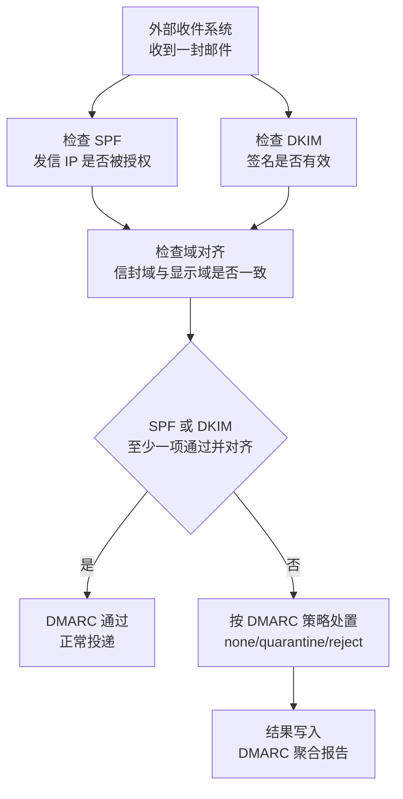
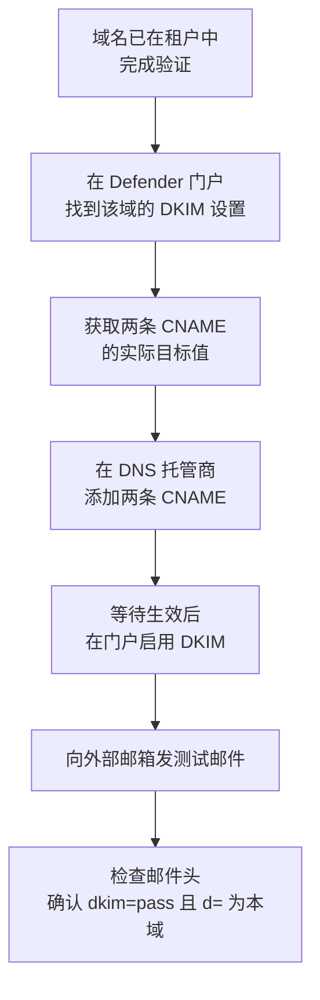
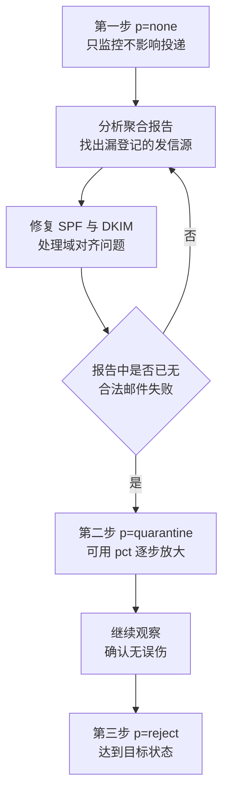

# 第2篇 基础建设 · 第4节 邮件身份验证 SPF / DKIM / DMARC

> **所属：** 第2篇 基础建设：租户、身份与 MFA。  
> **本节小节：** 2.33 ～ 2.39。  
> **本节性质：** 高风险配置。配置不当会导致企业正常邮件被拒收或进入垃圾邮件，配置缺失则会让企业域名容易被冒用。  
> **前置条件：** 已完成[第3节](03-域名验证与DNS记录.md)，域名已验证，且已登记全部使用本域名发信的系统。  
> **导航：** [返回第2篇目录](README.md)｜上一节：[域名验证与 DNS 记录](03-域名验证与DNS记录.md)｜下一节：[用户账号与组](05-用户账号与组.md)

---

## 2.33 本节目标与三者的关系

企业邮件被伪造，是商业邮件欺诈（BEC）和钓鱼攻击最常见的手段：攻击者用 `财务总监@contoso.com` 的名义给员工发“紧急付款”邮件。SPF、DKIM、DMARC 就是解决这个问题的三件套。

用通俗方式理解：

| 机制 | 通俗解释 | 回答的问题 |
|---|---|---|
| **SPF** | 公司公告牌上写明“只有这几家快递可以代表我们送件” | 这封邮件是从**允许的服务器**发出的吗？ |
| **DKIM** | 在信封上盖一个只有公司能盖、别人能验证的**防伪印章** | 这封邮件**中途被改过**吗？确实由该域签发吗？ |
| **DMARC** | 公司对外声明“印章和快递都不对的信，请这样处理”，并要求**回执报告** | 验证失败时**怎么处置**？谁在冒用我们？ |

关键点：**DMARC 依赖 SPF 和 DKIM 的结果，而且要求“域对齐”。** 只配 SPF 和 DKIM 而不配 DMARC，冒用者依然可以在“显示的发件人”上做手脚。

### 2.33.1 验证过程示意



完成本节后应当达到：

1. 每个发信域只有**一条**正确的 SPF 记录，涵盖全部合法发信来源。
2. 自定义域已启用 DKIM，且 CNAME 值来自门户或 PowerShell 的**实际输出**。
3. DMARC 已发布，并有明确的收紧计划和报告监看责任人。
4. 有一套可执行的实发测试与验收方法。

---

## 2.34 SPF：声明合法发信来源

### 2.34.1 SPF 记录长什么样

SPF 是一条 TXT 记录，发布在域名本身上：

```text
主机名：@
类型：TXT
值：v=spf1 include:spf.protection.outlook.com -all
```

含义拆解：

| 部分 | 含义 |
|---|---|
| `v=spf1` | 声明这是一条 SPF 记录 |
| `include:...` | 把某个服务商授权的发信服务器纳入允许范围 |
| `ip4:` / `ip6:` | 直接授权具体 IP 地址（例如企业自有邮件网关） |
| `-all` | 硬失败：其他来源一律视为不合法 |
| `~all` | 软失败：其他来源标记为可疑但不硬拒 |

> **推荐：** 迁移和整合期间可先用 `~all` 观察，确认所有合法来源都已登记后再改为 `-all`。切换为 `-all` 前必须完成实发测试。

### 2.34.2 三条硬性规则（最容易违反）

1. **每个发信域或子域只能发布一条 SPF 记录。** 多条会导致验证结果不可靠。
2. **多个合法发信源必须合并进这一条记录**，而不是各加一条。
3. **DNS 查询次数不能超过 10 次。** 嵌套的 `include`、`a`、`mx` 等机制都会消耗查询次数，超限会导致 SPF 验证失败。

官方规则见 [Microsoft 365 SPF 配置说明](https://learn.microsoft.com/en-us/defender-office-365/email-authentication-spf-configure)。

### 2.34.3 合并示例

假设企业同时有：Microsoft 365、一台自建邮件网关（IP 假设为 `198.51.100.10`）、一个营销平台（假设需要 `include:_spf.example-marketing.com`）。

错误做法（三条记录）：

```text
v=spf1 include:spf.protection.outlook.com -all
v=spf1 ip4:198.51.100.10 -all
v=spf1 include:_spf.example-marketing.com -all
```

正确做法（一条记录）：

```text
v=spf1 include:spf.protection.outlook.com ip4:198.51.100.10 include:_spf.example-marketing.com -all
```

> **高风险：** 上例中的 IP 和第三方 include 值仅为示意。实际值必须来自各服务商的官方说明和管理中心，不能照抄文档。

### 2.34.4 发信来源登记表

在改 SPF 之前，先把所有来源登记清楚：

| 发信系统 | 发信地址示例（虚构） | 发信方式 | 需要的 SPF 机制 | 负责人 | 是否已确认 |
|---|---|---|---|---|---|
| Microsoft 365 邮箱 | `zhangsan@contoso.com` | Exchange Online | `include:spf.protection.outlook.com` |  | 待填写 |
| 打印机/扫描仪 | `scanner@contoso.com` | SMTP 提交或中继 | 视方案而定 |  | 待填写 |
| ERP / OA 通知 | `noreply@contoso.com` | 应用发信 | 视方案而定 |  | 待填写 |
| 营销平台 | `news@marketing.contoso.com` | 第三方平台 | 平台提供的 include |  | 待填写 |
| 工资单系统 | `hr-notice@contoso.com` | 应用发信 | 视方案而定 |  | 待填写 |
| 监控告警 | `alert@contoso.com` | 脚本或设备 | 视方案而定 |  | 待填写 |

> **推荐：** 不受企业直接控制的批量发信服务（如营销平台），建议使用**子域**（例如 `marketing.contoso.com`）而不是主域，避免影响主域的信誉。

---

## 2.35 DKIM：给邮件加上可验证的签名

### 2.35.1 工作原理

1. 发信系统用**私钥**对邮件的关键部分（部分邮件头和正文）做数字签名。
2. 签名写入邮件头的 `DKIM-Signature` 字段，其中 `d=` 标明签名域。
3. 收件方根据 `d=` 到 DNS 查询对应的**公钥**（Microsoft 365 使用 CNAME 记录）。
4. 用公钥验证签名，只要签名部分未被中途篡改，验证就通过。

### 2.35.2 Microsoft 365 的两种情况

| 情况 | 是否需要配置 |
|---|---|
| 只用初始域名 `*.onmicrosoft.com` 发信 | 出站邮件会自动由该域 DKIM 签名，无需额外操作 |
| **使用企业自定义域发信（绝大多数企业）** | **必须自行配置**，否则自定义域出站邮件不会被 DKIM 签名 |

配置后会生成两个选择器（selector），对应两条 CNAME 记录：一个当前启用，另一个在将来密钥轮换后启用。

### 2.35.3 必须从实际输出获取 CNAME 值

DKIM CNAME 的目标值与租户初始域名、域名加入时间和 Microsoft 内部路由有关。2025 年 5 月起，新增自定义域采用了包含**动态分区字符**的新格式，与旧格式**不能对同一选择器混用**。

因此：

> **高风险：** **不要照抄任何文档中的示例值，也不要自己拼接。** 必须从 Microsoft Defender 门户的邮件身份验证设置页面，或用 Exchange Online PowerShell 获取实际值：
>
> ```text
> Get-DkimSigningConfig -Identity contoso.com | Format-List Name,Enabled,Status,Selector1CNAME,Selector2CNAME
> ```

官方说明见 [Microsoft 365 DKIM 配置说明](https://learn.microsoft.com/en-us/defender-office-365/email-authentication-dkim-configure)。

### 2.35.4 配置顺序



### 2.35.5 子域与闲置域名

- 每个用于发信的子域**需要自己的 DKIM 配置**。
- 已注册但不用于发信的域名（停放域名），**不要**为其发布 DKIM 记录；没有公钥可查，反而能阻止伪造域通过 DKIM 验证。

---

## 2.36 DMARC：声明处置方式并获取报告

### 2.36.1 记录格式

```text
主机名：_dmarc
类型：TXT
值：v=DMARC1; p=none; pct=100; rua=mailto:dmarc-rua@contoso.com
```

| 参数 | 含义 |
|---|---|
| `p=none` | 不建议特别处置，仅用于**监控和调优** |
| `p=quarantine` | 建议接收方按可疑处理（例如放入垃圾邮件或隔离） |
| `p=reject` | 建议接收方拒收（通常被丢弃） |
| `pct=` | 对多少比例的失败邮件应用策略，用于分阶段推进（默认 100） |
| `rua=mailto:` | 聚合报告投递地址 |
| `ruf=mailto:` | 失败（取证）报告投递地址 |

### 2.36.2 子域的继承规则

与 SPF、DKIM 不同：**父域的 DMARC 记录会自动覆盖没有自己 DMARC 记录的所有子域**（包括不存在的子域）。但每个子域仍然需要自己的 SPF 和 DKIM 才能让 DMARC 通过。

### 2.36.3 分阶段实施（必须遵守）

直接上 `p=reject` 是新手最容易造成事故的做法——一旦有合法发信源没登记，对方会**直接拒收**企业邮件。

推荐路径：



建议做法：

- 从**邮件量较小、发信源较少的子域**开始，主域放到最后。
- 每次提高策略前，先分析报告并取得批准，记录回退条件。
- 可用 `pct=10 → 25 → 50 → 75 → 100` 逐步扩大影响范围。
- 已注册但不发信的停放域名，可直接发布 `v=DMARC1; p=reject;`。

官方步骤见 [Microsoft 365 DMARC 配置说明](https://learn.microsoft.com/en-us/defender-office-365/email-authentication-dmarc-configure)。

### 2.36.4 报告必须有人看

- `rua` 报告应投递到**专用邮箱或 Microsoft 365 组**，不要投递到某个员工的个人邮箱。
- 报告是 XML 附件（通常压缩），数量可能很大；可借助报告分析服务或工具解读。
- 必须指定**监看责任人、检查频率（建议每周）和异常升级流程**。

> **必做：** 只发布一条 DMARC 记录而没人看报告，不等于建立了 DMARC 能力。项目验收要检查“谁在看、多久看一次、发现问题怎么处理”。

---

## 2.37 域对齐：最容易被忽略的概念

这是新手最难理解、但最关键的一点。

邮件里有**两个“发件人”**：

| 名称 | 位置 | 谁能看到 |
|---|---|---|
| 信封发件人（MAIL FROM，也叫 5321.From） | SMTP 传输过程中使用 | 用户通常看不到 |
| 显示发件人（From，也叫 5322.From） | 邮件头中的 From 字段 | **用户看到的就是这个** |

- **SPF 检查的是信封发件人的域。**
- **DKIM 检查的是签名域（`d=`）。**
- **DMARC 要求这两者中至少有一个与“显示发件人的域”对齐。**

因此会出现这种情况：SPF 显示 `pass`、DKIM 显示 `pass`，但 **DMARC 仍然 `fail`**——因为通过的那一项与用户看到的发件域不一致。这在使用第三方平台代发时非常常见。

### 2.37.1 对齐失败的处理思路

| 情况 | 处理方向 |
|---|---|
| 第三方平台可以把信封发件域改成企业域 | 修正 SPF 对齐 |
| 第三方平台支持用企业域做 DKIM 签名（`d=contoso.com`） | 配置自定义 DKIM，实现 DKIM 对齐 |
| 两者都不支持 | 改用**子域**发信，并为该子域单独发布 SPF、DKIM、DMARC |

### 2.37.2 转发场景

邮件被转发或经过邮件列表时，内容可能被中间系统修改，导致 DKIM 失效、DMARC 失败。若企业需要接收这类邮件，可评估把可信的中间方配置为受信任的 ARC 封装方，而不是简单地放宽策略。

---

## 2.38 验收方法：必须实发测试

**只截图 DNS 记录不算验收。** 每一种合法发信来源都要实际发一封邮件到外部测试邮箱，然后查看邮件头。

### 2.38.1 邮件头中要看的内容

在 `Authentication-Results` 头中通常可以看到类似字段：

| 字段 | 期望值 | 说明 |
|---|---|---|
| `spf=` | `pass` | SPF 验证结果 |
| `dkim=` | `pass` | DKIM 验证结果 |
| `header.d=` | 本企业域 | DKIM 签名域，用于判断对齐 |
| `dmarc=` | `pass` | 最终目标 |
| `compauth=` | 视场景 | Microsoft 的复合身份验证结果 |

### 2.38.2 实发测试矩阵

| 编号 | 发信来源 | 收件方 | 期望结果 | 状态 |
|---|---|---|---|---|
| M1 | Microsoft 365 用户邮箱 | 外部测试邮箱 | dmarc=pass | 待测试 |
| M2 | 共享邮箱 | 外部测试邮箱 | dmarc=pass | 待测试 |
| M3 | 打印机/扫描仪 | 外部测试邮箱 | dmarc=pass | 待测试 |
| M4 | ERP / OA 通知 | 外部测试邮箱 | dmarc=pass | 待测试 |
| M5 | 营销平台（子域） | 外部测试邮箱 | dmarc=pass | 待测试 |
| M6 | 工资单系统 | 外部测试邮箱 | dmarc=pass | 待测试 |
| M7 | 监控告警脚本 | 外部测试邮箱 | dmarc=pass | 待测试 |
| M8 | 停放域名（不应有邮件） | — | 无合法邮件 | 待确认 |

> **验证点：** 建议至少向两家不同的外部邮件服务商发送测试邮件，避免只在一家的判定规则下“看起来正常”。

### 2.38.3 常见故障对照

| 现象 | 可能原因 | 处理 |
|---|---|---|
| `spf=fail` | 发信来源未登记、或 SPF 有多条记录 | 合并为一条并补齐来源 |
| `spf=permerror` | 语法错误或 DNS 查询超过 10 次 | 精简 include 层级 |
| `dkim=none` | 自定义域未配置 DKIM | 配置并启用 DKIM |
| `dkim=fail` | CNAME 值不正确、或邮件被中途修改 | 从门户/PowerShell 重取值核对 |
| `dmarc=fail` 但 SPF、DKIM 都 pass | **域对齐问题** | 按 2.37 处理 |
| 正常邮件被外部拒收 | DMARC 过早收紧到 reject | 回退到 quarantine 或 none，修复后再推进 |
| 收不到聚合报告 | rua 邮箱不存在或投递受阻 | 确认邮箱可收外部邮件 |

---

## 2.39 本节完成检查表

- [ ] 已登记**全部**使用企业域名发信的系统，并确认负责人。
- [ ] 每个发信域和子域只有**一条** SPF 记录。
- [ ] SPF 已涵盖全部合法来源，且 DNS 查询次数未超过 10 次。
- [ ] 已决定使用 `~all` 还是 `-all`，并说明理由。
- [ ] 自定义域的 DKIM CNAME 值来自门户或 `Get-DkimSigningConfig` 的**实际输出**。
- [ ] 每个用于发信的子域都有独立的 DKIM 配置。
- [ ] 停放域名未发布 DKIM，并已发布拒收型 DMARC。
- [ ] DMARC 已发布，起始策略为 `p=none`。
- [ ] `rua` 报告投递到专用邮箱或组，且已确认能正常收到报告。
- [ ] 已指定 DMARC 报告监看责任人、检查频率和升级流程。
- [ ] 已编写从 `none` 到 `quarantine` 再到 `reject` 的收紧计划，含批准人和回退条件。
- [ ] 已完成实发测试矩阵，所有合法来源达到预期结果并保存邮件头证据。
- [ ] 已理解域对齐概念，并处理了所有对齐失败的来源。
- [ ] 已确认第三方批量发信改用子域。

> **进入下一节的条件：** SPF、DKIM 已就绪，DMARC 处于可监控状态。下一节转向身份侧：创建用户账号与组——这是分配许可证、迁移邮箱和启用 MFA 的前提。
