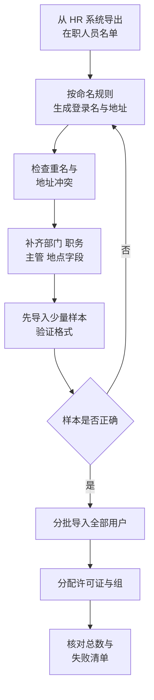
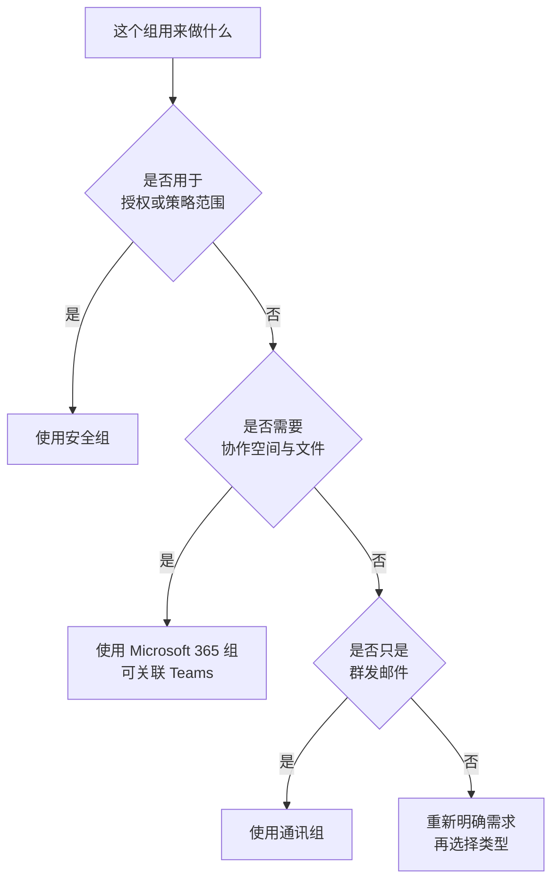

# 第2篇 基础建设 · 第5节 用户账号与组

> **所属：** 第2篇 基础建设：租户、身份与 MFA。  
> **本节小节：** 2.40 ～ 2.54。  
> **本节性质：** 生产配置。账号命名和组结构一旦铺开就很难大规模返工，务必先定规则再批量创建。  
> **前置条件：** 已完成[第4节](04-邮件身份验证SPF-DKIM-DMARC.md)；第1篇的用户清单、命名规则和许可证规划已确定。  
> **导航：** [返回第2篇目录](README.md)｜上一节：[邮件身份验证 SPF/DKIM/DMARC](04-邮件身份验证SPF-DKIM-DMARC.md)｜下一节：[本地 AD 与身份同步](06-本地AD与身份同步.md)

---

## 2.40 本节目标

完成本节后应当达到：

1. 理解 Microsoft Entra ID 中“账号”由哪些关键信息构成。
2. 明确登录名、主邮箱地址和别名的区别，并定下命名规则。
3. 能够单个和批量创建用户，并正确分配许可证。
4. 能区分安全组、Microsoft 365 组和通讯组，知道各自用在什么场景。
5. 完成账号与地址冲突检查，避免后续同步和迁移失败。

> **必做：** 如果企业存在本地 AD 且计划同步，**先读[第6节](06-本地AD与身份同步.md)再决定是否在云端手工创建用户**。顺序错了会产生重复账号，清理代价很大。

---

## 2.41 Microsoft Entra ID 的通俗解释

Microsoft Entra ID 是企业在 Microsoft 云中的**账号与登录中心**，可以理解为“云端的用户目录 + 门卫”。

它负责回答三个问题：

1. **你是谁？**（账号是否存在、密码或凭据是否正确）
2. **你能不能进？**（账号是否启用、是否满足 MFA 和访问策略）
3. **你能用什么？**（分配了哪些许可证和权限）

Exchange Online、Teams、SharePoint、OneDrive 等服务本身不单独维护账号，它们都依赖 Entra ID 的身份判断结果。

### 2.41.1 这带来两个重要推论

- **禁用 Entra ID 中的账号，等于同时关闭邮箱、Teams、文件的访问**——这也是离职处理的第一动作。
- 账号出问题时，先排查身份侧（登录、许可、策略），再排查具体服务。

---

## 2.42 一个用户账号由哪些信息组成

| 类别 | 字段示例 | 用途 |
|---|---|---|
| 标识 | 用户主名称（UPN）、对象 ID | 登录与唯一标识 |
| 姓名 | 名、姓、显示名称 | 通讯簿显示 |
| 邮件 | 主邮箱地址、别名（代理地址） | 收发邮件 |
| 组织 | 部门、职务、公司、主管、办公地点 | 通讯簿、动态组、报表 |
| 联系 | 手机、办公电话 | 联系与部分验证场景 |
| 状态 | 是否允许登录、账号来源（云端/同步） | 访问控制 |
| 许可 | 已分配的许可证与服务计划 | 决定可用功能 |
| 验证 | 已注册的身份验证方式 | MFA 与自助重置 |

> **推荐：** 部门、职务、主管、办公地点这些字段不是“可填可不填”。它们后续会用于通讯簿检索、动态组、许可证分配报表和离职交接判断，建议在创建时就规范填写。

---

## 2.43 登录名、主邮箱地址和别名的区别

这是新手最容易混淆的三个概念。

| 概念 | 作用 | 举例（虚构） | 能否多个 |
|---|---|---|---|
| **登录名（UPN）** | 用来**登录** Microsoft 365 | `zhangsan@contoso.com` | 只有一个 |
| **主邮箱地址** | 对外发信时**默认显示**的地址 | `zhangsan@contoso.com` | 只有一个 |
| **别名（代理地址）** | 其他能**收到邮件**的地址 | `zhang.san@contoso.com`、`zhangsan@old-contoso.com` | 可以多个 |

要点：

- 登录名与主邮箱地址**通常建议保持一致**，减少用户困惑。
- 别名只能收信，不改变默认发信地址。
- 企业更名或合并时，常见做法是：新域名地址作为主地址，旧域名地址保留为别名，保证历史邮件仍能收到。
- 修改主邮箱地址会影响对外沟通，应有审批和通知流程。

### 2.43.1 常见误解

| 误解 | 事实 |
|---|---|
| 加了别名就能用别名登录 | 不能，登录使用 UPN |
| 加了别名就能用别名发信 | 默认不能，发信仍用主地址 |
| 改了显示名称就等于改了邮箱地址 | 不等于，两者独立 |
| 删除别名没有影响 | 发往该别名的邮件将开始退回 |

---

## 2.44 命名规则设计

命名规则应在批量创建**之前**定好，并写入文档。

### 2.44.1 常见方案对比

| 方案 | 示例 | 优点 | 缺点 |
|---|---|---|---|
| 全拼 | `zhangsan@contoso.com` | 简洁、易记 | 同名冲突多 |
| 姓.名 | `zhang.san@contoso.com` | 可读性好 | 长度较长 |
| 首字母+姓 | `szhang@contoso.com` | 短 | 冲突概率高、不易识别 |
| 员工编号 | `e10245@contoso.com` | 绝不冲突 | 对外沟通不友好 |
| 英文名 | `simon.zhang@contoso.com` | 面向外部客户友好 | 需要维护英文名规范 |

### 2.44.2 必须一并确定的规则

- [ ] 重名如何处理（例如追加数字、追加部门缩写）。
- [ ] 是否允许使用中文拼音以外的形式。
- [ ] 特殊字符、空格、大小写规则（建议统一小写）。
- [ ] 是否为每人保留一个稳定别名（例如员工编号地址）。
- [ ] 共享邮箱、会议室、设备账号的命名前缀（例如 `sh-`、`room-`、`dev-`）。
- [ ] 管理专用账号前缀（例如 `adm-`）。
- [ ] 测试账号前缀（例如 `test-`）和清理责任人。
- [ ] 离职后地址是否保留、保留多久。

> **高风险：** 命名规则中途更改会导致名片、签名、对外通讯录、第三方系统对接全部返工。定规则时请业务和 HR 一起确认，而不是只由 IT 决定。

---

## 2.45 纯云账号与同步账号的区别

| 项目 | 纯云账号 | 同步账号（来自本地 AD） |
|---|---|---|
| 创建位置 | Microsoft 365 / Entra 管理中心 | 本地 Active Directory |
| 属性修改位置 | 云端 | **本地 AD**（云端多数属性为只读） |
| 密码管理 | 云端 | 取决于所选认证方式 |
| 删除方式 | 云端删除 | 本地删除后同步 |
| 适合场景 | 无本地 AD、或云优先的企业 | 电脑加域、依赖 AD 的企业 |

> **必做：** 如果账号来自同步，**不要在云端手工修改姓名、部门、邮件属性**——同步周期到了会被本地值覆盖，造成“改了又变回去”的困惑。属性应在本地 AD 修改。

---

## 2.46 单个创建用户账号

适用于新入职、试点用户和临时账号。

创建时至少确认：

1. 显示名称、名、姓（影响通讯簿排序）。
2. 登录名（按命名规则）。
3. 初始密码策略：建议**要求首次登录修改密码**。
4. 使用位置（影响可分配的服务）。
5. 部门、职务、主管、办公地点。
6. 分配的许可证。
7. 加入的组。

### 2.46.1 创建后必做的三件事

- [ ] 确认许可证已生效，邮箱已创建成功。
- [ ] 引导用户完成 MFA 注册（见[第9节](09-MFA实施推广与用户支持.md)）。
- [ ] 记录到用户账号与许可证清单（模板 T2）。

---

## 2.47 批量创建用户账号

人数较多时，逐个创建既慢又容易出错。批量创建的通用流程：

### 2.47.1 批量导入的注意事项

- 使用管理中心提供的模板格式，不要自行改动列名。
- 文件编码要能正确保存中文（避免姓名乱码）。
- **先用 5～10 个样本试导入**，确认格式和结果后再全量。
- 导入失败的记录会单独列出，必须逐条处理，不能忽略。
- 导入不等于配置完成，还需分配许可证、加入组、设置属性。

### 2.47.2 大批量场景的建议

- 人数很多或需要重复执行时，可评估用 PowerShell 或 Microsoft Graph 脚本处理，便于留下可复用的记录。
- 无论用界面还是脚本，都必须先在测试环境或小批量上验证。

> **验证点：** 导入完成后核对三个数字是否能互相解释：HR 名单人数、成功创建的账号数、已分配许可证数。差异必须有书面说明。

---

## 2.48 分配、调整和回收许可证

### 2.48.1 分配许可证会触发什么

许可证不只是账目动作，还可能**创建实际资源**：

| 服务计划 | 分配后可能发生 |
|---|---|
| Exchange Online | 为用户创建邮箱 |
| SharePoint Online | 开放站点与文件能力 |
| OneDrive | 用户首次访问时创建个人存储 |
| Teams | 用户获得对应 Teams 能力 |
| Microsoft 365 Apps | 获得桌面应用安装与激活权利 |

### 2.48.2 建议做法

- 按用户画像分配（见第1篇 1.26），不要“全员统一最高套餐”。
- 优先**基于组分配**许可证（如许可证支持），减少手工操作和遗漏。
- 关闭用户不需要的服务计划（例如某些用户不需要特定服务），但要先确认业务影响。
- 保留少量备用许可，避免新员工入职当天无许可可用。

### 2.48.3 回收许可证前必须确认

> **高风险：** 直接移除许可证可能导致邮箱和 OneDrive 数据进入删除倒计时。回收前必须确认：
>
> - [ ] 邮箱数据是否需要保留、转为共享邮箱或导出。
> - [ ] OneDrive 文件是否已交接给指定接收人。
> - [ ] 是否存在保留策略或法务保留要求阻止删除。
> - [ ] 是否已通知相关业务负责人。

详细离职流程见第6篇。

---

## 2.49 三类组的区别（最容易混淆）

| 组类型 | 主要用途 | 是否有邮箱地址 | 是否可用于权限 | 典型场景 |
|---|---|---|---|---|
| **安全组** | 授予权限、分配许可、条件访问范围 | 通常没有 | **可以** | MFA 试点组、许可分配组 |
| **Microsoft 365 组** | 团队协作（关联 Teams、SharePoint、共享邮箱等） | 有 | 部分场景可以 | 项目团队、部门协作 |
| **通讯组** | 群发邮件 | 有 | 一般不用于权限 | `all@contoso.com`、部门群发 |

### 2.49.1 选择判断流程

### 2.49.2 常见错误

| 错误做法 | 后果 |
|---|---|
| 用通讯组分配权限 | 权限不生效或行为不一致 |
| 每个部门都建 Microsoft 365 组并启用 Teams | 产生大量无人管理的团队和站点 |
| 组名随意（`group1`、`新组`） | 半年后没人知道用途 |
| 组没有所有者或只有一个所有者 | 所有者离职后无人管理 |

> **推荐：** 每个正式组至少两名内部所有者，并在组说明中写明用途、申请人和复核周期。

---

## 2.50 创建和维护组

创建组时应确定：

- [ ] 组类型（安全组 / Microsoft 365 组 / 通讯组）。
- [ ] 组名与显示名称（遵循命名规则，例如 `sg-` 表示安全组）。
- [ ] 用途说明。
- [ ] 至少两名所有者。
- [ ] 成员来源（手工维护还是动态规则）。
- [ ] 邮件相关设置（是否允许外部发信、是否隐藏在通讯簿中）。
- [ ] 复核周期与责任人。

### 2.50.1 维护要点

- 定期核对成员是否与实际组织一致（建议每季度）。
- 人员转岗时同步调整组成员（详见第6篇入转离流程）。
- 清理无用组，但删除前确认没有权限、邮件流或团队依赖。

> **高风险：** 删除 Microsoft 365 组会影响关联的 Teams 团队和 SharePoint 站点及其中的文件。删除前必须检查关联资源和数据。

---

## 2.51 动态组的适用场景

动态组根据用户属性（例如部门、办公地点、职务）**自动计算成员**。

| 适合 | 不适合 |
|---|---|
| 属性维护规范、变化能及时反映 | 属性缺失或长期不准确 |
| 按部门、地点批量授予基础能力 | 需要精确控制的高权限场景 |
| 成员变动频繁的大范围分组 | 需要人工审批成员的场景 |

注意：

- 动态组需要 Entra ID P1 能力，**E3 已包含**（第1篇 1.26.2），可以直接使用。
- 规则错误会导致大范围成员变化（例如策略突然覆盖全公司），**必须先用小范围规则测试**。
- 属性质量决定动态组质量：如果部门字段有“销售部”“销售”“Sales”三种写法，结果一定混乱。

> **必做：** 动态组上线前，先用只包含少量用户的规则验证结果，确认成员符合预期后再扩大范围。

---

## 2.52 测试账号管理原则

- 统一前缀（例如 `test-`），便于识别和清理。
- 明确用途、申请人和**销毁日期**。
- 默认不分配高权限角色。
- 不使用真实客户或员工个人信息作为测试数据。
- 项目结束后集中清理，并在清单中记录处理结果。

> **推荐：** 测试账号也要纳入许可证统计。很多企业结束项目一年后才发现，还在为十几个测试账号付费。

---

## 2.53 账号与邮箱地址冲突检查

这是进入下一节（身份同步）和第3篇（邮件迁移）之前的**必检项**。

| 检查项 | 检查方法 | 处理原则 |
|---|---|---|
| 重复的登录名 | 比对导入清单与已有账号 | 按命名规则的重名方案处理 |
| 重复的邮箱地址或别名 | 导出全部主地址和别名比对 | 同一地址只能属于一个对象 |
| 用户邮箱与共享邮箱地址冲突 | 比对两类清单 | 调整命名，避免语义混淆 |
| 通讯组与用户地址冲突 | 比对清单 | 通讯组通常使用功能性名称 |
| 大小写或含空格的异常地址 | 检查导出数据 | 统一小写、去除空格 |
| 本地 AD 中的重复 UPN、异常字符 | 在本地导出核查 | 同步前清理（见下一节） |
| 已离职但仍占用地址 | 与 HR 名单比对 | 按保留策略处理后释放 |

> **验证点：** 冲突检查应在**批量创建之前**完成一次，在同步或迁移之前再复核一次。这是最省成本的返工预防措施。

---

## 2.54 本节完成检查表

- [ ] 已确认账号来源策略：纯云创建，还是等待本地 AD 同步（避免重复账号）。
- [ ] 命名规则已书面确定，并经 IT、HR 和业务确认。
- [ ] 已明确登录名、主邮箱地址与别名的使用规则。
- [ ] 共享邮箱、会议室、设备、管理专用和测试账号的前缀规则已确定。
- [ ] 已完成账号与邮箱地址冲突检查，冲突项已处理。
- [ ] 批量导入前已用少量样本验证格式，中文姓名显示正常。
- [ ] 导入失败清单已逐条处理并记录。
- [ ] HR 名单人数、创建账号数、许可分配数三者差异有书面说明。
- [ ] 许可证按用户画像分配，尽量采用基于组的分配方式。
- [ ] 已保留合理的备用许可数量。
- [ ] 组类型选择正确（安全组用于授权、Microsoft 365 组用于协作、通讯组用于群发）。
- [ ] 每个正式组有用途说明和至少两名所有者。
- [ ] 动态组已先用小范围规则验证过结果（E3 含 Entra ID P1，无许可障碍）。
- [ ] 测试账号有前缀、用途、责任人和销毁日期。
- [ ] 用户账号与许可证清单（模板 T2）已建立并留档。

> **进入下一节的条件：** 命名规则和冲突检查已完成。如果企业存在本地 AD，**下一节必须先读完再决定批量创建方式**；如果是纯云环境，可在本节完成批量创建后直接进入 MFA 部分。
