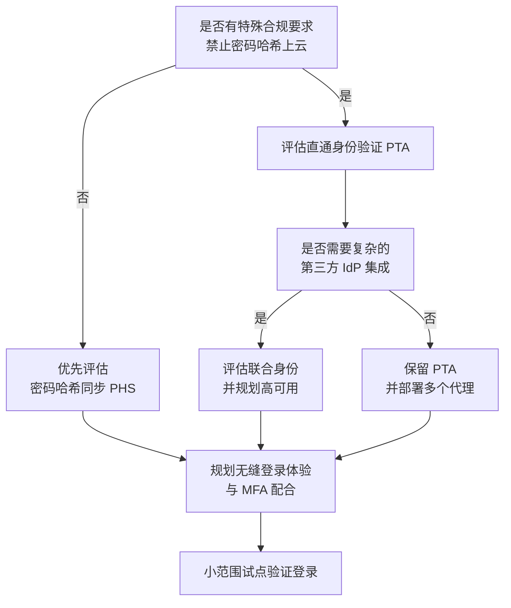
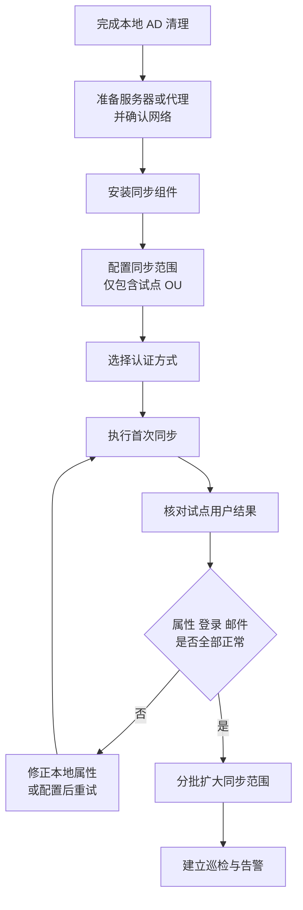
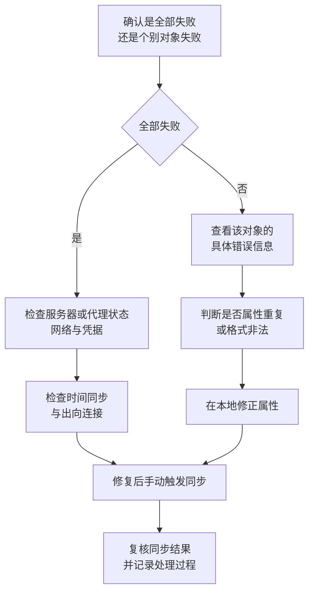

# 第2篇 基础建设 · 第6节 本地 AD 与身份同步

> **所属：** 第2篇 基础建设：租户、身份与 MFA。  
> **本节小节：** 2.55 ～ 2.70。  
> **本节性质：** 高风险配置。同步会把本地目录的问题**放大**到云端，且部分错误（如错误匹配、错误删除）恢复困难。  
> **适用范围：** **仅适用于存在本地 Active Directory 且计划混合身份的企业。** 纯云环境可直接跳到[第7节](07-MFA原理与验证方式.md)。  
> **导航：** [返回第2篇目录](README.md)｜上一节：[用户账号与组](05-用户账号与组.md)｜下一节：[MFA 原理与验证方式](07-MFA原理与验证方式.md)

---

## 2.55 本节目标

完成本节后应当达到：

1. 判断企业是否真的需要同步本地 AD。
2. 在同步之前完成本地目录清理，避免把垃圾数据带上云。
3. 选定同步工具（Entra Connect Sync 或 Entra Cloud Sync）和认证方式。
4. 完成小范围试点同步、验证结果，再扩大范围。
5. 具备同步暂停、恢复和回退能力，并建立日常巡检。

> **高风险：** 同步是**单向覆盖**为主的机制。范围设置错误可能导致大量不该上云的账号被创建；删除范围内的本地对象会导致云端对象被删除。**任何范围调整都必须先在小范围验证。**

---

## 2.56 哪些企业需要同步本地 AD

| 情况 | 建议 |
|---|---|
| 电脑已加入本地域，员工用域账号登录电脑 | 通常需要混合身份 |
| 文件服务器、打印、VPN、ERP 依赖 AD 账号 | 通常需要混合身份 |
| 希望员工在电脑与云端使用同一套密码 | 通常需要混合身份 |
| 没有本地 AD | **不需要**，使用纯云身份 |
| 有 AD 但仅用于少量老旧应用，且计划淘汰 | 评估纯云 + 应用改造 |
| AD 环境混乱、无人维护、大量废弃账号 | **先清理或考虑不同步**，不要把混乱同步上云 |

### 2.56.1 混合身份不是“更高级”，而是“更复杂”

混合身份会引入：同步服务器（或代理）、同步周期、属性归属规则、密码策略配合、故障排查环节。企业必须具备维护能力。如果 IT 只有一两个人且本地 AD 已长期无人管理，**纯云身份往往更稳妥**。

---

## 2.57 同步前为什么必须清理本地 AD

同步会把选定范围内的对象复制到云端。本地存在的问题会**同步放大**：

| 本地问题 | 同步后的后果 |
|---|---|
| 多年未禁用的离职账号 | 云端凭空多出大量账号，可能被误分配许可 |
| 重复的邮箱地址或 `proxyAddresses` | 同步失败，报“属性重复”错误 |
| UPN 后缀是不可路由的内部域（如 `.local`） | 用户无法用该 UPN 登录云端 |
| 姓名或地址含特殊字符、空格 | 同步失败或显示异常 |
| 共享登录账号（多人共用） | 无法落实 MFA 和审计 |
| 服务账号混在普通用户 OU 中 | 被误纳入同步范围并占用许可 |
| 部门、职务字段写法不统一 | 通讯簿混乱、动态组不可靠 |

> **必做：** 清理是同步项目中**最费时但最有价值**的一步。跳过清理会在同步、迁移、MFA 推广三个阶段反复返工。

### 2.57.1 清理任务清单

- [ ] 与 HR 名单比对，处理已离职但未禁用的账号。
- [ ] 导出并消除重复的 `mail` 和 `proxyAddresses` 值。
- [ ] 确认所有需要上云的用户拥有可路由的 UPN 后缀。
- [ ] 清理姓名、地址中的非法字符和多余空格。
- [ ] 将服务账号、测试账号移入不同步的 OU。
- [ ] 统一部门、职务、办公地点的写法。
- [ ] 明确共享账号的改造方案（改为个人账号 + 授权）。
- [ ] 确认管理员账号与日常账号已分离。

---

## 2.58 UPN、mail 和 proxyAddresses 三个关键属性

这三个属性决定了用户能否正常登录和收信，是同步问题的高发区。

| 属性 | 作用 | 常见问题 |
|---|---|---|
| `userPrincipalName`（UPN） | 用户登录名 | 后缀为内部不可路由域；与邮箱地址不一致 |
| `mail` | 主邮件地址 | 与实际使用地址不符、为空 |
| `proxyAddresses` | 该对象的全部邮件地址（含别名） | 重复、格式错误、缺少 `SMTP:` 前缀规范 |

### 2.58.1 UPN 后缀问题的处理思路

如果本地 AD 使用 `contoso.local` 这类不可路由后缀：

1. 在本地 AD 中添加可路由的 UPN 后缀（例如 `contoso.com`）。
2. 将需要上云的用户 UPN 改为 `用户名@contoso.com`。
3. 与用户沟通：**电脑登录方式可能不变，但云端登录名会是新的**。
4. 小范围试点后再批量调整。

> **高风险：** 批量修改 UPN 会影响用户登录体验和部分依赖 UPN 的应用。必须分批执行，并准备好用户通知与服务台支持。

---

## 2.59 选择同步工具：Connect Sync 还是 Cloud Sync

Microsoft 目前提供两种把本地 AD 同步到 Entra ID 的方式。

| 对比项 | Entra Connect Sync（传统同步服务器） | Entra Cloud Sync（轻量代理 + 云端编排） |
|---|---|---|
| 部署形态 | 在本地服务器上安装完整同步服务 | 在本地安装轻量预配代理 |
| 配置存放位置 | 本地同步服务器 | **云端**（在 Entra 管理中心配置和监控） |
| 高可用 | 通常为主用 + 暂存模式 | 支持**多个活动代理**，自动故障转移 |
| 断开的多林场景 | 配置复杂 | **原生支持**多个互不连通的林 |
| 复杂自定义转换 | 支持较复杂的自定义规则 | 能力范围较小，以标准化为主 |
| 维护负担 | 需要维护同步服务器与版本升级 | 代理自动更新，维护较轻 |
| 定位 | 传统方案，功能覆盖面广 | Microsoft 面向混合身份的**战略方向** |
| 同步频率 | 按计划周期 | 基于调度，约每两分钟一次 |

官方说明见 [什么是 Microsoft Entra Cloud Sync](https://learn.microsoft.com/en-us/entra/identity/hybrid/cloud-sync/what-is-cloud-sync)。

### 2.59.1 选择建议

> **对象边界先说清：** 本节对 Connect Sync 与 Cloud Sync 的比较主要面向**用户、组和联系人预配**。对于本项目的存量 Windows 混合 Microsoft Entra Join，生产基线仍由 **Microsoft Entra Connect Sync 同步设备对象**。Cloud Sync 的 Device Sync 当前属于预览路径；只有在租户已开放、微软届时仍支持、完成专项试点且风险获批时才可评估，不能作为生产承诺或与 Connect Sync 含糊并列。

- **结构简单、标准化的用户/组预配需求**（单林或多林、无复杂属性转换）：优先评估 Cloud Sync。
- **需要生产同步混合加入设备对象、存在复杂自定义同步规则、特殊属性流，或已有成熟 Connect Sync 环境**：使用或继续评估 Connect Sync；若用户由 Cloud Sync 预配、设备由 Connect Sync 同步，必须明确作用域和属性所有者，避免重叠。
- 无论选哪个，**都要核实所需能力在企业所用云环境（全球版 / 世纪互联版）中是否可用**。例如世纪互联版本对部分能力有额外说明，必须单独核对。

Cloud Sync Device Sync 的预览状态与限制见 [Cloud Sync Device Sync](https://learn.microsoft.com/en-us/entra/identity/hybrid/cloud-sync/device-sync)。

> **必做：** 工具选择要写明理由并留档。不要因为“网上教程用的是这个”而决定架构。

---

## 2.60 选择认证方式

同步解决“账号从哪来”，认证方式解决“密码在哪验证”。

| 方式 | 通俗解释 | 特点 |
|---|---|---|
| **密码哈希同步（PHS）** | 把密码的哈希值同步到云端，由云端验证 | 结构最简单，本地故障时云端登录仍可用；通常作为首选 |
| **直通身份验证（PTA）** | 密码由本地 AD 实时验证 | 密码不存云端；依赖本地代理可用性 |
| **联合身份（AD FS 或第三方 IdP）** | 登录跳转到本地或第三方身份提供商 | 能力强但复杂度和依赖度最高 |

### 2.60.1 选择流程

### 2.60.2 与 MFA 的关系（重要）

- 无论采用哪种认证方式，**MFA 都由 Entra ID 负责**（除特殊联合配置外）。
- 联合身份环境中，若身份提供商不可用，用户可能无法登录云端；这正是紧急访问账号必须是**仅云账号**的原因（见[第2节](02-管理员账号与角色.md)）。
- 密码策略仍以本地 AD 为主时，要确认与云端自助密码重置等能力的配合方式。

---

## 2.61 同步范围与 OU 设计

**同步范围就是安全边界。** 建议原则：

- 采用**按 OU 选择**的方式，而不是“同步整个域”。
- 只同步真正需要云端身份的对象。
- 服务账号、测试账号、设备账号、废弃账号放在不同步的 OU。
- 为同步范围建立文档，说明每个 OU 为什么被包含或排除。
- 范围调整必须走变更流程（见第6篇变更管理）。

### 2.61.1 范围设计表

| OU 路径（示例） | 是否同步 | 原因 | 批准人 |
|---|---|---|---|
| `OU=在职员工,DC=contoso,DC=local` | 是 | 需要云端邮箱与协作 | 待填写 |
| `OU=离职归档,...` | 否 | 已离职，不需云端身份 | 待填写 |
| `OU=服务账号,...` | 否 | 单独评估，优先改用工作负载标识 | 待填写 |
| `OU=测试,...` | 否 | 避免占用许可与混淆 | 待填写 |
| `OU=通讯组,...` | 视需求 | 是否需要在云端使用 | 待填写 |

> **高风险：** 把某个 OU 从同步范围中移除，可能导致云端对应对象被删除。移除前必须确认影响，并考虑先禁用而不是直接删除。

---

## 2.62 同步服务器与代理准备

| 项目 | 要求要点 |
|---|---|
| 主机 | 按所选工具的官方要求准备（Connect Sync 需要独立服务器；Cloud Sync 代理可部署在域控或专用服务器） |
| 操作系统与补丁 | 使用受支持版本并保持更新 |
| 网络 | 允许必要的**出向**连接；确认代理、防火墙不阻断 |
| 时间同步 | 时间偏差会导致认证与同步异常 |
| 账号 | 按官方要求准备本地目录读取账号和云端配置账号 |
| 高可用 | Cloud Sync 部署多个活动代理；Connect Sync 准备暂存服务器 |
| 监控 | 同步失败必须能告警到人 |
| 备份 | 记录配置和关键参数，便于重建 |

> **必做：** 同步组件所在服务器属于**关键身份基础设施**，应纳入补丁、监控和备份范围，不要放在随手可关的临时虚拟机上。

---

## 2.63 安装、配置与首次同步

推荐流程：

### 2.63.1 首次同步的关键原则

1. **先小范围**：第一次只同步一个包含少量试点用户的 OU。
2. **先看结果再扩大**：确认账号、UPN、邮件属性、许可、登录全部正常。
3. **分批扩大**：每批之后都要核对数量与失败项。
4. **留下记录**：每次范围调整都记录时间、执行人、影响对象数。

---

## 2.64 现有云账号与本地账号的匹配

如果云端已经存在手工创建的账号（很常见），同步时会尝试把本地对象与云端对象**匹配**，而不是重复创建。

| 匹配方式 | 说明 | 风险 |
|---|---|---|
| 软匹配（Soft match） | 通常依据主 SMTP 地址等属性自动匹配 | 属性不一致时匹配失败，产生重复账号 |
| 硬匹配（Hard match） | 依据不可变标识（ImmutableID）建立对应关系 | 操作错误会导致错误绑定，处理复杂 |

### 2.64.1 匹配前必做

- [ ] 导出云端现有账号的主地址、别名清单。
- [ ] 导出本地对应对象的 `mail`、`proxyAddresses`、UPN。
- [ ] 逐一比对，确保要匹配的对象**主地址一致**。
- [ ] 对无法自动匹配的对象，先在测试范围验证处理方式。

> **高风险：** 匹配失败会造成“同一个人有两个账号”（一个云端旧账号、一个新同步账号），随后出现邮箱分裂、许可重复和用户困惑。**宁可先修正属性，也不要让错误匹配发生。**

---

## 2.65 重复账号与属性冲突处理

| 现象 | 原因 | 处理方向 |
|---|---|---|
| 同步报告“属性值重复” | 两个对象有相同邮件地址或代理地址 | 在本地消除重复后重新同步 |
| 云端出现重复用户 | 匹配失败 | 确认保留哪个对象，处理数据后清理另一个 |
| 同步账号无法登录 | UPN 后缀不可路由或未验证 | 添加并验证域名后修正 UPN |
| 用户显示名异常 | 本地字段含特殊字符 | 清理本地属性 |
| 云端修改被覆盖 | 属性由本地主导 | 改在本地 AD 修改 |
| 部分用户始终不同步 | 不在同步范围或被筛选排除 | 核对 OU 与筛选规则 |

> **验证点：** 每次同步后都应查看同步错误报告，并把每个错误处理到关闭状态。“错误一直存在但不影响多数人”是隐患累积的典型表现。

---

## 2.66 同步账号的属性应该在哪里修改

| 要修改的内容 | 修改位置 |
|---|---|
| 姓名、部门、职务、电话等目录属性 | **本地 AD** |
| 主邮件地址与别名 | 通常在本地 AD（视是否安装 Exchange 架构扩展而定） |
| 密码 | 取决于认证方式，通常在本地 AD |
| 账号是否启用 | 本地 AD（禁用后同步到云端） |
| 许可证分配 | 云端 |
| MFA 验证方式注册 | 云端（用户自行注册） |
| 邮箱内部设置（如自动回复、邮箱规则） | 云端 Exchange |

> **必做：** 把这张表发给服务台。最常见的误操作就是在云端改了姓名或部门，过一会儿又变回去，误以为是系统故障。

---

## 2.67 同步验证清单

同步（尤其是扩大范围）后应验证：

- [ ] 云端账号数量与预期一致，差异有说明。
- [ ] 试点用户能用新 UPN 登录。
- [ ] 显示名称、部门、职务、办公地点正确且无乱码。
- [ ] 主邮件地址与别名正确。
- [ ] 本地禁用账号在云端也表现为不可登录。
- [ ] 本地新建用户能在预期周期内出现在云端。
- [ ] 本地修改属性能在预期周期内反映到云端。
- [ ] 同步错误报告为空，或所有错误已有处理结论。
- [ ] 同步告警已配置并验证有人接收。

---

## 2.68 同步失败的排查顺序

按由外到内的顺序排查，避免一上来就改配置：

常见根因：网络或代理阻断、凭据过期、服务器时间偏差、本地属性重复或非法、对象不在同步范围、云端存在冲突对象。

---

## 2.69 暂停、恢复与回退

### 2.69.1 什么时候应该暂停同步

- 发现大量对象即将被错误创建或删除。
- 正在批量调整本地 AD 属性，希望先改完再同步。
- 同步错误数量突然大幅上升。
- 正在处理重复账号或匹配问题。

### 2.69.2 暂停与恢复的原则

- 暂停前记录当前状态、时间和原因。
- 暂停期间本地变更不会反映到云端，需评估对入职、离职的影响。
- 恢复前先确认根因已解决，并在小范围验证。
- 恢复后立即核对同步结果与错误报告。

### 2.69.3 回退计划要写清什么

| 字段 | 内容要求 |
|---|---|
| 触发阈值 | 例如错误对象数超过多少、影响人数超过多少 |
| 最晚决策时间 | 超过该时间必须决定继续或回退 |
| 决策人 / 执行人 | 分别是谁 |
| 回退步骤 | 暂停同步、还原范围配置、处理已产生的错误对象 |
| 数据处理 | 已创建的错误对象如何处理（禁用还是删除、是否保留数据） |
| 用户通知 | 通知对象、渠道与话术 |
| 验证方法 | 如何确认已恢复到可控状态 |
| 再次执行条件 | 修复哪些问题后才能重新扩大范围 |

> **高风险：** 云端对象被删除后可能进入回收状态并在一定期限后永久删除。**回退方案必须包含“已删除对象如何恢复”的具体做法，并在测试环境验证过。**

---

## 2.70 本节完成检查表

- [ ] 已确认企业确实需要混合身份，并具备维护能力。
- [ ] 本地 AD 清理已完成：离职账号、重复地址、非法字符、服务账号归位。
- [ ] 所有上云用户拥有可路由的 UPN 后缀，且对应域名已在租户中验证。
- [ ] 已选定同步工具（Connect Sync 或 Cloud Sync）并书面说明理由。
- [ ] 已确认所选能力在企业所用云环境（全球版 / 世纪互联版）中可用。
- [ ] 已选定认证方式（PHS / PTA / 联合）并说明理由与依赖风险。
- [ ] 同步范围按 OU 精确设定，排除项有记录和批准人。
- [ ] 同步服务器或代理已纳入补丁、监控和备份范围。
- [ ] 已部署高可用方案（多代理或暂存服务器）。
- [ ] 首次同步仅覆盖试点 OU，结果已逐项验证。
- [ ] 云端已有账号与本地对象的匹配已核对，无重复账号产生。
- [ ] 同步错误报告已清零或全部有处理结论。
- [ ] 同步失败告警已配置并验证有人接收。
- [ ] “属性应在哪里修改”对照表已交付服务台。
- [ ] 暂停、恢复与回退方案已书面化，含已删除对象的恢复做法。
- [ ] 已建立同步日常巡检项与责任人。

> **进入下一节的条件：** 试点范围同步稳定、错误已清零、回退方案已就绪。下一节进入本篇的重点内容——**MFA**，将从原理开始详细解释，并说明 2026 年起 Microsoft 在验证方式上的重大变化。
