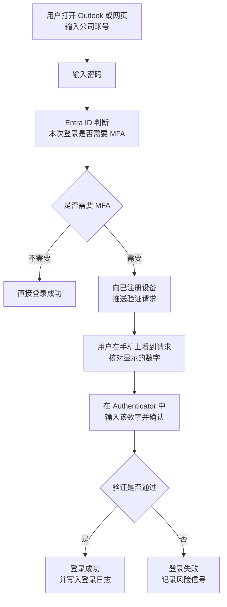
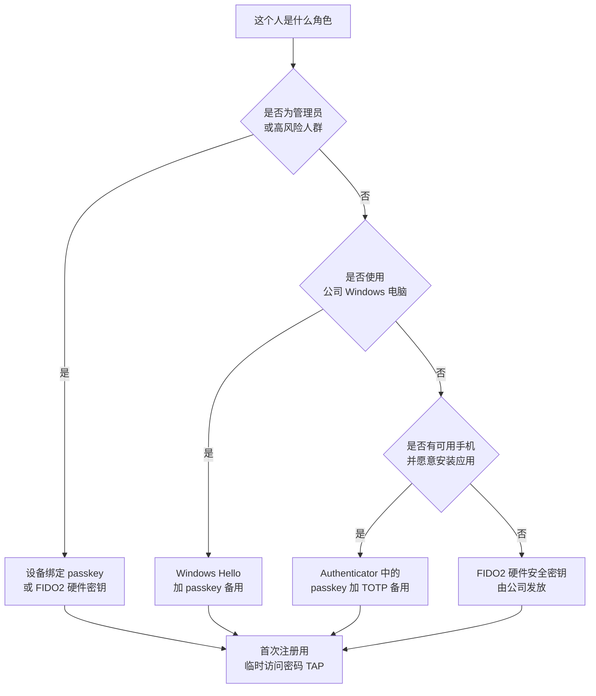

# 第2篇 基础建设 · 第7节 MFA 原理与验证方式

> **所属：** 第2篇 基础建设：租户、身份与 MFA。  
> **本节小节：** 2.71 ～ 2.86。  
> **本节性质：** 概念与选型。本节不改配置，但**结论直接决定后面两节的实施方式**。  
> **本节重要性：** MFA 是 Microsoft 365 项目中性价比最高的安全措施，也是用户感知最强的变化。本节按新手需要展开详细解释。  
> **复核日期：** 2026-08-28。**本节含 2026 年 9 月和 2027 年 2 月即将生效的重大变化，实施前必须重新核对官方公告。**  
> **导航：** [返回第2篇目录](README.md)｜上一节：[本地 AD 与身份同步](06-本地AD与身份同步.md)｜下一节：[MFA 启用方式与条件访问](08-MFA启用方式与条件访问.md)

---

## 2.71 本节目标

完成本节后应当能够回答：

1. MFA 到底是什么，为什么它能拦住绝大多数账号入侵。
2. MFA 能防住什么攻击，**不能**防住什么攻击。
3. 每种验证方式（passkey、Authenticator、短信、硬件密钥……）的安全性、成本和适用人群。
4. 企业应该给管理员、普通员工、一线人员分别选择什么方式。
5. 2026—2027 年 Microsoft 在验证方式上的变化会如何影响企业。

> **必做：** 本节的选型结论要写进项目文档，并作为采购（例如是否购买硬件安全密钥）和培训（用户注册什么方式）的依据。

---

## 2.72 MFA 是什么

**MFA（Multi-Factor Authentication，多重身份验证）**：登录时除了密码，还要再提供**另一种不同类型**的证明。

用一个类比：

| 只有密码 | 加上 MFA |
|---|---|
| 门上只有一把普通锁，钥匙被复制就能进 | 除了钥匙，还要刷一次只有你身上才有的门禁卡 |

关键在“**不同类型**”。两个密码不算 MFA；密码 + 密保问题也不算真正的多因素，因为两者都属于“你知道的信息”，都可能被同一次泄露或钓鱼一并骗走。

Microsoft 的研究数据是：使用 MFA 可以阻止**超过 99%** 的账号入侵类攻击。这也是 Microsoft 近年推行平台级强制 MFA 的原因（见[第2节](02-管理员账号与角色.md) 2.13）。

---

## 2.73 为什么只有密码不够

新手常问：“我们的密码很复杂，还要定期改，为什么不够？”

因为攻击者通常**不需要破解**你的密码：

| 攻击方式 | 说明 | 密码复杂度有用吗 |
|---|---|---|
| 密码喷洒 | 用少量常见密码去试大量账号 | 有一点用 |
| 撞库 | 用其他网站泄露的“邮箱+密码”组合来试 | **没用**（因为密码是对的） |
| 钓鱼 | 伪造登录页面，让用户自己输入 | **没用** |
| 键盘记录 / 恶意软件 | 直接截获输入 | **没用** |
| 内部泄露 / 共享账号 | 密码被同事、离职员工掌握 | **没用** |
| 社工客服 | 骗服务台重置密码 | **没用** |

结论：**密码是“可被复制的秘密”。** 只要它离开用户，就不再安全。MFA 的价值在于增加一个**不易被远程复制**的因素。

---

## 2.74 三类身份验证因素

| 类别 | 含义 | 常见形式 |
|---|---|---|
| **你知道的信息**（Something you know） | 记在脑子里的秘密 | 密码、PIN、密保答案 |
| **你拥有的东西**（Something you have） | 你手上的设备或凭据 | 手机上的 Authenticator、硬件安全密钥、证书 |
| **你本身的特征**（Something you are） | 生物特征 | 指纹、面部识别 |

MFA 的要求是：**至少来自两个不同类别**。

### 2.74.1 一个容易误解的点

Windows Hello 或手机指纹解锁时，指纹**通常不是发送到云端做验证**，而是用于在**本地解锁设备上的凭据**。也就是说，真正提交给 Entra ID 的是设备中受保护的密钥，而生物特征留在设备本地。这一点对说服注重隐私的员工很重要：**公司拿不到你的指纹或人脸数据。**

---

## 2.75 MFA 登录过程逐步说明

以“用 Authenticator 推送通知”为例：

### 2.75.1 关于“号码匹配”

早期的推送通知只需要点“批准”，导致攻击者反复发送请求、用户不小心点了同意（称为 **MFA 疲劳攻击**）。现在 Authenticator 的推送会显示一个数字，用户必须在手机上**输入登录界面显示的数字**才能通过。

这带来一条重要培训要点：

> **必做：** 告诉所有员工——**如果你没有在登录，却收到验证请求，绝不要输入数字，并立即报告 IT。** 这通常意味着你的密码已经泄露。

---

## 2.76 MFA 能防止什么

| 场景 | MFA 是否有效 |
|---|---|
| 密码在其他网站泄露后被撞库 | **有效** |
| 密码被同事或离职员工知道 | **有效** |
| 密码被简单钓鱼页面骗走 | **有效**（攻击者缺少第二因素） |
| 密码喷洒和暴力破解 | **有效** |
| 旧式协议用“账号+密码”直接连邮箱 | 有效（配合阻断旧式身份验证） |

---

## 2.77 MFA 不能防止什么（必须让管理层知道）

这一段非常重要。很多企业上了 MFA 就以为账号安全问题解决了，然后在真实攻击中被击穿。

| 攻击 | 说明 | 为什么 MFA 可能失效 | 应对方向 |
|---|---|---|---|
| **中间人钓鱼（AiTM）** | 攻击者做一个实时代理站点，用户在假页面输入密码和验证码，攻击者同步转发到真站点，并**窃取登录后的会话令牌** | 用户确实完成了 MFA，但令牌被偷 | 使用**防钓鱼**方式（passkey / FIDO2 / Windows Hello / 证书）；配合条件访问与会话控制 |
| **MFA 疲劳 / 轰炸** | 反复推送验证请求直到用户点同意 | 用户误批准 | 号码匹配 + 用户培训 + 风险策略 |
| **SIM 交换 / 短信劫持** | 攻击者转移手机号或截获短信 | 短信不绑定设备密钥 | **不使用短信作为主要方式** |
| **令牌窃取（恶意软件）** | 从被感染设备窃取已登录的令牌 | 已通过验证的会话被复用 | 设备管理与合规、缩短会话、检测异常登录 |
| **同意钓鱼（OAuth 授权滥用）** | 骗用户给恶意应用授权 | 不经过密码与 MFA | 控制第三方应用授权（第5篇） |
| **服务台社工** | 骗管理员帮忙重置验证方式 | 流程漏洞 | 身份核验流程 + 记录 + 回拨确认 |
| **绕过路径** | 遗留协议、例外账号、未覆盖的应用 | 根本没走 MFA | 覆盖率检查、阻断旧式认证、清理例外 |

> **高风险：** 目前针对企业最有效的账号攻击就是**中间人钓鱼**。它可以绕过短信、验证码甚至推送批准。**唯一系统性的解法是采用防钓鱼的验证方式**，这也是 Microsoft 全面推动 passkey 的原因。

---

## 2.78 MFA、两步验证与无密码登录的区别

| 概念 | 含义 | 举例 |
|---|---|---|
| 两步验证 | 分两步完成登录，两步可能属于同一类别 | 密码 + 密保问题（较弱） |
| **MFA** | 至少两个**不同类别**的因素 | 密码 + Authenticator |
| **无密码登录** | **不使用密码**，用设备中的密钥 + 本地生物识别/PIN | passkey、Windows Hello |
| 防钓鱼 MFA | 凭据与站点绑定，无法在假站点上使用 | FIDO2 / passkey / 证书 |

注意：**无密码通常比“密码 + 短信”更安全，也更方便。** 新手容易以为“少一步就是不安全”，实际恰好相反：passkey 使用设备本地的私钥并与真实站点绑定，假网站拿不到可用的凭据。

---

## 2.79 【重大变化】passkey 成为默认，短信与语音将退役

这是 2026 年最需要注意的变化，直接影响企业的 MFA 方案设计。

Microsoft 的公开计划如下：

| 时间 | 变化 | 企业应对 |
|---|---|---|
| **2026 年 9 月 1 日** | passkey 成为默认登录体验；**已启用短信或语音的用户会被自动启用 passkey**，并在 MFA 登录时被引导（nudge）注册 passkey | 提前通知用户会看到新的注册提示；准备 passkey 部署与培训材料 |
| **2027 年 2 月 1 日** | **Microsoft 提供的短信与语音验证在 Entra ID 中完全退役** | 在此日期前把所有用户迁移到防钓鱼方式 |
| **2027 年 2 月 1 日之后** | 仅有短信或语音可用的用户，登录时将被**强制要求注册 passkey**，该提示是**阻断式的**，且**没有豁免选项，对所有租户生效** | 若仍必须使用短信或语音，需通过 Microsoft Security Store 配置**客户自管的电信提供商** |

官方说明见 [passkey 默认化与 Microsoft 提供的短信/语音验证退役](https://learn.microsoft.com/en-us/entra/identity/authentication/concept-sms-voice-retirement)。

### 2.79.1 对本项目的直接影响

- **不要把短信验证写进企业的长期 MFA 方案**，也不要在培训材料里把它作为推荐方式。
- 新员工注册时应直接引导到 **Authenticator 中的 passkey、Windows Hello 或硬件安全密钥**。
- 如果企业存在“员工没有智能手机”“车间不允许带手机”等场景，必须在本节就设计替代方案（见 2.84），不能留到 2027 年再处理。
- 实施前应用官方脚本或报表**先统计当前有多少用户仍启用短信或语音**，作为迁移工作量的依据。

> **必做：** 本条时间线时效性很强。正式实施时请重新打开上面的官方链接确认最新日期与行为，不要只依据本文档。

---

## 2.80 验证方式详解（一）：passkey（FIDO2）

**这是目前 Microsoft 优先推荐的方式，也是本方案的首选。**

### 2.80.1 原理

passkey 基于 FIDO 标准，使用**公钥密码学**：

- 设备中保存**私钥**（永不离开设备，通常受硬件保护）。
- 云端保存**公钥**。
- 登录时由设备用私钥对挑战值签名，云端用公钥验证。
- 凭据与**站点来源绑定**（origin-bound），因此**假冒网站无法使用**。

这意味着：没有可被钓走的“密码”或“验证码”，天然抵抗钓鱼、重放和 SIM 交换。

### 2.80.2 两种形态

| 类型 | 说明 | 适合 |
|---|---|---|
| **同步型 passkey** | 保存在平台凭据管理器（如 iCloud 钥匙串、Google 密码管理器）并在用户多台设备间同步 | 已使用平台凭据管理器的用户，换设备方便 |
| **设备绑定 passkey** | 仅存在于特定设备，例如 Microsoft Authenticator 中的 passkey、Windows 上的 Entra passkey、FIDO2 硬件安全密钥 | 需要更强控制的场景、共享设备、管理员 |

### 2.80.3 优缺点

| 优点 | 缺点 / 注意 |
|---|---|
| 防钓鱼，能抵抗 AiTM 攻击 | 需要支持的设备、浏览器和操作系统版本 |
| 登录快（本地生物识别或 PIN） | 用户首次注册需要引导 |
| 不需要记密码 | 硬件安全密钥有采购成本 |
| 在 Entra ID 各版本中均可使用（含免费层） | 同步型 passkey 涉及个人凭据管理器，需评估企业策略 |

> **推荐：** 管理员账号和紧急访问账号**优先使用设备绑定 passkey 或硬件安全密钥**。

---

## 2.81 验证方式详解（二）：Microsoft Authenticator

Authenticator 是最常用的手机端方式，包含多种能力：

| 能力 | 说明 | 安全性 |
|---|---|---|
| **Authenticator 中的 passkey** | 在手机上生成设备绑定 passkey | **最高（防钓鱼）** |
| 无密码手机登录 | 用手机批准并解锁，不输密码 | 高 |
| **推送通知 + 号码匹配** | 输入登录界面显示的数字 | 中高（可抵抗 MFA 疲劳，但**不防中间人钓鱼**） |
| 验证码（TOTP，30 秒一换） | 手机上读取 6 位数字并输入 | 中（**不防中间人钓鱼**） |

### 2.81.1 部署注意事项

- 应用需要网络（推送）或至少一次时间同步（TOTP）。
- 换手机需要重新注册；应提前告知用户流程（见[第9节](09-MFA实施推广与用户支持.md)）。
- 建议同时注册**两种**方式，避免单点故障（例如 passkey + TOTP）。
- 企业不需要、也不应要求获取员工手机的其他数据；培训时应说明清楚以降低抵触。

---

## 2.82 验证方式详解（三）：Windows Hello for Business

适用于公司 Windows 电脑：用户用 **PIN 或生物识别**解锁本机凭据完成登录。

| 优点 | 注意 |
|---|---|
| 属于防钓鱼方式，体验顺畅 | 需要设备满足条件并纳入管理 |
| 与设备绑定，凭据不可远程复制 | 共享电脑场景需要单独设计 |
| 员工每天开机即用，接受度高 | 依赖设备状态，设备损坏需备用方式 |

> **推荐：** 有公司统一 Windows 终端的企业，Windows Hello for Business + passkey 是**成本最低的防钓鱼组合**，因为不需要额外硬件。

---

## 2.83 验证方式详解（四）：其余方式

| 方式 | 说明 | 建议 |
|---|---|---|
| **FIDO2 硬件安全密钥** | USB / NFC 实体密钥 | **强烈推荐**用于管理员、紧急访问账号、无手机场景 |
| **基于证书的身份验证** | 使用企业 PKI 颁发的证书 | 已有成熟 PKI 的企业可用于管理员或特殊终端 |
| **硬件 OATH 令牌** | 显示动态数字的小硬件 | 无手机场景的备选；不防钓鱼 |
| **短信 / 语音电话** | 收短信或接电话获取验证码 | **不推荐**，且面临退役（见 2.79） |
| **临时访问密码（TAP）** | 管理员发放的**限时**一次性或多次可用密码 | 用于**首次注册**和**丢失设备后的恢复**，不作为日常方式 |

### 2.83.1 临时访问密码（TAP）的价值

TAP 解决一个现实难题：**新员工还没注册任何验证方式，怎么安全地完成第一次注册？**

- 管理员生成一个限时 TAP，通过可靠渠道交给用户（例如当面、或通过 HR 核验身份后）。
- 用户用 TAP 登录，然后注册 passkey 或 Authenticator。
- TAP 过期后自动失效。

也适用于：员工手机丢失、换手机、长期休假返岗后无法验证等场景。

> **必做：** 建立 TAP 的发放流程和**身份核验要求**（例如必须视频确认或主管确认）。否则 TAP 会变成社工攻击的入口。

---

## 2.84 各方式对照与适用人群

| 方式 | 防钓鱼 | 成本 | 用户便利性 | 建议适用人群 |
|---|---|---|---|---|
| FIDO2 硬件安全密钥 | **是** | 中（需采购） | 中 | 管理员、紧急访问账号、无手机岗位 |
| Authenticator 中的 passkey | **是** | 低 | 高 | **绝大多数员工（首选）** |
| Windows Hello for Business | **是** | 低（有公司电脑） | 高 | 使用公司 Windows 电脑的员工 |
| 基于证书的身份验证 | **是** | 中高（需 PKI） | 中 | 管理员、特殊终端 |
| Authenticator 推送 + 号码匹配 | 否 | 低 | 高 | 过渡期方案 |
| Authenticator 验证码（TOTP） | 否 | 低 | 中 | 备用方式、离线场景 |
| 硬件 OATH 令牌 | 否 | 中 | 中 | 无手机且暂不用密钥的岗位 |
| 短信 / 语音 | 否 | 低 | 高 | **不推荐，正在退役** |
| 临时访问密码 | 不适用 | 低 | — | 首次注册与恢复场景 |

### 2.84.1 选型决策图

### 2.84.2 无手机 / 不能带手机场景的方案

这是中国企业非常常见的问题（车间、实验室、门店、保密区域）：

| 场景 | 建议方案 |
|---|---|
| 有公司电脑 | Windows Hello for Business |
| 无手机、无固定电脑 | FIDO2 硬件安全密钥（可挂在工牌上） |
| 不允许带任何电子设备进车间 | 在允许区域完成登录；或使用硬件 OATH 令牌；或评估该岗位是否真的需要云端账号 |
| 只在共享电脑上短时使用 | 硬件安全密钥 + 共享设备策略 |
| 员工不愿在个人手机上装公司应用 | 提供硬件安全密钥作为公司资产发放 |

> **推荐：** 把“公司为特殊岗位提供硬件安全密钥”写进预算。相比一次账号入侵事故的处理成本，密钥非常便宜。

---

## 2.85 身份验证方法策略（管理入口的变化）

Microsoft 已把验证方式的管理统一到 **“身份验证方法策略”（Authentication methods policy）**：

- 在 Entra 管理中心中集中定义：**允许哪些方式、允许哪些用户组使用**。
- 旧的“按用户 MFA 服务设置”里那套验证方式开关属于**遗留配置**，Microsoft 已安排弃用（遗留 MFA 与自助密码重置策略的弃用日期为 2025 年 9 月 30 日），需要迁移到统一的身份验证方法策略。
- 迁移不要求付费版本，Entra ID 免费层也可以进行。

迁移与操作说明见 [如何迁移到身份验证方法策略](https://learn.microsoft.com/en-us/entra/identity/authentication/how-to-authentication-methods-manage)。

### 2.85.1 建议的策略配置思路

| 方式 | 建议状态 |
|---|---|
| passkey（FIDO2） | **启用**，面向全体用户 |
| Microsoft Authenticator | 启用（优先无密码/passkey 体验） |
| Windows Hello for Business | 按设备情况启用 |
| 临时访问密码 | 启用，限定管理员发放 |
| 基于证书的身份验证 | 按需启用（管理员/特殊终端） |
| 硬件 OATH 令牌 | 按需启用（特殊岗位） |
| 短信 / 语音 | **计划停用**；过渡期如需保留，限定到必要人员并登记 |

> **验证点：** 配置完成后，用一个测试账号实际走一遍注册流程，确认用户看到的可选方式与策略一致。

---

## 2.86 本节完成检查表

- [ ] 已理解 MFA 的定义、三类因素，以及“不同类别”的要求。
- [ ] 已向管理层说明 MFA **不能**防住中间人钓鱼、令牌窃取和同意钓鱼。
- [ ] 已确定企业的**主推验证方式**，且为防钓鱼方式（passkey / Windows Hello / FIDO2 / 证书）。
- [ ] 已确定管理员和紧急访问账号使用设备绑定 passkey 或硬件安全密钥。
- [ ] 已了解 2026-09-01 起 passkey 成为默认体验、已启用短信/语音的用户会被自动启用并引导注册。
- [ ] 已了解 2027-02-01 起 Microsoft 提供的短信与语音将退役，之后仅有该方式的用户会被强制阻断式注册 passkey。
- [ ] 已统计当前仍启用短信或语音的用户数量，并制定迁移计划。
- [ ] 短信验证**未**被写入企业长期方案和培训材料。
- [ ] 已为“无手机 / 不能带手机”岗位设计替代方案，并纳入预算。
- [ ] 已确定每位用户至少注册**两种**验证方式的要求。
- [ ] 已确定临时访问密码的发放流程与身份核验要求。
- [ ] 已确认使用统一的“身份验证方法策略”管理验证方式，遗留 MFA 服务设置已有迁移结论。
- [ ] 各类人群（管理员、普通员工、一线员工、外部来宾）的方式选型已书面记录。
- [ ] 已在测试账号上验证用户实际可选的注册方式与策略一致。

> **进入下一节的条件：** 验证方式选型已确定并写入文档。下一节解决“**用什么机制强制要求 MFA**”——安全默认值、按用户 MFA 和条件访问的区别与选择，以及如何避免把所有管理员锁在门外。
