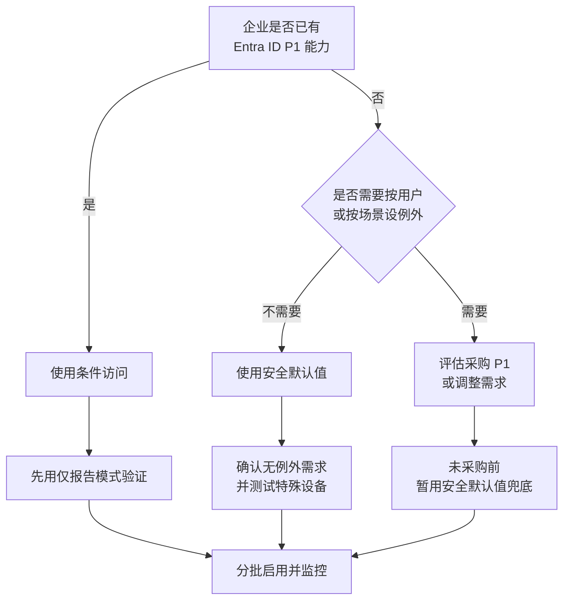
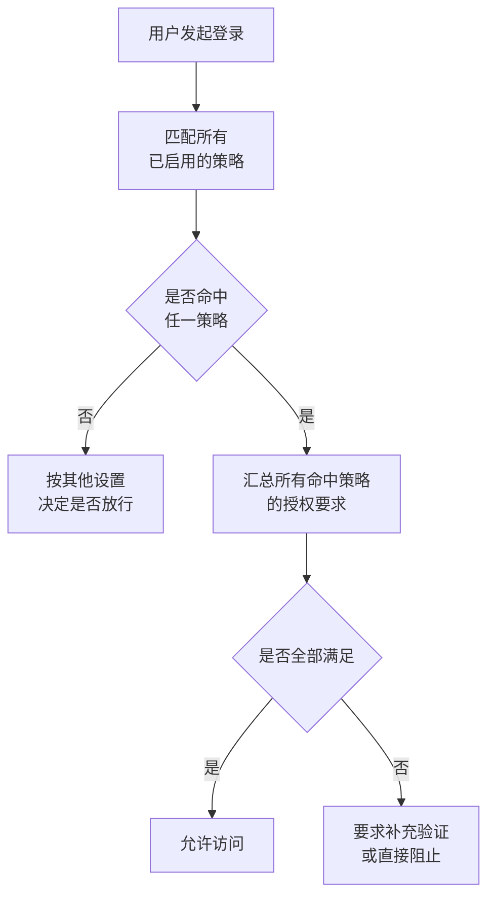
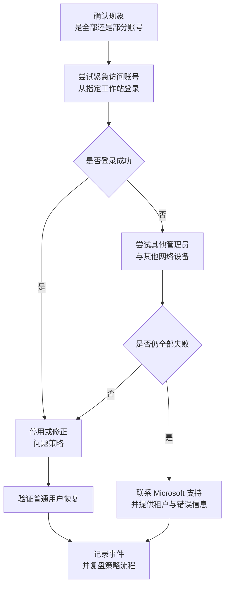

# 第2篇 基础建设 · 第8节 MFA 启用方式与条件访问

> **所属：** 第2篇 基础建设：租户、身份与 MFA。  
> **本节小节：** 2.87 ～ 2.99。  
> **本节性质：** **最容易造成“全员无法登录”的一节。** 所有策略必须先用仅报告模式和小范围验证。  
> **前置条件：** 已完成[第7节](07-MFA原理与验证方式.md)验证方式选型；紧急访问账号已可用并演练通过。  
> **导航：** [返回第2篇目录](README.md)｜上一节：[MFA 原理与验证方式](07-MFA原理与验证方式.md)｜下一节：[MFA 实施推广与用户支持](09-MFA实施推广与用户支持.md)

---

## 2.87 本节目标

第7节回答“用什么验证”，本节回答“**怎么强制要求验证**”。

完成本节后应当达到：

1. 清楚三种启用方式（安全默认值、按用户 MFA、条件访问）的区别、许可要求和适用企业。
2. 选定本企业的方式并说明理由。
3. 能设计出最小可用的策略集合，并知道每条策略的风险点。
4. **确保任何情况下都不会把所有管理员锁在门外。**

> **高风险：** 本节的每一条策略都可能影响全体用户登录。请严格遵守顺序：**仅报告 → 小范围 → 分批 → 全量**，并在每一步保留回退能力。

---

## 2.88 三种启用方式总览

| 方式 | 通俗理解 | 许可要求 | 灵活性 | 现状定位 |
|---|---|---|---|---|
| **安全默认值** | 一个总开关，打开即获得一套基础保护 | 不需要额外付费版本 | **很低**（只能整体开或关，不能按用户例外） | 适合小型、需求简单的企业 |
| **按用户 MFA** | 逐个用户设置“启用/强制” | 无需付费版本 | 低（难以管理、易遗漏） | **遗留方式，Microsoft 建议迁移** |
| **条件访问** | 按“谁、访问什么、在什么条件下、要求什么”写规则 | 需要相应的 **Entra ID P1** 能力 | **高** | 推荐的正式做法 |

### 2.88.1 选择流程

> **必做：** 不要出现“**既关掉了安全默认值，又还没配好条件访问**”的空档期。这段时间租户几乎没有登录保护，是真实事故高发期。切换必须在同一个变更窗口内完成并验证。

---

## 2.89 安全默认值详解

安全默认值是 Microsoft 提供的一套预配置基础保护，包含的控制通常有：

- 要求**所有用户注册** MFA。
- 要求**管理员执行** MFA。
- 在必要时要求用户执行 MFA。
- **阻止旧式身份验证协议**。
- **阻止设备代码流（device code flow）**。
- 保护特权操作（例如访问管理门户）。

官方说明见 [配置 Microsoft Entra ID 安全默认值](https://learn.microsoft.com/en-us/entra/fundamentals/security-defaults)。

### 2.89.1 必须知道的行为细节

| 细节 | 说明 |
|---|---|
| 新租户默认启用 | 2019 年 10 月 22 日之后创建的租户可能已默认启用；新租户创建时会启用 |
| **24 小时配置宽限期** | 新租户启用后有约 24 小时的宽限，便于管理员先完成初始配置。**这不是长期的用户 MFA 注册宽限** |
| 自动启用通知 | 满足特定条件（无条件访问策略、无付费版本、未活跃使用旧式认证客户端）的租户会被定期通知自动启用 |
| **不能按用户设例外** | 只有整体启用或停用两种状态 |
| 与条件访问互斥 | 使用条件访问时通常不再使用安全默认值 |
| 启用后建议撤销现有令牌 | 否则已登录用户可能暂时不会被要求注册 |
| 配置权限 | 至少需要条件访问管理员级别的角色 |

### 2.89.2 适合与不适合

| 适合 | 不适合 |
|---|---|
| 人数少、场景简单 | 需要为打印机、扫描仪、老旧业务系统设例外 |
| 没有购买 P1 的计划 | 需要按部门分批推行 MFA |
| 希望立刻获得基础保护 | 需要按地点、设备状态、风险级别控制 |
| 作为条件访问就绪前的**临时兜底** | 需要精细的会话控制 |

> **高风险：** 阻止设备代码流会影响依赖该登录方式的场景（例如电视终端、无键盘设备、部分命令行工具、会议室设备）。启用前必须完成设备与应用调查，否则可能出现“某类设备突然登不上”的情况。

---

## 2.90 按用户 MFA（遗留方式）

这是最早的做法：在用户列表里把每个人的 MFA 状态设为“已启用”或“已强制”。

| 问题 | 说明 |
|---|---|
| 管理成本高 | 人员变动需逐个维护，容易遗漏 |
| 无条件判断 | 不区分内外网、设备、风险，用户可能被频繁提示 |
| 与条件访问混用易冲突 | 排查困难 |
| 属于遗留配置 | Microsoft 已提供“从按用户 MFA 切换到条件访问 MFA”的建议 |
| 相关的遗留验证方式设置已弃用 | 遗留 MFA 与自助密码重置策略的弃用日期为 2025 年 9 月 30 日，需迁移到统一的身份验证方法策略（见第7节 2.85） |

> **推荐：** 新项目**不要**采用按用户 MFA。如果现状已在使用，应规划迁移：先确保条件访问策略覆盖同等范围并验证有效，再把按用户状态改回“已禁用”，避免出现重复要求或保护中断。

---

## 2.91 条件访问的基本结构

条件访问策略可以理解为一句话：

> **“当【某些用户】访问【某些应用】、且【满足某些条件】时，要求【某些控制】。”**

| 组成 | 内容 | 举例 |
|---|---|---|
| **分配 · 用户** | 包含/排除的用户和组 | 包含全体用户，排除紧急访问账号 |
| **分配 · 目标资源** | 云应用或操作 | 所有云应用、或仅管理门户 |
| **条件** | 平台、位置、客户端应用、设备状态、风险等 | 从企业网络之外访问 |
| **访问控制 · 授权** | 阻止访问，或要求 MFA、要求合规设备、要求认证强度等 | 要求 MFA |
| **访问控制 · 会话** | 会话频率、持久化浏览器、应用强制限制等 | 不允许持久登录 |

### 2.91.1 评估逻辑

要点：**多条策略的要求会叠加**。策略之间不是“取最宽松”，而是**都必须满足**；任何一条“阻止访问”的策略优先生效。这正是配置错误容易导致全员无法登录的原因。

---

## 2.92 认证强度：要求“防钓鱼”的 MFA

条件访问不仅能要求“做 MFA”，还能要求**用特定强度的方式**完成 MFA。

| 强度概念 | 含义 | 建议用于 |
|---|---|---|
| 要求 MFA | 任意允许的 MFA 方式即可 | 普通用户过渡期 |
| 要求**防钓鱼** MFA | 只接受 passkey / FIDO2 / 证书 / Windows Hello 等 | **管理员、财务、高管等高风险人群** |

> **推荐：** 结合第7节的结论，给管理员单独一条“要求防钓鱼 MFA”的策略。这是抵御中间人钓鱼最直接的手段，也是很多企业上了 MFA 仍被攻破后补上的第一课。

---

## 2.93 为什么必须先用“仅报告”模式

仅报告（Report-only）模式会**评估策略但不真正执行**，并把“如果启用会发生什么”记录到登录日志。

| 好处 | 说明 |
|---|---|
| 发现意外影响 | 例如发现某个服务账号或设备会被挡住 |
| 估算影响范围 | 有多少用户、多少登录会受影响 |
| 安全试错 | 配置写错也不会造成中断 |
| 便于沟通 | 用真实数据向管理层说明影响 |

### 2.93.1 使用方法

1. 新建策略时选择仅报告。
2. 保持 3～7 天（覆盖工作日和周末、含月初结账等高峰）。
3. 在登录日志中筛查“会被此策略要求/阻止”的记录。
4. 逐项处理异常（例如给设备找替代认证方式）。
5. 确认无意外影响后，切换到“开启”。

> **必做：** 紧急访问账号在仅报告模式下**不需要**排除；但在正式启用前，**必须**确认已从阻断型策略中排除。

---

## 2.94 建议的最小策略集合

不要一开始就写十几条策略。建议从下面四条起步，每条单独验证：

| 编号 | 策略 | 目标 | 风险点 |
|---|---|---|---|
| CA1 | **管理员要求 MFA（建议防钓鱼强度）** | 保护高权限账号 | 必须排除紧急访问账号 |
| CA2 | **所有用户要求 MFA** | 基础保护 | 需处理服务账号、设备、旧客户端 |
| CA3 | **阻止旧式身份验证** | 关闭绕过 MFA 的通道 | 必须先完成旧客户端与设备盘点 |
| CA4 | **保护管理门户访问** | 限制对管理界面的交互式访问 | 与平台强制 MFA 要求配合 |

### 2.94.1 CA1：管理员 MFA

- 分配：包含具有管理角色的用户或专门的管理员组。
- 排除：紧急访问账号。
- 控制：要求 MFA；条件允许时要求防钓鱼强度。
- 注意：Microsoft 已有平台级强制 MFA 要求（见第2节 2.13），企业策略是**在此之上**的统一管理，不能因为“平台已强制”就不配。

### 2.94.2 CA2：全体用户 MFA

- 分配：包含全体用户。
- 排除：紧急访问账号；必要时**临时**排除已登记的服务账号（需有到期日期和整改计划）。
- 控制：要求 MFA。
- 上线方式：**分批**（试点组 → 部门 → 全员），而不是一次对全公司启用。

### 2.94.3 CA3：阻止旧式身份验证

- 目的：旧式协议无法执行 MFA，是最常见的绕过路径。
- 前提：必须先完成第1篇的客户端与设备盘点，并处理打印机、扫描仪、业务系统的发信方式（详见第3篇和第5篇）。
- 说明：Exchange Online 已在平台层面禁用列明协议的基本身份验证，SMTP AUTH 另有时间线；条件访问策略用于覆盖更广的旧式客户端场景。

### 2.94.4 CA4：保护管理门户

- 目的：对管理门户的交互式访问施加更强要求。
- 注意：不要与紧急访问账号的排除设置冲突。

---

## 2.95 按国家、设备与风险控制（进阶）

这些能力有价值，但**不建议在项目初期一次全上**。

| 控制 | 用途 | 风险 |
|---|---|---|
| 按位置（国家/IP） | 阻止业务无关地区的登录 | 出差、VPN、云服务出口 IP 会误伤 |
| 要求合规设备 | 只允许受管设备访问 | 需要 Intune 就绪，否则大面积阻断 |
| 按登录风险 / 用户风险 | 对可疑登录加强要求 | 需要相应许可能力 |
| 会话控制 | 限制持久登录、限制下载 | 影响用户体验，需沟通 |

> **推荐：** 项目期先落实 CA1～CA4，等设备管理（第5篇）和运维流程（第6篇）稳定后，再逐步引入这些进阶控制。

---

## 2.96 排除紧急访问账号（关键动作）

| 要求 | 说明 |
|---|---|
| 排除对象 | 全部**阻断型**或可能阻断登录的策略 |
| 不需要排除 | 仅报告模式的策略 |
| 排除方式 | 建议用专门的排除组，而不是逐条策略手工加账号 |
| 验证方式 | 每次新增或修改策略后，**实际用紧急账号登录一次** |
| 记录 | 在策略文档中注明排除对象与原因 |

> **高风险：** 最常见的锁死事故是“新加了一条策略，忘了排除紧急账号”。建议把“紧急账号登录验证”写成每次策略变更的**强制收尾步骤**。

---

## 2.97 防止把所有管理员锁在门外

请把下面这份清单当作硬性纪律：

- [ ] 至少两个紧急访问账号，且**已在本周期内演练成功**。
- [ ] 所有新策略先用**仅报告**模式运行足够时间。
- [ ] 使用“如果情况如何（What If）”类工具预演典型用户的命中结果。
- [ ] 策略先应用到**试点组**，不要直接对全体用户。
- [ ] 阻断型策略必须排除紧急访问账号（用排除组统一管理）。
- [ ] **不要**在同一个变更中同时修改多条高影响策略。
- [ ] 变更安排在**有人值守**的时间窗口，不要下班前或假期前操作。
- [ ] 变更前记录当前策略状态（导出或截图），便于回退。
- [ ] 变更后立即验证：普通用户能登录、管理员能登录、紧急账号能登录。
- [ ] 保留一台已登录的管理会话，直到验证完成。

---

## 2.98 如果真的被锁在门外

按以下顺序处理：

> **必做：** 事后复盘要回答两个问题：**为什么没有在仅报告阶段发现？** **为什么排除项没生效？** 并把改进写入变更流程（第6篇）。

---

## 2.99 本节完成检查表

- [ ] 已选定启用方式（安全默认值或条件访问），并书面说明理由与许可依据。
- [ ] 若使用条件访问，已确认具备相应的 Entra ID P1 能力。
- [ ] 若从安全默认值切换到条件访问，切换与验证在**同一变更窗口**内完成，无保护空档。
- [ ] 已了解安全默认值的行为细节（整体开关、24 小时配置宽限、阻止旧式认证与设备代码流）。
- [ ] 若启用安全默认值，已完成依赖设备代码流的设备与应用调查。
- [ ] 未采用按用户 MFA；如现状存在，已制定迁移与关闭计划。
- [ ] 遗留 MFA 服务设置已迁移到统一的身份验证方法策略。
- [ ] 已建立最小策略集合 CA1～CA4，并逐条记录目的、范围与风险。
- [ ] 管理员策略已要求 MFA，且在条件允许时要求**防钓鱼强度**。
- [ ] 所有新策略均先经过仅报告模式，并分析过登录日志影响。
- [ ] 已使用“What If”类工具预演典型用户结果。
- [ ] 已建立**紧急账号排除组**，并应用到所有阻断型策略。
- [ ] 每次策略变更后都实际用紧急账号登录验证。
- [ ] 服务账号、打印机、旧客户端的临时排除项均有登记、到期日期和整改计划。
- [ ] 变更窗口安排在有人值守时间，且策略变更前已导出/截图当前状态。
- [ ] 已编写“被锁在门外”的应急处理步骤，并明确决策人与联系 Microsoft 支持的渠道。

> **进入下一节的条件：** 策略已在试点组验证通过、紧急账号排除已验证。下一节讲**如何把 MFA 推广到全体员工**，包括用户注册引导、换手机与丢手机处理、以及打印机和业务系统这类“非人账号”的处理方式。
