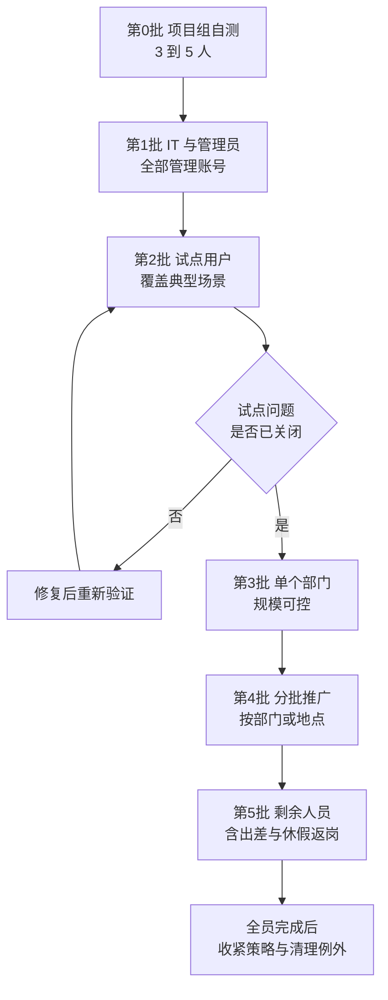
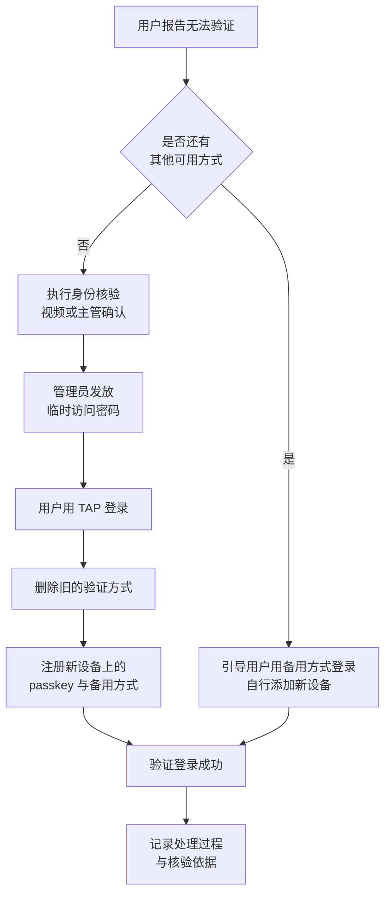

# 第2篇 基础建设 · 第9节 MFA 实施推广与用户支持

> **所属：** 第2篇 基础建设：租户、身份与 MFA。  
> **本节小节：** 2.100 ～ 2.112。  
> **本节性质：** 面向全体员工的变更。技术难度不高，但**用户沟通和服务台准备决定成败**。  
> **前置条件：** 已完成[第8节](08-MFA启用方式与条件访问.md)，策略已在试点组验证通过，紧急账号排除已验证。  
> **导航：** [返回第2篇目录](README.md)｜上一节：[MFA 启用方式与条件访问](08-MFA启用方式与条件访问.md)｜下一节：[MFA 排查、验收与巡检](10-MFA排查验收与巡检.md)

---

## 2.100 本节目标

MFA 上线失败的原因通常不是技术问题，而是：

- 员工事先不知道，登录被拦住后集中打电话，服务台瘫痪。
- 没人告诉员工“没有公司手机怎么办”。
- 打印机、ERP 通知邮件突然发不出去。
- 员工换手机后无人能帮他恢复。

完成本节后应当达到：

1. 有明确的推广批次、时间表和通知计划。
2. 有面向员工的注册指引和面向服务台的处理脚本。
3. 覆盖“无手机、换手机、丢手机、出差、休假返岗”等全部现实场景。
4. 非人账号（打印机、扫描仪、业务系统、服务账号）已妥善处理。

---

## 2.101 上线前的用户与设备调查

推广前必须先弄清现状，否则一定会出现意外。

| 调查项 | 为什么重要 | 状态 |
|---|---|---|
| 有多少员工有智能手机、是否愿意安装公司应用 | 决定是否需要采购硬件安全密钥 | 待填写 |
| 哪些岗位不能携带手机（车间、实验室、保密区） | 需要替代方案 | 待填写 |
| 有多少员工使用公司 Windows 电脑 | 可用 Windows Hello，成本最低 | 待填写 |
| 是否有共享电脑、多人轮班使用 | 需专门设计 | 待填写 |
| 是否有 Mac、Linux 或特殊终端 | 影响可用方式 | 待填写 |
| 现有 Office / Outlook 版本 | 旧版本可能不支持现代身份验证 | 待填写 |
| 手机邮件客户端类型 | 部分第三方客户端行为不同 | 待填写 |
| 会议室设备、电视终端、扫描枪等 | 可能依赖设备代码流或旧式认证 | 待填写 |
| 打印机、扫描仪、ERP、OA、监控的发信方式 | **最容易被忽略，必须单独处理** | 待填写 |
| 当前仍启用短信或语音验证的用户数 | 对应第7节 2.79 的迁移工作量 | 待填写 |
| 出差、外派、长期休假人员 | 注册与支持时差安排 | 待填写 |

> **必做：** 这份调查的结论要能回答一个问题：“**推广当天，有多少人可能无法自行完成注册？**”这个数字决定服务台需要多少人值守。

---

## 2.102 推广批次与时间表

### 2.102.1 批次设计原则

- **管理员必须最先完成**，否则出问题时管理员自己也登不进去。
- 试点用户要覆盖：普通办公、财务、管理层及助理、移动办公、共享电脑、Mac、无手机岗位、外部协作。
- 每批规模不超过服务台**当天可支持的能力**。
- 关键部门（如财务月结期间）避开业务高峰。
- 每批之间留出至少 1～2 个工作日观察。

### 2.102.2 每批的标准动作

| 时间 | 动作 |
|---|---|
| T-7 天 | 发出第一次通知（说明是什么、为什么、什么时候、要做什么） |
| T-3 天 | 发出第二次通知 + 图文指引 + 服务台联系方式 |
| T-1 天 | 提醒；确认服务台值班和管理员在岗 |
| T 日 | 启用策略；服务台加强值守；实时监控注册率和失败登录 |
| T+1 天 | 统计未注册人员并逐一联系 |
| T+3 天 | 收尾，处理剩余个案，记录问题 |

---

## 2.103 用户通知要点（可作为模板）

通知里必须包含五件事，缺一件就会产生大量咨询：

1. **要做什么**：在某日之前完成一次注册，大约 3 分钟。
2. **为什么**：保护公司邮箱和文件，防止密码泄露导致账号被盗（可举一句真实风险，不必渲染）。
3. **怎么做**：图文步骤 + 一句话总结（“扫码、下载 Authenticator、按提示完成”）。
4. **没有手机怎么办**：明确联系谁、能提供什么替代方案。
5. **出问题找谁**：服务台电话/群、值班时间。

### 2.103.1 建议额外说明的两句话

- **“公司不会看到你手机上的其他内容。”** 这能显著降低个人手机的抵触情绪。
- **“如果你没有在登录却收到验证请求，请不要批准，并立即告知 IT。”** 这是防 MFA 疲劳攻击的关键培训点。

---

## 2.104 用户注册流程（passkey / Authenticator）

以在 Microsoft Authenticator 中注册为例，用户侧的典型步骤：

1. 在手机应用商店安装 **Microsoft Authenticator**（注意辨别发布者，避免山寨应用）。
2. 在电脑浏览器打开公司账号的安全信息管理页面并登录。
3. 选择添加登录方式。
4. 按提示选择 **passkey**（优先）或“Authenticator 应用”。
5. 手机上扫描屏幕出现的二维码。
6. 按提示完成一次验证（可能需要输入屏幕显示的数字，或用指纹/面容确认）。
7. 建议**再添加一种备用方式**（例如 Authenticator 验证码）。
8. 完成后退出并重新登录一次，确认流程正常。

### 2.104.1 强烈建议的两条规则

> **必做：**
> 1. **每人至少注册两种验证方式。** 只注册一种，手机一坏就必须找管理员，服务台压力会集中爆发。
> 2. **注册后立刻做一次真实登录测试。** 不要等第二天上班才发现注册没成功。

### 2.104.2 首次注册的“鸡生蛋”问题

新员工还没有任何验证方式，如何安全完成第一次注册？三种做法：

| 做法 | 说明 | 适用 |
|---|---|---|
| **临时访问密码（TAP）** | 管理员发放限时密码，用户用它登录后注册 | **推荐**，尤其远程入职 |
| 现场注册 | 入职当天在 IT 现场完成 | 集中入职、总部办公 |
| 主管代核验 + 电话引导 | 由主管确认身份后远程协助 | 分支机构 |

> **高风险：** 无论哪种方式，**发放凭据前必须核验身份**（当面、视频，或由主管书面确认）。攻击者最喜欢的手法就是冒充新员工或“换了手机的同事”骗取注册权限。

---

## 2.105 没有公司手机 / 不愿用个人手机

这是推广中最常见的阻力，必须提前准备好答复，而不是临场争论。

| 情况 | 建议方案 |
|---|---|
| 有公司 Windows 电脑 | **Windows Hello for Business**（PIN 或指纹/面容），无需手机 |
| 无手机、有固定工位 | **FIDO2 硬件安全密钥**（USB），可与工牌一起管理 |
| 不允许带电子设备进入工作区 | 在允许区域完成登录；或使用硬件安全密钥；或评估该岗位是否需要云账号 |
| 共享电脑、多人轮班 | 每人一枚硬件安全密钥 + 共享设备策略 |
| 员工明确拒绝在个人手机安装应用 | 由公司**提供硬件安全密钥作为公司资产**，走领用登记 |
| 短期外包或临时人员 | 评估使用来宾身份，或限定访问范围 |

> **推荐：** 把“为特殊岗位采购硬件安全密钥”写进项目预算，并准备 5%～10% 的备用量。这类争议若靠“强制要求员工用私人手机”解决，往往会升级为劳资问题。

---

## 2.106 换手机、丢手机与设备损坏

这是上线后**长期最高频**的支持请求，必须形成标准流程。

### 2.106.1 换手机（有计划）

告诉用户**在换手机之前**先做一件事：确认电脑上仍能登录、或已有第二种方式。然后：

1. 在新手机上安装 Authenticator。
2. 用现有方式登录安全信息页面。
3. 添加新设备上的 passkey。
4. **删除旧手机上的方式**。
5. 测试登录。

### 2.106.2 丢手机（紧急）

| 步骤 | 动作 |
|---|---|
| 1 | **立即**删除该用户已注册的相关验证方式（防止拾得者利用） |
| 2 | 评估是否需要重置密码并撤销现有会话 |
| 3 | 核验身份后发放 TAP |
| 4 | 协助注册新方式 |
| 5 | 记录事件；若怀疑账号已被使用，转入安全事件流程（第6篇） |

> **必做：** 丢手机场景中，“先恢复用户可用性”和“先确认不是社工攻击”会有冲突。请事先约定**统一的核验标准**（例如必须视频通话确认，或必须由直属主管在工单中确认），不要让服务台临场判断。

---

## 2.107 清除旧验证方式并要求重新注册

以下情况应清除用户已注册的方式并要求重新注册：

- 手机丢失或被盗。
- 怀疑账号被入侵。
- 员工从短信/语音迁移到 passkey（配合第7节 2.79 的退役计划）。
- 员工离职后返聘、或账号长期停用后恢复。
- 用户注册了错误的设备（例如注册在旧同事手机上）。

操作要点：

- 清除操作通常需要相应的身份验证管理角色；涉及管理员账号时需要更高权限（见第2节 2.17）。
- 清除后用户在下次登录时会被要求重新注册，因此**要事先通知用户**，避免恐慌。
- 清除动作必须留下记录：谁清除的、为什么、核验依据。

---

## 2.108 启用 MFA 后用户端的变化

提前告知这些变化，能减少大量“是不是坏了”的咨询。

| 场景 | 变化 |
|---|---|
| 浏览器访问 Outlook / Teams / OneDrive | 登录时会多一次验证；可选择在受信任设备上保持登录（取决于策略） |
| 桌面版 Outlook | 首次会弹出现代登录窗口，完成验证后一般不再频繁提示 |
| Teams 桌面/手机端 | 首次登录需验证 |
| 手机邮件客户端 | **建议使用 Outlook 移动版**；部分系统自带客户端可能需要重新添加账号 |
| 密码更改后 | 各设备可能需要重新登录 |
| 出差/换网络 | 可能触发额外验证（取决于策略） |
| 共享电脑 | 每次登录都需验证，且应避免保持登录状态 |

### 2.108.1 旧版 Office 与旧式客户端

- 不支持现代身份验证的客户端在启用 MFA 后可能**无法登录**。
- Exchange Online 已在平台层面禁用列明协议的基本身份验证，因此依赖旧协议的客户端本就无法工作。
- 处理顺序：先盘点（第1篇 1.15）→ 升级到受支持版本 → 无法升级的走替代方案。

> **验证点：** 试点阶段必须包含一台**装有企业实际使用版本 Office 的电脑**，而不是只用最新版本测试。

---

## 2.109 打印机、扫描仪与业务系统（非人账号）

这是 MFA 项目中最容易“炸”的一块：这些设备不会做 MFA，如果只用“账号+密码”发信，启用策略后就会失败。

### 2.109.1 登记表

| 设备/系统 | 当前发信方式 | 使用的账号 | 目标方案 | 负责人 | 状态 |
|---|---|---|---|---|---|
| 一楼复印机 | SMTP + 账号密码 | `scanner@contoso.com` | 待定 |  | 待填写 |
| ERP 通知 | SMTP + 账号密码 | `noreply@contoso.com` | 待定 |  | 待填写 |
| OA 审批提醒 | SMTP + 账号密码 | `oa@contoso.com` | 待定 |  | 待填写 |
| 监控告警脚本 | SMTP + 账号密码 | `alert@contoso.com` | 待定 |  | 待填写 |
| 工资单系统 | SMTP + 账号密码 | `hr-notice@contoso.com` | 待定 |  | 待填写 |

### 2.109.2 可选方案对比

| 方案 | 说明 | 适用 |
|---|---|---|
| **改用 OAuth / 现代身份验证** | 设备或系统支持时的首选 | 较新的设备与自研系统 |
| **Microsoft Graph 发信** | 应用注册 + 应用权限，不使用用户密码 | 自研或可改造的业务系统 |
| **SMTP 中继（内部中继设备）** | 设备发到内部中继，由中继统一提交 | 大量老旧设备 |
| 直接发送（无需认证的特定方式） | 仅限内部收件人等受限场景 | 简单通知场景 |
| 继续用 SMTP AUTH 基本认证 | **不可作为长期方案**，有明确弃用时间线 | 仅过渡期，且必须登记 |

> **高风险：** SMTP AUTH 的基本身份验证有明确的弃用安排（见第1篇 1.24.1.1 与第5篇）。把“继续用账号密码发信”当作长期方案，等于给自己安排一次未来的突发故障。**每一项都必须有目标方案和责任人。**

### 2.109.3 服务账号

- 用普通用户账号跑脚本、跑自动化的做法应逐步替换为**工作负载标识**类的云服务账号。
- Microsoft 的平台强制 MFA 要求同样会影响“被当作服务账号使用的用户账号”。
- 过渡期若必须排除在条件访问之外，必须：登记、限定范围、设定到期日期、加强监控。

---

## 2.110 服务台准备

### 2.110.1 服务台必须能回答的问题

- 我没收到验证请求怎么办？
- 我换手机了怎么办？
- 我手机丢了怎么办？
- 我在国外/没信号怎么办？
- 我没有智能手机怎么办？
- 为什么我今天又要验证一次？
- 我收到了一个我没有发起的验证请求，怎么办？（**必须按可疑事件上报**）

### 2.110.2 服务台需要提前准备的东西

- [ ] 图文操作指引（注册、换设备、添加备用方式）。
- [ ] 身份核验标准和话术。
- [ ] TAP 发放权限、流程和记录表。
- [ ] 常见错误对照表（见[下一节](10-MFA排查验收与巡检.md)）。
- [ ] 升级路径：什么情况下转给管理员、什么情况下按安全事件处理。
- [ ] 值班排班表（推广当天加强）。
- [ ] 工单分类标签（便于事后统计问题类型）。

> **推荐：** 推广首日安排一名管理员**专职**处理 MFA 相关工单，不要与其他项目工作混排。

---

## 2.111 用户仍未注册的处理

推广后总会剩下一批人（出差、休假、抗拒、遗漏）。建议：

| 阶段 | 动作 |
|---|---|
| T+1 天 | 导出未注册名单，逐一发送提醒 |
| T+3 天 | 联系其直属主管协助推动 |
| T+7 天 | 明确最后期限，并说明到期后的访问影响 |
| 到期后 | 按既定策略执行（例如无法访问相关服务），并保留申诉与协助通道 |
| 特殊情况 | 长期休假、外派人员单独记录，返岗时优先处理 |

> **必做：** 名单要跟进到“清零”，并把结果写进验收材料。留下 20 个未注册用户，等于留下 20 个只有密码保护的账号。

---

## 2.112 本节完成检查表

- [ ] 已完成用户与设备调查，并能估算“无法自行完成注册”的人数。
- [ ] 已统计仍启用短信/语音验证的用户，并纳入迁移计划。
- [ ] 推广批次、时间表已确定，管理员为第一批。
- [ ] 试点用户覆盖典型场景（含 Mac、共享电脑、无手机岗位、旧版 Office）。
- [ ] 已准备 T-7 / T-3 / T-1 / T 日 / T+1 的通知与提醒计划。
- [ ] 通知中包含“公司看不到手机其他内容”和“未发起的验证请求不要批准”两条说明。
- [ ] 已发布图文注册指引，并要求每人注册**至少两种**方式。
- [ ] 首次注册方案已确定（TAP / 现场 / 主管核验），且含身份核验要求。
- [ ] 无手机与不愿用私人手机的替代方案已确定，硬件安全密钥已采购并留有备用量。
- [ ] 换手机、丢手机、设备损坏的标准流程已书面化，含统一的身份核验标准。
- [ ] 清除验证方式的权限、流程和记录要求已明确。
- [ ] 已向用户说明各客户端的变化；旧版 Office 与旧客户端已有处理结论。
- [ ] 打印机、扫描仪、ERP、OA、监控等非人账号已登记，每项有目标方案和负责人。
- [ ] 服务账号已登记，并有向工作负载标识迁移的计划。
- [ ] 条件访问的临时排除项均有到期日期和整改计划。
- [ ] 服务台已具备指引、话术、TAP 权限、错误对照表和升级路径，并已排班。
- [ ] 未注册用户跟进机制已建立，目标是清零。

> **进入下一节的条件：** 至少完成到“单个部门”批次且问题已关闭。下一节讲**排查、验收与长期巡检**：如何看登录日志、如何定位失败原因、MFA 的验收标准以及上线后的日常检查。
