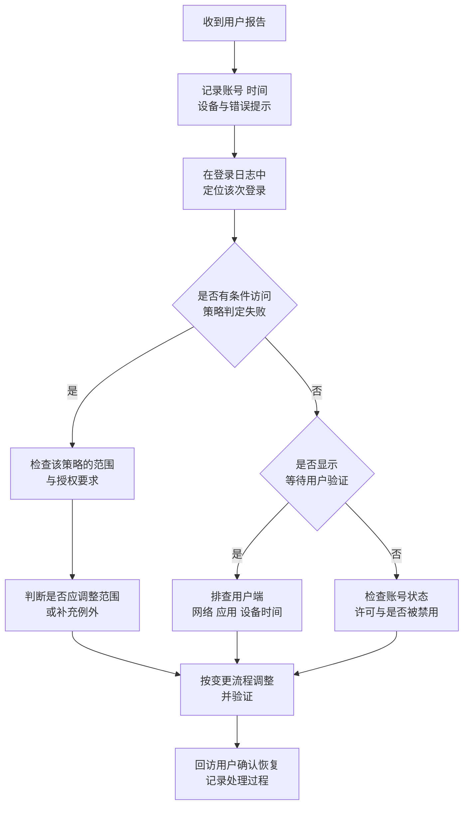
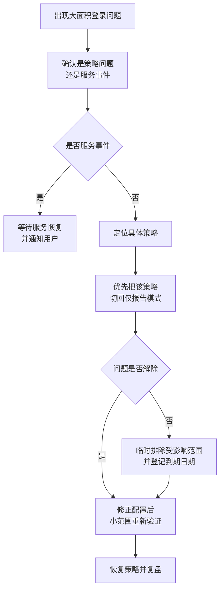

# 第2篇 基础建设 · 第10节 MFA 排查、验收与巡检

> **所属：** 第2篇 基础建设：租户、身份与 MFA。  
> **本节小节：** 2.113 ～ 2.119。  
> **本节性质：** 运行与验收。把 MFA 从“已启用”变成“可运维、可验收、可持续”。  
> **前置条件：** 已完成[第9节](09-MFA实施推广与用户支持.md)的分批推广。  
> **导航：** [返回第2篇目录](README.md)｜上一节：[MFA 实施推广与用户支持](09-MFA实施推广与用户支持.md)｜下一节：[本篇小结与参考资料](11-本篇小结与参考资料.md)

---

## 2.113 为什么用户觉得“老是要验证”

这是上线后最常见的抱怨。先弄清原因，再决定要不要调整策略。

| 原因 | 说明 | 处理方向 |
|---|---|---|
| 使用无痕/隐私模式或每次清 Cookie | 无法保留会话标记 | 说明原因，建议正常模式 |
| 换设备、换浏览器、换网络位置 | 触发重新评估 | 属正常行为，向用户解释 |
| 策略要求较短的会话频率 | 例如要求每天重新验证 | 评估业务需要，必要时调整 |
| 不允许“持久化浏览器”会话 | 关闭浏览器即失效 | 按安全要求权衡 |
| 密码刚被修改 | 各客户端需重新登录 | 属正常行为 |
| 设备被判定为不合规或非受管 | 触发额外要求 | 检查设备状态（第5篇） |
| 存在多条策略叠加要求 | 要求相互累加 | 梳理策略，去掉重复项 |
| 仍在使用按用户 MFA 与条件访问并存 | 重复要求 | 完成迁移，关闭遗留方式 |
| 用户注册的方式不稳定（如信号差） | 收不到推送 | 改用 passkey 或 TOTP |

> **推荐：** 面对“太麻烦”的反馈，优先推动**换成 passkey 或 Windows Hello**（更快、更安全），而不是第一反应去放宽策略。放宽策略会同时降低安全性。

---

## 2.114 登录日志怎么看

登录日志是排查 MFA 问题的**唯一可靠依据**，不要凭用户描述猜测。

### 2.114.1 需要关注的字段

| 字段 | 用途 |
|---|---|
| 时间 | 与用户报告的时间对齐（注意时区设置，见第1节 2.6） |
| 用户 | 确认是哪个账号（注意管理账号与日常账号区分） |
| 状态 | 成功 / 失败 / 中断 |
| 错误代码与原因 | 判断根因的关键 |
| 应用 | 是哪个客户端或服务发起的登录 |
| 客户端应用 | 是否为旧式身份验证客户端 |
| 位置与 IP | 是否为异常地点 |
| 设备信息 | 设备是否受管、是否合规 |
| **条件访问结果** | 哪些策略命中、结果是成功/失败/仅报告 |
| 身份验证详细信息 | 实际用了哪种验证方式、每一步是否通过 |

### 2.114.2 三种典型判读

| 现象 | 日志特征 | 结论 |
|---|---|---|
| 用户说“登不上” | 状态失败 + 条件访问显示某策略“失败” | 策略拦截，检查该策略范围与要求 |
| 用户说“没收到验证” | 中断状态 + 身份验证详细信息显示等待用户操作 | 用户端问题（网络、应用、设备） |
| 用户说“我没登录却收到请求” | 存在来自异常 IP 的登录尝试 | **按疑似账号泄露处理**（第6篇安全事件） |

> **必做：** 处理工单时养成习惯：**先看日志，再动配置**。直接改策略往往会引入新问题，并掩盖真实原因。

---

## 2.115 MFA 登录失败排查流程

### 2.115.1 常见错误现象对照表

| 现象 | 常见原因 | 处理 |
|---|---|---|
| 收不到推送通知 | 手机无网络、通知权限被关、应用被系统清理 | 检查网络与通知权限；改用验证码或 passkey |
| 验证码提示无效 | 手机时间不准、输入过期验证码 | 开启手机自动校时；重新获取 |
| 提示“需要更多信息”但注册页打不开 | 网络限制、浏览器策略 | 换网络或浏览器，必要时用 TAP |
| 提示被策略阻止 | 命中阻断型条件访问策略 | 查日志确认策略，评估范围是否正确 |
| 旧版 Outlook 反复要求输入密码 | 不支持现代身份验证或旧协议已禁用 | 升级客户端；核对认证方式 |
| 手机自带邮件客户端无法登录 | 客户端不支持所需认证方式 | 改用 Outlook 移动版 |
| 设备代码流登录失败 | 相关策略已阻止该流程 | 评估设备替代方案（第8节 2.89） |
| 打印机/系统发信失败 | 依赖基本身份验证 | 按第9节 2.109 改造 |
| 管理员无法登录管理中心 | 平台强制 MFA 要求 + 未注册方式 | 用已注册方式或紧急账号处理 |
| 全部用户同时失败 | 策略配置错误或服务事件 | 立即查服务健康状态并评估回退 |

> **验证点：** 若出现“**大量用户同时失败**”，先判断是策略问题还是服务问题：查看服务健康状态，同时用紧急访问账号验证能否登录。

---

## 2.116 MFA 测试用例与验收标准

### 2.116.1 测试用例

| 编号 | 测试内容 | 期望结果 | 状态 |
|---|---|---|---|
| F1 | 普通用户用 passkey 登录 Web 版 Outlook | 成功，体验顺畅 | 待测试 |
| F2 | 普通用户用备用方式（TOTP）登录 | 成功 | 待测试 |
| F3 | 桌面版 Outlook 首次登录 | 完成现代身份验证 | 待测试 |
| F4 | Teams 桌面端与手机端登录 | 成功 | 待测试 |
| F5 | 管理员登录管理中心 | 要求 MFA（且为防钓鱼强度，如已配置） | 待测试 |
| F6 | **紧急访问账号登录** | 成功，且触发告警 | 待测试 |
| F7 | 模拟旧式身份验证客户端连接 | 被阻止 | 待测试 |
| F8 | 依赖设备代码流的设备登录 | 结果符合既定设计 | 待测试 |
| F9 | 用户换设备后自助添加新方式 | 成功 | 待测试 |
| F10 | 用户丢失设备，走 TAP 恢复流程 | 成功，且有核验记录 | 待测试 |
| F11 | 打印机/业务系统发信 | 正常发送（已改造） | 待测试 |
| F12 | 服务台清除并要求重新注册 | 流程可执行，有记录 | 待测试 |
| F13 | 从公司外部网络登录 | 结果符合策略设计 | 待测试 |
| F14 | 未注册用户首次登录 | 被引导完成注册 | 待测试 |

### 2.116.2 验收标准（需填入具体数值）

| 项目 | 标准 | 本项目取值 |
|---|---|---|
| 范围内用户 MFA 注册率 | 不低于 `___%`（建议 100%，例外须审批） | 待填写 |
| 每人注册方式数量 | 至少 2 种的比例不低于 `___%` | 待填写 |
| 管理员账号 | **100%** 完成注册，且使用防钓鱼方式 | 100% |
| 紧急访问账号 | 数量 ≥ 2，演练成功，告警有效 | 必须满足 |
| 仍使用短信/语音的用户 | 不超过 `___` 人，且均有迁移计划与截止日期 | 待填写 |
| 条件访问例外项 | 不超过 `___` 项，每项有负责人和到期日期 | 待填写 |
| 旧式身份验证 | 已阻止，例外项已登记 | 必须满足 |
| P1 级故障 | 上线前必须为 **0** | 0 |
| P2 级故障 | 不超过 `___` 项 | 待填写 |
| 稳定观察期 | 连续 `___` 个工作日无新增严重故障 | 待填写 |
| 证据 | 注册报告、测试记录、演练记录、日志截图保存位置 | 待填写 |

> **必做：** 验收阈值必须在推广**之前**批准。不能等结果出来后为了通过验收再降低标准。

---

## 2.117 紧急回退原则

MFA 的“回退”必须谨慎：关掉 MFA 等于让全公司账号只剩密码保护。

### 2.117.1 回退的正确顺序

优先做**最小范围**的处置，而不是一刀切关闭：

### 2.117.2 回退纪律

| 要求 | 说明 |
|---|---|
| 不轻易关闭全局保护 | 优先“仅报告”或缩小范围，而不是停用整套 MFA |
| 任何临时例外都要登记 | 对象、原因、批准人、**到期日期** |
| 回退必须有决策人 | 谁有权决定，写在变更计划里 |
| 回退后必须复盘 | 为什么仅报告阶段没发现问题 |
| 例外必须清零 | 到期后逐项关闭，纳入月度巡检 |

> **高风险：** 临时例外是安全债务。项目中常见的失败模式是：上线时加了 15 个例外，一年后还有 14 个在生效。

---

## 2.118 日常巡检项

MFA 不是一次性工程，建议纳入固定巡检（详见第6篇）。

| 频率 | 检查项 |
|---|---|
| 每日 | MFA 相关失败登录是否异常增多；是否有“用户拒绝验证请求”的可疑记录 |
| 每日 | 紧急访问账号是否有登录（**任何登录都应核实**） |
| 每周 | 新入职人员是否已完成注册；未注册名单是否清零 |
| 每周 | 异常地点、异常时间的登录尝试 |
| 每月 | 条件访问例外项复核，处理到期项 |
| 每月 | 仍使用短信/语音的用户数量是否在下降 |
| 每月 | 管理员角色与 MFA 方式是否仍符合要求 |
| 每季度 | 紧急访问账号演练（至少每 90 天一次） |
| 每季度 | 策略集合整体复核，去掉重复或失效策略 |
| 变更时 | 每次新增/修改策略后，用紧急账号登录验证 |

---

## 2.119 常见误区与本节检查表

### 2.119.1 常见误区

| 误区 | 事实 |
|---|---|
| “上了 MFA 就安全了” | 中间人钓鱼、令牌窃取、同意钓鱼仍可能成功；需要防钓鱼方式与设备管理配合 |
| “短信验证够用” | 面临退役，且不防钓鱼与 SIM 交换（见第7节 2.79） |
| “只给管理员上 MFA 就行” | 普通账号被攻破同样可导致数据泄露与内部钓鱼 |
| “例外先加上，以后再说” | 例外会长期存在，形成绕过路径 |
| “关掉安全默认值再慢慢配条件访问” | 中间存在无保护窗口，事故高发 |
| “用户抱怨就放宽策略” | 应优先改用更便捷的 passkey，而不是降低安全 |
| “注册率 90% 已经很好” | 剩余 10% 就是攻击者的入口 |
| “日志太复杂不用看” | 不看日志无法判断真实根因，也无法发现攻击迹象 |

### 2.119.2 本节完成检查表

- [ ] 已能解释并处理“频繁验证”的各类原因，且未以降低安全为首选解法。
- [ ] 服务台与管理员掌握登录日志的关键字段判读方法。
- [ ] 已建立标准排查流程：先看日志，再动配置。
- [ ] 常见错误对照表已交付服务台。
- [ ] 已完成 F1～F14 测试用例，结果全部记录。
- [ ] **紧急访问账号登录测试通过，且告警确实被接收。**
- [ ] 验收标准已填入具体阈值，并在推广前获得批准。
- [ ] MFA 注册率已达标，未注册名单已清零或有审批过的例外。
- [ ] 管理员账号 100% 使用防钓鱼方式。
- [ ] 仍使用短信/语音的用户数量及迁移计划已记录。
- [ ] 所有条件访问例外项均有负责人和到期日期，并纳入月度复核。
- [ ] 回退原则已书面化：优先仅报告或缩小范围，禁止随意关闭整套保护。
- [ ] 已建立每日、每周、每月、每季度巡检项和责任人。
- [ ] 已安排紧急访问账号的 90 天演练排期。
- [ ] 上线证据（注册报告、测试记录、演练记录、日志截图）已归档并记录位置。

> **进入下一节：** 本篇技术内容至此完成。下一节汇总本篇小结、官方参考资料，以及进入第3篇（邮件：Exchange Online 配置与迁移）的条件。
