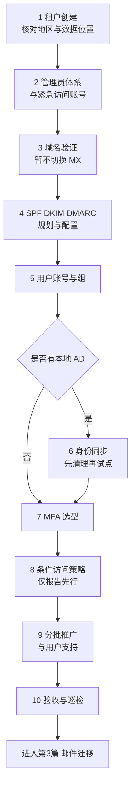

# 第2篇 基础建设：租户、身份与 MFA

> **本篇作用：** 把第1篇的纸面决策变成真实环境——建立正式租户、管理员体系、企业域名解析与邮件信任基础、用户账号与身份同步，并完成 MFA 与登录安全。  
> **本篇性质：** **本篇开始修改正式生产环境。** 多个环节属于高风险操作，部分设置不可回退。  
> **文档状态：** 本篇正文已完成（11 个小节文件）。表格中的“待填写”是企业实际数据占位。  
> **版本与复核日期：** v1.0，2026-08-28。  
> **对应原章节：** 第2、3、4章。  
> **导航：** [返回方案总目录](../README.md)｜上一篇：[第1篇 规划与设计](../01-规划与设计/README.md)

---

## 一、本篇小节文件

按顺序阅读和实施。每个文件可单独打开，篇幅控制在可一次读完的长度。

| 顺序 | 文件 | 覆盖小节 | 主要内容 | 风险等级 |
|---:|---|---|---|---|
| 1 | [租户创建与管理中心](01-租户创建与管理中心.md) | 2.1–2.10 | 创建/接管租户、租户国家地区与数据位置、组织信息、各管理中心分工 | 高（地区不可改） |
| 2 | [管理员账号与角色](02-管理员账号与角色.md) | 2.11–2.19 | 管理账号分离、**紧急访问账号**、平台强制 MFA、角色最小权限、复核回收 | 高 |
| 3 | [域名验证与 DNS 记录](03-域名验证与DNS记录.md) | 2.20–2.32 | 域名验证、MX 与 Autodiscover、TTL、变更计划与回退、生效验证 | **最高** |
| 4 | [邮件身份验证 SPF/DKIM/DMARC](04-邮件身份验证SPF-DKIM-DMARC.md) | 2.33–2.39 | 三者关系、单条 SPF 规则、DKIM 实际取值、DMARC 渐进、**域对齐** | 高 |
| 5 | [用户账号与组](05-用户账号与组.md) | 2.40–2.54 | 账号构成、登录名与别名、命名规则、批量创建、许可分配、三类组区别 | 中 |
| 6 | [本地 AD 与身份同步](06-本地AD与身份同步.md) | 2.55–2.70 | 是否需要同步、AD 清理、Connect Sync 与 Cloud Sync、认证方式、匹配与回退 | 高 |
| 7 | [MFA 原理与验证方式](07-MFA原理与验证方式.md) | 2.71–2.86 | MFA 详解、能防与不能防、各方式对比、**passkey 默认化与短信退役** | 中（选型） |
| 8 | [MFA 启用方式与条件访问](08-MFA启用方式与条件访问.md) | 2.87–2.99 | 安全默认值 vs 条件访问、认证强度、最小策略集、**防止锁死管理员** | **最高** |
| 9 | [MFA 实施推广与用户支持](09-MFA实施推广与用户支持.md) | 2.100–2.112 | 推广批次、用户注册、无手机方案、换/丢手机、非人账号改造、服务台准备 | 中高 |
| 10 | [MFA 排查、验收与巡检](10-MFA排查验收与巡检.md) | 2.113–2.119 | 频繁验证原因、登录日志判读、排查流程、测试用例与验收、回退纪律、巡检 | 中 |
| 11 | [本篇小结与参考资料](11-本篇小结与参考资料.md) | — | 小结、28 项交付物清单、进入第3篇条件、27 项官方参考资料 | — |

---

## 二、建议实施顺序

> **必做：** 第3节完成域名验证后**不要立即切换 MX**。MX 切换属于第3篇，前提是所有邮箱已创建、迁移方案已确定。

---

## 三、本篇五条硬性纪律

1. **租户创建国家或地区不可回退** —— 创建前必须核对合规要求，创建后必须核对实际数据位置。
2. **先建邮箱，再切 MX** —— 顺序颠倒会造成外部邮件退回。
3. **所有阻断型条件访问策略必须排除紧急访问账号** —— 且每次策略变更后立即用该账号登录验证。
4. **不允许出现“安全默认值已关、条件访问未就绪”的空档期** —— 切换必须在同一变更窗口内完成。
5. **短信验证不作为长期方案** —— 2026-09-01 passkey 默认化、2027-02-01 Microsoft 提供的短信/语音退役。

---

## 四、本篇必须产出的结论

- [ ] 唯一正式租户，租户 ID 与数据位置已记录。
- [ ] 管理员清单、角色分配与季度复核责任人。
- [ ] 两个以上紧急访问账号，含凭据保管方案与 90 天演练排期。
- [ ] DNS 变更计划与回退表（含原值逐字记录）。
- [ ] 全部发信来源登记表与 SPF/DKIM/DMARC 配置证据。
- [ ] DMARC 收紧计划与报告监看责任人。
- [ ] 账号命名规则与冲突检查结果。
- [ ] 同步工具、认证方式选型与同步范围批准记录（混合身份场景）。
- [ ] MFA 分人群验证方式选型，且主推防钓鱼方式。
- [ ] 条件访问策略清单，例外项均有负责人与到期日期。
- [ ] 非人账号（打印机、扫描仪、ERP、OA、监控、服务账号）改造方案。
- [ ] MFA 验收阈值（推广前批准）与测试证据。

完整交付物清单见[本篇小结与参考资料](11-本篇小结与参考资料.md)。

---

## 五、阅读提示

- 提示标记 **必做 / 推荐 / 按需 / 高风险 / 验证点 / 回退点 / 许可证要求** 的含义见[方案总目录](../README.md)。
- 所有示例域名、账号、IP 和人员信息均为虚构数据。
- 本篇含多项 2026—2027 年的产品时间线，**实施前请按第11节末尾的“需要重点复核的时效性内容”重新核对官方页面**。
