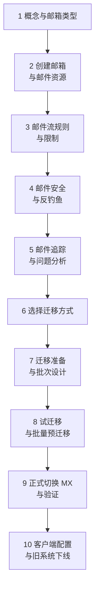
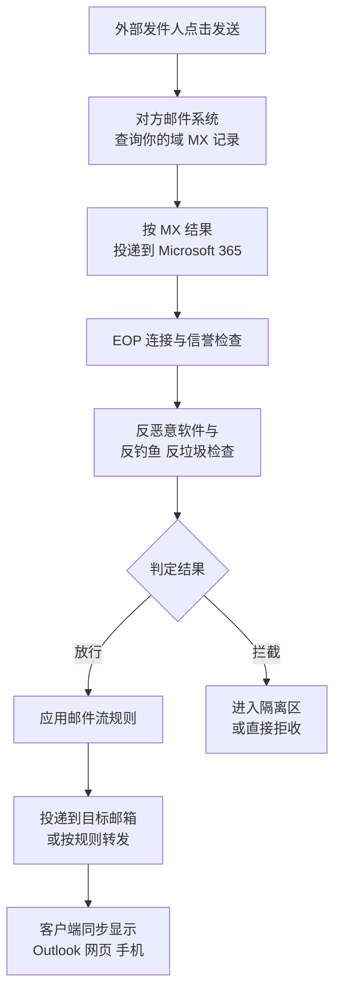

# 第3篇 邮件 · 第1节 Exchange Online 概念与邮箱类型

> **所属：** 第3篇 邮件：Exchange Online 配置与迁移。  
> **本节小节：** 3.1 ～ 3.8。  
> **本节性质：** 概念说明。不修改生产环境，但概念不清会导致后面创建错对象、迁移错数据。  
> **前置条件：** 已完成第2篇；域名已验证、账号已创建、MFA 已在管理员范围启用。**MX 尚未切换。**  
> **导航：** [返回第3篇目录](README.md)｜下一节：[邮箱与邮件资源配置](02-邮箱与邮件资源配置.md)

---

## 3.1 本篇在整个项目中的位置

第3篇是**对业务影响最大的一篇**。第2篇改的是登录方式，出问题影响的是“能不能进”；本篇改的是邮件投递路径和历史数据，出问题影响的是“公司收不收得到订单和客户邮件”。

本篇的整体顺序是：

> **必做：** 第 2～5 节是“把云端邮件系统建好”，第 6～10 节才是“把历史邮件搬过来并切换”。**顺序不能颠倒**：邮箱没建好就切 MX，外部邮件会直接退回。

---

## 3.2 本节目标

完成本节后应当能够回答：

1. Exchange Online 与 Outlook 到底是什么关系。
2. 邮箱、邮件地址、别名、通讯组各自是什么，什么时候用哪个。
3. 用户邮箱、共享邮箱、资源邮箱的区别和许可要求。
4. 一封邮件从外部发到员工收件箱，中间经过了哪些环节（排障基础）。
5. Exchange 管理中心里各个区域分别管什么。

---

## 3.3 Exchange Online 是什么

**Exchange Online 是云端的邮件服务器**，负责存放邮箱、接收和发送邮件、管理日历和联系人。

最常见的新手误解：

| 误解 | 事实 |
|---|---|
| “装了 Outlook 就有企业邮箱了” | Outlook 只是**客户端软件**（看邮件的工具），邮箱由 Exchange Online 提供 |
| “Outlook 和 Exchange 是一回事” | Outlook 是前台，Exchange 是后台 |
| “邮件存在电脑里” | 邮件主要存在云端邮箱，客户端通常只缓存一部分 |
| “买了 Office 就有邮箱” | 取决于许可证是否包含 Exchange Online（见第1篇 1.25） |

用一个类比：

- **Exchange Online** = 邮局和你的信箱（存信、收信、发信）。
- **Outlook / 手机客户端 / 网页版** = 你去看信的方式（不同的门）。

这个区分很重要：用户说“Outlook 打不开邮件”，可能是客户端问题，也可能是邮箱或身份问题，排查方向完全不同。

---

## 3.4 邮箱、邮件地址与别名

| 概念 | 含义 | 举例（虚构） |
|---|---|---|
| **邮箱（Mailbox）** | 实际存放邮件、日历、联系人的容器 | 张三的邮箱 |
| **主邮件地址** | 对外发信时默认显示的地址 | `zhangsan@contoso.com` |
| **别名（代理地址）** | 同一邮箱可接收邮件的其他地址 | `zhang.san@contoso.com` |
| **登录名（UPN）** | 用来登录的账号 | `zhangsan@contoso.com` |

要点回顾（详见第2篇 2.43）：

- 一个邮箱可以有**多个**接收地址，但只有**一个**主发信地址。
- 别名只能收信，默认不改变发信身份。
- 登录名与主邮件地址建议保持一致。

### 3.4.1 迁移场景的实用技巧

企业更名、并购或有历史域名时，常见做法：

- 新域名地址设为主地址（对外统一形象）。
- 旧域名地址保留为别名（保证客户仍能联系上）。
- **迁移前把旧系统里所有在用地址整理成清单**，逐一确认在新邮箱中是否已作为主地址或别名存在。

> **高风险：** 漏掉一个别名，就等于漏掉一条业务联系通道。切 MX 后发到该地址的邮件会退回，而且往往是客户或供应商先发现。

---

## 3.5 三类邮箱对象的区别

这是本节最需要记住的内容。

| 类型 | 用途 | 是否需要单独许可 | 谁使用 | 能否直接登录 |
|---|---|---|---|---|
| **用户邮箱** | 员工个人邮箱 | **需要**（含 Exchange Online 的许可） | 一名员工 | 可以 |
| **共享邮箱** | 部门/职能公共地址 | 基本容量内**不需要**单独许可 | 多名员工共同访问 | **必须禁止**直接登录 |
| **资源邮箱** | 会议室、设备 | 通常不需要 | 用于预订 | 不用于登录 |

### 3.5.1 共享邮箱的关键规则

共享邮箱是企业最常用、也最容易配置错的对象。官方要点：

| 规则 | 说明 |
|---|---|
| 容量 | 未分配许可的共享邮箱最多可存 **50 GB** 数据 |
| 扩容 | 要提升到 **100 GB**，共享邮箱需要分配 Exchange Online Plan 2 许可 |
| 在线存档 | 启用并扩大存档需要 Plan 2，或 Plan 1 + Exchange Online Archiving 加载项 |
| 诉讼保留 | 同样需要 Plan 2，或 Plan 1 + 存档加载项 |
| 访问者许可 | **访问共享邮箱的每个用户，自己必须有已授权的 Exchange Online 邮箱** |
| 外部人员 | 不能把共享邮箱访问权给组织外部的人 |
| **禁止登录** | 共享邮箱有对应的用户账号和系统生成的密码，**应始终阻止该账号登录并保持阻止状态** |
| 并发用户 | 官方说明共享邮箱最多支持 **25 名用户**；并发更多时应考虑 Microsoft 365 组或工单系统 |
| 无法防删除 | 不能阻止成员删除共享邮箱中的邮件；需要限制删除时应考虑 Microsoft 365 组 |
| 加密限制 | 共享邮箱没有自己的安全上下文，从共享邮箱发出的邮件无法用其自身密钥加密 |

官方说明见 [关于 Microsoft 365 中的共享邮箱](https://learn.microsoft.com/en-us/microsoft-365/admin/email/about-shared-mailboxes?view=o365-worldwide)。

> **高风险：** 共享邮箱账号如果没有阻止登录，就是一个**多人知晓密码、通常没有 MFA、无法追责**的账号——这是攻击者最喜欢的入口。创建后必须立即确认已阻止登录。

### 3.5.2 什么时候该用共享邮箱，什么时候不该用

| 需求 | 建议 |
|---|---|
| `info@`、`sales@`、`support@` 等对外公共地址 | 共享邮箱 |
| 前台、值班、投诉受理 | 共享邮箱 |
| 需要限制成员删除邮件 | Microsoft 365 组或工单系统 |
| 需要 20 人以上同时在线处理 | 工单系统 |
| 离职员工邮箱需要继续接收 | 把用户邮箱转为共享邮箱（第6篇离职流程） |
| 需要严格的处理记录与 SLA | 专业工单系统，而不是邮箱 |

---

## 3.6 通讯组与 Microsoft 365 组

两者都能收发邮件，但定位不同。

| 对比项 | 通讯组 | Microsoft 365 组 |
|---|---|---|
| 主要用途 | **群发邮件**（转发给每个成员） | **协作空间**（邮件 + 文件 + 可关联 Teams） |
| 邮件去向 | 复制到每位成员的个人邮箱 | 进入组共享收件箱（成员也可订阅到个人邮箱） |
| 历史邮件 | 新成员看不到加入前的邮件 | 新成员可查看组内历史 |
| 关联资源 | 无 | SharePoint 站点、共享日历、可启用 Teams |
| 适合场景 | `all@contoso.com`、部门通知 | 项目团队、跨部门协作 |
| 治理要点 | 是否允许外部发信、所有者 | 命名规则、所有者、生命周期 |

### 3.6.1 常见配置陷阱

| 陷阱 | 后果 | 处理 |
|---|---|---|
| `all@contoso.com` 允许外部发信 | 外部人员可以一次群发全公司（钓鱼利器） | 默认只允许内部发信，例外需审批 |
| 通讯组没有所有者 | 无人维护成员，离职人员长期留存 | 至少两名所有者 |
| 嵌套层级过深 | 难以判断实际收件人 | 控制层级，画出关系图 |
| 用通讯组分配权限 | 权限行为不符合预期 | 权限用安全组（第2篇 2.49） |
| 每个部门都建 Microsoft 365 组并开 Teams | 产生大量无人管理的团队和站点 | 按需创建，纳入生命周期管理 |

> **必做：** 迁移前把每个通讯组的**成员、所有者、是否允许外部发信、是否隐藏**导出留档。这些设置在旧系统里往往从未被记录，迁移后很难还原。

---

## 3.7 一封邮件的完整旅程（排障基础）

理解这个过程，才能判断“邮件到底卡在哪一段”。

### 3.7.1 按环节定位问题

| 用户描述 | 可能卡在哪一段 | 首选排查工具 |
|---|---|---|
| “外部客户说发给我们退回了” | MX / 收件人不存在 | DNS 查询 + 邮件追踪 |
| “我们收不到某个客户的邮件” | 反垃圾/隔离区 | 邮件追踪 + 隔离区 |
| “邮件收到了但很慢” | 传输或规则处理 | 邮件追踪 |
| “我发出去的进了对方垃圾箱” | 邮件身份验证（SPF/DKIM/DMARC） | 对方邮件头 |
| “邮件在网页版有、Outlook 没有” | 客户端同步 | 客户端与缓存 |
| “整个部门都收不到” | 邮件流规则或连接器 | 规则与连接器配置 |

> **推荐：** 把这张表交给服务台。它能把“邮件出问题了”这类模糊工单，快速引导到正确的排查路径。

---

## 3.8 Exchange 管理中心导航与本节检查表

### 3.8.1 主要区域

| 区域 | 管什么 |
|---|---|
| 收件人 | 用户邮箱、共享邮箱、通讯组、资源邮箱、联系人 |
| 邮件流 | 邮件流规则、连接器、可接受的域、邮件追踪 |
| 角色 | Exchange 相关的管理员角色分配 |
| 迁移 | 迁移批次、迁移端点 |
| 报告 | 邮件流、使用情况等报表 |
| 设置 | 邮箱与组织级设置 |

注意分工（详见第2篇 2.8）：

- **邮件安全策略**（反垃圾、反钓鱼、安全链接、隔离区）在 **Defender 门户**，不在 Exchange 管理中心。
- **保留与合规**在 **Purview 门户**。
- **许可证分配**在 Microsoft 365 管理中心。

### 3.8.2 本节完成检查表

- [ ] 已理解 Exchange Online（服务）与 Outlook（客户端）的区别。
- [ ] 已明确邮箱、主地址、别名、登录名四者的关系。
- [ ] 已从旧系统导出**全部在用邮件地址清单**（含别名和历史域名地址）。
- [ ] 已理解用户邮箱、共享邮箱、资源邮箱的区别与许可要求。
- [ ] 已知悉共享邮箱的容量上限、许可条件、25 名用户限制和**必须阻止登录**的要求。
- [ ] 已确定哪些公共地址用共享邮箱、哪些应改用 Microsoft 365 组或工单系统。
- [ ] 已理解通讯组与 Microsoft 365 组的区别，并确定各自使用场景。
- [ ] 已导出旧系统全部通讯组的成员、所有者、外部发信设置和隐藏状态。
- [ ] 已理解一封邮件的完整传递过程，并把排障对照表交付服务台。
- [ ] 已了解 Exchange 管理中心与 Defender、Purview 门户的分工。

> **进入下一节的条件：** 概念清楚、地址与组清单已导出。下一节开始在云端**实际创建**邮箱和邮件资源——这是切换 MX 的前置条件。
