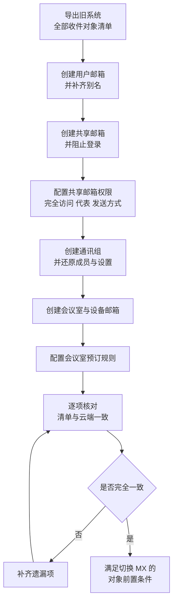

# 第3篇 邮件 · 第2节 邮箱与邮件资源配置

> **所属：** 第3篇 邮件：Exchange Online 配置与迁移。  
> **本节小节：** 3.9 ～ 3.17。  
> **本节性质：** 生产配置。本节是**切换 MX 的前置条件**：所有需要接收邮件的对象都必须先在云端存在。  
> **前置条件：** 已完成[第1节](01-Exchange概念与邮箱类型.md)；旧系统的地址、共享邮箱、通讯组、会议室清单已导出。  
> **导航：** [返回第3篇目录](README.md)｜上一节：[Exchange Online 概念与邮箱类型](01-Exchange概念与邮箱类型.md)｜下一节：[邮件流规则与限制](03-邮件流规则与限制.md)

---

## 3.9 本节目标与创建顺序

完成本节后，云端应当具备**与旧系统一一对应**的收件对象。

> **必做：** 本节结束时必须产出一份**对照表**：旧系统每一个能收邮件的地址，在云端对应哪个对象。这份表是切换 MX 的放行凭据。

---

## 3.10 创建和启用用户邮箱

用户邮箱通常在分配含 Exchange Online 的许可后自动创建（见第2篇 2.48）。

### 3.10.1 创建后必须核对

- [ ] 邮箱已成功创建（可能需要等待几分钟到数十分钟）。
- [ ] 主邮件地址与命名规则一致。
- [ ] **全部别名已添加**（对照旧系统清单）。
- [ ] 显示名称正确，中文无乱码。
- [ ] 邮箱类型正确（用户邮箱，而非误建为共享邮箱）。
- [ ] 时区与语言在用户首次登录时正确设置。

### 3.10.2 容量与存档

| 项目 | 说明 |
|---|---|
| 邮箱容量 | 取决于所分配的许可（不同计划上限不同），采购前应按第1篇 1.26 核对 |
| 在线存档 | 需要相应许可；可把历史邮件移到存档邮箱 |
| 自动扩展存档 | 启用后存档容量可逐步增长至最大 **1.5 TB**；需要 Plan 2，或 Plan 1 加存档加载项 |
| 扩容时效 | 额外存储空间的预配可能需要一定时间（官方说明可达 30 天），**不能临时救急** |
| 适用限制 | 自动扩展存档面向个人使用的邮箱，且不适用于增长速度过快的场景 |

官方说明见 [了解自动扩展存档](https://learn.microsoft.com/en-us/purview/autoexpanding-archiving)。

> **高风险：** 如果某些用户旧邮箱数据量已经超过目标计划的容量上限，必须在迁移**之前**决定方案：升级许可、启用存档、或先归档历史数据。等迁移到一半失败再处理，代价很高。

---

## 3.11 创建共享邮箱

### 3.11.1 创建步骤要点

1. 在 Exchange 管理中心或 Microsoft 365 管理中心创建共享邮箱。
2. 设置主地址与全部别名（对照旧系统清单）。
3. 添加成员并配置权限（见 3.12）。
4. **确认对应账号已阻止登录，并保持阻止状态**。
5. 按需求决定是否分配 Plan 2 许可（容量、存档、诉讼保留）。
6. 登记业务负责人。

### 3.11.2 创建时的常见问题

| 问题 | 原因 | 处理 |
|---|---|---|
| 提示代理地址已被占用 | 该地址已被其他对象使用 | 查清占用对象；或用 PowerShell 处理同名不同域场景 |
| 刚创建就发信提示无权限 | 权限信息还在同步 | 通常等待一段时间后重试 |
| 共享邮箱容量不足 | 未分配 Plan 2 | 评估扩容或改用其他方案 |
| 成员看不到共享邮箱 | 权限未生效或客户端未刷新 | 检查权限，必要时手工添加 |

> **必做：** 每个共享邮箱都要有**业务负责人**。第1篇 1.14 已强调：无人确认用途的公共邮箱不要直接迁移，应先进入待清理清单。

---

## 3.12 共享邮箱的三种权限（最容易配错）

这是新手最容易混淆、也最影响业务的配置。

| 权限 | 能做什么 | 对外显示的发件人 | 典型用途 |
|---|---|---|---|
| **完全访问（Full Access）** | 打开邮箱、读写、管理文件夹 | 不改变发信身份 | 处理公共邮箱来信 |
| **发送方式（Send As）** | 以**共享邮箱本身**的身份发信 | `sales@contoso.com` | 对外统一形象 |
| **代表发送（Send on Behalf）** | 以“代表”身份发信 | 通常显示为“张三 代表 sales” | 需要体现实际经办人 |

### 3.12.1 选择建议

| 需求 | 配置 |
|---|---|
| 客户看到的是公司统一地址 | 完全访问 + **发送方式** |
| 需要让客户知道是谁在回复 | 完全访问 + **代表发送** |
| 只需要看，不需要回 | 仅完全访问 |
| 助理代高管发信 | 按业务规范选择（多数选择代表发送以体现真实关系） |

### 3.12.2 迁移必查项

> **高风险：** 权限是**迁移后最常丢失**的东西。旧系统的“谁能打开、谁能代发”往往没有文档，只有当事人知道。切换后客户投诉“发出去的邮件署名不对”，通常就是这里没还原。

必须在迁移前导出并逐项还原：

- [ ] 每个共享邮箱的完全访问成员清单。
- [ ] 每个共享邮箱的发送方式成员清单。
- [ ] 每个共享邮箱的代表发送成员清单。
- [ ] 用户邮箱之间的委派关系（如助理访问高管邮箱）。
- [ ] 日历委派与查看权限。
- [ ] 是否需要“自动将已发送邮件保存到共享邮箱”的设置。

---

## 3.13 创建和管理通讯组

### 3.13.1 还原旧系统设置

创建通讯组时，逐项还原以下设置：

| 设置 | 说明 | 风险 |
|---|---|---|
| 成员 | 全部成员，含嵌套组 | 漏成员导致有人收不到通知 |
| 所有者 | **至少两名** | 无人维护 |
| 是否允许外部发信 | 默认**不允许**，例外需审批 | 开放会成为群发钓鱼通道 |
| 是否在通讯簿中隐藏 | 按业务需要 | 隐藏后用户找不到 |
| 发送限制（仅特定人可发） | 例如全员通知组只允许 HR 发送 | 不限制会被滥用 |
| 加入方式 | 开放/封闭 | 影响治理 |

### 3.13.2 全员通知组的特别要求

`all@contoso.com` 这类组是高风险对象：

> **必做：**
> - 默认**只允许内部发信**。
> - 建议进一步限制为**指定人员或组**（如 HR、行政）才能发送。
> - 如需外部发信例外，必须书面审批并登记。
> - 定期复核成员与发送权限。

### 3.13.3 邮件启用的安全组

如果既需要授权、又需要收邮件，可使用邮件启用的安全组。但请遵守第2篇 2.49 的原则：**权限用安全组，群发用通讯组**，不要把两种用途混在一个难以理解的对象里。

---

## 3.14 创建会议室与设备邮箱

### 3.14.1 会议室需要收集的信息

| 字段 | 说明 |
|---|---|
| 名称与地址 | 建议统一前缀，例如 `room-3f-a@contoso.com` |
| 显示名称 | 便于用户搜索，例如“3楼A会议室（可容纳12人）” |
| 容量 | 影响用户选择 |
| 位置/楼层 | 便于按地点检索 |
| 设备 | 投影、视频会议终端、白板 |
| 是否支持 Teams 会议 | 与第4篇的会议室设备规划配合 |

### 3.14.2 设备邮箱

用于可预订的设备（投影仪、车辆、笔记本）。与会议室的差别主要在用途分类和预订逻辑，配置方式类似。

---

## 3.15 配置会议室预订规则

预订规则决定“谁能订、能订多久、需不需要审批”。

| 设置 | 说明 | 建议 |
|---|---|---|
| 自动接受 / 人工审批 | 是否需要有人批准 | 普通会议室自动接受；重要会议室或对外接待室人工审批 |
| 委派人 | 谁负责审批 | 人工审批必须指定**至少两人** |
| 允许重复会议 | 是否可预订周期性会议 | 视资源紧张程度 |
| 最长预订时长 | 单次最长时间 | 防止长期占用 |
| 最远预订天数 | 可提前多久预订 | 防止过度提前锁定 |
| 允许冲突 | 是否允许双重预订 | 一般不允许 |
| 谁可以预订 | 限定人员或组 | 高层会议室可限定 |
| 私密会议信息 | 是否显示会议主题和组织者 | 涉密场景应隐藏详情 |

> **推荐：** 迁移前记录旧系统的会议室预订规则和**未来已存在的预订**。会议室的未来预订如果没有迁移，用户会发现“会议室看起来是空的”，从而出现撞车。

---

## 3.16 邮件联系人与外部地址

| 对象 | 用途 | 迁移注意 |
|---|---|---|
| 邮件联系人 | 通讯簿中的外部人员 | 确认是否仍有效；含个人信息的要控制可见范围 |
| 邮件用户 | 有外部地址但需在组织中存在的对象 | 按需创建 |
| 转发地址 | 把邮件转到外部 | **必须审查**，可能是数据外泄通道 |

> **高风险：** 迁移前必须导出旧系统中**所有自动转发规则和转发地址**，逐条确认业务合理性。攻击者入侵邮箱后最常做的事之一就是悄悄设置转发；如果把这些规则原样迁到云端，等于把后门也搬过来。

---

## 3.17 收件对象对照表与本节检查表

### 3.17.1 对照表模板（本节核心交付物）

| 旧系统地址 | 类型 | 云端对象 | 是否为主地址/别名 | 权限已还原 | 负责人 | 状态 |
|---|---|---|---|---|---|---|
| `zhangsan@contoso.com` | 用户邮箱 | 张三 | 主地址 | — |  | 待确认 |
| `zhang.san@contoso.com` | 别名 | 张三 | 别名 | — |  | 待确认 |
| `sales@contoso.com` | 共享邮箱 | 销售公共邮箱 | 主地址 | 完全访问+发送方式 |  | 待确认 |
| `all@contoso.com` | 通讯组 | 全员通知 | 主地址 | 限定发送人 |  | 待确认 |
| `room-3f-a@contoso.com` | 会议室 | 3楼A会议室 | 主地址 | 自动接受 |  | 待确认 |
| `scanner@contoso.com` | 设备发信 | 见第2篇 2.109 | — | 发信方式改造 |  | 待确认 |

### 3.17.2 本节完成检查表

- [ ] 旧系统全部收件地址已导出，并建立对照表。
- [ ] 所有用户邮箱已创建，别名已全部补齐。
- [ ] 已确认没有用户旧邮箱数据量超过目标计划容量（超出者已有方案）。
- [ ] 需要在线存档的用户已确认许可条件，并了解存档扩容需要时间。
- [ ] 所有共享邮箱已创建，主地址与别名与旧系统一致。
- [ ] **每个共享邮箱对应账号已阻止登录**（逐个确认，不是抽查）。
- [ ] 共享邮箱的完全访问、发送方式、代表发送权限已按旧系统还原。
- [ ] 用户之间的邮箱委派与日历委派关系已还原。
- [ ] 所有通讯组已创建，成员、所有者、隐藏状态已还原。
- [ ] 通讯组默认不允许外部发信；例外项已审批登记。
- [ ] 全员通知组已限制为指定人员或组才能发送。
- [ ] 所有会议室与设备邮箱已创建，容量、位置、显示名称规范。
- [ ] 会议室预订规则已配置；人工审批的会议室已指定至少两名委派人。
- [ ] 旧系统会议室的未来预订已有处理方案。
- [ ] 邮件联系人已确认有效性，敏感信息可见范围受控。
- [ ] **旧系统全部自动转发规则已导出并逐条审查**，可疑项未迁移。
- [ ] 对照表已逐项核对完毕，无遗漏项。

> **进入下一节的条件：** 对照表全部核对通过。这意味着**对象层面已满足切换 MX 的前置条件**，但还需要完成邮件流、安全策略配置和迁移准备。下一节配置邮件流规则与各类限制。
