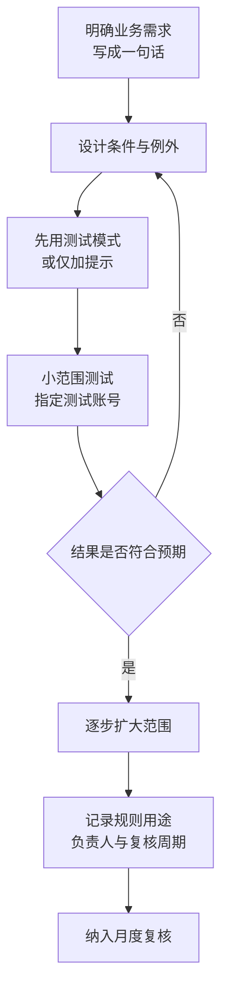

# 第3篇 邮件 · 第3节 邮件流规则与限制

> **所属：** 第3篇 邮件：Exchange Online 配置与迁移。  
> **本节小节：** 3.18 ～ 3.24。  
> **本节性质：** 生产配置。邮件流规则会**直接改变每一封邮件的处理结果**，配置错误可能造成邮件被误删、误转发或大面积拒收。  
> **前置条件：** 已完成[第2节](02-邮箱与邮件资源配置.md)，收件对象对照表已核对通过。  
> **导航：** [返回第3篇目录](README.md)｜上一节：[邮箱与邮件资源配置](02-邮箱与邮件资源配置.md)｜下一节：[邮件安全与反钓鱼](04-邮件安全与反钓鱼.md)

---

## 3.18 本节目标

完成本节后应当达到：

1. 了解邮箱容量、邮件大小、收件人数量等关键限制，并按业务需要调整。
2. 会使用邮件流规则实现企业常见需求（外部标识、免责声明、定向路由）。
3. **默认关闭外部自动转发**，并建立例外审批。
4. 理解规则的执行顺序和风险，具备回退能力。

> **高风险：** 邮件流规则的作用范围是**全组织**。一条写错条件的规则可以在几分钟内影响全公司邮件。所有规则必须先在小范围测试，并保留可快速停用的能力。

---

## 3.19 必须了解的服务限制

这些限制决定了很多“为什么发不出去”的问题。具体数值会随服务更新调整，实施前应核对官方的 Exchange Online 限制说明。

| 限制类型 | 说明 | 项目中的影响 |
|---|---|---|
| **单封邮件大小** | 有默认上限，管理员可在允许范围内调整（通常最大可设到较高值） | 旧系统允许的大附件邮件可能迁移失败或无法收发 |
| 附件编码开销 | 邮件在传输中会编码，实际可发附件小于名义上限 | 用户说“明明只有 20 MB 却发不出去” |
| 邮箱容量 | 按许可计划不同 | 超容量用户需升级或启用存档 |
| 存档容量 | 自动扩展存档最大 1.5 TB，预配需要时间 | 不能临时救急 |
| 单封邮件收件人数 | 有上限 | 大规模群发应使用通讯组或专用平台 |
| 每日发送配额 | 有上限 | 营销类邮件不应从普通邮箱发出 |
| 通讯组成员数 | 有上限 | 超大组需拆分或改用其他方式 |
| 文件夹与项目数限制 | 单文件夹项目数、文件夹层级有上限 | 旧邮箱结构异常时迁移易失败 |
| 保留与恢复期限 | 已删除项目的可恢复期限 | 影响误删恢复承诺 |

### 3.19.1 项目必做的三项核对

- [ ] 从旧系统统计**最大单封邮件**的大小，确认目标环境是否允许。
- [ ] 统计**单文件夹项目数异常**的邮箱（例如收件箱有十几万封），提前处理。
- [ ] 统计**超大邮箱**，确认容量方案。

> **必做：** 这三项在第1篇 1.13 已列为调查项。如果当时是“待填写”，本节必须补齐——它们是迁移失败最常见的三个技术原因。

---

## 3.20 邮件大小限制的调整

| 场景 | 建议 |
|---|---|
| 企业习惯发送大附件 | 评估在允许范围内提高限制，同时推广用 OneDrive/SharePoint 链接共享（第4篇） |
| 与外部客户互发大文件 | 注意**对方系统也有限制**，提高自己的上限不代表能发成功 |
| 需要迁移历史大邮件 | 迁移前确认目标限制不低于源系统的最大邮件 |

> **推荐：** 提高邮件大小上限不是长期方案。更好的做法是引导用户使用文件链接共享：避免邮箱膨胀、支持版本管理和权限回收。

---

## 3.21 邮件流规则能做什么

邮件流规则（传输规则）的逻辑是：**满足条件 → 执行动作（可加例外）**。

企业常见用途：

| 需求 | 典型实现 |
|---|---|
| 给外部邮件加提示标识 | 条件：发件人在组织外部；动作：在邮件顶部插入提示 |
| 添加统一免责声明 | 条件：发件人在组织内部；动作：追加免责声明 |
| 阻止特定附件类型 | 条件：附件扩展名匹配；动作：拒收或隔离 |
| 阻止向外发送敏感内容 | 条件：内容匹配；动作：拒收或加密（更完善的方案见第5篇 DLP） |
| 特定域名走特定路由 | 条件：收件域匹配；动作：使用指定连接器 |
| 高管防冒充加强提示 | 条件：显示名匹配高管姓名且来自外部；动作：加提示或隔离 |
| 内部通知组限制发送人 | 条件：收件人为通知组且发件人不在允许列表；动作：拒收 |

### 3.21.1 规则设计纪律



| 纪律 | 说明 |
|---|---|
| 一条规则一个目的 | 不要把多个需求塞进一条复杂规则 |
| 必须写明用途 | 规则名称和备注要能让半年后的人看懂 |
| 先提示后拦截 | 新规则先只加提示或记录，观察后再改为拒收 |
| 注意执行顺序 | 规则按优先级顺序执行，前面的动作可能影响后面 |
| 避免与安全策略重复 | 反垃圾、反钓鱼交给 Defender 策略（下一节），不要用规则重复实现 |
| 保留回退 | 规则可随时停用；变更前记录原配置 |

> **高风险：** 用邮件流规则做“拒收”动作时，条件写宽一点就可能拒收大量正常邮件，而且**发件人会收到退信**，影响对外形象。务必先用提示模式验证。

---

## 3.22 外部邮件标识

给来自组织外部的邮件加上明显标识，是**成本最低、见效最快**的反钓鱼措施之一。

### 3.22.1 两种方式

| 方式 | 说明 |
|---|---|
| 平台自带的外部发件人标记 | 在支持的客户端中显示“外部”标签 |
| 邮件流规则插入提示文字 | 在邮件正文顶部加一段醒目提示 |

### 3.22.2 提示文字建议

内容要**简短、明确、可执行**，例如：

```text
【外部邮件】此邮件来自公司外部。请勿轻易点击链接或打开附件；
如涉及付款、账号或密码，请通过电话等其他方式与对方核实。
```

注意事项：

- 不要写得太长，否则用户会自动忽略。
- 建议对**内部邮件不加**，否则标识失去意义。
- 与培训配合（第6篇）：告诉员工看到这个标识意味着什么。

> **推荐：** 结合第2篇的 DMARC 工作一起看：外部标识解决“用户能否分辨”，邮件身份验证解决“伪造能否成功”，两者都要做。

---

## 3.23 外部自动转发的限制（重点）

这是**安全与合规的高危项**。

### 3.23.1 为什么必须限制

| 风险 | 说明 |
|---|---|
| 数据外泄 | 员工把公司邮件自动转到个人邮箱 |
| 攻击者驻留 | 账号被入侵后设置隐蔽转发，长期窃取邮件 |
| 合规问题 | 数据流出受控范围，审计无法追踪 |
| 离职风险 | 离职前设置转发带走客户往来 |

### 3.23.2 建议配置

| 项目 | 建议 |
|---|---|
| 默认状态 | **阻止**外部自动转发 |
| 例外方式 | 按业务需要，对特定用户或场景开放，并**书面审批** |
| 例外登记 | 对象、原因、批准人、到期日期 |
| 定期复核 | 每月检查现有转发规则与例外项 |
| 监控告警 | 新增外部转发时能被发现 |

### 3.23.3 三种转发的区别

| 类型 | 设置位置 | 检查方式 |
|---|---|---|
| 邮箱级转发 | 邮箱属性中的转发地址 | 管理端可批量导出 |
| 收件箱规则转发 | 用户自己在客户端设置的规则 | 需要专门检查（常被忽略） |
| 邮件流规则转发 | 管理员设置的组织级规则 | 规则清单复核 |

> **必做：** 迁移前后都要检查**收件箱规则**中的转发。攻击者最常使用这一层，因为管理员往往只看邮箱级转发设置。

---

## 3.24 免责声明与本节检查表

### 3.24.1 免责声明的实用建议

| 建议 | 原因 |
|---|---|
| 只对外部收件人添加 | 内部邮件加声明会让邮件串越来越长 |
| 内容简短 | 过长会影响阅读，且在移动端占屏 |
| 注意回复叠加 | 长邮件串中会重复出现，可考虑仅在首次或特定条件添加 |
| 中英文按需 | 涉外企业可加英文版本 |
| 法务确认文本 | 措辞由法务提供，IT 只负责实现 |
| 与加密邮件兼容性 | 加密邮件可能无法插入声明，需确认行为 |

### 3.24.2 规则清单（本节交付物）

| 编号 | 规则名称 | 用途 | 条件摘要 | 动作 | 例外 | 负责人 | 复核周期 |
|---|---|---|---|---|---|---|---|
| R1 | 外部邮件提示 | 反钓鱼 | 发件人在组织外 | 加提示 | 白名单合作方（如有） |  | 季度 |
| R2 | 对外免责声明 | 合规 | 发件人在组织内且收件人在外 | 追加声明 | 加密邮件 |  | 年度 |
| R3 | 全员组发送限制 | 防滥用 | 收件人为 `all@` 且发件人不在允许列表 | 拒收 | HR、行政 |  | 季度 |
| R4 | 高管冒充提示 | 反钓鱼 | 外部邮件显示名匹配高管 | 加提示或隔离 | — |  | 季度 |
| R5 | 危险附件处理 | 安全 | 附件类型匹配 | 隔离 | 业务必需类型 |  | 季度 |

### 3.24.3 本节完成检查表

- [ ] 已核对邮箱容量、邮件大小、收件人数量等关键限制的当前值。
- [ ] 已统计旧系统最大单封邮件大小，并确认目标环境可接受。
- [ ] 已统计单文件夹项目数异常和超大邮箱，并有处理方案。
- [ ] 邮件大小限制已按业务需要设置，同时已规划文件链接共享的推广。
- [ ] 每条邮件流规则都有明确用途、负责人和复核周期。
- [ ] 新规则均先以提示或记录方式验证，再改为拦截动作。
- [ ] 已确认规则执行顺序，无相互冲突。
- [ ] 外部邮件标识已启用，提示文字简短明确，且不对内部邮件添加。
- [ ] **外部自动转发默认已阻止**。
- [ ] 转发例外项已登记（对象、原因、批准人、到期日期）。
- [ ] 已检查邮箱级转发、**收件箱规则转发**和邮件流规则转发三个层面。
- [ ] 迁移前从旧系统导出的可疑转发规则未被迁移到云端。
- [ ] 免责声明文本已由法务确认，且仅对外部收件人添加。
- [ ] 规则清单已留档，并纳入月度或季度复核。
- [ ] 已确认所有规则可快速停用，且变更前已记录原配置。

> **进入下一节的条件：** 邮件流规则已生效并验证。下一节配置**邮件安全与反钓鱼**——这部分在 Defender 门户，是抵御 BEC 和勒索邮件的主要防线。
