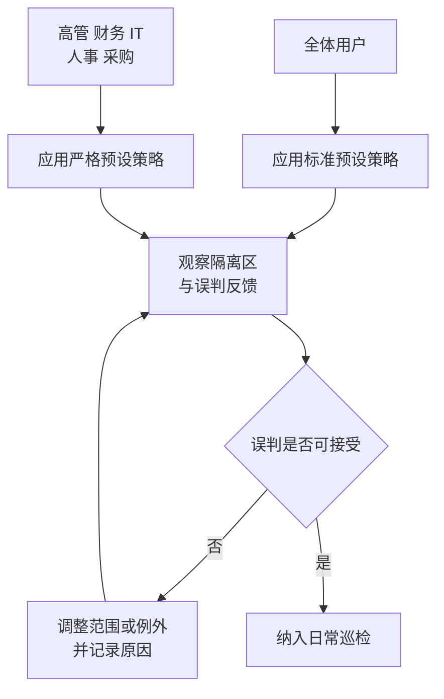
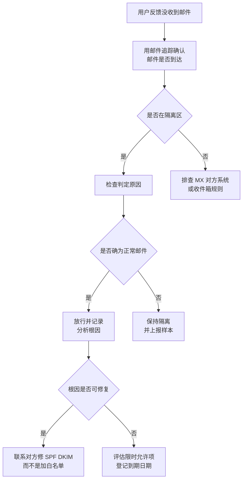

# 第3篇 邮件 · 第4节 邮件安全与反钓鱼

> **所属：** 第3篇 邮件：Exchange Online 配置与迁移。  
> **本节小节：** 3.25 ～ 3.35。  
> **本节性质：** 生产配置。本节决定企业能否挡住钓鱼、勒索和商业邮件欺诈（BEC）。  
> **配置位置：** 主要在 **Microsoft Defender 门户**，不在 Exchange 管理中心。  
> **前置条件：** 已完成[第3节](03-邮件流规则与限制.md)；第2篇的 SPF、DKIM、DMARC 已就绪。  
> **导航：** [返回第3篇目录](README.md)｜上一节：[邮件流规则与限制](03-邮件流规则与限制.md)｜下一节：[邮件追踪与问题分析](05-邮件追踪与问题分析.md)

---

## 3.25 本节目标

完成本节后应当达到：

1. 能区分垃圾邮件、钓鱼邮件、恶意软件和 BEC，并知道各自的防护手段。
2. 明确 EOP（基础）与 Defender for Office 365（进阶）的能力边界和许可要求。
3. 已启用适合企业的防护策略，并对重点人群加强保护。
4. 会管理隔离区，并建立误判处理流程。

> **必做：** 邮件安全策略必须**与迁移并行推进**，不能等迁移全部结束再配置。切 MX 之后邮件立刻进入 Microsoft 365，如果防护还没配好，企业就在“裸奔”状态接收外部邮件。

---

## 3.26 四类威胁的区别

| 类型 | 特征 | 攻击者目的 | 主要防线 |
|---|---|---|---|
| **垃圾邮件（Spam）** | 广告、推销、批量群发 | 流量与推广 | 反垃圾策略 |
| **钓鱼邮件（Phishing）** | 伪造身份，诱导点链接、输账号 | 窃取凭据 | 反钓鱼策略 + 邮件身份验证 + 用户培训 |
| **恶意软件（Malware）** | 附带病毒、勒索软件、宏文档 | 控制终端、加密数据 | 反恶意软件 + 安全附件 + 宏管控（第4篇） |
| **商业邮件欺诈（BEC）** | **通常不带恶意链接或附件**，纯靠冒充高管或供应商骗汇款 | 直接骗钱 | 冒充防护 + 外部标识 + **业务流程双人核实** |

### 3.26.1 关于 BEC 的重要提醒

> **高风险：** BEC 邮件往往“干净得挑不出毛病”——没有病毒、没有恶意链接、语言得体。**技术手段无法完全拦住它。**
>
> 真正有效的防线是**业务流程**：
> - 变更收款账号必须通过电话回拨（用系统里预存的号码，不用邮件里给的号码）确认。
> - 超过一定金额的付款必须双人复核。
> - 高管“紧急、保密、马上办”的要求，一律按标准流程核实。
>
> 这条要写进财务制度，而不是只写在 IT 文档里。

---

## 3.27 EOP 与 Defender for Office 365 的能力边界

| 能力 | 归属 | 说明 |
|---|---|---|
| 反恶意软件 | **EOP（基础）** | 所有 Exchange Online 邮箱具备 |
| 反垃圾邮件（入站/出站） | **EOP（基础）** | 基础可用 |
| 反钓鱼（欺骗智能等基础能力） | **EOP（基础）** | 基础可用 |
| 隔离区 | **EOP（基础）** | 基础可用 |
| 邮件流规则、连接器 | Exchange Online | — |
| **安全链接** | **Defender for Office 365** | 需要相应许可 |
| **安全附件** | **Defender for Office 365** | 需要相应许可 |
| **用户与域名冒充防护** | **Defender for Office 365** | 需要相应许可 |
| 攻击模拟培训 | Defender for Office 365（较高级别） | 需要相应许可 |
| 自动调查与响应 | Defender for Office 365（较高级别） | 需要相应许可 |
| 威胁资源管理器 | Defender for Office 365 | 需要相应许可 |

> **许可证要求：** 上表的归属可能随产品调整。**采购前必须按第1篇 1.28 的方法核对当前服务说明和产品条款**，不要仅凭产品名称假设包含某项能力。

### 3.27.1 只有 EOP 时怎么办

没有 Defender for Office 365 的企业，应把重心放在：

- 把 EOP 的反垃圾、反恶意软件、反钓鱼策略调到合理强度。
- 把邮件身份验证（SPF/DKIM/DMARC）做扎实（第2篇第4节）。
- 加强外部邮件标识（第3节 3.22）。
- 强化用户培训与业务核实流程。
- 在终端侧做好宏管控与补丁（第4篇、第5篇）。

---

## 3.28 预设安全策略：推荐的起点

Microsoft 提供了**预设安全策略**（通常分为标准和严格两档），把多项防护打包成经过验证的配置。

| 方式 | 适合 | 优点 | 注意 |
|---|---|---|---|
| **预设策略（标准）** | 大多数企业 | 快速获得经过验证的配置，随产品更新而演进 | 可调整范围有限 |
| **预设策略（严格）** | 高风险人群（高管、财务、IT） | 更强拦截 | 误判概率相对更高 |
| 自定义策略 | 有特殊需求 | 灵活 | 需要自己维护，容易配置不当 |

### 3.28.1 建议的分层做法

官方建议见 [Microsoft 365 邮件与协作安全设置建议](https://learn.microsoft.com/en-us/defender-office-365/recommended-settings-for-eop-and-office365)。

> **推荐：** 新手企业优先使用预设策略，而不是从零手工配置十几个自定义策略。预设策略会随 Microsoft 的威胁研究更新，维护成本更低。

---

## 3.29 反垃圾邮件策略

### 3.29.1 入站反垃圾

关键设置项：

| 设置 | 说明 | 建议 |
|---|---|---|
| 垃圾邮件动作 | 移到垃圾邮件文件夹或隔离 | 中等确信度移垃圾箱、高确信度隔离是常见做法 |
| 大量邮件阈值 | 判定营销类批量邮件的敏感度 | 按企业容忍度调整 |
| 隔离保留期 | 隔离邮件保留多久 | 结合服务台响应能力设置 |
| 允许/阻止列表 | 特定发件人或域 | **谨慎使用**，见 3.29.3 |
| 通知用户 | 定期发送隔离摘要通知 | 建议启用，让用户自助发现误判 |

### 3.29.2 出站反垃圾

出站策略的作用是**限制本企业账号被利用来群发**：

| 设置 | 意义 |
|---|---|
| 每小时/每日发送上限 | 账号被入侵后限制损害 |
| 达到限制后的动作 | 例如限制该账号继续发信 |
| **自动转发控制** | 与第3节 3.23 一致，默认限制外部自动转发 |
| 告警通知 | 出现异常发送时通知管理员 |

> **必做：** 出站策略常被忽略，但它是“账号被盗后不让公司域名被拉黑”的关键。如果企业域名因大量垃圾邮件被外部拉黑，恢复过程会很痛苦。

### 3.29.3 允许列表的正确用法

> **高风险：** 把某个域名加入允许列表，等于**告诉系统不要检查来自该域的邮件**。攻击者最喜欢伪造的恰恰是合作伙伴、快递、银行这类被加白的域。

正确做法：

- 优先解决根因（让对方修好 SPF/DKIM/DMARC）。
- 使用租户允许/阻止列表，并设置**到期时间**，而不是永久放行。
- 允许项必须登记：对象、原因、批准人、到期日期。
- 每月复核，清理不再需要的条目。
- **绝不**因为“用户抱怨误判”就整域加白。

---

## 3.30 反恶意软件与安全附件

### 3.30.1 反恶意软件（EOP 基础）

| 设置 | 建议 |
|---|---|
| 常见附件类型过滤 | 启用，阻止可执行文件、脚本等高风险类型 |
| 检测到恶意软件的动作 | 隔离整封邮件 |
| 通知 | 按需通知管理员 |

建议默认阻止的附件类型（示例，需按业务确认）：可执行程序、脚本、快捷方式、批处理、部分容器格式等。

> **必做：** 阻止列表要与业务确认。有些企业确实需要接收特定格式（如工程图纸、设计源文件）。做法是**先阻止高风险类型，再针对确有需要的类型单独评估替代传输方式**（如文件链接共享）。

### 3.30.2 安全附件（需 Defender for Office 365）

- 在投递前把附件放入隔离环境**实际打开运行**，观察是否有恶意行为。
- 能发现尚未有特征库的新型恶意文件。
- 可能带来轻微投递延迟，需向用户说明。
- 也可扩展保护 SharePoint、OneDrive 和 Teams 中的文件。

---

## 3.31 安全链接（需 Defender for Office 365）

原理：把邮件中的链接**重写**，用户点击时先经过 Microsoft 检查，再决定是否放行。

| 价值 | 说明 |
|---|---|
| 应对“延迟武器化” | 邮件送达时链接是干净的，几小时后才变成恶意 —— 点击时检查能拦住 |
| 覆盖多个场景 | 邮件、Teams、Office 应用中的链接 |
| 留下点击记录 | 便于事后调查谁点了什么 |

注意事项：

- 链接会显示为重写后的地址，需在培训中说明，避免用户误以为是钓鱼。
- 个别业务系统的一次性链接可能受影响，需测试并按需设例外。

---

## 3.32 冒充防护（针对 BEC 的核心配置）

这是 Defender for Office 365 中**对中国企业尤其重要**的一项，因为 BEC 攻击在国内也非常普遍。

| 防护类型 | 拦什么 | 配置要点 |
|---|---|---|
| **用户冒充防护** | 冒充特定重要人物（如总经理、财务总监） | 手工添加受保护用户清单 |
| **域名冒充防护** | 冒充自有域名或合作伙伴域名（如 `cont0so.com`） | 添加自有域和重要合作方域 |
| **邮箱智能** | 基于收发习惯识别异常 | 建议启用 |
| 欺骗智能 | 识别伪造本域发件人 | 建议启用 |

### 3.32.1 受保护用户清单该放谁

- 法定代表人、总经理、副总。
- 财务负责人、出纳、会计。
- 人事负责人（涉及工资单和个人信息）。
- 采购负责人（涉及付款）。
- IT 负责人（涉及权限）。
- 董事长助理、总经理助理（常被冒充“代传话”）。

> **推荐：** 清单要随人事变动更新，纳入入转离流程（第6篇）。很多企业配了一次就再没维护，半年后保护的还是已离职的人。

---

## 3.33 隔离区管理

隔离区是**被拦下来的邮件的暂存处**。管理不好会出现两种糟糕情况：重要邮件躺在隔离区没人发现；或者用户抱怨太多而管理员干脆放宽策略。

### 3.33.1 建议做法

| 项目 | 建议 |
|---|---|
| 用户自助 | 允许用户查看并申请放行自己的隔离邮件（高危类别除外） |
| 隔离通知 | 启用定期摘要通知，让用户主动发现误判 |
| 管理员复核 | 指定责任人定期查看隔离区，尤其高确信度钓鱼类 |
| 放行流程 | 用户申请 → 管理员审核 → 放行并记录 |
| 保留期 | 与服务台响应能力匹配，避免过期丢失 |
| 误判分析 | 记录误判原因（SPF 未配、被判批量邮件等），从根因解决 |
| 恶意样本处理 | 确认为恶意的邮件应上报为攻击样本，帮助改进检测 |

### 3.33.2 处理流程

---

## 3.34 重点账号的加强保护

| 人群 | 加强措施 |
|---|---|
| 高管、财务、人事、采购 | 严格预设策略 + 冒充防护清单 + 防钓鱼 MFA（第2篇 2.92） |
| 管理员账号 | 不用于收发日常邮件；防钓鱼 MFA |
| 公共邮箱（`info@`、`sales@`） | 接收大量外部邮件，需强化防护并培训处理人 |
| 财务付款流程 | 技术措施 + **电话回拨双人复核**（业务制度） |

> **必做：** 把“变更收款账号必须电话回拨确认”写进财务制度并培训到人。这一条比本节所有技术配置加起来更能阻止真金白银的损失。

---

## 3.35 本节完成检查表

- [ ] 已区分垃圾邮件、钓鱼、恶意软件和 BEC，并向管理层说明 BEC 无法仅靠技术拦住。
- [ ] 已按第1篇 1.28 核对企业实际拥有的邮件安全能力与许可。
- [ ] 已启用预设安全策略（标准档覆盖全员）。
- [ ] 高风险人群已应用更严格的策略。
- [ ] 入站反垃圾策略已配置，隔离动作与保留期符合服务台能力。
- [ ] 已启用隔离摘要通知，用户可自助发现误判。
- [ ] **出站反垃圾策略已配置**，含发送上限、异常告警和外部转发限制。
- [ ] 允许列表条目均有原因、批准人和**到期日期**，无整域永久加白。
- [ ] 反恶意软件已启用，常见高风险附件类型已阻止，业务必需类型已单独评估。
- [ ] 若具备许可：安全附件已启用，并已向用户说明可能的投递延迟。
- [ ] 若具备许可：安全链接已启用，并已测试业务系统的一次性链接。
- [ ] 若具备许可：用户冒充防护清单已建立（含高管、财务、人事、采购、助理）。
- [ ] 若具备许可：域名冒充防护已包含自有域和重要合作方域。
- [ ] 冒充防护清单已纳入入转离流程，随人事变动更新。
- [ ] 隔离区已指定复核责任人和检查频率。
- [ ] 已建立误判处理流程，优先修根因而非加白名单。
- [ ] **财务付款流程已加入电话回拨与双人复核要求**，并已培训。
- [ ] 所有安全策略已在切换 MX **之前**配置完成并测试。

> **进入下一节的条件：** 安全策略已启用并验证。下一节讲**邮件追踪与问题分析**——这是上线后处理“邮件去哪了”类问题的核心技能，必须在切换前掌握。
