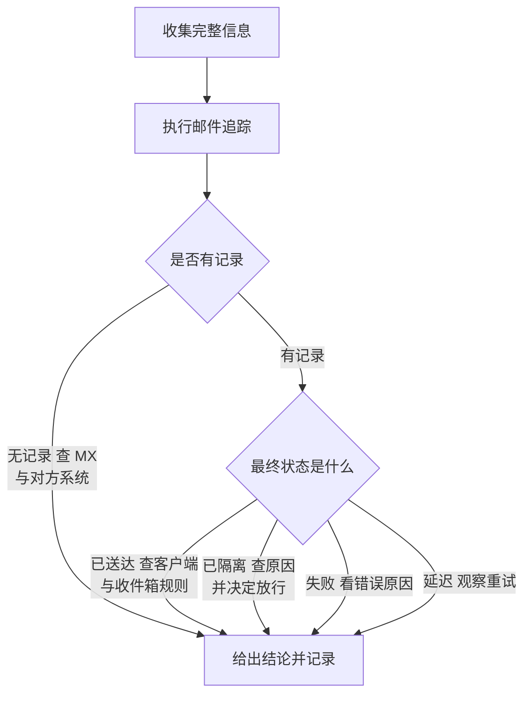

# 第3篇 邮件 · 第5节 邮件追踪与问题分析

> **所属：** 第3篇 邮件：Exchange Online 配置与迁移。  
> **本节小节：** 3.36 ～ 3.42。  
> **本节性质：** 技能训练。本节不改配置，但**必须在切换 MX 之前掌握**——切换当天最常被问的就是“邮件去哪了”。  
> **前置条件：** 已完成[第4节](04-邮件安全与反钓鱼.md)。  
> **导航：** [返回第3篇目录](README.md)｜上一节：[邮件安全与反钓鱼](04-邮件安全与反钓鱼.md)｜下一节：[迁移方式选择](06-迁移方式选择.md)

---

## 3.36 本节目标

完成本节后应当能够：

1. 用邮件追踪回答“这封邮件到底有没有到、到哪一步了”。
2. 看懂邮件头中的关键信息，判断身份验证与判定结果。
3. 按标准流程处理“收不到邮件”和“邮件被误判”两类高频问题。
4. 具备切换当天的邮件监控能力。

> **必做：** 切换 MX 之前，至少让**两名管理员**各自独立完成一次完整的邮件追踪练习。切换当天临时学工具，会显著拖长故障处理时间。

---

## 3.37 邮件追踪能回答什么

邮件追踪（消息跟踪）记录了邮件在 Exchange Online 中的处理过程。

| 能回答 | 不能回答 |
|---|---|
| 邮件是否到达 Microsoft 365 | 邮件在**对方系统内部**发生了什么 |
| 被投递、隔离、拒收还是延迟 | 用户是否真的读了邮件（追踪不是阅读回执） |
| 收件人是谁、有没有被转发 | 邮件正文内容 |
| 命中了哪条规则或策略 | 用户本地 Outlook 缓存问题 |
| 具体时间点与状态 | 超出保留期限的历史记录 |

### 3.37.1 查询时需要准备的信息

向用户索取以下信息，能大幅提高效率：

- [ ] 发件人地址（完整）。
- [ ] 收件人地址（完整）。
- [ ] **大致时间**（含日期，尽量精确到小时）。
- [ ] 邮件主题（部分即可）。
- [ ] 用户看到的错误提示或退信内容（**要原文截图**，不要转述）。
- [ ] 是所有邮件都有问题，还是只有这一封。
- [ ] 其他人是否也有同样问题。

> **推荐：** 把这份清单做成服务台的工单模板必填项。缺少时间和完整地址，是排查效率最大的杀手。

---

## 3.38 常见追踪状态的含义

| 状态 | 含义 | 下一步 |
|---|---|---|
| 已送达（Delivered） | 已投递到目标邮箱 | 转查客户端、收件箱规则或用户操作 |
| 已隔离（Quarantined） | 被安全策略拦下 | 查隔离原因，按第4节 3.33 处理 |
| 已筛选为垃圾邮件 | 投递到垃圾邮件文件夹 | 让用户检查垃圾箱；分析根因 |
| 失败（Failed） | 未能投递 | 看具体错误，常见为地址不存在、被规则拒收 |
| 待处理 / 延迟（Pending） | 正在重试 | 观察；可能是对方系统或临时问题 |
| 已展开（Expanded） | 发给通讯组后展开为成员 | 追踪展开后的各成员投递情况 |
| 已转发 | 邮件被转发 | **确认转发是否合规**（见第3节 3.23） |
| 已丢弃 | 按规则或策略丢弃 | 核对是哪条规则 |

### 3.38.1 追踪的排查顺序

> **验证点：** 如果**没有任何追踪记录**，说明邮件根本没进 Microsoft 365。这时应查 DNS（MX 是否已生效）和对方发件系统，而不是继续在租户里找。切换期间这种情况很常见。

---

## 3.39 邮件头分析基础

邮件头记录了邮件的传输和检查过程。看懂几个关键字段就够用了。

| 字段 | 含义 | 关注点 |
|---|---|---|
| `From` | 用户看到的发件人 | 与实际发送域是否一致（冒充判断） |
| `Return-Path` / 信封发件人 | 传输层发件人 | 与 `From` 是否对齐（第2篇 2.37） |
| `Received` | 经过的服务器（自下往上读） | 判断真实来源与路径 |
| `Authentication-Results` | SPF/DKIM/DMARC 结果 | **排查投递问题的核心** |
| `spf=` | SPF 结果 | pass / fail / softfail / permerror |
| `dkim=` | DKIM 结果 | pass / fail / none |
| `header.d=` | DKIM 签名域 | 判断是否与显示域对齐 |
| `dmarc=` | DMARC 结果 | pass / fail |
| `compauth=` | 复合身份验证结果 | Microsoft 的综合判定 |
| 反垃圾相关头 | 判定分数与原因 | 判断为什么被判垃圾 |

### 3.39.1 两个典型判读

**场景一：我们发出的邮件进了对方垃圾箱**

让对方提供邮件头，检查：

| 结果 | 结论 | 处理 |
|---|---|---|
| `spf=fail` | 发信来源未登记 | 补进 SPF（第2篇 2.34） |
| `dkim=none` | 未配置 DKIM | 配置 DKIM |
| `dmarc=fail` 但 SPF/DKIM 都 pass | **域对齐问题** | 按第2篇 2.37 处理 |
| 全部 pass 仍进垃圾箱 | 对方策略或本域信誉问题 | 检查是否被列入信誉黑名单、内容是否触发规则 |

**场景二：外部邮件被我们判为垃圾**

检查发件方的验证结果：

| 结果 | 结论 | 处理 |
|---|---|---|
| 对方 `spf=fail`、`dkim=none` | 对方自身配置不合规 | **优先让对方修好**，而不是加白名单 |
| 对方全部 pass | 可能是内容或批量邮件判定 | 分析判定原因，评估限时允许项 |

> **必做：** 处理误判的原则是**修根因**。整域加白名单会给攻击者留下伪造该域的机会（第4节 3.29.3）。

---

## 3.40 “收不到邮件”标准处理流程

这是上线期最高频的工单类型。

| 步骤 | 动作 | 目的 |
|---|---|---|
| 1 | 收集完整信息（3.37） | 避免来回沟通 |
| 2 | 确认是单人还是多人 | 判断影响范围 |
| 3 | 执行邮件追踪 | 定位环节 |
| 4 | 无记录 → 查 MX 与对方系统 | 排除 DNS 与外部原因 |
| 5 | 有记录 → 按状态处理（3.38） | 精准处置 |
| 6 | 已送达 → 查垃圾箱、收件箱规则、已删除项 | 排除用户侧原因 |
| 7 | 给出结论并告知用户 | 闭环 |
| 8 | 记录到知识库 | 积累经验 |

### 3.40.1 容易被忽略的用户侧原因

| 原因 | 表现 |
|---|---|
| 收件箱规则把邮件移到了别处 | “邮件不见了”，其实在某个子文件夹 |
| 用户自己删除或存档 | 在已删除项目中能找到 |
| 客户端缓存或同步问题 | 网页版能看到，Outlook 看不到 |
| 用户看的是错误的账号/配置文件 | 多账号混用时常见 |
| 焦点收件箱/其他分类 | 邮件在“其他”标签下 |
| 阻止的发件人列表 | 用户自己曾把对方拉黑 |

> **推荐：** 服务台先问一句“**在网页版邮箱里能看到吗？**”。这一个问题能快速区分“服务端问题”和“客户端问题”，节省大量时间。

---

## 3.41 切换当天的邮件监控

MX 切换后的**前 4 小时和前 3 天**是关键观察期。

### 3.41.1 需要盯的指标

| 监控项 | 频率（切换当天） | 异常信号 |
|---|---|---|
| 是否已收到第一封外部邮件 | 切换后立即 | 30 分钟内无任何外部邮件进入 |
| 邮件流量趋势 | 每小时 | 流量明显低于历史同期 |
| 失败与退信数量 | 每小时 | 退信突增（常见于漏建邮箱或地址） |
| 隔离区新增数量 | 每 2 小时 | 大量正常邮件被隔离 |
| 旧系统是否还在收到邮件 | 每小时 | 说明 DNS 缓存未刷新或仍有旧 MX |
| 用户报障数量与类型 | 实时 | 集中出现同一类问题 |
| 服务健康状态 | 每小时 | 平台事件 |

### 3.41.2 切换当天的值守安排

- [ ] 至少一名管理员**专职**做邮件追踪，不兼做其他事。
- [ ] 一名网络/DNS 负责人待命。
- [ ] 服务台加强值班，使用统一的工单模板。
- [ ] 事先约定**回退触发阈值**和决策人（第2篇 2.28、本篇第9节）。
- [ ] 预先准备好用户通知模板（延迟、暂时收不到该怎么做）。

> **高风险：** 切换当天最危险的行为是“**边出问题边改配置**”。所有变更必须记录，并优先按预定回退方案处置，避免多人同时改动导致状态混乱。

---

## 3.42 测试用例与本节检查表

### 3.42.1 追踪技能练习用例

在切换**之前**用测试账号完成这些练习：

| 编号 | 练习 | 应掌握 |
|---|---|---|
| T1 | 追踪一封内部邮件 | 基本查询与状态判读 |
| T2 | 追踪一封外部发入的邮件 | 完整路径识别 |
| T3 | 故意发到不存在的地址，追踪失败原因 | 识别地址错误类型 |
| T4 | 发一封会被规则加提示的邮件 | 确认规则命中 |
| T5 | 查看一封被判垃圾的邮件在隔离区的原因 | 隔离处置 |
| T6 | 追踪发给通讯组的邮件 | 理解“已展开” |
| T7 | 导出一封外部邮件的邮件头并判读验证结果 | 邮件头分析 |
| T8 | 让外部邮箱回报我方邮件的验证结果 | 对外投递验证 |

### 3.42.2 本节完成检查表

- [ ] 至少两名管理员各自独立完成 T1～T8 全部练习。
- [ ] 服务台工单模板已包含完整信息采集清单（发件人、收件人、时间、主题、错误原文截图）。
- [ ] 已掌握“无追踪记录 = 邮件未进入 Microsoft 365”的判断方法。
- [ ] 已掌握邮件头中 `spf` / `dkim` / `header.d` / `dmarc` / `compauth` 的判读。
- [ ] 已建立“收不到邮件”标准处理流程，并交付服务台。
- [ ] 服务台已掌握“先问网页版能否看到”的快速分流技巧。
- [ ] 已掌握误判处理原则：优先修根因，不整域加白。
- [ ] 已定义切换当天的监控项、频率和异常信号。
- [ ] 切换当天的值守安排已确定（专职追踪人、DNS 负责人、服务台排班）。
- [ ] 已准备用户通知模板（切换期间邮件延迟的说明）。
- [ ] 已明确“切换期间不得随意改配置”的纪律和变更记录方式。

> **进入下一节的条件：** 云端邮件系统已建好、安全策略已生效、追踪技能已具备。**至此第 1～5 节完成，下面进入迁移部分。** 下一节选择迁移方式——这里有一个 2026 年的重要变化会影响第三方迁移工具，务必读到。
