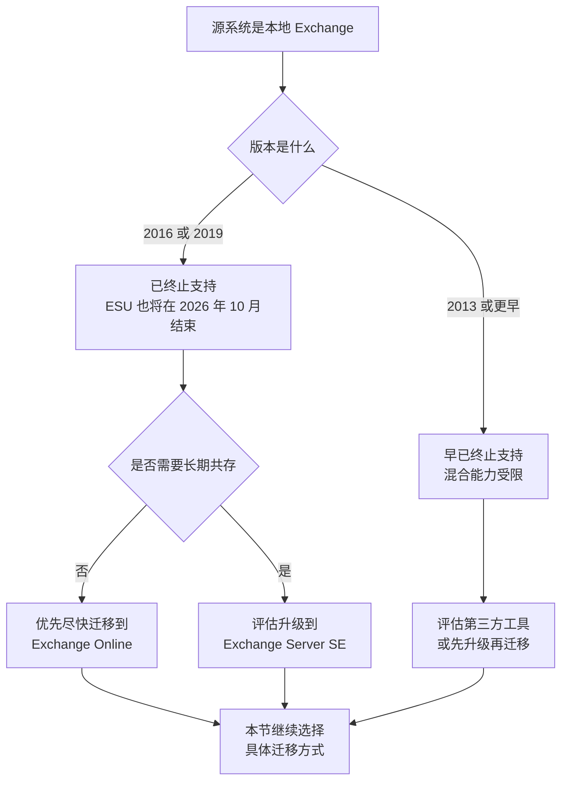
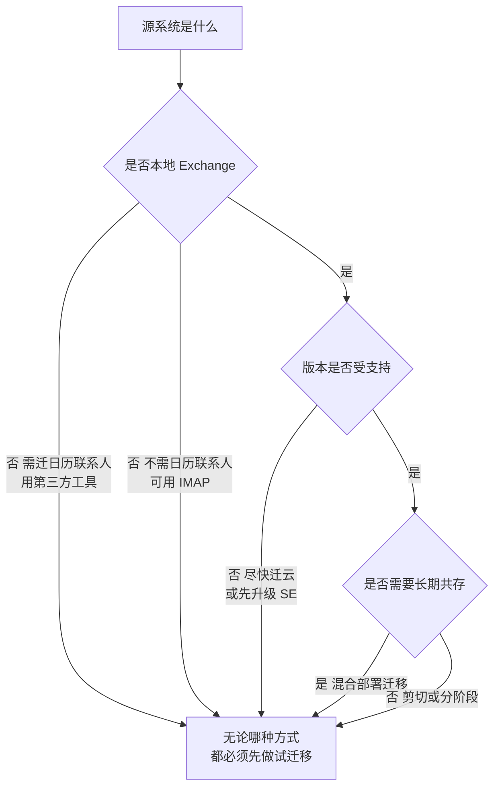

# 第3篇 邮件 · 第6节 迁移方式选择

> **所属：** 第3篇 邮件：Exchange Online 配置与迁移。  
> **本节小节：** 3.43 ～ 3.53。  
> **本节性质：** 方案决策。选错迁移方式会导致数据缺失、工期失控或反复返工。  
> **复核日期：** 2026-08-28。**本节含 2026 年 10 月生效的 EWS 变化，会直接影响第三方迁移工具，请务必读完 3.50。**  
> **前置条件：** 已完成第 1～5 节；第1篇 1.13 的邮箱系统调查已补齐。  
> **导航：** [返回第3篇目录](README.md)｜上一节：[邮件追踪与问题分析](05-邮件追踪与问题分析.md)｜下一节：[迁移准备与批次设计](07-迁移准备与批次设计.md)

---

## 3.43 迁移前必须确认的信息

选方式之前，这些信息必须是**确定值**，不能是“大概”：

| 信息 | 为什么决定方式 | 状态 |
|---|---|---|
| 源系统类型与版本 | 本地 Exchange？第三方邮件系统？其他云？ | 待填写 |
| 邮箱总数与总数据量 | 决定工期和批次 | 待填写 |
| 最大单个邮箱容量 | 是否超目标计划上限 | 待填写 |
| 源系统支持的接口 | IMAP / EWS / 厂商接口 / 只能导出 | 待填写 |
| 是否需要迁移日历、联系人、任务 | **IMAP 方式通常无法完整迁移这些** | 待填写 |
| 是否需要迁移共享邮箱与权限 | 权限通常需要单独还原 | 待填写 |
| 是否需要在线归档数据 | 归档数据迁移方式不同 | 待填写 |
| 是否有公共文件夹 | 迁移复杂，且有版本限制 | 待填写 |
| 是否需要共存期（新旧并行） | 决定是否必须混合部署 | 待填写 |
| 可接受的停机窗口 | 决定一次性切换还是分批 | 待填写 |
| 网络带宽与出口 | 决定实际迁移速度 | 待填写 |
| 源系统管理员权限 | 能否批量导出、能否创建迁移账号 | 待填写 |

> **必做：** “是否需要迁移日历和联系人”这一项**必须问业务部门**，不能由 IT 替用户假设。很多迁移事故是：技术上迁完了邮件，但销售发现三年的客户联系人和会议记录全没了。

---

## 3.44 迁移“邮件”和迁移“完整邮箱”不是一回事

| 数据类型 | 说明 | 哪些方式能迁 |
|---|---|---|
| 邮件（收件箱及文件夹） | 最基本的内容 | 几乎所有方式 |
| **日历与会议** | 含未来的会议和会议室预订 | IMAP 通常不行 |
| **联系人** | 个人通讯簿 | IMAP 通常不行 |
| 任务、便笺 | 部分用户依赖 | IMAP 通常不行 |
| 邮箱规则 | 用户自建的自动处理规则 | 多数方式不迁，需重建 |
| 签名 | 存在客户端或邮箱中 | 通常需重建 |
| **委派与权限** | 谁能打开谁的邮箱、代表发送 | 需单独还原 |
| 类别、标记、已读状态 | 影响用户观感 | 视工具而定 |
| 在线归档数据 | 历史归档 | 需专门处理 |
| 公共文件夹 | 组织共享文件夹 | 需专门迁移 |
| 自动回复设置 | 休假回复 | 通常需重建 |

> **高风险：** 用户对迁移是否成功的判断标准，往往是“**我的联系人和日历还在不在**”，而不是邮件总数。方案设计时必须把这两项列为一等公民。

---

## 3.45 方式一：IMAP 迁移

| 项目 | 说明 |
|---|---|
| 适用 | 源系统只支持 IMAP（很多第三方或自建邮件系统） |
| 能迁 | **仅邮件文件夹中的邮件** |
| 不能迁 | 通常不迁日历、联系人、任务 |
| 前提 | **目标邮箱必须先创建好** |
| 关键限制 | 首次批量迁移后，**新到源邮箱的邮件不会自动持续进入目标邮箱** |
| 认证 | 需确认源系统的认证方式（含 MFA 影响） |

官方说明见 [迁移多个邮箱到 Microsoft 365 的方式](https://learn.microsoft.com/en-us/exchange/mailbox-migration/mailbox-migration)。

> **高风险：** IMAP 迁移最常见的事故是把“首次批量迁移完成”当成“切换完成”。正确做法是：批量迁移 → **停写源系统 / 切 MX** → 执行最后一次增量 → 核对差异。详见第9节。

---

## 3.46 方式二：剪切迁移（Cutover）

| 项目 | 说明 |
|---|---|
| 适用 | 源为本地 Exchange，且邮箱数量少、希望一次性切完 |
| 特点 | 一次性把全部邮箱迁移过去，之后统一切换 |
| 数量上限 | 官方说明最多可迁 **2000 个**邮箱，但**建议不超过 150 个** |
| 优点 | 流程相对简单，无需长期共存 |
| 缺点 | 切换集中，风险集中；用户需重建 Outlook 配置文件 |
| 停机 | 通常安排在周末或非工作时段 |

官方说明见 [关于剪切迁移需要了解的内容](https://learn.microsoft.com/en-us/exchange/mailbox-migration/what-to-know-about-a-cutover-migration)。

> **推荐：** 即使邮箱数在上限内，也**不要**因为“数量够就一次切”。判断依据应是：总数据量能否在停机窗口内迁完、服务台能否在一天内支持全部用户重配客户端。

---

## 3.47 方式三：分阶段迁移与混合迁移

### 3.47.1 分阶段迁移

- 适用于源为较早版本本地 Exchange、邮箱数量较多的场景。
- 按批次迁移邮箱，期间新旧系统并存。
- 需要目录同步配合。

### 3.47.2 混合部署迁移

| 项目 | 说明 |
|---|---|
| 适用 | 本地 Exchange 环境，邮箱多、要求平滑过渡、需要长期共存 |
| 优点 | 用户体验最平滑；日历忙闲共享、统一通讯簿；可按用户逐个迁移和回迁 |
| 缺点 | 架构最复杂，需要本地 Exchange 服务器、混合配置和证书等准备 |
| 前提 | 本地 Exchange 版本必须**受支持**（见 3.48） |
| 注意 | 邮箱迁完**不等于**可以立即拆掉本地 Exchange 和同步组件（第1篇已强调） |

> **必做：** 混合部署不是“更高级所以更好”，而是“更平滑但更复杂”。中小企业若邮箱数量不多、能接受一次性切换，剪切或第三方工具往往更划算。

---

## 3.48 【重要】本地 Exchange 版本的支持状态

如果企业源系统是本地 Exchange，必须先确认版本支持情况，这会**直接影响混合迁移是否可行**。

| 事实 | 说明 |
|---|---|
| **Exchange Server 2016 和 2019 已于 2025 年 10 月 14 日终止支持** | 终止支持后服务器仍能运行，但存在安全风险，且无法正常获得支持 |
| 后续路径 | 迁移到 Microsoft 365 / Office 365，或升级到 **Exchange Server 订阅版（SE）** |
| 扩展安全更新（ESU） | 为需要更多时间完成迁移的客户提供；**该程序将于 2026 年 10 月结束，之后不再有更新** |
| 更早版本 | Exchange 2013 及更早版本早已终止支持 |
| 旧版公共文件夹 | 从 **Exchange Server 2010 及更早版本**向 Exchange Online 迁移公共文件夹，**自 2025 年 10 月 1 日起被阻止** |

官方说明见 [Exchange Server 2019 和 2016 终止支持路线图](https://learn.microsoft.com/en-us/troubleshoot/exchange/administration/exchange-2019-2016-end-of-support)。

### 3.48.1 对项目的影响

> **高风险：** 如果企业还在用已终止支持的本地 Exchange，**迁移的紧迫性比本文档其他任何事项都高**。这不是“做完 Microsoft 365 项目顺便处理”，而应作为项目的主要驱动理由写进立项材料。

---

## 3.49 方式四：PST 导入与手工方式

| 方式 | 适用 | 注意 |
|---|---|---|
| PST 导入服务 | 源系统只能导出为 PST；或需要导入历史归档 | 需按官方流程上传并映射到目标邮箱 |
| 用户自行导出导入 | 邮箱数量极少、无管理员接口 | **不推荐大规模使用**：易漏、易错、无法统一验证 |
| Outlook 直接拖拽 | 个别补迁 | 仅作为补救手段 |

> **必做：** 如果方案依赖用户自己导出 PST，必须评估三个风险：用户漏导、PST 文件损坏、以及**PST 分散在员工电脑上带来的数据泄露风险**。能用管理员集中方式就不要用用户手工方式。

---

## 3.50 【关键变化】第三方迁移工具与 EWS 退役

这是 2026 年选择迁移工具时**必须先确认的一件事**。

### 3.50.1 事实

| 项目 | 内容 |
|---|---|
| 变化 | 微软宣布，自 **2026 年 10 月 1 日**起，将开始**阻止非微软应用**向 Exchange Online 发起的 EWS 请求 |
| 范围 | 仅适用于 Microsoft 365 / Exchange Online；**Exchange Server（本地）不受影响** |
| 不受影响 | Outlook for Windows / Mac、Teams 及其他微软产品不受此变化影响 |
| 方向 | 微软建议应用改用 **Microsoft Graph** 访问 Exchange Online 数据 |
| 已知能力差距 | 微软公开提到 Graph 在归档邮箱访问、公共文件夹访问等方面仍存在差距，正在推进 |

官方公告见 [Exchange Online 中 EWS 的退役](https://devblogs.microsoft.com/microsoft365dev/retirement-of-exchange-web-services-in-exchange-online/)。

### 3.50.2 为什么这对迁移项目很关键

**很多第三方邮件迁移工具是通过 EWS 写入 Exchange Online 的。** 如果工具尚未改用 Graph，在阻止生效后可能无法继续工作。

> **必做：** 选择第三方迁移工具前，向厂商取得**书面确认**：
>
> - [ ] 该工具向 Exchange Online 写入数据时使用什么接口（EWS 还是 Graph）？
> - [ ] 是否已完成向 Microsoft Graph 的迁移？版本要求是什么？
> - [ ] 如果仍依赖 EWS，厂商的应对计划和时间表是什么？
> - [ ] 迁移归档邮箱、公共文件夹时使用什么接口？
> - [ ] 如需临时豁免机制，具体条件和有效期是什么？

同时：

- 关注租户**消息中心**的相关通知，微软会发布用量识别与过渡信息。
- 项目排期时应把这一时间点作为**硬约束**纳入考虑，尤其是长周期、大数据量的分批迁移。
- 本条时效性很强，**实施前请重新核对官方公告的最新状态与具体机制**。

### 3.50.3 选择第三方工具的其他核对项

- [ ] 能否迁移日历、联系人、任务、权限、规则。
- [ ] 能否做增量迁移（这是切换成败的关键，见第9节）。
- [ ] 失败项是否有清单、能否重试。
- [ ] 是否支持中文文件夹名和特殊字符。
- [ ] 能否生成可用于验收的报告。
- [ ] 数据是否经过第三方服务器？是否符合企业合规要求（**涉及数据出境时必须评估**）。
- [ ] 授权方式与费用（按邮箱数还是数据量）。
- [ ] 厂商支持时区与响应时效。

---

## 3.51 迁移方式选择表

| 源系统情况 | 邮箱数 | 需要日历/联系人 | 需要长期共存 | 建议方式 |
|---|---|---|---|---|
| 本地 Exchange（受支持版本） | 较多 | 是 | 是 | 混合部署迁移 |
| 本地 Exchange（受支持版本） | 少 | 是 | 否 | 剪切迁移 |
| 本地 Exchange（已终止支持） | 任意 | 是 | 否 | 优先尽快迁移；必要时先升级或用第三方工具 |
| 第三方/自建系统，仅支持 IMAP | 任意 | **是** | 否 | **第三方工具**（IMAP 无法迁日历联系人） |
| 第三方/自建系统，仅支持 IMAP | 任意 | 否 | 否 | IMAP 迁移 |
| 其他云邮箱服务 | 任意 | 是 | 否 | 厂商接口或第三方工具 |
| 只能导出 PST | 少 | 是 | 否 | PST 导入 |
| 有公共文件夹 | — | — | — | 单独规划公共文件夹迁移，注意版本限制 |

### 3.51.1 决策流程

---

## 3.52 迁移方式对业务的影响对照

| 方式 | 用户感知 | 需重建 Outlook 配置 | 停机窗口 | 复杂度 |
|---|---|---|---|---|
| 混合部署 | 最小 | 通常不需要 | 短 | 高 |
| 剪切迁移 | 明显 | **需要** | 集中 | 中 |
| 分阶段迁移 | 中等 | 视情况 | 分散 | 中高 |
| IMAP 迁移 | 明显 | **需要** | 视安排 | 低 |
| 第三方工具 | 视工具 | 通常需要 | 可分批 | 中 |
| PST 导入 | 明显 | 需要 | 视安排 | 低但易漏 |

> **推荐：** 把这张表给业务负责人看，让业务参与选择。“用户要不要重新配 Outlook、要停多久”是业务最关心的，也是决定支持成本的关键。

---

## 3.53 本节完成检查表

- [ ] 源系统类型、版本、接口能力已确认（非估计值）。
- [ ] 邮箱总数、总数据量、最大单个邮箱容量已统计。
- [ ] **已向业务部门确认是否需要迁移日历、联系人、任务**。
- [ ] 已确认是否需要迁移共享邮箱、权限、归档和公共文件夹。
- [ ] 已确认可接受的停机窗口和是否需要共存期。
- [ ] 若源为本地 Exchange：已确认版本支持状态（2016/2019 已于 2025-10-14 终止支持，ESU 至 2026 年 10 月结束）。
- [ ] 若涉及旧版公共文件夹：已确认 Exchange 2010 及更早版本的迁移限制。
- [ ] **若使用第三方工具：已取得厂商关于 EWS / Microsoft Graph 的书面确认**（对应 2026-10-01 起 EWS 阻止非微软应用）。
- [ ] 已核对第三方工具的增量迁移、失败重试、中文支持、报告和数据合规能力。
- [ ] 涉及数据出境的工具已通过合规评估。
- [ ] 已按选择表和决策流程确定迁移方式，并书面说明理由。
- [ ] 已向业务负责人说明所选方式的用户影响（是否需重配 Outlook、停机多久）。
- [ ] 已把 EWS 时间点和 ESU 结束时间纳入项目排期约束。
- [ ] 已计划在正式迁移前完成**试迁移**（第8节）。

> **进入下一节的条件：** 迁移方式已确定并获批准。下一节做迁移准备与批次设计——包括映射表、容量核对、批次划分和停机窗口设计。
