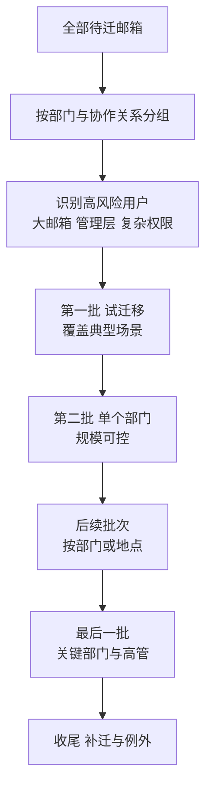
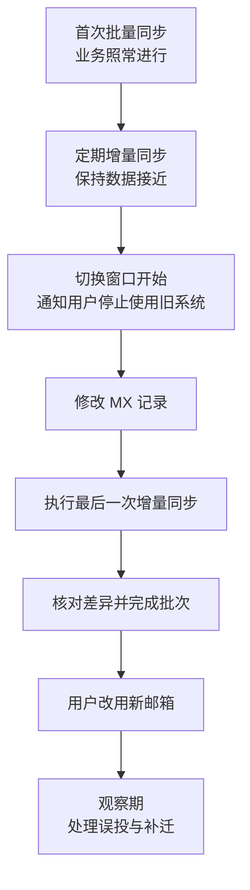

# 第3篇 邮件 · 第7节 迁移准备与批次设计

> **所属：** 第3篇 邮件：Exchange Online 配置与迁移。  
> **本节小节：** 3.54 ～ 3.65。  
> **本节性质：** 计划与准备。本节做得细，迁移就顺；本节偷工减料，问题会集中在切换当天爆发。  
> **前置条件：** 已完成[第6节](06-迁移方式选择.md)，迁移方式已确定并获批准。  
> **导航：** [返回第3篇目录](README.md)｜上一节：[迁移方式选择](06-迁移方式选择.md)｜下一节：[执行迁移与试迁移](08-执行迁移与试迁移.md)

---

## 3.54 本节目标

完成本节后应当产出五份可执行的文档：

1. **源邮箱与目标账号映射表**（谁迁到哪里）。
2. **容量与异常项核对结果**（哪些会失败，怎么处理）。
3. **批次划分表**（谁在第几批，什么时候）。
4. **停机窗口与业务通知方案**。
5. **回退条件与回退步骤**。

> **必做：** 这五份文档必须经**业务负责人签字**。迁移不是纯技术工作：哪些部门什么时候切、能停多久、出问题谁拍板回退，都需要业务决策。

---

## 3.55 源邮箱与目标账号映射表

这是迁移的“施工图纸”。每一行代表一个要迁移的对象。

| 字段 | 说明 | 示例（虚构） |
|---|---|---|
| 序号 | 唯一编号 | 001 |
| 源邮箱地址 | 迁移来源 | `zhangsan@contoso.com` |
| 源登录名 | 部分方式需要 | `contoso\zhangsan` |
| 目标账号 | 云端 UPN | `zhangsan@contoso.com` |
| 对象类型 | 用户/共享/会议室 | 用户邮箱 |
| 源数据量 | 实际已用容量 | 8.6 GB |
| 项目数 | 邮件总数 | 42,000 |
| 最大单封邮件 | 检查限制 | 22 MB |
| 需迁日历/联系人 | 业务确认结果 | 是 |
| 有委派/代理权限 | 需单独还原 | 是（李四完全访问） |
| 有邮箱规则 | 需重建 | 是（3 条） |
| 有自动转发 | **需审查** | 无 |
| 移动设备数 | 切换后需重配 | 2 |
| 所属批次 | 批次编号 | 第 2 批 |
| 重点用户 | 是否需现场支持 | 是（销售总监） |
| 迁移状态 | 待迁/进行中/完成/失败 | 待迁 |
| 验证状态 | 是否已核对 | 待验证 |
| 备注 | 特殊情况 | — |

### 3.55.1 制作映射表的注意事项

- 源地址与目标地址**逐字核对**，特别注意大小写、点号和相似字符。
- 一个人可能有多个源邮箱（历史遗留），必须明确合并到哪个目标邮箱。
- 共享邮箱、会议室也要进映射表，不要只做用户邮箱。
- **离职人员的邮箱**要单独标注处理方式（迁移/归档/不迁）。
- 映射表要有版本号和修改记录，避免多人使用不同版本。

> **高风险：** 映射表出错的后果是**把 A 的邮件迁进了 B 的邮箱**。这属于数据泄露事件，处理起来非常麻烦。映射表必须**双人核对**后才能使用。

---

## 3.56 容量与异常项核对

在动手迁移前，用映射表的数据做四项核对：

### 3.56.1 四项必查

| 检查项 | 判断标准 | 处理方式 |
|---|---|---|
| **超容量邮箱** | 源数据量 > 目标计划上限 | 升级许可、启用存档、或先清理/归档历史数据 |
| **超大单封邮件** | 大于目标环境允许的邮件大小 | 提高限制（在允许范围内）或接受该邮件迁移失败 |
| **异常项目数** | 单文件夹项目数极高（例如收件箱十几万封） | 迁移前请用户整理到子文件夹 |
| **文件夹层级过深/名称异常** | 层级很深、含特殊字符 | 迁移前简化 |

### 3.56.2 处理超容量邮箱的三种做法

| 做法 | 说明 | 适合 |
|---|---|---|
| 升级许可 | 给该用户更高容量的计划 | 少量高价值用户 |
| 启用在线存档 | 历史邮件移入存档 | 长期积累型用户；**注意存档扩容需要时间** |
| 迁移前清理 | 用户自行删除或本地归档 | 有大量无用附件的邮箱 |

> **必做：** 处理超容量必须给用户**明确的截止日期和操作指引**。“请大家清理邮箱”这种通知通常没人执行，需要具体到“请在 X 日前把 2022 年以前的邮件处理完，否则将启用存档自动移动”。

---

## 3.57 需要单独处理的数据

这些内容通常**不会**被邮箱迁移工具自动带过去，必须单独安排：

| 项目 | 处理方式 | 责任人 | 状态 |
|---|---|---|---|
| 共享邮箱权限（完全访问/发送方式/代表发送） | 按第2节 3.12 清单还原 |  | 待完成 |
| 用户之间的邮箱与日历委派 | 手工还原 |  | 待完成 |
| 邮箱规则 | 导出旧规则，用户重建或管理员协助 |  | 待完成 |
| 邮件签名 | 用户重建；或用统一签名方案 |  | 待完成 |
| 自动回复 | 用户重建 |  | 待完成 |
| 通讯组成员与设置 | 第2节已创建，需核对 |  | 待完成 |
| 会议室未来预订 | 确认迁移方式或人工重订 |  | 待完成 |
| 在线归档数据 | 单独迁移计划 |  | 待完成 |
| 公共文件夹 | 单独迁移计划（注意版本限制） |  | 待完成 |
| 移动设备配置 | 用户重新添加账号 |  | 待完成 |
| 第三方系统集成（CRM 邮件插件等） | 重新对接并测试 |  | 待完成 |
| 邮件网关、归档系统 | 确认切换后的邮件路径 |  | 待完成 |

> **推荐：** 邮箱规则和签名建议采用“**用户自助 + 指引**”方式，由 IT 提供图文步骤，而不是管理员逐个代做。但**委派权限必须由管理员还原并验证**，因为用户往往不知道自己被授权了什么。

---

## 3.58 批次划分原则

### 3.58.1 划分依据



### 3.58.2 划分规则

| 规则 | 原因 |
|---|---|
| 同一部门尽量同批 | 部门内部协作频繁，跨系统会造成日历和权限混乱 |
| 有委派关系的用户**必须同批** | 例如高管和助理分批迁移会导致权限中断 |
| 关键部门不放首批 | 首批用于发现问题 |
| 关键部门也不放最后一批之后 | 要留出观察和修复时间 |
| 每批规模不超过服务台当天支持能力 | 避免工单积压 |
| 大邮箱用户提前评估或单独安排 | 迁移时间长 |
| 避开业务高峰 | 财务月结、销售冲量、生产旺季 |
| 出差人员单独安排 | 需要网络和现场支持 |

> **高风险：** “有委派关系的用户必须同批”这条最常被忽略。总经理和助理如果分在两批，中间那段时间助理无法访问总经理邮箱——这类问题通常会直接升级到管理层。

---

## 3.59 批次表模板

| 批次 | 计划日期 | 对象范围 | 邮箱数 | 数据量 | 负责人 | 现场支持 | 进入条件 | 完成条件 |
|---|---|---|---|---|---|---|---|---|
| 试迁移 | 待定 | 项目组 3～5 人（含大邮箱、共享邮箱、有权限用户） | 5 | — |  | 是 | 方案已批准 | 验证全部通过 |
| 第1批 | 待定 | IT 部 | — | — |  | 是 | 试迁移问题已关闭 | 无 P1/P2 |
| 第2批 | 待定 | 某个业务部门 | — | — |  | 是 | 第1批稳定 | 无 P1 |
| 第3批 | 待定 | 其他部门 | — | — |  | 部分 | 第2批稳定 | 无 P1 |
| 第4批 | 待定 | 财务、管理层及助理 | — | — |  | 是 | 前批全部稳定 | 无 P1 |
| 收尾 | 待定 | 出差、休假、例外 | — | — |  | 按需 | — | 清零 |

---

## 3.60 首次迁移与增量迁移

这是**迁移能否成功切换的核心概念**，必须理解清楚。

| 阶段 | 做什么 | 用户能否继续用旧系统 |
|---|---|---|
| **首次（初始）同步** | 把历史邮件批量搬到云端，耗时最长 | **可以**（业务不中断） |
| **增量同步** | 把首次同步之后新产生的邮件补过来 | 可以 |
| **最后一次增量** | 停止在旧系统产生新数据后，把最后的差异补齐 | 不可以（已停写） |
| **完成切换** | MX 指向云端，用户改用新邮箱 | — |



> **必做：** 确认所选方式/工具**支持增量同步**。如果不支持（例如某些 IMAP 场景），必须设计人工补迁方案：切换后从旧系统把这段时间的新邮件单独导出并导入。这一点在第6节 3.45 已提示，本节要落实成具体步骤和责任人。

---

## 3.61 迁移速度与时间窗口估算

### 3.61.1 估算公式

```text
预估传输时间 = 总迁移数据量 ÷ 实际有效吞吐量
```

但实际速度受以下因素影响，**公式只能用于初估**：

| 影响因素 | 说明 |
|---|---|
| 源系统限流 | 很多系统会限制并发连接和速率 |
| 服务端限流 | 目标服务也有保护机制 |
| 网络带宽与稳定性 | 上行带宽通常是瓶颈 |
| 并发邮箱数 | 并发过高可能反而变慢或触发限流 |
| 邮件构成 | 大量小邮件比少量大邮件更慢 |
| 失败重试 | 异常项会拖慢整体 |
| 迁移时段 | 白天与源系统业务争抢资源 |

### 3.61.2 正确的估算方法

> **必做：** **用试迁移的实测速度**来校准估算，而不是用理论带宽。做法是：
>
> 1. 试迁移中选一个中等大小（例如 5～10 GB）的邮箱，记录实际耗时。
> 2. 算出每小时实际迁移量。
> 3. 用这个实测值推算总工期，并留出 **30%～50% 余量**。
> 4. 如果实测速度不足以在计划窗口内完成，**先解决速度问题或调整批次**，不要硬上。

---

## 3.62 停机窗口设计

### 3.62.1 需要明确的时间点

| 时间点 | 内容 | 谁执行 |
|---|---|---|
| T-7 天 | 用户通知（第一次） | 项目经理 |
| T-2 天 | 调低 DNS TTL | 网络管理员 |
| T-1 天 | 冻结变更（不再新建/改邮箱、不改策略） | 管理员 |
| T-1 天 | 最后一次常规增量同步 | 管理员 |
| **T 时刻** | **通知用户停止使用旧系统**（停写） | 项目经理 |
| T+0.5 小时 | 修改 MX 与相关记录 | 网络管理员 |
| T+1 小时 | 执行最后一次增量同步 | 管理员 |
| T+2 小时 | 完成批次，验证收发 | 管理员 |
| T+3 小时 | 用户开始使用新邮箱、配置客户端 | 服务台 |
| **T+4 小时** | **回退决策点** | 决策人 |
| T+1 天 | 检查误投与补迁 | 管理员 |
| T+3 天 | 稳定确认 | 项目经理 |

### 3.62.2 时间安排建议

| 建议 | 原因 |
|---|---|
| 优先选**周五晚间或周六上午** | 留出周末缓冲，周一前恢复正常 |
| 不要选月末、月初 | 财务结账高峰 |
| 不要选长假前一天 | 出问题无人处理 |
| 保证有完整的值守窗口 | 至少覆盖切换后 4 小时 |
| 与关键客户往来高峰错开 | 减少业务影响 |

> **高风险：** 不要在“周五下午 5 点开始切、6 点下班”。切换后前几小时是问题高发期，必须有人在岗。

---

## 3.63 业务通知方案

### 3.63.1 通知内容要点

| 内容 | 说明 |
|---|---|
| 时间 | 明确的停机开始和预计恢复时间 |
| 影响 | 期间不要使用旧邮箱、可能短暂收不到邮件 |
| **要用户做什么** | 切换后如何登录新邮箱、如何配置 Outlook 和手机 |
| 数据说明 | 历史邮件会迁移过来；哪些内容需要用户自己重建（规则、签名） |
| 常见问题 | 提前回答 5～8 个高频问题 |
| 求助方式 | 服务台电话、群、值班时间 |
| 特别提示 | 期间如有紧急外部沟通，建议用电话 |

### 3.63.2 面向重点人群的额外沟通

- **管理层与助理**：提前一对一说明，安排现场支持。
- **销售、客服**：说明外部邮件可能短暂延迟，建议提前告知重要客户。
- **财务**：避开付款高峰，并重申账号变更须电话核实（第4节 3.34）。

---

## 3.64 回退条件与回退步骤

### 3.64.1 回退计划表

| 字段 | 内容要求 |
|---|---|
| 触发阈值 | 例如：切换后 2 小时内外部邮件完全无法接收；或迁移成功率低于约定值；或影响人数超过约定值 |
| 最晚决策时间 | 例如 T+4 小时；超过该时间继续操作会失去回退窗口 |
| 决策人 | 业务负责人 + IT 负责人共同确认 |
| 执行人 | 具体到人 |
| 回退步骤 | 按顺序：恢复 MX 与相关 DNS 记录 → 通知用户恢复使用旧系统 → 确认旧系统正常收发 |
| **增量数据处理** | 切换后已进入云端邮箱的新邮件，如何导出并补回旧系统、如何去重 |
| 用户通知 | 通知对象、渠道、模板、发布时间 |
| 验证方法 | 如何证明旧系统已恢复正常收发 |
| 证据位置 | DNS 截图、迁移报告、日志、审批记录保存路径 |
| 再次上线条件 | 哪些问题修复并重新测试后才能再次切换 |

### 3.64.2 关于回退的现实提醒

> **高风险：** 邮件切换的回退**不是干净的**。一旦 MX 已指向云端并接收了新邮件，回退后这些邮件在旧系统中不存在，必须导出补回，还可能产生重复。
>
> 因此正确的策略是：**把重点放在“不需要回退”上** —— 通过充分的试迁移、容量核对、映射表双人复核和分批推进来降低风险；回退作为最后手段，而不是常规选项。

---

## 3.65 本节完成检查表

- [ ] 源邮箱与目标账号映射表已完成，并经**双人核对**。
- [ ] 映射表包含用户邮箱、共享邮箱、会议室，且离职人员邮箱有明确处理方式。
- [ ] 超容量邮箱已识别并确定方案（升级许可/启用存档/迁移前清理），且已通知用户截止日期。
- [ ] 超大单封邮件、异常项目数、异常文件夹结构已核对并处理。
- [ ] 不随邮箱自动迁移的项目已列表并指定责任人（权限、委派、规则、签名、自动回复、归档、公共文件夹、移动设备、第三方集成）。
- [ ] 批次表已完成；**有委派关系的用户在同一批次**。
- [ ] 关键部门不在首批，且不在最后一批之后；每批规模匹配服务台能力。
- [ ] 已避开财务月结、业务高峰和长假前夕。
- [ ] 已确认所选方式支持增量同步；若不支持，人工补迁方案已明确到步骤和责任人。
- [ ] 迁移速度已用试迁移实测值校准，工期预留 30%～50% 余量。
- [ ] 停机窗口时间点已细化到小时，含停写、改 MX、最后增量、验证和**回退决策点**。
- [ ] 切换后至少 4 小时有人值守。
- [ ] 用户通知方案已准备（含要用户做什么、需自行重建的内容、常见问题、求助方式）。
- [ ] 管理层、销售客服、财务已有针对性沟通安排。
- [ ] 回退计划已书面化，含触发阈值、最晚决策时间、决策人、恢复步骤、**增量数据处理和去重方案**。
- [ ] 五份核心文档已经业务负责人签字。

> **进入下一节的条件：** 五份文档齐备并签字。下一节开始**实际执行**：创建迁移端点、做试迁移、验证结果、批量预迁移。
