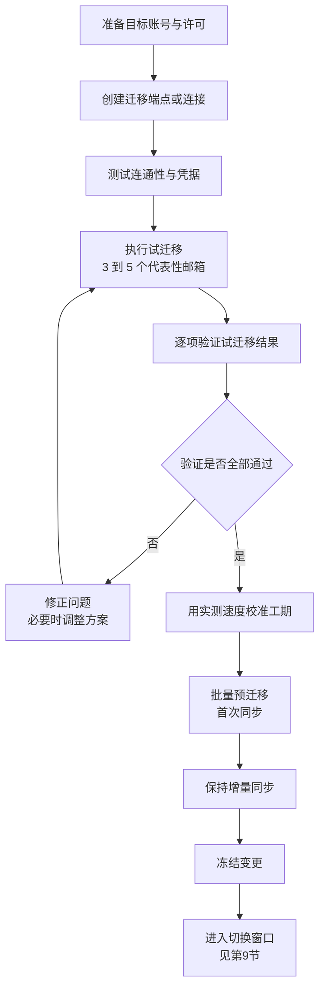

# 第3篇 邮件 · 第8节 执行迁移与试迁移

> **所属：** 第3篇 邮件：Exchange Online 配置与迁移。  
> **本节小节：** 3.66 ～ 3.74。  
> **本节性质：** 实际执行。本节开始搬运真实数据，但**尚未切换 MX**，业务仍在旧系统运行。  
> **前置条件：** 已完成[第7节](07-迁移准备与批次设计.md)，五份文档已签字。  
> **导航：** [返回第3篇目录](README.md)｜上一节：[迁移准备与批次设计](07-迁移准备与批次设计.md)｜下一节：[正式切换与验证](09-正式切换与验证.md)

---

## 3.66 本节目标与关键前提

完成本节后应当达到：

1. 迁移通道已建立并测试通过。
2. **试迁移已完成并逐项验证**，实测速度已用于校准工期。
3. 批量预迁移（首次同步）已完成，增量同步在正常运行。
4. 变更已冻结，具备进入切换窗口的条件。

> **必做：** 本节的核心纪律是：**试迁移不通过，绝不进入批量迁移。** 试迁移发现的每一个问题，在批量阶段都会放大几十倍。

---

## 3.67 准备目标账号与许可

批量迁移开始前确认：

- [ ] 映射表中的**每个**目标账号都已存在。
- [ ] 每个目标账号已分配含 Exchange Online 的许可，邮箱已成功创建。
- [ ] 共享邮箱、会议室已创建（第2节）。
- [ ] 超容量用户的方案已落实（升级许可或已启用存档）。
- [ ] 目标邮箱为空或状态明确（避免重复迁入造成重复邮件）。
- [ ] 邮件大小限制已按需调整（第3节 3.20）。
- [ ] 用户尚未开始使用云端邮箱收发（避免数据混杂）。

> **高风险：** 如果用户在迁移期间已经用云端新邮箱收发邮件，之后的迁移和增量同步可能造成**重复邮件**或顺序混乱。切换前应明确告知用户：**继续使用旧系统，不要提前使用新邮箱。**

---

## 3.68 创建迁移端点或迁移连接

不同方式的通道不同，但要确认的事情相同。

| 方式 | 需要准备 |
|---|---|
| IMAP 迁移 | 源服务器地址、端口、加密方式、认证方式、具备访问权限的账号 |
| 剪切/分阶段迁移 | 源 Exchange 的相关连接信息与具备权限的管理员账号 |
| 混合部署 | 混合配置已完成，相关连接与证书就绪 |
| 第三方工具 | 工具所需的源端与目标端授权（注意第6节 3.50 的接口确认） |
| PST 导入 | 按官方流程准备上传与映射文件 |

### 3.68.1 迁移账号的权限与安全

| 项目 | 要求 |
|---|---|
| 权限范围 | 满足迁移所需的最小权限，不要随手给最高权限 |
| MFA 影响 | 确认迁移账号的认证方式与 MFA 策略不冲突（可能需要在条件访问中做**限时**例外，并登记到期日期） |
| 凭据保管 | 迁移账号凭据按敏感信息管理，项目结束后**立即禁用或删除** |
| 记录 | 谁创建、用途、有效期、回收日期 |

> **必做：** 迁移账号是项目结束后最容易被忘记的高权限账号。请在批次表里就写好“**收尾任务：回收迁移账号**”，并纳入验收检查。

### 3.68.2 连通性测试

创建后先做小规模测试，确认：

- [ ] 能成功连接源系统并列出邮箱。
- [ ] 凭据有效，且不会因策略被阻断。
- [ ] 网络路径稳定（无中途断连）。
- [ ] 速率符合预期（为 3.70 的实测做准备）。

---

## 3.69 执行试迁移

### 3.69.1 试迁移对象选择（关键）

试迁移**不能只挑一个空的测试邮箱**。必须覆盖真实场景：

| 必须包含 | 原因 |
|---|---|
| 一个**大邮箱**（企业中较大的真实邮箱） | 验证速度与容量 |
| 一个**共享邮箱** | 验证共享对象迁移与权限 |
| 一个**有委派关系**的用户（如助理与领导中的一方） | 验证权限还原 |
| 一个**日历和联系人使用密集**的用户（如销售） | 验证非邮件数据 |
| 一个**移动办公用户** | 验证手机端体验 |
| 一个**文件夹结构复杂/含中文文件夹**的邮箱 | 验证兼容性 |
| 项目组自己的邮箱 | 便于反复测试 |

> **推荐：** 试迁移对象要**自愿参与并知情**，最好是能配合测试、愿意提反馈的同事。不要偷偷拿业务关键人物做试验。

### 3.69.2 试迁移执行步骤

1. 用映射表中的试迁移子集创建迁移批次。
2. 启动首次同步，**记录开始时间**。
3. 观察进度与错误提示。
4. 完成后**记录结束时间和实际迁移量**。
5. 导出迁移报告，保存失败项清单。
6. 进入验证环节（3.70）。

---

## 3.70 试迁移结果验证（逐项核对）

这是整个第3篇最重要的验证环节。**不要只看“状态：已完成”。**

### 3.70.1 验证清单

| 编号 | 验证项 | 方法 | 结果 |
|---|---|---|---|
| V1 | 邮件总数一致 | 对比源与目标的邮件数量（允许合理差异并说明） | 待验证 |
| V2 | 文件夹结构完整 | 逐层对比，含中文文件夹名 | 待验证 |
| V3 | 最早和最新的邮件都在 | 按时间排序检查两端 | 待验证 |
| V4 | 大附件邮件可正常打开 | 抽查若干封 | 待验证 |
| V5 | **日历完整**（含未来会议） | 对比未来 3 个月的会议 | 待验证 |
| V6 | 周期性会议正常 | 检查重复会议序列 | 待验证 |
| V7 | **联系人完整** | 对比数量与关键联系人 | 待验证 |
| V8 | 任务/便笺（如需要） | 对比 | 待验证 |
| V9 | 已读/未读状态合理 | 抽查 | 待验证 |
| V10 | 类别、标记（如需要） | 抽查 | 待验证 |
| V11 | 共享邮箱内容完整 | 同 V1～V4 | 待验证 |
| V12 | **共享邮箱权限可用** | 让成员实际打开并发信 | 待验证 |
| V13 | **委派关系可用** | 让被授权人实际访问 | 待验证 |
| V14 | 发送方式/代表发送正确 | 实际发信并检查显示的发件人 | 待验证 |
| V15 | 内部收发正常 | 实测 | 待验证 |
| V16 | 外部收发正常 | 实测（注意此时 MX 未切换，需按测试地址验证） | 待验证 |
| V17 | Outlook 新配置文件可自动配置 | 实测 Autodiscover | 待验证 |
| V18 | 手机端可正常使用 | 实测 | 待验证 |
| V19 | 失败项清单已分析 | 逐条给出原因与处理 | 待验证 |
| V20 | 实测速度已记录 | 用于工期校准 | 待验证 |

### 3.70.2 用户主观验证也要做

> **必做：** 除了技术核对，还要让试迁移用户回答三个问题：
>
> 1. 你的**联系人和日历**看起来完整吗？
> 2. 你日常最常用的功能（搜索、共享邮箱、代发）正常吗？
> 3. 有没有你觉得“不对劲”的地方？
>
> 用户往往能发现技术核对遗漏的问题，例如某个常用文件夹不见了、搜索结果不全。

---

## 3.71 常见试迁移问题与处理

| 现象 | 常见原因 | 处理 |
|---|---|---|
| 少量邮件迁移失败 | 单封超大、格式损坏、含异常字符 | 分析清单；重要邮件手工补迁 |
| 大量失败 | 凭据、权限、限流或方案不适用 | **暂停迁移**，重新评估 |
| 速度远低于预期 | 源系统限流、带宽不足、并发不当 | 调整并发、错峰迁移、评估带宽 |
| 日历/联系人没过来 | 方式本身不支持（如 IMAP） | 改用支持的工具或单独迁移这些数据 |
| 中文文件夹乱码 | 工具编码兼容问题 | 联系厂商；或调整文件夹名 |
| 权限没有还原 | 权限通常不随邮箱迁移 | 按第7节 3.57 手工还原 |
| 目标出现重复邮件 | 重复执行迁移，或用户已在云端使用 | 明确迁移记录；必要时清理重迁 |
| 邮箱容量超限报错 | 未处理超容量项 | 回到第7节 3.56 处理 |
| 迁移账号被策略阻断 | 条件访问或认证方式限制 | 设置**限时**例外并登记 |

> **高风险：** 出现“大量失败”时，正确反应是**停下来分析**，而不是反复重试。反复重试可能造成重复数据，并让问题更难定位。

---

## 3.72 批量预迁移（首次同步）

试迁移验证通过、工期已校准后，开始按批次执行首次同步。

### 3.72.1 执行纪律

| 纪律 | 说明 |
|---|---|
| 按批次表执行 | 不临时增删对象 |
| 记录每批的开始与结束时间 | 用于后续批次估算 |
| 每批完成后核对报告 | 失败项当天处理，不累积 |
| 控制并发 | 过高并发可能触发限流反而更慢 |
| 优先错峰 | 尽量在业务低峰时段运行 |
| 保持增量同步运行 | 让目标数据与源系统持续接近 |
| 监控源系统负载 | 避免影响仍在使用的旧邮件系统 |
| 每日进度通报 | 让项目组和业务了解状态 |

### 3.72.2 进度跟踪表

| 批次 | 计划邮箱数 | 已完成 | 失败 | 失败已处理 | 实际耗时 | 备注 |
|---|---|---|---|---|---|---|
| 试迁移 | 5 | — | — | — | — | 已验证 |
| 第1批 | — | — | — | — | — | — |
| 第2批 | — | — | — | — | — | — |

> **验证点：** 每批的“**已完成 + 失败 = 计划数**”必须成立。如果三个数字对不上，说明有对象被遗漏或状态未更新，必须查清。

---

## 3.73 冻结变更

进入切换窗口前 1 天开始冻结，避免状态不一致。

### 3.73.1 冻结内容

| 冻结项 | 原因 |
|---|---|
| 不新建、不删除邮箱 | 保持映射表与实际一致 |
| 不修改邮件地址和别名 | 避免投递错乱 |
| 不修改共享邮箱权限 | 便于对比还原结果 |
| 不调整条件访问和 MFA 策略 | 避免叠加故障 |
| 不修改邮件流规则 | 避免混淆问题来源 |
| 不做 DNS 其他变更 | 只做计划内的 MX/Autodiscover 变更 |
| 不部署新客户端版本 | 减少变量 |
| 人事变动例外处理 | 紧急入职离职需走特批并记录 |

### 3.73.2 冻结通知

- 通知管理员、服务台和业务负责人冻结的时间段。
- 说明例外审批流程（谁批、怎么记录）。
- 冻结解除后统一处理积压的变更请求。

> **必做：** 冻结期间的任何例外操作都要**书面记录**。切换出问题时，第一个要排除的就是“有人在窗口期改了别的东西”。

---

## 3.74 本节完成检查表

- [ ] 映射表中每个目标账号均已存在、已授权、邮箱已创建。
- [ ] 超容量用户方案已落实。
- [ ] 已明确告知用户在切换前**继续使用旧系统**，不要提前使用新邮箱。
- [ ] 迁移端点/连接已创建，连通性测试通过。
- [ ] 迁移账号使用最小必要权限，凭据受控，且已登记回收计划。
- [ ] 迁移账号与 MFA/条件访问的冲突已解决（例外为限时且已登记）。
- [ ] 试迁移对象覆盖大邮箱、共享邮箱、有委派用户、日历联系人密集用户、移动用户、复杂文件夹结构。
- [ ] 试迁移已完成，**V1～V20 全部验证并记录结果**。
- [ ] 试迁移用户的主观反馈已收集并处理。
- [ ] 失败项清单已逐条分析并有处理结论。
- [ ] **已用实测速度校准工期**，并确认能在计划窗口内完成。
- [ ] 若试迁移暴露方案性问题（如无法迁日历），已调整方案并重新试迁移。
- [ ] 批量预迁移已按批次执行，每批“已完成 + 失败 = 计划数”成立。
- [ ] 增量同步正常运行，且已验证增量确实生效。
- [ ] 每日进度通报机制已运行。
- [ ] 变更冻结已通知并生效，例外审批流程已明确。
- [ ] 切换窗口的值守安排、回退决策人已再次确认。

> **进入下一节的条件：** 试迁移全部验证通过、批量预迁移完成、增量同步正常、变更已冻结。下一节执行**正式切换**——修改 MX、最后一次增量同步、完成迁移并验证，这是全项目风险最集中的几个小时。
