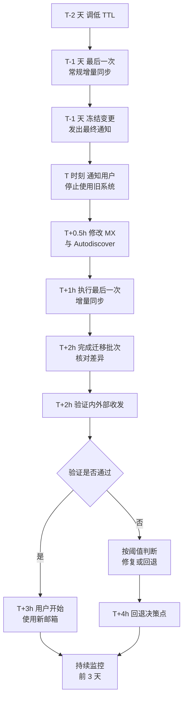

# 第3篇 邮件 · 第9节 正式切换与验证

> **所属：** 第3篇 邮件：Exchange Online 配置与迁移。  
> **本节小节：** 3.75 ～ 3.84。  
> **本节性质：** **全项目风险最集中的环节。** 本节修改 MX，企业邮件投递路径将真正改变。  
> **前置条件：** 已完成[第8节](08-执行迁移与试迁移.md)：试迁移验证通过、首次同步完成、增量同步正常、变更已冻结。  
> **导航：** [返回第3篇目录](README.md)｜上一节：[执行迁移与试迁移](08-执行迁移与试迁移.md)｜下一节：[客户端配置与旧系统下线](10-客户端配置与旧系统下线.md)

---

## 3.75 切换前的最终检查（放行清单）

**这份清单不通过，不得开始切换。** 建议由两人共同逐项确认并签字。

| 编号 | 检查项 | 确认人 | 状态 |
|---|---|---|---|
| G1 | 所有需要接收邮件的对象已在云端存在（第2节对照表全部通过） |  | ☐ |
| G2 | 全部别名与历史域名地址已添加 |  | ☐ |
| G3 | 共享邮箱已阻止登录，权限已还原 |  | ☐ |
| G4 | 通讯组、会议室已创建并核对 |  | ☐ |
| G5 | 邮件流规则已配置并测试 |  | ☐ |
| G6 | 邮件安全策略（EOP/Defender）已启用并测试 |  | ☐ |
| G7 | SPF 已包含全部合法发信来源 |  | ☐ |
| G8 | DKIM 已启用并验证签名生效 |  | ☐ |
| G9 | DMARC 已发布且处于可监控状态 |  | ☐ |
| G10 | 首次同步已完成，失败项已处理 |  | ☐ |
| G11 | 增量同步正常运行且已验证生效 |  | ☐ |
| G12 | **DNS TTL 已提前调低并已过原 TTL 周期** |  | ☐ |
| G13 | 变更前的 DNS 原值已**逐字**记录 |  | ☐ |
| G14 | 回退计划已批准，决策人和执行人在岗 |  | ☐ |
| G15 | 用户通知已发出，停写时间已明确告知 |  | ☐ |
| G16 | 服务台已排班，工单模板就绪 |  | ☐ |
| G17 | 邮件追踪技能已具备（第5节练习完成） |  | ☐ |
| G18 | 打印机、业务系统的发信改造已完成或有过渡方案 |  | ☐ |
| G19 | 变更冻结生效中 |  | ☐ |
| G20 | 服务健康状态正常，无进行中的平台事件 |  | ☐ |

> **高风险：** G12 最常被忽略。如果 TTL 还是 3600 秒甚至更长，切换后旧值可能在各地缓存中残留很久，**回退也会同样慢**。必须提前调低并等待原 TTL 周期过去。

---

## 3.76 切换时间轴



---

## 3.77 第一步：通知停写并停止旧系统使用

这是切换的**起点动作**，必须明确、强制。

| 动作 | 说明 |
|---|---|
| 发出停写通知 | 明确时间点：“从 X 时起请不要再用旧邮箱收发邮件” |
| 关闭旧系统的新邮件写入（如可行） | 例如在源系统层面限制，避免用户继续产生新数据 |
| 通知内容要具体 | 不要只说“系统维护”，要说清用户此刻该做什么、别做什么 |
| 重点人群单独确认 | 打电话或当面确认管理层、销售、客服已停止使用 |

> **必做：** 停写是保证“最后一次增量能覆盖全部数据”的前提。**如果有人在停写后继续在旧系统收发，这段邮件很可能丢失或需要事后手工补迁。**

---

## 3.78 第二步：修改 MX 与相关 DNS 记录

### 3.78.1 修改顺序与要点

1. 按变更表修改 **MX** 记录（使用管理中心给出的实际值）。
2. 修改 **Autodiscover** 记录（指向 Microsoft 365）。
3. 确认 **SPF** 记录已包含 Microsoft 365 的发信来源（通常在准备期已完成）。
4. 确认 **DKIM** CNAME 记录已存在并已启用。
5. 检查是否有**残留的旧 MX 记录**——必须删除，不能与新记录并存。
6. 不动网站 A/CNAME 记录和第三方验证记录。

### 3.78.2 修改后立即验证

```text
nslookup -type=MX contoso.com 8.8.8.8
nslookup -type=CNAME autodiscover.contoso.com 8.8.8.8
nslookup -type=TXT contoso.com 8.8.8.8
```

要求：

- [ ] 从**至少两个不同网络**查询（公司网络 + 手机热点）。
- [ ] 指定不同公共 DNS 查询，结果一致。
- [ ] **只有一组正确的 MX**，无旧记录残留。
- [ ] 截图留档，记录查询时间。

> **高风险：** 新旧 MX 同时存在是切换期最麻烦的状态：部分邮件进云端、部分进旧系统，用户会觉得“邮件时有时无”，且排查困难。修改后必须确认旧记录已删除。

---

## 3.79 第三步：执行最后一次增量同步

| 动作 | 说明 |
|---|---|
| 触发最后一次增量 | 把停写前产生的最后数据补齐 |
| 等待完成 | 不要在未完成时就宣布切换成功 |
| 核对差异 | 对比源与目标的邮件数量，重点看停写前最后几小时的邮件 |
| 记录结果 | 保存报告作为验收证据 |

### 3.79.1 IMAP 等不支持自动增量的场景

> **必做：** 如果所选方式**不支持增量同步**（第6节 3.45 已提示），此处必须执行事先设计的人工补迁：
>
> 1. 从旧系统导出“首次同步之后 → 停写时刻”这段时间的新邮件。
> 2. 导入到对应的云端邮箱。
> 3. 检查是否产生重复，并按方案去重。
> 4. 抽查若干用户确认这段时间的邮件确实存在。
>
> 这一步没做，用户会在切换后发现“最近几天的邮件不见了”。

---

## 3.80 第四步：完成迁移批次

- 在迁移工具或管理中心**完成/结束**该批次（不同方式的操作名称不同）。
- 确认目标邮箱已成为该用户的**主邮箱**（不再指向旧系统）。
- 混合环境下确认邮箱状态与路由已正确更新。
- 保存最终迁移报告。

> **验证点：** 完成批次后，源与目标之间的关系应当明确终止或转为单向，避免出现“两边都在收”的状态。

---

## 3.81 第五步：切换验证（必须实测）

**不要只看 DNS 记录和迁移报告就宣布成功。** 必须做真实收发测试。

### 3.81.1 验证用例（切换后 30 分钟内完成）

| 编号 | 测试内容 | 期望结果 | 状态 |
|---|---|---|---|
| C1 | 内部用户互发邮件 | 正常收发 | ☐ |
| C2 | **从外部邮箱（如个人邮箱）发到企业地址** | 进入 Exchange Online 邮箱 | ☐ |
| C3 | 从企业地址发到外部邮箱 | 正常送达，未进垃圾箱 | ☐ |
| C4 | 发到共享邮箱 | 正常收到 | ☐ |
| C5 | 以共享邮箱身份对外发信 | 发件人显示正确 | ☐ |
| C6 | 发到通讯组 | 全部成员收到 | ☐ |
| C7 | 会议室预订请求 | 按规则处理 | ☐ |
| C8 | 委派访问他人邮箱 | 可正常访问 | ☐ |
| C9 | 代表发送 / 发送方式 | 显示的发件人正确 | ☐ |
| C10 | 打印机、业务系统发信 | 正常送达 | ☐ |
| C11 | 新建 Outlook 配置文件（仅输入邮箱地址） | 自动配置成功 | ☐ |
| C12 | 手机端添加账号 | 正常收发同步 | ☐ |
| C13 | 检查外部收到邮件的邮件头 | SPF/DKIM/DMARC 结果符合预期 | ☐ |
| C14 | 检查隔离区 | 无大量正常邮件被拦 | ☐ |
| C15 | 抽查迁移数据（日历、联系人、大附件） | 完整可用 | ☐ |
| C16 | 确认旧系统不再收到新邮件 | 旧系统无新邮件进入 | ☐ |

### 3.81.2 抽查范围建议

| 抽查对象 | 数量建议 |
|---|---|
| 普通用户 | 每批抽查 10%，不少于 3 人 |
| 大邮箱用户 | **全部** |
| 共享邮箱 | **全部** |
| 有委派关系的用户 | **全部** |
| 管理层与助理 | **全部** |
| 会议室 | 抽查若干 |

> **必做：** 大邮箱、共享邮箱、委派关系和管理层**必须全部核对**，不能抽查。这些正是出问题后影响最大、最容易升级的对象。

---

## 3.82 第六步：处理退信、延迟、漏信与重复

### 3.82.1 常见问题对照

| 现象 | 常见原因 | 处理 |
|---|---|---|
| 外部发来的邮件退回“收件人不存在” | 该地址（常为别名）未在云端创建 | 立即补建别名，并请对方重发 |
| 部分邮件仍进旧系统 | DNS 缓存未刷新，或旧 MX 残留 | 确认无旧 MX；等待 TTL；必要时联系对方刷新 |
| 邮件延迟 | 传输重试或规则处理 | 邮件追踪确认状态，多数会自行送达 |
| 正常邮件被隔离 | 安全策略过严或对方验证不合规 | 按第4节 3.33 处理，优先修根因 |
| 用户说最近几天邮件缺失 | 最后一次增量未覆盖，或停写后仍在旧系统收发 | 执行补迁（3.79） |
| 出现重复邮件 | 重复迁移或人工补迁去重不当 | 按去重方案处理，必要时用工具清理 |
| 发出的邮件进对方垃圾箱 | SPF/DKIM/DMARC 或域信誉 | 查邮件头（第5节 3.39） |
| Outlook 反复要求输入密码 | Autodiscover 未生效、配置文件未重建 | 见下一节 |
| 手机收不到 | 需重新添加账号 | 见下一节 |

### 3.82.2 误投到旧系统的邮件

> **必做：** 切换后**至少连续 3 天**每天检查旧系统是否仍有新邮件进入。
>
> - 有新邮件 → 说明仍有发件方使用缓存的旧 MX，或存在旧记录残留。
> - 这些邮件必须**导出并补投**到云端邮箱，否则等于丢件。
> - 指定责任人每天执行并记录，直到连续 24 小时无新邮件。

---

## 3.83 回退决策

### 3.83.1 决策点与判断

| 时间 | 动作 |
|---|---|
| T+2h | 完成验证用例 C1～C16 |
| T+4h | **回退决策点**：由决策人根据实际结果判断 |

判断依据（阈值应在第7节 3.64 已填写具体值）：

| 情况 | 建议 |
|---|---|
| 外部邮件完全无法接收，且短时间内无法定位 | 考虑回退 |
| 大量正常邮件被拒收 | 先尝试定位（常为漏建地址），能快速修则不回退 |
| 迁移数据大面积缺失 | 考虑回退并重新规划 |
| 个别用户或个别功能异常 | **不回退**，单独处理 |
| DNS 部分未生效 | **不回退**，等待并监控 |

> **高风险：** 邮件切换的回退不干净（第7节 3.64 已说明）：已进入云端的新邮件在旧系统中不存在，需导出补回并可能产生重复。因此**回退的门槛应当高于普通变更**，且必须由决策人正式宣布，不能由执行人临时决定。

### 3.83.2 若决定回退

按第7节 3.64 的步骤执行，并特别注意：

1. 恢复 MX 与 Autodiscover 到**逐字记录的原值**。
2. 通知用户恢复使用旧系统（明确时间点）。
3. 导出切换期间进入云端的新邮件，补回旧系统。
4. 验证旧系统正常收发（用同样的 C1～C6 用例）。
5. 保留全部证据与日志。
6. 复盘并确定再次切换的前置条件。

---

## 3.84 本节完成检查表

- [ ] 放行清单 G1～G20 全部通过，且由两人签字确认。
- [ ] 停写通知已发出，重点人群已单独电话或当面确认停止使用旧系统。
- [ ] MX 与 Autodiscover 已按变更表修改，使用的是管理中心给出的实际值。
- [ ] **已确认无旧 MX 记录残留**，只有一组正确 MX。
- [ ] 已从至少两个不同网络、多个公共 DNS 验证解析结果并截图留档。
- [ ] 未误改网站记录和第三方验证记录。
- [ ] 最后一次增量同步已完成并核对差异。
- [ ] 若方式不支持增量：人工补迁已执行，并抽查确认该时段邮件存在。
- [ ] 迁移批次已完成，目标邮箱已成为主邮箱，最终报告已保存。
- [ ] 验证用例 C1～C16 全部执行并记录结果。
- [ ] 大邮箱、共享邮箱、委派关系用户、管理层**已全部核对**（非抽查）。
- [ ] 退信、延迟、漏信、重复问题已逐项处理并记录。
- [ ] 已安排责任人**连续至少 3 天**检查旧系统是否仍收到新邮件，并补投误投邮件。
- [ ] 回退决策点已按时执行，决策结论已记录（无论是否回退）。
- [ ] 切换期间的所有操作均有记录，未发生计划外的配置变更。
- [ ] 迁移账号仍在使用中的，已确认收尾回收计划。

> **进入下一节的条件：** 内外部收发验证通过、无 P1 故障。下一节处理**客户端配置**（Outlook、手机）和**旧系统下线**——注意“邮箱迁完”不等于“可以立刻拆掉旧系统”。
