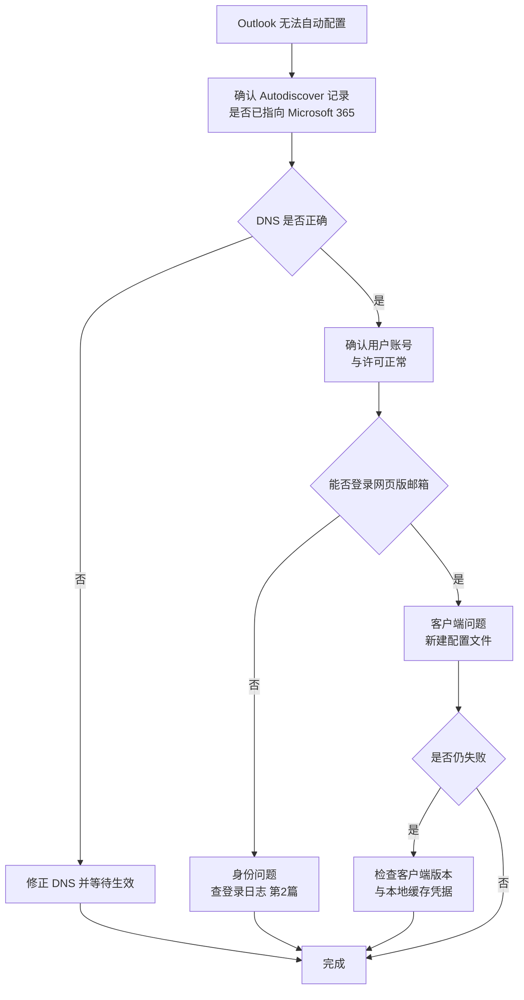
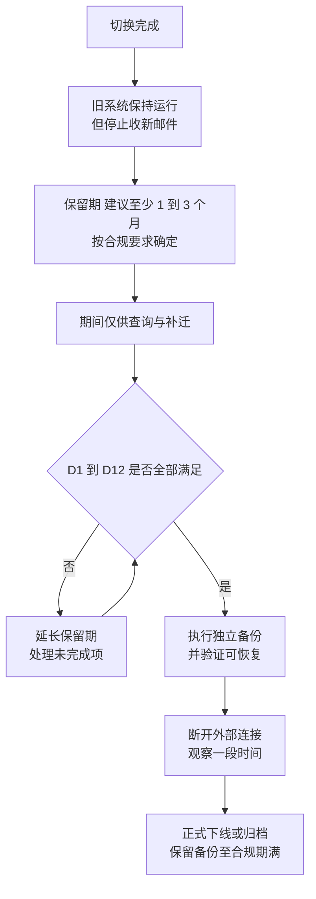

# 第3篇 邮件 · 第10节 客户端配置与旧系统下线

> **所属：** 第3篇 邮件：Exchange Online 配置与迁移。  
> **本节小节：** 3.85 ～ 3.94。  
> **本节性质：** 用户支持与收尾。技术难度低，但**工单量最大**；旧系统下线判断错误可能造成不可恢复的数据损失。  
> **前置条件：** 已完成[第9节](09-正式切换与验证.md)，切换验证通过。  
> **导航：** [返回第3篇目录](README.md)｜上一节：[正式切换与验证](09-正式切换与验证.md)｜下一节：[本篇小结与参考资料](11-本篇小结与参考资料.md)

---

## 3.85 本节目标

完成本节后应当达到：

1. 用户的 Outlook、手机和其他客户端已正常连接新邮箱。
2. 共享邮箱、代发、签名、规则、自动回复已恢复可用。
3. 旧邮件系统的保留期与下线条件已明确，并按流程执行。
4. 迁移结果已登记，具备验收条件。

---

## 3.86 Autodiscover 的工作方式

理解这一点，能解释大部分“Outlook 配不上”的问题。

Autodiscover 让客户端**只凭邮箱地址就找到邮箱所在位置**。切换后如果它仍指向旧系统，用户会遇到：反复要求输入密码、连到旧邮箱、或提示无法完成配置。

### 3.86.1 排查顺序

> **推荐：** 服务台第一句话仍然是“**在网页版邮箱能正常收发吗？**”。能，就是客户端问题；不能，就是身份或邮箱问题。这一句能节省大量时间。

---

## 3.87 重建 Outlook 配置文件

多数迁移方式（剪切、IMAP、第三方工具）在切换后**需要重建配置文件**。混合部署通常不需要。

### 3.87.1 标准步骤（给用户的指引）

1. 关闭 Outlook。
2. 在系统的邮件设置中**新建一个配置文件**（不要直接改旧的）。
3. 输入公司邮箱地址，让 Outlook 自动配置。
4. 完成现代身份验证登录（含 MFA）。
5. 设置为默认配置文件并打开 Outlook。
6. 等待邮件同步（大邮箱需要时间）。
7. 确认能收发、能看到日历和联系人。
8. 确认共享邮箱是否自动出现（如未出现见 3.88）。

### 3.87.2 常见问题

| 现象 | 原因 | 处理 |
|---|---|---|
| 反复要求输入密码 | 本地缓存了旧凭据 | 清理系统中保存的相关凭据后重试 |
| 提示无法连接服务器 | Autodiscover 未生效 | 确认 DNS |
| 旧邮件还在但收不到新邮件 | 仍在使用旧配置文件 | 切换到新配置文件 |
| 同步很慢 | 大邮箱首次同步 | 说明预期；可调整缓存时间范围 |
| 搜索结果不全 | 索引尚未完成 | 等待索引重建 |
| 旧版客户端无法登录 | 不支持现代身份验证 | 升级客户端（第1篇 1.15） |

> **必做：** 提前准备**图文指引**（截图版），而不是让服务台口头指导每个人。这是降低切换日工单时长最有效的手段。

---

## 3.88 共享邮箱与委派的客户端配置

| 场景 | 处理方式 |
|---|---|
| 共享邮箱未自动出现 | 手工在客户端添加该共享邮箱 |
| 需要以共享邮箱身份发信 | 确认已授予**发送方式**权限；在客户端发信时选择正确的发件人 |
| 需要代表发送 | 确认已授予**代表发送**权限 |
| 发出的邮件要保存在共享邮箱 | 按需配置“已发送邮件同时保存到共享邮箱” |
| 访问他人邮箱 | 确认委派权限已还原（第7节 3.57） |
| 日历委派 | 单独确认日历权限 |

### 3.88.1 必须实测的三件事

> **验证点：** 权限配置完成后，让**实际使用者本人**测试：
>
> 1. 能否打开共享邮箱并看到邮件？
> 2. 对外发信时，收件人看到的发件人是否正确？
> 3. 发出的邮件是否保存在预期位置（个人已发送 or 共享邮箱已发送）？
>
> 第 2 条最容易出问题，且往往是客户先发现。

---

## 3.89 手机端配置

| 项目 | 建议 |
|---|---|
| 推荐客户端 | **Outlook 移动版**（对现代身份验证和策略支持最好） |
| 系统自带客户端 | 部分可用，但行为不一致，建议统一改用 Outlook |
| 操作 | 通常需要**删除旧账号后重新添加** |
| MFA | 首次登录需完成验证（第2篇第9节） |
| 个人设备策略 | 若使用应用保护策略，需按第5篇要求配置 |
| 常见问题 | 旧账号残留导致重复通知；删除旧配置即可 |

> **推荐：** 手机端指引也做成图文，分 iOS 和 Android 两版。手机问题占切换期工单的相当比例，但绝大多数是同一个操作。

---

## 3.90 用户需要自行重建的内容

这些通常不随邮箱迁移，需要用户自助完成（IT 提供指引）：

| 项目 | 说明 | 指引形式 |
|---|---|---|
| 邮件签名 | 需重新设置；或由 IT 统一部署签名方案 | 图文 |
| 邮箱规则 | 旧规则清单已导出（第7节），用户按清单重建 | 图文 + 个人清单 |
| 自动回复 | 休假回复需重设 | 图文 |
| 收藏夹/快捷文件夹 | 客户端本地设置 | 图文 |
| 快捷联系人组 | 部分需重建 | 图文 |
| 类别与规则关联 | 视迁移结果 | 按需 |
| 桌面通知与视图设置 | 客户端偏好 | 按需 |

> **必做：** 把**每个用户自己的旧规则清单**发给本人。只发一份通用指引，用户往往不记得自己原来有哪些规则，等到几周后才发现邮件没有自动归档。

---

## 3.91 切换后的观察与支持

### 3.91.1 分时段重点

| 时段 | 重点 |
|---|---|
| 切换后 4 小时 | 内外部收发、客户端配置、退信 |
| 第 1 天 | 客户端工单、共享邮箱权限、手机端 |
| 第 2～3 天 | 误投旧系统的邮件补投；隔离区误判 |
| 第 1 周 | 规则与签名重建；日历与联系人反馈；搜索索引 |
| 第 2～4 周 | 长尾问题；出差返岗人员；第三方系统集成 |

### 3.91.2 需要持续跟踪的指标

- [ ] 每日邮件流量是否恢复到历史正常水平。
- [ ] 退信数量是否回落。
- [ ] 隔离区中正常邮件的比例。
- [ ] 旧系统是否仍收到新邮件（连续 3 天检查）。
- [ ] 工单数量与类型分布。
- [ ] 未完成客户端配置的用户名单（要清零）。

---

## 3.92 旧邮件系统的保留与下线条件

这是本节**风险最高**的部分。很多企业在这一步造成了不可恢复的数据损失。

### 3.92.1 下线前必须满足的条件

| 编号 | 条件 | 状态 |
|---|---|---|
| D1 | 全部邮箱迁移完成，失败项已处理并有结论 | ☐ |
| D2 | 数据完整性已抽查验证（含日历、联系人、大邮箱、共享邮箱） | ☐ |
| D3 | 连续至少 3 天旧系统无新邮件进入 | ☐ |
| D4 | 误投旧系统的邮件已全部补投 | ☐ |
| D5 | 公共文件夹、归档数据已按计划处理 | ☐ |
| D6 | 所有客户端已迁移到新邮箱，无人仍在使用旧系统 | ☐ |
| D7 | 打印机、业务系统的发信已全部改造完成 | ☐ |
| D8 | 第三方集成（CRM、OA、归档、网关）已切换并测试 | ☐ |
| D9 | **法务、审计、合规的保留要求已确认满足** | ☐ |
| D10 | 已按要求对旧系统数据做**独立备份**并验证可恢复 | ☐ |
| D11 | 已通过至少一个完整业务周期（如一个月结账周期） | ☐ |
| D12 | 下线方案与时间已经业务和管理层批准 | ☐ |

### 3.92.2 建议的下线节奏

> **高风险：** **“邮箱迁完了”不等于“可以拆掉旧系统”。** 混合部署场景尤其要注意：邮箱迁到云端后，本地 Exchange 可能仍承担目录属性管理等职责，不能简单卸载（第1篇已强调）。拆除前必须单独评估。

### 3.92.3 本地 Exchange 的特别提醒

如果源系统是本地 Exchange：

- **Exchange Server 2016 / 2019 已于 2025 年 10 月 14 日终止支持**；扩展安全更新程序将于 **2026 年 10 月**结束，之后不再有更新（第6节 3.48）。
- 如果因管理需要保留本地 Exchange，应评估升级到 **Exchange Server 订阅版（SE）**，而不是长期运行已终止支持的版本。
- 保留期间必须继续做补丁与安全防护；已终止支持的邮件服务器暴露在互联网上是重大风险。

---

## 3.93 迁移结果登记与验收

### 3.93.1 迁移结果登记表

| 项目 | 数值 | 证据位置 |
|---|---|---|
| 计划迁移邮箱数 | 待填写 |  |
| 成功迁移数 | 待填写 |  |
| 失败数 | 待填写 |  |
| 失败已处理数 | 待填写 |  |
| 迁移总数据量 | 待填写 |  |
| 实际总耗时 | 待填写 |  |
| 抽查邮箱数 | 待填写 |  |
| 发现并修复的问题数 | 待填写 |  |
| P1 故障数 | 应为 0 |  |
| P2 故障数 | 待填写 |  |
| 补投的误投邮件数 | 待填写 |  |
| 未完成客户端配置人数 | 应为 0 |  |

### 3.93.2 验收标准（需填具体值）

| 项目 | 标准 | 本项目取值 |
|---|---|---|
| 邮箱迁移成功率 | 不低于 `___%`（说明分母与统计时间） | 待填写 |
| 允许例外数 | 最多 `___` 项，每项有负责人和截止日期 | 待填写 |
| 大邮箱/共享邮箱/委派用户核对 | **100%** | 100% |
| 内外部收发测试 | 全部通过 | 必须满足 |
| 邮件身份验证 | 认证与域对齐通过 | 必须满足 |
| P1 故障 | 上线前为 **0** | 0 |
| 稳定观察期 | 连续 `___` 个工作日无新增严重故障 | 待填写 |
| 签字人 | 业务负责人、IT 负责人、安全负责人 | 待填写 |

---

## 3.94 本节完成检查表

- [ ] Autodiscover 已验证生效，新建配置文件可自动配置。
- [ ] 已提供 Outlook 重建配置文件的**图文指引**。
- [ ] 常见客户端问题（缓存凭据、旧配置文件、同步慢）已在指引中说明。
- [ ] 共享邮箱在客户端可见可用；**发件人显示正确已由使用者实测确认**。
- [ ] 委派与日历权限已还原并由被授权人实测。
- [ ] “已发送邮件保存位置”已按业务需要配置。
- [ ] 已提供手机端图文指引（iOS / Android），并推荐使用 Outlook 移动版。
- [ ] 已把**每个用户自己的旧邮箱规则清单**发给本人。
- [ ] 签名、自动回复、收藏夹等自助重建指引已发布。
- [ ] 未完成客户端配置的用户名单已跟踪至清零。
- [ ] 已连续至少 3 天检查旧系统新邮件并完成补投。
- [ ] 隔离区误判已处理，根因已修复。
- [ ] 第三方集成（CRM、OA、归档、网关）已切换并测试通过。
- [ ] 打印机与业务系统发信改造已全部完成（不再依赖过渡方案）。
- [ ] 旧系统保留期已确定，并满足法务、审计、合规要求。
- [ ] 旧系统数据已做**独立备份并验证可恢复**。
- [ ] 下线条件 D1～D12 已逐项确认。
- [ ] 若为本地 Exchange：已评估保留组件的必要性，并确认版本支持与安全防护方案。
- [ ] 迁移账号、临时例外项（条件访问、允许列表）已全部回收或关闭。
- [ ] 迁移结果登记表已填写完整，证据已归档。
- [ ] 验收标准已填入具体阈值并获签字。

> **进入下一篇的条件：** 邮件收发稳定、客户端配置清零、验收签字完成。下一节汇总本篇小结与参考资料；随后进入第4篇（终端与协作：Office、Teams、文件）。
