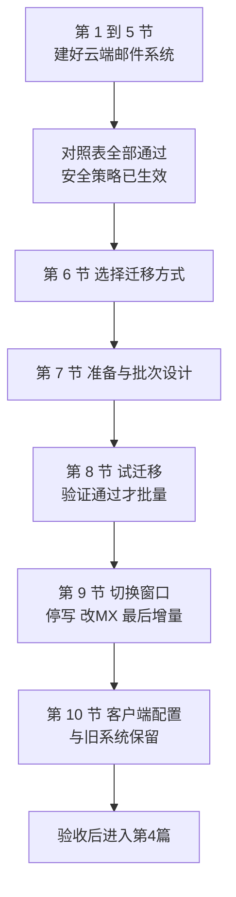

# 第3篇 邮件：Exchange Online 配置与迁移

> **本篇作用：** 先在云端建好邮件系统（邮箱、邮件资源、邮件流、安全防护），再把历史邮件迁移过来并完成 MX 切换。  
> **本篇性质：** **全项目对业务影响最大的一篇。** 出问题的直接后果是“公司收不到客户邮件”。  
> **文档状态：** 本篇正文已完成（11 个小节文件）。表格中的“待填写”是企业实际数据占位。  
> **版本与复核日期：** v1.0，2026-08-28。  
> **对应原章节：** 第5、6章。  
> **导航：** [返回方案总目录](../README.md)｜上一篇：[第2篇 基础建设](../02-基础建设-租户身份与MFA/README.md)

---

## 一、本篇小节文件

| 顺序 | 文件 | 覆盖小节 | 主要内容 | 风险等级 |
|---:|---|---|---|---|
| 1 | [Exchange Online 概念与邮箱类型](01-Exchange概念与邮箱类型.md) | 3.1–3.8 | 服务与客户端的区别、三类邮箱、共享邮箱硬性规则、邮件传递全过程 | 低（概念） |
| 2 | [邮箱与邮件资源配置](02-邮箱与邮件资源配置.md) | 3.9–3.17 | 创建邮箱与别名、共享邮箱三种权限、通讯组、会议室、**收件对象对照表** | 中高 |
| 3 | [邮件流规则与限制](03-邮件流规则与限制.md) | 3.18–3.24 | 服务限制、邮件流规则纪律、外部标识、**外部自动转发限制** | 高 |
| 4 | [邮件安全与反钓鱼](04-邮件安全与反钓鱼.md) | 3.25–3.35 | 四类威胁、EOP 与 Defender 边界、预设策略、冒充防护、隔离区、**BEC 与财务制度** | 高 |
| 5 | [邮件追踪与问题分析](05-邮件追踪与问题分析.md) | 3.36–3.42 | 邮件追踪、邮件头判读、“收不到邮件”标准流程、切换当天监控 | 低（技能） |
| 6 | [迁移方式选择](06-迁移方式选择.md) | 3.43–3.53 | 各迁移方式对比、**本地 Exchange 支持状态**、**EWS 退役对第三方工具的影响** | 高（决策） |
| 7 | [迁移准备与批次设计](07-迁移准备与批次设计.md) | 3.54–3.65 | 映射表、容量核对、批次划分、增量同步概念、停机窗口、回退计划 | 高 |
| 8 | [执行迁移与试迁移](08-执行迁移与试迁移.md) | 3.66–3.74 | 迁移端点、**试迁移与 V1–V20 验证**、批量预迁移、变更冻结 | 高 |
| 9 | [正式切换与验证](09-正式切换与验证.md) | 3.75–3.84 | **放行清单 G1–G20**、改 MX、最后一次增量、**验证 C1–C16**、回退决策 | **最高** |
| 10 | [客户端配置与旧系统下线](10-客户端配置与旧系统下线.md) | 3.85–3.94 | Outlook 与手机配置、权限实测、自助重建、**下线条件 D1–D12**、验收 | 中高 |
| 11 | [本篇小结与参考资料](11-本篇小结与参考资料.md) | — | 小结、32 项交付物、进入第4篇条件、18 项官方参考资料 | — |

---

## 二、实施顺序

> **必做：** 第 1～5 节全部完成、收件对象对照表逐项核对通过，才可以进入迁移执行；**试迁移验证通过**才可以批量迁移；**放行清单 G1～G20 通过**才可以切换 MX。

---

## 三、本篇六条硬性纪律

1. **先建齐所有收件对象，再切 MX** —— 漏一个别名就是一条业务通道中断。
2. **共享邮箱必须阻止登录** —— 逐个确认，不是抽查。
3. **试迁移不通过，绝不进入批量迁移。**
4. **有委派关系的用户必须同批迁移** —— 否则助理会在中途失去对领导邮箱的访问。
5. **切换前必须停写旧系统** —— 否则最后一次增量覆盖不全，用户会发现“最近几天邮件不见了”。
6. **邮件回退不干净** —— 重点放在“不需要回退”，回退门槛高于普通变更。

---

## 四、本篇三个关键时间线（实施前必须复核）

| 事项 | 状态 | 影响 |
|---|---|---|
| **EWS 退役** | 自 **2026-10-01** 起开始阻止非微软应用向 Exchange Online 的 EWS 请求 | **第三方迁移工具若仍依赖 EWS 可能停止工作**；选型前须取得厂商书面确认 |
| **Exchange Server 2016/2019** | 已于 **2025-10-14** 终止支持；ESU 程序于 **2026 年 10 月**结束 | 混合迁移可行性、旧系统保留期安全风险 |
| **旧版公共文件夹迁移** | 自 **2025-10-01** 起，Exchange 2010 及更早版本迁移被阻止 | 老旧公共文件夹需单独规划 |

---

## 五、本篇必须产出的结论

- [ ] 收件对象对照表（旧地址 → 云端对象），逐项核对通过。
- [ ] 共享邮箱三类权限与委派关系清单，且登录已阻止。
- [ ] 邮件流规则清单与外部转发例外登记。
- [ ] 邮件安全策略配置记录与冒充防护清单。
- [ ] 财务付款电话回拨与双人复核制度。
- [ ] 迁移方式选型说明（含第三方工具接口确认）。
- [ ] 源邮箱与目标账号映射表（双人核对签字）。
- [ ] 批次表（委派关系同批）与停机窗口时间表。
- [ ] 试迁移验证记录 V1～V20 与实测速度。
- [ ] 回退计划（含增量数据补回与去重方案）。
- [ ] 切换放行清单 G1～G20 与验证记录 C1～C16。
- [ ] 旧系统下线条件 D1～D12 与批准记录。
- [ ] 迁移结果登记表与验收签字。

完整交付物清单（32 项）见[本篇小结与参考资料](11-本篇小结与参考资料.md)。

---

## 六、阅读提示

- 提示标记 **必做 / 推荐 / 按需 / 高风险 / 验证点 / 回退点 / 许可证要求** 的含义见[方案总目录](../README.md)。
- 所有示例域名、邮箱、IP 和人员信息均为虚构数据。
- 本篇含多项 2025—2026 年的产品时间线，**实施前请按第11节末尾的“需要重点复核的时效性内容”重新核对官方页面**。
