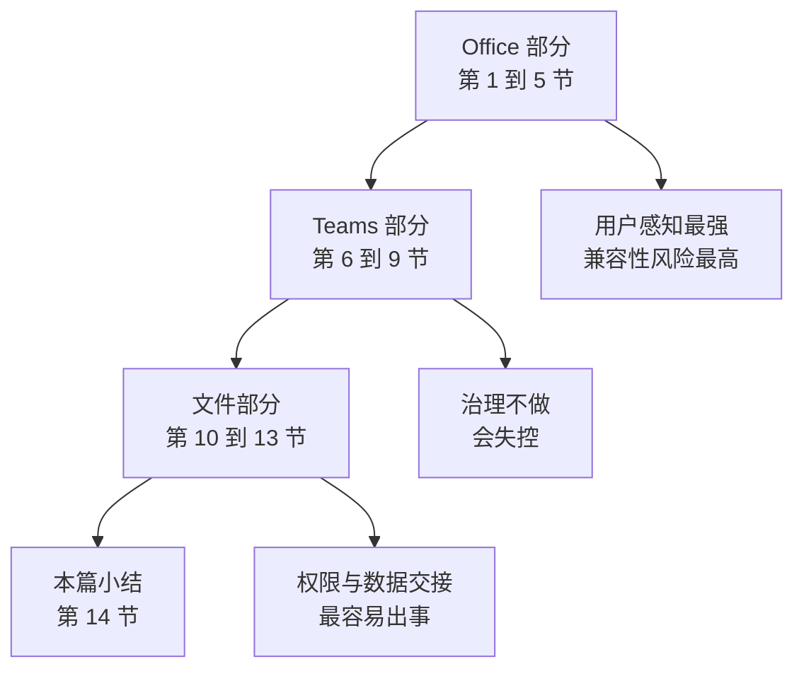
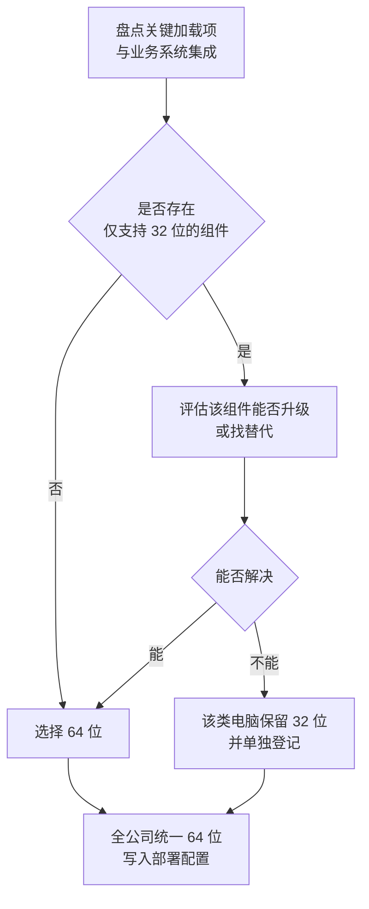

# 第4篇 终端与协作 · 第1节 Office 部署规划

> **所属：** 第4篇 终端与协作：Office、Teams、文件。  
> **本节小节：** 4.1 ～ 4.11。  
> **本节性质：** 规划与选型。本节不装软件，但结论决定后面的部署方式、许可和兼容性工作量。  
> **复核日期：** 2026-08-28。**本节含多项支持截止日期，其中 Office LTSC 2021 连接 Microsoft 365 服务的支持将于 2026-10-13 结束，请特别注意 4.5。**  
> **前置条件：** 已完成第3篇（邮件稳定）；第1篇 1.15 的 Office 现状调查已完成。  
> **导航：** [返回第4篇目录](README.md)｜下一节：[Office 兼容性调查与测试](02-Office兼容性调查与测试.md)

---

## 4.1 本篇在整个项目中的位置

第4篇处理**员工每天直接接触的三件事**：办公软件、沟通协作、文件存放。

与前三篇的区别：

| 篇 | 出问题的后果 |
|---|---|
| 第2篇 身份 | 用户登不进去 |
| 第3篇 邮件 | 公司收不到客户邮件 |
| **第4篇 终端与协作** | 用户能登录、能收邮件，但**干不了活**（宏跑不了、会议卡顿、文件找不到） |

> **推荐：** 第4篇可以与第3篇的收尾工作并行，但**不要与邮件切换窗口同期**进行，以便隔离故障来源。

---

## 4.2 本节目标

完成本节后应当产出一份**Office 部署方案**，明确回答：

1. 哪些人装桌面版，哪些人只用网页版或移动版。
2. 装 32 位还是 64 位。
3. 用哪个更新通道。
4. 装哪些应用（是否包含 Access、Publisher、OneNote 等）。
5. 怎么激活（普通激活还是共享电脑激活）。
6. 旧版 Office 怎么处理。
7. 用户自己装还是 IT 集中部署。
8. **现有操作系统和 Office 版本是否还在支持范围内。**

---

## 4.3 Microsoft 365 Apps 是什么

| 名称 | 含义 |
|---|---|
| **Microsoft 365 Apps** | 通过订阅获得的桌面版 Office（Word、Excel、PowerPoint、Outlook 等），持续更新 |
| **Office LTSC** | 一次性购买的永久授权版本，功能固定，有明确支持截止日期 |
| **Office 网页版** | 浏览器中使用，功能相对精简 |
| **Office 移动版** | 手机和平板上的应用 |

### 4.3.1 三个常见误解

| 误解 | 事实 |
|---|---|
| “Microsoft 365 = 网页版 Office” | 多数企业订阅包含**桌面版**安装权利，取决于许可（第1篇 1.26） |
| “装了桌面版就不用管更新” | 订阅版**持续更新**，需要规划更新通道和测试 |
| “Office 装好就一直能用” | 需要定期联网验证订阅状态（**每 30 天**，见 4.10.1） |

---

## 4.4 按人群规划，而不是“一套配置全公司”

| 用户画像 | 桌面版 | 网页/移动版 | 特殊需求 |
|---|---|---|---|
| 标准办公用户 | ✅ Word、Excel、PowerPoint、Outlook | ✅ | — |
| **财务/数据分析用户** | ✅ 必须 | 辅助 | **Excel 宏、插件、大文件、64 位** |
| 管理层与助理 | ✅ | ✅ | 邮箱委派、日历共享 |
| 销售/移动办公 | ✅ | ✅ 重要 | 手机端体验、离线可用 |
| 一线/车间/门店 | 视情况 | ✅ 为主 | 可能共享电脑 |
| 共享电脑用户 | ✅ | — | **共享电脑激活** |
| 远程桌面/虚拟桌面用户 | ✅ | — | 部署方式与许可需单独核对 |
| Mac 用户 | ✅ Office for Mac | ✅ | 插件与功能差异 |
| **完全无外网的机器** | ✅ 但须改用 Office LTSC | ❌ | **订阅版无法激活，见 4.10.4** |
| 外部来宾 | ❌ | 视授权 | 不按内部员工发许可 |

> **必做：** 这张表要落到**具体人名或部门**，不能停留在概念。它同时是许可采购的依据（第1篇 1.30）。

---

## 4.5 【重要】版本与操作系统的支持状态

这是本节最需要先确认的事，因为它可能**改变项目范围**（例如需要先升级 Windows）。

### 4.5.1 Office 连接 Microsoft 365 服务的支持

| 版本 | 连接 Microsoft 365 服务的支持状态 |
|---|---|
| **Microsoft 365 Apps** | 使用受支持版本即可 |
| **Office LTSC 2024** | 支持至 **2029-10-09** |
| **Office LTSC 2021** | 支持至 **2026-10-13** |
| **Office 2019 / Office 2016** | **已于 2023-10-10 结束** |
| Office 2016 for Mac / 2019 for Mac | 不支持连接 Microsoft 365 服务 |

官方说明见 [Office 版本与 Microsoft 365 服务连接支持](https://learn.microsoft.com/en-us/microsoft-365-apps/end-of-support/microsoft-365-services-connectivity)。

### 4.5.2 产品本身的支持（安全更新）

| 版本 | 产品支持结束 |
|---|---|
| Office 2016 / Office 2019 | **2025-10-14** |
| Office LTSC 2021 | 2026 年 10 月 |
| Office LTSC 2024 | 2029 年 10 月 |

> **必做：** 请区分这两件事：
> - **“能不能连 Microsoft 365 服务”** —— Office 2016/2019 在 2023-10-10 就已不受支持。
> - **“还有没有安全更新”** —— Office 2016/2019 在 2025-10-14 结束。
>
> 旧版本有时**仍然能连上**，但这不代表受支持，也不代表能长期稳定工作。

### 4.5.3 Windows 10 的影响（很多企业忽略）

| 事实 | 说明 |
|---|---|
| **Windows 10 已于 2025-10-14 终止支持** | 需要迁移到 Windows 11 |
| Microsoft 365 Apps 在 Windows 10 上的安全更新 | 在 Windows 10 终止支持后继续提供三年，至 **2028-10-10** 结束 |
| 功能更新 | Windows 10 上的设备在某个版本之后不再获得新功能更新，将**停留在该版本仅接收安全更新** |
| 建议 | 使用 Microsoft 365 Apps 的设备应迁移到 Windows 11 |

官方说明见 [Windows 10 终止支持与 Microsoft 365 Apps](https://learn.microsoft.com/en-us/microsoft-365-apps/end-of-support/windows-10-support)。

> **高风险：** 如果企业大量电脑仍是 Windows 10，本项目必须与 **Windows 11 升级计划**协同。否则会出现“Office 装好了但拿不到新功能、操作系统本身不受支持”的局面，而且这会连带影响设备管理和条件访问的合规策略（第5篇）。

### 4.5.4 版本盘点表

| 部门 | 电脑数 | Windows 版本 | Office 版本 | 32/64 位 | 是否受支持 | 处理方案 |
|---|---|---|---|---|---|---|
| 财务 | 待填写 | 待填写 | 待填写 | 待填写 | 待判定 | 待定 |
| 销售 | 待填写 | 待填写 | 待填写 | 待填写 | 待判定 | 待定 |
| 生产 | 待填写 | 待填写 | 待填写 | 待填写 | 待判定 | 待定 |

---

## 4.6 关于 Outlook 客户端的选择

Windows 上目前存在**两个 Outlook**，项目必须明确选哪个。

| 客户端 | 说明 |
|---|---|
| **经典 Outlook（classic）** | 传统桌面版，支持 COM 加载项、VBA 自动化、PST 等 |
| **新版 Outlook for Windows** | 新架构客户端，2024-08-01 起进入正式发布 |

关键事实：

- 通过 Microsoft 365 订阅（含桌面应用）或永久授权（如 Office LTSC）安装的**经典 Outlook，将至少支持到 2029 年**。
- 微软提供分阶段迁移路径，用户可通过开关切换到新版 Outlook，并可选择迁移设置和加载项。
- 新版 Outlook 与经典 Outlook 在**加载项模型、COM 自动化、PST 支持**等方面存在差异。

官方迁移阶段说明见 [迁移到新版 Outlook for Windows 的阶段](https://learn.microsoft.com/en-us/microsoft-365-apps/outlook/get-started/guide-product-availability)。

### 4.6.1 项目建议

| 企业情况 | 建议 |
|---|---|
| 依赖 Outlook COM 加载项、VBA 或业务系统集成 | **本期继续使用经典 Outlook**，并单独评估新版迁移 |
| 依赖本地 PST 文件 | 继续使用经典 Outlook |
| 无特殊集成、希望体验统一 | 可评估新版 Outlook，但要先做试点 |
| 无论选哪个 | **不要在邮件迁移期同时切换 Outlook 客户端**，避免混淆故障来源 |

> **必做：** 把“使用哪个 Outlook”写进部署方案。项目中最常见的混乱是：一部分人自己点了切换开关用了新版，另一部分是经典版，服务台按同一套指引支持，结果处处对不上。

---

## 4.7 32 位与 64 位的选择

| 项目 | 32 位 | 64 位 |
|---|---|---|
| 大文件处理能力 | 受限 | **更强**（大型 Excel、大数据量场景） |
| 旧加载项兼容性 | 较好 | 需确认加载项有 64 位版本 |
| 与旧业务系统集成 | 有时只支持 32 位 | 需验证 |
| 当前主流建议 | 逐步淘汰 | **一般首选**（除有明确兼容限制） |

### 4.7.1 决策方法

> **高风险：** 同一台电脑**不能混装** 32 位和 64 位的 Office 组件。如果决定改位数，通常需要**先卸载再安装**，这会影响用户，必须纳入部署计划和用户通知。

---

## 4.8 更新通道的选择

订阅版 Office 会持续更新。更新通道决定“多久收到新功能”。

| 通道类型 | 特点 | 适合 |
|---|---|---|
| 当前通道 | 最快获得新功能 | IT 与试点用户 |
| 每月企业通道 | 每月一次可预测的更新 | **多数企业的主力选择** |
| 半年度企业通道 | 更新频率最低、变化最少 | 对稳定性要求极高、有严格验证流程的场景（如生产控制终端） |
| 预览类通道 | 提前验证 | 仅限少量测试机 |

### 4.8.1 建议做法

- 建立**两级部署**：小规模“先行组”（IT + 试点用户）使用更快的通道，其余用户使用较稳的通道。
- 先行组提前发现宏和加载项问题，再放行到全员。
- 半年度通道虽稳，但**新功能滞后**，不建议全公司默认使用。

> **推荐：** 通道选择要写明理由并纳入变更管理（第6篇）。同时确认更新是由用户自动获取还是由 IT 管控，两者的支持方式完全不同。

---

## 4.9 要安装哪些应用

不要默认全装。逐项确认：

| 应用 | 是否安装 | 说明 |
|---|---|---|
| Word / Excel / PowerPoint | 通常必装 | — |
| Outlook（经典或新版） | 按 4.6 结论 | — |
| OneNote | 按需 | — |
| Access | **按需**（少数人用） | 有业务数据库依赖时才装 |
| Publisher | 按需 | — |
| Teams | 单独规划（第 6～9 节） | — |
| OneDrive 同步客户端 | 通常需要 | 见第 12 节 |
| 语言包与校对工具 | 中文环境通常需要 | 确认所需语言 |
| Visio / Project | **单独许可** | 需确认是否已采购 |

> **必做：** Access 和 Publisher 这类应用，只给真正需要的人安装。装得越多，兼容性测试面和更新风险就越大。

---

## 4.10 激活方式与特殊场景

### 4.10.1 常规激活与 30 天联网要求

用户用**工作账号登录** Office 完成激活，需要有效许可，并需要定期联网验证。具体规则：

| 环节 | 要求 |
|---|---|
| 首次启动 | **必须联网**，用工作账号登录完成激活 |
| 日常使用 | **每 30 天至少联网一次**，以连上 Office 授权服务 |
| 超过 30 天未联网 | 进入**功能受限模式**：文档只能查看和打印，**不能编辑、不能新建** |
| 恢复方式 | 重新联网并登录后自动恢复，无需重装 |

> **高风险：** 记住一句话：**安装可以离线，激活不行。** 用 U 盘离线装机（第3节 4.22.3）只解决安装这一步，那台电脑最终仍必须联网激活一次，之后每 30 天还要联网一次。长期外派和隔离网段的电脑必须单独评估，否则用户会遇到“Office 突然只能看不能编辑”，并误判为电脑故障或病毒。这类工单在服务台很常见，应写入知识库（第6篇）。

### 4.10.2 共享电脑激活

适用于**多人共用同一台电脑**的场景（车间、门店、值班室、培训教室）。

| 要点 | 说明 |
|---|---|
| 用途 | 允许多个用户在同一设备上使用 Office，而不占用各自的设备安装额度 |
| 前提 | 需要在部署配置中启用该模式，并确认许可支持 |
| 常见场景 | 共享终端、部分远程桌面/虚拟桌面场景 |
| 注意 | 每个用户仍需自己的有效许可；用户切换时需重新登录 |

### 4.10.3 远程桌面与虚拟桌面

- 部署方式与激活要求与普通电脑不同。
- **必须提前核对许可条款**是否覆盖该使用方式（第1篇 1.26）。
- 需要与虚拟桌面平台的管理员共同规划。

### 4.10.4 完全无外网的机器

如果某些电脑**永久无法访问互联网**（涉密网段、车间隔离网络），订阅版 Microsoft 365 Apps **不适用**——它既无法完成首次激活，也过不了 30 天的联网检查。

| 项目 | 说明 |
|---|---|
| **应选方案** | **Office LTSC 2024**：一次性购买的永久授权，可用企业内部 KMS 或 MAK 激活，完全不需要出网；同样用部署工具部署，配置文件写法基本一致 |
| 代价 | 功能固定在发布时的状态，不再获得新功能；连接 Microsoft 365 服务的支持至 **2029-10-09**（见 4.5.1） |
| 不要做的事 | 不要试图给这些机器“想办法”用订阅版，激活问题无解 |

> **必做：** 4.4 的人群表里如果盘点出“完全无外网的机器”，必须在**采购阶段**就把它拆成单独的许可需求（第1篇 1.30），不要等到部署时才发现装不了。

> **必做：** 共享电脑和虚拟桌面场景**必须在试点阶段实测**，不要假设“和普通电脑一样”。这两类场景是激活问题的高发区。

---

## 4.11 部署方式与本节检查表

### 4.11.1 用户自装 vs IT 集中部署

| 方式 | 优点 | 缺点 | 适合 |
|---|---|---|---|
| 用户自行安装 | IT 工作量小、上手快 | 版本和配置不统一、位数可能装错、旧版可能残留 | 小型企业、试点 |
| **IT 集中部署** | 配置统一、可控位数/通道/应用组合、可静默卸载旧版 | 需要部署工具与准备时间 | **多数企业的正式做法** |
| 混合 | 主力集中部署，个别自装 | 需要登记例外 | 过渡期 |

> **推荐：** 即使人数不多，也建议至少准备一份**标准部署配置文件**（第3节）。否则半年后你会面对“同一家公司里有 32 位、64 位、不同通道、不同应用组合”的局面，排查成本极高。

### 4.11.2 本节完成检查表

- [ ] 已完成 Windows 与 Office 版本盘点表（按部门/电脑）。
- [ ] 已确认哪些 Office 版本**已不受支持连接 Microsoft 365 服务**（2016/2019 已于 2023-10-10 结束）。
- [ ] 已确认 Office LTSC 2021 的连接支持将于 **2026-10-13** 结束，并有应对计划。
- [ ] 已确认 Windows 10 已于 2025-10-14 终止支持，并与 Windows 11 升级计划协同。
- [ ] 已了解 Microsoft 365 Apps 在 Windows 10 上的安全更新将于 2028-10-10 结束、功能更新会停止。
- [ ] 已按用户画像确定桌面版/网页版/移动版范围，并落到具体部门或人员。
- [ ] **已确定使用经典 Outlook 还是新版 Outlook**，并说明理由。
- [ ] 已确认不在邮件迁移期同时切换 Outlook 客户端。
- [ ] 已确定 32 位或 64 位，并处理仅支持 32 位的组件。
- [ ] 已确定更新通道，并建立“先行组 + 全员组”两级部署。
- [ ] 已确定要安装的应用清单（Access、Publisher 等按需）。
- [ ] Visio、Project 等单独许可的产品已确认采购状态。
- [ ] 已确定激活方式；共享电脑与虚拟桌面场景已确认许可与部署方式。
- [ ] 已向用户与服务台说明**激活需每 30 天联网一次**，超期进入功能受限模式。
- [ ] 已盘点是否存在**完全无外网的机器**；若有，已改用 Office LTSC 并单独列入采购需求。
- [ ] 已确定部署方式（用户自装 / IT 集中 / 混合），并准备标准配置。
- [ ] 已确定旧版 Office 的处理方式（保留还是卸载，见第3节）。
- [ ] 部署方案已经业务负责人和 IT 负责人确认。

> **进入下一节的条件：** 部署方案已确定。下一节做**兼容性调查与测试**——这是 Office 部署中唯一可能导致“业务停摆”的环节，必须在批量部署之前完成。
