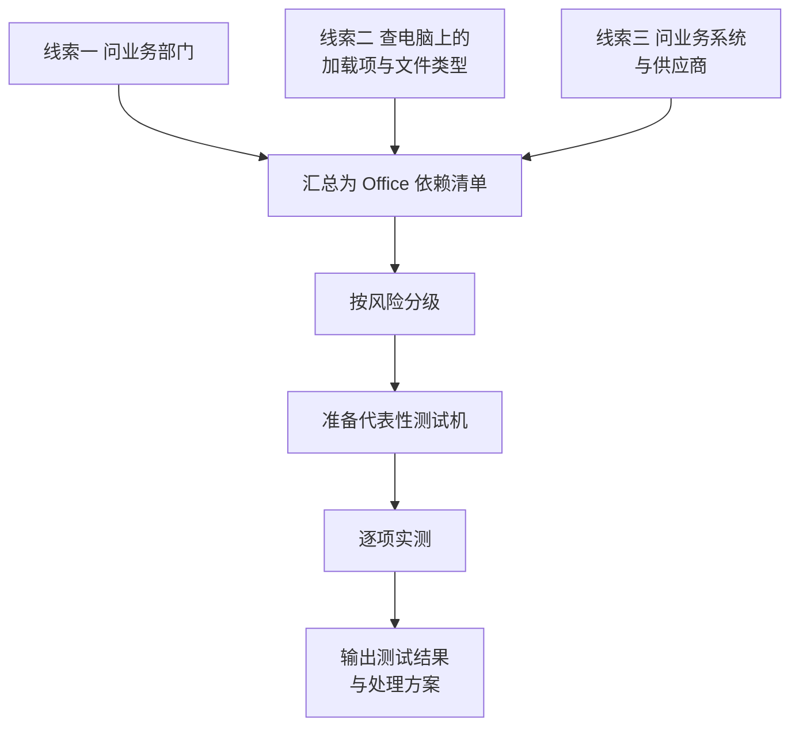
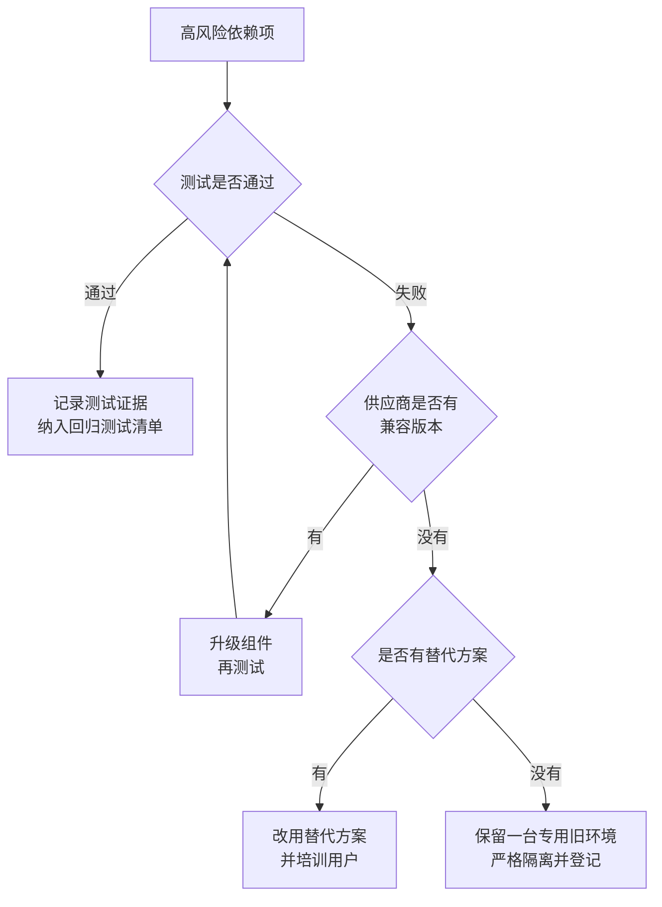

# 第4篇 终端与协作 · 第2节 Office 兼容性调查与测试

> **所属：** 第4篇 终端与协作：Office、Teams、文件。  
> **本节小节：** 4.12 ～ 4.19。  
> **本节性质：** 风险控制。**这是 Office 部署中唯一可能直接导致业务停摆的环节。**  
> **前置条件：** 已完成[第1节](01-Office部署规划.md)，部署方案已确定（含位数与 Outlook 客户端选择）。  
> **导航：** [返回第4篇目录](README.md)｜上一节：[Office 部署规划](01-Office部署规划.md)｜下一节：[Office 安装部署与激活](03-Office安装部署与激活.md)

---

## 4.12 为什么这一节不能省

普通的 Word、Excel、PowerPoint 文档在新版 Office 中几乎不会有问题。企业真正的风险来自这些地方：

| 风险源 | 典型后果 |
|---|---|
| Excel VBA 宏 | 财务报表、工资计算、对账工具**无法运行** |
| COM / VSTO 加载项 | 电子签章、发票工具、税务插件**失效** |
| 业务系统调用 Office | ERP 导出报表、OA 生成文档**报错** |
| Access 数据库 | 部门自建系统**打不开** |
| 位数变化（32→64） | 加载项和 ActiveX 组件**不兼容** |
| 旧格式文件与模板 | 格式错乱、宏丢失 |
| Outlook 加载项 | CRM 邮件归档、日程同步**不工作** |

> **高风险：** 这些问题的共同特点是：**平时没人知道它们存在，出问题时直接影响关键业务，而且往往发生在月结、报税、发工资这类关键时点。** 因此必须在批量部署前主动排查。

---

## 4.13 本节目标

完成本节后应当产出：

1. 一份**Office 依赖清单**（谁在用什么宏、插件、集成）。
2. 一份**兼容性测试结果表**（每项通过/失败/有替代方案）。
3. 每个失败项的**处理方案与责任人**。
4. 一台或多台**代表性测试机**及测试记录。

---

## 4.14 调查方法：三条线索一起查

单靠问用户会漏掉很多东西。建议三条线索同时进行。

### 4.14.1 线索一：问业务部门（问对问题）

不要问“你用宏吗”——很多用户不知道什么是宏。改问具体行为：

| 该问的问题 | 想发现什么 |
|---|---|
| 有没有一个 Excel，打开时会弹出“启用内容”提示？ | 宏 |
| 有没有点一个按钮就自动生成报表的文件？ | 宏 |
| Excel 或 Word 里有没有多出来的菜单栏/工具栏？ | 加载项 |
| 开发票、盖章、报税是不是在 Office 里操作？ | 加载项 |
| 有没有从 ERP/OA 里点“导出 Excel”“生成 Word”？ | 业务系统集成 |
| 有没有一个 `.accdb` 或 `.mdb` 文件是部门在用的？ | Access |
| 有没有必须用旧版本 Office 才能打开的文件？ | 旧格式/兼容性 |
| 每月固定要跑的表格是哪些？ | 关键业务文件 |

### 4.14.2 线索二：查电脑

在代表性电脑上检查：

- [ ] 已安装的 Office 加载项（COM 加载项、Excel 加载项、Outlook 加载项）。
- [ ] 桌面和常用目录中的 `.xlsm`、`.xlsb`、`.docm`、`.accdb`、`.mdb` 文件。
- [ ] Word 自定义模板位置和内容。
- [ ] 是否存在本地 PST 文件。
- [ ] 是否安装了第三方 Office 相关软件（PDF 工具、签章、输入法插件）。
- [ ] 当前 Office 位数与版本。

### 4.14.3 线索三：问业务系统与供应商

对每个可能与 Office 交互的系统，向供应商索取书面确认：

- [ ] 支持的 Office 版本（是否支持 Microsoft 365 Apps）。
- [ ] 支持 32 位还是 64 位，或两者。
- [ ] 是否支持**新版 Outlook**（若涉及 Outlook 加载项，见第1节 4.6）。
- [ ] 是否依赖已弃用的接口（例如与 Exchange 相关的旧接口，见第3篇 3.50）。
- [ ] 后续版本计划与支持承诺。

> **必做：** 供应商的口头“应该没问题”不算确认。要**书面**答复，并保存作为项目证据。

---

## 4.15 Office 依赖清单模板

| 编号 | 名称/用途 | 类型 | 使用部门 | 使用频率 | 关键程度 | 位数要求 | 供应商 | 责任人 | 测试结果 |
|---|---|---|---|---|---|---|---|---|---|
| O1 | 月度对账表 | Excel VBA 宏 | 财务 | 每月 | **高** | 待确认 | 内部开发 |  | 待测试 |
| O2 | 电子发票开票插件 | COM 加载项 | 财务 | 每天 | **高** | 32 位？ | 某供应商 |  | 待测试 |
| O3 | 工资核算表 | Excel VBA 宏 | 人事 | 每月 | **高** | 待确认 | 内部 |  | 待测试 |
| O4 | ERP 导出报表 | 业务系统集成 | 多部门 | 每天 | **高** | 待确认 | ERP 供应商 |  | 待测试 |
| O5 | 合同模板 + 邮件合并 | Word 模板 | 法务/销售 | 每周 | 中 | — | 内部 |  | 待测试 |
| O6 | 客户资料库 | Access | 销售 | 每天 | 中 | 待确认 | 内部 |  | 待测试 |
| O7 | CRM 邮件归档 | Outlook 加载项 | 销售 | 每天 | 中 | 待确认 | CRM 供应商 |  | 待测试 |
| O8 | 电子签章 | COM 加载项 | 行政 | 每周 | 中 | 待确认 | 某供应商 |  | 待测试 |

### 4.15.1 关键程度定义

| 等级 | 定义 | 处理要求 |
|---|---|---|
| **高** | 不可用会造成业务中断或对外违约（如报税、发工资、开发票） | **必须**在部署前测试通过或有可用替代方案 |
| 中 | 不可用会影响效率，但有临时办法 | 部署前测试，允许带方案上线 |
| 低 | 个人习惯或便利工具 | 上线后处理 |

---

## 4.16 兼容性分级与处理策略

| 等级 | 场景 | 处理策略 |
|---|---|---|
| 低风险 | 仅编辑普通 Word / Excel / PPT 文件 | 常规试点即可 |
| 中风险 | 使用模板、邮件合并、PDF 工具、浏览器插件 | 逐项测试并准备替代方案 |
| **高风险** | VBA 宏、COM/VSTO 加载项、ActiveX、Access、业务系统集成、位数变更 | **专项测试 + 供应商确认 + 回退方案** |

### 4.16.1 高风险项的四种出路

> **高风险：** 第四条出路（保留旧环境）是**最后手段**，必须满足：范围最小化、明确责任人、有安全防护、有明确的淘汰时间表。不能变成“留着一台老电脑，然后就忘了”——那台电脑往往连不上受支持的服务，还是安全隐患。

---

## 4.17 代表性测试机的准备

### 4.17.1 测试机不能是“干净的新电脑”

> **必做：** 测试机必须**接近真实用户环境**，否则测试结果没有意义。建议至少准备：
>
> | 测试机 | 配置 |
> |---|---|
> | 测试机 A | 财务用户的真实环境：装齐财务插件、开票工具、常用宏文件 |
> | 测试机 B | 标准办公环境 |
> | 测试机 C | 若存在 32 位依赖：保留 32 位环境用于对比 |
> | 测试机 D | 若有共享电脑/虚拟桌面场景：对应环境 |
> | 测试机 E | 若有 Mac：Mac 环境 |

### 4.17.2 测试机准备步骤

1. 从目标部门取一台**真实在用配置**的电脑（或克隆其镜像）。
2. **先做完整备份或快照**，便于回退。
3. 按目标方案安装 Office（位数、通道、应用组合与正式部署一致）。
4. 安装该部门实际使用的加载项。
5. 拷入真实的业务文件（**注意脱敏或授权**）。
6. 按测试用例逐项执行。

> **高风险：** 测试用的业务文件可能包含工资、客户、财务等敏感数据。必须获得授权并控制测试机的访问权限，测试后按要求清理。

---

## 4.18 测试用例与执行

### 4.18.1 通用测试用例

| 编号 | 测试内容 | 期望结果 | 状态 |
|---|---|---|---|
| P1 | 打开、编辑、保存常用 Word / Excel / PPT 文件 | 正常，格式无错乱 | ☐ |
| P2 | 打开旧格式文件（`.doc`、`.xls`） | 正常打开 | ☐ |
| P3 | **运行每一个“高”级别的宏，完整跑通业务流程** | 结果与旧环境**一致** | ☐ |
| P4 | 每个 COM/VSTO 加载项加载并执行核心功能 | 正常 | ☐ |
| P5 | 从 ERP/OA 导出 Excel / 生成 Word | 正常 | ☐ |
| P6 | Access 数据库打开、查询、报表 | 正常 | ☐ |
| P7 | Word 模板 + 邮件合并 | 正常 | ☐ |
| P8 | 电子签章 / 开票 / 报税工具 | 正常 | ☐ |
| P9 | 打印与导出 PDF | 正常 | ☐ |
| P10 | Outlook 收发、日历、共享邮箱、委派 | 正常（与第3篇一致） | ☐ |
| P11 | Outlook 加载项（CRM 归档等） | 正常 | ☐ |
| P12 | 打开 SharePoint / OneDrive 中的文件并协同编辑 | 正常（见第 10 节） | ☐ |
| P13 | 大文件性能（大型 Excel） | 可接受 | ☐ |
| P14 | 共享电脑激活场景 | 多用户切换正常 | ☐ |
| P15 | 虚拟桌面场景 | 正常 | ☐ |
| P16 | Mac 环境核心功能 | 正常 | ☐ |
| P17 | 输入法、字体、中文排版 | 正常 | ☐ |
| P18 | 与旧环境的结果对比（同一份数据） | 数值与格式一致 | ☐ |

### 4.18.2 关键纪律：让业务用户自己测

> **必做：** P3、P5、P8 这类业务测试，**必须由实际使用者本人执行并确认结果**，不能由 IT 代测。
>
> 原因：IT 只能确认“宏没报错”，但只有财务能确认“**算出来的数是对的**”。宏在新环境下不报错但结果算错，是最危险的情况。

### 4.18.3 测试结果记录

| 编号 | 依赖项 | 测试机 | 测试人 | 结果 | 问题描述 | 处理方案 | 完成日期 |
|---|---|---|---|---|---|---|---|
| O1 | 月度对账表 | A | 财务张三 | 待测试 | — | — | — |
| O2 | 开票插件 | A | 财务李四 | 待测试 | — | — | — |

---

## 4.19 常见兼容性问题与本节检查表

### 4.19.1 问题对照表

| 现象 | 常见原因 | 处理方向 |
|---|---|---|
| 宏提示“无法运行”或对象错误 | 引用的组件在新位数/新版本下不可用 | 检查引用、更新组件；必要时保留 32 位 |
| 打开宏文件时内容被禁用 | 来自互联网的宏被默认阻止 | 按第5节配置受信任位置或签名 |
| 加载项不出现 | 未安装、被禁用、位数不匹配 | 检查加载项状态与位数 |
| 加载项导致 Office 崩溃或变慢 | 兼容性问题 | 联系供应商；临时禁用 |
| 业务系统导出报错 | 系统依赖特定 Office 版本或组件 | 供应商确认；升级系统 |
| Access 数据库无法打开 | 位数或组件依赖 | 确认位数；评估迁移方案 |
| 数值计算结果不一致 | 函数行为差异或宏逻辑依赖旧特性 | **必须由业务确认并修正逻辑** |
| 格式错乱 | 字体缺失、旧格式差异 | 补装字体；另存为新格式 |
| Outlook 加载项失效 | 版本或客户端类型不匹配（经典/新版） | 确认客户端选择（第1节 4.6） |
| 打印异常 | 驱动或导出组件 | 更新驱动 |

### 4.19.2 本节完成检查表

- [ ] 已通过三条线索（业务访谈、电脑检查、供应商确认）完成 Office 依赖清单。
- [ ] 访谈使用了“具体行为”式提问，而不是问“你用宏吗”。
- [ ] 每项依赖已标注类型、部门、频率、**关键程度**和责任人。
- [ ] 所有“高”级别依赖已识别（报税、工资、开票、对账等）。
- [ ] 已取得关键业务系统与插件供应商的**书面**兼容性确认（含位数、是否支持新版 Outlook）。
- [ ] 已准备接近真实环境的代表性测试机（财务环境、标准环境、必要的 32 位/共享电脑/虚拟桌面/Mac 环境）。
- [ ] 测试机在安装前已做备份或快照。
- [ ] 测试用业务数据已获授权并控制访问，测试后有清理安排。
- [ ] 测试用例 P1～P18 已按适用范围执行并记录。
- [ ] **P3、P5、P8 等业务测试由实际使用者本人执行并确认结果正确**（不只是“没报错”）。
- [ ] 已与旧环境做同数据结果对比，数值与格式一致。
- [ ] 每个失败项都有处理方案（升级组件 / 替代方案 / 隔离旧环境）和责任人。
- [ ] 若保留旧环境：范围、责任人、安全防护和淘汰时间表已明确。
- [ ] 所有“高”级别依赖在批量部署前**已测试通过或已有可用替代方案**。
- [ ] 测试结果表已归档，并作为后续更新的回归测试清单。

> **进入下一节的条件：** 所有“高”级别依赖测试通过或有替代方案。**这是批量部署的放行条件。** 下一节进行实际的安装部署与激活。
