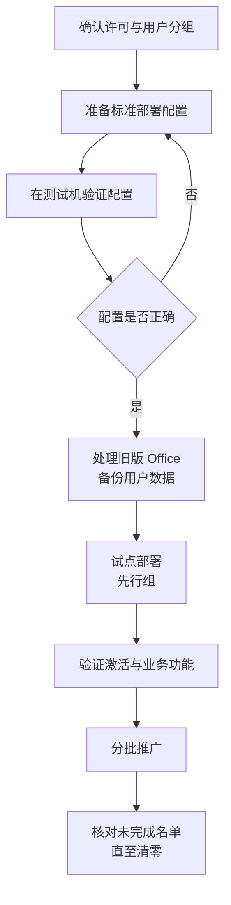

# 第4篇 终端与协作 · 第3节 Office 安装部署与激活

> **所属：** 第4篇 终端与协作：Office、Teams、文件。  
> **本节小节：** 4.20 ～ 4.29。  
> **本节性质：** 生产部署。影响面广但可控，最大风险是**卸载旧版导致的数据或配置丢失**。  
> **前置条件：** 已完成[第2节](02-Office兼容性调查与测试.md)，所有“高”级别依赖测试通过或已有替代方案。  
> **导航：** [返回第4篇目录](README.md)｜上一节：[Office 兼容性调查与测试](02-Office兼容性调查与测试.md)｜下一节：[Office 故障排查与更新管理](04-Office故障排查与更新管理.md)

---

## 4.20 本节目标与部署流程

完成本节后应当达到：

1. 有一份可复用的**标准部署配置**。
2. 试点部署验证通过（含激活和业务功能）。
3. 旧版 Office 已按方案处理，用户数据未丢失。
4. 全员部署完成，未完成名单清零。

---

## 4.21 部署前的许可与账号确认

- [ ] 用户已分配包含桌面应用安装权利的许可（第1篇 1.26）。
- [ ] 用户能正常登录（第2篇），MFA 已注册。
- [ ] 邮箱已就绪（第3篇），避免 Outlook 配置时才发现问题。
- [ ] 共享电脑/虚拟桌面场景的许可条款已确认。
- [ ] 每用户设备安装数量限制已了解，并核对重度多设备用户。

> **必做：** 先确认许可，再安装。否则用户装完发现“无法激活”，会产生大量无效工单，也会让用户对项目失去信心。

---

## 4.22 标准部署配置包含什么

无论用什么工具部署，都要固定以下参数：

| 参数 | 本项目取值 | 说明 |
|---|---|---|
| 产品 | 待填写 | Microsoft 365 Apps 或指定版本 |
| 位数 | 待填写 | 32 位或 64 位（第1节 4.7） |
| 更新通道 | 待填写 | 先行组与全员组可不同（第1节 4.8） |
| 包含应用 | 待填写 | 是否含 Access、Publisher、OneNote |
| 排除应用 | 待填写 | 明确不装的组件 |
| 语言 | 待填写 | 中文及所需其他语言、校对工具 |
| 是否自动卸载旧版 | 待填写 | 见 4.24 |
| 共享电脑激活 | 待填写 | 共享设备场景启用 |
| Outlook 客户端 | 待填写 | 经典或新版（第1节 4.6） |
| OneDrive 同步客户端 | 待填写 | 通常需要 |
| Teams 客户端 | 待填写 | 见第 6～9 节 |
| 隐私与联网设置 | 待填写 | 见 4.27 |

### 4.22.1 使用部署工具的好处

Microsoft 提供 Office 部署工具，可用配置文件精确控制上述参数，并支持：

- 从本地或云端获取安装源。
- 静默安装、静默卸载旧版本。
- 指定通道与语言。
- 批量分发（可结合 Intune 或其他分发方式）。

> **推荐：** 即使决定让用户自行安装，也建议先用部署工具在测试机上生成并验证配置，把“正确的安装方式”固化下来。这样后续新员工电脑、返修电脑的配置才会一致。

---

## 4.23 三种部署路径

| 路径 | 做法 | 适合 |
|---|---|---|
| 用户自助安装 | 用户登录门户下载安装 | 小规模、试点、临时电脑 |
| 部署工具 + 分发 | IT 用配置文件静默部署 | **多数企业的正式做法** |
| Intune 部署 | 通过设备管理平台下发 | 已使用 Intune 的企业（第5篇） |

### 4.23.1 用户自助安装的注意事项

如果采用自助安装，必须给用户明确指引，并说明：

- [ ] 从**官方门户**下载，不要从其他来源。
- [ ] 安装前关闭所有 Office 程序。
- [ ] 位数选择（若门户默认与企业方案不一致，需说明如何选）。
- [ ] 安装完成后用**工作账号**登录激活。
- [ ] 遇到问题联系谁。

> **高风险：** 自助安装最常见的问题是**位数装错**。一旦装错，加载项可能不工作，且需要卸载重装。如果企业统一 64 位，建议由 IT 部署或提供明确的图文步骤。

---

## 4.24 处理旧版 Office（最容易出事的一步）

### 4.24.1 卸载前必须备份的内容

> **高风险：** 卸载旧版 Office 可能导致本地数据和个人配置丢失。**卸载前必须确认以下内容已备份或已知位置：**
>
> | 内容 | 位置/说明 | 状态 |
> |---|---|---|
> | **PST 文件** | 本地存档邮件，卸载后可能找不到 | ☐ |
> | 邮件签名 | 需重建或备份 | ☐ |
> | 自定义模板 | Word/Excel 模板目录 | ☐ |
> | 自定义词典 | 用户词库 | ☐ |
> | 快速访问工具栏配置 | 个人化设置 | ☐ |
> | 加载项及其配置 | 需重新安装 | ☐ |
> | 本地宏文件（个人宏工作簿） | 常被遗忘 | ☐ |
> | Outlook 规则与自动回复 | 见第3篇 3.90 | ☐ |
> | Access 数据库文件位置 | 确认不在临时目录 | ☐ |

### 4.24.2 卸载策略

| 情况 | 建议 |
|---|---|
| 旧版本已不受支持（如 Office 2016/2019） | **卸载**，替换为受支持版本 |
| 存在必须使用旧版的业务依赖 | 按第2节 4.16 处理，隔离到专用设备 |
| 同一台电脑要换位数 | 必须先卸载再安装 |
| 用户临时需要对比验证 | 可短期保留在专用测试机，不在生产电脑上长期并存 |

> **必做：** 不要在生产电脑上长期让新旧 Office 并存。文件关联、加载项和默认程序会互相干扰，产生难以排查的问题。

---

## 4.25 试点部署

### 4.25.1 试点范围

| 试点对象 | 目的 |
|---|---|
| IT 人员 | 熟悉流程、准备指引 |
| 财务代表用户 | 验证高风险宏与插件 |
| 使用业务系统集成的用户 | 验证 ERP/OA 导出 |
| 移动办公用户 | 验证多设备与激活 |
| 共享电脑 | 验证共享电脑激活 |
| Mac 用户 | 验证 Mac 环境 |

### 4.25.2 试点验证清单

- [ ] 安装成功，版本、位数、通道与方案一致。
- [ ] 用工作账号登录后**激活成功**。
- [ ] 所有目标应用可正常启动。
- [ ] 第2节的高风险依赖项在真实电脑上再次验证通过。
- [ ] Outlook 邮箱正常（含共享邮箱与委派）。
- [ ] 能打开并协同编辑 SharePoint/OneDrive 中的文件。
- [ ] 打印与导出 PDF 正常。
- [ ] 旧版已按方案卸载，且备份内容完好。
- [ ] 中文字体、输入法、排版正常。
- [ ] 用户主观反馈已收集。

> **验证点：** 试点必须包含“**卸载旧版 + 安装新版**”的完整流程，而不是只在新电脑上装一次。真正的风险在卸载环节。

---

## 4.26 分批推广

| 原则 | 说明 |
|---|---|
| 按部门分批 | 便于集中支持 |
| 高风险部门（财务）单独安排 | 避开月结、报税、发薪 |
| 每批规模匹配服务台能力 | 避免工单积压 |
| 提前通知 | 说明时间、影响、需要用户做什么 |
| 保留回退能力 | 若出现严重问题，能恢复该批用户的可用状态 |
| 记录进度 | 已完成/失败/待处理 |

### 4.26.1 推广进度表

| 批次 | 部门 | 计划台数 | 已完成 | 失败 | 失败已处理 | 备注 |
|---|---|---|---|---|---|---|
| 试点 | IT + 代表用户 | — | — | — | — | — |
| 第1批 | — | — | — | — | — | — |
| 第2批 | — | — | — | — | — | — |

> **验证点：** 每批“已完成 + 失败 = 计划台数”必须成立，与第3篇的迁移进度核对方法一致。

---

## 4.27 登录激活与隐私设置

### 4.27.1 激活

1. 打开任一 Office 应用。
2. 使用**工作账号**登录（完成 MFA 验证）。
3. 确认标题栏或账户页面显示已激活及所属组织。
4. 确认订阅名称与预期一致（避免误用个人账号激活）。

> **高风险：** 用户如果用**个人 Microsoft 账号**登录，可能出现“看似能用但不是企业授权”的情况，导致文件保存到个人 OneDrive、企业数据脱管。培训中必须强调使用工作账号。

### 4.27.2 隐私与联网体验

企业可按需配置：

| 项目 | 说明 |
|---|---|
| 诊断数据级别 | 按企业策略设定 |
| 连接体验（在线内容、模板等） | 按需开启或限制 |
| 反馈与调查提示 | 可控制 |
| 用户可修改范围 | 通常应统一策略，避免用户自行更改 |

配置这些设置时应与安全和合规负责人确认（第5篇）。

---

## 4.28 语言、字体与默认设置

| 项目 | 建议 |
|---|---|
| 显示语言 | 中文（按企业实际） |
| 校对语言 | 中文 + 需要的外语 |
| 默认字体 | 与企业模板一致 |
| **企业模板与字体分发** | 统一部署，避免格式错乱 |
| 默认保存位置 | 建议引导到 OneDrive（见第 12 节），但要与保留策略配合 |
| 自动保存 | 说明行为，避免用户误以为文件被改坏 |
| 默认文件格式 | 通常使用新格式；有外部兼容要求时另行确认 |

> **推荐：** 企业常用字体如果没有统一分发，会出现“同一份文件在不同电脑上排版不同”的问题，财务和法务文件尤其敏感。这项成本很低但收益明显。

---

## 4.29 本节完成检查表

- [ ] 已确认目标用户的许可包含桌面应用安装权利。
- [ ] 已确认用户可正常登录、MFA 已注册、邮箱已就绪。
- [ ] 共享电脑与虚拟桌面场景的许可与部署方式已确认。
- [ ] 标准部署配置已固化（产品、位数、通道、应用、语言、Outlook 客户端等）。
- [ ] 已在测试机验证部署配置，结果与方案一致。
- [ ] 已确定部署路径（自助 / 部署工具 / Intune），并准备相应指引或分发方案。
- [ ] 若采用自助安装：已提供图文指引，并明确位数选择方式。
- [ ] **卸载旧版前的备份清单已逐项确认**（PST、签名、模板、词典、宏文件、加载项配置）。
- [ ] 已确定旧版处理策略；不在生产电脑上长期新旧并存。
- [ ] 需要换位数的电脑已安排“先卸载再安装”流程。
- [ ] 试点已覆盖 IT、财务、业务系统用户、移动用户、共享电脑、Mac。
- [ ] 试点包含**完整的卸载+安装流程**，而非仅新机安装。
- [ ] 试点验证清单全部通过，含激活、业务依赖、Outlook、文件协同。
- [ ] 分批推广计划已避开财务月结、报税、发薪等高峰。
- [ ] 推广进度表中每批“已完成 + 失败 = 计划台数”成立。
- [ ] 已培训用户使用**工作账号**激活，不使用个人账号。
- [ ] 隐私与联网体验设置已与安全合规负责人确认。
- [ ] 企业模板与字体已统一分发。
- [ ] 未完成部署的电脑名单已跟踪至清零。

> **进入下一节的条件：** 试点通过并开始分批推广。下一节处理**故障排查与更新管理**——部署完成不是结束，持续更新才是长期工作。
