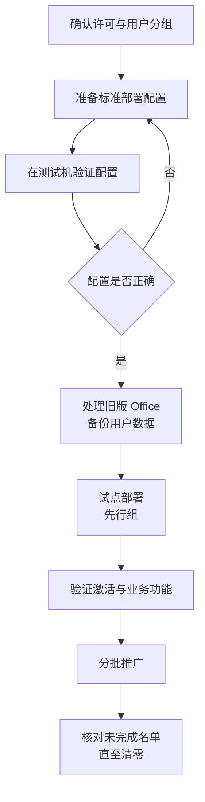
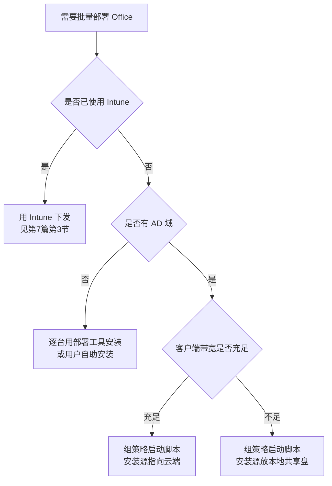

# 第4篇 终端与协作 · 第3节 Office 安装部署与激活

> **所属：** 第4篇 终端与协作：Office、Teams、文件。  
> **本节小节：** 4.20 ～ 4.29。  
> **本节性质：** 生产部署。影响面广但可控，最大风险是**卸载旧版导致的数据或配置丢失**。  
> **前置条件：** 已完成[第2节](02-Office兼容性调查与测试.md)，所有“高”级别依赖测试通过或已有替代方案。  
> **导航：** [返回第4篇目录](README.md)｜上一节：[Office 兼容性调查与测试](02-Office兼容性调查与测试.md)｜下一节：[Office 故障排查与更新管理](04-Office故障排查与更新管理.md)

---

## 4.20 本节目标与部署流程



完成本节后应当达到：

1. 有一份可复用的**标准部署配置**。
2. 试点部署验证通过（含激活和业务功能）。
3. 旧版 Office 已按方案处理，用户数据未丢失。
4. 全员部署完成，未完成名单清零。

---

## 4.21 部署前的许可与账号确认

- [ ] 用户已分配 **E3** 许可（含桌面应用安装权利，第1篇 1.26.1）。
- [ ] **需要 Teams 的用户已获得正确许可**：若所购为 `Microsoft 365 E3 with Teams`，确认相应服务计划已启用；若为 `Microsoft 365 E3 (no Teams)`，另分配适用 Teams 产品（第1篇 1.26.3）。
- [ ] 用户能正常登录（第2篇），MFA 已注册。
- [ ] 邮箱已就绪（第3篇），避免 Outlook 配置时才发现问题。
- [ ] 共享电脑/虚拟桌面场景的许可条款已确认。
- [ ] 每用户设备安装数量限制已了解，并核对重度多设备用户。

> **必做：** 先确认许可，再安装。否则用户装完发现“无法激活”，会产生大量无效工单，也会让用户对项目失去信心。

---

## 4.22 标准部署配置包含什么

无论用什么工具部署，都要固定以下参数：

| 参数 | 本项目取值 | 说明 |
|---|---|---|
| 产品 | **Microsoft 365 Apps for enterprise** | 随 E3 提供（第1篇 1.26.1）；配置文件中的 Product ID 见 4.22.2 |
| 位数 | 待填写 | 32 位或 64 位（第1节 4.7） |
| 更新通道 | 待填写 | 先行组与全员组可不同（第1节 4.8） |
| 包含应用 | 待填写 | 是否含 Access、Publisher、OneNote |
| 排除应用 | 待填写 | 明确不装的组件 |
| 语言 | 待填写 | 中文及所需其他语言、校对工具 |
| 是否自动卸载旧版 | 待填写 | 见 4.24 |
| 共享电脑激活 | 待填写（按场景） | **E3 已支持**；共享设备场景启用，见第1节 4.10.2 |
| Outlook 客户端 | 待填写 | 经典或新版（第1节 4.6） |
| OneDrive 同步客户端 | 待填写 | 通常需要 |
| Teams 客户端 | 待填写 | 见第 6～9 节 |
| 隐私与联网设置 | 待填写 | 见 4.27 |

### 4.22.1 使用部署工具的好处

Microsoft 提供 Office 部署工具，可用配置文件精确控制上述参数，并支持：

- 从本地或云端获取安装源。
- 静默安装、静默卸载旧版本。
- 指定通道与语言。
- 批量分发（可结合 Intune 或其他分发方式）。

> **推荐：** 即使决定让用户自行安装，也建议先用部署工具在测试机上生成并验证配置，把“正确的安装方式”固化下来。这样后续新员工电脑、返修电脑的配置才会一致。

### 4.22.2 部署工具的两步法（下载源 + 静默安装）

部署工具的用法就是两条命令：**先把安装源下载下来，再按配置文件安装**。工具本身只有一个 `setup.exe` 和示例配置文件，从 [Microsoft 下载中心](https://www.microsoft.com/en-us/download/details.aspx?id=49117) 获取。

**第一步：在一台有网的机器上下载安装源**

```
setup.exe /download download.xml
```

`download.xml` 内容：

```xml
<Configuration>
  <!-- SourcePath：安装源保存到哪个目录 -->
  <Add SourcePath="D:\OfficeSource"
       OfficeClientEdition="64"
       Channel="MonthlyEnterprise">
    <Product ID="O365ProPlusRetail">
      <Language ID="zh-cn" />
    </Product>
  </Add>
</Configuration>
```

执行后会在 `D:\OfficeSource\Office\Data\<版本号>\` 下生成源文件。**完整套件加中文单语言约 3～4 GB**，实际大小取决于应用组合与语言数量，以本企业实测结果为准。

**第二步：在目标电脑上静默安装**

```
setup.exe /configure install.xml
```

`install.xml` 内容：

```xml
<Configuration>
  <!-- SourcePath：从哪里取源；改成 U 盘盘符即可离线装机 -->
  <Add SourcePath="\\server\OfficeSource"
       OfficeClientEdition="64"
       Channel="MonthlyEnterprise"
       AllowCdnFallback="False">
    <Product ID="O365ProPlusRetail">
      <Language ID="zh-cn" />
      <ExcludeApp ID="Access" />
      <ExcludeApp ID="Publisher" />
    </Product>
  </Add>
  <RemoveMSI />
  <Display Level="None" AcceptEULA="TRUE" />
</Configuration>
```

配置项与 4.22 的参数表一一对应：

| 配置项 | 对应 4.22 参数 | 说明 |
|---|---|---|
| `OfficeClientEdition` | 位数 | 取 32 或 64 |
| `Channel` | 更新通道 | 先行组与全员组可用不同值 |
| `Product ID` | 产品 | 按订阅类型取值，必须与实际许可一致 |
| `Language ID` | 语言 | 可写多个；语言越多，源越大 |
| `ExcludeApp` | 排除应用 | 逐个排除不装的组件 |
| `RemoveMSI` | 是否自动卸载旧版 | 仅处理 MSI 版，见下方说明 |
| `Display Level="None"` | — | 全静默，无任何界面 |
| `AllowCdnFallback` | — | 见 4.22.3 |

> **必做：** `/configure` 需要**本机管理员权限**，普通用户直接运行会失败。这也是必须由 IT 集中部署、或用系统级脚本执行的原因（4.22.4）。

> **高风险：** `RemoveMSI` **只卸载 MSI 版的旧 Office**（Office 2016 及更早的批量授权版），**不会卸载旧的即点即用版**，也不会卸载 Visio、Project 的即点即用版。这些必须用 `Remove` 元素单独处理，否则会出现新旧并存，或安装直接失败。位数不一致时安装同样会直接报错——见 4.24。

### 4.22.3 离线安装与 U 盘装机

**可以完全离线安装。** 把 4.22.2 第一步下载好的源目录，连同 `setup.exe` 和 `install.xml` 一起拷到 U 盘，在目标电脑上把 `SourcePath` 指向 U 盘盘符即可，装机过程不需要联网。

门户另外还提供**脱机安装程序**（一个映像文件），适合少量机器和临时电脑，但应用组合固定、不能定制、不能静默安装，因此不适合批量部署。

| 注意事项 | 说明 |
|---|---|
| **位数必须与源一致** | 源是 64 位就只能装 64 位 |
| **不同通道分开存放** | 当前通道与月度企业通道不能混在同一个源目录 |
| **务必设 `AllowCdnFallback="False"`** | 否则源里缺版本时会**静默转为联网下载**，导致误判“离线部署已成功” |
| **共享盘要给计算机账号权限** | 见 4.22.4 |
| **本地源必须定期刷新** | 见下方 |

> **高风险：** 本地源不是“下载一次就一直用”。源文件停留在下载那天的版本，**新装的机器拿到的是旧版本，开机后立刻要下载一大包更新**，反而更费带宽，也让“版本统一”失去意义。采用本地源就必须把**每月重新执行一次 `/download`** 写进运维日历（见第4节更新管理）。

> **推荐：** 微软官方在部署规划文档中**并不推荐本地源方式**，理由正是它增加复杂度与维护成本。只有在**客户端带宽确实不足**、或存在无法访问互联网 CDN 的网段时才使用。带宽够用的企业，让安装源直接指向云端、只把配置文件放共享盘，是更省事的做法。

> **必做：** 无论离线还是在线安装，**激活都必须联网**（第1节 4.10.1）。U 盘只解决“装上”这一步，装完的电脑最终仍必须联网完成激活，此后还需每 30 天联网一次。完全无外网的机器不能用订阅版，见第1节 4.10.4。

### 4.22.4 用组策略推送安装

> **高风险：** **不能用组策略的“软件安装”功能部署 Microsoft 365 Apps。** 该功能只支持 MSI 包，而 Microsoft 365 Apps 使用即点即用技术、入口是 `setup.exe`。这是传统域环境部署时最常撞的第一道墙。

域环境下可行的做法是**计算机启动脚本**。

配置路径：`计算机配置 → 策略 → Windows 设置 → 脚本(启动/关机) → 启动`

```bat
@echo off
REM 已安装则直接退出。启动脚本每次开机都会执行，必须自己判断
reg query "HKLM\SOFTWARE\Microsoft\Office\ClickToRun\Configuration" /v ProductReleaseIds >nul 2>&1
if %errorlevel%==0 exit /b 0

REM 未安装，从共享盘静默部署
\\server\OfficeSource\setup.exe /configure \\server\OfficeSource\install.xml
```

三个必须做对的细节：

| 细节 | 说明 |
|---|---|
| **权限从哪来** | 启动脚本以系统账号运行，天然具备管理员权限，正好满足 `/configure` 的提权要求 |
| **共享权限给谁** | 系统账号访问网络共享时使用的是**计算机账号**，因此共享与 NTFS 权限必须授予 **`Domain Computers`**；只给 `Domain Users` 会失败 |
| **必须可重复执行** | 脚本要自带“已装则退出”的判断，否则每次开机重跑一遍安装，开机明显变慢 |

其他可选方式：

| 方式 | 适合 |
|---|---|
| 组策略下发**计划任务** | 想避开开机时段，改为空闲时安装 |
| **Intune** 应用部署 | 已使用 Intune 的企业（详见第7篇第3节），有图形界面与集中安装状态报表 |
| Configuration Manager | 已有该基础设施的企业 |

### 4.22.5 组策略的真正用途：管配置，不管安装

组策略在 Office 项目里最大的价值不是“把它装上去”，而是“装上去之后管住设置”。为此需要下载 **Office 管理模板（ADMX）**，放入域的中央存储（`\\<域名>\SYSVOL\<域名>\Policies\PolicyDefinitions`），之后即可统一下发：

| 可管理的内容 | 对应位置 |
|---|---|
| 宏安全策略、受信任位置 | 第5节（本篇最高风险项之一） |
| 更新通道与更新行为 | 第4节 |
| 隐私与联网体验设置 | 4.27.2 |
| 首次运行体验与向导提示 | 4.28 |
| Outlook 缓存模式、OST 大小、配置文件 | 第3篇 |

> **推荐：** 官方建议的顺序是——**用部署工具只设置安装必需的少量参数把 Office 装上，装完后用组策略下发完整配置并锁定**，防止用户自行修改。把所有配置都塞进部署配置文件是常见误区，后期想改一个设置就得重新部署一轮。

---

## 4.23 四种部署路径



| 路径 | 做法 | 适合 |
|---|---|---|
| 用户自助安装 | 用户登录门户下载安装 | 小规模、试点、临时电脑 |
| 部署工具 + 手工执行 | IT 用配置文件静默部署（4.22.2） | 少量机器、返修机、无域环境 |
| **部署工具 + 组策略脚本** | 域内批量静默推送（4.22.4） | **有域、未上 Intune 的企业** |
| Intune 部署 | 通过设备管理平台下发 | 已使用 Intune 的企业（详见第7篇第3节） |

### 4.23.1 用户自助安装的注意事项

如果采用自助安装，必须给用户明确指引，并说明：

- [ ] 从**官方门户**下载，不要从其他来源。
- [ ] 安装前关闭所有 Office 程序。
- [ ] 位数选择（若门户默认与企业方案不一致，需说明如何选）。
- [ ] 安装完成后用**工作账号**登录激活。
- [ ] 遇到问题联系谁。

> **高风险：** 自助安装最常见的问题是**位数装错**。一旦装错，加载项可能不工作，且需要卸载重装。如果企业统一 64 位，建议由 IT 部署或提供明确的图文步骤。

---

## 4.24 处理旧版 Office（最容易出事的一步）

### 4.24.1 卸载前必须备份的内容

> **高风险：** 卸载旧版 Office 可能导致本地数据和个人配置丢失。**卸载前必须确认以下内容已备份或已知位置：**
>
> | 内容 | 位置/说明 | 状态 |
> |---|---|---|
> | **PST 文件** | 本地存档邮件，卸载后可能找不到 | ☐ |
> | 邮件签名 | 需重建或备份 | ☐ |
> | 自定义模板 | Word/Excel 模板目录 | ☐ |
> | 自定义词典 | 用户词库 | ☐ |
> | 快速访问工具栏配置 | 个人化设置 | ☐ |
> | 加载项及其配置 | 需重新安装 | ☐ |
> | 本地宏文件（个人宏工作簿） | 常被遗忘 | ☐ |
> | Outlook 规则与自动回复 | 见第3篇 3.90 | ☐ |
> | Access 数据库文件位置 | 确认不在临时目录 | ☐ |

### 4.24.2 卸载策略

| 情况 | 建议 |
|---|---|
| 旧版本已不受支持（如 Office 2016/2019） | **卸载**，替换为受支持版本 |
| 存在必须使用旧版的业务依赖 | 按第2节 4.16 处理，隔离到专用设备 |
| 同一台电脑要换位数 | 必须先卸载再安装 |
| 用户临时需要对比验证 | 可短期保留在专用测试机，不在生产电脑上长期并存 |

> **必做：** 不要在生产电脑上长期让新旧 Office 并存。文件关联、加载项和默认程序会互相干扰，产生难以排查的问题。

---

## 4.25 试点部署

### 4.25.1 试点范围

| 试点对象 | 目的 |
|---|---|
| IT 人员 | 熟悉流程、准备指引 |
| 财务代表用户 | 验证高风险宏与插件 |
| 使用业务系统集成的用户 | 验证 ERP/OA 导出 |
| 移动办公用户 | 验证多设备与激活 |
| 共享电脑 | 验证共享电脑激活 |
| Mac 用户 | 验证 Mac 环境 |

### 4.25.2 试点验证清单

- [ ] 安装成功，版本、位数、通道与方案一致。
- [ ] 用工作账号登录后**激活成功**。
- [ ] 所有目标应用可正常启动。
- [ ] 第2节的高风险依赖项在真实电脑上再次验证通过。
- [ ] Outlook 邮箱正常（含共享邮箱与委派）。
- [ ] 能打开并协同编辑 SharePoint/OneDrive 中的文件。
- [ ] 打印与导出 PDF 正常。
- [ ] 旧版已按方案卸载，且备份内容完好。
- [ ] 中文字体、输入法、排版正常。
- [ ] 用户主观反馈已收集。

> **验证点：** 试点必须包含“**卸载旧版 + 安装新版**”的完整流程，而不是只在新电脑上装一次。真正的风险在卸载环节。

---

## 4.26 分批推广

| 原则 | 说明 |
|---|---|
| 按部门分批 | 便于集中支持 |
| 高风险部门（财务）单独安排 | 避开月结、报税、发薪 |
| 每批规模匹配服务台能力 | 避免工单积压 |
| 提前通知 | 说明时间、影响、需要用户做什么 |
| 保留回退能力 | 若出现严重问题，能恢复该批用户的可用状态 |
| 记录进度 | 已完成/失败/待处理 |

### 4.26.1 推广进度表

| 批次 | 部门 | 计划台数 | 已完成 | 失败 | 失败已处理 | 备注 |
|---|---|---|---|---|---|---|
| 试点 | IT + 代表用户 | — | — | — | — | — |
| 第1批 | — | — | — | — | — | — |
| 第2批 | — | — | — | — | — | — |

> **验证点：** 每批“已完成 + 失败 = 计划台数”必须成立，与第3篇的迁移进度核对方法一致。

---

## 4.27 登录激活与隐私设置

### 4.27.1 激活

1. 打开任一 Office 应用。
2. 使用**工作账号**登录（完成 MFA 验证）。
3. 确认标题栏或账户页面显示已激活及所属组织。
4. 确认订阅名称与预期一致（避免误用个人账号激活）。

> **高风险：** 用户如果用**个人 Microsoft 账号**登录，可能出现“看似能用但不是企业授权”的情况，导致文件保存到个人 OneDrive、企业数据脱管。培训中必须强调使用工作账号。

### 4.27.2 隐私与联网体验

企业可按需配置：

| 项目 | 说明 |
|---|---|
| 诊断数据级别 | 按企业策略设定 |
| 连接体验（在线内容、模板等） | 按需开启或限制 |
| 反馈与调查提示 | 可控制 |
| 用户可修改范围 | 通常应统一策略，避免用户自行更改 |

配置这些设置时应与安全和合规负责人确认（第5篇）。

---

## 4.28 语言、字体与默认设置

| 项目 | 建议 |
|---|---|
| 显示语言 | 中文（按企业实际） |
| 校对语言 | 中文 + 需要的外语 |
| 默认字体 | 与企业模板一致 |
| **企业模板与字体分发** | 统一部署，避免格式错乱 |
| 默认保存位置 | 建议引导到 OneDrive（见第 12 节），但要与保留策略配合 |
| 自动保存 | 说明行为，避免用户误以为文件被改坏 |
| 默认文件格式 | 通常使用新格式；有外部兼容要求时另行确认 |

> **推荐：** 企业常用字体如果没有统一分发，会出现“同一份文件在不同电脑上排版不同”的问题，财务和法务文件尤其敏感。这项成本很低但收益明显。

---

## 4.29 本节完成检查表

- [ ] 已确认目标用户的许可包含桌面应用安装权利。
- [ ] 已确认用户可正常登录、MFA 已注册、邮箱已就绪。
- [ ] 共享电脑与虚拟桌面场景的许可与部署方式已确认。
- [ ] 标准部署配置已固化（产品、位数、通道、应用、语言、Outlook 客户端等）。
- [ ] 已在测试机验证部署配置，结果与方案一致。
- [ ] 已确定部署路径（自助 / 部署工具 / 组策略脚本 / Intune），并准备相应指引或分发方案。
- [ ] 若采用自助安装：已提供图文指引，并明确位数选择方式。
- [ ] 部署配置文件（下载用与安装用）已编写并存档，参数与 4.22 参数表一致。
- [ ] 已确认 `RemoveMSI` **不处理旧的即点即用版**，此类旧版已用 `Remove` 单独安排。
- [ ] 若采用离线源：已设 `AllowCdnFallback="False"`，并**排定每月刷新源文件的运维任务**。
- [ ] 若采用组策略推送：已确认**不使用“软件安装”功能**，改用启动脚本或计划任务。
- [ ] 启动脚本已具备“已装则退出”的判断，避免每次开机重复安装。
- [ ] 共享盘的共享与 NTFS 权限已授予 **`Domain Computers`**，并用实机验证过取源成功。
- [ ] Office 管理模板（ADMX）已放入域中央存储，配置类设置改由组策略下发。
- [ ] **卸载旧版前的备份清单已逐项确认**（PST、签名、模板、词典、宏文件、加载项配置）。
- [ ] 已确定旧版处理策略；不在生产电脑上长期新旧并存。
- [ ] 需要换位数的电脑已安排“先卸载再安装”流程。
- [ ] 试点已覆盖 IT、财务、业务系统用户、移动用户、共享电脑、Mac。
- [ ] 试点包含**完整的卸载+安装流程**，而非仅新机安装。
- [ ] 试点验证清单全部通过，含激活、业务依赖、Outlook、文件协同。
- [ ] 分批推广计划已避开财务月结、报税、发薪等高峰。
- [ ] 推广进度表中每批“已完成 + 失败 = 计划台数”成立。
- [ ] 已培训用户使用**工作账号**激活，不使用个人账号。
- [ ] 隐私与联网体验设置已与安全合规负责人确认。
- [ ] 企业模板与字体已统一分发。
- [ ] 未完成部署的电脑名单已跟踪至清零。

> **进入下一节的条件：** 试点通过并开始分批推广。下一节处理**故障排查与更新管理**——部署完成不是结束，持续更新才是长期工作。
