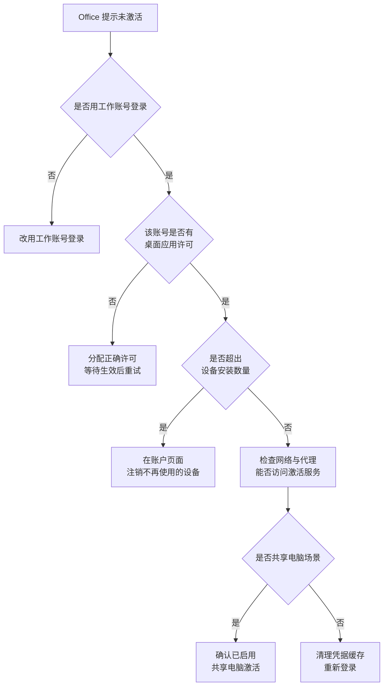
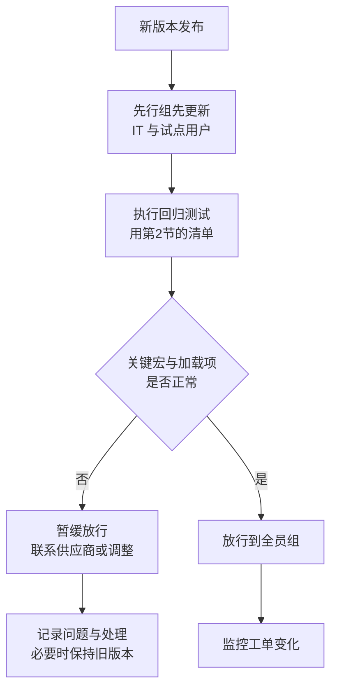

# 第4篇 终端与协作 · 第4节 Office 故障排查与更新管理

> **所属：** 第4篇 终端与协作：Office、Teams、文件。  
> **本节小节：** 4.30 ～ 4.35。  
> **本节性质：** 运维。部署完成不是结束，**持续更新才是长期风险来源**。  
> **前置条件：** 已完成[第3节](03-Office安装部署与激活.md)。  
> **导航：** [返回第4篇目录](README.md)｜上一节：[Office 安装部署与激活](03-Office安装部署与激活.md)｜下一节：[宏与插件安全](05-宏与插件安全.md)

---

## 4.30 安装与激活故障排查

### 4.30.1 安装失败

| 现象 | 常见原因 | 处理 |
|---|---|---|
| 安装中断或失败 | 旧版残留、磁盘空间不足、网络中断 | 清理旧版残留；检查空间与网络后重试 |
| 提示已安装其他位数 | 位数冲突 | 先完整卸载再安装 |
| 提示需要关闭程序 | Office 进程仍在运行 | 关闭所有 Office 与相关进程 |
| 下载极慢 | 出口带宽或多台同时下载 | 使用本地安装源或分批部署 |
| 语言包缺失 | 配置未包含 | 修正部署配置 |
| 权限不足 | 用户非本机管理员 | 由 IT 部署或提升权限执行 |

### 4.30.2 激活失败

| 现象 | 常见原因 | 处理 |
|---|---|---|
| 提示需要激活或即将过期 | 长时间未联网验证 | 联网并重新登录 |
| 提示无许可 | 未分配许可或许可被回收 | 检查许可分配 |
| 提示已达安装上限 | 设备数超限 | 注销旧设备 |
| 登录后仍未激活 | 凭据缓存异常 | 清理保存的凭据后重试 |
| 共享电脑上频繁要求登录 | 未启用共享电脑激活 | 修正部署配置 |
| 显示为个人版订阅 | 用了个人账号 | 退出并用工作账号登录 |

> **必做：** 服务台先问两个问题：“**登录用的是公司邮箱还是个人邮箱？**”“**在网页版 Office 能正常用吗？**”这两个问题能筛掉大部分激活类工单。

---

## 4.31 常见使用类故障

| 现象 | 排查方向 |
|---|---|
| Office 启动很慢或卡住 | 先在安全模式（禁用加载项）下启动，判断是否为加载项问题 |
| 频繁崩溃 | 加载项、字体、损坏的模板、需要更新 |
| 打不开某个特定文件 | 文件损坏、来自互联网被保护视图阻止、权限问题 |
| 提示文件被锁定或只读 | 他人正在编辑、同步冲突（第 12 节） |
| 无法保存到 SharePoint/OneDrive | 权限、同步状态、路径过长 |
| 宏被禁用 | 见[第5节](05-宏与插件安全.md) |
| 加载项自动消失 | 被禁用（可能因崩溃）或位数不匹配 |
| 字体或排版异常 | 字体未统一分发（第3节 4.28） |
| 中文乱码 | 编码或字体问题 |
| Outlook 相关问题 | 见第3篇 3.86～3.90 |

### 4.31.1 三步分流法

> **推荐：** 给服务台一套固定的分流顺序：
>
> 1. **网页版能否正常？** 能 → 问题在客户端；不能 → 问题在服务或身份侧。
> 2. **禁用加载项后是否正常？** 是 → 加载项问题；否 → 继续查。
> 3. **其他人是否同样问题？** 是 → 可能是版本或策略问题；否 → 个体环境问题。

---

## 4.32 更新管理：为什么必须管

订阅版 Office 会持续更新。不管理更新会出现两种极端：

| 极端 | 后果 |
|---|---|
| 完全不管，用户各自更新 | 版本参差不齐，问题难复现；某次更新可能突然影响宏或加载项 |
| 长期冻结更新 | 累积安全风险，且与服务的兼容性逐渐变差 |

正确做法是**受控更新**：先在小范围验证，再放行到全员。

---

## 4.33 两级更新部署

### 4.33.1 先行组的构成

| 成员 | 作用 |
|---|---|
| IT 管理员 | 发现部署与配置问题 |
| **财务代表用户** | 验证高风险宏与开票、报税插件 |
| 业务系统重度用户 | 验证 ERP/OA 集成 |
| 常用 Access / 复杂模板的用户 | 验证专项功能 |

### 4.33.2 回归测试清单

> **必做：** 直接复用第2节 4.18 的测试用例作为**回归测试清单**，重点是所有“高”级别依赖项。每次通道更新前跑一遍关键项，比出问题后再排查便宜得多。

| 频率 | 测试范围 |
|---|---|
| 每次通道更新 | 全部“高”级别依赖项 |
| 每季度 | 高 + 中级别依赖项 |
| 重大变更（如换位数、换客户端） | 全量 |

---

## 4.34 更新失败与版本回退

### 4.34.1 更新失败处理

| 现象 | 处理 |
|---|---|
| 更新长时间无进展 | 检查网络、磁盘空间；关闭 Office 后重试 |
| 更新后无法启动 | 尝试在线修复；必要时回退版本 |
| 更新后加载项失效 | 检查加载项状态；联系供应商 |
| 更新后宏行为异常 | **立即在先行组复现并记录**，暂缓放行到全员 |
| 部分电脑未更新 | 检查通道设置与更新策略 |

### 4.34.2 回退版本

Office 支持回退到较早版本，但要注意：

| 要点 | 说明 |
|---|---|
| 回退是**临时措施** | 目的是争取时间修复兼容性问题，不是长期方案 |
| 需要记录 | 哪些电脑回退到哪个版本、原因、负责人、恢复计划 |
| 安全风险 | 停留在旧版本意味着缺少后续安全修复 |
| 需要暂停自动更新 | 否则会再次更新上去 |
| 必须设定期限 | 到期前必须解决根因 |

> **高风险：** 回退后如果忘记恢复，这批电脑会长期停留在旧版本并暂停更新——这类“临时措施”最容易变成长期安全债务。请在变更记录中设定明确的复查日期（第6篇变更管理）。

---

## 4.35 本节完成检查表

- [ ] 安装失败与激活失败的排查流程已交付服务台。
- [ ] 服务台掌握“工作账号 vs 个人账号”和“网页版是否正常”两个分流问题。
- [ ] 常见使用类故障的三步分流法已培训。
- [ ] 已明确 Office 更新采用**受控更新**，而不是放任或长期冻结。
- [ ] 已建立先行组（含 IT、财务代表、业务系统重度用户）。
- [ ] 已把第2节的兼容性测试用例转为**回归测试清单**。
- [ ] 已确定回归测试的频率与范围（每次更新 / 每季度 / 重大变更）。
- [ ] 已明确“先行组验证通过才放行全员”的流程与放行责任人。
- [ ] 更新失败的处理步骤已文档化。
- [ ] 版本回退的操作、记录要求、期限和复查机制已明确。
- [ ] 所有回退电脑均有记录、负责人和恢复计划。
- [ ] Office 更新纳入月度巡检项（第6篇）。

> **进入下一节的条件：** 更新流程已建立。下一节处理**宏与插件安全**——这是终端侧最常见的恶意软件入口，同时也是企业业务的重要依赖，需要在安全与可用之间取得平衡。
