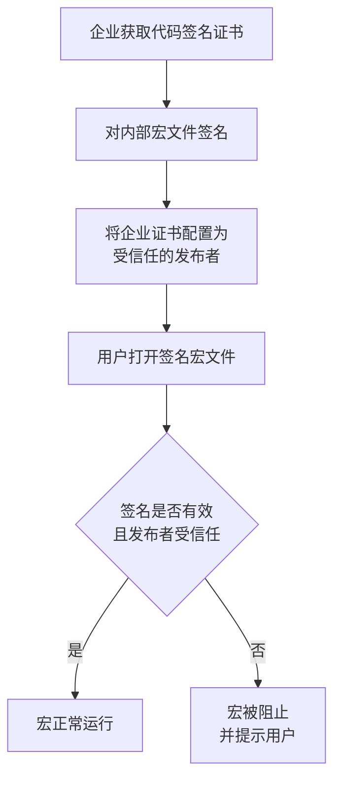
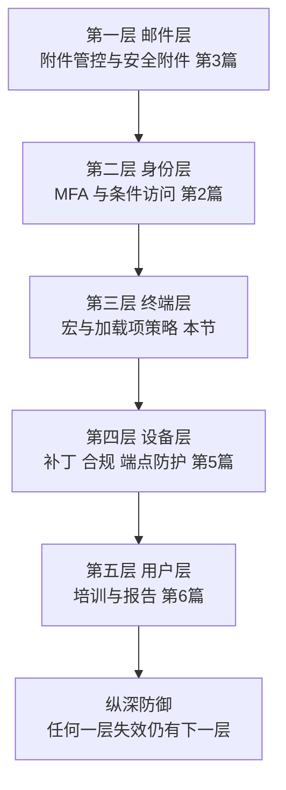

# 第4篇 终端与协作 · 第5节 宏与插件安全

> **所属：** 第4篇 终端与协作：Office、Teams、文件。  
> **本节小节：** 4.36 ～ 4.42。  
> **本节性质：** 安全配置。本节要在“业务必须用宏”和“宏是主要攻击入口”之间取得平衡。  
> **前置条件：** 已完成[第2节](02-Office兼容性调查与测试.md)的依赖清单和[第4节](04-Office故障排查与更新管理.md)的更新机制。  
> **导航：** [返回第4篇目录](README.md)｜上一节：[Office 故障排查与更新管理](04-Office故障排查与更新管理.md)｜下一节：[Teams 结构与团队治理](06-Teams结构与团队治理.md)

---

## 4.36 为什么宏是重点

Office 宏（VBA）多年来一直是**勒索软件和木马最常用的传播方式之一**：攻击者发一封邮件，附一个 Excel 或 Word 文件，用户打开并点击“启用内容”，恶意代码就在企业内网执行。

同时，中国企业的现实是：**财务、人事、生产的很多关键工具就是宏**。所以不能简单“全面禁止宏”，那会让业务停摆。

本节的目标是达到这个状态：

> **企业自己的宏能正常用；从外部来的宏一律跑不起来。**

---

## 4.37 关键机制：来自互联网的宏被默认阻止

Microsoft 已在受支持版本中默认**阻止来自互联网的 VBA 宏**运行。

### 4.37.1 原理（必须理解，否则会配错）

- 文件从互联网下载、或从邮件附件保存到本地时，Windows 会给文件加一个**“来自互联网”的标记**。
- Office 检测到该标记时，会阻止其中的宏运行，并显示安全提示。
- 用户**无法**像以前那样简单点一下“启用内容”就绕过（行为比旧版更严格）。

### 4.37.2 这带来的两个结果

| 结果 | 说明 |
|---|---|
| 好消息 | 邮件附件里的恶意宏基本跑不起来 |
| 需要处理 | **企业自己的宏如果通过邮件或网页分发，也会被阻止** |

> **必做：** 这正是很多企业升级后出现“财务宏突然不能用了”的原因。解决办法**不是**让用户去解除阻止，而是改变企业宏的**分发方式**（见 4.38）。

---

## 4.38 企业宏的正确分发方式

按推荐程度排序：

| 方式 | 做法 | 推荐度 |
|---|---|---|
| **数字签名宏** | 用企业代码签名证书签名，并将证书设为受信任的发布者 | ★★★★★ 最佳 |
| **受信任位置** | 把宏文件放在指定的受信任位置（如受控的网络共享或本地目录），从该位置运行 | ★★★★ |
| 从 SharePoint/OneDrive 同步到本地受信任位置 | 结合文件同步使用 | ★★★ |
| 让用户逐个解除文件阻止 | 用户手工操作 | ★ 不推荐 |
| 关闭宏安全设置 | —— | **禁止** |

### 4.38.1 数字签名宏（最佳做法）

优点：

- 宏可以正常分发（邮件、网盘都行），因为信任来自**签名**而不是位置。
- 宏被篡改后签名失效，能防止内容被改。
- 可以按发布者集中管理信任关系。

注意：

- 需要采购和管理代码签名证书，并规范签名流程。
- 证书到期需要提前更新，否则宏会突然全部失效。
- 私钥必须严格保管（等同于企业的“电子公章”）。

### 4.38.2 受信任位置（务实做法）

适合暂时没有签名能力的企业：

| 要点 | 说明 |
|---|---|
| 位置选择 | 使用**受控**目录，普通用户**不能随意写入** |
| 不要用的位置 | 用户桌面、下载文件夹、公共可写共享 —— 等于全面放开 |
| 网络位置 | 使用网络受信任位置时需谨慎评估 |
| 集中管理 | 通过策略统一下发，不靠用户自己添加 |
| 定期审查 | 检查是否有人添加了不该信任的位置 |

> **高风险：** 把“下载文件夹”或“桌面”设为受信任位置，等于完全废掉了这项防护——攻击者的附件正好落在这些地方。这是审计中常见的严重配置错误。

---

## 4.39 宏策略配置建议

| 用户群体 | 建议策略 |
|---|---|
| 全体用户 | 默认阻止来自互联网的宏；不禁用宏功能本身 |
| 使用企业宏的用户（财务、人事、生产） | 通过**签名**或**受信任位置**放行企业宏 |
| 不需要宏的用户 | 可进一步限制，甚至禁用 VBA |
| 高风险人群（高管、财务）的邮件 | 结合邮件层面的附件管控（第3篇 3.30） |

### 4.39.1 需要一并确认的项目

- [ ] 是否禁止用户自行修改宏安全设置。
- [ ] 是否禁止用户自行添加受信任位置。
- [ ] 是否限制来自互联网的其他活动内容（ActiveX、DDE 等）。
- [ ] 保护视图（Protected View）的行为是否保持启用。
- [ ] 对不需要 VBA 的部门是否直接禁用。

> **必做：** 策略要通过集中管理下发（组策略或设备管理平台），不要靠“告诉用户怎么设”。用户手工设置无法审计、无法统一，也会被随意改回去。

---

## 4.40 插件（加载项）管理

### 4.40.1 三类加载项

| 类型 | 说明 | 风险与管理 |
|---|---|---|
| **COM / VSTO 加载项** | 传统本地安装的插件（开票、签章、CRM 工具） | 权限高、可访问本地系统；需白名单管理与版本控制 |
| **Office 网页加载项** | 通过应用商店或企业部署的现代加载项 | 可由管理员集中部署与限制 |
| 用户自行安装的加载项 | 用户从商店自行获取 | **应限制**，避免未经审核的第三方访问企业数据 |

### 4.40.2 管理要求

| 要求 | 说明 |
|---|---|
| 建立白名单 | 只允许经审核的加载项（对应第2节的依赖清单） |
| 版本管理 | 记录当前版本，纳入更新回归测试 |
| 限制用户自行安装 | 通过策略控制 |
| 定期复核 | 每季度检查是否有未登记的加载项 |
| 离职与转岗 | 回收专用加载项授权 |
| 供应商支持 | 确认支持的 Office 版本与客户端类型（含新版 Outlook） |

> **推荐：** 把加载项白名单与第2节的 Office 依赖清单**合并成一份表**维护。两份表分开维护，很快就会不一致。

---

## 4.41 与其他篇章的配合

宏和插件安全不是孤立的，需要多层配合：

| 层级 | 作用 |
|---|---|
| 邮件层 | 尽量不让恶意文件进来 |
| 终端层 | 进来了也跑不起来 |
| 设备层 | 跑起来了也能被检测和阻断 |
| 用户层 | 用户不点、会报告 |

> **必做：** 不要指望单靠一层。企业被勒索软件击中的案例中，往往是“邮件放过了 + 宏能跑 + 终端无防护 + 用户不知道要报告”四件事同时发生。

---

## 4.42 本节完成检查表

- [ ] 已理解“来自互联网的宏被默认阻止”的机制及其对企业自有宏的影响。
- [ ] 已确定企业宏的分发方式（**优先数字签名**，其次受信任位置）。
- [ ] 若采用数字签名：证书采购、签名流程、私钥保管和到期更新机制已确定。
- [ ] 若采用受信任位置：位置为**受控目录**，普通用户不可随意写入。
- [ ] **未**将桌面、下载文件夹或公共可写共享设为受信任位置。
- [ ] 受信任位置通过集中策略下发，用户不能自行添加。
- [ ] 用户不能自行修改宏安全设置。
- [ ] 保护视图保持启用；ActiveX 等活动内容已按需限制。
- [ ] 不需要宏的部门已评估进一步限制或禁用 VBA。
- [ ] 第2节识别的所有企业宏都已通过签名或受信任位置正常运行（**已实测**）。
- [ ] 加载项白名单已建立，并与 Office 依赖清单合并维护。
- [ ] 已限制用户自行从商店安装加载项。
- [ ] 加载项版本已记录，并纳入更新回归测试。
- [ ] 已建立加载项季度复核机制。
- [ ] 已确认加载项供应商支持的 Office 版本与 Outlook 客户端类型。
- [ ] 已与邮件层（第3篇）、设备层（第5篇）、培训（第6篇）形成纵深防御。

> **进入下一节的条件：** 企业宏可正常运行且外部宏被阻止，加载项白名单已建立。**Office 部分（第 1～5 节）至此完成。** 下一节进入 Teams 部分，从团队结构与治理开始。
