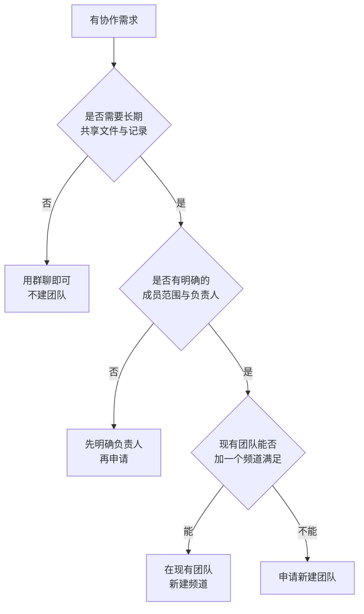
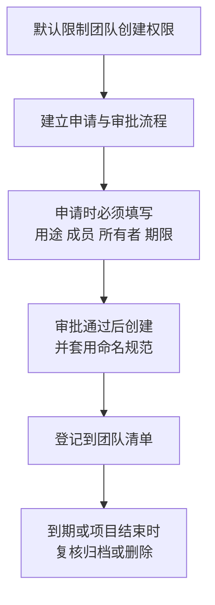
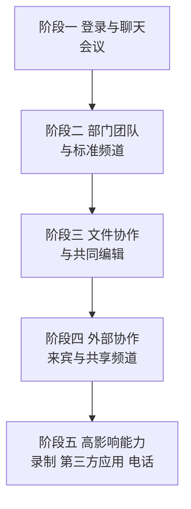

# 第4篇 终端与协作 · 第6节 Teams 结构与团队治理

> **所属：** 第4篇 终端与协作：Office、Teams、文件。  
> **本节小节：** 4.43 ～ 4.57。  
> **本节性质：** 结构设计与治理。**Teams 的技术部署很简单，难的是不让它在半年内变成一堆无人管理的团队和站点。**  
> **前置条件：** 已完成第1篇的 Teams 需求调查（1.17）；第2篇的账号与组已就绪；第3篇邮件已稳定。  
> **导航：** [返回第4篇目录](README.md)｜上一节：[宏与插件安全](05-宏与插件安全.md)｜下一节：[Teams 策略管理](07-Teams策略管理.md)

> **本方案的 Teams 许可来源（务必先确认）：** 本项目为净新订阅，但不能仅凭“净新”判断 Teams 是否包含。2026 官方包装同时存在 **Microsoft 365 E3 with Teams** 与 **Microsoft 365 E3 (no Teams)**（第1篇 1.26.3）。开始本节前，请核对正式报价和目标用户服务计划：含 Teams SKU 不要重复采购；no-Teams SKU 必须另配适用 Teams 产品，否则 Teams 登录会失败或受限。**Teams Premium** 的增强能力（水印、高级会议保护）本方案仍不采购（第1篇 1.26.5）。

---

## 4.43 本节目标

完成本节后应当达到：

1. 理解团队、频道、Microsoft 365 组、SharePoint 站点之间的真实关系。
2. 有一套团队创建规则、命名规范和审批流程。
3. 有所有者责任、生命周期和归档删除机制。
4. **避免“谁都能建团队、建完没人管”的失控局面。**

> **必做：** 治理规则必须在**开放创建权限之前**定好。等用户已经建了 200 个团队再来治理，成本高十倍，而且会引起反感。

---

## 4.44 Teams 到底是什么

Teams 有两个容易混淆的用途，**治理方式完全不同**：

| 用途 | 特点 | 治理重点 |
|---|---|---|
| **聊天与会议**（1:1、群聊、开会） | 轻量、临时、人人都用 | 策略控制（第7节） |
| **团队与频道**（结构化协作空间） | 有文件、有成员、有生命周期 | **本节的重点** |

新手企业最常见的错误是：**把所有沟通都变成"建一个团队"**。结果是几百个团队、几百个 SharePoint 站点，没人知道文件在哪。

### 4.44.1 判断要不要建团队

> **推荐：** 优先"在现有团队加频道"，而不是建新团队。团队数量增长会带来站点、权限和所有者管理的成倍负担。

---

## 4.45 团队、频道与 SharePoint 的关系（必须理解）

这是**排查文件问题的基础**，也是权限设计的依据。

| 对象 | 对应的存储位置 |
|---|---|
| **团队** | 关联一个 Microsoft 365 组，并创建一个**父 SharePoint 站点** |
| **标准频道** | **共用团队的父 SharePoint 站点**（各自一个文件夹） |
| **私有频道** | **各自独立的 SharePoint 频道站点** |
| **共享频道** | **各自独立的 SharePoint 频道站点** |
| 1:1 或群聊中发的文件 | 存在**发送者的 OneDrive** |
| 会议录制（普通会议） | 存在**组织者的 OneDrive** 的录制文件夹 |
| 会议录制（频道会议） | 存在该**频道对应的 SharePoint 站点** |

官方说明见 [Teams 与 SharePoint 的集成](https://learn.microsoft.com/en-us/microsoftteams/sharepoint-onedrive-interact)。

### 4.45.1 这带来的四个实际结论

| 结论 | 说明 |
|---|---|
| 删除团队会影响文件 | 删除团队会影响其关联的组和站点内容 |
| 私有频道权限是独立的 | 团队所有者**不一定**能访问私有频道的文件 |
| 聊天里发的文件依赖个人 OneDrive | 该员工离职后需要做数据交接（第 13 节） |
| 录制文件归属组织者 | 组织者离职后录制可能随其 OneDrive 一起需要交接 |

> **高风险：** 很多企业以为"Teams 里的文件都在公司公共空间"。实际上**聊天文件和会议录制默认在个人 OneDrive 里**。这直接影响离职交接和合规取证，必须在治理规则中明确。

---

## 4.46 三种频道类型的选择

| 类型 | 谁能访问 | 存储 | 适合 |
|---|---|---|---|
| **标准频道** | 团队全体成员 | 团队父站点 | 大多数日常协作 |
| **私有频道** | 仅该频道成员（团队内部分人） | 独立站点 | 团队内的敏感话题（如管理层讨论） |
| **共享频道** | 可包含**其他团队或外部组织**的人，无需加入本团队 | 独立站点 | 跨团队、跨组织的项目协作 |

### 4.46.1 共享频道的关键区别（容易搞错）

> **必做：** 记住这条区别：
>
> - **来宾账号（Entra 来宾）不能被添加到共享频道。**
> - 要让外部组织的人参与共享频道，需要使用 **Microsoft Entra B2B 直接连接**（与来宾邀请是不同机制）。
> - 因此"邀请外部人员"有两条不同路径，配置和信任关系都不同（详见[第8节](08-Teams外部协作.md)）。

官方说明见 [Microsoft Teams 中的共享频道](https://learn.microsoft.com/en-us/microsoftteams/shared-channels)。

### 4.46.2 频道设计建议

| 建议 | 原因 |
|---|---|
| 频道数量适度（一般不超过 10～15 个） | 过多会让成员找不到内容 |
| 用途明确、命名清晰 | 避免"闲聊""其他"这类无意义频道 |
| 谨慎使用私有频道 | 权限独立，容易造成信息孤岛和交接遗漏 |
| 共享频道用于跨组织协作 | 比反复邀请来宾更清晰 |
| 每个频道在描述中写明用途 | 半年后仍能看懂 |

---

## 4.47 谁可以创建团队

这是治理的**第一个决策点**。

| 方案 | 优点 | 缺点 | 适合 |
|---|---|---|---|
| 全体用户可创建 | 灵活、无需等待 | **极易失控** | 小型、有强文化约束的团队 |
| **限定为经批准的组** | 可控、有审批 | 需要流程支撑 | **多数企业推荐** |
| 仅 IT 可创建 | 最可控 | IT 成为瓶颈、用户绕道 | 强管控行业 |

### 4.47.1 建议做法

> **推荐：** 限制创建权限的同时，**必须提供快速的申请渠道**（例如表单 + 一天内响应）。如果申请要等一周，用户就会改用微信群传文件，治理反而失效。

---

## 4.48 命名规范

| 要素 | 建议 | 示例（虚构） |
|---|---|---|
| 前缀标识类型 | 部门/项目/临时 | `DEPT-`、`PRJ-`、`TMP-` |
| 主体名称 | 简洁明确 | `销售部`、`ERP升级` |
| 年份或阶段（临时项目） | 便于识别过期 | `2026` |
| 完整示例 | — | `PRJ-ERP升级-2026` |
| 部门团队示例 | — | `DEPT-财务部` |
| 外部协作团队示例 | 明确标识含外部人员 | `EXT-供应商A协作` |

### 4.48.1 为什么命名很重要

- 用户能快速判断团队用途，减少"建重复团队"。
- 管理员能按前缀批量识别和复核。
- `EXT-` 前缀能让成员**时刻意识到有外部人员在**，减少误发内部资料。

> **必做：** 含外部人员的团队**必须有明显标识**。这是防止内部资料误发的低成本高效措施。

---

## 4.49 团队所有者责任

所有者不是"荣誉称号"，而是有具体职责的角色。

| 职责 | 说明 |
|---|---|
| 成员管理 | 添加、移除成员，定期核对 |
| 外部来宾管理 | 申请、复核、及时移除 |
| 频道管理 | 创建、命名、归档无用频道 |
| 文件治理 | 确保重要文件不散落在聊天里 |
| 应用管理 | 决定安装哪些应用（受策略限制） |
| 生命周期 | 响应续订通知，项目结束时申请归档 |
| 交接 | 离职或转岗前完成所有者交接 |

### 4.49.1 硬性要求

> **必做：**
> - **每个正式团队至少两名内部所有者。**
> - 所有者离职或转岗时，**在离职流程中必须完成交接**（第6篇）。
> - 所有者名单纳入季度复核。

原因很简单：单一所有者离职后，团队会变成"没人能加人、没人能改设置"的孤岛，而里面往往有重要文件。

---

## 4.50 团队清单（治理的核心工具）

| 字段 | 说明 |
|---|---|
| 团队名称 | 遵循命名规范 |
| 类型 | 部门 / 项目 / 临时 / 外部协作 |
| 用途说明 | 一句话 |
| 所有者（≥2） | 姓名 |
| 成员范围 | 部门或人员 |
| 是否含外部人员 | 是/否，外部方名称 |
| 创建日期 | — |
| 预计结束日期 | 项目类必填 |
| 敏感级别 | 是否含敏感数据 |
| 复核周期 | 季度/半年 |
| 状态 | 活跃 / 待复核 / 已归档 / 已删除 |

> **推荐：** 团队清单可以用 SharePoint 列表维护，让所有者自己更新，IT 定期复核。用 Excel 放在某个人电脑上，很快就会过期。

---

## 4.51 生命周期与过期策略

### 4.51.1 过期策略的作用

Microsoft 365 组（团队）可以配置**过期策略**：到期前通知所有者续订，未续订则进入删除流程。

关键行为：

| 行为 | 说明 |
|---|---|
| 过期周期起点 | 从创建日或上次续订日开始计算 |
| 通知对象 | 组所有者（团队相关通知会出现在 Teams 的所有者提示中） |
| **自动续订** | 基于活动情况自动续订：团队中有成员访问频道等活动即可自动续订，无需所有者手工操作 |
| 未续订 | 按策略进入删除流程 |
| 许可要求 | 需要 Entra ID P1 能力，**E3 已包含**（第1篇 1.26.2），可以直接启用 |

官方说明见 [为 Microsoft 365 组设置过期](https://learn.microsoft.com/en-us/entra/identity/users/groups-lifecycle) 与 [Teams 中的团队过期与续订](https://learn.microsoft.com/en-us/microsoftteams/team-expiration-renewal)。

### 4.51.2 启用过期策略前的注意事项

> **高风险：** 过期策略会**删除**未续订的团队及其关联内容。启用前必须：
>
> - [ ] 先在**少量测试团队**上验证行为。
> - [ ] 确认所有者能收到并理解通知。
> - [ ] 确认每个团队都有**至少两名**有效所有者（否则通知无人接收）。
> - [ ] 确认删除后的恢复窗口和恢复方法，并**实测过一次恢复**。
> - [ ] 与保留策略的关系已确认（第5篇）。
> - [ ] 已向用户说明该机制。

---

## 4.52 归档与删除

| 操作 | 效果 | 适合 |
|---|---|---|
| **归档** | 团队变为只读，内容保留可查 | 项目结束但需保留记录 |
| 删除 | 团队及关联内容进入删除流程 | 确认不再需要 |
| 保留但降级 | 移除多余成员、减少频道 | 长期低频使用的团队 |

### 4.52.1 删除前必须检查

- [ ] 团队内是否有**唯一副本**的重要文件（需先转移到正式位置）。
- [ ] 是否有法务、审计或合规保留要求（第5篇）。
- [ ] 私有频道和共享频道中的文件是否已处理（**它们在独立站点**）。
- [ ] 聊天中的重要文件是否已归档（这些在个人 OneDrive）。
- [ ] 是否有外部来宾需要通知。
- [ ] 业务负责人是否书面确认。

> **必做：** 删除团队是**不易恢复**的操作（超过恢复窗口后无法找回）。必须有书面确认，并优先选择"先归档、观察一段时间、再删除"。

---

## 4.53 从微信群/QQ群迁移到 Teams 的现实建议

很多中国企业的实际情况是：内部沟通长期在微信群，文件靠群里传。

| 挑战 | 建议 |
|---|---|
| 用户习惯难改 | 先从**会议和文件协作**切入，而不是强行禁止聊天工具 |
| 历史文件散落在群里 | 明确"从某日起，正式文件放 Teams/SharePoint"，历史文件按需整理 |
| 手机端体验预期 | 提前培训 Teams 手机端使用 |
| 外部客户仍用微信 | 保留必要的外部沟通渠道，但**公司文件不通过个人聊天工具传递** |
| 通知过多 | 培训通知设置，避免用户因为"太吵"而关掉 Teams |

> **推荐：** 不要一开始就宣布"禁用微信群"。更有效的路径是：**让 Teams 在开会和找文件这两件事上明显更好用**，用户会自然迁移。强制禁止通常只会让沟通转入更不可控的渠道。

---

## 4.54 分阶段启用建议

| 阶段 | 内容 | 前置条件 |
|---|---|---|
| 一 | 登录、聊天、开会 | 客户端已部署、MFA 已就绪 |
| 二 | 正式团队与频道 | 治理规则已定、命名规范已发布 |
| 三 | 文件协作 | 文件治理规则已定（第 10～11 节） |
| 四 | 外部协作 | 外部策略已批准（第8节） |
| 五 | 录制、第三方应用、电话 | 相应策略与合规确认（第7节） |

---

## 4.55 会议录制的存储与过期（治理要点）

这是**最容易产生合规争议**的一项，必须提前明确。

| 事实 | 说明 |
|---|---|
| 普通会议录制存放位置 | **组织者的 OneDrive** 中的录制文件夹 |
| 频道会议录制存放位置 | 该**频道对应的 SharePoint 站点** |
| **默认过期时间** | 会议录制与转录**默认 120 天**后自动过期（部分教育类许可默认更短） |
| 过期后 | 文件进入回收站，仍可在永久删除前恢复（通常为 93 天窗口） |
| 与保留策略的关系 | 若同时存在保留/删除策略，**较早触发删除的一方生效** |
| 可否调整 | 管理员可调整默认过期天数或关闭自动过期 |

官方说明见 [管理 Teams 录制过期策略](https://learn.microsoft.com/en-us/microsoftteams/manage-teams-recording-expiration-policy) 与 [Teams 录制的合规管理](https://learn.microsoft.com/en-us/microsoftteams/manage-teams-recording-compliance)。

### 4.55.1 必须决定的三件事

- [ ] **录制默认保留多久？**（与法务、合规确认，不要沿用默认值而不评估）
- [ ] **哪些会议允许录制？**（第7节策略）
- [ ] **重要录制如何长期保存？**（例如另存到指定 SharePoint 站点，而不是留在个人 OneDrive）

> **高风险：** 培训、董事会、事故复盘等重要录制如果留在组织者个人 OneDrive 中，会遇到两个问题：**默认 120 天后过期消失**，以及**组织者离职后需要数据交接**。必须明确"重要录制转存到指定位置"的规则。

---

## 4.56 治理规则文档应包含什么

建议输出一份**一页纸**的 Teams 使用与治理规范，发给全员：

1. 什么时候用群聊、什么时候建团队。
2. 如何申请新团队（链接）。
3. 命名规范。
4. 所有者责任（至少两人）。
5. 文件应该放哪里（团队频道 vs 个人 OneDrive）。
6. 外部人员协作的规则。
7. 录制规则与保留期限。
8. 团队过期与归档机制。
9. 谁负责复核、多久一次。
10. 出问题找谁。

> **推荐：** 一页纸、图文并茂，比十页制度文档有效得多。可以放在 Teams 的公司团队里作为置顶。

---

## 4.57 本节完成检查表

- [ ] 已理解团队、标准/私有/共享频道与 SharePoint 站点的对应关系。
- [ ] 已明确聊天文件与普通会议录制默认存放在**个人 OneDrive**，并纳入离职交接规则。
- [ ] 已确定"优先加频道而不是建新团队"的原则。
- [ ] 已确定共享频道与来宾的区别：**来宾不能加入共享频道**，外部人员需通过 B2B 直接连接。
- [ ] 团队创建权限已限制到经批准的范围，同时提供了快速申请渠道。
- [ ] 申请流程要求填写用途、成员、所有者、期限。
- [ ] 命名规范已发布；含外部人员的团队有明显标识（如 `EXT-`）。
- [ ] **每个正式团队至少两名内部所有者**，且所有者职责已书面化。
- [ ] 所有者交接已纳入离职与转岗流程。
- [ ] 团队清单已建立（建议用 SharePoint 列表），含状态与复核周期。
- [ ] 若启用过期策略：已在测试团队验证、已实测恢复方法、已通知用户（许可方面 E3 含 P1，无障碍）。
- [ ] 归档与删除流程已定；删除前检查清单（唯一副本、合规保留、私有/共享频道、外部来宾）已建立。
- [ ] 已确定 Teams 与现有聊天工具的过渡策略（不强行禁止，靠体验替代）。
- [ ] 已按五个阶段规划启用顺序，并明确各阶段前置条件。
- [ ] **录制默认保留期已与法务/合规确认**，未直接沿用默认值。
- [ ] 重要录制的长期保存规则已明确（转存到指定位置）。
- [ ] 一页纸 Teams 使用与治理规范已发布给全员。
- [ ] 已确定治理复核责任人与频率（建议季度）。

> **进入下一节的条件：** 治理规则已发布、团队清单已建立。下一节配置 **Teams 策略**——控制谁能做什么，包括会议、消息、应用和录制。
