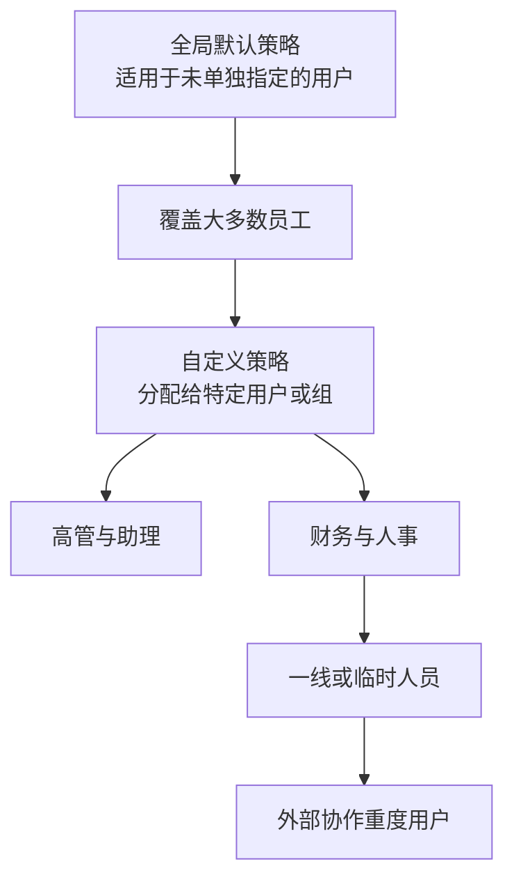
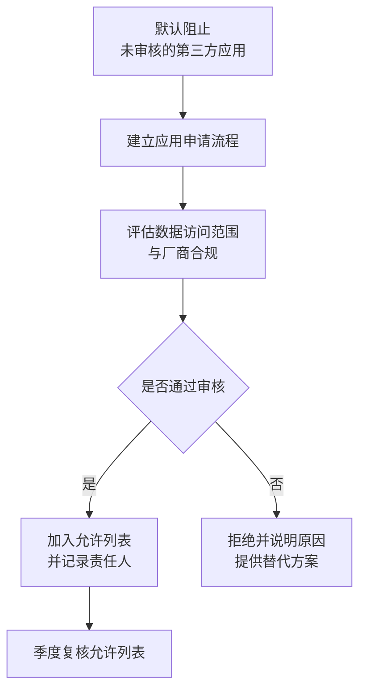

# 第4篇 终端与协作 · 第7节 Teams 策略管理

> **所属：** 第4篇 终端与协作：Office、Teams、文件。  
> **本节小节：** 4.58 ～ 4.67。  
> **本节性质：** 生产配置。策略决定"谁能做什么"，配置过松会失控，过严会让用户绕道。  
> **前置条件：** 已完成[第6节](06-Teams结构与团队治理.md)，治理规则已发布。  
> **导航：** [返回第4篇目录](README.md)｜上一节：[Teams 结构与团队治理](06-Teams结构与团队治理.md)｜下一节：[Teams 外部协作](08-Teams外部协作.md)

---

## 4.58 Teams 策略的基本概念

Teams 的管理方式是**按策略类型分别配置，再分配给不同用户群体**。

| 策略类型 | 控制什么 |
|---|---|
| 会议策略 | 谁能创建会议、录制、共享屏幕、大厅行为等 |
| 消息策略 | 能否撤回消息、删除消息、使用哪些聊天功能 |
| 应用权限策略 | 允许安装哪些应用 |
| 应用设置策略 | 应用如何显示、是否固定 |
| 团队策略 | 频道相关行为 |
| 语音/呼叫策略 | 电话相关能力（如已启用） |
| 通知策略 | 通知行为 |
| 直播事件策略 | 大型活动能力 |

### 4.58.1 策略分配的基本模型

> **推荐：** 先把**全局默认策略**调成适合多数员工的状态，再为少数特殊群体建自定义策略。不要一开始就建十几套策略——维护成本高，且容易出现"某个用户到底命中哪条"的困惑。

---

## 4.59 会议策略（最重要的一类）

### 4.59.1 关键设置项

| 设置 | 说明 | 建议起点 |
|---|---|---|
| 允许云录制 | 谁能录制会议 | **限定范围**，不建议全员开放 |
| 允许转录 | 生成文字记录 | 按合规要求决定 |
| 会议大厅（Lobby） | 谁需要等待批准入会 | **外部与匿名用户进大厅** |
| 匿名用户可否加入 | 未登录用户参会 | 按业务需要（第8节） |
| 匿名用户可否启动会议 | 无内部人员时先开始 | 通常**不允许** |
| 谁可以成为演示者 | 控制共享与管理权限 | 默认限制为组织者与内部人员 |
| 屏幕共享范围 | 整个屏幕/单个窗口/禁止 | 按需 |
| 允许远程控制 | 他人控制你的电脑 | **谨慎开放**，外部参与者通常禁止 |
| 会议聊天 | 是否允许、匿名者能否聊天 | 按需 |
| 会议录制自动过期 | 见第6节 4.55 | **需与合规确认** |
| 水印、会议加密等增强能力 | 取决于许可（如 Teams Premium） | 按需核对许可 |

### 4.59.2 三条建议起点

> **必做：**
> 1. **外部和匿名参与者默认进大厅**，由内部人员放行。这能防止"陌生人静默进入内部会议"。
> 2. **默认只有组织者和内部演示者可以共享屏幕**，防止外部人员在会议中投放不当内容。
> 3. **录制权限限定范围**，并配合录制规则培训（谁能录、录了放哪、保留多久）。

### 4.59.3 录制的合规提醒

| 项目 | 要求 |
|---|---|
| 告知义务 | 录制时应让参与者知悉（Teams 会有提示，但**制度上也应明确**） |
| 涉及外部人员 | 建议在录制前口头确认 |
| 敏感会议 | 明确禁止录制的场景（如涉及个人信息、商业秘密的讨论） |
| 存放位置 | 重要录制转存到指定站点（第6节 4.55） |
| 保留期 | 与法务确认，不沿用默认值 |

> **高风险：** 录制涉及个人信息和商业秘密。**录制规则应由法务和 HR 参与确定**，不能只由 IT 决定技术开关。

---

## 4.60 消息策略

| 设置 | 说明 | 建议 |
|---|---|---|
| 允许删除已发送消息 | 用户可删除自己的消息 | 按合规要求；注意审计需求 |
| 允许编辑已发送消息 | — | 通常允许 |
| 是否允许阅后即焚类功能 | 影响留痕 | 按合规要求，通常**限制** |
| 优先通知（紧急消息） | 反复提醒直到查看 | 限定范围，避免滥用 |
| 允许使用表情、贴纸、GIF | 影响正式度与流量 | 按企业文化 |
| 聊天中删除消息（所有者） | 团队内容管理 | 按需 |

> **必做：** 如果企业有**审计或留痕要求**，删除消息的策略必须与合规负责人确认（第5篇）。不要让"用户可随意删除聊天记录"与"需要留痕"两个要求同时存在而无人发现。

---

## 4.61 应用权限策略（安全重点）

Teams 应用可以访问企业数据，属于**第三方授权风险**。

| 应用来源 | 说明 | 建议 |
|---|---|---|
| Microsoft 提供的应用 | 平台自带 | 通常允许 |
| 第三方应用（应用商店） | 由外部厂商提供 | **默认限制**，按需审核放行 |
| 自定义/内部开发应用 | 企业自研 | 按内部流程审核 |

### 4.61.1 建议做法

审核要点：

- [ ] 该应用需要访问哪些数据（邮件？文件？聊天？）。
- [ ] 厂商是否可信、数据存放在哪里（**涉及数据出境需评估**）。
- [ ] 是否有业务负责人和明确用途。
- [ ] 是否与现有工具重复。
- [ ] 出问题时的支持渠道。

> **高风险：** 第三方应用授权是绕过 MFA 的常见路径（同意钓鱼）。应用授权控制与第5篇的第三方应用治理是同一件事，应统一管理。

---

## 4.62 按人群设计策略集

| 人群 | 会议策略 | 消息策略 | 应用策略 |
|---|---|---|---|
| 全体员工（全局默认） | 大厅限制、演示者限制、录制受限 | 标准 | 仅允许已审核应用 |
| 管理层与助理 | 可录制、可管理大厅 | 标准 | 标准 |
| 财务/人事 | **限制录制敏感会议**、限制外部会议 | 严格留痕 | 更严格 |
| 培训/市场（需要办活动） | 可录制、可办大型会议 | 标准 | 允许必要活动类应用 |
| 一线/临时人员 | 仅参会 | 基础 | 最少 |
| 外部协作重度用户 | 允许外部会议但强制大厅 | 标准 | 标准 |

> **推荐：** 策略集不要超过 5～6 套。每套都要写清"给谁、为什么"，并纳入季度复核。

---

## 4.63 策略变更纪律

Teams 策略变更会**立即影响用户体验**，必须走变更流程。

| 纪律 | 说明 |
|---|---|
| 先小范围 | 用测试账号或小组验证 |
| 记录原值 | 便于回退 |
| 生效延迟 | 策略变更可能需要一段时间才对所有用户生效，**不要立刻断定"没生效"** |
| 通知用户 | 影响体验的变更要提前通知 |
| 避开重要会议 | 不要在重要活动前调整会议策略 |
| 复核 | 季度复核所有自定义策略 |

> **必做：** 策略生效有延迟。测试时应给出足够的等待时间，并用**实际用户账号**验证，而不是只看管理界面显示的配置。

---

## 4.64 与会议室设备的配合

如果企业有 Teams 会议室设备或计划采购：

| 项目 | 要点 |
|---|---|
| 设备账号 | 使用资源账号（第3篇 3.14），不使用员工个人账号 |
| 许可 | 会议室设备通常需要特定许可，需核对 |
| 策略 | 设备账号通常需要单独的策略（例如自动接受入会） |
| 物理安全 | 设备位于公共区域，需考虑未授权操作风险 |
| 更新维护 | 纳入设备管理与巡检 |
| 网络 | 会议室网络质量优先保障（第9节） |

> **推荐：** 会议室设备是"高频被使用、低频被维护"的资产。建议纳入月度巡检（开机、通话质量、更新状态），否则往往在重要会议前才发现问题。

---

## 4.65 电话能力（按需）

如果企业考虑用 Teams 替代传统电话：

| 项目 | 说明 |
|---|---|
| 许可 | 需要额外的电话相关许可与套餐，**必须单独核对采购** |
| 号码 | 号码获取与落地方式因地区而异，**中国地区的可用性与合规要求需专门确认** |
| 呼叫队列/自动话务员 | 前台、客服场景 |
| 紧急呼叫 | 有特殊合规要求，必须专项评估 |
| 现有 PBX 集成 | 需要额外方案与设备 |

> **必做：** Teams 电话能力在不同国家和地区的可用性、合规要求差异很大。**不要根据国外资料就假设可用**，必须与供应商和合规部门共同确认后再纳入范围。

---

## 4.66 策略清单（本节交付物）

| 编号 | 策略名称 | 类型 | 分配对象 | 关键设置 | 负责人 | 复核周期 |
|---|---|---|---|---|---|---|
| TP1 | 全局默认会议策略 | 会议 | 全体 | 外部进大厅、演示者受限、录制受限 |  | 季度 |
| TP2 | 管理层会议策略 | 会议 | 管理层与助理 | 可录制 |  | 季度 |
| TP3 | 财务人事策略 | 会议+消息 | 财务、人事 | 限制录制、严格留痕 |  | 季度 |
| TP4 | 活动类策略 | 会议 | 培训、市场 | 大型会议与录制 |  | 季度 |
| TP5 | 应用权限策略 | 应用 | 全体 | 仅允许审核应用 |  | 季度 |
| TP6 | 一线人员策略 | 会议+消息 | 一线/临时 | 仅参会 |  | 半年 |

---

## 4.67 本节完成检查表

- [ ] 已理解 Teams 按策略类型配置、按用户分配的模型。
- [ ] 全局默认策略已调整为适合多数员工的状态。
- [ ] 自定义策略数量控制在 5～6 套以内，且每套写明"给谁、为什么"。
- [ ] **外部与匿名参与者默认进入会议大厅。**
- [ ] **默认限制谁可以成为演示者与共享屏幕。**
- [ ] 匿名用户是否可加入、是否可先启动会议已明确决定。
- [ ] 远程控制权限已按风险评估配置。
- [ ] 录制权限已限定范围，并配合录制规则培训。
- [ ] **录制规则（谁能录、敏感会议禁录、告知义务、存放位置、保留期）已由法务和 HR 参与确定。**
- [ ] 消息删除与留痕策略已与合规负责人确认。
- [ ] 应用权限策略默认阻止未审核的第三方应用。
- [ ] 已建立应用申请与审核流程（含数据访问范围与数据出境评估）。
- [ ] 应用允许列表已记录责任人，并纳入季度复核。
- [ ] 策略变更已纳入变更管理：先小范围、记录原值、考虑生效延迟、提前通知。
- [ ] 已用**实际用户账号**验证策略效果，而不是只看管理界面。
- [ ] 会议室设备（如有）使用资源账号、许可已核对、已纳入巡检。
- [ ] 电话能力（如考虑）已与供应商和合规部门确认地区可用性与要求。
- [ ] 策略清单已留档，含分配对象、关键设置、负责人和复核周期。

> **进入下一节的条件：** 策略已生效并验证。下一节处理 **Teams 外部协作**——外部访问、来宾访问、共享频道和匿名会议的区别与治理，这是最容易造成数据外泄的部分。
