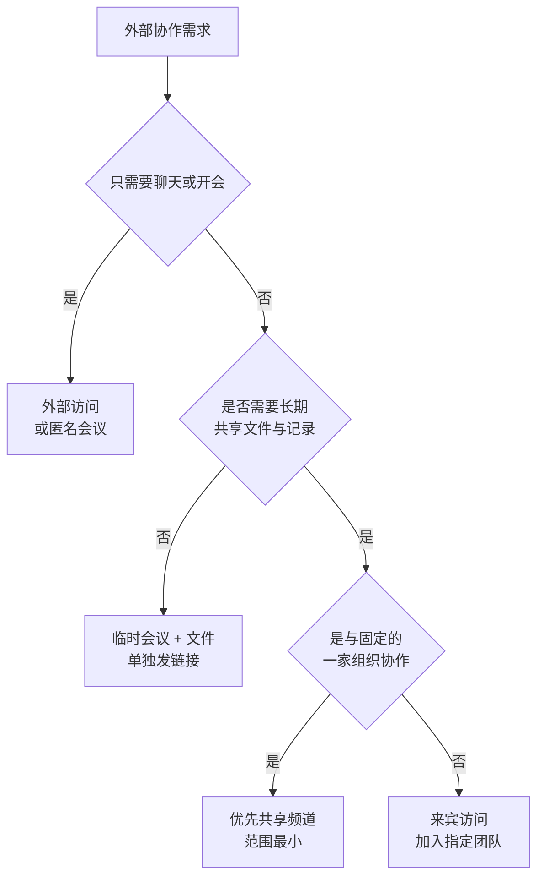
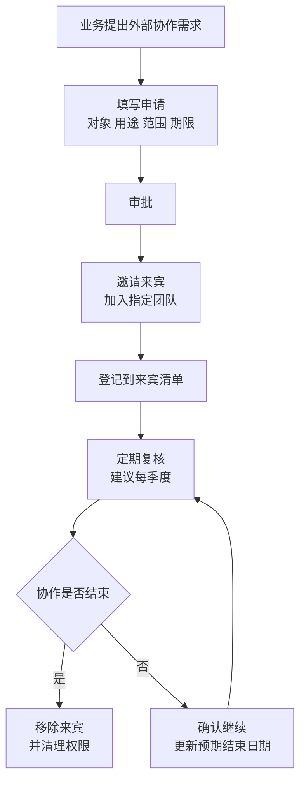

# 第4篇 终端与协作 · 第8节 Teams 外部协作

> **所属：** 第4篇 终端与协作：Office、Teams、文件。  
> **本节小节：** 4.68 ～ 4.75。  
> **本节性质：** 安全与治理。**这是 Teams 中最容易造成数据外泄的部分**，也是最容易配错的部分。  
> **前置条件：** 已完成[第7节](07-Teams策略管理.md)；第1篇 1.17 的外部协作需求调查已完成。  
> **导航：** [返回第4篇目录](README.md)｜上一节：[Teams 策略管理](07-Teams策略管理.md)｜下一节：[Teams 客户端与会议质量](09-Teams客户端与会议质量.md)

---

## 4.68 四种外部协作方式（必须分清）

新手最常犯的错误是把这四件事混为一谈，结果配置时"以为开的是 A，实际开的是 B"。

| 方式 | 通俗理解 | 外部人员的身份 | 能访问什么 |
|---|---|---|---|
| **外部访问**（联邦） | 和**其他企业的 Teams 用户**聊天、通话 | 保留在**他们自己**的组织 | 只能聊天/会议，**不进入你的团队** |
| **来宾访问** | 邀请外部人员**加入你的团队** | 在你的租户中创建**来宾账号** | 该团队的频道、文件、聊天 |
| **共享频道** | 把**某一个频道**共享给外部组织 | 保留在他们自己的组织（B2B 直接连接） | **仅该共享频道**，不是整个团队 |
| **匿名会议参与** | 未登录的人参加会议 | 无账号 | 仅该次会议 |

### 4.68.1 关键区别（容易搞错的两点）

> **必做：** 记住这两条：
>
> 1. **来宾账号不能被添加到共享频道。** 共享频道的外部参与依赖 **Microsoft Entra B2B 直接连接**，是与来宾邀请不同的机制。
> 2. **共享频道要允许外部组织的人加入，还与 Microsoft 365 组的外部人员设置相关**；配置不全会出现"邀请报错"的情况。

官方说明见 [Microsoft Teams 中的共享频道](https://learn.microsoft.com/en-us/microsoftteams/shared-channels)。

### 4.68.2 如何选择

> **推荐：** 优先级建议为：**能用会议解决 → 用共享频道 → 才用来宾访问**。来宾访问的权限范围最大，治理成本最高。

---

## 4.69 外部访问（与其他企业 Teams 用户沟通）

| 配置选项 | 说明 | 建议 |
|---|---|---|
| 允许所有外部域 | 与任何 Teams 组织互通 | 便利但风险较高 |
| **仅允许指定域** | 白名单 | **推荐**：只允许有业务关系的合作方 |
| 阻止指定域 | 黑名单 | 适合"基本开放但排除个别方"的场景 |
| 全部阻止 | 完全关闭 | 强管控场景 |

### 4.69.1 决策要点

- [ ] 业务上真正需要与哪些外部组织日常沟通？
- [ ] 是否需要双向？（对方也要开放相应设置才能互通）
- [ ] 是否允许外部用户主动发起聊天？
- [ ] 是否允许与个人 Teams 账号（非组织账号）沟通？
- [ ] 员工是否理解"和外部人聊天时不要发送内部资料"？

> **高风险：** 完全开放外部访问后，攻击者可以用任意 Teams 组织的账号直接给员工发消息，并附带链接——这是近年新增的钓鱼路径。**建议采用白名单**，或至少限制外部用户主动发起会话。

---

## 4.70 来宾访问（邀请外部人员加入团队）

来宾会在你的租户中获得一个**来宾账号**，能进入被邀请的团队。

### 4.70.1 必须定义的规则

| 规则 | 说明 |
|---|---|
| 谁可以邀请来宾 | 建议限定为团队所有者或经批准的人 |
| 是否需要审批 | 建议需要，尤其涉及敏感数据的团队 |
| 允许哪些外部域 | 可与外部访问的白名单协同 |
| 来宾能做什么 | 可限制创建频道、删除消息等 |
| **来宾是否需要 MFA** | **建议要求**（通过条件访问，第2篇） |
| 来宾能访问哪些团队 | 最小必要，不要加入公共团队 |
| 来宾文件权限 | 与 SharePoint 外部共享策略协同（第 11 节） |
| **协作结束日期** | 每个来宾都应有预期结束时间 |
| 复核周期 | 建议每季度 |
| 谁负责移除 | 明确责任人 |

### 4.70.2 来宾治理流程

### 4.70.3 来宾清单（交付物）

| 来宾邮箱 | 所属外部组织 | 加入团队 | 邀请人 | 批准人 | 邀请日期 | 预期结束 | 是否要求 MFA | 最近复核 | 状态 |
|---|---|---|---|---|---|---|---|---|---|
| 待填写 | 待填写 | 待填写 | 待填写 | 待填写 | 待填写 | 待填写 | 待填写 | 待填写 | 活跃 |

> **必做：** 来宾清单必须有**预期结束日期**这一列。绝大多数企业的来宾问题不是"邀请太随意"，而是"**项目结束了没人移除**"——三年前的供应商账号还能看文件。

---

## 4.71 共享频道（范围最小的外部协作）

### 4.71.1 优点

| 优点 | 说明 |
|---|---|
| 范围最小 | 外部人员**只能看到这一个频道**，不是整个团队 |
| 对方体验好 | 外部人员在**自己的 Teams 中**就能访问，无需切换组织 |
| 身份留在对方组织 | 由对方组织管理其账号生命周期（员工离职由对方处理） |
| 适合长期固定合作 | 例如与某家供应商或客户的持续项目 |

### 4.71.2 注意事项

- 需要双方组织都完成相应配置并建立信任关系。
- **来宾账号不能加入共享频道**（见 4.68.1）。
- 每个共享频道有**独立的 SharePoint 站点**，权限与团队其他部分分离。
- 需要明确谁能创建共享频道、能与哪些组织共享。
- 与哪些外部组织建立连接，应有审批和登记。

> **推荐：** 对于"长期与固定几家合作方协作"的场景，共享频道通常比来宾访问更好：范围更小、对方更方便、生命周期管理更清晰。

---

## 4.72 匿名会议参与

| 配置 | 说明 | 建议 |
|---|---|---|
| 是否允许匿名用户加入会议 | 未登录用户参会 | 按业务需要；面向客户的会议通常需要 |
| 匿名用户能否启动会议 | 无内部人员时先开始 | **通常不允许** |
| **会议大厅** | 匿名用户是否需要等待批准 | **必须进大厅** |
| 匿名用户能否共享屏幕 | 演示者权限 | 通常**不允许** |
| 匿名用户能否聊天 | — | 按需 |
| 会议链接管理 | 避免重复使用同一链接 | 重要会议使用新链接 |

### 4.72.1 高风险场景提醒

> **高风险：**
> - **会议链接被转发**：如果不启用大厅，任何拿到链接的人都能直接进入内部会议。
> - **周期性会议长期使用同一链接**：链接一旦外泄，风险持续存在。
> - **在会议中共享敏感屏幕**：参与者名单未核对时容易泄露。
>
> 建议：重要会议（管理层、财务、人事、涉密项目）**启用大厅并逐个核对参与者名单**，会议开始后确认"是否有不认识的人"。

---

## 4.73 与文件共享策略的协同（最容易脱节的地方）

Teams 的外部协作设置与 SharePoint/OneDrive 的外部共享设置是**两套配置**，必须协同。

| 场景 | 涉及的配置 |
|---|---|
| 来宾能否看到团队文件 | Teams 来宾设置 **+** SharePoint 外部共享策略 |
| 能否发匿名共享链接 | SharePoint/OneDrive 共享设置（第 11 节） |
| 共享频道文件 | 该频道站点的共享设置 |
| 聊天中发给外部人的文件 | 个人 OneDrive 的共享设置 |

> **必做：** 只在 Teams 侧限制是**不够的**。如果 SharePoint 侧允许"任何人链接"，员工仍可以把文件链接发给任何外部人。两侧策略必须一起设计（第 11 节会详细展开）。

### 4.73.1 常见配置矛盾

| 矛盾 | 后果 |
|---|---|
| Teams 禁止来宾，但 SharePoint 允许任何人链接 | 文件仍可外泄 |
| Teams 允许来宾，但 SharePoint 完全禁止外部共享 | 来宾进了团队看不到文件，产生工单 |
| 共享频道已建立，但站点共享策略过严 | 外部方无法协作 |
| 个人 OneDrive 可任意外部共享 | 绕过所有团队治理 |

---

## 4.74 定期复核（外部协作治理的关键动作）

### 4.74.1 季度复核清单

- [ ] 导出当前**全部来宾账号**清单。
- [ ] 与来宾登记表比对，找出**未登记**的来宾。
- [ ] 找出已过预期结束日期的来宾，确认是否移除。
- [ ] 找出**长期无活动**的来宾账号。
- [ ] 检查外部访问白名单是否仍与业务一致。
- [ ] 检查共享频道的外部组织连接是否仍需要。
- [ ] 检查含外部人员的团队是否都有 `EXT-` 类标识（第6节 4.48）。
- [ ] 检查是否有来宾被加入了不该加入的团队（尤其是含敏感数据的团队）。
- [ ] 检查外部共享链接（与第 11 节协同）。
- [ ] 记录本次复核结果、处理动作和责任人。

> **推荐：** 复核结果要形成简短报告并发给业务负责人。让业务看到"你们部门有 12 个外部账号仍可访问文件"，比 IT 单方面清理更有效。

---

## 4.75 本节完成检查表

- [ ] 已分清四种外部协作方式（外部访问、来宾访问、共享频道、匿名会议）。
- [ ] 已理解**来宾账号不能加入共享频道**，共享频道使用 B2B 直接连接。
- [ ] 已按"会议 → 共享频道 → 来宾访问"的优先级确定各业务场景的方式。
- [ ] 外部访问采用**白名单**或有明确的开放范围决策，并说明理由。
- [ ] 已决定是否允许外部用户主动发起会话、是否允许与个人账号沟通。
- [ ] 来宾邀请权限已限定，且需要审批。
- [ ] **来宾已通过条件访问要求 MFA**（或已书面接受风险）。
- [ ] 来宾清单已建立，包含**预期结束日期**、批准人和复核记录。
- [ ] 来宾治理流程（申请 → 审批 → 登记 → 复核 → 移除）已发布，责任人已明确。
- [ ] 共享频道的创建权限、可连接的外部组织已有审批和登记。
- [ ] 匿名会议设置已确定：**大厅必开**，匿名者不可启动会议、通常不可共享屏幕。
- [ ] 重要会议已要求核对参与者名单，并避免长期复用同一链接。
- [ ] **Teams 外部设置与 SharePoint/OneDrive 外部共享策略已协同设计**，无相互矛盾。
- [ ] 已确认个人 OneDrive 的外部共享设置不会绕过团队治理。
- [ ] 季度复核清单已建立，责任人和报告对象已明确。
- [ ] 首次复核已执行，未登记来宾和过期来宾已处理。

> **进入下一节的条件：** 外部协作策略已配置并与文件共享策略协同。下一节处理 **Teams 客户端与会议质量**——这是用户满意度最直接的部分。
