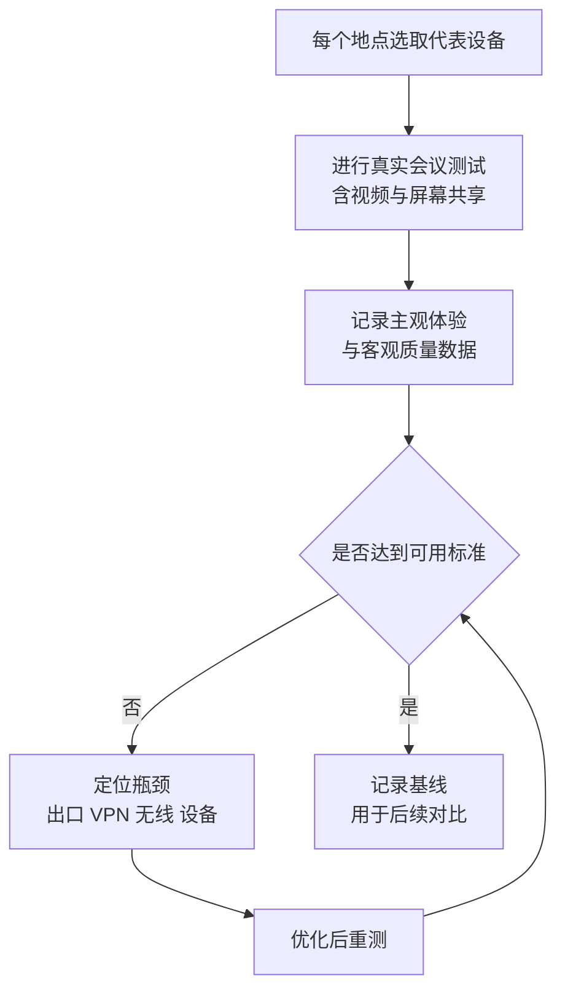
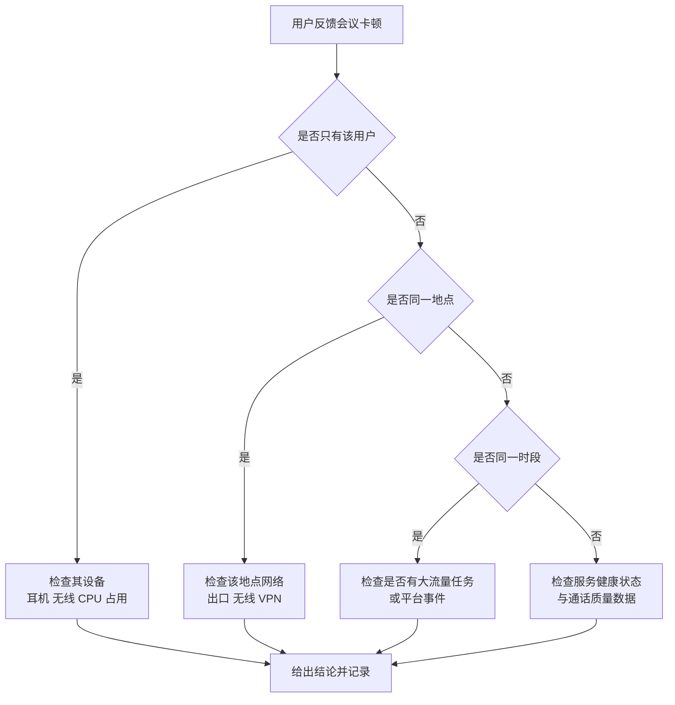

# 第4篇 终端与协作 · 第9节 Teams 客户端与会议质量

> **所属：** 第4篇 终端与协作：Office、Teams、文件。  
> **本节小节：** 4.76 ～ 4.83。  
> **本节性质：** 部署与优化。**会议质量是用户对整个项目评价的关键因素**——会议卡顿会让用户否定整个 Microsoft 365 项目。  
> **前置条件：** 已完成[第8节](08-Teams外部协作.md)；第1篇 1.16 的网络调查已完成。  
> **导航：** [返回第4篇目录](README.md)｜上一节：[Teams 外部协作](08-Teams外部协作.md)｜下一节：[SharePoint 与 OneDrive 基础](10-SharePoint与OneDrive基础.md)

---

## 4.76 客户端部署

### 4.76.1 各平台客户端

| 平台 | 说明 |
|---|---|
| Windows 桌面版 | 主力客户端，功能最完整 |
| Mac 桌面版 | 功能接近，个别差异 |
| 网页版 | 免安装，部分功能受限（视浏览器） |
| iOS / Android | 移动端，会议与聊天为主 |
| Teams 会议室设备 | 专用硬件（第7节 4.64） |

### 4.76.2 部署方式

| 方式 | 适合 |
|---|---|
| 随 Office 部署一起安装 | 统一部署（第3节） |
| 单独通过部署工具或 Intune 下发 | 需要独立控制版本时 |
| 用户自行安装 | 小规模、临时设备 |

### 4.76.3 部署要点

- [ ] 确认客户端版本保持更新（Teams 通常自动更新）。
- [ ] 确认是否随系统启动（影响用户接收通知）。
- [ ] 确认与 Outlook 的会议插件正常（可在 Outlook 中创建 Teams 会议）。
- [ ] 共享电脑场景确认登录与注销行为。
- [ ] 虚拟桌面场景需专门优化方案，**不要假设与普通电脑相同**。

> **高风险：** 虚拟桌面（VDI）环境中的音视频体验需要专门的优化方案。如果企业大量使用虚拟桌面，**必须在试点阶段实测会议质量**，否则上线后会出现大面积卡顿抱怨。

---

## 4.77 音视频设备准备

| 设备 | 建议 |
|---|---|
| 耳机 | **强烈建议配备**（带麦克风），比笔记本内置麦克风效果好得多 |
| 摄像头 | 按需 |
| 会议室设备 | 专业方案（第7节 4.64） |
| 扬声器（开放办公区） | 建议用耳机替代，避免互相干扰 |

### 4.77.1 一个低成本高回报的建议

> **推荐：** 给需要频繁开会的员工配备**质量合格的耳机**。会议质量抱怨中相当一部分不是网络问题，而是：
>
> - 用笔记本内置麦克风，收进大量环境噪音。
> - 用手机免提，回声严重。
> - 多人在同一房间用各自设备开会，产生啸叫。
>
> 耳机的成本远低于反复排查"网络问题"的人力成本。

---

## 4.78 网络要求与常见误区

### 4.78.1 Teams 会议对网络的要求特点

| 特点 | 说明 |
|---|---|
| 实时性敏感 | 比下载文件更怕**延迟、抖动、丢包**，而不只是带宽不足 |
| 双向流量 | 上行带宽同样重要（很多企业只关注下行） |
| 按并发估算 | 应按**每个地点的并发参会人数**估算，而不是员工总数 |
| 自适应 | 会根据网络状况自动降低质量（所以"能开会"不等于"网络没问题"） |

### 4.78.2 三个常见误区

| 误区 | 事实 |
|---|---|
| "我们带宽 200M，肯定够" | 带宽够但**丢包和抖动**大，会议照样卡 |
| "把所有流量都走总部出口更安全" | 实时媒体流量绕行会显著增加延迟 |
| "VPN 全流量转发没问题" | 容量不足的 VPN 是会议质量的常见瓶颈 |

> **推荐：** 是否采用本地互联网出口、是否对实时媒体流量分流、是否配置 QoS，应由**网络管理员结合安全要求实测决定**，并按地点分别评估（第1篇 1.16）。

---

## 4.79 分地点质量评估

| 地点 | 员工数 | 预计并发参会 | 出口方式 | 是否走 VPN | 实测结果 | 处理方案 |
|---|---|---|---|---|---|---|
| 总部 | 待填写 | 待填写 | 待填写 | 待填写 | 待测试 | — |
| 分公司A | 待填写 | 待填写 | 待填写 | 待填写 | 待测试 | — |
| 工厂 | 待填写 | 待填写 | 待填写 | 待填写 | 待测试 | — |
| 门店 | 待填写 | 待填写 | 待填写 | 待填写 | 待测试 | — |
| 居家办公 | 待填写 | 待填写 | 家庭宽带 | 待填写 | 待测试 | — |

### 4.79.1 实测方法

> **必做：** 测试必须包含**多人同时开视频会议 + 屏幕共享**的场景，而不是两个人简单通话。真实压力下的表现才有参考价值。

---

## 4.80 会议质量排查

### 4.80.1 分层排查顺序

### 4.80.2 常见原因与处理

| 现象 | 常见原因 | 处理 |
|---|---|---|
| 声音断续 | 丢包、无线信号弱 | 改有线；优化无线；检查丢包 |
| 有回声 | 同一房间多设备、未用耳机 | 使用耳机；只保留一台设备的音频 |
| 视频模糊 | 带宽不足、自动降质 | 检查上行带宽与并发 |
| 屏幕共享卡顿 | 带宽或 CPU 不足 | 关闭不必要的视频；检查设备性能 |
| 频繁掉线 | 网络不稳定、VPN 断连 | 检查链路；评估分流 |
| 只有部分人听不到 | 个别设备或地点问题 | 分层排查 |
| 会议室设备异常 | 设备未更新、线路问题 | 纳入巡检 |
| 加入会议慢 | 客户端或身份验证环节 | 检查客户端版本与登录 |

> **验证点：** 排查后要记录结论。会议质量问题最怕"每次都说是网络问题"却从不定位到具体环节——这样问题会长期反复出现。

---

## 4.81 客户端登录与常见故障

| 现象 | 常见原因 | 处理 |
|---|---|---|
| 无法登录 | 身份问题、MFA 未完成、条件访问阻止 | 查登录日志（第2篇 2.114） |
| 登录后看不到团队 | 尚未被加入、同步延迟 | 确认成员身份 |
| 收不到通知 | 通知设置、客户端未启动、系统权限 | 检查客户端与系统通知权限 |
| 看不到会议 | 日历与 Exchange 集成问题 | 确认邮箱状态（第3篇） |
| 无法创建 Teams 会议（Outlook 中） | 插件未加载 | 检查 Outlook 加载项 |
| 文件打不开 | 权限或站点问题 | 见第 10～11 节 |
| 外部人员无法加入 | 外部协作策略 | 见第8节 |
| 手机端问题 | 应用版本、后台限制 | 更新应用；检查省电策略 |

> **推荐：** Teams 的问题经常"根因不在 Teams"：日历问题在 Exchange、文件问题在 SharePoint、登录问题在 Entra ID。排查时先判断属于哪一层（第6节 4.45 的关系图很有用）。

---

## 4.82 测试用例（上线前必做）

| 编号 | 测试内容 | 期望结果 | 状态 |
|---|---|---|---|
| M1 | 桌面客户端登录 | 成功 | ☐ |
| M2 | 网页版登录与开会 | 成功 | ☐ |
| M3 | 手机端登录与开会 | 成功 | ☐ |
| M4 | 1:1 通话（音频） | 清晰 | ☐ |
| M5 | 多人视频会议（≥5 人，跨地点） | 可接受 | ☐ |
| M6 | 屏幕共享 + 视频同时进行 | 可接受 | ☐ |
| M7 | 在 Outlook 中创建 Teams 会议 | 成功 | ☐ |
| M8 | 会议大厅行为符合策略 | 符合 | ☐ |
| M9 | 会议录制并找到录制文件 | 成功，位置符合预期 | ☐ |
| M10 | 频道中共同编辑文件 | 成功 | ☐ |
| M11 | 外部人员加入会议（按策略） | 符合预期 | ☐ |
| M12 | 来宾访问团队（按策略） | 符合预期 | ☐ |
| M13 | 共享频道协作（如启用） | 成功 | ☐ |
| M14 | 会议室设备入会（如有） | 成功 | ☐ |
| M15 | 虚拟桌面环境会议（如有） | 可接受 | ☐ |
| M16 | 各地点分别实测会议质量 | 达到基线 | ☐ |
| M17 | 手机在移动网络下开会 | 可用 | ☐ |
| M18 | 断网重连行为 | 可恢复 | ☐ |

---

## 4.83 本节完成检查表

- [ ] 各平台客户端部署方式已确定并执行。
- [ ] Outlook 中可正常创建 Teams 会议。
- [ ] 共享电脑与虚拟桌面场景已单独验证，虚拟桌面已确认优化方案。
- [ ] 已为频繁开会人员配备合格耳机。
- [ ] 已理解 Teams 对延迟、抖动、丢包和上行带宽的敏感性。
- [ ] 已按**每地点并发参会人数**（而非员工总数）评估网络需求。
- [ ] 已完成分地点网络实测，含多人视频 + 屏幕共享的压力场景。
- [ ] 是否分流、是否配置 QoS 已由网络管理员结合安全要求决定并记录。
- [ ] 居家办公与移动网络场景已实测。
- [ ] 已建立会议质量分层排查流程，并要求记录定位结论。
- [ ] 常见故障对照表已交付服务台。
- [ ] 已明确"Teams 问题可能根因在 Exchange / SharePoint / Entra ID"的排查思路。
- [ ] 测试用例 M1～M18 已按适用范围执行并记录。
- [ ] 录制文件位置已验证符合第6节 4.55 的预期。
- [ ] 会议室设备（如有）已验证并纳入巡检。
- [ ] 已记录各地点质量基线，用于后续对比。

> **进入下一节的条件：** 客户端可用、各地点会议质量达到基线。**Teams 部分（第 6～9 节）至此完成。** 下一节进入文件部分：SharePoint 与 OneDrive 的基础概念与权限模型。
