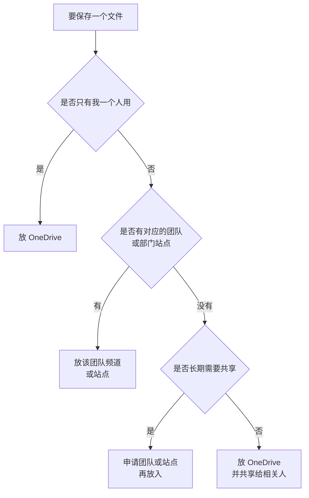
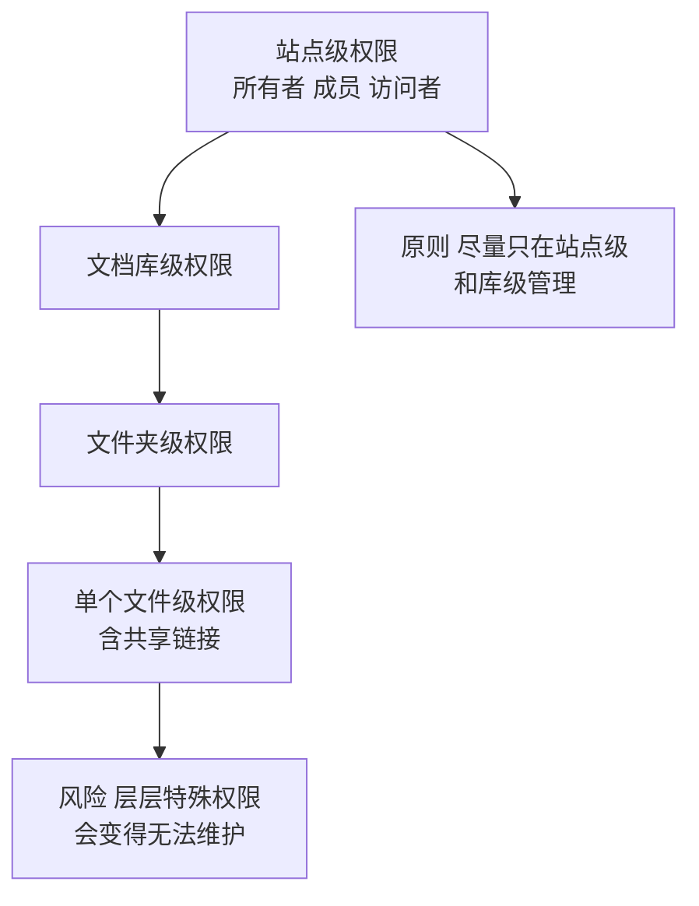

# 第4篇 终端与协作 · 第10节 SharePoint 与 OneDrive 基础

> **所属：** 第4篇 终端与协作：Office、Teams、文件。  
> **本节小节：** 4.84 ～ 4.95。  
> **本节性质：** 概念与结构设计。**文件放错位置是最难事后补救的问题**，因为它涉及权限、交接和合规。  
> **前置条件：** 已完成 Teams 部分（第 6～9 节）；第1篇 1.18 的文件需求调查已完成。  
> **导航：** [返回第4篇目录](README.md)｜上一节：[Teams 客户端与会议质量](09-Teams客户端与会议质量.md)｜下一节：[共享权限与外部共享治理](11-共享权限与外部共享治理.md)

---

## 4.84 本节目标

完成本节后应当达到：

1. 分清 SharePoint 与 OneDrive 各自的定位。
2. 能明确回答"这个文件应该放哪里"。
3. 理解权限模型（站点级、库级、文件夹级、文件级）。
4. 有一份**文件存放规则**发给全员。

> **必做：** 本节的核心产出是一句话规则：**"个人在做的放 OneDrive，团队共用的放 Teams/SharePoint。"** 这句话要写进培训材料，因为它能预防后面 80% 的文件问题。

---

## 4.85 SharePoint 与 OneDrive 的定位

| 项目 | SharePoint | OneDrive |
|---|---|---|
| 通俗理解 | **公司的文件柜**（部门/项目共用） | **你自己的抽屉**（个人工作文件） |
| 归属 | 组织 / 团队 | 个人 |
| 员工离职后 | 站点仍在，不受影响 | **需要数据交接**，且有保留期限 |
| 适合放什么 | 部门文件、项目资料、正式记录、共享模板 | 草稿、个人笔记、正在处理的文件 |
| 默认可见性 | 站点成员 | 仅自己（除主动共享） |
| 与 Teams 的关系 | 团队频道文件存放在这里 | 聊天中发的文件存放在这里 |

### 4.85.1 一个重要事实

> **高风险：** OneDrive **不是"网盘备份"**，而是个人工作区。把部门唯一一份重要资料放在某个员工的 OneDrive 里，会带来三个问题：
>
> 1. 该员工离职后，文件随其账号进入**保留和删除流程**（见第 13 节）。
> 2. 其他人默认看不到，需要该员工主动共享。
> 3. 权限跟着个人走，无法按部门管理。
>
> 这是企业最常见、也最容易造成实际损失的文件治理错误。

---

## 4.86 文件到底该放哪里（决策表）

| 文件类型 | 建议位置 | 理由 |
|---|---|---|
| 个人草稿、临时文件 | **OneDrive** | 个人管理 |
| 个人笔记、学习资料 | OneDrive | 不需共享 |
| 部门共用文件（制度、模板、台账） | **Teams 频道 / SharePoint** | 不依赖个人账号 |
| 项目资料 | 项目团队的频道 | 随项目生命周期管理 |
| 正式记录、合同、财务档案 | **由合规要求决定的受控站点** | 需要保留、权限和审计 |
| 需要与外部协作的文件 | 受控站点或共享频道 | 便于设置范围和到期 |
| 会议录制（重要） | 转存到指定站点（第6节 4.55） | 避免过期或随个人账号流失 |
| 应用数据库文件（如 Access） | **不要放同步文件夹** | 可能损坏；需确认应用支持 |
| 大量图片、视频素材 | 专用站点或库 | 避免占满个人空间 |
| 含敏感个人信息的文件 | 受控站点 + 权限限制（第5篇） | 合规要求 |

### 4.86.1 判断流程

> **推荐：** 把这张图做成一页纸贴在内网。用户不需要理解 SharePoint 架构，只需要会判断"这文件是我一个人的，还是大家的"。

---

## 4.87 SharePoint 站点的类型

| 类型 | 说明 | 适合 |
|---|---|---|
| **团队站点**（与 Microsoft 365 组关联） | 由创建 Teams 团队时自动创建，或单独创建 | 部门与项目协作 |
| 通信站点 | 面向"发布内容给多数人看" | 公司公告、制度发布、知识库 |
| 频道站点 | 私有/共享频道自动创建 | 频道文件（权限独立） |
| 中心站点 | 把多个站点组织在一起 | 大型组织的导航结构 |

### 4.87.1 站点规划建议

| 建议 | 原因 |
|---|---|
| 部门与项目用团队站点 | 与 Teams 协作一致 |
| 制度、公告、知识库用通信站点 | 多数人只读，少数人发布 |
| 避免建立过多站点 | 每个站点都需要所有者和复核 |
| 命名与 Teams 保持一致 | 便于识别（第6节 4.48） |
| 敏感数据站点单独规划 | 权限、保留、标签独立控制（第5篇） |

> **必做：** 不要让 SharePoint 站点脱离治理清单。团队清单（第6节 4.50）应覆盖所有站点，包括不通过 Teams 创建的独立站点。

---

## 4.88 权限模型（必须理解的四层）

### 4.88.1 三种标准角色

| 角色 | 能做什么 |
|---|---|
| **所有者** | 完全控制，含权限管理 |
| **成员** | 增删改文件 |
| **访问者** | 只读 |

### 4.88.2 权限设计纪律

| 纪律 | 说明 |
|---|---|
| **尽量用组授权，不用逐个人授权** | 人员变动时只需改组成员 |
| 尽量在站点或库级设置 | 层层文件夹特殊权限极难维护 |
| 谨慎使用"断开继承" | 一旦断开，后续变更不会自动生效 |
| 只读需求就给访问者 | 不要一律给成员 |
| 敏感文件用单独的库或站点 | 而不是在共用库里做复杂例外 |
| 每个站点至少两名所有者 | 与团队所有者要求一致 |
| 定期复核权限 | 建议每季度 |

> **高风险：** 最常见的权限灾难是：为了让某个人看一个文件夹，断开继承并单独授权；半年后重复几十次，最终没人知道谁能看什么。**遇到"要给个别人特殊权限"的需求时，优先考虑把文件移到合适的位置，而不是改权限结构。**

---

## 4.89 库、视图与元数据（够用就好）

| 概念 | 说明 | 建议 |
|---|---|---|
| 文档库 | 存放文件的容器 | 按大类分库，不要只用一个库塞所有东西 |
| 文件夹 | 传统组织方式 | 可以用，但**层级不要太深**（见 4.94 路径长度） |
| 元数据（列） | 给文件加属性（如年份、客户、类型） | 有明确检索需求时才用 |
| 视图 | 按条件筛选和排序显示 | 常用场景建几个视图即可 |

> **推荐：** 新手企业不要一上来就设计复杂的元数据体系。用户不会填，最终一片空白。**先用清晰的库和文件夹结构 + 搜索**，等用户习惯后再考虑元数据。

---

## 4.90 存储容量与配额

| 项目 | 说明 |
|---|---|
| 组织总容量 | 按 **1 TB + 每个许可 10 GB** 计算（E3 计入），实际值在管理中心查看 |
| 站点配额 | 可按站点设置上限 |
| 个人 OneDrive 容量 | E3 默认 **1 TB / 用户**；符合条件时管理员可提升（最高 5 TB），以官方存储说明为准 |
| 大文件 | 有单文件大小上限 |
| 回收站占用 | 回收站中的内容通常仍计入容量 |
| 版本历史占用 | 多版本会占用空间 |

### 4.90.1 需要提前规划的两件事

- [ ] **旧文件服务器的数据总量**是否在容量范围内（第 13 节）。
- [ ] 视频、设计素材等大文件是否需要单独站点和配额。

> **必做：** 迁移前统计旧共享盘的实际数据量。很多企业以为"云端空间无限"，迁移到一半才发现需要额外采购存储。

---

## 4.91 版本历史

| 项目 | 说明 |
|---|---|
| 作用 | 保留文件的历史版本，可回退到之前状态 |
| 默认行为 | 文档库默认启用版本控制 |
| 价值 | 误改、误覆盖时可恢复；比"另存为副本2副本3"好得多 |
| 占用空间 | 版本会占用存储 |
| 可配置 | 可设置保留版本数或按时间策略管理 |

> **推荐：** 向用户培训"**版本历史**"的存在。很多用户仍在用"文件名加日期"的方式管理版本，导致同一份文件出现十几个副本，最后没人知道哪个是最新的。

---

## 4.92 回收站与恢复能力

| 层级 | 说明 |
|---|---|
| 第一阶段回收站（用户可见） | 用户删除的文件先进入这里，可自行恢复 |
| 第二阶段回收站（管理员） | 从第一阶段清除后进入，管理员可恢复 |
| 总体保留 | SharePoint Online 中删除项目通常在 **93 天**内可恢复，之后永久删除 |
| 站点恢复 | 删除的站点在一定期限内可由管理员恢复 |
| 文件恢复（时间点） | 可将库或 OneDrive 恢复到过去某个时间点，用于应对批量误删或勒索加密 |

### 4.92.1 必须让用户和服务台都知道的三件事

> **必做：**
> 1. 删除的文件**先在自己的回收站里**——用户找不到文件时先看回收站。
> 2. 回收站不是永久保存，**约 93 天后永久删除**。
> 3. 回收站**不等于备份**（见 4.93）。

---

## 4.93 保留、回收站与备份的区别（重要概念）

这三个概念经常被混淆，导致企业以为"数据已经安全了"。

| 机制 | 解决什么 | 不解决什么 |
|---|---|---|
| **回收站** | 用户误删的短期恢复 | 超过期限、批量损坏、恶意长期潜伏 |
| **版本历史** | 误改、误覆盖 | 文件被整体删除后超期 |
| **保留策略**（第5篇） | 按规则**保存或删除**内容，满足合规 | 不是为了"恢复到任意时间点" |
| **传统备份** | 独立副本、指定恢复点、批量恢复 | 需要额外方案或第三方产品 |

> **高风险：** "我们有保留策略，所以不需要备份"是危险的误解。企业应根据**误删、恶意删除、勒索软件、长期归档、审计和恢复时间要求**评估自带能力是否足够（第5篇会展开）。

---

## 4.94 同步与命名的技术限制（提前告知可省大量工单）

| 限制 | 说明 |
|---|---|
| **文件名中的特殊字符** | 某些字符会导致无法同步，需避免 |
| 保留名称 | 某些系统保留名不可用 |
| **路径长度** | 云端支持较长的相对路径；但同步客户端下，**OneDrive 根目录路径 + 文件相对路径的总长度存在上限**（超过会同步失败） |
| 文件数量 | 单库和单文件夹的项目数有上限，过多会影响性能 |
| 单文件大小 | 有上限 |
| 不适合同步的文件 | 数据库文件、正在被程序独占的文件、PST 文件 |

### 4.94.1 实用建议

> **必做：** 迁移旧共享盘之前（第 13 节），**先扫描并修正**：
>
> - [ ] 文件名含特殊字符的文件。
> - [ ] 路径过长的文件（通常是"部门\年份\项目\子项目\...\很长的文件名"这类深层结构）。
> - [ ] 单文件夹内文件数量极多的目录。
> - [ ] 数据库文件、PST 文件（应单独处理，不放同步目录）。
>
> 这一步不做，迁移后会出现大量"同步失败"的红叉，用户会认为系统不可靠。

### 4.94.2 结构建议

| 建议 | 原因 |
|---|---|
| 文件夹层级控制在 3～4 层以内 | 避免路径过长 |
| 文件名简洁 | 同上 |
| 不要把年份+部门+项目全写进文件名 | 用文件夹或元数据表达 |
| 大批量小文件考虑打包或分库 | 性能 |

---

## 4.95 本节完成检查表

- [ ] 已明确 SharePoint（公司文件柜）与 OneDrive（个人抽屉）的定位差异。
- [ ] 已理解 OneDrive 中的文件在员工离职后需要交接且有保留期限。
- [ ] **已发布"文件放哪里"的一页纸规则**（含判断流程图）。
- [ ] 已确定站点类型规划（团队站点、通信站点、敏感数据站点）。
- [ ] 所有站点（含非 Teams 创建的独立站点）已纳入治理清单。
- [ ] 每个站点至少两名所有者。
- [ ] 权限设计遵循"用组授权、尽量在站点/库级管理"的原则。
- [ ] 已避免层层文件夹断开继承的特殊权限。
- [ ] 只读需求已使用访问者角色，而非一律给成员。
- [ ] 敏感文件使用单独的库或站点，而非在共用库中做复杂例外。
- [ ] 已确定权限季度复核机制与责任人。
- [ ] 库与文件夹结构已规划；未过度设计元数据。
- [ ] 已确认组织总容量、站点配额与个人容量，并与旧共享盘数据量比对。
- [ ] 大文件（视频、素材）已规划独立站点或配额。
- [ ] 已向用户培训**版本历史**的使用，替代"文件名加日期"的习惯。
- [ ] 已向用户和服务台说明回收站位置、约 93 天保留期，以及"回收站不等于备份"。
- [ ] 已区分回收站、版本历史、保留策略和传统备份的作用。
- [ ] 已扫描旧数据中的特殊字符、超长路径、超多文件目录和不适合同步的文件类型。
- [ ] 已发布文件夹层级与命名建议（层级 3～4 层、文件名简洁）。

> **进入下一节的条件：** 存放规则已发布、权限模型已设计。下一节处理**共享权限与外部共享治理**——这是文件外泄的主要途径，必须与第8节的 Teams 外部策略协同。
