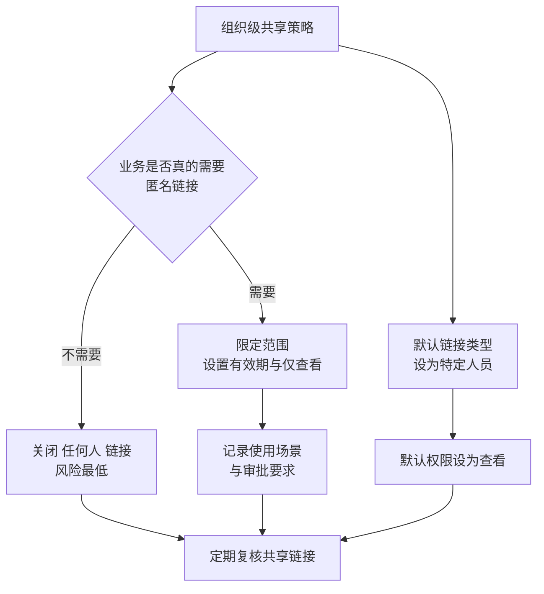
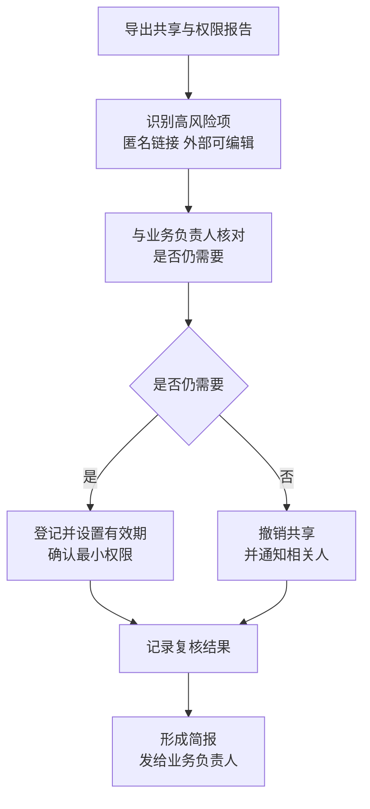

# 第4篇 终端与协作 · 第11节 共享权限与外部共享治理

> **所属：** 第4篇 终端与协作：Office、Teams、文件。  
> **本节小节：** 4.96 ～ 4.102。  
> **本节性质：** 安全治理。**这是企业文件外泄的主要途径**，一个链接就可能把整个文件夹发给外部。  
> **前置条件：** 已完成[第10节](10-SharePoint与OneDrive基础.md)；第8节的 Teams 外部协作策略已确定。  
> **导航：** [返回第4篇目录](README.md)｜上一节：[SharePoint 与 OneDrive 基础](10-SharePoint与OneDrive基础.md)｜下一节：[OneDrive 同步与文件恢复](12-OneDrive同步与文件恢复.md)

---

## 4.96 三种共享链接（用户每天在用，多数人不理解）

用户点"共享"时，会看到几个选项。它们的**风险差别极大**。

| 链接类型 | 谁能打开 | 风险 |
|---|---|---|
| **"任何人"链接**（匿名链接） | **任何拿到链接的人**，无需登录 | **最高**：链接被转发即失控，无法追踪是谁看的 |
| **"组织内"链接** | 公司内任何已登录用户 | 中：外部拿不到，但公司内所有人可见 |
| **"特定人员"链接** | 仅指定的人（需验证身份） | **最低**：可追踪、可回收 |
| 现有访问权限 | 仅已有权限的人 | 最低 |

### 4.96.1 必须让用户理解的一件事

> **必做：** 向用户明确说明：
>
> **"任何人"链接就像把文件放在马路上，只是路人不知道地址。** 一旦地址被转发（微信群、邮件、外部系统），任何人都能打开，而且你**不知道谁看过**。
>
> 培训中应给出替代做法：**发给具体的人**（特定人员链接），而不是图方便发匿名链接。

---

## 4.97 组织级共享策略设置

这些设置在 SharePoint 管理中心配置，**决定了用户最多能做什么**。

| 设置 | 选项 | 建议起点 |
|---|---|---|
| **组织级外部共享范围** | 任何人 / 新的和现有来宾 / 仅现有来宾 / 仅组织内 | **"新的和现有来宾"**（需登录验证），而不是"任何人" |
| 站点级外部共享 | 可比组织级更严，不能更宽 | 敏感站点设为"仅组织内" |
| **OneDrive 外部共享** | 可单独设置 | **建议比 SharePoint 更严** |
| 默认链接类型 | 用户点共享时的默认选项 | **设为"特定人员"**或"组织内" |
| 默认链接权限 | 查看 / 编辑 | **默认设为"查看"** |
| 匿名链接有效期 | 天数限制 | 若允许匿名链接，**必须设置有效期** |
| 匿名链接权限 | 是否允许编辑 | 通常仅允许查看 |
| 限定可共享的外部域 | 白名单/黑名单 | 与 Teams 外部访问白名单协同（第8节） |
| 来宾是否可再分享 | — | 通常**不允许** |
| 需要重新验证的频率 | 外部用户需定期重新验证 | 建议启用 |

### 4.97.1 两个关键决策

> **推荐：** 如果业务能接受，**关闭"任何人"链接**是收益最大的单项配置。确实需要对外发文件的场景（如向大量客户发资料），可以改用带登录的共享、或专门的对外发布方式。

### 4.97.2 默认设置的重要性

> **必做：** 把**默认链接类型设为"特定人员"、默认权限设为"查看"**。
>
> 原因：绝大多数用户会直接用默认选项。如果默认是"任何人 + 可编辑"，那么用户在不知情的情况下就发出了高风险链接。**改默认值的成本极低，收益极高。**

---

## 4.98 OneDrive 的共享要单独管

个人 OneDrive 是**最容易绕过所有治理**的地方：

| 风险 | 说明 |
|---|---|
| 员工把部门文件放在 OneDrive 并对外共享 | 绕过站点级策略 |
| 离职前批量共享给个人邮箱 | 数据带走 |
| 长期存在的匿名链接 | 无人复核 |
| 聊天中发的文件（存在 OneDrive） | 随聊天扩散 |

### 4.98.1 建议配置

- [ ] OneDrive 外部共享范围**不高于** SharePoint（建议更严）。
- [ ] 敏感岗位（财务、人事、研发）可进一步限制其 OneDrive 外部共享。
- [ ] 定期检查 OneDrive 中的对外共享链接。
- [ ] 与第5篇的数据防泄漏措施协同。
- [ ] 离职流程中必须检查并清理该员工创建的共享链接（第 13 节、第6篇）。

> **高风险：** 只在 SharePoint 侧收紧、忘了 OneDrive，是很常见的配置遗漏。攻击面就从"部门站点"转移到了"每个人的个人空间"。

---

## 4.99 与 Teams 策略的协同（避免自相矛盾）

第8节 4.73 已提示，这里给出具体核对方法。

| 场景 | Teams 侧设置 | SharePoint 侧设置 | 是否一致 |
|---|---|---|---|
| 来宾能否进入团队 | 来宾访问开关 | — | ☐ |
| 来宾能否看到团队文件 | 来宾访问 | 站点外部共享设置 | ☐ |
| 能否发匿名链接 | — | 组织/站点共享设置 | ☐ |
| 共享频道外部协作 | B2B 直接连接 | 频道站点共享设置 | ☐ |
| 聊天中发文件给外部人 | 外部访问 | **OneDrive 共享设置** | ☐ |
| 外部域限制 | Teams 外部访问白名单 | SharePoint 域白名单 | ☐ |

### 4.99.1 核对方法

> **必做：** 用**实际测试**验证，而不是只看配置界面：
>
> 1. 用一个外部测试邮箱，尝试打开内部用户共享的文件链接。
> 2. 尝试让来宾账号访问团队文件。
> 3. 尝试生成"任何人"链接，确认是否被阻止或带有效期。
> 4. 从聊天中给外部人发一个文件，观察行为。
>
> 测试结果与预期不一致的，说明两侧策略不协同。

---

## 4.100 共享的日常治理

### 4.100.1 需要定期检查的内容

| 检查项 | 频率 | 责任人 |
|---|---|---|
| 现存的匿名（"任何人"）链接 | 每月 | 待填写 |
| 外部来宾可访问的站点与文件 | 每季度 | 待填写 |
| 已过期或不再需要的共享 | 每季度 | 待填写 |
| 敏感站点的权限变更 | 每季度 | 待填写 |
| OneDrive 中的对外共享 | 每季度 | 待填写 |
| 断开继承的特殊权限位置 | 每半年 | 待填写 |
| 长期无活动的来宾账号 | 每季度 | 待填写（与第8节合并执行） |

### 4.100.2 治理流程

> **推荐：** 把复核结果做成简短报告发给各部门负责人，例如"你部门目前有 8 个文件通过匿名链接对外开放"。业务看到具体数字后配合度会明显提高。

---

## 4.101 敏感文件的额外保护

对于合同、财务、人事、研发等敏感内容，除权限外还应考虑：

| 措施 | 说明 | 所属篇章 |
|---|---|---|
| 单独站点 + 严格权限 | 不与普通文件混放 | 本节 |
| 关闭该站点的外部共享 | 站点级可比组织级更严 | 本节 |
| 敏感度标签 | 标记并可附加保护 | 第5篇 |
| 数据防泄漏（DLP） | 阻止敏感内容外发 | 第5篇 |
| 保留策略 | 满足合规保存要求 | 第5篇 |
| 审计与告警 | 异常访问可发现 | 第5篇 |
| 设备条件 | 仅受管设备可下载 | 第5篇 |

> **必做：** 本节先把"**权限最小化 + 关闭敏感站点外部共享**"做到位。这两项不需要额外许可，收益最直接。更高级的标签和 DLP 在第5篇按许可情况实施。

---

## 4.102 本节完成检查表

- [ ] 已向用户培训三种共享链接的区别，特别是"任何人"链接的风险。
- [ ] 已决定是否允许"任何人"（匿名）链接，并说明理由。
- [ ] 若允许匿名链接：已设置**有效期**、通常限为仅查看，并登记使用场景。
- [ ] 组织级外部共享范围已设置（建议为"新的和现有来宾"而非"任何人"）。
- [ ] **默认链接类型已设为"特定人员"，默认权限已设为"查看"。**
- [ ] 敏感站点的外部共享已设为"仅组织内"。
- [ ] **OneDrive 外部共享设置不高于 SharePoint**，敏感岗位已进一步限制。
- [ ] 已限定可共享的外部域，并与 Teams 外部访问白名单协同。
- [ ] 来宾不可再次分享（或已书面接受风险）。
- [ ] 已启用外部用户定期重新验证（如适用）。
- [ ] 已通过**实际测试**验证 Teams 与 SharePoint/OneDrive 策略协同，无自相矛盾。
- [ ] 已建立共享与权限的定期检查清单，含频率与责任人。
- [ ] 首次复核已执行：匿名链接、外部可编辑项、过期共享已处理。
- [ ] 复核结果已形成简报发给业务负责人。
- [ ] 敏感站点已做到权限最小化并关闭外部共享。
- [ ] 更高级的保护措施（标签、DLP、设备条件）已列入第5篇待办。

> **进入下一节的条件：** 共享策略已收紧并验证。下一节处理 **OneDrive 同步与文件恢复**——同步是用户日常最容易出问题的环节，恢复能力则决定误删和勒索时的应对。
