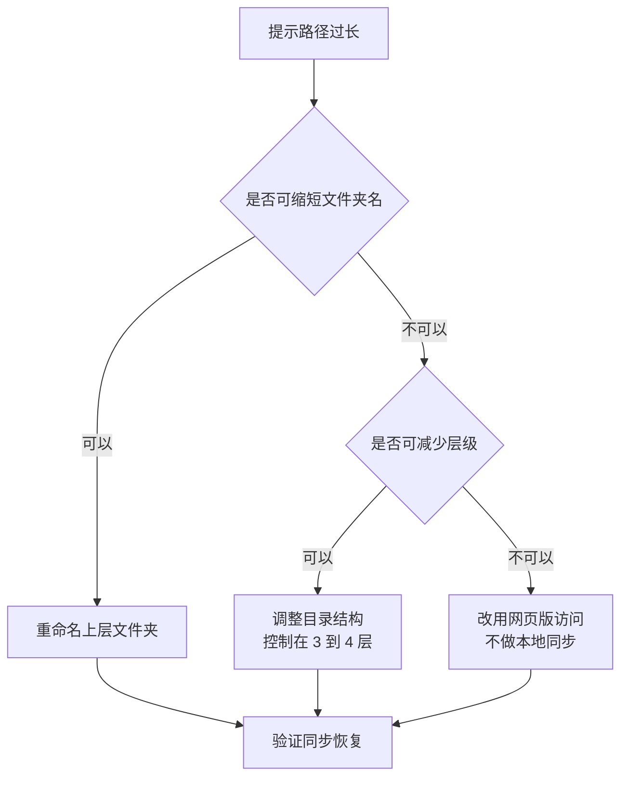

# 第4篇 终端与协作 · 第12节 OneDrive 同步与文件恢复

> **所属：** 第4篇 终端与协作：Office、Teams、文件。  
> **本节小节：** 4.103 ～ 4.111。  
> **本节性质：** 部署与运维。同步是**用户日常工单量最大**的环节；恢复能力决定误删和勒索时的应对效果。  
> **前置条件：** 已完成[第11节](11-共享权限与外部共享治理.md)。  
> **导航：** [返回第4篇目录](README.md)｜上一节：[共享权限与外部共享治理](11-共享权限与外部共享治理.md)｜下一节：[文件迁移与数据交接](13-文件迁移与数据交接.md)

---

## 4.103 同步客户端的作用与两个模式

OneDrive 同步客户端让用户在**文件资源管理器**里直接使用云端文件。

| 内容 | 可同步 |
|---|---|
| 个人 OneDrive | ✅ |
| SharePoint 站点的文档库 | ✅（"添加快捷方式到我的文件"或"同步"） |
| Teams 频道文件 | ✅（本质是 SharePoint 库） |

### 4.103.1 两种使用方式

| 方式 | 说明 | 建议 |
|---|---|---|
| **添加快捷方式到"我的文件"** | 在 OneDrive 中显示为一个快捷方式，跨设备一致 | **推荐**，管理更简单 |
| 传统"同步"按钮 | 在本机建立独立的同步文件夹 | 可用，但多库同步时结构较乱 |

> **推荐：** 统一培训用户使用"添加快捷方式"方式，避免同一个用户在不同电脑上出现不同的本地目录结构。

---

## 4.104 文件按需（Files On-Demand）

这是**必须向用户解释**的功能，否则会产生大量误解。

| 图标状态 | 含义 |
|---|---|
| 云朵图标 | 文件**只在云端**，本地不占空间，打开时下载 |
| 绿色对勾 | 已下载到本地，可离线打开 |
| 实心绿色对勾 | 已标记为"始终保留在此设备上" |
| 同步中图标 | 正在上传或下载 |
| 红色叉号 | **同步出错**，需要处理 |

### 4.104.1 用户最常见的三个误解

| 误解 | 事实 | 应对 |
|---|---|---|
| "文件不见了，只剩个云朵" | 文件在云端，双击即可打开 | 培训图标含义 |
| "出差没网就打不开了" | 需要提前标记"始终保留在此设备上" | 教用户如何为出差准备离线文件 |
| "同步就是备份" | 同步是双向的，**本地删除会同步删除云端** | 明确说明（见 4.108） |

> **必做：** 出差前的离线准备要写进用户指引。销售和外勤人员因为"到客户现场打不开文件"而产生的抱怨，几乎都是这个原因。

---

## 4.105 已知文件夹备份（把桌面和文档同步到云）

可以把用户的**桌面、文档、图片**自动同步到 OneDrive。

| 优点 | 注意 |
|---|---|
| 电脑损坏或更换时文件不丢 | 会占用 OneDrive 容量 |
| 换电脑后自动恢复 | 首次同步会产生较大流量 |
| 减少"文件只在本地"的风险 | 桌面上大量文件会导致同步缓慢 |
| 对勒索软件有一定缓解（配合版本历史） | 不能替代备份 |

### 4.105.1 部署建议

- [ ] 先在试点用户上启用，观察容量和流量影响。
- [ ] 提前提醒用户清理桌面上的大文件和无用文件。
- [ ] 确认**不要把数据库文件、PST 文件**放在被同步的文件夹中。
- [ ] 分批启用，避免全公司同时首次同步造成带宽压力。
- [ ] 向用户说明变化（"你的桌面文件现在也在云端了"）。

> **高风险：** 如果用户桌面上有几十 GB 的视频或素材，启用后会同时产生大量上传流量并占满容量。**务必先统计再分批启用。**

---

## 4.106 同步的技术限制（提前告知）

| 限制 | 说明 |
|---|---|
| **特殊字符** | 文件名含某些字符会导致同步失败 |
| **路径过长** | 同步客户端下，OneDrive 根目录 + 文件相对路径的总长度有上限，超出会同步失败 |
| 文件数量过多 | 单库项目数过大影响性能 |
| 单文件过大 | 有上限 |
| 不适合同步的文件 | 数据库文件（如 Access）、PST、正被程序独占的文件 |
| 磁盘空间不足 | 本地空间不足会导致同步失败 |
| 网络限制 | 代理、防火墙需允许必要连接 |

### 4.106.1 处理路径过长的实用方法

> **推荐：** 迁移旧共享盘时（第 13 节）**先扫描并修正**超长路径和特殊字符，比上线后逐个处理用户工单高效得多。

---

## 4.107 同步冲突与常见故障

| 现象 | 常见原因 | 处理 |
|---|---|---|
| 出现"副本"文件 | 两人同时编辑同一个非 Office 文件，或离线修改后同步 | 培训使用**共同编辑**；保留正确版本 |
| 红色叉号 | 特殊字符、路径过长、空间不足、文件被占用 | 按提示逐项处理 |
| 同步很慢或卡住 | 文件数量多、带宽不足、首次同步 | 等待；分批；检查带宽 |
| 文件显示为只读 | 他人正在编辑、权限不足、检出状态 | 确认权限与编辑状态 |
| 本地删了云端也没了 | **同步是双向的** | 从回收站恢复；培训 |
| 图标一直转圈 | 客户端异常 | 重启客户端；必要时重新链接账号 |
| 换电脑后文件没了 | 未启用已知文件夹备份，或未登录同步客户端 | 登录并同步 |
| Office 文件保存失败 | 同步冲突或权限 | 另存后处理冲突 |

### 4.107.1 共同编辑 vs 各自编辑

> **必做：** 培训用户使用**共同编辑**（多人同时在线编辑同一个 Office 文件），而不是"我改完发你、你改完发我"。
>
> 后者会产生多个版本、覆盖彼此修改，最终需要人工合并——这是文件协作中最浪费时间的问题。

---

## 4.108 同步不是备份（必须反复强调）

| 情况 | 同步的行为 |
|---|---|
| 本地删除文件 | **云端也会删除**（可从回收站恢复） |
| 本地文件被勒索软件加密 | **加密后的版本会同步到云端** |
| 本地误覆盖 | 覆盖会同步（可用版本历史恢复） |

### 4.108.1 真正的防线是什么

| 防线 | 作用 |
|---|---|
| 回收站（约 93 天） | 恢复误删 |
| **版本历史** | 恢复被覆盖或被加密前的版本 |
| **文件恢复（还原到时间点）** | 应对批量误删或勒索加密 |
| 保留策略（第5篇） | 合规保存 |
| 备份方案（第5篇） | 独立副本与批量恢复 |

> **高风险：** 勒索软件加密本地文件后，加密结果会同步到云端。此时**能救命的是版本历史和"还原到某个时间点"功能**，而不是同步本身。这也是必须做恢复演练的原因（4.110）。

---

## 4.109 文件恢复能力（三种手段）

### 4.109.1 用户自助：回收站

| 步骤 | 说明 |
|---|---|
| 1 | 在 OneDrive 或站点中打开回收站 |
| 2 | 找到文件并还原 |
| 3 | 若不在第一阶段回收站，联系管理员查第二阶段 |
| 期限 | 通常约 93 天 |

### 4.109.2 用户自助：版本历史

| 步骤 | 说明 |
|---|---|
| 1 | 右键文件 → 版本历史 |
| 2 | 查看历史版本 |
| 3 | 还原到需要的版本 |
| 适用 | 误改、误覆盖、加密前版本 |

### 4.109.3 管理员/用户：还原到时间点

| 项目 | 说明 |
|---|---|
| 作用 | 把整个 OneDrive 或文档库**还原到过去某个时间点** |
| 适用 | 批量误删、批量覆盖、**勒索软件加密** |
| 限制 | 有可还原的时间范围限制 |
| 注意 | 还原是**整体操作**，会影响该时间点之后的所有变更 |

> **必做：** 服务台必须掌握这三种手段的**适用场景和操作步骤**。用户报告"文件全没了"时，能在几分钟内判断该用哪一种。

---

## 4.110 恢复演练（不做等于没有恢复能力）

### 4.110.1 必须演练的四个场景

| 编号 | 场景 | 演练方法 | 通过标准 |
|---|---|---|---|
| R1 | 用户误删单个文件 | 从回收站还原 | 用户可自助完成 |
| R2 | 文件被错误覆盖 | 用版本历史还原 | 内容正确 |
| R3 | **批量误删一个文件夹** | 管理员协助恢复 | 完整恢复，记录耗时 |
| R4 | **模拟勒索加密** | 在测试账号上大量修改文件后，用"还原到时间点"恢复 | 能恢复到加密前状态 |

### 4.110.2 演练要记录什么

- [ ] 谁执行、用了多长时间。
- [ ] 恢复是否完整（有无遗漏）。
- [ ] 过程中遇到的问题。
- [ ] 用户可自助的部分与必须管理员介入的部分。
- [ ] 结论：当前恢复能力**是否满足业务对恢复时间和恢复点的要求**。

> **必做：** R4（勒索场景）必须在**测试账号**上演练，不要在真实用户数据上操作。演练结论要写进第5篇的备份与恢复评估。

---

## 4.111 本节完成检查表

- [ ] 同步客户端已随部署安装（第3节），并统一使用"添加快捷方式"方式。
- [ ] 已向用户培训**文件按需**的图标含义。
- [ ] 已提供"出差前准备离线文件"的操作指引。
- [ ] 已明确说明"同步不是备份，本地删除会同步删除云端"。
- [ ] 若启用已知文件夹备份：已先统计桌面/文档数据量，并**分批启用**。
- [ ] 已确认数据库文件、PST 文件不在被同步的文件夹中。
- [ ] 已向用户告知同步的技术限制（特殊字符、路径长度、文件数量）。
- [ ] 已提供路径过长的处理方法（缩短名称、减少层级、改用网页版）。
- [ ] 已培训**共同编辑**替代"互发文件"的协作方式。
- [ ] 同步故障对照表已交付服务台。
- [ ] 服务台掌握三种恢复手段（回收站、版本历史、还原到时间点）的适用场景与步骤。
- [ ] 已向用户说明回收站的位置和约 93 天保留期。
- [ ] **恢复演练 R1～R4 已完成并记录**，含勒索场景（在测试账号上）。
- [ ] 演练结论已评估：当前恢复能力是否满足业务的恢复时间和恢复点要求。
- [ ] 演练发现的差距已列入第5篇备份与恢复待办。

> **进入下一节的条件：** 同步稳定、恢复演练完成。下一节处理**文件迁移与数据交接**——把旧共享盘搬上云，以及离职员工的 OneDrive 交接。
