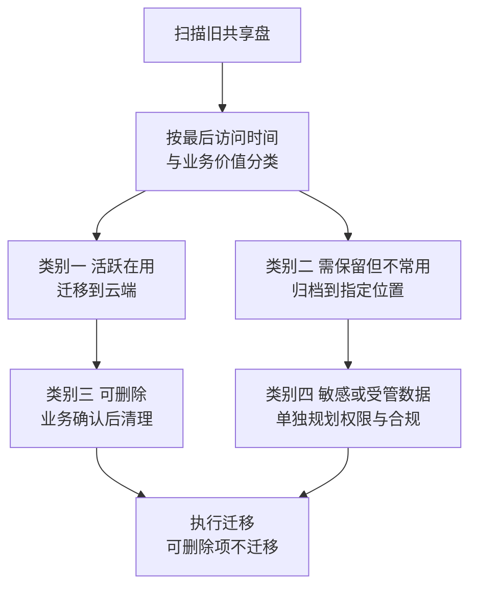
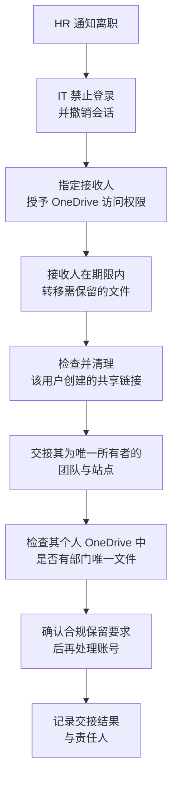

# 第4篇 终端与协作 · 第13节 文件迁移与数据交接

> **所属：** 第4篇 终端与协作：Office、Teams、文件。  
> **本节小节：** 4.112 ～ 4.118。  
> **本节性质：** 迁移与流程。**文件迁移最大的风险不是技术，而是"权限没人说得清"和"数据交接没人负责"。**  
> **前置条件：** 已完成[第12节](12-OneDrive同步与文件恢复.md)；存放规则与权限模型已确定。  
> **导航：** [返回第4篇目录](README.md)｜上一节：[OneDrive 同步与文件恢复](12-OneDrive同步与文件恢复.md)｜下一节：[本篇小结与参考资料](14-本篇小结与参考资料.md)

---

## 4.112 文件迁移的四个来源

| 来源 | 特点 | 目标位置 |
|---|---|---|
| **本地文件服务器 / 共享盘** | 数据量大、权限复杂、有大量历史垃圾 | 按部门/项目迁到 SharePoint |
| **员工电脑本地文件**（桌面、文档） | 分散、无备份 | 个人 OneDrive（已知文件夹备份） |
| **NAS / 其他云盘** | 结构各异 | 按内容分流 |
| 旧 SharePoint Server | 结构相近但需迁移工具 | SharePoint Online |

> **必做：** 迁移前必须回答一个业务问题：**"这些历史文件真的都要迁吗？"** 多数企业的共享盘里有大量十年前的无用数据。全量搬上云 = 花钱存垃圾，还会拖慢迁移和搜索。

---

## 4.113 迁移前的整理（收益最大的一步）

### 4.113.1 四类处理决策

| 类别 | 处理 | 谁决定 |
|---|---|---|
| 活跃在用 | 迁移到对应团队站点 | 业务负责人 |
| 需保留但不常用 | 归档到低频访问位置或独立归档站点 | 业务 + 合规 |
| 可删除 | **业务书面确认后**删除 | 业务负责人 |
| 敏感/受管 | 单独站点、严格权限、合规评估 | 业务 + 合规 + 安全 |

> **高风险：** 删除历史数据必须**业务书面确认**，且建议先移到"待删除"区域观察一段时间再真正删除。IT 不应单方面判断某些文件"看起来没用"。

### 4.113.2 技术清理（第 10、12 节已提示）

- [ ] 扫描并修正**文件名特殊字符**。
- [ ] 扫描并修正**超长路径**（深层目录结构）。
- [ ] 处理单文件夹内**文件数量极多**的目录。
- [ ] 识别数据库文件、PST 文件，单独处理（不放同步目录）。
- [ ] 识别超大单文件。
- [ ] 统计**总数据量**，与容量规划核对（第 10 节 4.90）。

---

## 4.114 权限梳理（迁移中最难的部分）

旧共享盘的权限往往是十年累积的结果：嵌套的本地组、个别人的特殊授权、早已离职的账号。

### 4.114.1 不要"照搬"旧权限

> **必做：** 迁移是**重新梳理权限的最佳时机**，也往往是唯一的机会。
>
> 正确做法是：**按现在的组织结构和业务需要重新设计权限**，而不是把旧的混乱结构原样复制到云端。照搬的结果是把技术债一起搬上云，而且以后更难改。

### 4.114.2 权限梳理表

| 旧共享盘路径 | 目标站点/库 | 谁需要编辑 | 谁需要只读 | 授权方式（组） | 业务确认人 | 状态 |
|---|---|---|---|---|---|---|
| `\\fs01\财务` | 财务部站点 | 财务部成员 | 财务总监指定人员 | 财务部安全组 | 待填写 | 待确认 |
| `\\fs01\公共` | 公司公共站点 | 指定维护人 | 全体员工 | 全员组（只读） | 待填写 | 待确认 |
| `\\fs01\项目\ERP` | ERP 项目团队 | 项目成员 | 相关方 | 项目组 | 待填写 | 待确认 |

### 4.114.3 梳理要点

- [ ] 每个目标位置用**组**授权，而不是逐个人（第 10 节 4.88）。
- [ ] 明确"编辑"和"只读"两类人群，不要一律给编辑。
- [ ] 每个位置有明确的**业务确认人**签字。
- [ ] 离职账号的权限直接清除，不迁移。
- [ ] 不明用途的目录**先不迁移**，进入待确认清单。
- [ ] 敏感目录单独站点、单独权限。

---

## 4.115 迁移执行

### 4.115.1 迁移方式

| 方式 | 适合 | 注意 |
|---|---|---|
| Microsoft 提供的迁移工具 | 文件服务器、旧 SharePoint | 支持批量与增量 |
| 第三方迁移工具 | 复杂场景、需要保留元数据 | 需评估合规与数据流向 |
| 手工上传 | 小量数据 | 易漏、无记录，不适合大规模 |
| 用户自行整理上传 | 个人文件 | 需提供指引与截止日期 |

### 4.115.2 执行纪律（与第3篇邮件迁移一致）

| 纪律 | 说明 |
|---|---|
| **先试迁移** | 选一个部门的一部分目录，验证结果 |
| 分批执行 | 按部门或目录分批 |
| 增量同步 | 首次迁移后，切换前做最后一次增量 |
| **停写窗口** | 明确"从某时起不要再往旧共享盘写文件" |
| 核对数量 | 文件数、总容量、失败项 |
| 保留旧数据 | 迁移后**旧共享盘设为只读并保留一段时间** |
| 记录 | 每批的时间、结果、失败项处理 |

### 4.115.3 迁移后的验证

| 编号 | 验证项 | 方法 | 状态 |
|---|---|---|---|
| F1 | 文件数量与总容量一致 | 对比统计（允许合理差异并说明） | ☐ |
| F2 | 目录结构完整 | 抽查逐层对比 | ☐ |
| F3 | 中文文件名与文件夹名正常 | 抽查 | ☐ |
| F4 | 权限符合梳理表 | 让**实际用户**登录验证 | ☐ |
| F5 | 只读人群确实无法编辑 | 实测 | ☐ |
| F6 | 无权限人群确实无法访问 | 实测 | ☐ |
| F7 | 大文件可正常打开 | 抽查 | ☐ |
| F8 | Office 文件可共同编辑 | 实测 | ☐ |
| F9 | 同步客户端可正常同步 | 实测 | ☐ |
| F10 | 失败项清单已处理 | 逐条 | ☐ |

> **必做：** F4～F6 必须由**实际用户本人**验证。IT 用管理员账号测试永远是"能访问"，无法发现"某部门看不到自己文件"或"外部人员意外能看到"的问题。

---

## 4.116 旧共享盘的保留与下线

参照第3篇邮件系统的做法：

| 阶段 | 动作 |
|---|---|
| 迁移完成 | 旧共享盘**设为只读**（防止用户继续写入） |
| 保留期 | 建议至少 1～3 个月（按合规要求确定） |
| 期间 | 仅供查询与补迁 |
| 下线前检查 | 见下方清单 |
| 下线 | 备份后停用或归档 |

### 4.116.1 下线前检查清单

- [ ] 全部目标目录迁移完成，失败项已处理。
- [ ] 数据完整性验证通过（F1～F10）。
- [ ] 连续一段时间无人访问旧共享盘（可通过日志确认）。
- [ ] 所有用户已改用新位置（无人再问"旧盘在哪"）。
- [ ] 依赖旧路径的**脚本、业务系统、快捷方式**已全部改造（**最容易遗漏**）。
- [ ] 法务、审计、合规保留要求已确认满足。
- [ ] 已对旧数据做**独立备份并验证可恢复**。
- [ ] 业务与管理层书面批准下线。

> **高风险：** "依赖旧路径的脚本和业务系统"是最常被遗漏的一项。很多企业下线共享盘后，某个每月自动跑的报表脚本突然失败，而写脚本的人已经离职。**迁移前必须专门排查映射驱动器和 UNC 路径的引用。**

---

## 4.117 离职与转岗的数据交接

这是文件治理中**长期最容易出事**的环节。

### 4.117.1 OneDrive 的保留机制（必须知道的数值）

| 事实 | 说明 |
|---|---|
| 用户账号被删除后 | 其 OneDrive 会进入保留状态，**默认保留 30 天** |
| 保留期可配置 | 管理员可在 SharePoint 管理中心调整"保留已删除用户 OneDrive 的天数" |
| 保留期结束后 | OneDrive 进入删除状态，**再保留 93 天**，此期间通常仅 SharePoint 管理员可恢复 |
| 期间访问 | 可授予指定人员访问权限，以便下载需要保留的文件 |

官方说明见 [OneDrive 保留与删除](https://learn.microsoft.com/en-us/sharepoint/retention-and-deletion) 与 [设置已删除用户的 OneDrive 保留期](https://learn.microsoft.com/en-us/sharepoint/set-retention)。

> **必做：** 项目必须**主动确认这个保留天数的设置值**，不要沿用默认值而不评估。30 天对很多企业来说太短——员工离职后往往要一两个月才有人发现"某个文件在他那里"。

### 4.117.2 离职交接流程

### 4.117.3 离职必查的五项（容易遗漏）

| 项目 | 为什么容易漏 |
|---|---|
| **个人 OneDrive 中的部门文件** | 只有他自己知道放在哪 |
| **他创建的对外共享链接** | 离职后链接仍可能有效 |
| **他是唯一所有者的团队/站点** | 无人能管理该团队 |
| **聊天中发送的文件**（存在其 OneDrive） | 别人引用的文件可能失效 |
| **他组织的会议录制**（存在其 OneDrive） | 培训或会议记录可能丢失 |

> **高风险：** 上面五项中的任何一项被忽略，都可能在员工离职几个月后造成"文件突然打不开"或"外部人员仍能访问公司文件"。这些应作为离职清单的**必填项**（第6篇会整合为完整流程）。

### 4.117.4 转岗交接

- [ ] 移除原部门站点与团队的权限。
- [ ] 按新岗位授予权限。
- [ ] 原项目资料是否需要继续访问（明确结论并记录）。
- [ ] 若为原团队唯一所有者，需先交接。
- [ ] 个人 OneDrive 中的原部门文件转移到部门站点。

---

## 4.118 本节完成检查表

- [ ] 已回答"哪些历史文件需要迁移"的业务问题，未默认全量搬迁。
- [ ] 已完成四类数据分类（活跃 / 归档 / 可删除 / 敏感）。
- [ ] 删除历史数据已获**业务书面确认**，并采用"先移到待删除区观察"的做法。
- [ ] 技术清理已完成：特殊字符、超长路径、超多文件目录、数据库与 PST 文件、超大文件。
- [ ] 总数据量已统计并与容量规划核对。
- [ ] **权限已按现有组织重新设计，未照搬旧共享盘结构。**
- [ ] 权限梳理表已完成，每个位置有业务确认人。
- [ ] 授权使用组，而非逐个人；已区分编辑与只读人群。
- [ ] 离职账号权限未被迁移；不明用途目录已进入待确认清单。
- [ ] 已完成**试迁移**并验证结果，再执行批量迁移。
- [ ] 已明确停写窗口，并在切换前执行最后一次增量。
- [ ] 迁移验证 F1～F10 已完成；**F4～F6 由实际用户本人验证**。
- [ ] 旧共享盘已设为只读并保留（建议 1～3 个月，按合规确定）。
- [ ] **依赖旧路径的脚本、业务系统、映射驱动器和快捷方式已全部排查改造。**
- [ ] 旧数据已独立备份并验证可恢复；下线已获书面批准。
- [ ] **已确认"已删除用户 OneDrive 保留天数"的设置值**，未沿用默认值而不评估。
- [ ] 离职交接流程已建立，含五项必查（个人 OneDrive 部门文件、对外共享链接、唯一所有者的团队站点、聊天文件、会议录制）。
- [ ] 转岗交接流程已建立。
- [ ] 交接结果有记录和责任人，并已纳入第6篇的入转离流程。

> **进入下一节的条件：** 文件迁移完成、交接流程已建立。**文件部分（第 10～13 节）至此完成。** 下一节汇总本篇小结与参考资料。
