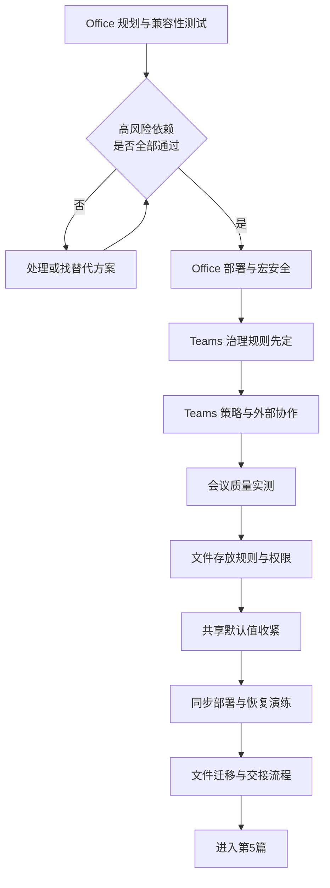

# 第4篇 终端与协作：Office、Teams、文件

> **本篇作用：** 部署桌面 Office 并处理宏与插件兼容，落地 Teams 团队治理与会议，规范 SharePoint 与 OneDrive 的文件存放、共享与交接。  
> **本篇特点：** 技术难度不是最高，但**用户感知最强、治理不做就会失控**。  
> **文档状态：** 本篇正文已完成（14 个小节文件）。表格中的“待填写”是企业实际数据占位。  
> **版本与复核日期：** v1.0，2026-08-28。  
> **对应原章节：** 第7、8、9章。  
> **导航：** [返回方案总目录](../README.md)｜上一篇：[第3篇 邮件](../03-邮件-Exchange配置与迁移/README.md)

---

## 一、本篇小节文件

### Office 部分

| 顺序 | 文件 | 覆盖小节 | 主要内容 | 风险 |
|---:|---|---|---|---|
| 1 | [Office 部署规划](01-Office部署规划.md) | 4.1–4.11 | 用户分组、**版本与 Windows 支持状态**、经典/新版 Outlook、位数、通道、激活 | 中 |
| 2 | [Office 兼容性调查与测试](02-Office兼容性调查与测试.md) | 4.12–4.19 | **依赖清单**、三条调查线索、代表性测试机、测试用例 P1–P18 | **最高** |
| 3 | [Office 安装部署与激活](03-Office安装部署与激活.md) | 4.20–4.29 | 标准配置、**卸载旧版前的备份**、试点、分批推广 | 中高 |
| 4 | [Office 故障排查与更新管理](04-Office故障排查与更新管理.md) | 4.30–4.35 | 安装激活排查、受控更新、先行组、回归测试、版本回退 | 中 |
| 5 | [宏与插件安全](05-宏与插件安全.md) | 4.36–4.42 | 互联网宏默认阻止、**签名与受信任位置**、加载项白名单 | 高 |

### Teams 部分

| 顺序 | 文件 | 覆盖小节 | 主要内容 | 风险 |
|---:|---|---|---|---|
| 6 | [Teams 结构与团队治理](06-Teams结构与团队治理.md) | 4.43–4.57 | 团队/频道/站点关系、创建权限、命名、所有者、生命周期、**录制存储与过期** | 高 |
| 7 | [Teams 策略管理](07-Teams策略管理.md) | 4.58–4.67 | 会议策略、消息策略、**应用权限**、按人群策略集 | 中高 |
| 8 | [Teams 外部协作](08-Teams外部协作.md) | 4.68–4.75 | **四种外部方式的区别**、来宾治理、共享频道、匿名会议 | **高** |
| 9 | [Teams 客户端与会议质量](09-Teams客户端与会议质量.md) | 4.76–4.83 | 客户端部署、音视频设备、分地点网络实测、质量排查 | 中 |

### 文件部分

| 顺序 | 文件 | 覆盖小节 | 主要内容 | 风险 |
|---:|---|---|---|---|
| 10 | [SharePoint 与 OneDrive 基础](10-SharePoint与OneDrive基础.md) | 4.84–4.95 | 定位区别、**文件放哪里**、权限四层模型、回收站与备份的区别、同步限制 | 中 |
| 11 | [共享权限与外部共享治理](11-共享权限与外部共享治理.md) | 4.96–4.102 | 三种共享链接、**默认值收紧**、OneDrive 单独管、与 Teams 协同 | **高** |
| 12 | [OneDrive 同步与文件恢复](12-OneDrive同步与文件恢复.md) | 4.103–4.111 | 文件按需、已知文件夹备份、同步故障、**恢复演练 R1–R4** | 中高 |
| 13 | [文件迁移与数据交接](13-文件迁移与数据交接.md) | 4.112–4.118 | 数据分类、**权限重新梳理**、迁移验证、旧盘下线、**离职五项必查** | 高 |
| 14 | [本篇小结与参考资料](14-本篇小结与参考资料.md) | — | 小结、34 项交付物、进入第5篇条件、29 项官方参考资料 | — |

---

## 二、实施顺序

> **必做：** 三个部分的**放行条件**分别是：
> - Office：所有"高"级别依赖测试通过或有替代方案（第2节）。
> - Teams：治理规则已发布、团队清单已建立（第6节）。
> - 文件：存放规则已发布、共享默认值已收紧（第10、11节）。

---

## 三、本篇七条硬性纪律

1. **高风险 Office 依赖必须由业务用户本人确认结果正确**，不只是"没报错"。
2. **卸载旧版 Office 前必须备份** PST、签名、模板、宏文件、加载项配置。
3. **企业宏靠签名或受控的受信任位置放行**，绝不把桌面或下载文件夹设为受信任位置。
4. **Teams 治理规则先于创建权限开放。**
5. **共享链接默认值设为"特定人员 + 查看"。**
6. **Teams 与 SharePoint/OneDrive 的外部策略必须协同，并用实际测试验证。**
7. **离职必查五项**：个人 OneDrive 中的部门文件、对外共享链接、唯一所有者的团队站点、聊天文件、会议录制。

---

## 四、本篇关键时间线（实施前必须复核）

| 事项 | 状态 |
|---|---|
| **Office LTSC 2021 连接 Microsoft 365 服务** | 支持至 **2026-10-13** |
| Office 2016 / 2019 连接 Microsoft 365 服务 | 已于 **2023-10-10** 结束 |
| Office 2016 / 2019 产品支持 | 已于 **2025-10-14** 结束 |
| **Windows 10** | 已于 **2025-10-14** 终止支持 |
| Microsoft 365 Apps 在 Windows 10 上的安全更新 | 至 **2028-10-10** |
| Office LTSC 2024 | 支持至 **2029-10-09** |
| 经典 Outlook | 至少支持到 **2029 年** |
| Teams 会议录制默认过期 | **120 天**（部分许可不同） |
| 已删除用户 OneDrive 保留 | 默认 **30 天** + 93 天删除状态 |

---

## 五、三条给新手的关键提醒

1. **"我们的宏在新 Office 里能跑"不等于"算出来的数是对的"。** 必须让财务本人核对结果。
2. **聊天里发的文件和会议录制默认在个人 OneDrive**，不在公司公共空间。这决定了离职交接必须做什么。
3. **同步不是备份。** 本地删除会同步删除云端，勒索加密会同步上云。真正的防线是版本历史和"还原到时间点"，而且必须演练过。

---

## 六、阅读提示

- 提示标记 **必做 / 推荐 / 按需 / 高风险 / 验证点 / 回退点 / 许可证要求** 的含义见[方案总目录](../README.md)。
- 所有示例路径、账号、域名和人员信息均为虚构数据。
- 本篇含多项支持截止日期，**实施前请按第14节末尾的"需要重点复核的时效性内容"重新核对官方页面**。
