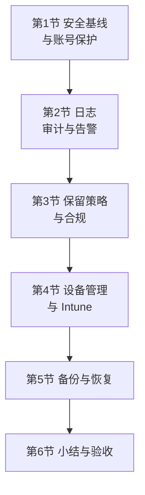
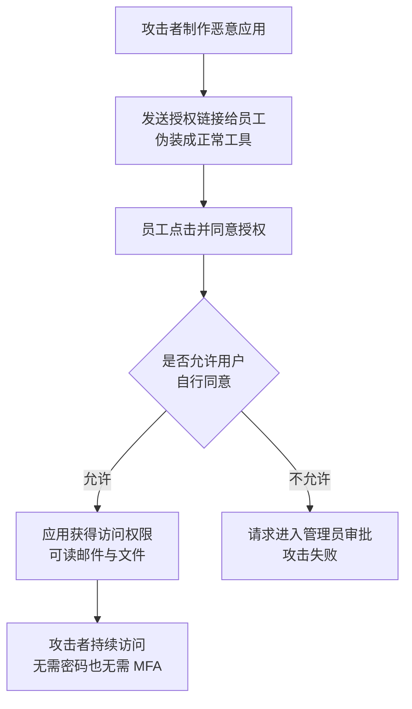

# 第5篇 安全合规与设备管理 · 第1节 安全基线与账号保护

> **所属：** 第5篇 安全、合规与设备管理。  
> **本节小节：** 5.1 ～ 5.14。  
> **本节性质：** 安全落地。**把第1篇 1.24 确定的"最低安全基线"正式变成已配置、已验证的状态。**  
> **前置条件：** 已完成第2～4篇（身份、邮件、终端与协作均已上线）。  
> **导航：** [返回第5篇目录](README.md)｜下一节：[日志、审计与告警](02-日志审计与告警.md)

---

## 5.1 本篇在整个项目中的位置

前四篇让企业"能用起来"，第5篇让企业"用得安全、可审计、可恢复"。

### 5.1.1 本篇与前面各篇的关系

| 前面已做 | 本篇要做 |
|---|---|
| 第2篇：MFA、条件访问、紧急账号 | 复核覆盖率、清理例外、加固管理员 |
| 第3篇：邮件安全策略 | 补齐审计、保留、DLP |
| 第4篇：共享治理、恢复演练 | 落实标签、DLP、备份方案 |
| 各篇的"临时例外" | **本篇统一清零** |

> **必做：** 本篇的一个核心任务是**收口**：把前四篇中所有"临时排除""限时例外""待第5篇处理"的项目集中处理掉。项目结束时如果这些还留着，就变成了长期安全债务。

---

## 5.2 本节目标

完成本节后应当达到：

1. 有一份**已验证**的安全基线检查表（不是"计划做"，而是"已完成并测试"）。
2. 管理员账号、旧式认证、外部转发、第三方应用授权已加固。
3. 安全告警联系人已配置并验证有人接收。
4. 正确理解安全评分的作用与局限。

---

## 5.3 企业面临的真实风险（按发生频率排序）

不要按"技术炫酷程度"排优先级，要按**实际发生频率和损失**排。

| 排序 | 风险 | 典型入口 | 主要防线 | 所在篇章 |
|---:|---|---|---|---|
| 1 | **商业邮件欺诈（BEC）骗汇款** | 钓鱼邮件冒充高管或供应商 | 冒充防护 + **电话回拨双人复核** | 第3篇 3.26、3.34 |
| 2 | **账号被钓** | 中间人钓鱼页面 | **防钓鱼 MFA**（passkey） | 第2篇 2.77 |
| 3 | **勒索软件** | 邮件附件宏、终端漏洞 | 宏管控 + 补丁 + **可恢复能力** | 第4篇 4.37、本篇第5节 |
| 4 | 数据被带走 | 外部共享链接、自动转发、个人网盘 | 共享治理 + 转发限制 + DLP | 第4篇 4.97、第3篇 3.23、本节 |
| 5 | 第三方应用滥用授权 | 同意钓鱼 | 应用授权控制 | 本节 5.9 |
| 6 | 离职员工仍能访问 | 流程缺失 | 入转离流程 | 第6篇 |
| 7 | 管理员账号失控 | 权限过大、无审计 | 最小权限 + 紧急账号 + 审计 | 第2篇、本节 |
| 8 | 设备丢失 | 无设备管理 | 应用保护或设备管理 | 本篇第4节 |

> **推荐：** 把这张表给管理层看。它能解释"为什么要花钱做这些"，也能避免把预算全花在最炫的功能上而忽略最常发生的风险。

---

## 5.4 最低安全基线（本节的核心清单）

下面每一项都要标注**当前状态**，而不是停留在"应该做"。

| 编号 | 控制项 | 要求 | 状态 | 验证方式 |
|---|---|---|---|---|
| S1 | 管理账号与日常账号分离 | 已分离 | ☐ | 查角色分配 |
| S2 | 全局管理员数量最小化 | 仅必要人员 + 紧急账号 | ☐ | 导出角色清单 |
| S3 | 紧急访问账号 | ≥2 个，已演练 | ☐ | 演练记录 |
| S4 | **管理员使用防钓鱼 MFA** | 100% | ☐ | 注册报告 |
| S5 | 全员 MFA | 覆盖率达标 | ☐ | 注册报告 |
| S6 | 旧式身份验证已阻止 | 已阻止，例外已登记 | ☐ | 条件访问 + 登录日志 |
| S7 | 外部自动转发默认限制 | 已限制 | ☐ | 策略 + 抽查 |
| S8 | 外部邮件标识 | 已启用 | ☐ | 实发测试 |
| S9 | 邮件身份验证（SPF/DKIM/DMARC） | 认证与对齐通过 | ☐ | 邮件头 |
| S10 | 邮件安全策略 | 预设策略已应用 | ☐ | 策略页 |
| S11 | **第三方应用授权受控** | 已限制用户自行同意 | ☐ | 配置 + 应用清单 |
| S12 | 外部共享受控 | 默认值已收紧 | ☐ | 实际测试 |
| S13 | 来宾治理 | 清单 + 到期日期 | ☐ | 来宾报告 |
| S14 | **审计日志已开启** | 已开启并可查询 | ☐ | 实际查询 |
| S15 | 安全告警联系人 | 已配置并验证接收 | ☐ | 测试告警 |
| S16 | 保留策略 | 按合规要求配置 | ☐ | 策略页 |
| S17 | 离职流程 | 可执行、已演练 | ☐ | 演练记录 |
| S18 | **恢复能力已演练** | 演练通过 | ☐ | 演练记录 |
| S19 | 设备基线 | 按所选层级实施 | ☐ | 合规报告 |
| S20 | **所有临时例外已清零或有到期管理** | 已处理 | ☐ | 例外清单 |

> **必做：** S20 是最容易被忽略却最重要的一项。请把前四篇中的所有例外（条件访问排除、邮件允许列表、SMTP AUTH 过渡、宏受信任位置、外部共享例外、Office 版本例外）汇总成**一张表**，逐项标注处理结论。

---

## 5.5 管理员账号加固（复核第2篇的落实情况）

| 检查项 | 方法 | 状态 |
|---|---|---|
| 导出当前全部管理角色分配 | 管理中心导出 | ☐ |
| 是否存在未经批准的全局管理员 | 与批准清单比对 | ☐ |
| 是否存在离职人员仍持有角色 | 与 HR 名单比对 | ☐ |
| 是否存在供应商账号超期 | 查到期日期 | ☐ |
| 管理员是否都用防钓鱼 MFA | 查注册方式 | ☐ |
| 管理账号是否被用于收发日常邮件 | 查邮箱使用情况 | ☐ |
| 紧急账号是否在 90 天内演练过 | 查演练记录 | ☐ |
| 紧急账号登录是否有告警 | 测试触发 | ☐ |
| 是否有账号长期未登录（僵尸账号） | 查登录报告 | ☐ |

### 5.5.1 特权访问的进一步加固（按许可）

| 措施 | 说明 | 前提 |
|---|---|---|
| 按需激活高权限角色 | 平时无权限，需要时申请激活并审批 | 需要相应的 Entra 治理能力，须核对许可 |
| 专用管理工作站 | 管理操作只在受控设备上进行 | 设备管理能力 |
| 管理操作审计告警 | 高风险操作触发通知 | 审计与告警配置（第2节） |

> **推荐：** 如果许可支持"按需激活"，这是投入产出比很高的加固措施：即使管理员账号被钓，攻击者拿到的也是一个平时没有权限的账号。

---

## 5.6 旧式身份验证的收尾

第2篇已阻止旧式身份验证，第3篇处理了邮件协议。本节确认**没有遗留通道**：

- [ ] 条件访问的"阻止旧式身份验证"策略处于开启状态（非仅报告）。
- [ ] 登录日志中已无成功的旧式身份验证登录（或例外已登记）。
- [ ] Exchange 中 SMTP AUTH 的租户级与邮箱级设置已按方案配置。
- [ ] 打印机、扫描仪、业务系统的发信改造**已全部完成**（不再依赖过渡方案）。
- [ ] 服务账号已迁移或已登记到期日期。
- [ ] SMTP AUTH 相关时间线已复核（第3篇参考资料中的官方公告）。

> **高风险：** "改造还没完成，所以先保留基本认证"是项目结束时最常见的未完成项。请为每一项设定**明确的截止日期和负责人**，并在第6篇的运维巡检中跟踪到关闭。

---

## 5.7 外部转发与数据外流通道复核

企业数据外流的常见通道，逐一确认：

| 通道 | 检查方法 | 状态 |
|---|---|---|
| 邮箱级自动转发 | 导出全部邮箱的转发设置 | ☐ |
| **收件箱规则中的转发** | 专项检查（最易遗漏） | ☐ |
| 邮件流规则中的转发 | 规则清单复核 | ☐ |
| SharePoint/OneDrive 匿名链接 | 共享报告 | ☐ |
| 来宾账号可访问范围 | 来宾报告 | ☐ |
| 第三方应用授权 | 应用清单（5.9） | ☐ |
| 个人网盘/邮箱使用 | 需终端或网络侧管控 | ☐ |
| 大量下载行为 | 审计日志异常检测（第2节） | ☐ |

> **必做：** 收件箱规则中的转发必须**定期**检查，而不只是项目期检查一次。账号被入侵后，攻击者最常做的就是在这里设置隐蔽转发（第6篇会纳入巡检）。

---

## 5.8 外部邮件标识与用户识别能力

技术措施之外，用户的识别能力同样重要：

- [ ] 外部邮件标识已启用并实测（第3篇 3.22）。
- [ ] 用户已被培训：看到外部标识意味着什么。
- [ ] 用户知道**收到自己未发起的 MFA 验证请求要报告**（第2篇 2.75）。
- [ ] 用户知道遇到可疑邮件如何报告（一键上报或转发到指定地址）。
- [ ] 已建立可疑邮件处理与反馈闭环（报告后有人处理并回复）。

> **推荐：** 上报渠道必须"有回音"。如果员工报告可疑邮件后从来没有反馈，很快就不会再报告了。建议至少回复"已确认为钓鱼，已处理"或"确认为正常邮件"。

---

## 5.9 第三方应用授权控制（同意钓鱼防线）

这是**绕过 MFA 的常见路径**，也是很多企业完全没有配置的一项。

### 5.9.1 攻击方式

注意：这种方式**不需要密码，也不触发 MFA**——因为用户是"自愿授权"的。

### 5.9.2 建议配置

| 设置 | 建议 |
|---|---|
| 用户能否自行同意应用授权 | **限制**：仅允许低风险权限，或完全禁止 |
| 管理员同意流程 | **启用**：用户可提交请求，由管理员审批 |
| 审批人 | 指定人员，并确保请求能被及时处理 |
| 现有已授权应用 | **全部导出复核** |
| 定期复核 | 每季度 |
| 与 Teams 应用策略协同 | 见第4篇 4.61 |

### 5.9.3 现有应用复核清单

| 应用名称 | 授权范围 | 授权人 | 授权时间 | 业务用途 | 是否保留 | 状态 |
|---|---|---|---|---|---|---|
| 待填写 | 待填写 | 待填写 | 待填写 | 待填写 | 待判定 | 待复核 |

> **高风险：** 复核时重点关注：能读取**全部邮件或全部文件**的应用、由普通用户授权的应用、以及无人认识用途的应用。发现可疑授权应立即撤销并按安全事件处理（第6篇）。

---

## 5.10 安全告警联系人（必须验证有人接收）

| 配置项 | 说明 | 状态 |
|---|---|---|
| 安全与合规告警接收地址 | 建议使用**由团队共同管理的邮箱或组**，不用个人邮箱 | ☐ |
| Microsoft 服务通知联系人 | 第2篇 2.6 已设置，本节复核 | ☐ |
| 紧急账号登录告警 | 已配置并测试 | ☐ |
| 高风险登录告警 | 按许可配置 | ☐ |
| 邮件安全告警 | Defender 门户中的告警策略 | ☐ |
| 异常文件活动告警 | 大量下载、大量删除 | ☐ |
| **告警响应流程** | 谁看、多久看、如何升级 | ☐ |

### 5.10.1 告警的两个失败模式

| 失败模式 | 后果 | 对策 |
|---|---|---|
| 告警发到无人查看的邮箱 | 等于没有告警 | 用团队邮箱，并**实测有人收到** |
| 告警太多导致麻木 | 真告警被忽略 | 调整阈值，只保留可行动的告警 |

> **必做：** 配置完成后**触发一次真实告警**（例如用紧急账号登录一次），确认收件人确实收到并知道该怎么做。没有测试过的告警配置不能算完成。

---

## 5.11 正确理解安全评分

Microsoft 提供的安全评分（Secure Score）会给出改进建议和分数。

| 正确用法 | 错误用法 |
|---|---|
| 作为**发现遗漏项**的清单 | 把"提高分数"当作目标 |
| 参考改进建议的优先级 | 为了加分而启用不适合企业的功能 |
| 跟踪长期趋势 | 用分数向管理层证明"我们很安全" |
| 结合企业实际风险判断 | 忽略业务影响直接开启所有建议项 |

> **推荐：** 把安全评分当作"体检报告"，但**治疗方案要结合企业实际**。有些建议项对特定企业不适用或影响业务，应记录为"已评估，不采纳"及其理由，而不是硬着头皮开启。

---

## 5.12 例外清零表（本节关键交付物）

把前四篇的所有例外汇总到这里：

| 编号 | 例外内容 | 来源篇章 | 原因 | 负责人 | 到期日期 | 处理结论 | 状态 |
|---|---|---|---|---|---|---|---|
| E1 | 条件访问排除的服务账号 | 第2篇 2.94 | 待迁移 | 待填写 | 待填写 | 待定 | ☐ |
| E2 | SMTP AUTH 过渡使用 | 第2篇 2.109 | 设备改造中 | 待填写 | 待填写 | 待定 | ☐ |
| E3 | 邮件允许列表条目 | 第3篇 3.29 | 对方验证不合规 | 待填写 | 待填写 | 待定 | ☐ |
| E4 | 宏受信任位置 | 第4篇 4.38 | 业务宏分发 | 待填写 | — | 长期（需复核） | ☐ |
| E5 | 保留的 32 位 Office 电脑 | 第4篇 4.16 | 插件限制 | 待填写 | 待填写 | 待定 | ☐ |
| E6 | 保留的旧版环境 | 第4篇 4.16 | 无替代方案 | 待填写 | 待填写 | 待定 | ☐ |
| E7 | 外部共享例外站点 | 第4篇 4.97 | 业务需要 | 待填写 | 待填写 | 待定 | ☐ |
| E8 | 超期未移除的来宾 | 第4篇 4.70 | 项目未结束 | 待填写 | 待填写 | 待定 | ☐ |

> **必做：** 每一项都要有**负责人和结论**。允许长期存在的例外（如宏受信任位置）也必须写明复核周期。这张表要移交给运维（第6篇）持续跟踪。

---

## 5.13 与许可能力的对应关系

本篇很多措施取决于许可。**先核对，再规划**。

| 措施 | 通常需要 | 状态 |
|---|---|---|
| MFA、安全默认值 | 基础能力 | ☐ |
| 条件访问 | Entra ID P1 类能力 | ☐ |
| 风险检测与自动响应 | 更高级的身份保护能力 | ☐ |
| 审计（标准） | 通常包含在常见订阅中 | ☐ |
| 审计（高级）与长期保留 | 更高级别订阅或加载项 | ☐ |
| 保留策略与保留标签 | 视订阅与 Purview 能力 | ☐ |
| 敏感度标签 | 视订阅 | ☐ |
| DLP | 视订阅 | ☐ |
| 电子数据展示（高级） | 更高级别订阅 | ☐ |
| Intune 设备管理与应用保护 | Intune 相关许可 | ☐ |
| 邮件高级防护（安全链接/附件/冒充） | Defender for Office 365 | ☐ |
| Microsoft 365 Backup | **按量付费服务**（见第5节） | ☐ |

> **许可证要求：** 上表仅为提示。具体能力归属会随产品调整，**必须按第1篇 1.28 的方法核对当前服务说明和产品条款**，并保存供应商书面确认。

---

## 5.14 本节完成检查表

- [ ] 已按发生频率梳理企业真实风险，并向管理层说明优先级。
- [ ] 安全基线 S1～S20 已逐项标注**实际状态**（非计划状态）。
- [ ] 管理员角色已导出复核：无未批准的全局管理员、无离职人员、无超期供应商账号。
- [ ] 管理员 100% 使用防钓鱼 MFA；管理账号未用于日常收发邮件。
- [ ] 紧急访问账号已在 90 天内演练，且登录告警已实测有效。
- [ ] 僵尸账号（长期未登录）已识别并处理。
- [ ] 若许可支持：已评估按需激活高权限角色与专用管理工作站。
- [ ] 旧式身份验证已确认无遗留通道；打印机与业务系统改造已完成或有截止日期。
- [ ] 数据外流通道已逐项复核，含**收件箱规则中的转发**。
- [ ] 外部邮件标识已启用；可疑邮件上报渠道有回音闭环。
- [ ] **第三方应用授权已受控**：用户自行同意已限制，管理员审批流程已启用且有人处理。
- [ ] 现有已授权应用已全部导出复核，可疑授权已撤销。
- [ ] 安全告警联系人使用团队邮箱，并**已触发真实告警验证有人接收**。
- [ ] 告警响应流程（谁看、多久看、如何升级）已明确。
- [ ] 已正确定位安全评分的作用；不采纳的建议项已记录理由。
- [ ] **例外清零表已汇总前四篇全部例外**，每项有负责人、到期日期和结论。
- [ ] 例外清零表已移交运维持续跟踪。
- [ ] 本篇各项措施与许可能力的对应关系已核对并留档。

> **进入下一节的条件：** 基线状态已如实标注、例外表已建立。下一节处理**日志、审计与告警**——没有日志，前面所有措施都无法验证，事故也无法调查。
