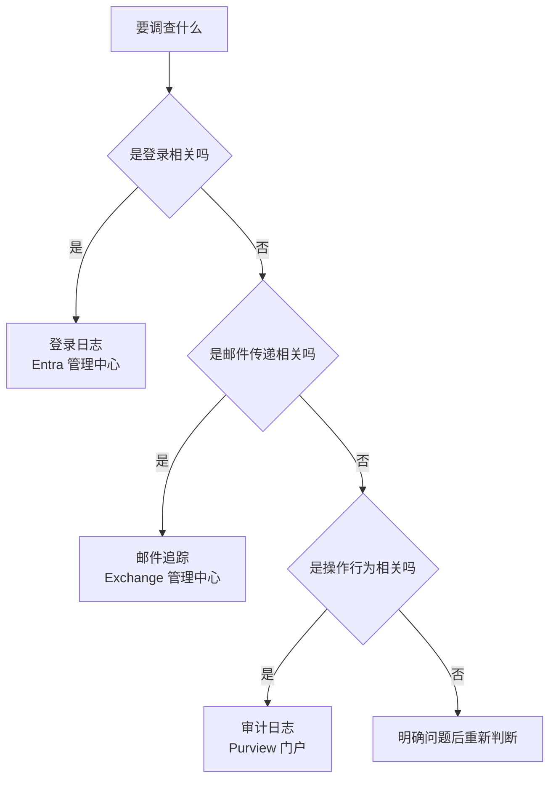
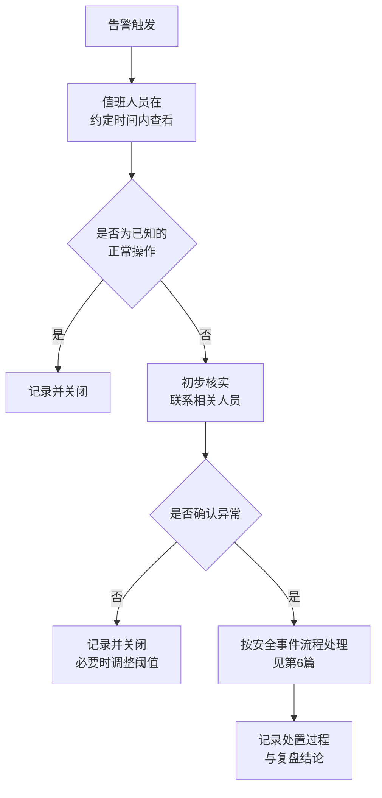

# 第5篇 安全合规与设备管理 · 第2节 日志、审计与告警

> **所属：** 第5篇 安全、合规与设备管理。  
> **本节小节：** 5.15 ～ 5.22。  
> **本节性质：** 可见性建设。**没有日志，前面所有安全措施都无法验证，事故也无法调查。**  
> **复核日期：** 2026-08-28。含审计日志默认保留期的具体数值，实施前请复核。  
> **前置条件：** 已完成[第1节](01-安全基线与账号保护.md)。  
> **导航：** [返回第5篇目录](README.md)｜上一节：[安全基线与账号保护](01-安全基线与账号保护.md)｜下一节：[保留策略与合规](03-保留策略与合规.md)

---

## 5.15 本节目标

完成本节后应当达到：

1. 分清三类日志各自的用途和查询位置。
2. 审计日志已开启，且**已实际查询验证**。
3. 知道日志保留多久，并判断是否满足企业的调查和合规要求。
4. 有可行动的告警配置和响应流程。

> **必做：** 本节最重要的动作不是"开启审计"，而是**实际做一次查询练习**。很多企业审计一直开着，但事故发生时才发现没人会查、或者需要的日志已经过期。

---

## 5.16 三类日志的区别（最容易混淆）

| 日志类型 | 记录什么 | 查询位置 | 典型用途 |
|---|---|---|---|
| **登录日志**（Entra ID） | 谁在什么时间从哪里登录、是否成功、命中哪条条件访问策略 | Entra 管理中心 | 账号被盗调查、MFA 问题排查、策略验证 |
| **审计日志**（统一审计） | 用户和管理员的**操作行为**：文件访问、共享、删除、邮箱规则变更、角色分配等 | Purview 门户 | 数据泄露调查、操作追溯、合规取证 |
| **邮件追踪** | 邮件的传递过程 | Exchange 管理中心 | 邮件去哪了（第3篇 3.37） |

### 5.16.1 按问题选日志

| 问题 | 用哪个日志 |
|---|---|
| "账号是不是被别人登录了？" | 登录日志 |
| "谁把这个文件共享给外部了？" | 审计日志 |
| "客户说邮件退回了" | 邮件追踪 |
| "谁给自己加了管理员角色？" | 审计日志 |
| "为什么用户被条件访问阻止？" | 登录日志 |
| "谁在邮箱里设置了自动转发？" | 审计日志 |
| "谁删除了这个团队？" | 审计日志 |

---

## 5.17 审计日志的开启与保留期

### 5.17.1 开启状态确认

- [ ] 确认统一审计**已开启**（多数订阅默认开启，但仍需确认）。
- [ ] 确认关键工作负载的审计记录可查（Exchange、SharePoint、Teams、Entra）。
- [ ] 确认查询权限已分配给需要的人（审计、安全、IT 负责人）。

### 5.17.2 保留期（关键数值）

| 项目 | 本方案（E3）的保留期 |
|---|---|
| **审计（标准）** | ✅ 默认保留 **180 天**（2023-10-17 之前生成的记录按 90 天）——**这就是本方案的上限** |
| 审计（高级） | ❌ **E3 不含**。它可把保留延长至最长 10 年，但需附加许可，本方案不采购 |
| Entra ID 审计与登录日志 | ✅ 约 **30 天**（E3 含 Entra ID P1；免费层仅约 7 天） |
| 邮件追踪 | 有自己的保留窗口，长期分析需导出（第3篇 3.38） |

> **高风险：** **180 天是硬约束。** 如果企业存在“需要追查一年前某个操作”的合规或审计要求（例如年度审计、劳动争议、长周期舞弊调查），E3 **无法满足**，必须靠 5.21 的**定期导出另存**来兜底。这件事要在项目期就定下来并落实到运维日历——**等到需要查的时候才发现日志已经过期，是不可逆的**。

> **必做：** 请业务、法务或审计负责人**书面确认** 180 天是否够用。若不够，两条路：(1) 按 5.21 建立导出机制（本方案选择）；(2) 采购 Purview 附加许可（本方案不采购，第1篇 1.26.5）。

官方说明见 [管理审计日志保留策略](https://learn.microsoft.com/en-us/purview/audit-log-retention-policies) 与 [开始使用审计解决方案](https://learn.microsoft.com/en-us/purview/audit-get-started)。

### 5.17.3 这个数值意味着什么

> **高风险：** 请对照企业的实际需求判断：
>
> | 场景 | 需要的回溯时长 | 标准审计（180 天）是否够 |
> |---|---|---|
> | 发现账号被盗后调查近期行为 | 数天到数周 | 够 |
> | 员工离职三个月后发现数据外泄 | 3～6 个月 | 勉强 |
> | 年度审计或合规检查 | 1 年以上 | **不够** |
> | 法律纠纷取证 | 可能数年 | **不够** |
> | Entra 登录日志的长期分析 | 超过 30 天 | **不够，需导出或高级能力** |
>
> 如果企业有超过 180 天的回溯需求，必须评估：升级到高级审计能力、配置更长的保留策略、或**定期导出日志到外部存储**。

### 5.17.4 三个必须决定的问题

- [ ] 企业需要回溯多久？（由合规、法务、审计部门确认）
- [ ] 当前保留期是否满足？如不满足，采用哪种方案？
- [ ] 谁负责定期检查审计功能仍在正常工作？

---

## 5.18 审计查询练习（本节核心动作）

> **必做：** 在项目期完成以下练习，并让**至少两名管理员**各自独立做一遍。

| 编号 | 练习 | 应掌握 |
|---|---|---|
| A1 | 查询某个用户在某天的全部活动 | 基础查询与筛选 |
| A2 | 查询"谁共享了某个文件给外部" | 共享类活动查询 |
| A3 | 查询"谁修改了邮箱转发设置" | 邮箱配置变更查询 |
| A4 | 查询"谁添加或移除了管理员角色" | 角色变更查询 |
| A5 | 查询"某个文件被谁删除了" | 删除类活动查询 |
| A6 | 查询"谁把用户添加到某个团队" | Teams 活动查询 |
| A7 | 查询"谁授权了某个第三方应用" | 应用同意查询 |
| A8 | 导出查询结果 | 取证与留档 |
| A9 | 在登录日志中定位一次被条件访问阻止的登录 | 登录日志判读（第2篇 2.114） |
| A10 | 判断某次异常登录的地点与设备 | 风险识别 |

### 5.18.1 练习后要回答的问题

- 查询一次大约需要多久？
- 结果是否足够清晰，能得出结论？
- 有没有需要但查不到的信息？（这决定是否需要更高级的能力）
- 导出的格式能否作为证据留档？

---

## 5.19 告警配置（只保留"可行动"的告警）

### 5.19.1 建议配置的告警

| 优先级 | 告警内容 | 为什么重要 |
|---|---|---|
| **最高** | **紧急访问账号登录** | 任何登录都应核实 |
| 最高 | 管理员角色被添加 | 权限提升是攻击的关键步骤 |
| 最高 | 检测到疑似账号泄露/异常登录 | 及时处置。**E3 无自动风险检测**，依靠登录日志巡检与用户报告发现（第6篇 6.45） |
| 高 | 新增邮箱外部自动转发 | 数据外泄的经典手法 |
| 高 | 大量文件被下载或删除 | 数据带走或勒索前兆 |
| 高 | 新增高权限的第三方应用授权 | 同意钓鱼 |
| 高 | 邮件安全策略被修改 | 有人在削弱防护 |
| 中 | 条件访问策略被修改 | 变更追溯 |
| 中 | 大量共享链接被创建 | 数据扩散 |
| 中 | 来宾账号被添加到敏感团队 | 越权访问 |

### 5.19.2 告警响应流程

| 要素 | 要求 |
|---|---|
| 值班人员 | 明确到人，含备份人 |
| 响应时限 | 按告警级别设定（例如最高级 1 小时内查看） |
| 升级路径 | 什么情况通知谁、什么情况联系 Microsoft 支持 |
| 记录 | 每个告警都要有处置记录 |
| 定期复盘 | 每月回顾告警数量与处置质量 |

> **必做：** 告警必须**测试**。至少验证最高优先级的几项确实能触发并送达（第1节 5.10）。

---

## 5.20 日志的日常使用场景

日志不只用于事故调查，日常也有价值：

| 场景 | 用法 |
|---|---|
| 验证安全措施是否生效 | 例如确认已无旧式认证成功登录 |
| 发现异常模式 | 非工作时间的批量操作、异常地点登录 |
| 支持排障 | 用户说"我没删除"，日志能给出事实 |
| 权限复核 | 谁实际访问过敏感站点 |
| 离职后核查 | 离职前是否有异常下载或共享 |
| 合规报告 | 提供操作记录 |

> **推荐：** 把"离职前 30 天的活动核查"加入离职流程（第6篇）。这能发现"离职前批量下载客户资料"这类行为，而且成本很低。

---

## 5.21 日志导出与长期保存（如需要）

如果企业的回溯需求超过默认保留期：

| 方案 | 说明 | 注意 |
|---|---|---|
| 升级审计能力 | 高级审计与更长保留 | ❌ **E3 不含，本方案不采购**；改用 5.21 的定期导出 |
| 定期导出 | 按周期导出日志到企业自有存储 | 需要脚本或工具、需保证导出可靠性 |
| 接入日志分析平台 | 集中存储与关联分析 | 成本与实施复杂度较高 |
| 第三方工具 | 由厂商提供长期存储 | 需评估合规与数据流向 |

### 5.21.1 若采用定期导出

- [ ] 明确导出范围、频率和存储位置。
- [ ] 导出任务要有**失败告警**（否则可能几个月没导出而无人知晓）。
- [ ] 存储位置要有访问控制和自身的备份。
- [ ] 定期验证导出的数据可用、可查询。
- [ ] 明确保存期限与销毁规则（与数据保护要求一致）。

> **高风险：** "我们有导出脚本"不等于"我们有日志"。请设定定期验证（例如每季度抽查一次导出文件能否正常打开和查询），否则很可能在需要时发现导出早已中断。

---

## 5.22 本节完成检查表

- [ ] 已分清登录日志、审计日志、邮件追踪三者的用途和查询位置。
- [ ] "按问题选日志"对照表已交付服务台和安全负责人。
- [ ] 统一审计已确认开启，关键工作负载的记录可查。
- [ ] 查询权限已分配给审计、安全和 IT 负责人。
- [ ] 已确认审计（标准）默认保留 **180 天**，以及 Entra 日志的较短保留期。
- [ ] **已由合规/法务/审计确认企业需要的回溯时长**。
- [ ] 若默认保留期不足：已确定方案（升级能力 / 定期导出 / 日志平台）并落实。
- [ ] 若采用定期导出：范围、频率、存储、**失败告警**和定期验证已配置。
- [ ] 审计查询练习 A1～A10 已由至少两名管理员各自完成。
- [ ] 练习后已评估：查询效率、结果清晰度、是否存在查不到的关键信息。
- [ ] 告警清单已配置，且只保留可行动的告警。
- [ ] **最高优先级告警已实测触发并确认送达。**
- [ ] 告警响应流程已明确：值班人、响应时限、升级路径、记录要求。
- [ ] 已建立告警月度复盘机制。
- [ ] 已把"离职前活动核查"纳入离职流程待办（第6篇）。
- [ ] 已明确谁负责定期检查审计功能仍在正常工作。

> **进入下一节的条件：** 审计可查询、告警已验证。下一节处理**保留策略与合规**——决定数据保存多久、能否取证，以及敏感数据如何保护。
