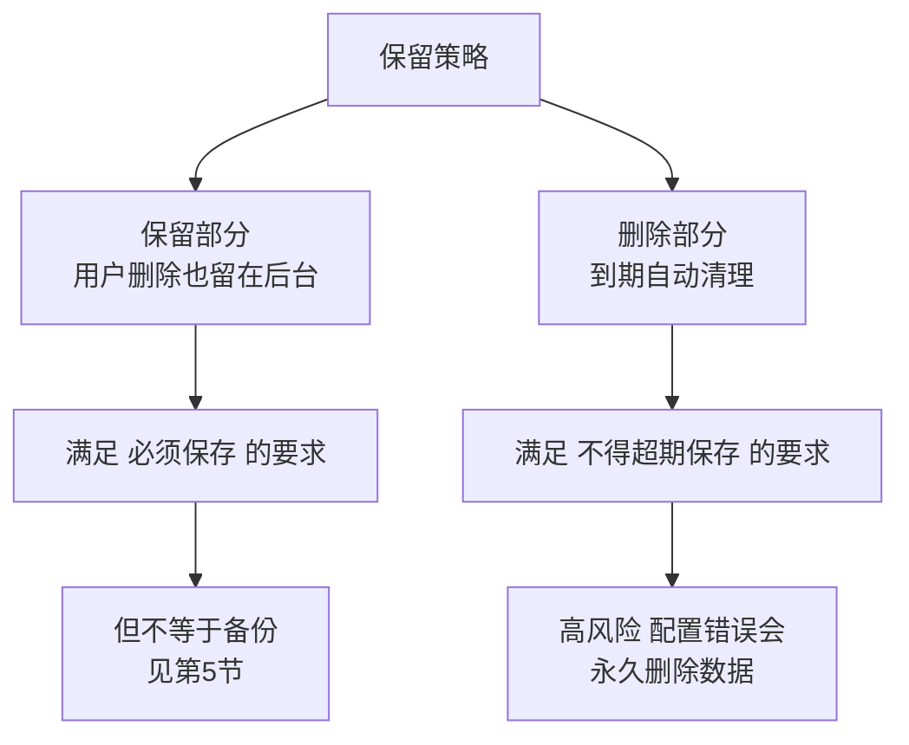
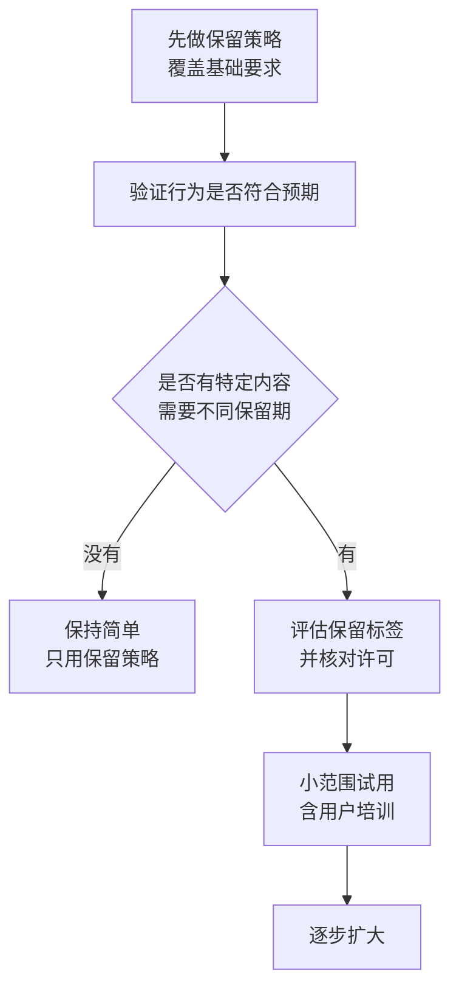
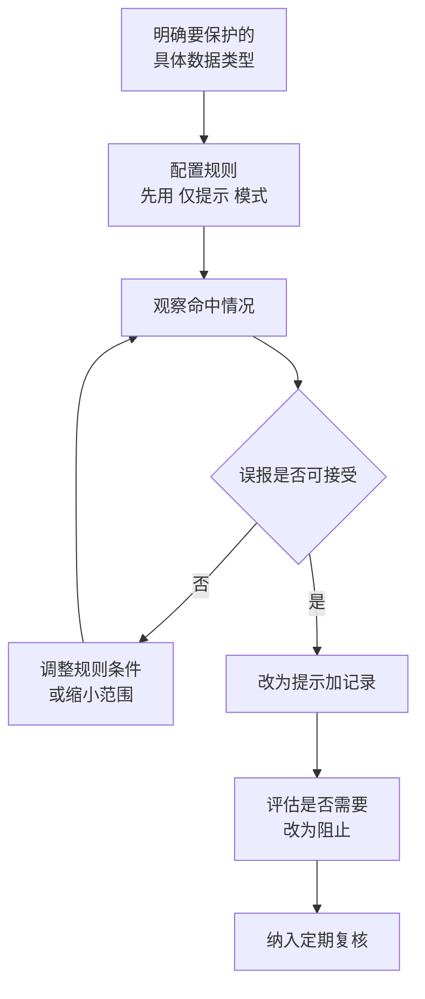

# 第5篇 安全合规与设备管理 · 第3节 保留策略与合规

> **所属：** 第5篇 安全、合规与设备管理。  
> **本节小节：** 5.23 ～ 5.35。  
> **本节性质：** 合规配置。**保留策略是"删不掉也留不住"两类风险的分界线**，配置错误可能造成数据被永久删除或该删的删不掉。  
> **前置条件：** 已完成[第2节](02-日志审计与告警.md)；第1篇 1.18 的保留需求调查已完成。  
> **导航：** [返回第5篇目录](README.md)｜上一节：[日志、审计与告警](02-日志审计与告警.md)｜下一节：[设备管理与 Intune](04-设备管理与Intune.md)

---

## 5.23 本节目标

完成本节后应当达到：

1. 分清保留、删除、备份、法务保留四个概念。
2. 有一份**由业务和法务确认**的保留需求表。
3. 保留策略已配置并验证行为符合预期。
4. 按许可情况评估并规划敏感度标签、DLP 和电子数据展示。

> **必做：** 保留要求**必须由业务、法务、财务和 HR 提出**，IT 只负责实现。IT 自行决定"邮件保留 3 年"是越权，也可能违反行业要求。

---

## 5.24 四个概念的区别（必须先讲清）

| 概念 | 作用 | 解决什么 | 不解决什么 |
|---|---|---|---|
| **保留（Retain）** | 强制**保存**内容，即使用户删除 | 合规要求"必须留存" | 不提供"恢复到任意时间点" |
| **删除（Delete）** | 到期后**自动删除**内容 | 合规要求"不得超期保存" | 不能替代日常清理 |
| **法务保留（Litigation Hold）** | 对特定邮箱冻结内容 | 诉讼或调查期间防止销毁 | 不是全组织的长期方案 |
| **备份（Backup）** | 独立副本 + 指定恢复点 | 误删、勒索、批量恢复 | 不满足"必须删除"的合规要求 |

### 5.24.1 保留策略的双向作用

> **高风险：** 保留策略中的**删除动作是不可逆的**。配置错误（例如把"保留 3 年后删除"误设为"3 天后删除"）会造成大规模数据永久丢失。**必须先在小范围测试并验证行为。**

---

## 5.25 保留需求表（本节核心交付物）

由业务方填写，IT 协助整理：

| 数据类型 | 保留要求 | 依据（法规/合同/内部制度） | 提出部门 | 确认人 | 到期后如何处理 |
|---|---|---|---|---|---|
| 员工邮件（一般） | 待填写 | 待填写 | 待填写 | 待填写 | 待填写 |
| 财务相关邮件与文件 | 待填写 | 财务/税务要求 | 财务 | 待填写 | 待填写 |
| 合同与法律文件 | 待填写 | 法务要求 | 法务 | 待填写 | 待填写 |
| 人事档案 | 待填写 | 劳动与个人信息要求 | HR | 待填写 | 待填写 |
| 客户资料 | 待填写 | 合同/个人信息保护 | 销售 | 待填写 | 待填写 |
| Teams 聊天记录 | 待填写 | 内部制度 | 待填写 | 待填写 | 待填写 |
| 会议录制 | 待填写 | 内部制度（第4篇 4.55） | 待填写 | 待填写 | 待填写 |
| SharePoint 文件 | 待填写 | 按站点分类 | 待填写 | 待填写 | 待填写 |
| 个人 OneDrive | 待填写 | 内部制度 | 待填写 | 待填写 | 待填写 |
| 离职员工数据 | 待填写 | 内部 + 合规 | HR + 法务 | 待填写 | 待填写 |
| 审计日志 | 待填写 | 第2节 5.17 已讨论 | 审计 | 待填写 | 待填写 |

### 5.25.1 填表时必须问清的四个问题

1. **法律或合同依据是什么？**（不能只说"越久越好"）
2. **保留期从什么时间点开始算？**（创建时间？最后修改时间？）
3. **到期后是必须删除，还是可以继续保留？**（这决定用"保留"还是"保留后删除"）
4. **是否存在必须立即响应的调查场景？**（决定是否需要法务保留和电子数据展示能力）

> **必做：** "越久越好"和"都保留着吧"不是有效需求。无限期保留会带来存储成本、检索困难，以及**个人信息保护方面的合规风险**（该删的没删也是问题）。

---

## 5.26 保留策略与保留标签的区别

| 项目 | 保留策略 | 保留标签 |
|---|---|---|
| 应用方式 | 按**位置**批量应用（如全部邮箱、全部站点） | 按**内容**应用（贴在具体文件或邮件上） |
| 粒度 | 粗 | 细 |
| 谁应用 | 管理员 | 管理员自动应用或用户手工应用 |
| 适合 | 全组织的基础保留要求 | 特定类型内容（合同、财务凭证） |
| 复杂度 | 低 | 较高（需分类和培训） |

### 5.26.1 建议路径

> **推荐：** 新手企业**先用保留策略把基础要求覆盖住**，不要一上来就设计复杂的标签体系。标签需要用户配合和分类规则，实施成本高，做不好会形成"标签一片空白"的局面。

---

## 5.27 配置保留策略的纪律

| 纪律 | 说明 |
|---|---|
| **先小范围测试** | 用测试邮箱和测试站点验证行为 |
| 验证"保留"效果 | 删除内容后确认后台仍可检索到 |
| 验证"删除"效果 | 到期删除的行为是否符合预期 |
| 从"只保留"开始 | 先不加删除动作，观察一段时间 |
| 记录配置 | 范围、期限、动作、依据、批准人 |
| 变更走流程 | 修改保留策略属于高风险变更 |
| 注意策略叠加 | 多条策略同时适用时，通常**最长保留优先，但删除类要特别注意** |
| 与其他机制的关系 | 例如 Teams 录制过期与保留策略同时存在时，**较早触发删除的一方生效**（第4篇 4.55） |

### 5.27.1 用户可见性

> **必做：** 向用户说明：
>
> - 有些内容即使"删除"了，也会在后台按合规要求保留一段时间。
> - 这不是"公司在偷看"，而是法规和审计要求。
> - 员工不应把个人隐私内容存放在公司系统中。
>
> 提前说明能避免"为什么我删了还在"的误解和不信任。

---

## 5.28 离职员工数据的保留

这是保留策略中**最常出问题**的场景。

| 问题 | 说明 |
|---|---|
| 邮箱删除过早 | 后续需要查历史往来时已无法恢复 |
| OneDrive 保留期太短 | 默认 30 天（第4篇 4.117），往往不够 |
| 许可被回收导致数据进入删除流程 | 回收许可前必须确认数据处理方式 |
| 保留策略与账号删除的关系 | 有保留要求时，账号删除后内容仍受保留策略约束 |

### 5.28.1 建议做法

- [ ] 明确离职后**邮箱保留多久**（可转为共享邮箱或保留在受保留策略约束的状态）。
- [ ] 明确 **OneDrive 保留天数**的设置值（第4篇 4.117）。
- [ ] 明确谁负责在保留期内取走需要的文件。
- [ ] 明确**存在诉讼或调查时禁止删除**的判断和执行流程。
- [ ] 把上述内容写进离职流程（第6篇）。

> **高风险：** 保留要求与"及时删除个人数据"的要求可能冲突。遇到冲突时应由法务判断，并把结论文档化，而不是由 IT 自行决定。

---

## 5.29 法务保留与电子数据展示（按需与许可）

| 能力 | 作用 | 何时需要 |
|---|---|---|
| **法务保留** | 冻结特定邮箱内容，防止删除 | 诉讼、劳动争议、内部调查 |
| **电子数据展示（基础）** | 跨位置搜索并导出内容 | 一般取证需求 |
| 电子数据展示（高级） | 案件管理、更强的处理能力 | 复杂案件（需更高许可） |

### 5.29.1 项目期需要做的事

- [ ] 确认企业是否有可预见的诉讼或调查需求。
- [ ] 确认当前许可包含哪种级别的能力（第1节 5.13）。
- [ ] 明确**谁有权发起法务保留和搜索**（权限敏感，不应人人可用）。
- [ ] 明确操作需要什么审批（通常需要法务书面要求）。
- [ ] 做一次搜索练习，确认流程可执行。

> **必做：** 法务保留和内容搜索能查看全组织的邮件与文件，属于**极高敏感权限**。必须限定人员、要求审批、并纳入审计（第2节）。

---

## 5.30 敏感度标签（按许可评估）

### 5.30.1 作用

给文件和邮件贴上分类标记（如"内部""机密""绝密"），并可附加保护措施（加密、限制转发、水印等）。

| 价值 | 说明 |
|---|---|
| 分类可见 | 用户知道手里是什么级别的内容 |
| 可附加保护 | 加密后即使文件外流也难以打开 |
| 持续保护 | 保护随文件走，离开企业环境仍生效 |
| 支持自动化 | 可按内容自动建议或应用标签 |

### 5.30.2 实施难点（务实提醒）

| 难点 | 说明 |
|---|---|
| 分类体系设计 | 层级太多用户不会用；太少没有区分意义 |
| 用户培训 | 需要用户理解并愿意打标签 |
| 与外部协作 | 加密文件发给外部可能打不开 |
| 与业务系统集成 | 加密文件可能无法被某些系统处理 |
| 打印与转换 | 需测试实际业务流程 |

> **推荐：** 如果企业要做标签，**从 3 个级别起步**（例如：公开 / 内部 / 机密），先只做"分类可见"不加强制加密，观察用户接受度后再逐步增加保护措施。一次性上复杂体系几乎必然失败。

---

## 5.31 数据防泄漏 DLP（按许可评估）

### 5.31.1 作用

检测并阻止敏感内容外发。例如：邮件中包含大量身份证号时阻止发送或提示。

| 常见规则 | 说明 |
|---|---|
| 个人身份信息外发 | 身份证号、银行卡号等 |
| 财务数据外发 | 报表、账号信息 |
| 大批量客户资料外发 | 离职带走客户名单 |
| 向个人邮箱发送公司文件 | 数据外流 |
| 敏感标签内容的外部共享 | 与标签联动 |

### 5.31.2 实施纪律

> **必做：** DLP **绝不能一上线就设为"阻止"**。误报会直接打断业务（例如阻止财务发送正常报表）。正确路径是：仅记录 → 提示用户 → 才考虑阻止。

### 5.31.3 中国企业的实际提醒

- 个人信息保护相关要求应由**法务确认适用范围**，IT 按结论实现。
- 内置的敏感信息类型（如某些国家的证件号格式）需要**实测识别效果**，不要假设开箱即准。
- 涉及员工个人数据的监测应确认合法性和告知义务。

---

## 5.32 与前面各篇的合规联动

| 前面已做 | 本节联动 |
|---|---|
| 第3篇 邮件保留与归档 | 纳入保留策略 |
| 第4篇 Teams 录制过期 | 与保留策略的关系已确认 |
| 第4篇 共享链接治理 | 敏感站点可加标签与 DLP |
| 第4篇 离职交接 | 保留期与删除时点已明确 |
| 第2节 审计日志 | 保留期是否满足取证需求 |

---

## 5.33 合规配置记录表

| 编号 | 配置项 | 范围 | 期限/动作 | 依据 | 批准人 | 测试结果 | 状态 |
|---|---|---|---|---|---|---|---|
| C1 | 邮件保留策略 | 全部邮箱 | 待填写 | 待填写 | 待填写 | 待测试 | ☐ |
| C2 | 文件保留策略 | 指定站点 | 待填写 | 待填写 | 待填写 | 待测试 | ☐ |
| C3 | Teams 聊天保留 | 全部用户 | 待填写 | 待填写 | 待填写 | 待测试 | ☐ |
| C4 | 离职邮箱保留 | 离职账号 | 待填写 | 待填写 | 待填写 | 待测试 | ☐ |
| C5 | OneDrive 保留天数 | 全局设置 | 待填写 | 待填写 | 待填写 | 待确认 | ☐ |
| C6 | 审计日志保留 | 全局 | 待填写 | 待填写 | 待填写 | 待确认 | ☐ |
| C7 | 敏感度标签（如实施） | 待定 | 待填写 | 待填写 | 待填写 | 待测试 | ☐ |
| C8 | DLP 规则（如实施） | 待定 | 待填写 | 待填写 | 待填写 | 待测试 | ☐ |

---

## 5.34 常见误区

| 误区 | 事实 |
|---|---|
| "有保留策略就等于有备份" | 保留不提供"恢复到任意时间点"，也不便于批量恢复（见第5节） |
| "保留越久越安全" | 超期保存个人信息本身可能违规，还增加成本和检索难度 |
| "IT 决定保留多久" | 应由业务、法务、财务、HR 提出要求 |
| "配置完就不用管了" | 需定期验证行为、复核依据变化 |
| "DLP 打开就能防泄漏" | 误报会打断业务；需渐进实施 |
| "标签能解决所有分类问题" | 需要用户配合和培训，体系过复杂必然失败 |
| "删除策略很安全，反正能恢复" | **删除动作通常不可逆**，必须先测试 |

---

## 5.35 本节完成检查表

- [ ] 已分清保留、删除、法务保留、备份四个概念，并向管理层说明差异。
- [ ] **保留需求表已由业务、法务、财务、HR 填写并确认**（IT 未自行决定）。
- [ ] 每项需求都有法律或合同依据，并明确起算时间点和到期处理方式。
- [ ] 已确认是否存在必须立即响应的调查场景。
- [ ] 已决定采用保留策略（基础）还是同时使用保留标签，并说明理由。
- [ ] 保留策略已**先在小范围测试**，"保留"和"删除"行为均已验证。
- [ ] 首次实施采用"只保留、暂不删除"的稳妥路径。
- [ ] 已确认策略叠加规则，以及与 Teams 录制过期等机制的先后关系。
- [ ] 已向用户说明"删除后仍可能被保留"的原因，避免误解。
- [ ] 离职员工的邮箱保留期、OneDrive 保留天数、取数据责任人已明确。
- [ ] 保留要求与个人数据删除要求的冲突已由法务判断并文档化。
- [ ] 法务保留与内容搜索的权限已限定到少数人，并要求审批、纳入审计。
- [ ] 已完成一次内容搜索练习，确认流程可执行。
- [ ] 若实施敏感度标签：从少量级别起步，先分类后保护，已做用户培训与业务流程测试。
- [ ] 若实施 DLP：**从仅记录/提示模式开始**，误报已调优，未直接设为阻止。
- [ ] 内置敏感信息类型的识别效果已实测（不假设开箱即准）。
- [ ] 涉及员工个人数据的监测已确认合法性与告知义务。
- [ ] 合规配置记录表 C1～C8 已填写，含依据、批准人和测试结果。
- [ ] 已明确定期复核机制（依据变化、行为验证）。

> **进入下一节的条件：** 保留需求已确认、策略已测试。下一节处理**设备管理与 Intune**——决定公司数据在什么设备上、以什么条件被访问。
